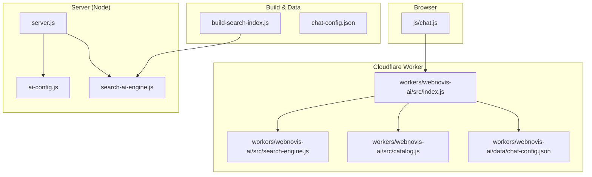
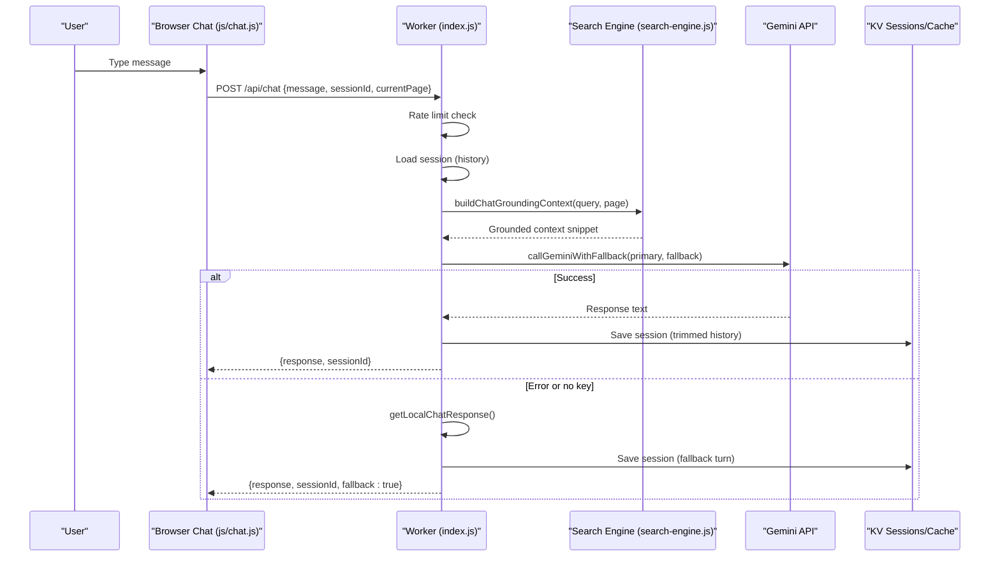
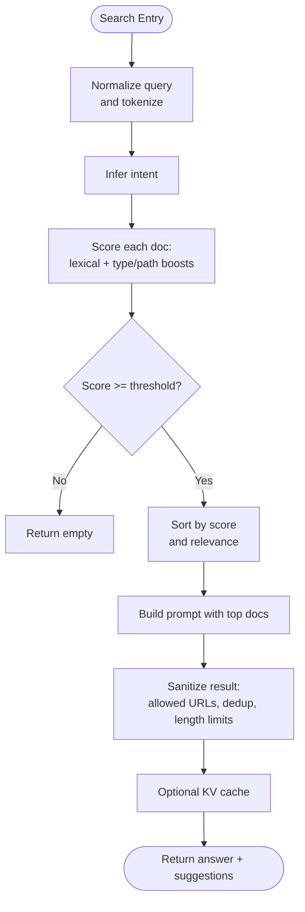
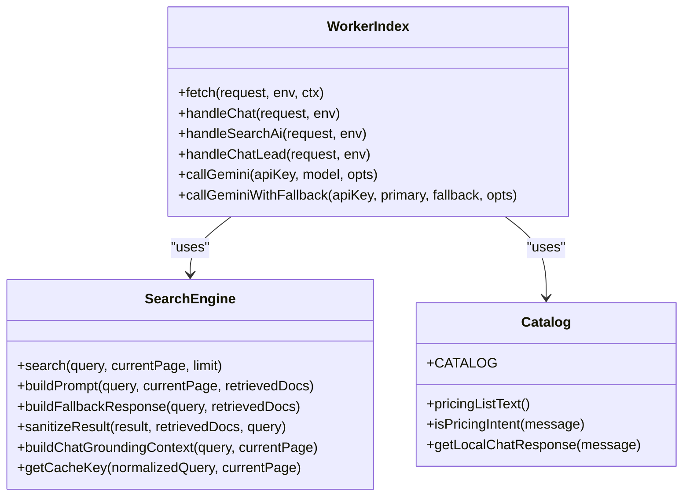
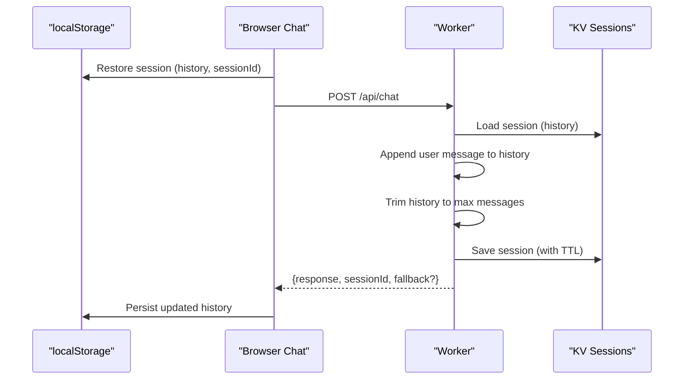
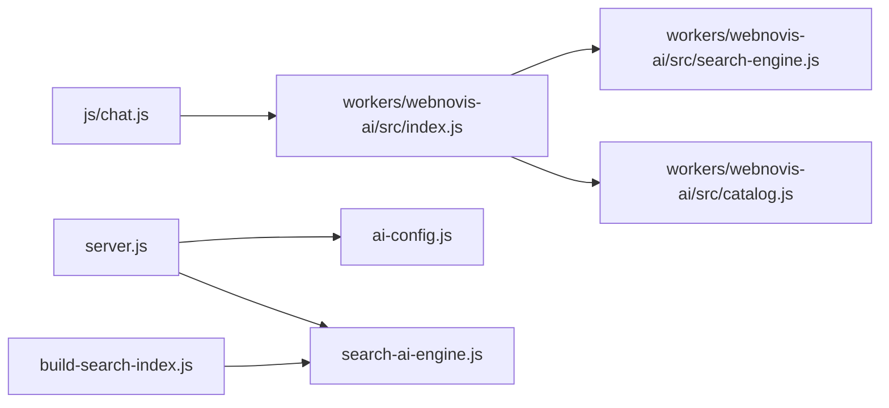

# AI Integration System

<cite>
**Referenced Files in This Document**
- [ai-config.js](file://ai-config.js)
- [chat-config.json](file://chat-config.json)
- [search-ai-engine.js](file://search-ai-engine.js)
- [workers/webnovis-ai/src/index.js](file://workers/webnovis-ai/src/index.js)
- [workers/webnovis-ai/src/search-engine.js](file://workers/webnovis-ai/src/search-engine.js)
- [workers/webnovis-ai/data/chat-config.json](file://workers/webnovis-ai/data/chat-config.json)
- [workers/webnovis-ai/src/catalog.js](file://workers/webnovis-ai/src/catalog.js)
- [js/chat.js](file://js/chat.js)
- [build-search-index.js](file://build-search-index.js)
- [wrangler.jsonc](file://wrangler.jsonc)
- [server.js](file://server.js)
- [scripts/generate-ai-content.js](file://scripts/generate-ai-content.js)
- [blog/auto-writer.js](file://blog/auto-writer.js)
- [docs/chatbot/MODELLI-AI.md](file://docs/chatbot/MODELLI-AI.md)
</cite>

## Table of Contents
1. [Introduction](#introduction)
2. [Project Structure](#project-structure)
3. [Core Components](#core-components)
4. [Architecture Overview](#architecture-overview)
5. [Detailed Component Analysis](#detailed-component-analysis)
6. [Dependency Analysis](#dependency-analysis)
7. [Performance Considerations](#performance-considerations)
8. [Troubleshooting Guide](#troubleshooting-guide)
9. [Conclusion](#conclusion)
10. [Appendices](#appendices)

## Introduction
This document explains the AI integration system powering WebNovis’s chatbot and intelligent search. It covers:
- Chatbot conversation memory, context management, and response generation using Google Gemini
- Intelligent search with semantic understanding, weighted scoring, and caching
- AI model configuration, error handling, and fallback mechanisms when AI services are unavailable
- Worker-based AI processing for edge deployment on Cloudflare Workers
- Practical examples from the codebase for configuring models, handling API responses, and implementing custom logic
- Common issues such as API rate limits, timeouts, and response quality optimization

The goal is to make this accessible to beginners while providing enough technical depth for experienced developers building or extending AI features.

## Project Structure
At a high level, the AI system spans:
- Configuration files for models and chat behavior
- A server-side search engine that builds a corpus and ranks pages
- A Cloudflare Worker exposing endpoints for chat, search, and lead capture
- A browser-based chat widget with retry logic, session persistence, and local fallbacks
- Build scripts that generate search indexes used by both client and server components

**Diagram sources**
- [js/chat.js:1-120](file://js/chat.js#L1-L120)
- [workers/webnovis-ai/src/index.js:1-120](file://workers/webnovis-ai/src/index.js#L1-L120)
- [workers/webnovis-ai/src/search-engine.js:1-120](file://workers/webnovis-ai/src/search-engine.js#L1-L120)
- [workers/webnovis-ai/src/catalog.js:1-60](file://workers/webnovis-ai/src/catalog.js#L1-L60)
- [workers/webnovis-ai/data/chat-config.json:1-109](file://workers/webnovis-ai/data/chat-config.json#L1-L109)
- [server.js:689-716](file://server.js#L689-L716)
- [ai-config.js:1-37](file://ai-config.js#L1-L37)
- [search-ai-engine.js:1-120](file://search-ai-engine.js#L1-L120)
- [build-search-index.js:1-60](file://build-search-index.js#L1-L60)

**Section sources**
- [js/chat.js:1-120](file://js/chat.js#L1-L120)
- [workers/webnovis-ai/src/index.js:1-120](file://workers/webnovis-ai/src/index.js#L1-L120)
- [workers/webnovis-ai/src/search-engine.js:1-120](file://workers/webnovis-ai/src/search-engine.js#L1-L120)
- [workers/webnovis-ai/src/catalog.js:1-60](file://workers/webnovis-ai/src/catalog.js#L1-L60)
- [workers/webnovis-ai/data/chat-config.json:1-109](file://workers/webnovis-ai/data/chat-config.json#L1-L109)
- [server.js:689-716](file://server.js#L689-L716)
- [ai-config.js:1-37](file://ai-config.js#L1-L37)
- [search-ai-engine.js:1-120](file://search-ai-engine.js#L1-L120)
- [build-search-index.js:1-60](file://build-search-index.js#L1-L60)

## Core Components
- AI Model Configuration: Centralized model selection and parameters for chat, search, and writer roles, including fallback models and token limits.
- Search Engine: Token/intent hybrid ranking over a built corpus, producing prompts and grounded answers for Gemini.
- Worker Endpoints: /api/chat, /api/search-ai, /api/chat-lead with rate limiting, CORS, session storage, and fallbacks.
- Browser Chat Widget: UI with retries, adaptive typing, session persistence, and offline guidance.
- Build Pipeline: Generates public and private search indexes consumed by client and worker.

**Section sources**
- [ai-config.js:1-37](file://ai-config.js#L1-L37)
- [search-ai-engine.js:149-230](file://search-ai-engine.js#L149-L230)
- [workers/webnovis-ai/src/index.js:266-440](file://workers/webnovis-ai/src/index.js#L266-L440)
- [js/chat.js:430-580](file://js/chat.js#L430-L580)
- [build-search-index.js:292-325](file://build-search-index.js#L292-L325)

## Architecture Overview
The system uses Google Gemini for chat and search with robust fallbacks:
- The browser widget sends messages to the Cloudflare Worker.
- The Worker retrieves or creates a session, optionally grounds the query with the search engine, calls Gemini with primary/fallback models, and persists history.
- Search queries are ranked via a token/intent algorithm; results are sanitized and cached.
- If Gemini is unavailable or returns errors, the Worker falls back to curated local responses and safe suggestions.

**Diagram sources**
- [js/chat.js:430-580](file://js/chat.js#L430-L580)
- [workers/webnovis-ai/src/index.js:141-196](file://workers/webnovis-ai/src/index.js#L141-L196)
- [workers/webnovis-ai/src/index.js:198-247](file://workers/webnovis-ai/src/index.js#L198-L247)
- [workers/webnovis-ai/src/index.js:266-368](file://workers/webnovis-ai/src/index.js#L266-L368)
- [workers/webnovis-ai/src/search-engine.js:351-367](file://workers/webnovis-ai/src/search-engine.js#L351-L367)

## Detailed Component Analysis

### AI Model Configuration
- Centralized model names and parameters for chat, search, and writer roles.
- Supports separate API keys per service to distribute usage across free tiers.
- Includes temperature, max tokens, conversation memory, and fallback toggles.

Key behaviors:
- Primary models use faster, lower-cost variants where appropriate.
- Fallback models provide resilience during outages or rate limits.
- Conversation memory caps ensure bounded context windows.

**Section sources**
- [ai-config.js:1-37](file://ai-config.js#L1-L37)
- [docs/chatbot/MODELLI-AI.md:1-54](file://docs/chatbot/MODELLI-AI.md#L1-L54)

### Intelligent Search Engine
- Builds a corpus from HTML content, normalizes text, tokenizes, and infers user intent (pricing, contact, portfolio, about, informational, local, commercial).
- Scores documents using lexical matches across title, URL, description, headings, content, plus type and path boosts.
- Produces prompts for Gemini with strict JSON formatting instructions and sanitizes outputs to allowed URLs.
- Caches search results via KV for repeated queries.

**Diagram sources**
- [search-ai-engine.js:149-230](file://search-ai-engine.js#L149-L230)
- [search-ai-engine.js:232-362](file://search-ai-engine.js#L232-L362)
- [workers/webnovis-ai/src/search-engine.js:107-219](file://workers/webnovis-ai/src/search-engine.js#L107-L219)
- [workers/webnovis-ai/src/search-engine.js:221-349](file://workers/webnovis-ai/src/search-engine.js#L221-L349)

**Section sources**
- [search-ai-engine.js:149-230](file://search-ai-engine.js#L149-L230)
- [search-ai-engine.js:232-362](file://search-ai-engine.js#L232-L362)
- [workers/webnovis-ai/src/search-engine.js:107-219](file://workers/webnovis-ai/src/search-engine.js#L107-L219)
- [workers/webnovis-ai/src/search-engine.js:221-349](file://workers/webnovis-ai/src/search-engine.js#L221-L349)

### Worker-Based AI Processing (Edge Deployment)
- Exposes endpoints:
  - /api/chat: Chat with conversation memory, grounding, and fallbacks
  - /api/search-ai: Search with retrieval-augmented prompting and caching
  - /api/chat-lead: Capture leads and send notifications
- Implements rate limiting per IP, CORS handling, injection protection, and KV-backed sessions/cache.
- Uses primary and fallback Gemini models with automatic retries on transient errors.

**Diagram sources**
- [workers/webnovis-ai/src/index.js:198-247](file://workers/webnovis-ai/src/index.js#L198-L247)
- [workers/webnovis-ai/src/index.js:266-440](file://workers/webnovis-ai/src/index.js#L266-L440)
- [workers/webnovis-ai/src/search-engine.js:188-379](file://workers/webnovis-ai/src/search-engine.js#L188-L379)
- [workers/webnovis-ai/src/catalog.js:1-134](file://workers/webnovis-ai/src/catalog.js#L1-L134)

**Section sources**
- [workers/webnovis-ai/src/index.js:141-196](file://workers/webnovis-ai/src/index.js#L141-L196)
- [workers/webnovis-ai/src/index.js:198-247](file://workers/webnovis-ai/src/index.js#L198-L247)
- [workers/webnovis-ai/src/index.js:266-440](file://workers/webnovis-ai/src/index.js#L266-L440)
- [workers/webnovis-ai/src/search-engine.js:188-379](file://workers/webnovis-ai/src/search-engine.js#L188-L379)
- [workers/webnovis-ai/src/catalog.js:1-134](file://workers/webnovis-ai/src/catalog.js#L1-L134)

### Chatbot Implementation and Conversation Memory
- Session persistence:
  - Server-side: KV stores trimmed history with TTL
  - Client-side: localStorage persists recent history and sessionId
- Context management:
  - Grounding enriches chat prompts with relevant site content
  - History is limited to avoid excessive token usage
- Response generation:
  - Primary model with configurable temperature and max tokens
  - Fallback to curated local responses if API unavailable or errors occur

**Diagram sources**
- [js/chat.js:603-644](file://js/chat.js#L603-L644)
- [workers/webnovis-ai/src/index.js:178-196](file://workers/webnovis-ai/src/index.js#L178-L196)
- [workers/webnovis-ai/src/index.js:288-368](file://workers/webnovis-ai/src/index.js#L288-L368)

**Section sources**
- [js/chat.js:430-580](file://js/chat.js#L430-L580)
- [js/chat.js:603-644](file://js/chat.js#L603-L644)
- [workers/webnovis-ai/src/index.js:178-196](file://workers/webnovis-ai/src/index.js#L178-L196)
- [workers/webnovis-ai/src/index.js:288-368](file://workers/webnovis-ai/src/index.js#L288-L368)

### Intelligent Search with Semantic Understanding
- Normalization and tokenization remove noise and unify terms
- Intent inference directs weighting toward service pages, contacts, portfolio, or local pages
- Weighted scoring combines exact matches, token presence, and contextual boosts
- Prompt construction enforces JSON-only output and restricts links to known pages
- Result sanitization ensures safety and consistency

**Section sources**
- [search-ai-engine.js:14-63](file://search-ai-engine.js#L14-L63)
- [search-ai-engine.js:149-230](file://search-ai-engine.js#L149-L230)
- [search-ai-engine.js:232-362](file://search-ai-engine.js#L232-L362)
- [workers/webnovis-ai/src/search-engine.js:56-65](file://workers/webnovis-ai/src/search-engine.js#L56-L65)
- [workers/webnovis-ai/src/search-engine.js:107-219](file://workers/webnovis-ai/src/search-engine.js#L107-L219)
- [workers/webnovis-ai/src/search-engine.js:221-349](file://workers/webnovis-ai/src/search-engine.js#L221-L349)

### AI Model Configuration System
- Centralized model selection and parameters for different roles
- Separate API keys per service to distribute usage
- Temperature and token limits tuned for responsiveness and cost control
- Fallback models configured for resilience

**Section sources**
- [ai-config.js:1-37](file://ai-config.js#L1-L37)
- [docs/chatbot/MODELLI-AI.md:1-54](file://docs/chatbot/MODELLI-AI.md#L1-L54)

### Error Handling Patterns and Fallback Mechanisms
- Worker-level:
  - Detects retryable errors (rate limits, server errors) and switches to fallback model
  - Falls back to curated local responses when API keys missing or requests fail
  - Enforces input validation and injection protection
- Browser-level:
  - Retries with exponential backoff and adaptive timeouts
  - Shows degraded mode banner when fallback is used
  - Persists session state and handles network errors gracefully

**Section sources**
- [workers/webnovis-ai/src/index.js:198-247](file://workers/webnovis-ai/src/index.js#L198-L247)
- [workers/webnovis-ai/src/index.js:266-368](file://workers/webnovis-ai/src/index.js#L266-L368)
- [js/chat.js:481-580](file://js/chat.js#L481-L580)
- [js/chat.js:504-531](file://js/chat.js#L504-L531)

### Worker-Based AI Processing for Edge Scenarios
- Rate limiting per IP with KV-backed counters
- CORS handling for cross-origin access
- Health endpoint for monitoring
- Lead capture with optional email notification

**Section sources**
- [workers/webnovis-ai/src/index.js:141-151](file://workers/webnovis-ai/src/index.js#L141-L151)
- [workers/webnovis-ai/src/index.js:80-116](file://workers/webnovis-ai/src/index.js#L80-L116)
- [workers/webnovis-ai/src/index.js:442-506](file://workers/webnovis-ai/src/index.js#L442-L506)
- [wrangler.jsonc:1-30](file://wrangler.jsonc#L1-L30)

### Concrete Examples from the Codebase
- Configure different AI models:
  - Set primary and fallback models for chat and search in centralized config and worker constants
  - Use separate API keys per service to distribute usage
- Handle API responses:
  - Parse JSON responses, enforce constraints, and sanitize outputs
  - Implement retry logic and fallbacks on transient errors
- Implement custom response logic:
  - Curated local responses for pricing, services, and contact intents
  - Ground chat with search results to improve relevance

**Section sources**
- [ai-config.js:1-37](file://ai-config.js#L1-L37)
- [workers/webnovis-ai/src/index.js:12-24](file://workers/webnovis-ai/src/index.js#L12-L24)
- [workers/webnovis-ai/src/catalog.js:57-134](file://workers/webnovis-ai/src/catalog.js#L57-L134)
- [workers/webnovis-ai/src/index.js:198-247](file://workers/webnovis-ai/src/index.js#L198-L247)
- [workers/webnovis-ai/src/index.js:266-368](file://workers/webnovis-ai/src/index.js#L266-L368)

## Dependency Analysis
- Browser chat depends on worker endpoints and local fallbacks
- Worker depends on search engine for retrieval-augmented prompting and catalog for local responses
- Server-side search engine mirrors worker logic for Node environments
- Build script generates indexes consumed by both client and server components

**Diagram sources**
- [js/chat.js:1-120](file://js/chat.js#L1-L120)
- [workers/webnovis-ai/src/index.js:1-120](file://workers/webnovis-ai/src/index.js#L1-L120)
- [workers/webnovis-ai/src/search-engine.js:1-120](file://workers/webnovis-ai/src/search-engine.js#L1-L120)
- [workers/webnovis-ai/src/catalog.js:1-60](file://workers/webnovis-ai/src/catalog.js#L1-L60)
- [server.js:689-716](file://server.js#L689-L716)
- [ai-config.js:1-37](file://ai-config.js#L1-L37)
- [search-ai-engine.js:1-120](file://search-ai-engine.js#L1-L120)
- [build-search-index.js:1-60](file://build-search-index.js#L1-L60)

**Section sources**
- [js/chat.js:1-120](file://js/chat.js#L1-L120)
- [workers/webnovis-ai/src/index.js:1-120](file://workers/webnovis-ai/src/index.js#L1-L120)
- [workers/webnovis-ai/src/search-engine.js:1-120](file://workers/webnovis-ai/src/search-engine.js#L1-L120)
- [workers/webnovis-ai/src/catalog.js:1-60](file://workers/webnovis-ai/src/catalog.js#L1-L60)
- [server.js:689-716](file://server.js#L689-L716)
- [ai-config.js:1-37](file://ai-config.js#L1-L37)
- [search-ai-engine.js:1-120](file://search-ai-engine.js#L1-L120)
- [build-search-index.js:1-60](file://build-search-index.js#L1-L60)

## Performance Considerations
- Token efficiency:
  - Limit max tokens and conversation memory to reduce costs and latency
  - Use fast models for search and chat where appropriate
- Caching:
  - KV cache for search results reduces repeated API calls
  - Local fallbacks minimize dependency on external services
- Rate limiting:
  - Per-IP limits protect against abuse and manage quotas
- Grounding:
  - Restrict context to relevant pages to improve response quality and reduce token usage

[No sources needed since this section provides general guidance]

## Troubleshooting Guide
Common issues and resolutions:
- API rate limits:
  - Worker detects 429 and retries with fallback model
  - Scripts rotate API keys and implement backoff
- Timeouts:
  - Browser uses adaptive timeouts with retries
  - Worker aborts long-running requests after a threshold
- Response quality:
  - Ensure grounding context is relevant
  - Validate JSON output and sanitize links
- Fallback activation:
  - Check for missing API keys or network errors
  - Verify local fallback responses are appropriate

**Section sources**
- [workers/webnovis-ai/src/index.js:198-247](file://workers/webnovis-ai/src/index.js#L198-L247)
- [js/chat.js:481-580](file://js/chat.js#L481-L580)
- [scripts/generate-ai-content.js:195-245](file://scripts/generate-ai-content.js#L195-L245)
- [blog/auto-writer.js:533-582](file://blog/auto-writer.js#L533-L582)

## Conclusion
WebNovis’s AI integration combines a robust search engine, resilient chatbot, and edge-deployed worker to deliver reliable, grounded, and cost-effective AI experiences. With centralized configuration, strong error handling, and thoughtful fallbacks, the system remains responsive even under adverse conditions. Developers can extend functionality by adjusting models, refining prompts, and enhancing grounding strategies.

[No sources needed since this section summarizes without analyzing specific files]

## Appendices

### Example: Configuring Different AI Models
- Update model names and parameters in centralized configuration
- Set environment variables for separate API keys per service
- Adjust worker constants for primary and fallback models

**Section sources**
- [ai-config.js:1-37](file://ai-config.js#L1-L37)
- [workers/webnovis-ai/src/index.js:12-24](file://workers/webnovis-ai/src/index.js#L12-L24)
- [docs/chatbot/MODELLI-AI.md:1-54](file://docs/chatbot/MODELLI-AI.md#L1-L54)

### Example: Handling API Responses
- Parse JSON responses and enforce constraints
- Implement retry logic and fallbacks on transient errors
- Sanitize outputs to ensure safety and consistency

**Section sources**
- [workers/webnovis-ai/src/index.js:198-247](file://workers/webnovis-ai/src/index.js#L198-L247)
- [workers/webnovis-ai/src/index.js:266-368](file://workers/webnovis-ai/src/index.js#L266-L368)
- [scripts/generate-ai-content.js:195-245](file://scripts/generate-ai-content.js#L195-L245)

### Example: Implementing Custom Response Logic
- Add intent detection patterns for new services or topics
- Extend curated local responses for offline scenarios
- Ground chat with additional search contexts for improved relevance

**Section sources**
- [workers/webnovis-ai/src/catalog.js:57-134](file://workers/webnovis-ai/src/catalog.js#L57-L134)
- [workers/webnovis-ai/src/search-engine.js:221-349](file://workers/webnovis-ai/src/search-engine.js#L221-L349)
- [workers/webnovis-ai/data/chat-config.json:1-109](file://workers/webnovis-ai/data/chat-config.json#L1-L109)