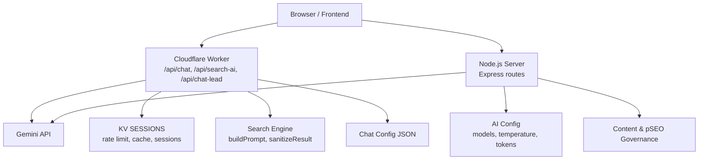
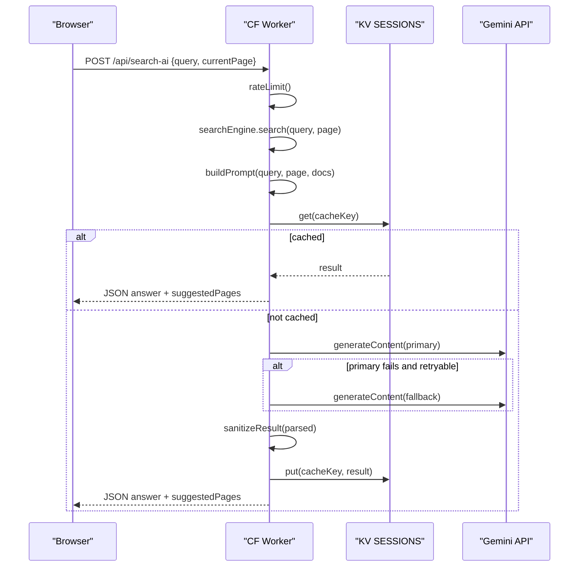
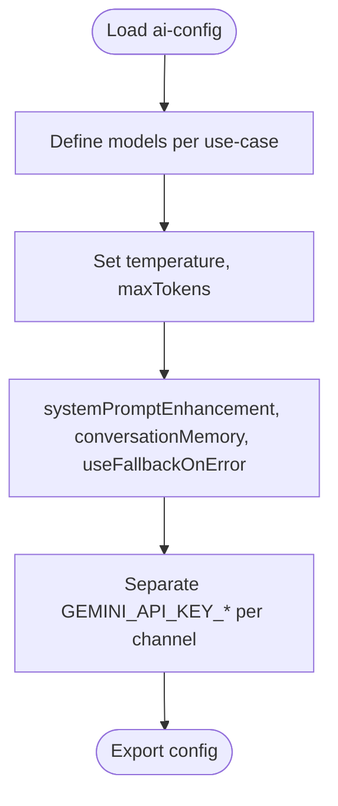
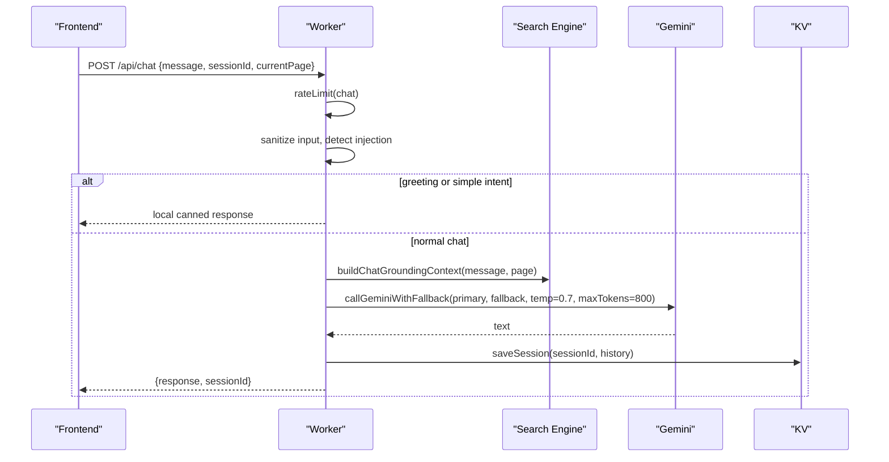
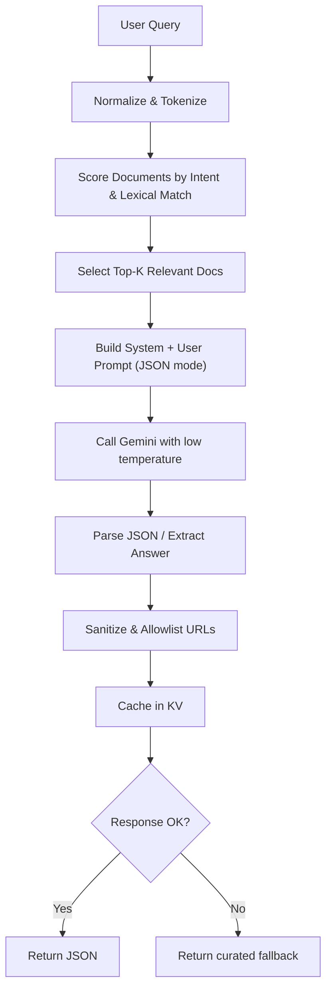
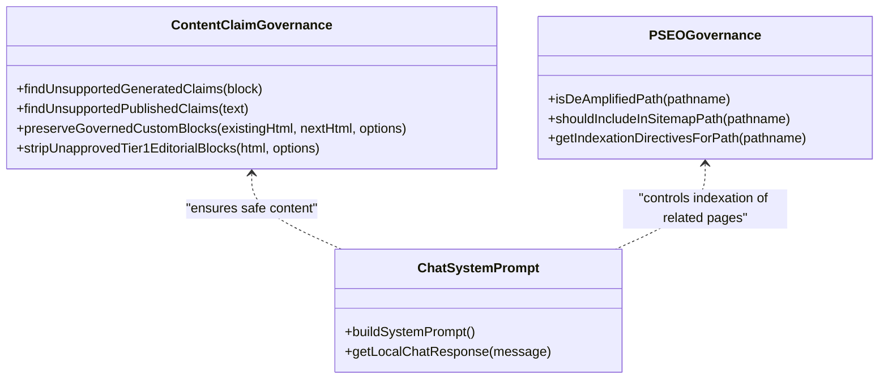
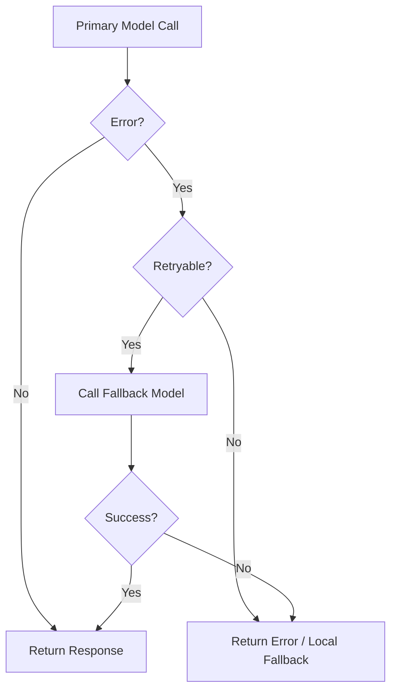
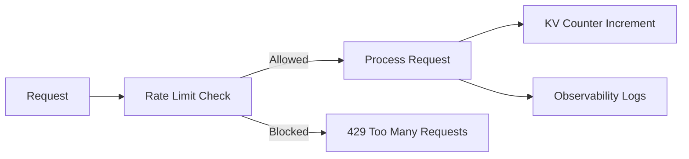
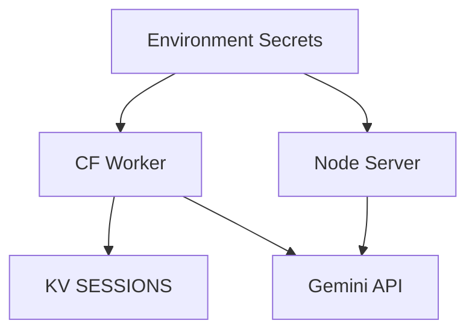
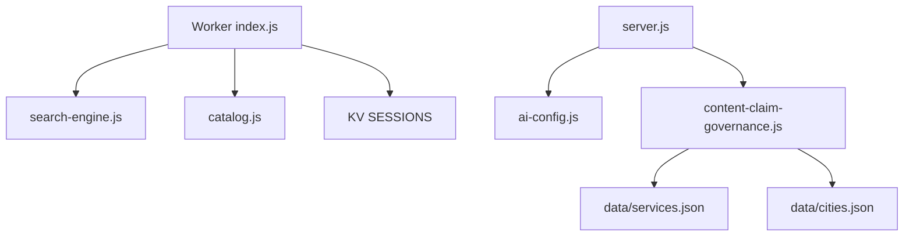

# AI Model Configuration

<cite>
**Referenced Files in This Document**
- [ai-config.js](file://ai-config.js)
- [server.js](file://server.js)
- [workers/webnovis-ai/src/index.js](file://workers/webnovis-ai/src/index.js)
- [workers/webnovis-ai/src/search-engine.js](file://workers/webnovis-ai/src/search-engine.js)
- [workers/webnovis-ai/data/chat-config.json](file://workers/webnovis-ai/data/chat-config.json)
- [chat-config.json](file://chat-config.json)
- [webnovis-ai-data.json](file://webnovis-ai-data.json)
- [config/content-claim-governance.js](file://config/content-claim-governance.js)
- [config/pseo-governance.js](file://config/pseo-governance.js)
- [wrangler.jsonc](file://wrangler.jsonc)
- [workers/webnovis-ai/wrangler.jsonc](file://workers/webnovis-ai/wrangler.jsonc)
- [scripts/generate-ai-content.js](file://scripts/generate-ai-content.js)
- [js/chat.js](file://js/chat.js)
</cite>

## Table of Contents
1. [Introduction](#introduction)
2. [Project Structure](#project-structure)
3. [Core Components](#core-components)
4. [Architecture Overview](#architecture-overview)
5. [Detailed Component Analysis](#detailed-component-analysis)
6. [Dependency Analysis](#dependency-analysis)
7. [Performance Considerations](#performance-considerations)
8. [Troubleshooting Guide](#troubleshooting-guide)
9. [Conclusion](#conclusion)
10. [Appendices](#appendices)

## Introduction
This document explains the AI model configuration system used by WebNovis to manage centralized model selection, parameter tuning, response formatting, governance policies, fallback strategies, and performance monitoring across chatbot responses, content generation, and search enhancement. It covers both the Node.js server runtime and the Cloudflare Worker that powers the public API endpoints.

## Project Structure
The AI configuration spans several layers:
- Centralized model and parameter configuration for shared usage across scripts and runtimes.
- A Cloudflare Worker exposing secure endpoints for chat, search, and lead capture with built-in rate limiting, session storage, and KV-backed caching.
- Governance modules ensuring brand voice consistency, factual accuracy, and compliance for generated or published content.
- Search grounding engine that builds prompts from a curated corpus and enforces safe output formats.
- Environment-based secrets management for API keys and quotas.

**Diagram sources**
- [workers/webnovis-ai/src/index.js:12-24](file://workers/webnovis-ai/src/index.js#L12-L24)
- [workers/webnovis-ai/src/index.js:198-247](file://workers/webnovis-ai/src/index.js#L198-L247)
- [workers/webnovis-ai/src/search-engine.js:201-389](file://workers/webnovis-ai/src/search-engine.js#L201-L389)
- [ai-config.js:3-37](file://ai-config.js#L3-L37)
- [config/content-claim-governance.js:1-240](file://config/content-claim-governance.js#L1-L240)
- [config/pseo-governance.js:1-311](file://config/pseo-governance.js#L1-L311)

**Section sources**
- [ai-config.js:1-37](file://ai-config.js#L1-L37)
- [workers/webnovis-ai/src/index.js:1-544](file://workers/webnovis-ai/src/index.js#L1-L544)
- [workers/webnovis-ai/src/search-engine.js:1-397](file://workers/webnovis-ai/src/search-engine.js#L1-L397)
- [config/content-claim-governance.js:1-240](file://config/content-claim-governance.js#L1-L240)
- [config/pseo-governance.js:1-311](file://config/pseo-governance.js#L1-L311)

## Core Components
- Centralized AI configuration: defines models per use case (chat, search, writer), generation parameters (temperature, max tokens), conversation memory, and fallback behavior.
- Cloudflare Worker API: implements secure endpoints with rate limiting, session persistence, prompt injection protection, and fallback logic when primary models fail.
- Search grounding engine: tokenizes and scores site content to build grounded prompts and enforce allowed URLs in outputs.
- Governance modules: validate claims, preserve approved editorial blocks, and control indexation for generated pages.
- Environment and secrets: separate API keys per use case; KV-backed rate limits and caches; observability enabled.

**Section sources**
- [ai-config.js:3-37](file://ai-config.js#L3-L37)
- [workers/webnovis-ai/src/index.js:12-24](file://workers/webnovis-ai/src/index.js#L12-L24)
- [workers/webnovis-ai/src/index.js:141-151](file://workers/webnovis-ai/src/index.js#L141-L151)
- [workers/webnovis-ai/src/index.js:198-247](file://workers/webnovis-ai/src/index.js#L198-L247)
- [workers/webnovis-ai/src/search-engine.js:201-389](file://workers/webnovis-ai/src/search-engine.js#L201-L389)
- [config/content-claim-governance.js:1-240](file://config/content-claim-governance.js#L1-L240)
- [config/pseo-governance.js:1-311](file://config/pseo-governance.js#L1-L311)

## Architecture Overview
The system uses two execution paths:
- Cloudflare Worker path: browser calls /api/chat or /api/search-ai; worker applies rate limits, sanitizes inputs, builds grounded prompts, calls Gemini with primary/fallback models, caches results in KV, and returns structured responses.
- Node.js server path: Express route composes system prompts, calls Gemini with configured temperature and token limits, applies fallback on retryable errors, and cleans markdown artifacts.

**Diagram sources**
- [workers/webnovis-ai/src/index.js:370-439](file://workers/webnovis-ai/src/index.js#L370-L439)
- [workers/webnovis-ai/src/search-engine.js:201-389](file://workers/webnovis-ai/src/search-engine.js#L201-L389)
- [workers/webnovis-ai/wrangler.jsonc:19-25](file://workers/webnovis-ai/wrangler.jsonc#L19-L25)

**Section sources**
- [workers/webnovis-ai/src/index.js:370-439](file://workers/webnovis-ai/src/index.js#L370-L439)
- [workers/webnovis-ai/src/search-engine.js:201-389](file://workers/webnovis-ai/src/search-engine.js#L201-L389)

## Detailed Component Analysis

### Centralized Model Configuration
- Defines distinct models for chat, search, and writer, plus explicit fallbacks.
- Sets global generation parameters: temperature and max tokens.
- Provides compatibility keys for legacy consumers and flags for conversation memory and fallback behavior.
- Separates API keys per use case to distribute consumption and isolate failures.

**Diagram sources**
- [ai-config.js:3-37](file://ai-config.js#L3-L37)

**Section sources**
- [ai-config.js:3-37](file://ai-config.js#L3-L37)

### Cloudflare Worker: Chat and Search Endpoints
- Rate limiting per IP with KV-backed counters and time windows.
- Prompt injection protection via regex patterns; safe default replies if detected.
- Session handling with TTL and message caps; history persisted to KV.
- Primary/fallback model switching based on error classification (retryable).
- Search endpoint enforces JSON output, sanitizes suggested pages to allowed URLs, and caches results in KV.

**Diagram sources**
- [workers/webnovis-ai/src/index.js:141-151](file://workers/webnovis-ai/src/index.js#L141-L151)
- [workers/webnovis-ai/src/index.js:198-247](file://workers/webnovis-ai/src/index.js#L198-L247)
- [workers/webnovis-ai/src/index.js:266-368](file://workers/webnovis-ai/src/index.js#L266-L368)
- [workers/webnovis-ai/src/search-engine.js:364-378](file://workers/webnovis-ai/src/search-engine.js#L364-L378)

**Section sources**
- [workers/webnovis-ai/src/index.js:141-151](file://workers/webnovis-ai/src/index.js#L141-L151)
- [workers/webnovis-ai/src/index.js:198-247](file://workers/webnovis-ai/src/index.js#L198-L247)
- [workers/webnovis-ai/src/index.js:266-368](file://workers/webnovis-ai/src/index.js#L266-L368)
- [workers/webnovis-ai/src/search-engine.js:364-378](file://workers/webnovis-ai/src/search-engine.js#L364-L378)

### Search Grounding and Response Formatting
- Loads and indexes corpus documents, normalizing text and building token sets.
- Scores documents using lexical matches, intent inference, and type boosts.
- Builds prompts with strict JSON schema instructions and restricts links to allowed URLs.
- Sanitizes answers, deduplicates suggestions, and falls back to curated messages when needed.

**Diagram sources**
- [workers/webnovis-ai/src/search-engine.js:70-117](file://workers/webnovis-ai/src/search-engine.js#L70-L117)
- [workers/webnovis-ai/src/search-engine.js:151-199](file://workers/webnovis-ai/src/search-engine.js#L151-L199)
- [workers/webnovis-ai/src/search-engine.js:232-271](file://workers/webnovis-ai/src/search-engine.js#L232-L271)
- [workers/webnovis-ai/src/search-engine.js:324-362](file://workers/webnovis-ai/src/search-engine.js#L324-L362)

**Section sources**
- [workers/webnovis-ai/src/search-engine.js:70-117](file://workers/webnovis-ai/src/search-engine.js#L70-L117)
- [workers/webnovis-ai/src/search-engine.js:151-199](file://workers/webnovis-ai/src/search-engine.js#L151-L199)
- [workers/webnovis-ai/src/search-engine.js:232-271](file://workers/webnovis-ai/src/search-engine.js#L232-L271)
- [workers/webnovis-ai/src/search-engine.js:324-362](file://workers/webnovis-ai/src/search-engine.js#L324-L362)

### Governance Policies: Brand Voice, Accuracy, Compliance
- Content claim governance scans generated and published content for unsupported claims, preserving only approved custom blocks and stripping unapproved tiered editorial blocks.
- pSEO governance controls which generated GEO pages are indexable, de-amplifying non-strategic pages and removing deprecated paths from sitemaps.
- Chat system prompt and catalog ensure consistent brand voice, accurate pricing references, and refusal of off-topic requests.

**Diagram sources**
- [config/content-claim-governance.js:1-240](file://config/content-claim-governance.js#L1-L240)
- [config/pseo-governance.js:1-311](file://config/pseo-governance.js#L1-L311)
- [workers/webnovis-ai/src/index.js:153-176](file://workers/webnovis-ai/src/index.js#L153-L176)
- [workers/webnovis-ai/src/catalog.js:1-134](file://workers/webnovis-ai/src/catalog.js#L1-L134)

**Section sources**
- [config/content-claim-governance.js:1-240](file://config/content-claim-governance.js#L1-L240)
- [config/pseo-governance.js:1-311](file://config/pseo-governance.js#L1-L311)
- [workers/webnovis-ai/src/index.js:153-176](file://workers/webnovis-ai/src/index.js#L153-L176)
- [workers/webnovis-ai/src/catalog.js:1-134](file://workers/webnovis-ai/src/catalog.js#L1-L134)

### Model Switching and Fallback Strategies
- Worker-level: primary model is attempted first; on retryable errors (rate limits, server errors, high demand), it automatically retries with the fallback model.
- Server-level: similar pattern with configurable primary and fallback models and retryable error detection.
- Local fallbacks: when API keys are missing or external calls fail, deterministic local responses are returned to keep the UX functional.

**Diagram sources**
- [workers/webnovis-ai/src/index.js:198-247](file://workers/webnovis-ai/src/index.js#L198-L247)
- [server.js:1206-1264](file://server.js#L1206-L1264)

**Section sources**
- [workers/webnovis-ai/src/index.js:198-247](file://workers/webnovis-ai/src/index.js#L198-L247)
- [server.js:1206-1264](file://server.js#L1206-L1264)

### Performance Monitoring and Quota Management
- Observability enabled in the Worker with head sampling rate set for tracing.
- Rate limiting enforced per IP for chat and search endpoints using KV buckets.
- Quota checks in server-side code log warnings and block further calls when daily limits are exceeded.
- Key rotation and cooldowns in scripts handle provider rate limits during batch generation.

**Diagram sources**
- [workers/webnovis-ai/wrangler.jsonc:11-14](file://workers/webnovis-ai/wrangler.jsonc#L11-L14)
- [workers/webnovis-ai/src/index.js:141-151](file://workers/webnovis-ai/src/index.js#L141-L151)
- [server.js:212-220](file://server.js#L212-L220)
- [scripts/generate-ai-content.js:195-217](file://scripts/generate-ai-content.js#L195-L217)

**Section sources**
- [workers/webnovis-ai/wrangler.jsonc:11-14](file://workers/webnovis-ai/wrangler.jsonc#L11-L14)
- [workers/webnovis-ai/src/index.js:141-151](file://workers/webnovis-ai/src/index.js#L141-L151)
- [server.js:212-220](file://server.js#L212-L220)
- [scripts/generate-ai-content.js:195-217](file://scripts/generate-ai-content.js#L195-L217)

### Integration with External AI Providers and API Key Management
- Separate environment variables per channel: chat, search, writer.
- Worker secrets managed via Wrangler; KV namespaces provisioned for sessions and caches.
- Assets deployment configured separately for static site hosting.

**Diagram sources**
- [workers/webnovis-ai/wrangler.jsonc:15-25](file://workers/webnovis-ai/wrangler.jsonc#L15-L25)
- [wrangler.jsonc:22-28](file://wrangler.jsonc#L22-L28)
- [ai-config.js:33-37](file://ai-config.js#L33-L37)

**Section sources**
- [workers/webnovis-ai/wrangler.jsonc:15-25](file://workers/webnovis-ai/wrangler.jsonc#L15-L25)
- [wrangler.jsonc:22-28](file://wrangler.jsonc#L22-L28)
- [ai-config.js:33-37](file://ai-config.js#L33-L37)

### Use Case Examples
- Chatbot responses:
  - Configure primary/fallback models, temperature ~0.7, max tokens ~800, conversation memory capped at 20 messages.
  - Use grounded context from search engine to improve relevance and avoid hallucinations.
- Content generation:
  - Use writer model with higher max tokens and JSON mode where applicable; apply governance checks before publishing.
- Search enhancement:
  - Use low temperature (~0.25) and JSON mode to produce structured answers; rely on allowed URL allowlisting and fallback responses.

**Section sources**
- [ai-config.js:22-31](file://ai-config.js#L22-L31)
- [workers/webnovis-ai/src/index.js:340-350](file://workers/webnovis-ai/src/index.js#L340-L350)
- [workers/webnovis-ai/src/index.js:404-417](file://workers/webnovis-ai/src/index.js#L404-L417)
- [config/content-claim-governance.js:127-186](file://config/content-claim-governance.js#L127-L186)

## Dependency Analysis
- The Worker depends on the search engine module for indexing and prompting, and on KV for rate limiting, sessions, and caching.
- The Node server depends on centralized AI config and may integrate governance modules during content pipelines.
- Governance modules depend on data files (services, cities) to compute indexation directives and claim validations.

**Diagram sources**
- [workers/webnovis-ai/src/index.js:1-10](file://workers/webnovis-ai/src/index.js#L1-L10)
- [workers/webnovis-ai/src/index.js:198-247](file://workers/webnovis-ai/src/index.js#L198-L247)
- [server.js:541-582](file://server.js#L541-L582)
- [config/content-claim-governance.js:1-240](file://config/content-claim-governance.js#L1-L240)
- [config/pseo-governance.js:18-20](file://config/pseo-governance.js#L18-L20)

**Section sources**
- [workers/webnovis-ai/src/index.js:1-10](file://workers/webnovis-ai/src/index.js#L1-L10)
- [server.js:541-582](file://server.js#L541-L582)
- [config/content-claim-governance.js:1-240](file://config/content-claim-governance.js#L1-L240)
- [config/pseo-governance.js:18-20](file://config/pseo-governance.js#L18-L20)

## Performance Considerations
- Prefer lite models for search and chat to reduce latency and cost; fall back to standard models only on retryable errors.
- Use low temperature for deterministic search answers; higher temperature for creative writing tasks.
- Enable KV caching for repeated queries to reduce API calls and improve responsiveness.
- Apply rate limiting to protect against abuse and manage quota consumption.
- Monitor observability logs and KV metrics to identify hotspots and optimize prompts.

[No sources needed since this section provides general guidance]

## Troubleshooting Guide
- Empty or malformed AI responses:
  - Ensure query length and format are valid; check sanitization and JSON parsing fallbacks.
  - Verify KV cache keys and TTL settings.
- Provider errors or rate limits:
  - Confirm retryable error detection and fallback model activation.
  - Check environment secrets and quota thresholds; adjust limits if necessary.
- Prompt injection attempts:
  - Validate regex patterns and ensure safe default replies are returned.
- Governance issues:
  - Review claim patterns and approved block lists; ensure metadata includes required provenance fields.
- Frontend integration:
  - Confirm CORS origins and endpoint URLs; handle timeouts and empty responses gracefully.

**Section sources**
- [workers/webnovis-ai/src/index.js:370-439](file://workers/webnovis-ai/src/index.js#L370-L439)
- [workers/webnovis-ai/src/index.js:284-286](file://workers/webnovis-ai/src/index.js#L284-L286)
- [server.js:1206-1264](file://server.js#L1206-L1264)
- [config/content-claim-governance.js:127-186](file://config/content-claim-governance.js#L127-L186)
- [js/chat.js:560-586](file://js/chat.js#L560-L586)

## Conclusion
WebNovis’ AI model configuration centralizes model selection, parameter tuning, and response formatting while enforcing strong governance and compliance. The Cloudflare Worker provides resilient, rate-limited, and observable endpoints with robust fallback strategies. The Node server complements this with flexible configuration and cleanup routines. Together, they support chatbot interactions, content generation, and search enhancement with clear best practices for cost optimization and quality assurance.

[No sources needed since this section summarizes without analyzing specific files]

## Appendices

### Configuration Reference Summary
- Models and fallbacks: defined centrally and reused across runtimes.
- Generation parameters: temperature and max tokens tuned per use case.
- Conversation memory: bounded to prevent excessive token usage.
- API key separation: per-channel keys to isolate risk and costs.
- Governance: claim validation and indexation control to maintain brand integrity and SEO health.

**Section sources**
- [ai-config.js:3-37](file://ai-config.js#L3-L37)
- [workers/webnovis-ai/src/index.js:198-247](file://workers/webnovis-ai/src/index.js#L198-L247)
- [config/content-claim-governance.js:1-240](file://config/content-claim-governance.js#L1-L240)
- [config/pseo-governance.js:1-311](file://config/pseo-governance.js#L1-L311)