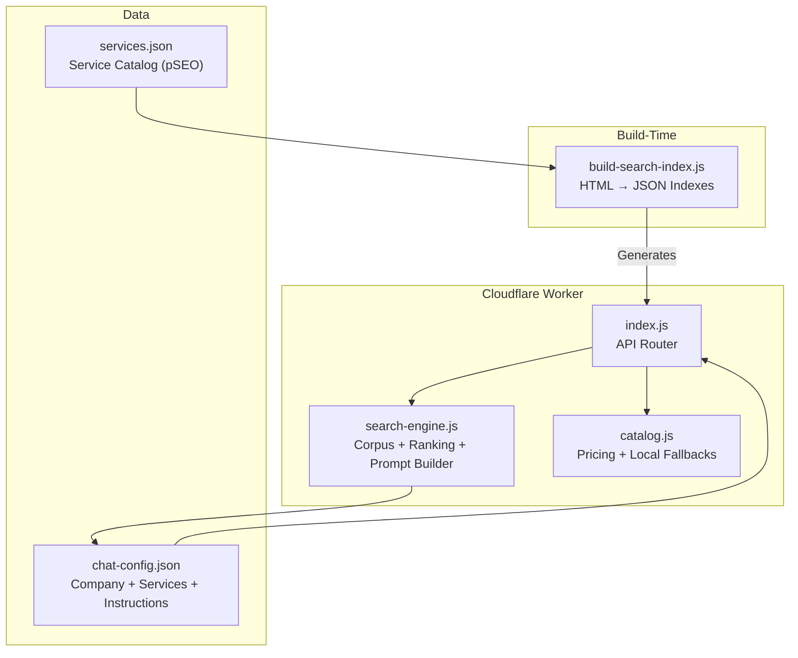
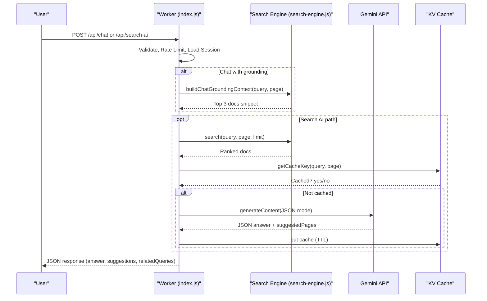
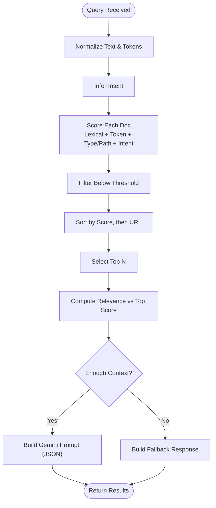
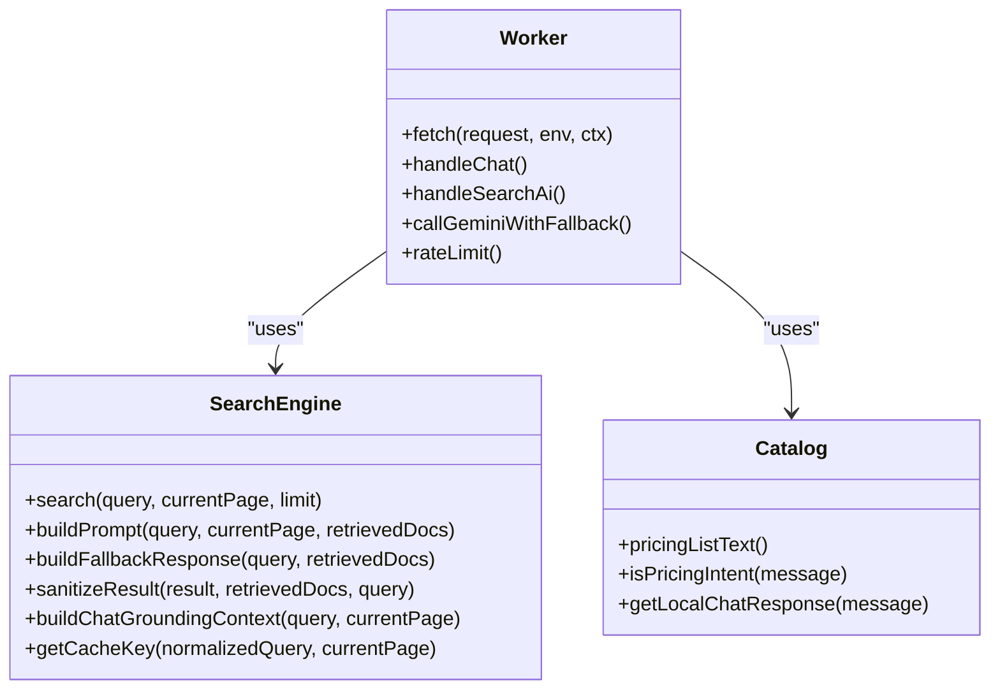
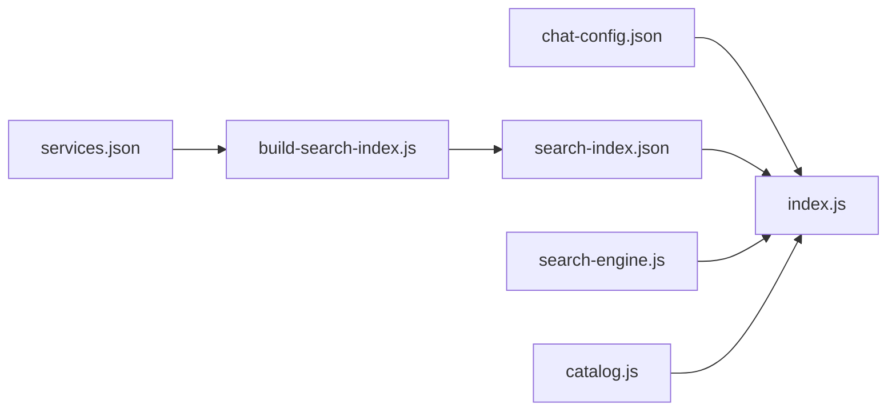

# Catalog & Search System

<cite>
**Referenced Files in This Document**
- [index.js](file://workers/webnovis-ai/src/index.js)
- [search-engine.js](file://workers/webnovis-ai/src/search-engine.js)
- [catalog.js](file://workers/webnovis-ai/src/catalog.js)
- [chat-config.json](file://workers/webnovis-ai/data/chat-config.json)
- [services.json](file://data/services.json)
- [build-search-index.js](file://build-search-index.js)
- [search.js](file://js/search.js)
</cite>

## Table of Contents
1. [Introduction](#introduction)
2. [Project Structure](#project-structure)
3. [Core Components](#core-components)
4. [Architecture Overview](#architecture-overview)
5. [Detailed Component Analysis](#detailed-component-analysis)
6. [Dependency Analysis](#dependency-analysis)
7. [Performance Considerations](#performance-considerations)
8. [Troubleshooting Guide](#troubleshooting-guide)
9. [Conclusion](#conclusion)
10. [Appendices](#appendices)

## Introduction
This document explains the WebNovis chatbot’s catalog and search system that powers contextual, service-aware responses. It covers how services are structured and indexed, how the server-side search engine ranks results with weighted scoring and intent inference, and how search results are integrated into AI prompts to produce concise, relevant answers for users. It also includes guidance on adding new services, tuning search parameters, optimizing performance, and maintaining catalog accuracy.

## Project Structure
The system is implemented as a Cloudflare Worker with:
- A lightweight server entry handling API endpoints (/api/chat, /api/search-ai, /api/health).
- A deterministic fallback catalog for pricing and quick replies.
- A server-side search engine that builds a corpus from a generated index and returns ranked results plus prompt context for Gemini.
- A build-time script that scans published HTML pages and produces both a public client index and a richer private AI corpus.

**Diagram sources**
- [index.js:1-544](file://workers/webnovis-ai/src/index.js#L1-L544)
- [search-engine.js:1-379](file://workers/webnovis-ai/src/search-engine.js#L1-L379)
- [catalog.js:1-134](file://workers/webnovis-ai/src/catalog.js#L1-L134)
- [build-search-index.js:1-325](file://build-search-index.js#L1-L325)
- [chat-config.json:1-109](file://workers/webnovis-ai/data/chat-config.json#L1-L109)
- [services.json:1-307](file://data/services.json#L1-L307)

**Section sources**
- [index.js:1-544](file://workers/webnovis-ai/src/index.js#L1-L544)
- [build-search-index.js:1-325](file://build-search-index.js#L1-L325)

## Core Components
- Server Entry (index.js): Routes requests, enforces rate limits, manages sessions, composes system prompts from chat-config.json, integrates search grounding, calls Gemini with fallback models, and sanitizes outputs.
- Search Engine (search-engine.js): Normalizes text, tokenizes queries, infers user intent, prepares corpus, scores documents with weighted lexical matches and type/path boosts, builds prompts for Gemini, and provides fallback responses and caching keys.
- Catalog (catalog.js): Holds list prices and contact info; provides deterministic responses for greetings, thanks, pricing intents, and category-specific summaries used when no AI key is available or as a fast path.
- Chat Config (chat-config.json): Authoritative source for company info, services/pricing, timelines, and chatbot instructions injected into the system prompt.
- Service Catalog (services.json): pSEO-oriented catalog defining service metadata, tiers, URLs, and pricing used by generators and indexing pipelines.
- Build Script (build-search-index.js): Scans published HTML, extracts titles, descriptions, headings, paragraphs, keywords, classifies page types, and writes public and AI indexes consumed by the worker.

**Section sources**
- [index.js:1-544](file://workers/webnovis-ai/src/index.js#L1-L544)
- [search-engine.js:1-379](file://workers/webnovis-ai/src/search-engine.js#L1-L379)
- [catalog.js:1-134](file://workers/webnovis-ai/src/catalog.js#L1-L134)
- [chat-config.json:1-109](file://workers/webnovis-ai/data/chat-config.json#L1-L109)
- [services.json:1-307](file://data/services.json#L1-L307)
- [build-search-index.js:1-325](file://build-search-index.js#L1-L325)

## Architecture Overview
The runtime flow combines deterministic catalog logic with semantic search and LLM generation:
- Client sends a chat or search request.
- The worker validates input, applies rate limiting, and loads session state.
- For chat, it optionally grounds the conversation using the search engine to retrieve top relevant pages and injects them into the system prompt.
- For search, it retrieves top documents, builds a strict JSON prompt for Gemini, caches results via KV, and sanitizes output to ensure only allowed URLs are returned.
- If no AI key is present or if an error occurs, the system falls back to local catalog responses.

**Diagram sources**
- [index.js:266-440](file://workers/webnovis-ai/src/index.js#L266-L440)
- [search-engine.js:188-379](file://workers/webnovis-ai/src/search-engine.js#L188-L379)

## Detailed Component Analysis

### Search Engine (Server-Side)
- Text normalization and tokenization: Lowercases, strips accents, normalizes whitespace, removes stop words, and ensures minimum token length.
- Intent inference: Detects commercial, pricing, contact, portfolio, about, informational, and local intents based on query patterns.
- Corpus preparation: Builds normalized fields for title, URL, description, content, headings, and keywords; computes token sets per field.
- Scoring algorithm:
  - Lexical match bonuses for exact substring matches across fields.
  - Token-based bonuses per field presence.
  - Type and path boosts for commercial pages (/servizi/*, /preventivo.html, /contatti.html).
  - Intent-driven adjustments (e.g., demote locale clones for non-local commercial queries).
  - Current-page section proximity bonus and noindex penalty.
- Output: Returns ranked documents with relevance normalized against top score; builds prompts for Gemini with strict JSON schema; constructs fallback responses when retrieval is weak.

**Diagram sources**
- [search-engine.js:16-186](file://workers/webnovis-ai/src/search-engine.js#L16-L186)
- [search-engine.js:188-379](file://workers/webnovis-ai/src/search-engine.js#L188-L379)

**Section sources**
- [search-engine.js:1-379](file://workers/webnovis-ai/src/search-engine.js#L1-L379)

### Catalog and Pricing Fallbacks
- Provides deterministic responses for greetings, thanks, pricing intents, and category summaries (web, design, social).
- Uses a compact price list and contact details aligned with chat-config.json.
- Used when no AI key is configured or as a fast-path before invoking the LLM.

**Section sources**
- [catalog.js:1-134](file://workers/webnovis-ai/src/catalog.js#L1-L134)
- [chat-config.json:1-109](file://workers/webnovis-ai/data/chat-config.json#L1-L109)

### Worker Integration and AI Orchestration
- Composes system prompt from chat-config.json including company info, services/pricing, and behavioral instructions.
- Grounds chat with up to three most relevant pages for longer queries.
- Calls Gemini with primary/fallback models and JSON mode for search; cleans markdown artifacts from chat responses.
- Enforces CORS, rate limiting, and session persistence; stores leads via a separate endpoint.

**Diagram sources**
- [index.js:1-544](file://workers/webnovis-ai/src/index.js#L1-L544)
- [search-engine.js:1-379](file://workers/webnovis-ai/src/search-engine.js#L1-L379)
- [catalog.js:1-134](file://workers/webnovis-ai/src/catalog.js#L1-L134)

**Section sources**
- [index.js:1-544](file://workers/webnovis-ai/src/index.js#L1-L544)

### Build-Time Index Generation
- Walks published HTML files, strips scripts/styles, extracts meta tags, headings, paragraphs, and body text.
- Classifies pages by URL patterns (blog, portfolio, servizi, locale, legal, generic).
- Produces two outputs:
  - Public index for client-side search (no aiContent).
  - Private AI corpus with extended content for server-side ranking and prompting.
- Respects noindex directives and governance rules.

**Section sources**
- [build-search-index.js:1-325](file://build-search-index.js#L1-L325)

### Client-Side Semantic Search (Complementary)
- Implements similar normalization, tokenization, and scoring logic for client-side usage.
- Reranks local results with intent-based bonuses and merges with semantic search when available.

**Section sources**
- [search.js:281-409](file://js/search.js#L281-L409)

## Dependency Analysis
- index.js depends on:
  - search-engine.js for retrieval and prompt building.
  - catalog.js for deterministic fallbacks.
  - chat-config.json for system prompt and service data.
  - search-index.json (imported at runtime) for corpus initialization.
- build-search-index.js generates search-index.json and search-ai-index.json consumed by the worker and client tools.
- services.json feeds geo/page generators and informs catalog consistency.

**Diagram sources**
- [index.js:1-544](file://workers/webnovis-ai/src/index.js#L1-L544)
- [build-search-index.js:1-325](file://build-search-index.js#L1-L325)

**Section sources**
- [index.js:1-544](file://workers/webnovis-ai/src/index.js#L1-L544)
- [build-search-index.js:1-325](file://build-search-index.js#L1-L325)

## Performance Considerations
- In-memory corpus: The worker builds the corpus once per process start; keep it lean by excluding noindex pages and trimming long fields.
- Query normalization and tokenization: Avoid heavy operations; reuse normalized tokens where possible.
- Caching: Use KV-backed search result caching keyed by normalized query and current page to reduce LLM calls.
- Intent filtering: Early intent detection reduces unnecessary broad searches.
- Limits: Enforce rate limits per IP and per endpoint; cap max output tokens and temperature for cost control.
- Client-side search: Leverage prebuilt public index for instant suggestions while server handles complex queries.

[No sources needed since this section provides general guidance]

## Troubleshooting Guide
- No AI key configured: The worker falls back to catalog responses; verify environment variables for Gemini keys.
- Empty or low-quality results: Check search thresholds, ensure pages are indexable, and confirm the build script included required sections.
- Injection attempts: Input validation rejects prompt injection patterns; safe fallback responses are returned.
- CORS issues: Ensure Origin is allowed; check default and custom origins configuration.
- Rate limiting errors: Increase windows or limits as needed; monitor KV counters.
- Incorrect links in responses: Sanitization restricts suggested pages to allowed URLs from retrieved docs.

**Section sources**
- [index.js:266-440](file://workers/webnovis-ai/src/index.js#L266-L440)
- [search-engine.js:312-349](file://workers/webnovis-ai/src/search-engine.js#L312-L349)

## Conclusion
The WebNovis catalog and search system blends deterministic pricing and quick replies with a robust server-side search engine and grounded LLM generation. Weighted lexical scoring, intent inference, and strict output sanitization ensure accurate, conversion-focused responses. With clear extension points for catalog updates, configurable search behavior, and caching strategies, the system scales efficiently while maintaining high relevance and safety.

[No sources needed since this section summarizes without analyzing specific files]

## Appendices

### Adding New Services to the Catalog
- Update services.json with new service entries (slug, name, shortName, url, hasPage, tier, priceFrom, currency, timeEstimate, description, shortDesc, targetKeyword, idealFor).
- Align chat-config.json services/pricing and timeline if you want the chatbot to reference these items.
- Regenerate indexes with the build script to include new pages in both public and AI indexes.

**Section sources**
- [services.json:1-307](file://data/services.json#L1-L307)
- [chat-config.json:1-109](file://workers/webnovis-ai/data/chat-config.json#L1-L109)
- [build-search-index.js:1-325](file://build-search-index.js#L1-L325)

### Configuring Search Parameters
- Adjust MIN_SCORE_THRESHOLD and boost weights in the search engine to tune precision/recall.
- Modify STOP_WORDS and tokenization rules to reflect domain terminology.
- Tune Gemini parameters (temperature, maxOutputTokens) for cost vs quality trade-offs.

**Section sources**
- [search-engine.js:1-379](file://workers/webnovis-ai/src/search-engine.js#L1-L379)
- [index.js:1-544](file://workers/webnovis-ai/src/index.js#L1-L544)

### Optimizing Response Quality
- Improve page content: Add clear titles, meta descriptions, headings, and keyword-rich but natural text.
- Maintain consistent URL structure (/servizi/* for services) to leverage built-in boosts.
- Keep chat-config.json instructions precise and aligned with business goals.

**Section sources**
- [build-search-index.js:1-325](file://build-search-index.js#L1-L325)
- [chat-config.json:1-109](file://workers/webnovis-ai/data/chat-config.json#L1-L109)

### Maintaining Catalog Accuracy
- Regularly review services.json and chat-config.json for pricing and availability changes.
- Re-run the build script after publishing new or updated pages.
- Monitor search analytics and adjust scoring/intent rules as needed.

**Section sources**
- [services.json:1-307](file://data/services.json#L1-L307)
- [chat-config.json:1-109](file://workers/webnovis-ai/data/chat-config.json#L1-L109)
- [build-search-index.js:1-325](file://build-search-index.js#L1-L325)