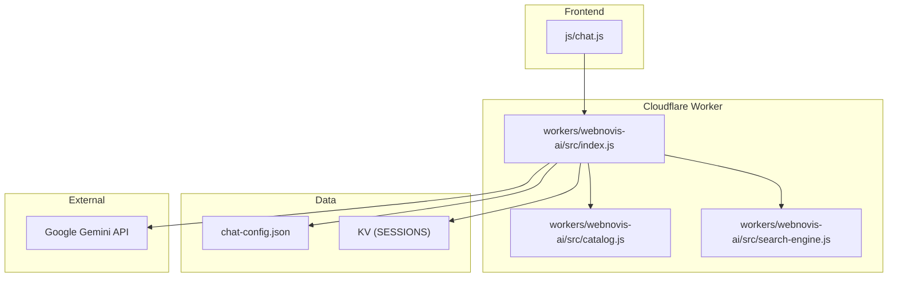
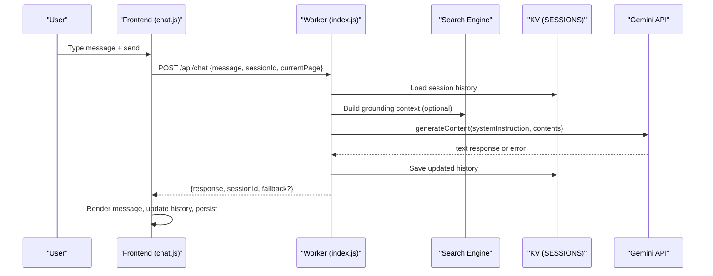
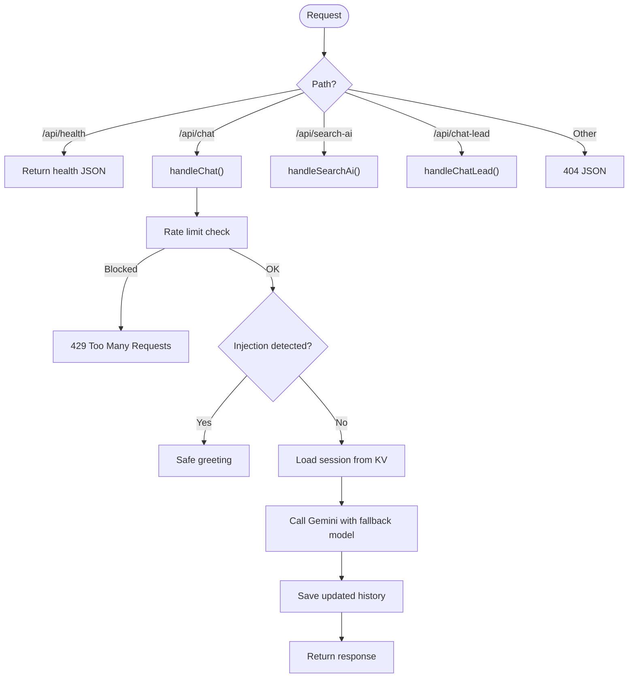
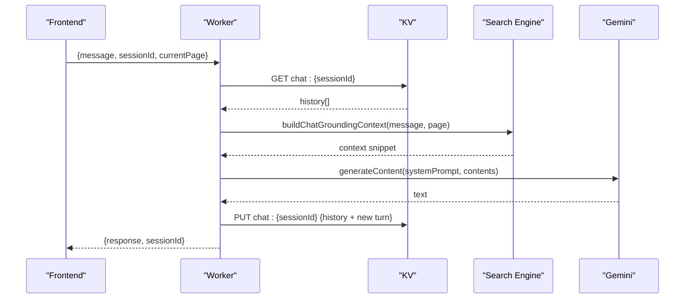
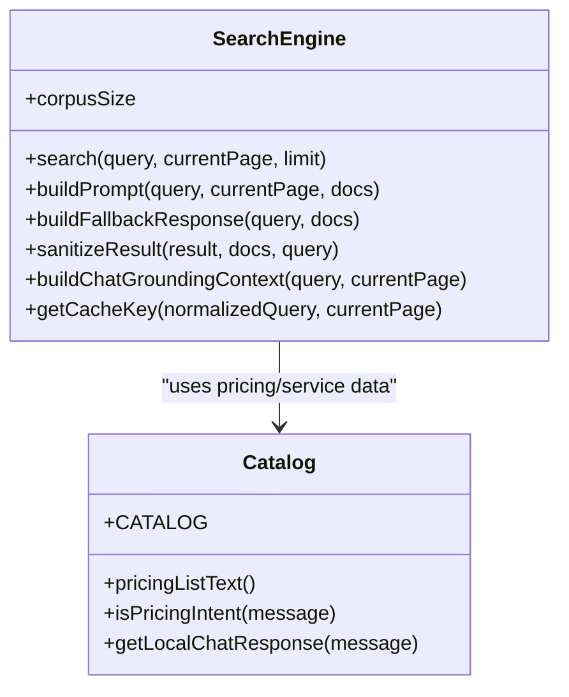
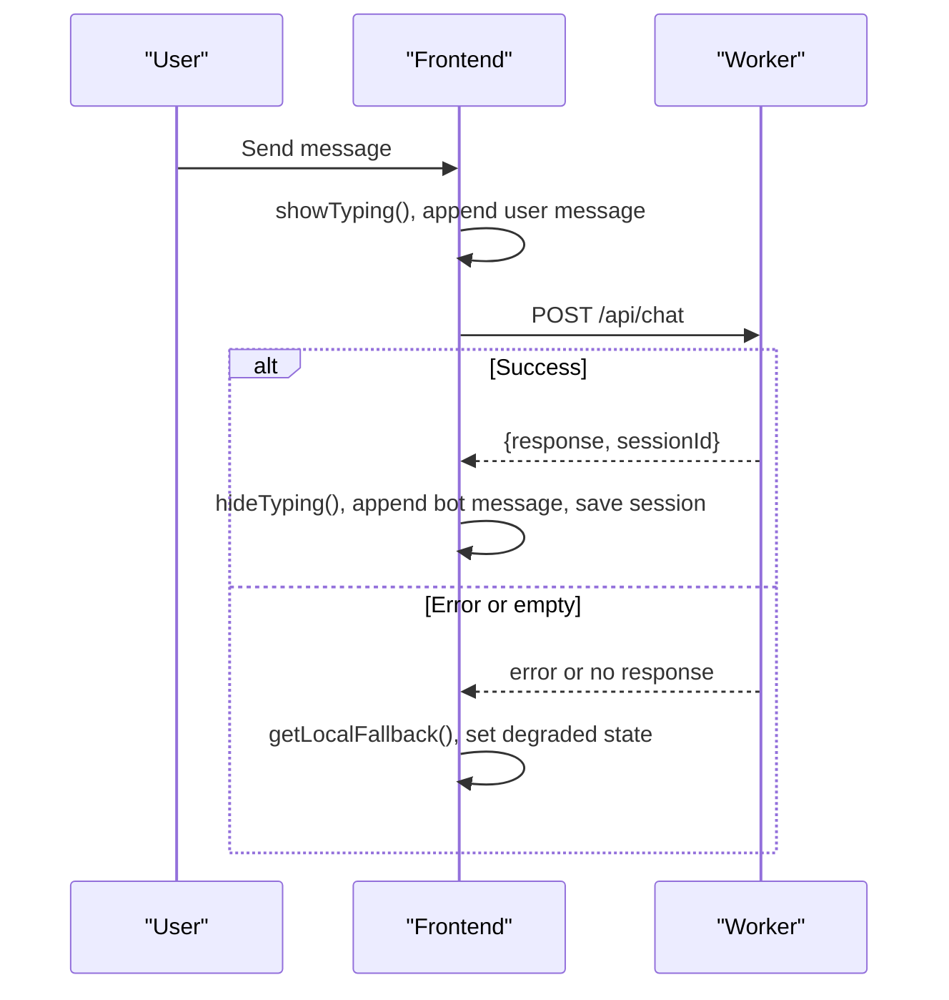
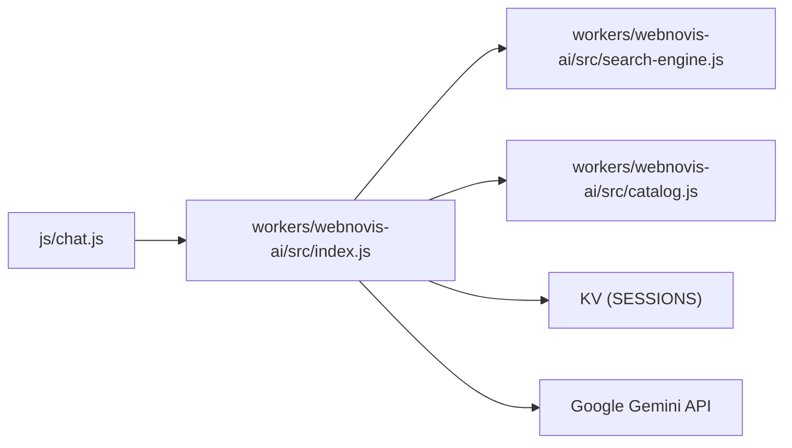

# Chatbot System

<cite>
**Referenced Files in This Document**
- [index.js](file://workers/webnovis-ai/src/index.js)
- [catalog.js](file://workers/webnovis-ai/src/catalog.js)
- [search-engine.js](file://workers/webnovis-ai/src/search-engine.js)
- [chat.js](file://js/chat.js)
- [chat-config.json](file://chat-config.json)
- [wrangler.jsonc](file://workers/webnovis-ai/wrangler.jsonc)
</cite>

## Table of Contents
1. [Introduction](#introduction)
2. [Project Structure](#project-structure)
3. [Core Components](#core-components)
4. [Architecture Overview](#architecture-overview)
5. [Detailed Component Analysis](#detailed-component-analysis)
6. [Dependency Analysis](#dependency-analysis)
7. [Performance Considerations](#performance-considerations)
8. [Troubleshooting Guide](#troubleshooting-guide)
9. [Conclusion](#conclusion)
10. [Appendices](#appendices)

## Introduction
This document explains the WebNovis chatbot system that powers multi-turn conversations using Google Gemini, with a JavaScript frontend and a Cloudflare Worker backend. It covers conversation memory management, context preservation across messages, session handling, message formatting, real-time-like UX patterns, worker-based edge deployment, request routing, rate limiting, error handling, catalog-driven responses, search engine integration for contextual answers, configuration examples, and troubleshooting guidance for API limits, connectivity, and performance.

## Project Structure
The chatbot spans three main layers:
- Frontend: A lightweight JavaScript widget that manages UI, session persistence, retries, and user interactions.
- Backend: A Cloudflare Worker exposing endpoints for chat, search, health, and lead capture.
- Data and logic: A catalog of services/pricing and a token-based search engine that builds prompts and grounding context from indexed site content.

**Diagram sources**
- [index.js:1-544](file://workers/webnovis-ai/src/index.js#L1-L544)
- [chat.js:1-797](file://js/chat.js#L1-L797)
- [catalog.js:1-134](file://workers/webnovis-ai/src/catalog.js#L1-L134)
- [search-engine.js:1-379](file://workers/webnovis-ai/src/search-engine.js#L1-L379)
- [chat-config.json:1-109](file://chat-config.json#L1-L109)
- [wrangler.jsonc:1-26](file://workers/webnovis-ai/wrangler.jsonc#L1-L26)

**Section sources**
- [index.js:1-544](file://workers/webnovis-ai/src/index.js#L1-L544)
- [chat.js:1-797](file://js/chat.js#L1-L797)
- [catalog.js:1-134](file://workers/webnovis-ai/src/catalog.js#L1-L134)
- [search-engine.js:1-379](file://workers/webnovis-ai/src/search-engine.js#L1-L379)
- [chat-config.json:1-109](file://chat-config.json#L1-L109)
- [wrangler.jsonc:1-26](file://workers/webnovis-ai/wrangler.jsonc#L1-L26)

## Core Components
- Worker entrypoint and routing: Handles CORS, rate limiting, endpoints (/api/health, /api/chat, /api/search-ai, /api/chat-lead), and fallbacks.
- Conversation handler: Builds system prompt from config, preserves conversation history via KV, calls Gemini with primary/fallback models, and sanitizes output.
- Search engine: Token-based ranking over a corpus to build grounding context and structured JSON answers; includes fallback responses when retrieval is weak.
- Catalog: Centralized pricing and service info used by both fallback responses and system prompt data.
- Frontend widget: Manages UI, local session persistence, retry logic, adaptive typing, lead intent detection, and connection status feedback.

**Section sources**
- [index.js:153-367](file://workers/webnovis-ai/src/index.js#L153-L367)
- [search-engine.js:188-379](file://workers/webnovis-ai/src/search-engine.js#L188-L379)
- [catalog.js:1-134](file://workers/webnovis-ai/src/catalog.js#L1-L134)
- [chat.js:35-797](file://js/chat.js#L35-L797)

## Architecture Overview
The system uses an edge-deployed Cloudflare Worker to route requests, enforce rate limits, manage sessions, and call Google Gemini. The frontend maintains a short-term conversation history and persists it locally for continuity. A search engine enriches prompts with relevant site content, while a catalog provides authoritative pricing and service details.

**Diagram sources**
- [index.js:266-367](file://workers/webnovis-ai/src/index.js#L266-L367)
- [search-engine.js:351-363](file://workers/webnovis-ai/src/search-engine.js#L351-L363)
- [chat.js:430-580](file://js/chat.js#L430-L580)

## Detailed Component Analysis

### Worker Routing and Session Management
- Endpoints:
  - GET /api/health: returns service status and corpus size.
  - POST /api/chat: processes chat messages with conversation memory and Gemini calls.
  - POST /api/search-ai: returns structured answers based on retrieved documents.
  - POST /api/chat-lead: captures lead intents and sends notifications.
- Rate limiting: Per-IP buckets for chat and search using KV.
- Session storage: Stores trimmed conversation history with TTL; enforces max message window.
- Security: Strips HTML, enforces length limits, detects prompt injection patterns, and responds with safe defaults.

**Diagram sources**
- [index.js:141-151](file://workers/webnovis-ai/src/index.js#L141-L151)
- [index.js:266-367](file://workers/webnovis-ai/src/index.js#L266-L367)
- [index.js:370-440](file://workers/webnovis-ai/src/index.js#L370-L440)
- [index.js:442-506](file://workers/webnovis-ai/src/index.js#L442-L506)

**Section sources**
- [index.js:141-151](file://workers/webnovis-ai/src/index.js#L141-L151)
- [index.js:178-196](file://workers/webnovis-ai/src/index.js#L178-L196)
- [index.js:266-367](file://workers/webnovis-ai/src/index.js#L266-L367)
- [index.js:370-440](file://workers/webnovis-ai/src/index.js#L370-L440)
- [index.js:442-506](file://workers/webnovis-ai/src/index.js#L442-L506)

### Multi-Turn Conversations and Context Preservation
- History format: Array of {role, content} stored per session in KV.
- Message trimming: Keeps last N messages to control token usage and memory.
- System prompt: Built from chat-config.json company info, services, and instructions; augmented with search-grounded context when available.
- Model selection: Primary and fallback Gemini models with retryable error handling.
- Output cleaning: Normalizes markdown artifacts and bullet markers for consistent rendering.

**Diagram sources**
- [index.js:178-196](file://workers/webnovis-ai/src/index.js#L178-L196)
- [index.js:198-247](file://workers/webnovis-ai/src/index.js#L198-L247)
- [index.js:322-357](file://workers/webnovis-ai/src/index.js#L322-L357)
- [search-engine.js:351-363](file://workers/webnovis-ai/src/search-engine.js#L351-L363)

**Section sources**
- [index.js:178-196](file://workers/webnovis-ai/src/index.js#L178-L196)
- [index.js:198-247](file://workers/webnovis-ai/src/index.js#L198-L247)
- [index.js:322-357](file://workers/webnovis-ai/src/index.js#L322-L357)

### Search Engine Integration and Catalog
- Search engine:
  - Tokenizes queries, infers intent, scores documents by lexical matches and type boosts, and returns ranked results.
  - Builds prompts for structured JSON answers and fallback responses when retrieval is insufficient.
  - Sanitizes suggested pages to allowed URLs and normalizes relevance values.
- Catalog:
  - Provides canonical pricing and service names used in fallback responses and system prompt data.
  - Detects pricing intent to return accurate list prices.

**Diagram sources**
- [search-engine.js:188-379](file://workers/webnovis-ai/src/search-engine.js#L188-L379)
- [catalog.js:1-134](file://workers/webnovis-ai/src/catalog.js#L1-L134)

**Section sources**
- [search-engine.js:188-379](file://workers/webnovis-ai/src/search-engine.js#L188-L379)
- [catalog.js:1-134](file://workers/webnovis-ai/src/catalog.js#L1-L134)

### Frontend Widget: Message Formatting and Real-Time UX
- Message formatting: Converts lists, inline code, bold, links, and icon placeholders into rich HTML; escapes unsafe content.
- Real-time-like UX: Typing indicator, adaptive typing delay proportional to response length, and smooth scrolling.
- Session persistence: Saves last N turns and sessionId to localStorage with expiry; restores recent messages on reload.
- Retry and fallback: Retries failed requests with exponential backoff; falls back to local responses marked as degraded with visible status bar.
- Lead intent detection: Recognizes purchase intent and fires-and-forgets lead notification to backend.

**Diagram sources**
- [chat.js:430-580](file://js/chat.js#L430-L580)
- [chat.js:646-738](file://js/chat.js#L646-L738)

**Section sources**
- [chat.js:355-403](file://js/chat.js#L355-L403)
- [chat.js:430-580](file://js/chat.js#L430-L580)
- [chat.js:603-644](file://js/chat.js#L603-L644)
- [chat.js:646-738](file://js/chat.js#L646-L738)

### Worker-Based Edge Deployment
- Cloudflare Workers configuration:
  - Entry point: src/index.js
  - Observability enabled with head sampling
  - KV namespace bound as SESSIONS for sessions, rate limits, search cache, and leads
- CORS: Dynamically allows configured origins plus localhost variants
- Rate limiting: Time-bucketed counters stored in KV with TTLs
- Fallbacks: Graceful degradation to local catalog responses when API keys are missing or errors occur

**Section sources**
- [wrangler.jsonc:1-26](file://workers/webnovis-ai/wrangler.jsonc#L1-L26)
- [index.js:80-116](file://workers/webnovis-ai/src/index.js#L80-L116)
- [index.js:141-151](file://workers/webnovis-ai/src/index.js#L141-L151)
- [index.js:508-543](file://workers/webnovis-ai/src/index.js#L508-L543)

## Dependency Analysis
- index.js depends on:
  - search-engine.js for retrieval and prompt construction
  - catalog.js for pricing and fallback responses
  - KV (SESSIONS) for sessions, rate limits, and caches
  - External Google Gemini API for generative responses
- chat.js depends on:
  - Worker endpoints for chat and lead capture
  - Local storage for session persistence
  - DOM APIs for UI updates and accessibility

**Diagram sources**
- [index.js:1-544](file://workers/webnovis-ai/src/index.js#L1-L544)
- [chat.js:1-797](file://js/chat.js#L1-L797)
- [search-engine.js:1-379](file://workers/webnovis-ai/src/search-engine.js#L1-L379)
- [catalog.js:1-134](file://workers/webnovis-ai/src/catalog.js#L1-L134)

**Section sources**
- [index.js:1-544](file://workers/webnovis-ai/src/index.js#L1-L544)
- [chat.js:1-797](file://js/chat.js#L1-L797)

## Performance Considerations
- Token efficiency:
  - Truncate history to a bounded number of messages before sending to Gemini.
  - Use search-grounded context only when query length indicates sufficient specificity.
- Latency:
  - Adaptive typing delays improve perceived responsiveness without blocking network I/O.
  - Exponential backoff retries reduce transient failure impact.
- Memory:
  - KV TTLs ensure sessions expire after a defined period.
  - Local storage expiry prevents stale histories from accumulating.
- Retrieval quality:
  - Threshold scoring avoids noisy results; fallback responses guide users to relevant pages when retrieval is weak.
- Cost:
  - Lower temperature and reduced token windows for search queries minimize cost while maintaining accuracy.

[No sources needed since this section provides general guidance]

## Troubleshooting Guide
Common issues and resolutions:
- API rate limits:
  - Symptom: 429 responses with retry-after hints.
  - Action: Reduce request frequency; verify environment rate limit settings; consider caching repeated queries.
- Connection issues:
  - Symptom: Network errors or timeouts during fetch.
  - Action: Check CORS configuration, origin allowlist, and network policies; use health endpoint to verify service availability.
- Empty or degraded responses:
  - Symptom: Local fallback shown with degraded status bar.
  - Action: Verify API key presence, Gemini quotas, and payload sizes; inspect logs for errors.
- Prompt injection attempts:
  - Symptom: Unexpected behavior or policy violations.
  - Action: Ensure injection patterns are matched; rely on safe default responses.
- Performance bottlenecks:
  - Symptom: Slow responses or high latency.
  - Action: Reduce history length, enable search caching, and tune model parameters (temperature, max tokens).

**Section sources**
- [index.js:141-151](file://workers/webnovis-ai/src/index.js#L141-L151)
- [index.js:266-367](file://workers/webnovis-ai/src/index.js#L266-L367)
- [index.js:370-440](file://workers/webnovis-ai/src/index.js#L370-L440)
- [chat.js:481-580](file://js/chat.js#L481-L580)
- [chat.js:504-531](file://js/chat.js#L504-L531)

## Conclusion
The WebNovis chatbot combines a robust Cloudflare Worker backend with a responsive frontend widget to deliver multi-turn, context-aware conversations powered by Google Gemini. It leverages a token-based search engine and a centralized catalog to provide grounded, accurate responses while ensuring safety, performance, and scalability at the edge. With configurable prompts, session persistence, and resilient fallbacks, the system supports production-grade deployments and continuous improvement through observability and caching.

[No sources needed since this section summarizes without analyzing specific files]

## Appendices

### Configuration Examples
- Configure conversation parameters:
  - Adjust temperature and maxOutputTokens in the worker’s Gemini call options.
  - Tune history length and message limits in the frontend configuration.
- Implement custom response logic:
  - Extend catalog fallbacks for specialized intents or add new quick replies in the frontend.
- Handle different message types:
  - Use search-ai endpoint for informational queries; use chat endpoint for conversational flows.
- Environment variables:
  - Set GEMINI_API_KEY_CHAT, GEMINI_API_KEY_SEARCH, CORS_ORIGINS, and optional Brevo email settings in your deployment platform.

**Section sources**
- [index.js:198-247](file://workers/webnovis-ai/src/index.js#L198-L247)
- [chat.js:8-21](file://js/chat.js#L8-L21)
- [chat-config.json:1-109](file://chat-config.json#L1-L109)
- [wrangler.jsonc:15-25](file://workers/webnovis-ai/wrangler.jsonc#L15-L25)