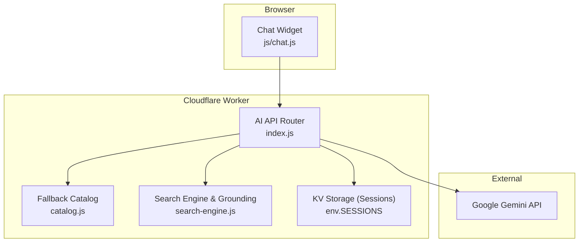
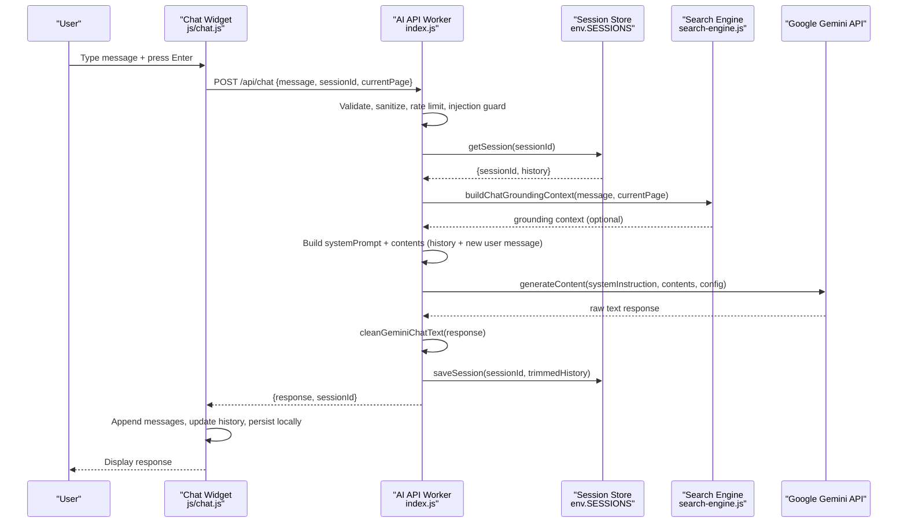
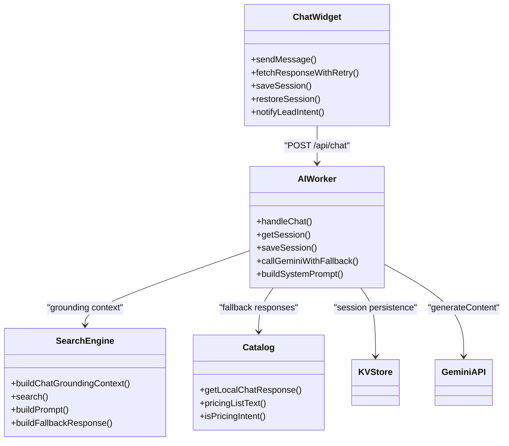
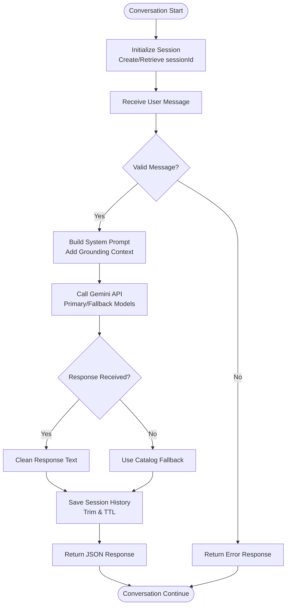

# Conversation Management

<cite>
**Referenced Files in This Document**
- [js/chat.js](file://js/chat.js)
- [workers/webnovis-ai/src/index.js](file://workers/webnovis-ai/src/index.js)
- [workers/webnovis-ai/src/catalog.js](file://workers/webnovis-ai/src/catalog.js)
- [workers/webnovis-ai/src/search-engine.js](file://workers/webnovis-ai/src/search-engine.js)
- [chat-config.json](file://chat-config.json)
- [workers/webnovis-ai/data/chat-config.json](file://workers/webnovis-ai/data/chat-config.json)
- [server.js](file://server.js)
</cite>

## Table of Contents
1. [Introduction](#introduction)
2. [Project Structure](#project-structure)
3. [Core Components](#core-components)
4. [Architecture Overview](#architecture-overview)
5. [Detailed Component Analysis](#detailed-component-analysis)
6. [Dependency Analysis](#dependency-analysis)
7. [Performance Considerations](#performance-considerations)
8. [Troubleshooting Guide](#troubleshooting-guide)
9. [Conclusion](#conclusion)
10. [Appendices](#appendices)

## Introduction
This document explains the multi-turn conversation management system that powers the WebNovis chatbot using Google Gemini API. It covers session handling, conversation memory storage, context preservation across messages, and the full lifecycle from initialization to termination. It also documents message queuing, response streaming considerations, error recovery, configuration options (temperature, max tokens, system prompts), custom flows, message types, state management, timeout handling, memory cleanup strategies, and performance optimization techniques for long conversations.

## Project Structure
The chatbot is implemented as a client-side widget plus a Cloudflare Worker backend:
- Client-side UI and state: js/chat.js
- Backend API and Gemini integration: workers/webnovis-ai/src/index.js
- Fallback responses and catalog data: workers/webnovis-ai/src/catalog.js
- Search engine and grounding context: workers/webnovis-ai/src/search-engine.js
- Configuration files: chat-config.json and workers/webnovis-ai/data/chat-config.json
- Legacy server implementation with in-memory sessions: server.js

**Diagram sources**
- [js/chat.js](file://js/chat.js)
- [workers/webnovis-ai/src/index.js](file://workers/webnovis-ai/src/index.js)
- [workers/webnovis-ai/src/catalog.js](file://workers/webnovis-ai/src/catalog.js)
- [workers/webnovis-ai/src/search-engine.js](file://workers/webnovis-ai/src/search-engine.js)

**Section sources**
- [js/chat.js](file://js/chat.js)
- [workers/webnovis-ai/src/index.js](file://workers/webnovis-ai/src/index.js)
- [workers/webnovis-ai/src/catalog.js](file://workers/webnovis-ai/src/catalog.js)
- [workers/webnovis-ai/src/search-engine.js](file://workers/webnovis-ai/src/search-engine.js)
- [chat-config.json](file://chat-config.json)
- [workers/webnovis-ai/data/chat-config.json](file://workers/webnovis-ai/data/chat-config.json)
- [server.js](file://server.js)

## Core Components
- Chat Widget (Client): Manages UI, user input, local session persistence via localStorage, retry logic, adaptive typing delay, lead intent detection, and connection status.
- AI API Worker (Server): Routes requests, validates inputs, rate limits, builds system prompt, retrieves or creates sessions, constructs Gemini contents, calls Gemini with fallback models, cleans responses, persists history, and returns JSON responses.
- Catalog Fallback: Provides deterministic responses when no API key is configured or when errors occur.
- Search Engine: Builds grounding context from site content to improve relevance and safety of responses.
- Configuration: Centralized company info, services, pricing, and instructions used to build the system prompt.

Key responsibilities:
- Session lifecycle: creation, retrieval, trimming, TTL expiration.
- Context preservation: server-side history sent as contents with roles.
- Error handling: retries, fallbacks, degraded mode indicator.
- Security: sanitization, injection guard, CORS, rate limiting.

**Section sources**
- [js/chat.js](file://js/chat.js)
- [workers/webnovis-ai/src/index.js](file://workers/webnovis-ai/src/index.js)
- [workers/webnovis-ai/src/catalog.js](file://workers/webnovis-ai/src/catalog.js)
- [workers/webnovis-ai/src/search-engine.js](file://workers/webnovis-ai/src/search-engine.js)
- [chat-config.json](file://chat-config.json)
- [workers/webnovis-ai/data/chat-config.json](file://workers/webnovis-ai/data/chat-config.json)

## Architecture Overview
The conversation flow uses a multi-turn architecture where each request includes the current user message and the server-side conversation history. The worker constructs a Gemini-compatible payload with a system instruction and contents array, then returns a cleaned text response. History is persisted with TTL and trimmed to control token usage.

**Diagram sources**
- [js/chat.js](file://js/chat.js)
- [workers/webnovis-ai/src/index.js](file://workers/webnovis-ai/src/index.js)
- [workers/webnovis-ai/src/search-engine.js](file://workers/webnovis-ai/src/search-engine.js)

## Detailed Component Analysis

### Chat Widget (Client)
Responsibilities:
- Initialize UI, handle events, manage state (open/closed, typing, history, sessionId).
- Persist session in localStorage with expiry; restore last messages on load.
- Send messages to /api/chat with retry and adaptive timeout; detect degraded mode and show status bar.
- Detect lead intent patterns and fire-and-forget notification to /api/chat-lead.
- Format bot responses (inline icons, links, lists) and render safely.

Key behaviors:
- Message length cap and character counter.
- Adaptive typing delay proportional to response length.
- Local fallback responses when API unavailable.
- Connection state updates based on success/failure.

Configuration:
- apiEndpoint, leadEndpoint, healthCheckUrl, maxMessageLength, maxHistoryLength, keepAliveInterval, maxRetries, retryDelay, storageKey, storageExpiry.

Error handling:
- Retry with exponential backoff; degrade to local fallback if all attempts fail.
- AbortController-based timeouts per attempt.

Memory management:
- Trim history to maxHistoryLength * 2 before saving.
- Expire localStorage entries older than storageExpiry.

**Section sources**
- [js/chat.js](file://js/chat.js)

### AI API Worker (Server)
Responsibilities:
- Route endpoints: /api/health, /api/chat, /api/chat-lead, /api/search-ai.
- Validate and sanitize inputs; enforce rate limiting by IP.
- Build system prompt from chat-config.json (company info, services, instructions).
- Retrieve/create session with KV store; trim history to SESSION_MAX_MESSAGES * 2.
- Construct Gemini contents with roles 'user'/'model'; call Gemini with primary and fallback models.
- Clean response text; persist updated history; return JSON.

Key behaviors:
- Deterministic quick replies for greetings/thanks without calling Gemini.
- Optional grounding context from search engine for relevant pages.
- Fallback to catalog responses when API key missing or errors occur.

Configuration:
- AI_MODELS (primary/fallback for chat/search).
- SESSION_TTL_SECONDS, SESSION_MAX_MESSAGES, CHAT_RL_LIMIT, SEARCH_RL_WINDOW.
- CORS origins, injection patterns, safe responses.

Error handling:
- Rate limiting returns 429 with retry-after guidance.
- Retryable errors trigger fallback model; otherwise propagate error.
- Fallback responses ensure continuity even when Gemini fails.

**Section sources**
- [workers/webnovis-ai/src/index.js](file://workers/webnovis-ai/src/index.js)
- [workers/webnovis-ai/src/catalog.js](file://workers/webnovis-ai/src/catalog.js)
- [workers/webnovis-ai/src/search-engine.js](file://workers/webnovis-ai/src/search-engine.js)
- [workers/webnovis-ai/data/chat-config.json](file://workers/webnovis-ai/data/chat-config.json)

### Search Engine and Grounding
Responsibilities:
- Tokenize and score documents against queries with intent inference.
- Build prompts for search results and fallback responses.
- Provide grounding context for chat to improve relevance and safety.

Key behaviors:
- Normalize text, stop words, safe text truncation.
- Prefer service and canonical pages for commercial queries.
- Cache keys for search results via KV.

**Section sources**
- [workers/webnovis-ai/src/search-engine.js](file://workers/webnovis-ai/src/search-engine.js)

### Configuration
- chat-config.json and workers/webnovis-ai/data/chat-config.json define company info, services, pricing, timeline, and chatbotInstructions.
- System prompt is built from these fields to constrain responses and guide behavior.

Usage:
- System prompt includes instructions, company details, and services list.
- Ensures consistent tone, scope, and safety constraints.

**Section sources**
- [chat-config.json](file://chat-config.json)
- [workers/webnovis-ai/data/chat-config.json](file://workers/webnovis-ai/data/chat-config.json)

### Legacy Server Implementation
Responsibilities:
- In-memory session store with TTL and concurrent session limits.
- Build system prompt and call Gemini with configurable temperature and max tokens.
- Sanitize inputs, guard against prompt injection, and append turns to server-tracked history.

Key behaviors:
- Periodic cleanup of expired sessions.
- Fallback to local responses when API unavailable.
- Strict server-side history enforcement to prevent tampering.

**Section sources**
- [server.js](file://server.js)

## Dependency Analysis
The system has clear separation between client and server concerns:
- Client depends on API endpoints and local storage.
- Server depends on KV storage, search engine, and external Gemini API.
- Catalog provides deterministic fallbacks independent of Gemini.

**Diagram sources**
- [js/chat.js](file://js/chat.js)
- [workers/webnovis-ai/src/index.js](file://workers/webnovis-ai/src/index.js)
- [workers/webnovis-ai/src/search-engine.js](file://workers/webnovis-ai/src/search-engine.js)
- [workers/webnovis-ai/src/catalog.js](file://workers/webnovis-ai/src/catalog.js)

**Section sources**
- [js/chat.js](file://js/chat.js)
- [workers/webnovis-ai/src/index.js](file://workers/webnovis-ai/src/index.js)
- [workers/webnovis-ai/src/search-engine.js](file://workers/webnovis-ai/src/search-engine.js)
- [workers/webnovis-ai/src/catalog.js](file://workers/webnovis-ai/src/catalog.js)

## Performance Considerations
- Token efficiency: Trim history to SESSION_MAX_MESSAGES * 2; use concise system prompts; avoid excessive markdown.
- Caching: Use KV cache for search results; leverage fallback responses for common intents.
- Rate limiting: Protect endpoints from abuse; provide graceful degradation.
- Timeouts: Adaptive timeouts per retry; abort controller prevents hanging requests.
- Memory cleanup: Periodic eviction of old sessions; localStorage expiry; KV TTL.
- Streaming: Current implementation returns complete text; consider streaming for long responses if needed.

[No sources needed since this section provides general guidance]

## Troubleshooting Guide
Common issues and resolutions:
- No response from API: Check network connectivity, CORS settings, and environment variables (GEMINI_API_KEY_CHAT).
- Degraded mode: Indicates fallback responses are being used; verify API availability and credentials.
- Rate limited: Reduce request frequency or adjust limits; check retry-after headers.
- Prompt injection blocked: Ensure messages do not contain injection patterns; sanitize inputs.
- Session loss: Verify localStorage permissions and expiry settings; confirm server-side session persistence.

**Section sources**
- [js/chat.js](file://js/chat.js)
- [workers/webnovis-ai/src/index.js](file://workers/webnovis-ai/src/index.js)

## Conclusion
The conversation management system provides a robust, secure, and scalable solution for multi-turn chatbot interactions using Google Gemini API. It balances performance, reliability, and user experience through careful session management, context preservation, error handling, and configuration-driven behavior. The modular architecture allows easy extension and customization while maintaining strict security and operational safeguards.

[No sources needed since this section summarizes without analyzing specific files]

## Appendices

### Conversation Lifecycle Flowchart

**Diagram sources**
- [workers/webnovis-ai/src/index.js](file://workers/webnovis-ai/src/index.js)
- [workers/webnovis-ai/src/catalog.js](file://workers/webnovis-ai/src/catalog.js)

### Configuration Options Reference
- Temperature: Controls response creativity (default 0.7).
- Max Output Tokens: Limits response length (default 800).
- System Prompts: Define behavior, scope, and safety constraints.
- Session TTL: Controls how long sessions persist (30 minutes).
- Rate Limits: Prevent abuse (30 requests per 15 minutes for chat).

**Section sources**
- [workers/webnovis-ai/src/index.js](file://workers/webnovis-ai/src/index.js)
- [chat-config.json](file://chat-config.json)