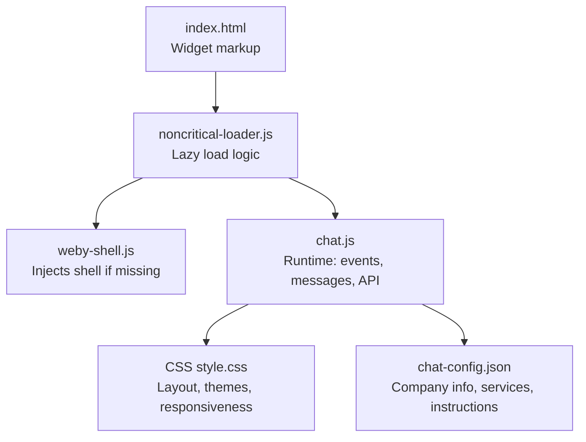
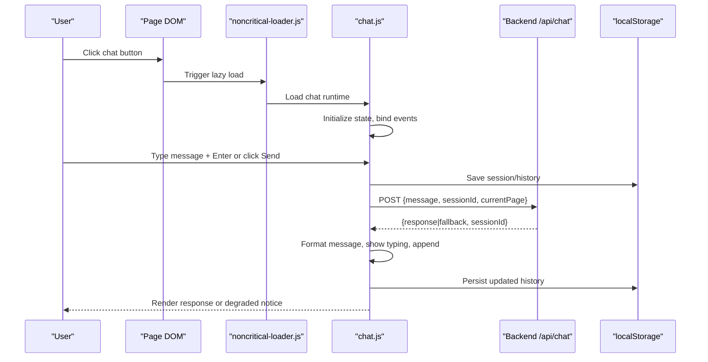
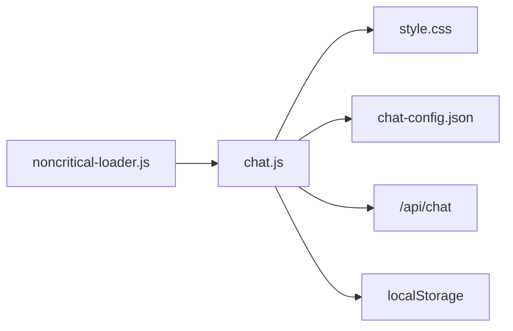

# Frontend Integration & UI Components

<cite>
**Referenced Files in This Document**
- [chat.js](file://js/chat.js)
- [style.css](file://css/style.css)
- [index.html](file://src/html/index.html)
- [noncritical-loader.js](file://js/noncritical-loader.js)
- [weby-shell.js](file://js/weby-shell.js)
- [chat-config.json](file://chat-config.json)
- [README-CHAT.md](file://docs/chatbot/README-CHAT.md)
</cite>

## Table of Contents
1. [Introduction](#introduction)
2. [Project Structure](#project-structure)
3. [Core Components](#core-components)
4. [Architecture Overview](#architecture-overview)
5. [Detailed Component Analysis](#detailed-component-analysis)
6. [Dependency Analysis](#dependency-analysis)
7. [Performance Considerations](#performance-considerations)
8. [Troubleshooting Guide](#troubleshooting-guide)
9. [Conclusion](#conclusion)
10. [Appendices](#appendices)

## Introduction
This document explains the chatbot frontend integration and user interface components for the WebNovis site. It covers the JavaScript chat interface, connection management, message formatting, customization options, styling and theming, responsive design, accessibility, and troubleshooting. The implementation uses a lightweight widget that loads on demand and communicates with a backend API endpoint to provide AI-powered responses with local fallbacks when needed.

## Project Structure
The chat widget is composed of:
- A minimal HTML shell embedded in the page or injected dynamically
- A non-critical loader that ensures the widget only loads when needed
- A runtime script that handles UI interactions, messaging, and state
- CSS styles for layout, animations, and responsive behavior
- A configuration file for company info, services, and bot instructions

**Diagram sources**
- [index.html:720-760](file://src/html/index.html#L720-L760)
- [noncritical-loader.js:101-128](file://js/noncritical-loader.js#L101-L128)
- [weby-shell.js:47-99](file://js/weby-shell.js#L47-L99)
- [chat.js:35-797](file://js/chat.js#L35-L797)
- [style.css:4633-5149](file://css/style.css#L4633-L5149)
- [chat-config.json:1-109](file://chat-config.json#L1-L109)

**Section sources**
- [index.html:720-760](file://src/html/index.html#L720-L760)
- [noncritical-loader.js:101-128](file://js/noncritical-loader.js#L101-L128)
- [weby-shell.js:47-99](file://js/weby-shell.js#L47-L99)
- [chat.js:35-797](file://js/chat.js#L35-L797)
- [style.css:4633-5149](file://css/style.css#L4633-L5149)
- [chat-config.json:1-109](file://chat-config.json#L1-L109)

## Core Components
- Chat runtime (chat.js): Initializes the widget, manages state, handles events, formats messages, calls the API with retries and adaptive timeouts, persists session history, detects lead intent, and renders typing indicators and status bars.
- Non-critical loader (noncritical-loader.js): Detects whether the page has the widget markup; injects a minimal shell if missing, then loads the chat runtime on first interaction to avoid blocking initial page load.
- Shell injector (weby-shell.js): Creates the DOM structure for the chat popup, header, messages area, input, and send button when not present in the page markup.
- Styles (style.css): Defines the chat popup, header, messages, avatars, quick replies, input area, typing indicator, and mobile-responsive rules.
- Configuration (chat-config.json): Contains company info, service catalog, timelines, and detailed bot instructions used by the backend and reflected in UI copy.

Key responsibilities:
- Lazy loading to improve performance
- Event handling for opening/closing, sending messages, quick replies
- Message formatting for rich content (lists, inline code, links, icons)
- Connection resilience via retries and local fallback
- Accessibility features (ARIA roles, live regions, keyboard support)
- Mobile UX improvements (full-screen mode on focus, scroll locking)

**Section sources**
- [chat.js:35-797](file://js/chat.js#L35-L797)
- [noncritical-loader.js:101-128](file://js/noncritical-loader.js#L101-L128)
- [weby-shell.js:47-99](file://js/weby-shell.js#L47-L99)
- [style.css:4633-5149](file://css/style.css#L4633-L5149)
- [chat-config.json:1-109](file://chat-config.json#L1-L109)

## Architecture Overview
The chat widget follows a client-side event-driven architecture with asynchronous API communication:

**Diagram sources**
- [noncritical-loader.js:101-128](file://js/noncritical-loader.js#L101-L128)
- [chat.js:148-228](file://js/chat.js#L148-L228)
- [chat.js:430-479](file://js/chat.js#L430-L479)
- [chat.js:533-580](file://js/chat.js#L533-L580)
- [chat.js:605-644](file://js/chat.js#L605-L644)

## Detailed Component Analysis

### Chat Runtime (chat.js)
Responsibilities:
- Initialization and element binding
- State management (open/close, typing, history, session, connection)
- Event listeners for toggle, close, input, send, quick replies
- Message rendering with rich formatting
- API calls with retry logic and adaptive timeout
- Local fallback when API fails or returns empty
- Session persistence via localStorage
- Lead intent detection and notification
- Mobile UX enhancements (focus handling, full-screen mode)
- Accessibility: ARIA attributes, live regions, character counter announcements

Message formatting highlights:
- Converts lists into ordered or unordered lists
- Renders inline code spans
- Escapes HTML to prevent injection
- Supports inline icon placeholders mapped to SVGs
- Auto-links emails, WhatsApp links, and URLs

Connection management:
- Uses fetch with AbortController for timeouts
- Retries up to configured attempts with exponential backoff
- Adapts typing delay based on response length
- Displays a degraded status bar when offline/local fallback is used

Session persistence:
- Stores last N messages and sessionId
- Restores recent conversation on next visit
- Expiry policy to clear stale sessions

Lead intent detection:
- Pattern matching on keywords
- Fire-and-forget notification to lead endpoint

Mobile UX:
- Full-screen popup on focus
- Scroll lock while open
- Adjusted delays for bubble visibility

Accessibility:
- ARIA roles and labels on container, messages, input, buttons
- Live region for status updates and character counter
- Keyboard support (Enter to send)

**Section sources**
- [chat.js:35-797](file://js/chat.js#L35-L797)

### Non-Critical Loader (noncritical-loader.js)
Responsibilities:
- Detects presence of chat widget markup
- Injects shell if missing, then loads runtime
- Binds click intent to ensure chat loads only when user interacts
- Prevents duplicate initialization

Performance impact:
- Defers heavy JS until needed
- Reduces initial payload and improves LCP

**Section sources**
- [noncritical-loader.js:101-128](file://js/noncritical-loader.js#L101-L128)

### Shell Injector (weby-shell.js)
Responsibilities:
- Creates chat popup structure (header, messages, input, send)
- Ensures accessibility attributes are set
- Appends to DOM when markup is absent

Use case:
- Pages without embedded widget markup still get a functional chat after user interaction

**Section sources**
- [weby-shell.js:47-99](file://js/weby-shell.js#L47-L99)

### Styling and Theming (style.css)
Key areas:
- Popup container and header with avatar and status
- Messages area with custom scrollbar
- Message bubbles for user and bot with distinct styles
- Rich content containers for lists, links, code
- Typing indicator animation
- Quick reply buttons with hover effects
- Input area and send button styling
- Mobile responsive adjustments (full-width popup, FAB positioning)

Theming hooks:
- Uses CSS variables for gradients and colors
- Consistent border radii and spacing
- Subtle transparency and backdrop effects

Responsive considerations:
- On small screens, popup becomes full-width and near-full-height
- FAB remains visible and accessible
- Touch-friendly sizing for controls

**Section sources**
- [style.css:4633-5149](file://css/style.css#L4633-L5149)

### Configuration (chat-config.json)
Contents:
- Company info (name, tagline, contact details)
- Service catalog with names, prices, descriptions
- Timelines per service category
- Bot instructions guiding tone, scope, safety, and conversion goals

Usage:
- Backend references these to shape responses
- UI reflects company branding and service offerings

Customization guidance:
- Update prices, services, and instructions to match business needs
- Keep contact links accurate for human handoff

**Section sources**
- [chat-config.json:1-109](file://chat-config.json#L1-L109)

### HTML Integration Points (index.html)
Markup includes:
- Floating chat button with accessible label
- Chat popup with header, AI notice, messages log, quick replies, input, and send
- Inline SVG icons and images optimized for web

Accessibility:
- ARIA roles and labels for dialog-like behavior
- Live region for conversation updates
- Clear affordances for closing and sending

**Section sources**
- [index.html:720-760](file://src/html/index.html#L720-L760)

## Dependency Analysis
The chat system has clear boundaries and low coupling:
- Loader depends on DOM presence and triggers runtime load
- Runtime depends on DOM elements, CSS classes, and API endpoints
- Styles depend on class names defined in markup and runtime-generated nodes
- Configuration is consumed by backend and informs UI copy

Potential circular dependencies:
- None observed; loader and runtime are separate concerns

External integrations:
- HTTP API endpoint for chat responses
- Optional health check endpoint for keep-alive warm-up
- Local storage for session persistence

**Diagram sources**
- [noncritical-loader.js:101-128](file://js/noncritical-loader.js#L101-L128)
- [chat.js:430-580](file://js/chat.js#L430-L580)
- [style.css:4633-5149](file://css/style.css#L4633-L5149)
- [chat-config.json:1-109](file://chat-config.json#L1-L109)

**Section sources**
- [noncritical-loader.js:101-128](file://js/noncritical-loader.js#L101-L128)
- [chat.js:430-580](file://js/chat.js#L430-L580)
- [style.css:4633-5149](file://css/style.css#L4633-L5149)
- [chat-config.json:1-109](file://chat-config.json#L1-L109)

## Performance Considerations
- Lazy loading: The loader ensures the chat runtime only loads when the user interacts, reducing initial bundle size and improving time-to-interactive.
- Adaptive timeouts and retries: Prevent long hangs and improve perceived responsiveness.
- Local fallback: Guarantees continuity when the API is unavailable, avoiding dead ends.
- Efficient DOM updates: Messages are appended minimally; scrolling uses requestAnimationFrame.
- Memory management: History is truncated to a fixed size; sessions expire after a threshold.
- Network efficiency: Health checks use keepalive and are throttled to avoid unnecessary requests.

[No sources needed since this section provides general guidance]

## Troubleshooting Guide
Common issues and resolutions:
- Widget does not open:
  - Ensure the page contains the chat button or that the loader can detect a chat container
  - Check browser console for errors during script loading
  - Verify that the loader is included and not blocked by CSP or ad blockers
- No responses from AI:
  - Confirm the API endpoint is reachable and CORS is allowed
  - Check network tab for failed requests or empty responses
  - If degraded, expect local fallback responses; verify the status bar appears
- Rendering errors:
  - Validate that required DOM IDs exist (button, popup, messages, input, send)
  - Ensure CSS classes are intact and not overridden by site styles
  - Inspect message content for malformed HTML; the runtime escapes user input
- Performance issues:
  - Monitor memory usage if many messages accumulate; history is capped but excessive DOM nodes can slow scrolling
  - Avoid heavy animations on message content; prefer simple text and lists
- Accessibility problems:
  - Confirm ARIA roles and labels are present
  - Test keyboard navigation (Enter to send, Escape to close if implemented)
  - Verify screen reader announces status changes and character count

Operational tips:
- Use browser DevTools to inspect network requests and payloads
- Temporarily disable extensions that might block scripts or fetch
- For local development, confirm the correct endpoint URL is configured

**Section sources**
- [README-CHAT.md:148-166](file://docs/chatbot/README-CHAT.md#L148-L166)
- [chat.js:430-580](file://js/chat.js#L430-L580)
- [style.css:4633-5149](file://css/style.css#L4633-L5149)

## Conclusion
The chatbot frontend integrates a lightweight, accessible, and performant widget that loads on demand and communicates reliably with a backend API. It supports rich message formatting, resilient connections, and thoughtful mobile UX. Customization is straightforward through configuration and styles, while accessibility and performance are prioritized throughout the implementation.

[No sources needed since this section summarizes without analyzing specific files]

## Appendices

### Integration Example
To integrate the chat widget into an existing page:
- Include the non-critical loader script in your page footer
- Add the chat button and optional popup markup, or rely on the shell injector
- Ensure CSS styles are loaded
- Optionally configure endpoints and behavior via environment variables or config files

Reference paths:
- Loader entry: [noncritical-loader.js:101-128](file://js/noncritical-loader.js#L101-L128)
- Markup example: [index.html:720-760](file://src/html/index.html#L720-L760)
- Shell injection: [weby-shell.js:47-99](file://js/weby-shell.js#L47-L99)

**Section sources**
- [noncritical-loader.js:101-128](file://js/noncritical-loader.js#L101-L128)
- [index.html:720-760](file://src/html/index.html#L720-L760)
- [weby-shell.js:47-99](file://js/weby-shell.js#L47-L99)

### Message Formatting Reference
Supported formatting behaviors:
- Lists: Ordered and unordered lists detected and rendered
- Inline code: Backtick-wrapped text rendered as code spans
- Links: Emails, WhatsApp links, and URLs auto-linked
- Icons: Placeholder tokens replaced with inline SVGs
- Rich containers: Styled blocks for readability and hierarchy

Implementation reference:
- [chat.js:355-403](file://js/chat.js#L355-L403)

**Section sources**
- [chat.js:355-403](file://js/chat.js#L355-L403)

### Accessibility Checklist
- ARIA roles and labels on container, messages, input, and buttons
- Live regions for status updates and character counter
- Keyboard support for sending messages
- High contrast and readable typography
- Screen reader friendly announcements

References:
- [chat.js:168-228](file://js/chat.js#L168-L228)
- [index.html:720-760](file://src/html/index.html#L720-L760)

**Section sources**
- [chat.js:168-228](file://js/chat.js#L168-L228)
- [index.html:720-760](file://src/html/index.html#L720-L760)