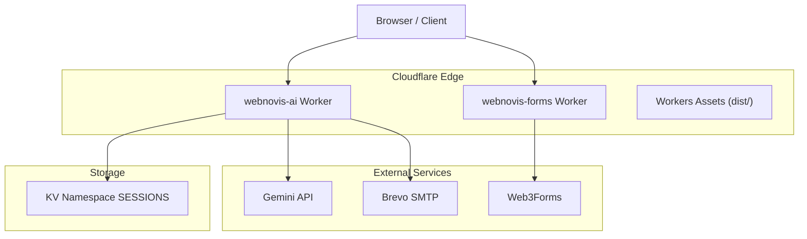
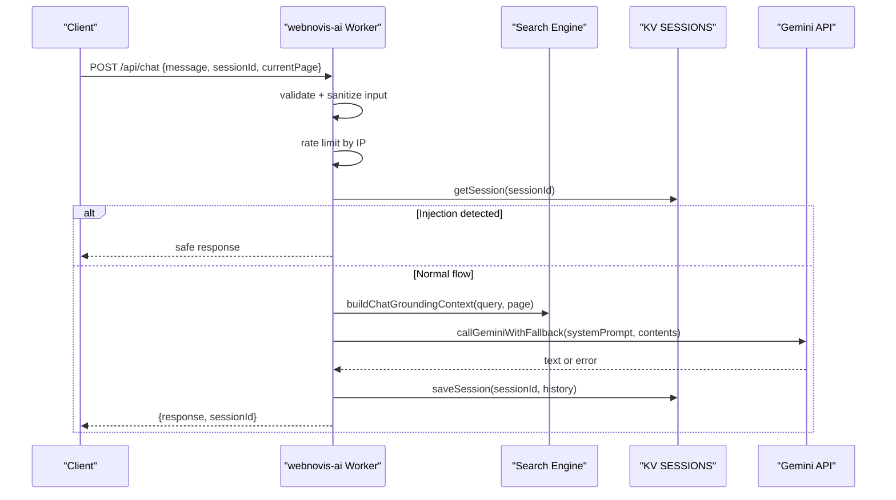
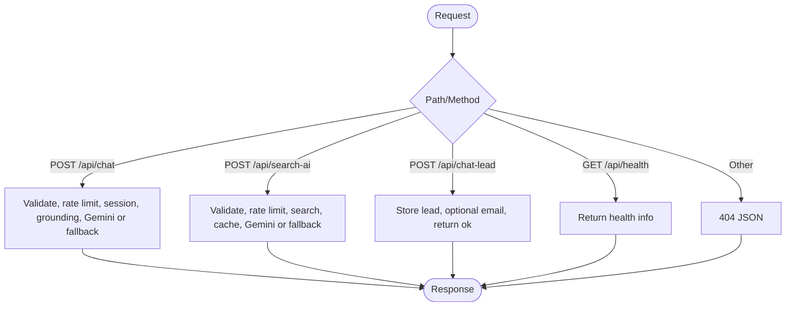
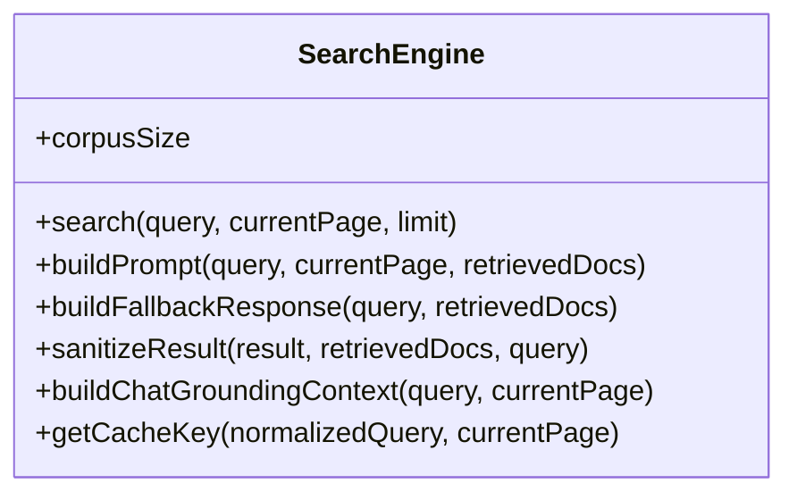
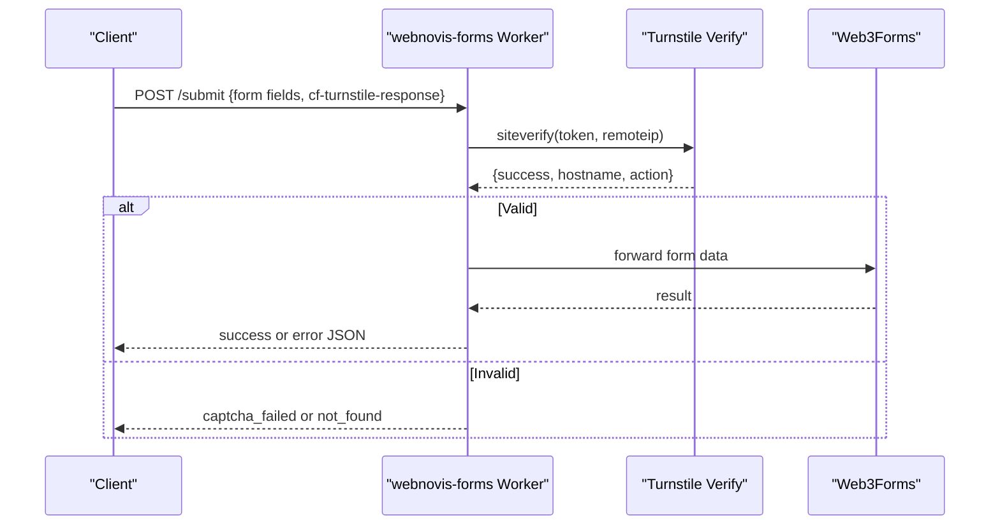
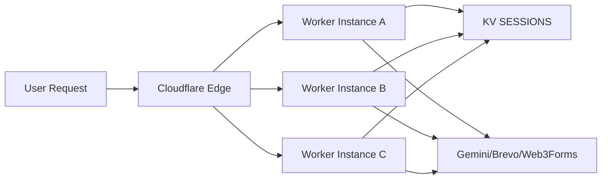
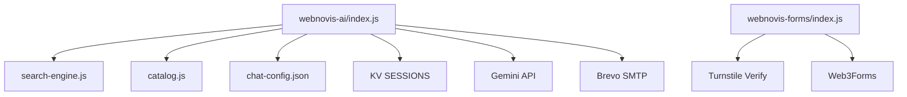

# Worker Processing & Edge Deployment

<cite>
**Referenced Files in This Document**
- [index.js](file://workers/webnovis-ai/src/index.js)
- [search-engine.js](file://workers/webnovis-ai/src/search-engine.js)
- [catalog.js](file://workers/webnovis-ai/src/catalog.js)
- [chat-config.json](file://workers/webnovis-ai/data/chat-config.json)
- [wrangler.jsonc (AI worker)](file://workers/webnovis-ai/wrangler.jsonc)
- [index.js (forms worker)](file://workers/webnovis-forms/src/index.js)
- [wrangler.jsonc (forms worker)](file://workers/webnovis-forms/wrangler.jsonc)
- [wrangler.jsonc (site assets)](file://wrangler.jsonc)
- [setup-cloudflare-ai.sh](file://scripts/setup-cloudflare-ai.sh)
- [CLOUDFLARE-AI-SETUP.md](file://docs/CLOUDFLARE-AI-SETUP.md)
- [CLOUDFLARE-CONFIGURAZIONE-PASSO-PASSO.md](file://docs/deploy/CLOUDFLARE-CONFIGURAZIONE-PASSO-PASSO.md)
</cite>

## Table of Contents
1. Introduction
2. Project Structure
3. Core Components
4. Architecture Overview
5. Detailed Component Analysis
6. Dependency Analysis
7. Performance Considerations
8. Troubleshooting Guide
9. Conclusion
10. Appendices

## Introduction
This document explains the Cloudflare Workers-based chatbot processing system and its edge deployment model. It covers request routing, load balancing across multiple workers, global distribution benefits, worker lifecycle, environment variable management, configuration for development and production, API endpoints, request/response formats, error handling patterns, scaling strategies, monitoring, debugging, and operational guidance such as versioning, deployment strategies, and rollback procedures.

## Project Structure
The project includes two primary Cloudflare Workers:
- webnovis-ai: AI-powered chat and search endpoints with grounding from a local index and optional Gemini calls.
- webnovis-forms: A secure form proxy that validates Turnstile tokens and forwards submissions to an upstream provider.

A root-level Wrangler configuration serves static assets built into dist/ with custom HTML handling rules.

**Diagram sources**
- [index.js:508-543](file://workers/webnovis-ai/src/index.js#L508-L543)
- [index.js:198-247](file://workers/webnovis-ai/src/index.js#L198-L247)
- [index.js:442-506](file://workers/webnovis-ai/src/index.js#L442-L506)
- [index.js:88-116](file://workers/webnovis-ai/src/index.js#L88-L116)
- [index.js:141-151](file://workers/webnovis-ai/src/index.js#L141-L151)
- [index.js:178-196](file://workers/webnovis-ai/src/index.js#L178-L196)
- [index.js:370-440](file://workers/webnovis-ai/src/index.js#L370-L440)
- [index.js:370-440](file://workers/webnovis-ai/src/index.js#L370-L440)
- [index.js:1-172](file://workers/webnovis-forms/src/index.js#L1-L172)
- [wrangler.jsonc (AI worker):1-26](file://workers/webnovis-ai/wrangler.jsonc#L1-L26)
- [wrangler.jsonc (forms worker):1-20](file://workers/webnovis-forms/wrangler.jsonc#L1-L20)
- [wrangler.jsonc (site assets):1-30](file://wrangler.jsonc#L1-L30)

**Section sources**
- [index.js:508-543](file://workers/webnovis-ai/src/index.js#L508-L543)
- [index.js:1-172](file://workers/webnovis-forms/src/index.js#L1-L172)
- [wrangler.jsonc (AI worker):1-26](file://workers/webnovis-ai/wrangler.jsonc#L1-L26)
- [wrangler.jsonc (forms worker):1-20](file://workers/webnovis-forms/wrangler.jsonc#L1-L20)
- [wrangler.jsonc (site assets):1-30](file://wrangler.jsonc#L1-L30)

## Core Components
- webnovis-ai Worker
  - Exposes health, chat, search, and lead capture endpoints.
  - Implements rate limiting via KV, session persistence, prompt injection protection, and fallback responses when external APIs are unavailable.
  - Uses a local search engine to ground chat and search prompts with site content.
- webnovis-forms Worker
  - Validates Turnstile tokens server-side and forwards form data to Web3Forms.
  - Provides a health endpoint and strict validation for inputs.
- Site assets
  - Served via Cloudflare Workers Assets with explicit HTML handling to preserve existing URLs.

Key responsibilities:
- Request routing and CORS enforcement in the AI worker.
- Secure secret usage via Wrangler secrets.
- KV-backed sessions, rate limits, and lead storage.
- External integrations: Gemini API and Brevo email; forms forwarding to Web3Forms.

**Section sources**
- [index.js:70-116](file://workers/webnovis-ai/src/index.js#L70-L116)
- [index.js:141-151](file://workers/webnovis-ai/src/index.js#L141-L151)
- [index.js:178-196](file://workers/webnovis-ai/src/index.js#L178-L196)
- [index.js:266-368](file://workers/webnovis-ai/src/index.js#L266-L368)
- [index.js:370-440](file://workers/webnovis-ai/src/index.js#L370-L440)
- [index.js:442-506](file://workers/webnovis-ai/src/index.js#L442-L506)
- [index.js:508-543](file://workers/webnovis-ai/src/index.js#L508-L543)
- [index.js:1-172](file://workers/webnovis-forms/src/index.js#L1-L172)

## Architecture Overview
The AI worker routes requests to handlers based on method and path. It enforces CORS, applies rate limits, persists sessions, and optionally calls Gemini with fallback models. The search engine builds grounded prompts from a prebuilt index. The forms worker validates Turnstile tokens and proxies submissions.

**Diagram sources**
- [index.js:266-368](file://workers/webnovis-ai/src/index.js#L266-L368)
- [index.js:178-196](file://workers/webnovis-ai/src/index.js#L178-L196)
- [index.js:141-151](file://workers/webnovis-ai/src/index.js#L141-L151)
- [index.js:198-247](file://workers/webnovis-ai/src/index.js#L198-L247)
- [search-engine.js:351-367](file://workers/webnovis-ai/src/search-engine.js#L351-L367)

**Section sources**
- [index.js:508-543](file://workers/webnovis-ai/src/index.js#L508-L543)
- [index.js:266-368](file://workers/webnovis-ai/src/index.js#L266-L368)
- [index.js:370-440](file://workers/webnovis-ai/src/index.js#L370-L440)
- [search-engine.js:188-377](file://workers/webnovis-ai/src/search-engine.js#L188-L377)

## Detailed Component Analysis

### AI Worker: Routing, Endpoints, and Error Handling
- Endpoints
  - GET /api/health, /health, /: returns service status and corpus size.
  - POST /api/chat: conversational chat with grounding and fallbacks.
  - POST /api/search-ai: site search with JSON responses and caching.
  - POST /api/chat-lead: captures leads and optionally emails notifications.
- CORS
  - Dynamically allows configured origins plus localhost variants.
- Rate Limiting
  - Per-IP counters stored in KV with time windows.
- Sessions
  - Optional KV-backed session store with TTL and message trimming.
- External Calls
  - Gemini API with primary/fallback models and timeouts.
  - Brevo SMTP for lead notifications (fire-and-forget).
- Error Handling
  - Graceful fallbacks for missing keys or API errors.
  - Consistent JSON error responses with appropriate HTTP codes.

**Diagram sources**
- [index.js:508-543](file://workers/webnovis-ai/src/index.js#L508-L543)
- [index.js:266-368](file://workers/webnovis-ai/src/index.js#L266-L368)
- [index.js:370-440](file://workers/webnovis-ai/src/index.js#L370-L440)
- [index.js:442-506](file://workers/webnovis-ai/src/index.js#L442-L506)

**Section sources**
- [index.js:70-116](file://workers/webnovis-ai/src/index.js#L70-L116)
- [index.js:141-151](file://workers/webnovis-ai/src/index.js#L141-L151)
- [index.js:178-196](file://workers/webnovis-ai/src/index.js#L178-L196)
- [index.js:266-368](file://workers/webnovis-ai/src/index.js#L266-L368)
- [index.js:370-440](file://workers/webnovis-ai/src/index.js#L370-L440)
- [index.js:442-506](file://workers/webnovis-ai/src/index.js#L442-L506)
- [index.js:508-543](file://workers/webnovis-ai/src/index.js#L508-L543)

### Search Engine: Grounding and Prompt Construction
- Token/intent hybrid ranking over a prepared corpus.
- Builds prompts for Gemini with curated context snippets.
- Produces sanitized results with allowed URLs and related queries.
- Supports chat grounding to enrich conversation context.

**Diagram sources**
- [search-engine.js:188-377](file://workers/webnovis-ai/src/search-engine.js#L188-L377)

**Section sources**
- [search-engine.js:16-65](file://workers/webnovis-ai/src/search-engine.js#L16-L65)
- [search-engine.js:72-157](file://workers/webnovis-ai/src/search-engine.js#L72-L157)
- [search-engine.js:188-377](file://workers/webnovis-ai/src/search-engine.js#L188-L377)

### Forms Worker: Turnstile Validation and Upstream Forwarding
- Validates Turnstile token and hostname allowlist.
- Accepts multipart/form-data, URL-encoded, or JSON payloads.
- Forwards validated forms to Web3Forms with timeout handling.
- Returns consistent JSON responses and supports health checks.

**Diagram sources**
- [index.js:36-85](file://workers/webnovis-forms/src/index.js#L36-L85)
- [index.js:87-172](file://workers/webnovis-forms/src/index.js#L87-L172)

**Section sources**
- [index.js:1-172](file://workers/webnovis-forms/src/index.js#L1-L172)

### Configuration and Environment Management
- Secrets and variables
  - AI worker uses KV binding named SESSIONS and secrets for API keys and email credentials.
  - Forms worker uses secrets for Turnstile and optional Web3Forms access key.
  - Vars include service names, environments, and hostnames.
- Development vs Production
  - Local dev uses workers_dev and preview_urls.
  - Production deploys via Wrangler with secrets managed securely.
- Asset serving
  - Root wrangler config serves dist/ with html_handling set to none to preserve existing URLs.

**Section sources**
- [wrangler.jsonc (AI worker):1-26](file://workers/webnovis-ai/wrangler.jsonc#L1-L26)
- [wrangler.jsonc (forms worker):1-20](file://workers/webnovis-forms/wrangler.jsonc#L1-L20)
- [wrangler.jsonc (site assets):1-30](file://wrangler.jsonc#L1-L30)
- [CLOUDFLARE-AI-SETUP.md:46-103](file://docs/CLOUDFLARE-AI-SETUP.md#L46-L103)

## Architecture Overview
Global distribution and edge execution:
- Requests are served at Cloudflare’s edge locations, minimizing latency.
- Load balancing occurs automatically across the global network; multiple worker instances can be scaled out transparently by Cloudflare.
- KV is region-aware; ensure bindings are correctly provisioned per environment.

[No sources needed since this diagram shows conceptual workflow, not actual code structure]

## Detailed Component Analysis

### API Endpoints and Formats
- GET /api/health
  - Response: status, service name, platform, corpus size, timestamp.
- POST /api/chat
  - Request: message, sessionId (optional), currentPage (optional).
  - Response: response, sessionId; may include fallback flag if local fallback used.
  - Errors: 400 for invalid messages; 429 for rate limit exceeded; 500 for internal errors.
- POST /api/search-ai
  - Request: query, currentPage (optional).
  - Response: answer, suggestedPages, relatedQueries; cached via KV when available.
  - Errors: 400 for invalid query; 429 for rate limit exceeded; 500 for internal errors.
- POST /api/chat-lead
  - Request: message, page (optional), sessionId (optional), messageCount (optional).
  - Response: ok boolean.
  - Side effects: stores lead in KV and optionally sends notification email.

**Section sources**
- [index.js:508-543](file://workers/webnovis-ai/src/index.js#L508-L543)
- [index.js:266-368](file://workers/webnovis-ai/src/index.js#L266-L368)
- [index.js:370-440](file://workers/webnovis-ai/src/index.js#L370-L440)
- [index.js:442-506](file://workers/webnovis-ai/src/index.js#L442-L506)

### Request Flow and Data Handling
- Input sanitization and length limits protect against abuse and reduce payload sizes.
- Session history is trimmed before saving to control memory usage.
- KV-backed rate limiting ensures fair usage across clients.
- External API calls use timeouts and retries via fallback models.

**Section sources**
- [index.js:266-368](file://workers/webnovis-ai/src/index.js#L266-L368)
- [index.js:178-196](file://workers/webnovis-ai/src/index.js#L178-L196)
- [index.js:141-151](file://workers/webnovis-ai/src/index.js#L141-L151)
- [index.js:198-247](file://workers/webnovis-ai/src/index.js#L198-L247)

### Security and Safety
- Prompt injection detection blocks malicious attempts with a safe response.
- CORS restricts allowed origins dynamically based on environment variables.
- Secrets are never committed; use Wrangler secrets for sensitive values.
- WAF rules block exposure of source files and configuration artifacts.

**Section sources**
- [index.js:35-69](file://workers/webnovis-ai/src/index.js#L35-L69)
- [index.js:80-116](file://workers/webnovis-ai/src/index.js#L80-L116)
- [CLOUDFLARE-CONFIGURAZIONE-PASSO-PASSO.md:104-159](file://docs/deploy/CLOUDFLARE-CONFIGURAZIONE-PASSO-PASSO.md#L104-L159)

### Scaling and Global Distribution
- Automatic scaling: Cloudflare scales worker instances globally without manual intervention.
- KV namespaces provide distributed key-value storage bound to the worker.
- Observability enabled via Wrangler settings for performance insights.

**Section sources**
- [wrangler.jsonc (AI worker):11-14](file://workers/webnovis-ai/wrangler.jsonc#L11-L14)
- [wrangler.jsonc (AI worker):19-25](file://workers/webnovis-ai/wrangler.jsonc#L19-L25)

### Monitoring and Debugging
- Use Wrangler logs and observability features to inspect requests and errors.
- Health endpoints help verify availability and configuration.
- KV inspection helps debug sessions, rate limits, and caches.
- CSP and WAF rules should be tuned using report-only modes during rollout.

**Section sources**
- [wrangler.jsonc (AI worker):11-14](file://workers/webnovis-ai/wrangler.jsonc#L11-L14)
- [index.js:508-543](file://workers/webnovis-ai/src/index.js#L508-L543)
- [CLOUDFLARE-CONFIGURAZIONE-PASSO-PASSO.md:28-100](file://docs/deploy/CLOUDFLARE-CONFIGURAZIONE-PASSO-PASSO.md#L28-L100)

## Dependency Analysis
- AI worker depends on:
  - search-engine.js for indexing and prompt construction.
  - catalog.js for localized fallback responses and pricing logic.
  - chat-config.json for company info, services, and instructions.
  - KV namespace SESSIONS for sessions, rate limits, and caches.
  - External APIs: Gemini and Brevo.
- Forms worker depends on:
  - Turnstile verification endpoint.
  - Web3Forms upstream endpoint.
  - Wrangler secrets for TURNSTILE_SECRET and optional WEB3FORMS_ACCESS_KEY.

**Diagram sources**
- [index.js:5-8](file://workers/webnovis-ai/src/index.js#L5-L8)
- [index.js:198-247](file://workers/webnovis-ai/src/index.js#L198-L247)
- [index.js:442-506](file://workers/webnovis-ai/src/index.js#L442-L506)
- [index.js:1-172](file://workers/webnovis-forms/src/index.js#L1-L172)

**Section sources**
- [index.js:5-8](file://workers/webnovis-ai/src/index.js#L5-L8)
- [index.js:198-247](file://workers/webnovis-ai/src/index.js#L198-L247)
- [index.js:442-506](file://workers/webnovis-ai/src/index.js#L442-L506)
- [index.js:1-172](file://workers/webnovis-forms/src/index.js#L1-L172)

## Performance Considerations
- Execution timeouts:
  - External API calls use timeouts to prevent hanging requests.
- Memory limits:
  - Session history is trimmed to bounded size; KV TTLs manage retention.
- Cold start optimization:
  - Keep modules small and avoid heavy initialization; leverage KV caching for search results.
- Rate limiting:
  - Protects against spikes and reduces unnecessary external calls.
- Asset caching:
  - Versioned assets benefit from long-lived edge caching rules.

[No sources needed since this section provides general guidance]

## Troubleshooting Guide
Common issues and resolutions:
- Authentication failures:
  - Ensure Wrangler login is active and correct account is selected.
- Missing secrets:
  - Set required secrets via Wrangler; verify they are present in the target environment.
- KV binding errors:
  - Confirm KV namespace ID is bound correctly in the worker configuration.
- CORS blocked requests:
  - Update allowed origins and ensure CSP includes necessary domains.
- Source file exposure:
  - Apply WAF rules to block sensitive paths and files.

**Section sources**
- [CLOUDFLARE-AI-SETUP.md:256-274](file://docs/CLOUDFLARE-AI-SETUP.md#L256-L274)
- [CLOUDFLARE-CONFIGURAZIONE-PASSO-PASSO.md:28-100](file://docs/deploy/CLOUDFLARE-CONFIGURAZIONE-PASSO-PASSO.md#L28-L100)
- [CLOUDFLARE-CONFIGURAZIONE-PASSO-PASSO.md:104-159](file://docs/deploy/CLOUDFLARE-CONFIGURAZIONE-PASSO-PASSO.md#L104-L159)

## Conclusion
The system leverages Cloudflare Workers to deliver low-latency, globally distributed chat and search capabilities with robust security, rate limiting, and fallback mechanisms. Proper configuration of secrets, KV bindings, and edge rules ensures reliable operation in both development and production. Observability and careful deployment practices enable effective scaling, monitoring, and maintenance.

## Appendices

### Deployment and Versioning
- Prepare worker data and deploy using the provided script or manual commands.
- Manage secrets securely with Wrangler secrets.
- Use compatibility dates and flags to align with runtime features.

**Section sources**
- [setup-cloudflare-ai.sh:1-42](file://scripts/setup-cloudflare-ai.sh#L1-L42)
- [CLOUDFLARE-AI-SETUP.md:46-103](file://docs/CLOUDFLARE-AI-SETUP.md#L46-L103)
- [wrangler.jsonc (AI worker):1-26](file://workers/webnovis-ai/wrangler.jsonc#L1-L26)

### Rollback Procedures
- Re-deploy a previous version by pointing Wrangler to a known-good commit or tag.
- Validate health endpoints after rollback to confirm functionality.
- Monitor logs and metrics to detect regressions quickly.

[No sources needed since this section provides general guidance]