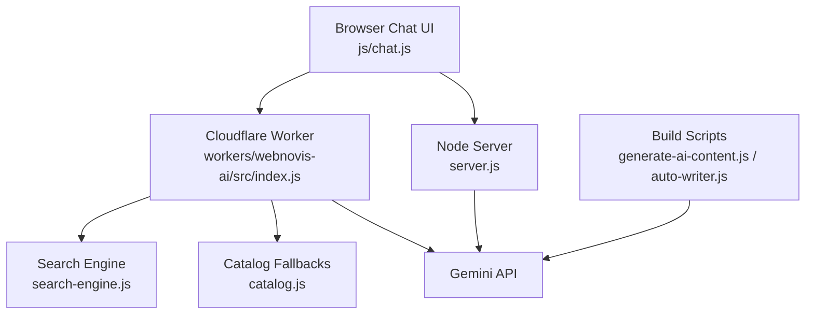
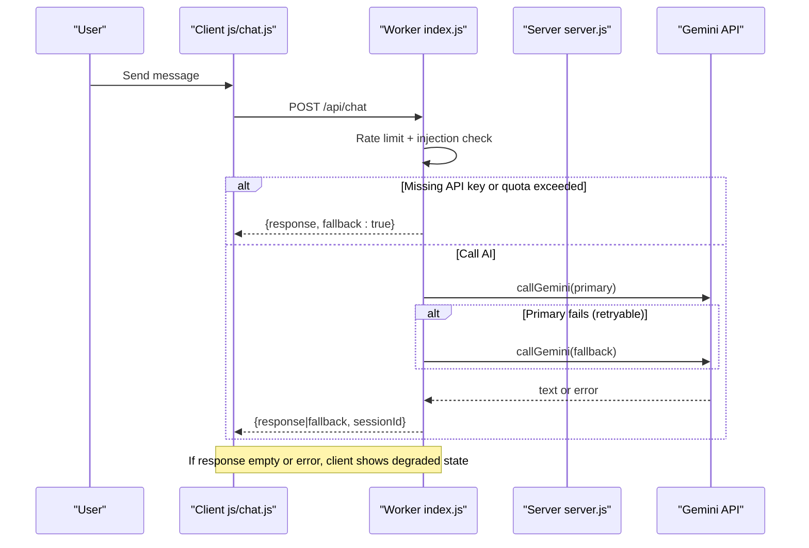
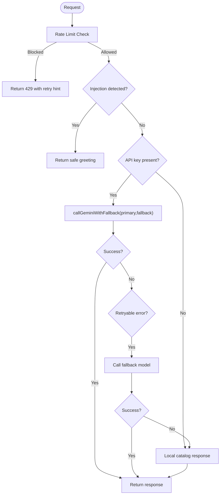
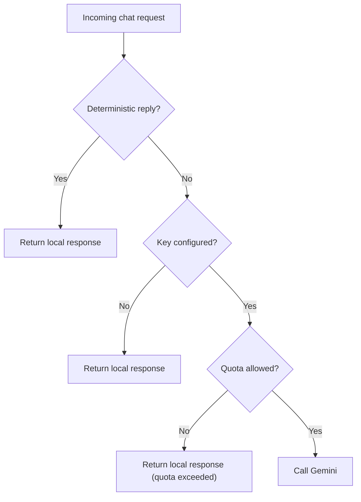
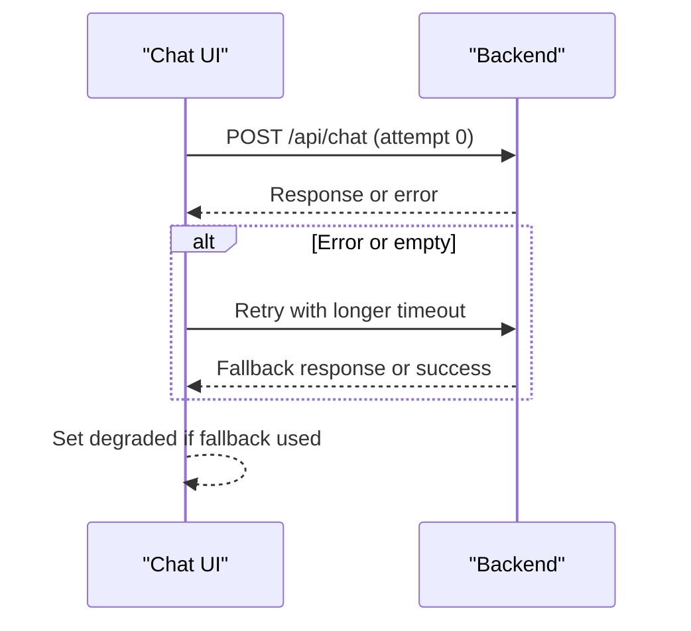
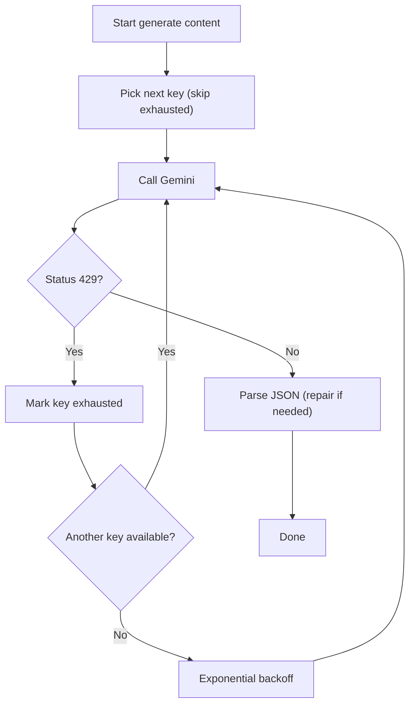
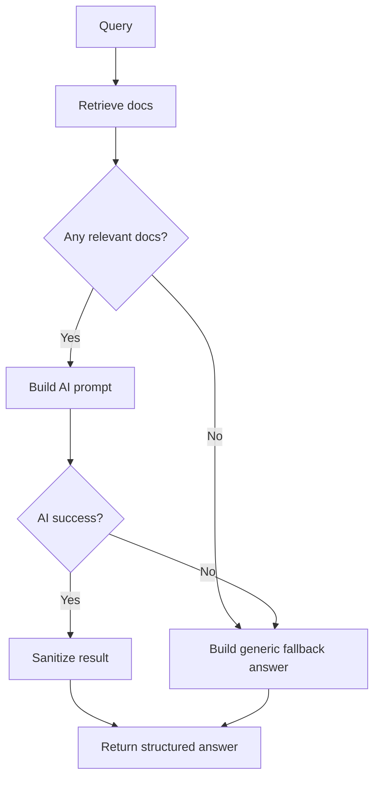
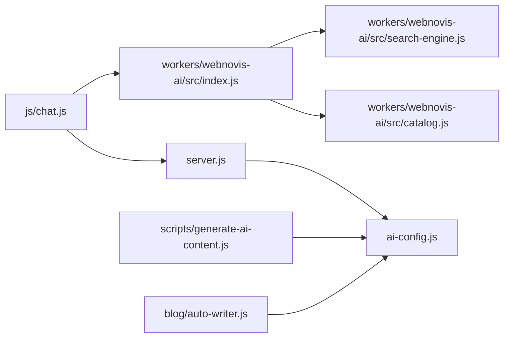

# Error Handling & Fallback Mechanisms

<cite>
**Referenced Files in This Document**
- [server.js](file://server.js)
- [workers/webnovis-ai/src/index.js](file://workers/webnovis-ai/src/index.js)
- [workers/webnovis-ai/src/search-engine.js](file://workers/webnovis-ai/src/search-engine.js)
- [workers/webnovis-ai/src/catalog.js](file://workers/webnovis-ai/src/catalog.js)
- [js/chat.js](file://js/chat.js)
- [scripts/generate-ai-content.js](file://scripts/generate-ai-content.js)
- [blog/auto-writer.js](file://blog/auto-writer.js)
- [ai-config.js](file://ai-config.js)
- [chat-config.json](file://chat-config.json)
- [tests/api-endpoints.test.js](file://tests/api-endpoints.test.js)
</cite>

## Table of Contents
1. Introduction
2. Project Structure
3. Core Components
4. Architecture Overview
5. Detailed Component Analysis
6. Dependency Analysis
7. Performance Considerations
8. Troubleshooting Guide
9. Conclusion

## Introduction
This document explains how the AI integration system detects errors, handles failures gracefully, and falls back to safe behavior when AI services are unavailable or rate-limited. It covers API timeout handling, quota management, retry strategies with exponential backoff, circuit-breaking patterns, health checks, logging, user-facing messages, monitoring, and automated recovery procedures. Concrete examples reference actual implementation points in the codebase.

## Project Structure
The AI error-handling and fallback logic spans several layers:
- Cloudflare Worker (edge): chat, search, and lead endpoints with KV-backed rate limiting, session storage, prompt injection guards, model fallbacks, and KV caching for search results.
- Node server (runtime): Express-based proxy with quota tracking, deterministic local responses, CORS/security headers, and admin endpoints.
- Browser client: Chat UI with adaptive timeouts, retries, degraded mode signaling, and session synchronization.
- Build-time scripts: Key rotation, 429-aware retries with backoff, JSON repair, and provider fallbacks.
- Configuration: Shared model names, generation parameters, and chatbot instructions that influence fallback behavior.

**Diagram sources**
- [js/chat.js:436-586](file://js/chat.js#L436-L586)
- [workers/webnovis-ai/src/index.js:141-440](file://workers/webnovis-ai/src/index.js#L141-L440)
- [workers/webnovis-ai/src/search-engine.js:188-379](file://workers/webnovis-ai/src/search-engine.js#L188-L379)
- [workers/webnovis-ai/src/catalog.js:57-134](file://workers/webnovis-ai/src/catalog.js#L57-L134)
- [server.js:180-220](file://server.js#L180-L220)
- [scripts/generate-ai-content.js:190-245](file://scripts/generate-ai-content.js#L190-L245)
- [blog/auto-writer.js:578-618](file://blog/auto-writer.js#L578-L618)

**Section sources**
- [workers/webnovis-ai/src/index.js:1-544](file://workers/webnovis-ai/src/index.js#L1-L544)
- [server.js:180-220](file://server.js#L180-L220)
- [js/chat.js:436-586](file://js/chat.js#L436-L586)
- [scripts/generate-ai-content.js:190-245](file://scripts/generate-ai-content.js#L190-L245)
- [blog/auto-writer.js:578-618](file://blog/auto-writer.js#L578-L618)

## Core Components
- Cloudflare Worker endpoints:
  - Rate limiting via KV per IP and window.
  - Prompt injection detection and safe responses.
  - Model fallback chain (primary → fallback).
  - KV cache for search answers.
  - Local catalog fallbacks for chat.
- Node server:
  - Daily quota guard per API key with warnings and hard blocks.
  - Deterministic local responses when keys missing or quota exceeded.
  - CORS, compression, security headers, and admin auth.
- Browser client:
  - Adaptive timeouts, retries, empty-response detection, degraded mode.
- Build-time scripts:
  - Key rotation, exponential backoff, JSON repair, multi-provider fallback.

**Section sources**
- [workers/webnovis-ai/src/index.js:141-440](file://workers/webnovis-ai/src/index.js#L141-L440)
- [server.js:180-220](file://server.js#L180-L220)
- [js/chat.js:436-586](file://js/chat.js#L436-L586)
- [scripts/generate-ai-content.js:190-245](file://scripts/generate-ai-content.js#L190-L245)
- [blog/auto-writer.js:578-618](file://blog/auto-writer.js#L578-L618)

## Architecture Overview
The system uses layered resilience:
- Edge layer enforces rate limits, sanitizes inputs, caches search results, and tries primary/fallback models.
- Server layer gates outbound calls by daily quotas and serves local responses when needed.
- Client layer adapts UX on degradation and retries with increasing timeouts.
- Build-time tools rotate keys and apply backoff to avoid hot-quotaing a single key.

**Diagram sources**
- [workers/webnovis-ai/src/index.js:198-367](file://workers/webnovis-ai/src/index.js#L198-L367)
- [js/chat.js:533-586](file://js/chat.js#L533-L586)
- [server.js:1151-1179](file://server.js#L1151-L1179)

## Detailed Component Analysis

### Cloudflare Worker: Chat and Search Endpoints
- Rate limiting: KV-backed sliding windows per IP; returns 429 with retry guidance.
- Injection protection: Regex filters malicious prompts; returns safe greeting.
- Session persistence: KV stores last N messages with TTL.
- Model fallback: Primary model first; if error is retryable (429/5xx/high demand), try fallback model.
- Search caching: KV cache for search answers keyed by normalized query and page.
- Local fallbacks: When no API key or retrieval fails, return curated catalog responses.

**Diagram sources**
- [workers/webnovis-ai/src/index.js:141-151](file://workers/webnovis-ai/src/index.js#L141-L151)
- [workers/webnovis-ai/src/index.js:266-367](file://workers/webnovis-ai/src/index.js#L266-L367)
- [workers/webnovis-ai/src/index.js:370-440](file://workers/webnovis-ai/src/index.js#L370-L440)
- [workers/webnovis-ai/src/catalog.js:57-134](file://workers/webnovis-ai/src/catalog.js#L57-L134)

**Section sources**
- [workers/webnovis-ai/src/index.js:141-440](file://workers/webnovis-ai/src/index.js#L141-L440)
- [workers/webnovis-ai/src/catalog.js:57-134](file://workers/webnovis-ai/src/catalog.js#L57-L134)

### Node Server: Quota Guard and Local Fallbacks
- Daily quota per key: Tracks usage in-memory per day; warns at threshold and blocks after cap.
- Smart routing: Deterministic local replies for trivial greetings/thanks; otherwise route to AI unless blocked.
- Graceful degradation: If key missing or quota exceeded, serve local responses and mark as fallback.

**Diagram sources**
- [server.js:180-220](file://server.js#L180-L220)
- [server.js:1151-1179](file://server.js#L1151-L1179)

**Section sources**
- [server.js:180-220](file://server.js#L180-L220)
- [server.js:1151-1179](file://server.js#L1151-L1179)

### Browser Client: Timeouts, Retries, Degraded Mode
- Adaptive timeout: Base timeout plus incremental increase per attempt.
- Empty response handling: Treats 200 with empty body as failure to trigger fallback UX.
- Degraded state: Updates connection state to “degraded” when fallback used or errors occur.

**Diagram sources**
- [js/chat.js:533-586](file://js/chat.js#L533-L586)

**Section sources**
- [js/chat.js:436-586](file://js/chat.js#L436-L586)

### Build-Time Scripts: Key Rotation, Backoff, JSON Repair
- Key rotation: Round-robin across dedicated keys; marks exhausted keys with cooldown.
- Exponential backoff: Waits with doubling delay when all keys are temporarily exhausted.
- JSON repair: Attempts to parse truncated or malformed LLM output before failing.
- Provider fallback: Tries one provider then another on failure.

**Diagram sources**
- [scripts/generate-ai-content.js:49-72](file://scripts/generate-ai-content.js#L49-L72)
- [scripts/generate-ai-content.js:190-245](file://scripts/generate-ai-content.js#L190-L245)
- [blog/auto-writer.js:578-618](file://blog/auto-writer.js#L578-L618)

**Section sources**
- [scripts/generate-ai-content.js:49-72](file://scripts/generate-ai-content.js#L49-L72)
- [scripts/generate-ai-content.js:190-245](file://scripts/generate-ai-content.js#L190-L245)
- [blog/auto-writer.js:578-618](file://blog/auto-writer.js#L578-L618)

### Search Engine: Fallback Responses and Sanitization
- Fallback response builder: Produces safe, contextual answers with suggested pages when AI is unavailable or context is weak.
- Result sanitization: Normalizes URLs, deduplicates suggestions, bounds relevance, and ensures only allowed pages are returned.

**Diagram sources**
- [workers/webnovis-ai/src/search-engine.js:221-310](file://workers/webnovis-ai/src/search-engine.js#L221-L310)
- [workers/webnovis-ai/src/search-engine.js:312-349](file://workers/webnovis-ai/src/search-engine.js#L312-L349)

**Section sources**
- [workers/webnovis-ai/src/search-engine.js:188-379](file://workers/webnovis-ai/src/search-engine.js#L188-L379)

## Dependency Analysis
- Client depends on backend endpoints and configuration for timeouts and endpoints.
- Worker depends on KV for rate limiting and sessions, and on search engine for grounding and fallbacks.
- Server depends on environment variables for API keys and secrets; uses in-memory quota counters.
- Build scripts depend on environment variables for API keys and use shared ai-config for model names.

**Diagram sources**
- [js/chat.js:436-586](file://js/chat.js#L436-L586)
- [workers/webnovis-ai/src/index.js:1-544](file://workers/webnovis-ai/src/index.js#L1-L544)
- [workers/webnovis-ai/src/search-engine.js:188-379](file://workers/webnovis-ai/src/search-engine.js#L188-L379)
- [workers/webnovis-ai/src/catalog.js:57-134](file://workers/webnovis-ai/src/catalog.js#L57-L134)
- [server.js:180-220](file://server.js#L180-L220)
- [ai-config.js:1-38](file://ai-config.js#L1-L38)
- [scripts/generate-ai-content.js:190-245](file://scripts/generate-ai-content.js#L190-L245)
- [blog/auto-writer.js:578-618](file://blog/auto-writer.js#L578-L618)

**Section sources**
- [ai-config.js:1-38](file://ai-config.js#L1-L38)
- [chat-config.json:1-109](file://chat-config.json#L1-L109)

## Performance Considerations
- KV-backed rate limiting reduces load spikes and protects downstream APIs.
- Search results cached in KV reduce repeated LLM calls and latency.
- Deterministic local responses for trivial intents save tokens and improve responsiveness.
- Adaptive timeouts and retries balance reliability with user experience.
- Key rotation and backoff distribute load and minimize 429 cascades.

[No sources needed since this section provides general guidance]

## Troubleshooting Guide

Common scenarios and where to look:
- API quota exhaustion:
  - Check server-side daily counters and warning logs near quota thresholds.
  - Expect 429 from worker rate limiter or local fallback responses when quota exceeded.
  - References:
    - [server.js:180-220](file://server.js#L180-L220)
    - [server.js:1151-1179](file://server.js#L1151-L1179)
    - [workers/webnovis-ai/src/index.js:141-151](file://workers/webnovis-ai/src/index.js#L141-L151)

- Model unavailability or high demand:
  - Worker attempts fallback model automatically for retryable errors.
  - Build scripts rotate keys and apply exponential backoff.
  - References:
    - [workers/webnovis-ai/src/index.js:198-247](file://workers/webnovis-ai/src/index.js#L198-L247)
    - [scripts/generate-ai-content.js:190-245](file://scripts/generate-ai-content.js#L190-L245)
    - [blog/auto-writer.js:578-618](file://blog/auto-writer.js#L578-L618)

- Network failures or timeouts:
  - Client abort controller with adaptive timeouts; retries with longer waits.
  - Worker sets fetch timeouts for LLM calls.
  - References:
    - [js/chat.js:533-586](file://js/chat.js#L533-L586)
    - [workers/webnovis-ai/src/index.js:198-236](file://workers/webnovis-ai/src/index.js#L198-L236)

- Empty or malformed LLM responses:
  - Client treats empty response as error to trigger fallback UX.
  - Build scripts include JSON repair routines.
  - References:
    - [js/chat.js:553-586](file://js/chat.js#L553-L586)
    - [scripts/generate-ai-content.js:152-188](file://scripts/generate-ai-content.js#L152-L188)

- Prompt injection attempts:
  - Both worker and server detect and neutralize injection patterns with safe responses.
  - References:
    - [workers/webnovis-ai/src/index.js:35-68](file://workers/webnovis-ai/src/index.js#L35-L68)
    - [server.js:129-178](file://server.js#L129-L178)

- Health checks and smoke tests:
  - Use /api/health to verify service status; tests validate graceful fallback when keys are absent.
  - References:
    - [workers/webnovis-ai/src/index.js:519-527](file://workers/webnovis-ai/src/index.js#L519-L527)
    - [tests/api-endpoints.test.js:42-110](file://tests/api-endpoints.test.js#L42-L110)

Logging and alerts:
- Worker logs errors and returns consistent JSON payloads.
- Server logs quota warnings and critical misconfigurations.
- Build scripts log key rotation and backoff events.
- References:
  - [workers/webnovis-ai/src/index.js:358-367](file://workers/webnovis-ai/src/index.js#L358-L367)
  - [server.js:212-218](file://server.js#L212-L218)
  - [scripts/generate-ai-content.js:219-231](file://scripts/generate-ai-content.js#L219-L231)

**Section sources**
- [server.js:180-220](file://server.js#L180-L220)
- [server.js:1151-1179](file://server.js#L1151-L1179)
- [workers/webnovis-ai/src/index.js:35-68](file://workers/webnovis-ai/src/index.js#L35-L68)
- [workers/webnovis-ai/src/index.js:141-151](file://workers/webnovis-ai/src/index.js#L141-L151)
- [workers/webnovis-ai/src/index.js:198-247](file://workers/webnovis-ai/src/index.js#L198-L247)
- [workers/webnovis-ai/src/index.js:519-527](file://workers/webnovis-ai/src/index.js#L519-L527)
- [js/chat.js:533-586](file://js/chat.js#L533-L586)
- [scripts/generate-ai-content.js:152-188](file://scripts/generate-ai-content.js#L152-L188)
- [scripts/generate-ai-content.js:219-231](file://scripts/generate-ai-content.js#L219-L231)
- [blog/auto-writer.js:578-618](file://blog/auto-writer.js#L578-L618)
- [tests/api-endpoints.test.js:42-110](file://tests/api-endpoints.test.js#L42-L110)

## Conclusion
The system implements robust, layered error handling and fallback mechanisms:
- Edge rate limiting, injection protection, and KV caching ensure resilience under load.
- Model fallback chains and KV-backed local responses keep the chat and search functional during outages or quota exhaustion.
- Client-side adaptive timeouts and degraded UX maintain a smooth experience even when services degrade.
- Build-time key rotation and exponential backoff protect against hot-quotaing and transient failures.
- Health checks and tests validate graceful degradation paths.

These patterns collectively minimize downtime, control costs, and deliver reliable user experiences when AI services are constrained or unavailable.

[No sources needed since this section summarizes without analyzing specific files]