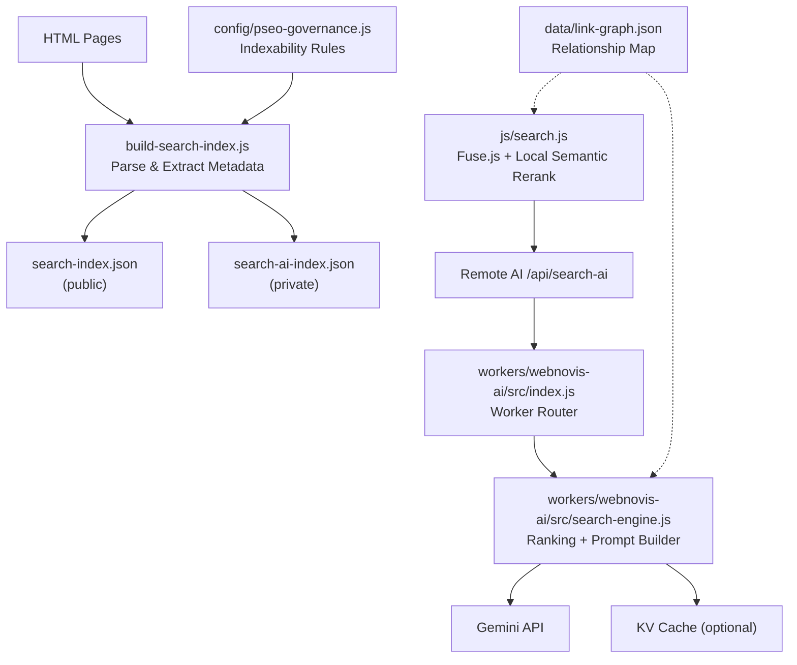
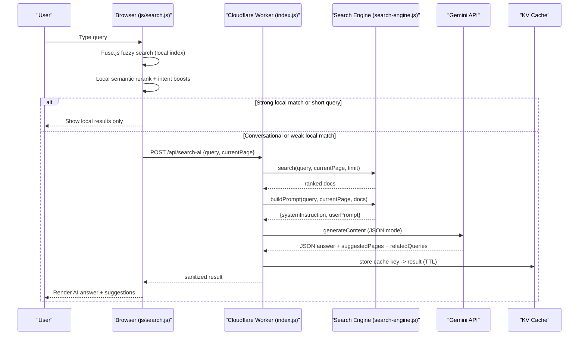
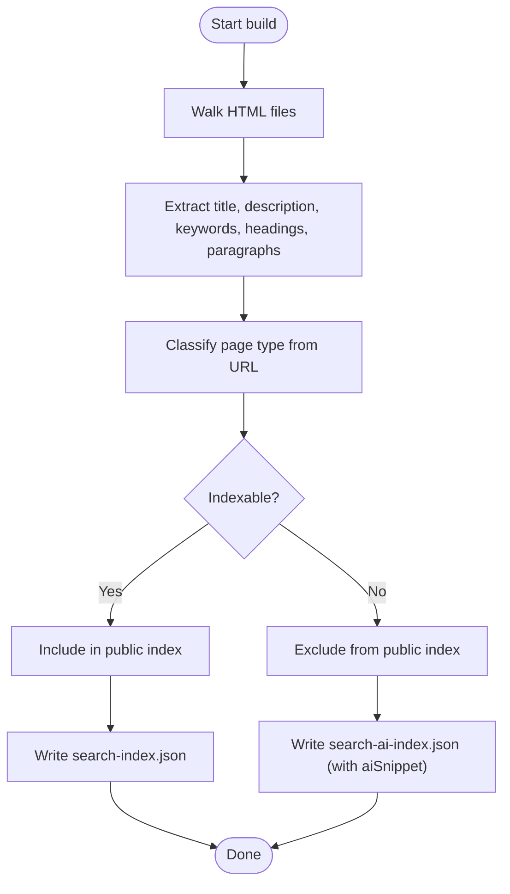
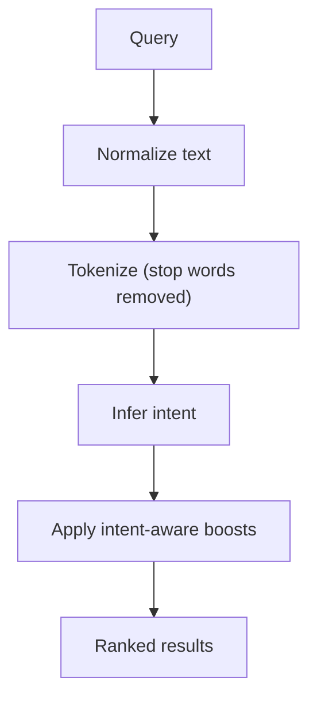
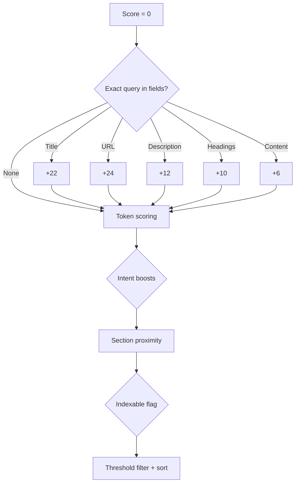
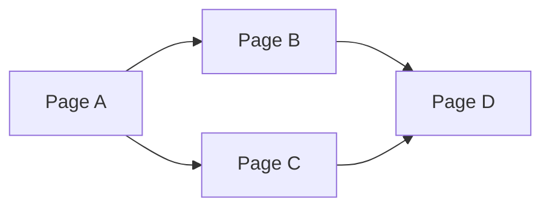
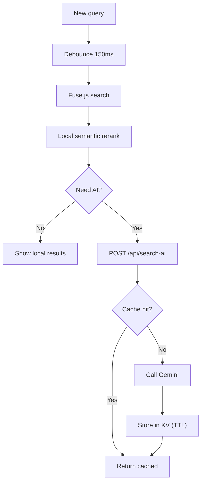
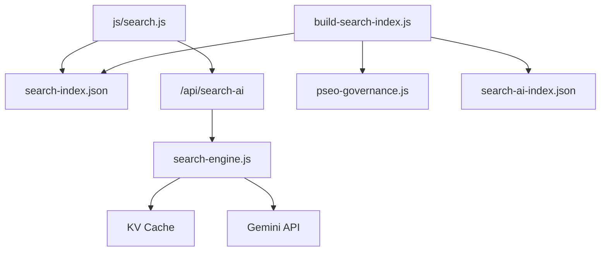

# Intelligent Search Engine

<cite>
**Referenced Files in This Document**
- [search-ai-engine.js](file://search-ai-engine.js)
- [build-search-index.js](file://build-search-index.js)
- [workers/webnovis-ai/src/search-engine.js](file://workers/webnovis-ai/src/search-engine.js)
- [workers/webnovis-ai/src/index.js](file://workers/webnovis-ai/src/index.js)
- [js/search.js](file://js/search.js)
- [config/pseo-governance.js](file://config/pseo-governance.js)
- [data/link-graph.json](file://data/link-graph.json)
</cite>

## Table of Contents
1. [Introduction](#introduction)
2. [Project Structure](#project-structure)
3. [Core Components](#core-components)
4. [Architecture Overview](#architecture-overview)
5. [Detailed Component Analysis](#detailed-component-analysis)
6. [Dependency Analysis](#dependency-analysis)
7. [Performance Considerations](#performance-considerations)
8. [Troubleshooting Guide](#troubleshooting-guide)
9. [Conclusion](#conclusion)
10. [Appendices](#appendices)

## Introduction
This document explains the intelligent search engine implemented across client, build-time, and server components. It covers semantic understanding algorithms, weighted scoring mechanisms, relevance ranking, index construction from HTML, metadata extraction, relationship mapping via link graphs, caching strategies, query optimization, performance tuning, custom query configuration, external AI integration, result presentation, faceted filtering, autocomplete behavior, and operational guidance for monitoring and debugging.

## Project Structure
The system is composed of:
- Build-time index generator that parses HTML to produce a public index and a richer private corpus for AI retrieval.
- Client-side search with Fuse.js fuzzy matching, local semantic reranking, and optional remote AI enrichment.
- Server-side Cloudflare Worker exposing an API endpoint that performs token/intent hybrid ranking and calls Gemini to synthesize answers grounded on retrieved documents.
- Governance module controlling which pages are indexable and therefore included in the search corpus.
- Link graph data used to understand relationships between pages (useful for navigation and contextual understanding).

**Diagram sources**
- [build-search-index.js:270-315](file://build-search-index.js#L270-L315)
- [js/search.js:489-512](file://js/search.js#L489-L512)
- [workers/webnovis-ai/src/index.js:370-439](file://workers/webnovis-ai/src/index.js#L370-L439)
- [workers/webnovis-ai/src/search-engine.js:72-105](file://workers/webnovis-ai/src/search-engine.js#L72-L105)
- [config/pseo-governance.js:279-287](file://config/pseo-governance.js#L279-L287)
- [data/link-graph.json:1-20](file://data/link-graph.json#L1-L20)

**Section sources**
- [build-search-index.js:1-325](file://build-search-index.js#L1-L325)
- [js/search.js:1-800](file://js/search.js#L1-L800)
- [workers/webnovis-ai/src/index.js:1-544](file://workers/webnovis-ai/src/index.js#L1-L544)
- [workers/webnovis-ai/src/search-engine.js:1-379](file://workers/webnovis-ai/src/search-engine.js#L1-L379)
- [config/pseo-governance.js:1-311](file://config/pseo-governance.js#L1-L311)
- [data/link-graph.json:1-800](file://data/link-graph.json#L1-L800)

## Core Components
- Index builder: Parses HTML, extracts title, description, headings, paragraphs, keywords, and content snippets; applies governance rules to determine indexability; outputs two indexes: a lightweight public one for Fuse.js and a richer private one for AI grounding.
- Client search: Loads the public index, runs Fuse.js fuzzy search, then applies a local semantic scorer with intent-based boosts and related query generation. Optionally triggers remote AI enrichment.
- Server search engine: Prepares a normalized corpus, scores documents using lexical matches and intent-aware boosts, builds prompts for Gemini, sanitizes results, and caches responses.
- Governance: Controls which generated geo pages are indexable based on tiered allowlists and explicit de-amplification rules.
- Link graph: Captures cross-page relationships by city/service clusters, enabling contextual boosting and navigation suggestions.

**Section sources**
- [build-search-index.js:104-196](file://build-search-index.js#L104-L196)
- [build-search-index.js:270-315](file://build-search-index.js#L270-L315)
- [config/pseo-governance.js:279-287](file://config/pseo-governance.js#L279-L287)
- [js/search.js:251-359](file://js/search.js#L251-L359)
- [workers/webnovis-ai/src/search-engine.js:72-157](file://workers/webnovis-ai/src/search-engine.js#L72-L157)
- [data/link-graph.json:1-200](file://data/link-graph.json#L1-L200)

## Architecture Overview
The search pipeline combines fast local retrieval with AI-grounded synthesis:
- Build-time: HTML → metadata extraction → index files.
- Runtime client: Fuse.js fuzzy match → local semantic reranking → optional remote AI call.
- Runtime server: Token/intent hybrid ranking → prompt assembly → Gemini JSON response → KV cache → sanitized output.

**Diagram sources**
- [js/search.js:514-553](file://js/search.js#L514-L553)
- [workers/webnovis-ai/src/index.js:370-439](file://workers/webnovis-ai/src/index.js#L370-L439)
- [workers/webnovis-ai/src/search-engine.js:188-219](file://workers/webnovis-ai/src/search-engine.js#L188-L219)
- [workers/webnovis-ai/src/search-engine.js:221-260](file://workers/webnovis-ai/src/search-engine.js#L221-L260)

## Detailed Component Analysis

### Index Construction and Metadata Extraction
- The builder walks published HTML files, strips scripts/styles/noscript/SVG/nav/footer/header, extracts title, meta description, meta keywords, headings (H1-H3), and paragraph leads.
- It infers page type from URL patterns (blog, portfolio, servizi, locale hubs, legal pages).
- It computes indexability using both meta robots noindex and pSEO governance allowlists; non-indexable pages are excluded from the public index and demoted in the private AI corpus.
- Two outputs are written:
  - Public index: excludes aiContent to keep payload small for client-side Fuse.js.
  - Private AI index: includes longer aiSnippet for richer grounding.

**Diagram sources**
- [build-search-index.js:104-196](file://build-search-index.js#L104-L196)
- [build-search-index.js:270-315](file://build-search-index.js#L270-L315)
- [config/pseo-governance.js:279-287](file://config/pseo-governance.js#L279-L287)

**Section sources**
- [build-search-index.js:104-196](file://build-search-index.js#L104-L196)
- [build-search-index.js:270-315](file://build-search-index.js#L270-L315)
- [config/pseo-governance.js:279-287](file://config/pseo-governance.js#L279-L287)

### Semantic Understanding and Intent Detection
- Both client and server normalize text (lowercase, diacritic removal, tokenization) and filter stop words.
- Intent inference detects categories such as pricing, contact, portfolio, about, informational, local, commercial, and general.
- The client uses this to tailor local reranking and decide when to trigger remote AI.
- The server uses it to adjust document scoring and prompt instructions.

**Diagram sources**
- [js/search.js:153-203](file://js/search.js#L153-L203)
- [workers/webnovis-ai/src/search-engine.js:16-65](file://workers/webnovis-ai/src/search-engine.js#L16-L65)
- [search-ai-engine.js:14-63](file://search-ai-engine.js#L14-L63)

**Section sources**
- [js/search.js:153-203](file://js/search.js#L153-L203)
- [workers/webnovis-ai/src/search-engine.js:16-65](file://workers/webnovis-ai/src/search-engine.js#L16-L65)
- [search-ai-engine.js:14-63](file://search-ai-engine.js#L14-L63)

### Weighted Scoring and Relevance Ranking
- Lexical exact-match boosts:
  - Title, URL, description, headings, content get decreasing weights for full-query inclusion.
- Token-level boosts:
  - Title tokens > URL tokens > keyword tokens > heading tokens > description tokens > content presence.
- Intent-aware boosts:
  - Commercial/pricing queries favor service pages and canonical paths; generic commercial queries demote GEO clones without local intent.
  - Contact intent boosts the contact page; portfolio/about/informational/local intents boost corresponding types or URLs.
- Section proximity bonus:
  - If the current page shares the first segment with a candidate, a small boost is applied.
- Minimum score threshold filters noise; top-score normalization yields a bounded relevance score.

**Diagram sources**
- [workers/webnovis-ai/src/search-engine.js:107-157](file://workers/webnovis-ai/src/search-engine.js#L107-L157)
- [js/search.js:285-319](file://js/search.js#L285-L319)
- [search-ai-engine.js:151-199](file://search-ai-engine.js#L151-L199)

**Section sources**
- [workers/webnovis-ai/src/search-engine.js:107-157](file://workers/webnovis-ai/src/search-engine.js#L107-L157)
- [js/search.js:285-319](file://js/search.js#L285-L319)
- [search-ai-engine.js:151-199](file://search-ai-engine.js#L151-L199)

### Relationship Mapping Through Link Graphs
- The link graph captures inter-page links within city/service clusters, enabling:
  - Cross-linking awareness during indexing and potential future ranking signals.
  - Contextual suggestions and related queries derived from neighboring pages.
- While not directly used in the current scoring functions, the structure supports enhanced navigation and can be integrated into future relevance models.

**Diagram sources**
- [data/link-graph.json:1-200](file://data/link-graph.json#L1-L200)

**Section sources**
- [data/link-graph.json:1-200](file://data/link-graph.json#L1-L200)

### Caching Strategies and Query Optimization
- Client-side:
  - Debounced input (150 ms) reduces redundant searches.
  - Fuse.js configured with thresholds and weights for fast fuzzy matching.
  - Local semantic reranking avoids unnecessary remote calls for strong matches.
- Server-side:
  - KV-backed cache keyed by normalized query and current page; TTL set to reduce repeated AI calls.
  - Rate limiting protects endpoints and prevents abuse.
  - AbortController cancels stale AI requests when new queries arrive.

**Diagram sources**
- [js/search.js:83-90](file://js/search.js#L83-L90)
- [js/search.js:489-512](file://js/search.js#L489-L512)
- [js/search.js:530-553](file://js/search.js#L530-L553)
- [workers/webnovis-ai/src/index.js:397-439](file://workers/webnovis-ai/src/index.js#L397-L439)

**Section sources**
- [js/search.js:83-90](file://js/search.js#L83-L90)
- [js/search.js:489-512](file://js/search.js#L489-L512)
- [js/search.js:530-553](file://js/search.js#L530-L553)
- [workers/webnovis-ai/src/index.js:397-439](file://workers/webnovis-ai/src/index.js#L397-L439)

### Custom Search Queries, Relevance Weights, and External AI Integration
- Customizing local weights:
  - Adjust Fuse.js field weights in the client initialization to emphasize titles, descriptions, or keywords.
  - Tune semantic scoring thresholds and intent boosts in the local reranker to prioritize certain page types or URLs.
- Configuring server-side relevance:
  - Modify intent detection patterns and per-field/token boosts in the server search engine to reflect business priorities.
- Integrating external AI services:
  - The worker calls Gemini with JSON mode to enforce structured answers; configure primary/fallback models and temperature for creativity vs. determinism.
  - Use KV cache keys to control TTL and deduplicate frequent queries.

**Section sources**
- [js/search.js:489-512](file://js/search.js#L489-L512)
- [js/search.js:285-359](file://js/search.js#L285-L359)
- [workers/webnovis-ai/src/search-engine.js:107-157](file://workers/webnovis-ai/src/search-engine.js#L107-L157)
- [workers/webnovis-ai/src/index.js:198-247](file://workers/webnovis-ai/src/index.js#L198-L247)

### Search Result Presentation, Faceted Filtering, and Autocomplete
- Presentation layer:
  - Renders local results with icons and labels per page type; highlights matched terms.
  - Appends an AI section with synthesized answer, suggested pages with relevance percentages, and related query tags.
  - Provides keyboard navigation and screen reader announcements for accessibility.
- Faceted filtering:
  - Results include a type field; UI can group/filter by type (page, servizio, articolo, portfolio, locale, hub, legale).
- Autocomplete:
  - Fuse.js provides fuzzy matching; the client debounces input and shows incremental results. Related queries act as quick refinements.

**Section sources**
- [js/search.js:622-691](file://js/search.js#L622-L691)
- [js/search.js:699-748](file://js/search.js#L699-L748)
- [js/search.js:446-461](file://js/search.js#L446-L461)

## Dependency Analysis
- Client depends on:
  - Public index file for Fuse.js.
  - Optional remote AI endpoint for enriched answers.
- Worker depends on:
  - Private index for richer context.
  - KV storage for caching and rate limiting.
  - Gemini API for answer synthesis.
- Build process depends on:
  - Published HTML files.
  - Governance module to determine indexability.

**Diagram sources**
- [js/search.js:475-512](file://js/search.js#L475-L512)
- [workers/webnovis-ai/src/index.js:370-439](file://workers/webnovis-ai/src/index.js#L370-L439)
- [workers/webnovis-ai/src/search-engine.js:188-219](file://workers/webnovis-ai/src/search-engine.js#L188-L219)
- [build-search-index.js:270-315](file://build-search-index.js#L270-L315)
- [config/pseo-governance.js:279-287](file://config/pseo-governance.js#L279-L287)

**Section sources**
- [js/search.js:475-512](file://js/search.js#L475-L512)
- [workers/webnovis-ai/src/index.js:370-439](file://workers/webnovis-ai/src/index.js#L370-L439)
- [workers/webnovis-ai/src/search-engine.js:188-219](file://workers/webnovis-ai/src/search-engine.js#L188-L219)
- [build-search-index.js:270-315](file://build-search-index.js#L270-L315)
- [config/pseo-governance.js:279-287](file://config/pseo-governance.js#L279-L287)

## Performance Considerations
- Client:
  - Fuse.js threshold and distance tuned for speed vs. recall balance.
  - Debounce minimizes re-renders and network calls.
  - Local semantic reranking reduces reliance on remote AI for strong matches.
- Server:
  - KV cache reduces repeated Gemini calls; TTL balances freshness and cost.
  - Rate limiting protects endpoints under load.
  - AbortController prevents wasted work on rapid typing.
- Index size:
  - Public index excludes aiContent to minimize payload.
  - Private index includes longer snippets for better grounding but remains server-only.

[No sources needed since this section provides general guidance]

## Troubleshooting Guide
- No results or weak results:
  - Verify indexability: ensure pages are not marked noindex and pass pSEO allowlist checks.
  - Check intent detection: confirm query maps to expected intent; adjust patterns if necessary.
  - Review minimum score threshold: too high may filter valid results.
- Excessive AI calls:
  - Increase local thresholds to prefer local results for shorter or strongly matched queries.
  - Confirm KV cache is enabled and TTL appropriate.
- Slow responses:
  - Reduce Fuse.js threshold/distance for faster matching.
  - Ensure AI fallback path is robust; monitor worker logs for errors.
- Incorrect suggested pages:
  - Validate allowed URL map and sanitization; ensure URLs exist in corpus.
  - Check related query generation logic to avoid duplicates or irrelevant suggestions.

**Section sources**
- [config/pseo-governance.js:279-287](file://config/pseo-governance.js#L279-L287)
- [workers/webnovis-ai/src/search-engine.js:188-219](file://workers/webnovis-ai/src/search-engine.js#L188-L219)
- [workers/webnovis-ai/src/index.js:397-439](file://workers/webnovis-ai/src/index.js#L397-L439)
- [js/search.js:560-580](file://js/search.js#L560-L580)

## Conclusion
The intelligent search engine blends fast local retrieval with AI-grounded synthesis to deliver relevant, actionable results. Its design emphasizes:
- Robust metadata extraction and governance-controlled indexing.
- Transparent, tunable scoring with intent-aware boosts.
- Efficient caching and rate limiting for scalability.
- Rich presentation with accessibility and UX best practices.
By adjusting weights, thresholds, and AI prompts, teams can tailor relevance to business goals while maintaining performance and reliability.

[No sources needed since this section summarizes without analyzing specific files]

## Appendices

### Example: Implementing a Custom Search Query Flow
- Define intent patterns and adjust local reranking to prioritize specific page types or URLs.
- Configure Fuse.js weights to emphasize fields most important for your domain.
- On the server, refine scoring functions and prompt instructions to align with brand voice and conversion goals.

**Section sources**
- [js/search.js:285-359](file://js/search.js#L285-L359)
- [js/search.js:489-512](file://js/search.js#L489-L512)
- [workers/webnovis-ai/src/search-engine.js:107-157](file://workers/webnovis-ai/src/search-engine.js#L107-L157)
- [workers/webnovis-ai/src/index.js:198-247](file://workers/webnovis-ai/src/index.js#L198-L247)

### Example: Configuring Relevance Weights
- Client:
  - Tune Fuse.js keys and weights to emphasize titles and descriptions.
  - Adjust semantic scoring thresholds and intent boosts to favor service pages or local pages as needed.
- Server:
  - Modify per-field and per-token boosts to reflect content importance.
  - Update intent detection patterns to capture emerging query styles.

**Section sources**
- [js/search.js:489-512](file://js/search.js#L489-L512)
- [js/search.js:285-359](file://js/search.js#L285-L359)
- [workers/webnovis-ai/src/search-engine.js:107-157](file://workers/webnovis-ai/src/search-engine.js#L107-L157)

### Example: Integrating with External AI Services
- Configure model selection and fallbacks in the worker.
- Set JSON mode and temperature to balance creativity and precision.
- Use KV cache keys to deduplicate frequent queries and reduce latency.

**Section sources**
- [workers/webnovis-ai/src/index.js:198-247](file://workers/webnovis-ai/src/index.js#L198-L247)
- [workers/webnovis-ai/src/index.js:397-439](file://workers/webnovis-ai/src/index.js#L397-L439)