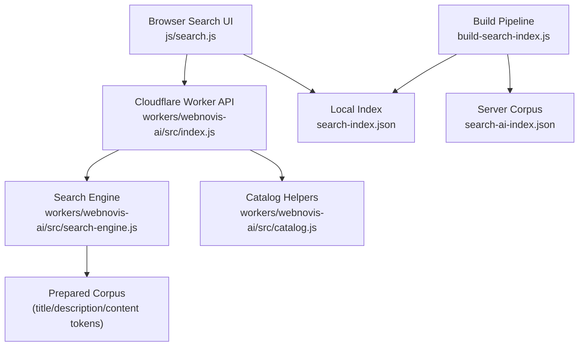
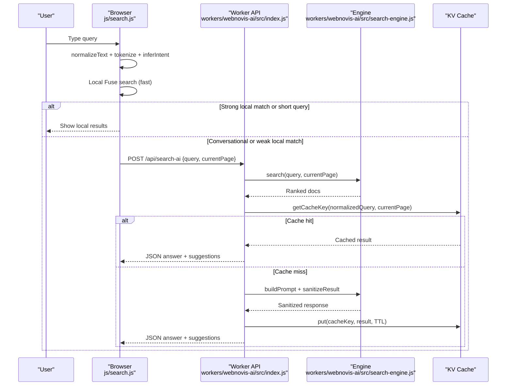
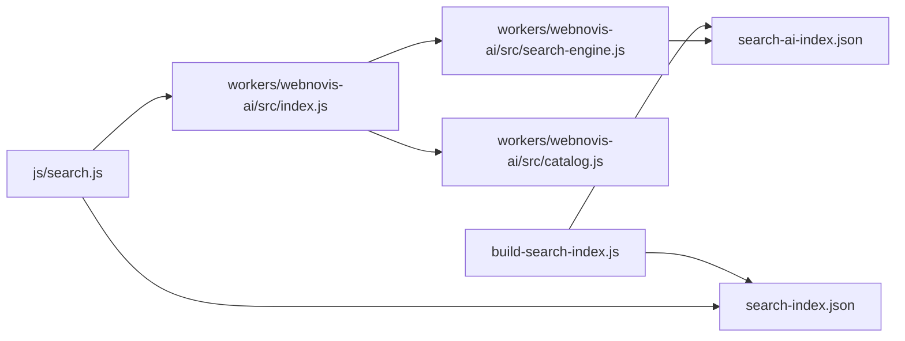

# Query Processing & Intent Recognition

<cite>
**Referenced Files in This Document**
- [search-engine.js](file://workers/webnovis-ai/src/search-engine.js)
- [index.js](file://workers/webnovis-ai/src/index.js)
- [catalog.js](file://workers/webnovis-ai/src/catalog.js)
- [search.js](file://js/search.js)
- [search-ai-engine.js](file://search-ai-engine.js)
- [build-search-index.js](file://build-search-index.js)
</cite>

## Table of Contents
1. [Introduction](#introduction)
2. [Project Structure](#project-structure)
3. [Core Components](#core-components)
4. [Architecture Overview](#architecture-overview)
5. [Detailed Component Analysis](#detailed-component-analysis)
6. [Dependency Analysis](#dependency-analysis)
7. [Performance Considerations](#performance-considerations)
8. [Troubleshooting Guide](#troubleshooting-guide)
9. [Conclusion](#conclusion)
10. [Appendices](#appendices)

## Introduction
This document explains the query processing pipeline and intent recognition system used across the site’s client-side search and server-side AI search. It covers text normalization (whitespace handling, lowercase conversion, accent removal, special character replacement), tokenization with Italian stop words, multi-word phrase handling, and intent inference for categories such as pricing, contact, portfolio, about, informational, local, and commercial. It also documents the query caching mechanism and performance strategies for high-volume scenarios.

## Project Structure
The system is implemented in two complementary layers:
- Client-side search and lightweight ranking in the browser using a prebuilt index and Fuse.js.
- Server-side search engine and AI orchestration running in Cloudflare Workers, which builds prompts, ranks content, and caches results.

**Diagram sources**
- [search.js:153-203](file://js/search.js#L153-L203)
- [index.js:370-439](file://workers/webnovis-ai/src/index.js#L370-L439)
- [search-engine.js:20-65](file://workers/webnovis-ai/src/search-engine.js#L20-L65)
- [build-search-index.js:72-82](file://build-search-index.js#L72-L82)

**Section sources**
- [search.js:153-203](file://js/search.js#L153-L203)
- [index.js:370-439](file://workers/webnovis-ai/src/index.js#L370-L439)
- [search-engine.js:20-65](file://workers/webnovis-ai/src/search-engine.js#L20-L65)
- [build-search-index.js:72-82](file://build-search-index.js#L72-L82)

## Core Components
- Text normalization: whitespace collapsing, lowercasing, NFD normalization with diacritic removal, special character filtering, and multi-word phrase normalization (e.g., e-commerce to ecommerce).
- Tokenization: split into tokens, remove short tokens, filter Italian stop words, deduplicate.
- Intent inference: regex-based classification into pricing, contact, portfolio, about, informational, local, commercial, or general.
- Ranking: weighted scoring over title, URL, description, headings, keywords, and content; intent-aware boosts and demotions.
- Caching: KV-backed cache keyed by normalized query and current page.

**Section sources**
- [search-engine.js:16-38](file://workers/webnovis-ai/src/search-engine.js#L16-L38)
- [search-engine.js:56-65](file://workers/webnovis-ai/src/search-engine.js#L56-L65)
- [search-engine.js:107-157](file://workers/webnovis-ai/src/search-engine.js#L107-L157)
- [index.js:397-435](file://workers/webnovis-ai/src/index.js#L397-L435)

## Architecture Overview
The end-to-end flow starts in the browser with user input, performs fast local search, optionally enriches with server-side AI, and returns synthesized answers with suggested pages and related queries.

**Diagram sources**
- [search.js:194-203](file://js/search.js#L194-L203)
- [index.js:370-439](file://workers/webnovis-ai/src/index.js#L370-L439)
- [search-engine.js:196-219](file://workers/webnovis-ai/src/search-engine.js#L196-L219)
- [search-engine.js:365-367](file://workers/webnovis-ai/src/search-engine.js#L365-L367)

## Detailed Component Analysis

### Text Normalization
Normalization ensures consistent matching across languages and formats:
- Whitespace normalization collapses multiple spaces and trims.
- Lowercase conversion standardizes casing.
- Multi-word phrase normalization maps “e-commerce” variants to “ecommerce”.
- Accent removal uses Unicode NFD decomposition and strips combining marks.
- Special character replacement removes punctuation and symbols except spaces.

These steps are applied consistently in both client and server code paths.

**Section sources**
- [search-engine.js:16-30](file://workers/webnovis-ai/src/search-engine.js#L16-L30)
- [search.js:153-163](file://js/search.js#L153-L163)
- [build-search-index.js:72-82](file://build-search-index.js#L72-L82)

### Tokenization and Stop Words
Tokenization splits normalized text into tokens, filters out short tokens, and removes Italian stop words. The stop word set includes common Italian function words and brand terms to reduce noise. Tokens are deduplicated to avoid repeated scoring signals.

Language-specific considerations:
- The stop word list targets Italian grammar patterns.
- Short token length threshold avoids overly generic fragments.
- Deduplication prevents bias from repeated tokens.

**Section sources**
- [search-engine.js:6-12](file://workers/webnovis-ai/src/search-engine.js#L6-L12)
- [search-engine.js:32-38](file://workers/webnovis-ai/src/search-engine.js#L32-L38)
- [search.js:30-37](file://js/search.js#L30-L37)
- [search.js:165-174](file://js/search.js#L165-L174)
- [build-search-index.js:36-42](file://build-search-index.js#L36-L42)

### Intent Inference
Intent inference classifies queries into categories using regex patterns on normalized text:
- Pricing: price-related terms like “prezz”, “cost”, “preventiv”, “budget”, “quotazion”, “quanto costa”, “tariff”.
- Contact: communication channels like “contatt”, “email”, “telefono”, “whatsapp”, “parlare”, “chiamare”.
- Portfolio: project examples like “portfolio”, “progett”, “case study”, “lavori”, “esempi”.
- About: company info like “chi siamo”, “agenzia”, “team”, “azienda”, “storia”.
- Informational: learning-oriented like “blog”, “guida”, “articolo”, “come fare”, “cos e”, “cose”, “differenza”.
- Local: geographic terms like “rho”, “milano”, “monza”, “bollate”, “arese”, “bresso”, “buccinasco”, “legnano”, “comune”, “zona”, “vicino”.
- Commercial: service-oriented like “sito”, “landing”, “ecommerce”, “e commerce”, “logo”, “brand”, “social”, “seo”, “accessibil”.
- General: fallback when no pattern matches.

Customization guidance:
- To add a new category, insert a new regex check before the final return in the intent function.
- To refine existing categories, adjust the regex patterns to include or exclude specific terms.
- Edge cases: ensure patterns do not overlap unintentionally; order matters since the first match wins.

**Section sources**
- [search-engine.js:56-65](file://workers/webnovis-ai/src/search-engine.js#L56-L65)
- [search.js:194-203](file://js/search.js#L194-L203)
- [search-ai-engine.js:54-63](file://search-ai-engine.js#L54-L63)
- [catalog.js:52-55](file://workers/webnovis-ai/src/catalog.js#L52-L55)

### Ranking and Scoring
Scoring combines lexical matches and intent-aware adjustments:
- Lexical matches:
  - Exact substring matches in title, URL, description, headings, and content receive higher weights.
  - Token presence in title, URL, keywords, headings, description, and content receives incremental points.
- Intent-aware boosts:
  - Service pages and specific URLs (e.g., /servizi/*, /preventivo.html, /contatti.html) are boosted for commercial/pricing/contact intents.
  - Local pages are boosted for local intent and demoted for non-local commercial queries without city context.
  - Articles are boosted for informational intent and sometimes for pricing guides.
- Thresholding:
  - Minimum score thresholds filter out weak matches to avoid noisy results.

Edge cases:
- No lexical signal yields zero score to prevent false positives via type boosts alone.
- Non-indexable documents are downweighted.

**Section sources**
- [search-engine.js:107-157](file://workers/webnovis-ai/src/search-engine.js#L107-L157)
- [search-ai-engine.js:151-199](file://search-ai-engine.js#L151-L199)
- [search.js:285-319](file://js/search.js#L285-L319)

### Prompt Building and Response Sanitization
The server constructs a prompt with structured context (titles, URLs, types, descriptions, snippets) and instructs the model to respond only with valid JSON containing an answer, suggested pages, and related queries. Responses are sanitized to:
- Limit answer length safely.
- Validate and deduplicate suggested page URLs against allowed corpus.
- Normalize relevance scores to a bounded range.
- Provide fallback responses when no relevant content is found.

**Section sources**
- [search-engine.js:221-260](file://workers/webnovis-ai/src/search-engine.js#L221-L260)
- [search-engine.js:312-349](file://workers/webnovis-ai/src/search-engine.js#L312-L349)
- [index.js:397-439](file://workers/webnovis-ai/src/index.js#L397-L439)

### Query Caching Mechanism
Caching reduces redundant AI calls and speeds up repeated queries:
- Cache key: combination of normalized query and current page path.
- Storage: KV store with TTL expiration.
- Behavior: On cache hit, return stored result immediately; on miss, compute, store, and return.

High-volume optimization:
- Rate limiting protects endpoints under heavy load.
- Fallback logic ensures graceful degradation if AI fails or returns invalid output.
- Local-first strategy minimizes network calls when local results are strong.

**Section sources**
- [index.js:397-435](file://workers/webnovis-ai/src/index.js#L397-L435)
- [search-engine.js:365-367](file://workers/webnovis-ai/src/search-engine.js#L365-L367)
- [index.js:141-151](file://workers/webnovis-ai/src/index.js#L141-L151)

### Client-Side Enhancements
The browser implementation mirrors server normalization and tokenization, enabling consistent behavior locally:
- Uses Fuse.js for fuzzy search with weighted fields.
- Applies semantic reranking based on normalized fields and intent.
- Builds related queries from top results.
- Renders AI-generated answers with inline links and lists.

**Section sources**
- [search.js:153-174](file://js/search.js#L153-L174)
- [search.js:285-319](file://js/search.js#L285-L319)
- [search.js:321-360](file://js/search.js#L321-L360)
- [search.js:398-440](file://js/search.js#L398-L440)

## Dependency Analysis
The components interact through clear boundaries:
- Browser search depends on local index and optional worker API.
- Worker API depends on the search engine and catalog helpers.
- Search engine depends on prepared corpus and shared normalization/tokenization utilities.
- Build pipeline produces both public and private indexes consumed by client and server respectively.

**Diagram sources**
- [search.js:153-203](file://js/search.js#L153-L203)
- [index.js:370-439](file://workers/webnovis-ai/src/index.js#L370-L439)
- [search-engine.js:196-219](file://workers/webnovis-ai/src/search-engine.js#L196-L219)
- [build-search-index.js:292-307](file://build-search-index.js#L292-L307)

**Section sources**
- [search.js:153-203](file://js/search.js#L153-L203)
- [index.js:370-439](file://workers/webnovis-ai/src/index.js#L370-L439)
- [search-engine.js:196-219](file://workers/webnovis-ai/src/search-engine.js#L196-L219)
- [build-search-index.js:292-307](file://build-search-index.js#L292-L307)

## Performance Considerations
- Local-first search: Fast Fuse.js search runs in-browser with minimal latency.
- Debounced input: Reduces unnecessary computations during typing.
- Conditional AI enrichment: Only triggers for conversational or weak local matches.
- KV caching: Repeated queries served instantly with TTL expiration.
- Rate limiting: Protects endpoints from abuse and overload.
- Minimal payload: Safe truncation and sanitization keep responses small and safe.
- Index construction: Precomputes normalized fields and tokens to minimize runtime work.

[No sources needed since this section provides general guidance]

## Troubleshooting Guide
Common issues and resolutions:
- No results returned:
  - Check minimum score thresholds and ensure lexical signals exist.
  - Verify that documents are marked indexable.
- Incorrect intent classification:
  - Review regex patterns in intent functions; adjust order and specificity.
  - Add missing terms to patterns for edge cases.
- Slow AI responses:
  - Ensure KV cache is enabled and TTL configured.
  - Confirm rate limits are not too restrictive.
- Invalid AI output:
  - Use sanitizeResult to enforce structure and bounds.
  - Fall back to predefined responses when parsing fails.

**Section sources**
- [search-engine.js:107-157](file://workers/webnovis-ai/src/search-engine.js#L107-L157)
- [search-engine.js:312-349](file://workers/webnovis-ai/src/search-engine.js#L312-L349)
- [index.js:397-439](file://workers/webnovis-ai/src/index.js#L397-L435)

## Conclusion
The query processing pipeline combines robust normalization, language-aware tokenization, and intent-driven ranking to deliver accurate and relevant results. The dual-layer architecture (client-side speed plus server-side intelligence) balances performance and quality. Caching and rate limiting ensure scalability under high volume. Customizing intent patterns and adding categories is straightforward through targeted regex updates.

[No sources needed since this section summarizes without analyzing specific files]

## Appendices

### Customizing Intent Patterns
- Locate the intent function in the server and client code.
- Insert new regex checks before the final return statement.
- Order patterns carefully to prioritize more specific intents.
- Test with representative queries to validate behavior.

**Section sources**
- [search-engine.js:56-65](file://workers/webnovis-ai/src/search-engine.js#L56-L65)
- [search.js:194-203](file://js/search.js#L194-L203)
- [search-ai-engine.js:54-63](file://search-ai-engine.js#L54-L63)

### Handling Edge Cases in Query Processing
- Empty or very short queries: Enforce minimum length thresholds before processing.
- Malformed inputs: Sanitize and truncate to safe lengths.
- Overlapping intents: Refine regex boundaries and ordering.
- Non-indexed content: Respect indexable flags and apply downweighting.

**Section sources**
- [index.js:370-385](file://workers/webnovis-ai/src/index.js#L370-L385)
- [search-engine.js:107-157](file://workers/webnovis-ai/src/search-engine.js#L107-L157)
- [search.js:153-174](file://js/search.js#L153-L174)