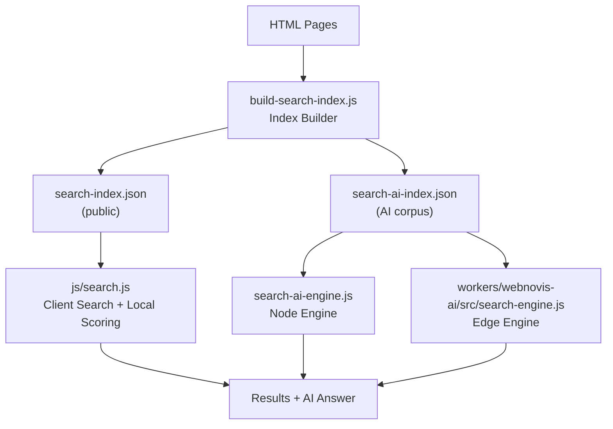
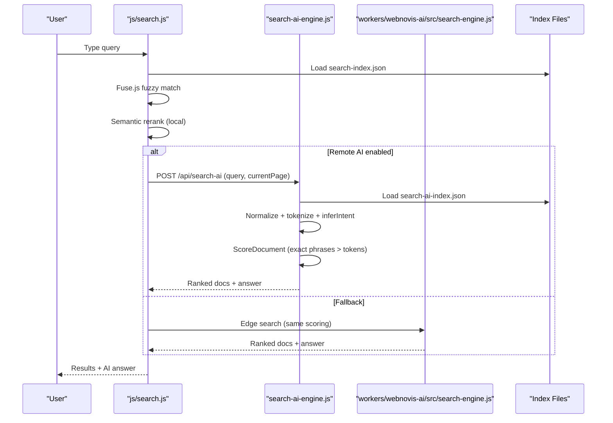
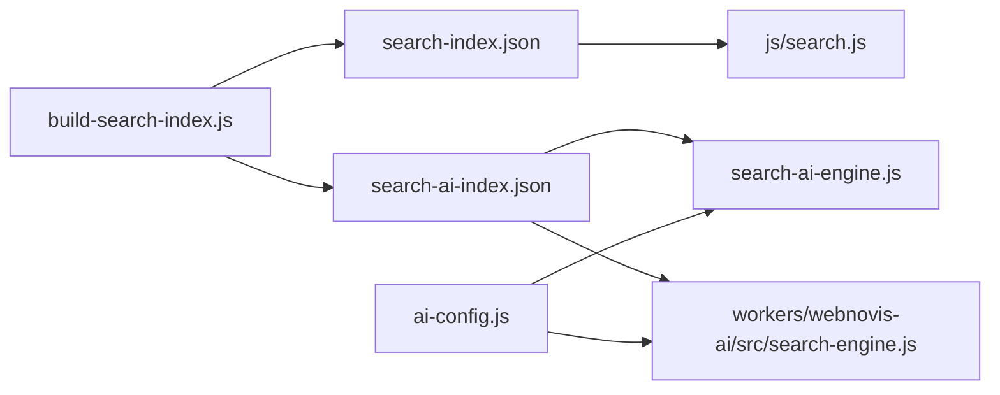

# Relevance Scoring & Ranking Algorithms

<cite>
**Referenced Files in This Document**
- [search-ai-engine.js](file://search-ai-engine.js)
- [workers/webnovis-ai/src/search-engine.js](file://workers/webnovis-ai/src/search-engine.js)
- [build-search-index.js](file://build-search-index.js)
- [js/search.js](file://js/search.js)
- [ai-config.js](file://ai-config.js)
</cite>

## Table of Contents
1. Introduction
2. Project Structure
3. Core Components
4. Architecture Overview
5. Detailed Component Analysis
6. Dependency Analysis
7. Performance Considerations
8. Troubleshooting Guide
9. Conclusion

## Introduction
This document explains the relevance scoring and ranking algorithms used across the site’s search system. It covers:
- The weighted scoring model that prioritizes exact phrase matches over individual token matches
- Field-level weights (URL, Title, Description, Headings, Content)
- Intent-based boosting for commercial, contact, portfolio, about, informational, and local queries
- Semantic understanding via query normalization, tokenization, and contextual factors
- The minimum score threshold that filters out low-quality results
- Practical guidance for tuning weights, implementing custom rules, and debugging relevance issues

## Project Structure
The search pipeline spans build-time indexing and runtime scoring across client, server, and edge environments:
- Build-time index creation extracts metadata, headings, snippets, and types from HTML to produce a public index and a richer AI corpus
- Runtime engines compute scores using normalized text, tokens, and intent signals, then filter by a minimum threshold and sort by descending score
- Client-side logic provides fast Fuse.js-based fuzzy matching and optional AI enrichment with fallbacks

**Diagram sources**
- [build-search-index.js:292-324](file://build-search-index.js#L292-L324)
- [js/search.js:489-511](file://js/search.js#L489-L511)
- [search-ai-engine.js:201-230](file://search-ai-engine.js#L201-L230)
- [workers/webnovis-ai/src/search-engine.js:188-219](file://workers/webnovis-ai/src/search-engine.js#L188-L219)

**Section sources**
- [build-search-index.js:292-324](file://build-search-index.js#L292-L324)
- [js/search.js:489-511](file://js/search.js#L489-L511)
- [search-ai-engine.js:201-230](file://search-ai-engine.js#L201-L230)
- [workers/webnovis-ai/src/search-engine.js:188-219](file://workers/webnovis-ai/src/search-engine.js#L188-L219)

## Core Components
- Index builder: parses HTML to extract title, description, headings, content snippets, keywords, and page type; writes public and AI indexes
- Node engine: loads AI corpus, normalizes queries and documents, computes scores, applies intent boosts, filters by threshold, sorts, and returns ranked results
- Edge engine: identical scoring logic adapted for Cloudflare Workers with additional commercial boosts
- Client engine: Fuse.js fuzzy search plus semantic reranking and optional remote AI enrichment

Key responsibilities:
- Normalization and tokenization ensure consistent matching across languages and formats
- Exact phrase matches receive higher base points than token matches
- Intent detection steers ranking toward service pages, contact pages, or local pages as appropriate
- Minimum score threshold prevents irrelevant results from appearing

**Section sources**
- [build-search-index.js:152-290](file://build-search-index.js#L152-L290)
- [search-ai-engine.js:14-36](file://search-ai-engine.js#L14-L36)
- [search-ai-engine.js:54-68](file://search-ai-engine.js#L54-L68)
- [search-ai-engine.js:151-199](file://search-ai-engine.js#L151-L199)
- [workers/webnovis-ai/src/search-engine.js:16-65](file://workers/webnovis-ai/src/search-engine.js#L16-L65)
- [workers/webnovis-ai/src/search-engine.js:107-157](file://workers/webnovis-ai/src/search-engine.js#L107-L157)
- [js/search.js:153-174](file://js/search.js#L153-L174)
- [js/search.js:194-203](file://js/search.js#L194-L203)
- [js/search.js:285-319](file://js/search.js#L285-L319)

## Architecture Overview
The system uses a hybrid approach:
- Lexical scoring on normalized fields and tokens
- Intent-based boosting to align results with user goals
- Threshold filtering to maintain quality
- Optional AI synthesis grounded on retrieved documents

**Diagram sources**
- [js/search.js:515-553](file://js/search.js#L515-L553)
- [search-ai-engine.js:201-230](file://search-ai-engine.js#L201-L230)
- [workers/webnovis-ai/src/search-engine.js:188-219](file://workers/webnovis-ai/src/search-engine.js#L188-L219)

## Detailed Component Analysis

### Weighted Scoring System
- Exact phrase matches are scored first and heavily rewarded:
  - URL contains query: 24 points
  - Title contains query: 22 points
  - Description contains query: 12 points
  - Headings contain query: 10 points
  - Content contains query: 6 points
- Token matches add smaller incremental points per field:
  - Title token: 7
  - URL token: 6
  - Keyword token: 5
  - Heading token: 4
  - Description token: 3
  - Content token: 1
- No lexical signal means no relevance is invented via boosts alone; if score stays at zero after lexical checks, the document is not considered relevant.

These rules appear consistently in both Node and Worker engines and in the client’s semantic scorer.

**Section sources**
- [search-ai-engine.js:151-169](file://search-ai-engine.js#L151-L169)
- [workers/webnovis-ai/src/search-engine.js:107-124](file://workers/webnovis-ai/src/search-engine.js#L107-L124)
- [js/search.js:285-304](file://js/search.js#L285-L304)

### Intent-Based Boosting
Intent is inferred from query patterns and influences ranking:
- Commercial queries: prefer service pages (/servizi/*), pricing pages, and avoid generic GEO clones unless local intent is present
- Contact intent: boost /contatti.html
- Portfolio intent: boost portfolio pages
- About intent: boost /chi-siamo.html
- Informational intent: boost articles/blog hubs
- Local intent: boost locale-type pages and city-specific content

Additional adjustments:
- Same-section bonus when result shares first path segment with current page
- Non-indexable pages are down-weighted
- Specific URLs like /preventivo.html get targeted boosts for pricing-related intents

**Section sources**
- [search-ai-engine.js:54-63](file://search-ai-engine.js#L54-L63)
- [search-ai-engine.js:174-196](file://search-ai-engine.js#L174-L196)
- [workers/webnovis-ai/src/search-engine.js:56-65](file://workers/webnovis-ai/src/search-engine.js#L56-L65)
- [workers/webnovis-ai/src/search-engine.js:129-154](file://workers/webnovis-ai/src/search-engine.js#L129-L154)
- [js/search.js:194-203](file://js/search.js#L194-L203)
- [js/search.js:306-316](file://js/search.js#L306-L316)

### Semantic Understanding Features
- Query normalization: lowercasing, whitespace normalization, diacritic removal, hyphen/slash handling, and “e-commerce” normalization
- Tokenization: split into tokens, remove stop words, enforce minimum length, deduplicate
- Contextual relevance:
  - Current page proximity via same-section check
  - Page type classification (page, servizio, articolo, portfolio, locale, hub, legale)
  - Indexability flag to demote non-indexable content

Normalization and tokenization are shared across components to ensure consistent matching.

**Section sources**
- [search-ai-engine.js:14-36](file://search-ai-engine.js#L14-L36)
- [workers/webnovis-ai/src/search-engine.js:16-38](file://workers/webnovis-ai/src/search-engine.js#L16-L38)
- [js/search.js:153-174](file://js/search.js#L153-L174)
- [build-search-index.js:72-82](file://build-search-index.js#L72-L82)
- [build-search-index.js:244-268](file://build-search-index.js#L244-L268)

### Minimum Score Threshold
- A global threshold of 8 points filters out weak matches
- Both Node and Worker engines apply this filter before sorting and returning results
- In the worker, an additional guard ensures the top result still meets the threshold to avoid noisy outputs

This threshold maintains search quality by excluding low-confidence hits while preserving meaningful results.

**Section sources**
- [search-ai-engine.js:149-150](file://search-ai-engine.js#L149-L150)
- [search-ai-engine.js:220-221](file://search-ai-engine.js#L220-L221)
- [workers/webnovis-ai/src/search-engine.js:14-15](file://workers/webnovis-ai/src/search-engine.js#L14-L15)
- [workers/webnovis-ai/src/search-engine.js:206-213](file://workers/webnovis-ai/src/search-engine.js#L206-L213)

### Index Building and Data Preparation
- Extracts title, meta description, meta keywords, headings, paragraphs, and body text
- Produces two indexes:
  - Public index for client-side Fuse.js
  - AI corpus with longer content snippets for grounding AI answers
- Classifies page types based on URL patterns
- Respects noindex directives to exclude sensitive or internal pages

**Section sources**
- [build-search-index.js:152-290](file://build-search-index.js#L152-L290)
- [build-search-index.js:292-324](file://build-search-index.js#L292-L324)

### Client-Side Reranking and Fusion
- Fuse.js performs fast fuzzy matching with field weights tuned for responsiveness
- Semantic reranking applies the same field weights and intent boosts locally
- Optional remote AI enrichment calls the server endpoint and falls back to local synthesis when unavailable

**Section sources**
- [js/search.js:489-511](file://js/search.js#L489-L511)
- [js/search.js:285-359](file://js/search.js#L285-L359)
- [js/search.js:515-553](file://js/search.js#L515-L553)

## Dependency Analysis
- Index builder depends on publish targets and SEO governance to determine indexability
- Engines depend on normalized text and token sets derived from the index
- Client code depends on the public index and optionally on the remote AI endpoint
- AI configuration centralizes model selection and parameters for chat and search

**Diagram sources**
- [build-search-index.js:292-324](file://build-search-index.js#L292-L324)
- [ai-config.js:1-38](file://ai-config.js#L1-L38)
- [search-ai-engine.js:201-230](file://search-ai-engine.js#L201-L230)
- [workers/webnovis-ai/src/search-engine.js:188-219](file://workers/webnovis-ai/src/search-engine.js#L188-L219)
- [js/search.js:489-511](file://js/search.js#L489-L511)

**Section sources**
- [build-search-index.js:292-324](file://build-search-index.js#L292-L324)
- [ai-config.js:1-38](file://ai-config.js#L1-L38)
- [search-ai-engine.js:201-230](file://search-ai-engine.js#L201-L230)
- [workers/webnovis-ai/src/search-engine.js:188-219](file://workers/webnovis-ai/src/search-engine.js#L188-L219)
- [js/search.js:489-511](file://js/search.js#L489-L511)

## Performance Considerations
- Exact phrase matching is O(1) per field after normalization; token iteration scales with token count
- Filtering by MIN_SCORE_THRESHOLD reduces downstream sorting cost
- Client-side Fuse.js provides sub-50ms fuzzy search with debounced input
- Edge and Node engines process only the prebuilt corpus, avoiding heavy parsing at request time
- Avoid excessive boosts to keep ranking deterministic and fast

[No sources needed since this section provides general guidance]

## Troubleshooting Guide
Common issues and how to address them:
- Low relevance despite keyword presence:
  - Verify normalization removes diacritics and standardizes whitespace
  - Check that tokens meet minimum length and are not filtered as stop words
  - Ensure the query forms an exact phrase where expected
- Unexpected ranking order:
  - Inspect intent inference; confirm query triggers the intended intent
  - Review boosts for service, contact, portfolio, about, informational, and local intents
  - Confirm same-section bonus is applied when appropriate
- Irrelevant results appearing:
  - Validate MIN_SCORE_THRESHOLD is enforced
  - Check indexability flags; non-indexable pages are down-weighted
  - Ensure noindex directives are respected during index building
- AI answers not grounded:
  - Confirm retrievedDocs include indexable pages
  - Verify prompt construction includes titles, URLs, types, descriptions, headings, and snippets
  - Use sanitizeResult to map suggested pages back to allowed URLs

Practical steps:
- Add logging around normalizeText, tokenize, inferIntent, and scoreDocument to trace decisions
- Temporarily reduce thresholds or adjust boosts to observe impact
- Compare Node vs Worker outputs to isolate environment-specific behavior

**Section sources**
- [search-ai-engine.js:14-36](file://search-ai-engine.js#L14-L36)
- [search-ai-engine.js:54-63](file://search-ai-engine.js#L54-L63)
- [search-ai-engine.js:151-199](file://search-ai-engine.js#L151-L199)
- [search-ai-engine.js:232-271](file://search-ai-engine.js#L232-L271)
- [workers/webnovis-ai/src/search-engine.js:16-65](file://workers/webnovis-ai/src/search-engine.js#L16-L65)
- [workers/webnovis-ai/src/search-engine.js:107-157](file://workers/webnovis-ai/src/search-engine.js#L107-L157)
- [workers/webnovis-ai/src/search-engine.js:221-260](file://workers/webnovis-ai/src/search-engine.js#L221-L260)
- [build-search-index.js:198-200](file://build-search-index.js#L198-L200)

## Conclusion
The search system combines precise lexical scoring with intent-aware boosting to deliver high-quality results. Exact phrase matches dominate the base score, while token matches provide fine-grained adjustments. Intent detection steers ranking toward service, contact, portfolio, about, informational, and local pages as appropriate. A minimum score threshold ensures only relevant results surface. The design supports tuning weights and adding custom rules through clear extension points in the scoring functions, while maintaining performance and consistency across client, server, and edge environments.

[No sources needed since this section summarizes without analyzing specific files]