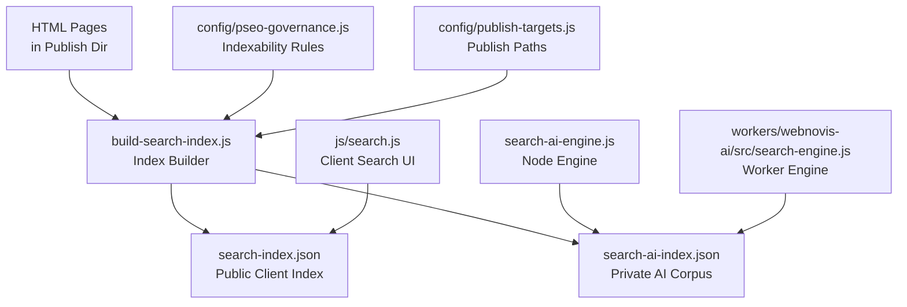
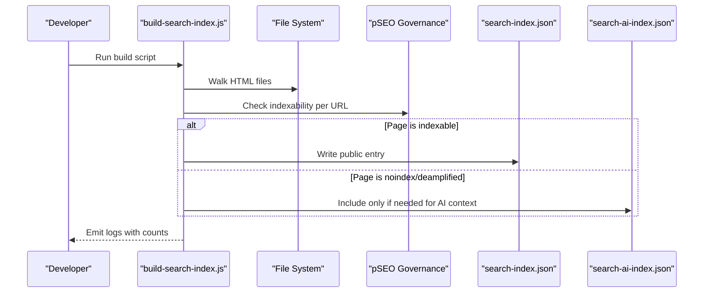
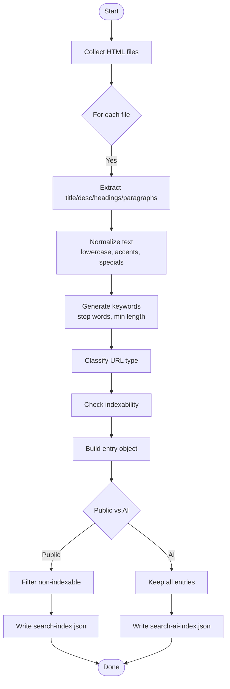
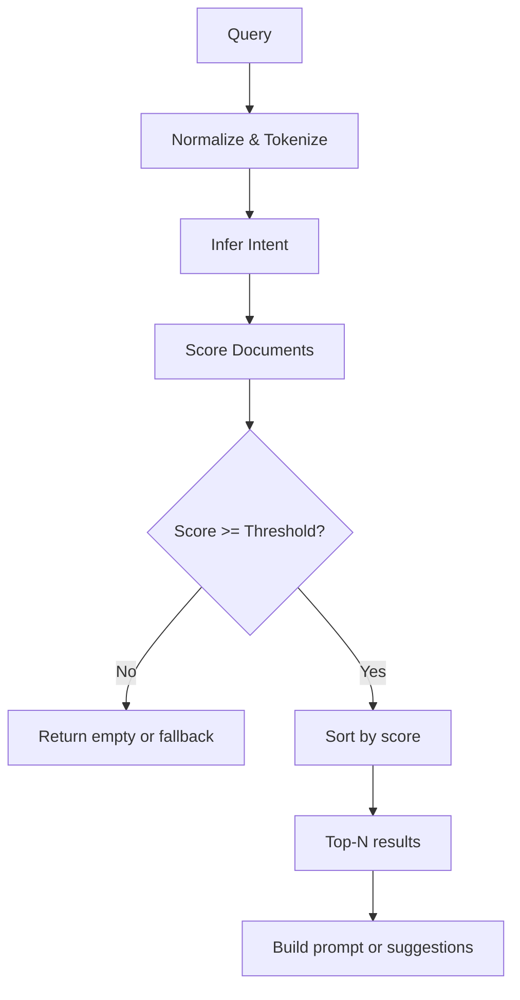
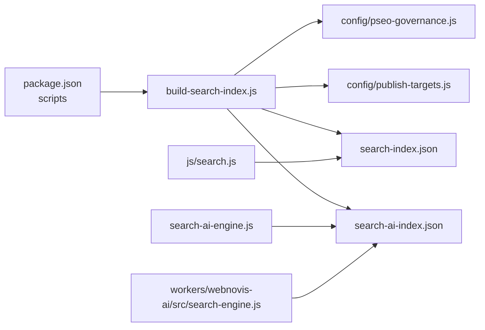

# Search Index Construction & Management

<cite>
**Referenced Files in This Document**
- [build-search-index.js](file://build-search-index.js)
- [search-ai-engine.js](file://search-ai-engine.js)
- [workers/webnovis-ai/src/search-engine.js](file://workers/webnovis-ai/src/search-engine.js)
- [js/search.js](file://js/search.js)
- [config/pseo-governance.js](file://config/pseo-governance.js)
- [config/publish-targets.js](file://config/publish-targets.js)
- [search-index.json](file://search-index.json)
- [package.json](file://package.json)
</cite>

## Table of Contents
1. [Introduction](#introduction)
2. [Project Structure](#project-structure)
3. [Core Components](#core-components)
4. [Architecture Overview](#architecture-overview)
5. [Detailed Component Analysis](#detailed-component-analysis)
6. [Dependency Analysis](#dependency-analysis)
7. [Performance Considerations](#performance-considerations)
8. [Troubleshooting Guide](#troubleshooting-guide)
9. [Conclusion](#conclusion)
10. [Appendices](#appendices)

## Introduction
This document explains the search index construction and management system used by the project. It covers how HTML content is scanned, parsed, normalized, tokenized, and indexed into two JSON artifacts: a public client-side index for Fuse.js and a richer private corpus for server-side AI retrieval. It also documents the indexing pipeline’s text normalization, stop word filtering, multi-language support for Italian, document schema, type classification, metadata preservation, and the relationship between index files and the corpus loading mechanism. Finally, it provides guidance on customizing the pipeline, adding new sources, and optimizing index size.

## Project Structure
The indexing system spans build-time scripts, runtime engines, and configuration modules:

- Build-time indexer: scans published HTML and emits JSON indexes.
- Runtime engines: load and query the indexes for client-side and server-side search.
- Governance: controls which pages are indexable based on SEO strategy.
- Configuration: resolves publish directories and output locations.

**Diagram sources**
- [build-search-index.js:1-325](file://build-search-index.js#L1-L325)
- [js/search.js:475-512](file://js/search.js#L475-L512)
- [search-ai-engine.js:70-117](file://search-ai-engine.js#L70-L117)
- [workers/webnovis-ai/src/search-engine.js:72-105](file://workers/webnovis-ai/src/search-engine.js#L72-L105)
- [config/pseo-governance.js:279-281](file://config/pseo-governance.js#L279-L281)
- [config/publish-targets.js:11-14](file://config/publish-targets.js#L11-L14)

**Section sources**
- [build-search-index.js:1-325](file://build-search-index.js#L1-L325)
- [config/publish-targets.js:1-37](file://config/publish-targets.js#L1-L37)
- [config/pseo-governance.js:1-311](file://config/pseo-governance.js#L1-L311)

## Core Components
- Index builder: walks HTML files, extracts metadata and content, classifies types, applies governance rules, and writes two JSON indexes.
- Client search engine: loads the public index, runs Fuse.js fuzzy search, builds semantic results, and optionally calls a remote AI endpoint.
- Server-side AI engines: load either the private or public index, normalize and tokenize content, score documents, and generate prompts/fallback answers.
- Governance module: defines which paths are indexable or de-amplified, influencing whether entries are included in the public index.

Key responsibilities:
- Title extraction from HTML title tags with suffix cleanup.
- Description parsing from meta description or inferred from paragraphs/body.
- Content normalization: lowercase conversion, accent removal, special character handling, whitespace normalization.
- Tokenization with Italian stop words and minimum token length.
- Type classification: page, servizio, locale, articolo (plus hub, portfolio, legale).
- Metadata preservation: id, url, type, title, description, keywords, headings, content, aiContent, indexable.

**Section sources**
- [build-search-index.js:152-196](file://build-search-index.js#L152-L196)
- [build-search-index.js:244-268](file://build-search-index.js#L244-L268)
- [build-search-index.js:270-307](file://build-search-index.js#L270-L307)
- [search-ai-engine.js:18-36](file://search-ai-engine.js#L18-L36)
- [workers/webnovis-ai/src/search-engine.js:20-38](file://workers/webnovis-ai/src/search-engine.js#L20-L38)
- [js/search.js:153-174](file://js/search.js#L153-L174)

## Architecture Overview
The system produces two artifacts:
- search-index.json: lightweight, excludes AI-only fields, used by the browser-based search UI.
- search-ai-index.json: richer corpus including longer AI snippets, used by Node/Worker engines for ranking and prompt generation.

**Diagram sources**
- [build-search-index.js:221-233](file://build-search-index.js#L221-L233)
- [build-search-index.js:270-307](file://build-search-index.js#L270-L307)
- [config/pseo-governance.js:279-281](file://config/pseo-governance.js#L279-L281)

## Detailed Component Analysis

### Index Builder Pipeline
The indexer performs these steps:
- Collect source files from root and allowed subdirectories.
- For each HTML file:
  - Extract title, meta description, meta keywords.
  - Strip HTML to get clean text; extract headings and paragraphs.
  - Normalize text and truncate safely at sentence boundaries.
  - Generate keywords by normalizing and filtering tokens with stop words.
  - Classify URL into type (page, servizio, locale, articolo, etc.).
  - Determine indexability via meta robots and governance rules.
  - Produce an entry with id, url, type, title, description, keywords, headings, content, aiContent, indexable.
- Split into public and AI indexes:
  - Public index filters out non-indexable entries and removes aiContent.
  - AI index includes all entries and uses aiSnippet when available.

**Diagram sources**
- [build-search-index.js:221-233](file://build-search-index.js#L221-L233)
- [build-search-index.js:152-196](file://build-search-index.js#L152-L196)
- [build-search-index.js:244-268](file://build-search-index.js#L244-L268)
- [build-search-index.js:270-307](file://build-search-index.js#L270-L307)

**Section sources**
- [build-search-index.js:20-42](file://build-search-index.js#L20-L42)
- [build-search-index.js:44-108](file://build-search-index.js#L44-L108)
- [build-search-index.js:120-142](file://build-search-index.js#L120-L142)
- [build-search-index.js:152-196](file://build-search-index.js#L152-L196)
- [build-search-index.js:221-233](file://build-search-index.js#L221-L233)
- [build-search-index.js:244-268](file://build-search-index.js#L244-L268)
- [build-search-index.js:270-307](file://build-search-index.js#L270-L307)

### Text Normalization and Tokenization
Normalization techniques applied across components:
- Lowercase conversion.
- Accent removal using Unicode normalization (NFD) and stripping combining marks.
- Special character handling: replace punctuation and symbols with spaces; collapse whitespace.
- Domain-specific normalization: unify “e-commerce” variants to “ecommerce”.
- Safe truncation at sentence boundaries to avoid cutting mid-sentence.

Tokenization:
- Split normalized text into tokens.
- Filter tokens shorter than three characters.
- Remove Italian stop words defined in sets.
- Deduplicate tokens where appropriate.

Multi-language support:
- The normalization pipeline supports Italian content through accent removal and stop word lists tailored to Italian.
- Tests assert that certain unaccented forms are handled correctly.

**Section sources**
- [build-search-index.js:44-82](file://build-search-index.js#L44-L82)
- [search-ai-engine.js:14-36](file://search-ai-engine.js#L14-L36)
- [workers/webnovis-ai/src/search-engine.js:16-38](file://workers/webnovis-ai/src/search-engine.js#L16-L38)
- [js/search.js:153-174](file://js/search.js#L153-L174)
- [tests/editorial-language-regressions.test.js:76-101](file://tests/editorial-language-regressions.test.js#L76-L101)

### Document Schema and Type Classification
Schema fields:
- id: canonical URL identifier.
- url: normalized path without fragments or query strings.
- type: classification derived from URL patterns.
- title: cleaned title string.
- description: short description for clients.
- keywords: comma-separated keyword list generated from multiple sources.
- headings: array of truncated heading texts.
- content: client-facing snippet.
- aiContent: longer AI-friendly snippet (only in AI index).
- indexable: boolean indicating inclusion in public index.

Type classification logic:
- /blog/ → hub; /blog/* → articolo.
- /portfolio/case-study/* → portfolio.
- /servizi/ → hub; /servizi/* → servizio.
- /agenzia-web*, /realizzazione-siti-web*, /zone-servite* → locale.
- Pattern matching for city/service slugs → locale.
- Legal pages → legale.
- Default → page.

URL normalization:
- Converts Windows backslashes to forward slashes.
- Maps index.html to /.
- Removes trailing index.html segments.

**Section sources**
- [build-search-index.js:235-268](file://build-search-index.js#L235-L268)
- [build-search-index.js:270-289](file://build-search-index.js#L270-L289)

### Index File Formats and Corpus Loading
- search-index.json:
  - Array of entries excluding aiContent.
  - Used by js/search.js for Fuse.js indexing and client-side search.
- search-ai-index.json:
  - Array of entries including aiContent or replacing content with longer AI snippets.
  - Loaded by search-ai-engine.js and worker search engine for ranking and prompt building.

Corpus loading:
- Node engine reads both files in order; first valid array becomes corpus.
- Worker engine accepts raw docs passed in, typically prepared from the same JSON structure.
- Both engines prepare normalized fields and token sets for fast scoring.

**Section sources**
- [build-search-index.js:292-325](file://build-search-index.js#L292-L325)
- [search-ai-engine.js:4-117](file://search-ai-engine.js#L4-L117)
- [workers/webnovis-ai/src/search-engine.js:72-105](file://workers/webnovis-ai/src/search-engine.js#L72-L105)
- [js/search.js:475-512](file://js/search.js#L475-L512)

### Ranking and Intent Inference
Both engines implement hybrid token/intent ranking:
- Lexical matches in title, URL, description, headings, content receive weighted scores.
- Token presence boosts contribute additional points.
- Intent inference guides type boosts:
  - pricing, contact, portfolio, about, informational, local, commercial.
- Additional heuristics:
  - Prefer service pages for commercial intent.
  - Demote generic GEO clones when not explicitly local.
  - Boost current section proximity.
  - Penalize non-indexable entries.

**Diagram sources**
- [search-ai-engine.js:54-63](file://search-ai-engine.js#L54-L63)
- [search-ai-engine.js:151-199](file://search-ai-engine.js#L151-L199)
- [workers/webnovis-ai/src/search-engine.js:56-65](file://workers/webnovis-ai/src/search-engine.js#L56-L65)
- [workers/webnovis-ai/src/search-engine.js:107-157](file://workers/webnovis-ai/src/search-engine.js#L107-L157)

**Section sources**
- [search-ai-engine.js:54-63](file://search-ai-engine.js#L54-L63)
- [search-ai-engine.js:151-199](file://search-ai-engine.js#L151-L199)
- [workers/webnovis-ai/src/search-engine.js:56-65](file://workers/webnovis-ai/src/search-engine.js#L56-L65)
- [workers/webnovis-ai/src/search-engine.js:107-157](file://workers/webnovis-ai/src/search-engine.js#L107-L157)

### Client-Side Search Integration
- Loads search-index.json and initializes Fuse.js with weighted keys.
- Debounces input and renders results with highlighting.
- Builds semantic reranking locally and can call a remote AI endpoint for enrichment.
- Provides accessibility features and keyboard navigation.

**Section sources**
- [js/search.js:475-512](file://js/search.js#L475-L512)
- [js/search.js:514-527](file://js/search.js#L514-L527)
- [js/search.js:529-553](file://js/search.js#L529-L553)
- [js/search.js:560-580](file://js/search.js#L560-L580)

## Dependency Analysis
The indexing system depends on:
- File system access for reading/writing JSON and HTML.
- Governance module for indexability decisions.
- Publish target configuration for resolving output directories.
- Package scripts for orchestrating builds.

**Diagram sources**
- [package.json:6-18](file://package.json#L6-L18)
- [build-search-index.js:10-18](file://build-search-index.js#L10-L18)
- [config/pseo-governance.js:279-281](file://config/pseo-governance.js#L279-L281)
- [config/publish-targets.js:11-14](file://config/publish-targets.js#L11-L14)

**Section sources**
- [package.json:6-18](file://package.json#L6-L18)
- [build-search-index.js:10-18](file://build-search-index.js#L10-L18)

## Performance Considerations
- Index size optimization:
  - Use public-only mode to exclude AI corpus from production artifacts.
  - Truncate titles, descriptions, headings, and content to safe lengths.
  - Limit number of headings stored per entry.
  - Deduplicate and filter tokens to reduce keyword bloat.
- Query performance:
  - Fuse.js thresholds and weights tuned for speed and relevance.
  - Debounce user input to minimize re-runs.
  - Local-first search with optional remote AI enrichment reduces latency.
- Memory usage:
  - Precompute normalized fields and token sets once during corpus preparation.
  - Avoid storing large bodies in public index; keep AI snippets separate.

[No sources needed since this section provides general guidance]

## Troubleshooting Guide
Common issues and resolutions:
- No results returned:
  - Ensure search-index.json exists and is fetchable.
  - Verify Fuse.js loaded successfully and keys configured.
  - Check minimum query length and thresholds.
- AI enrichment disabled:
  - Remote AI may be disabled due to errors or rate limits; fallback to local response.
  - Confirm endpoint availability and environment variables.
- Index outdated:
  - Re-run build script to regenerate indexes after content changes.
  - Validate governance rules if pages unexpectedly excluded.
- Incorrect type classification:
  - Review URL patterns and adjust classifyType logic if new sections added.

**Section sources**
- [js/search.js:475-512](file://js/search.js#L475-L512)
- [js/search.js:529-553](file://js/search.js#L529-L553)
- [build-search-index.js:292-325](file://build-search-index.js#L292-L325)
- [config/pseo-governance.js:279-281](file://config/pseo-governance.js#L279-L281)

## Conclusion
The search index system combines robust build-time extraction and normalization with flexible runtime engines for client and server search. It supports Italian content through careful normalization and stop word handling, preserves essential metadata, and enforces SEO governance to control indexability. The dual-index approach balances performance and richness, enabling fast client-side search while providing deeper context for AI-driven responses. Customization points include extending content sources, adjusting normalization/tokenization rules, refining type classification, and tuning ranking weights.

[No sources needed since this section summarizes without analyzing specific files]

## Appendices

### Customizing the Indexing Pipeline
- Add new content sources:
  - Extend PUBLIC_SUBDIRS in the indexer to include new directories.
  - Update collectSourceFiles to scan additional paths.
- Adjust normalization/tokenization:
  - Modify normalizeText to handle domain-specific terms or languages.
  - Expand STOP_WORDS for language variations or brand terms.
- Refine type classification:
  - Update classifyType to recognize new URL patterns or content types.
- Tune ranking:
  - Adjust weights in client and server engines to prioritize certain fields or intents.

**Section sources**
- [build-search-index.js:26-34](file://build-search-index.js#L26-L34)
- [build-search-index.js:244-268](file://build-search-index.js#L244-L268)
- [search-ai-engine.js:151-199](file://search-ai-engine.js#L151-L199)
- [workers/webnovis-ai/src/search-engine.js:107-157](file://workers/webnovis-ai/src/search-engine.js#L107-L157)

### Optimizing Index Size for Performance
- Use public-only builds to exclude AI corpus in production.
- Limit stored headings and truncate content safely.
- Reduce keyword lists by enforcing minimum token length and stop word filtering.
- Ensure governance rules prevent unnecessary pages from being indexed.

**Section sources**
- [build-search-index.js:292-325](file://build-search-index.js#L292-L325)
- [build-search-index.js:120-142](file://build-search-index.js#L120-L142)
- [config/pseo-governance.js:279-281](file://config/pseo-governance.js#L279-L281)