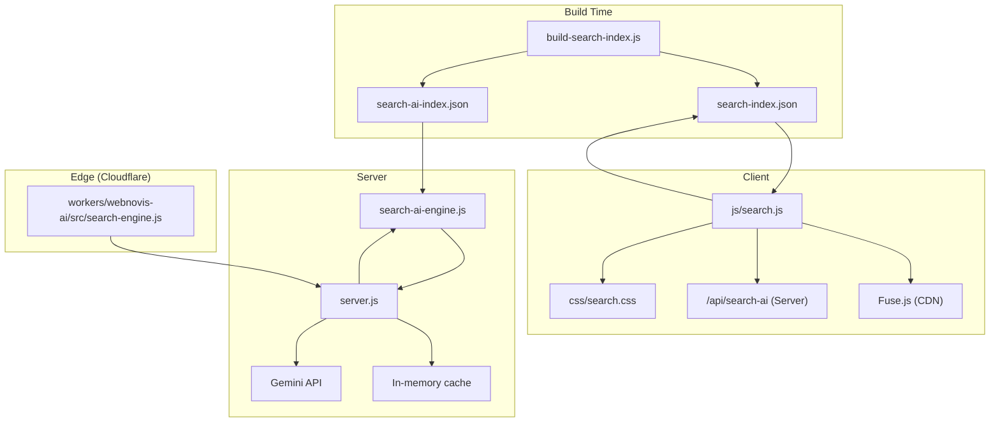
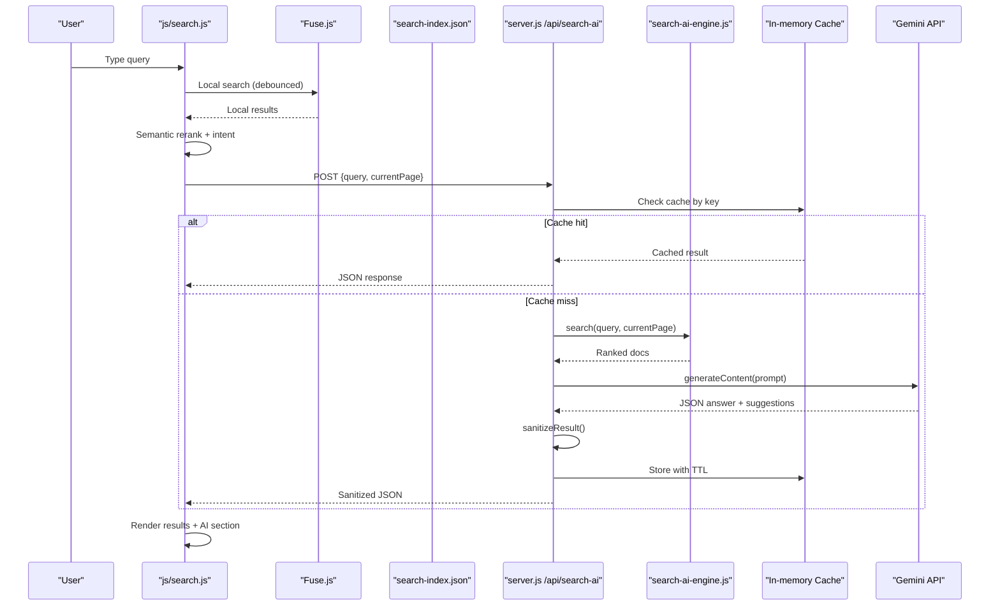
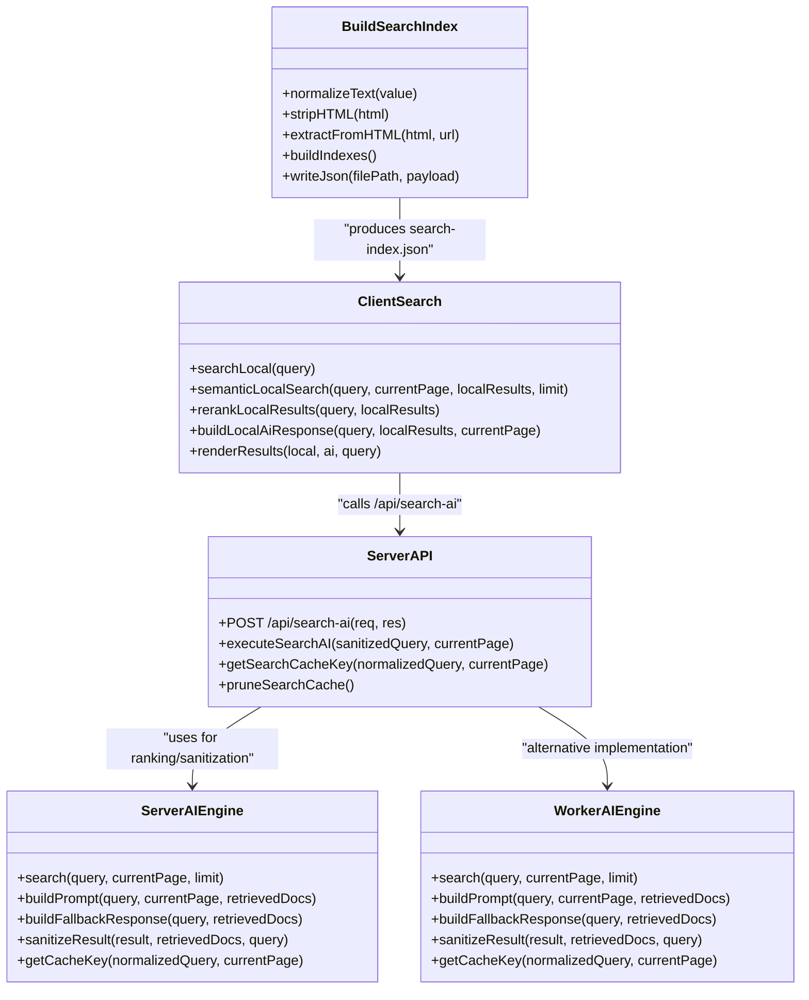

# Search Results Presentation & Caching

<cite>
**Referenced Files in This Document**
- [build-search-index.js](file://build-search-index.js)
- [search-index.json](file://search-index.json)
- [js/search.js](file://js/search.js)
- [css/search.css](file://css/search.css)
- [search-ai-engine.js](file://search-ai-engine.js)
- [workers/webnovis-ai/src/search-engine.js](file://workers/webnovis-ai/src/search-engine.js)
- [server.js](file://server.js)
</cite>

## Table of Contents
1. [Introduction](#introduction)
2. [Project Structure](#project-structure)
3. [Core Components](#core-components)
4. [Architecture Overview](#architecture-overview)
5. [Detailed Component Analysis](#detailed-component-analysis)
6. [Dependency Analysis](#dependency-analysis)
7. [Performance Considerations](#performance-considerations)
8. [Troubleshooting Guide](#troubleshooting-guide)
9. [Conclusion](#conclusion)
10. [Appendices](#appendices)

## Introduction
This document explains the search results presentation layer and caching strategies across client, server, and AI engines. It covers:
- Result sanitization that validates URLs, deduplicates suggestions, and ensures data integrity before display
- Relevance normalization between 0.25 and 0.99 for consistent UX
- Fallback responses with suggested pages and related queries when no relevant results are found
- Caching using normalized query keys and current page context to optimize performance
- Examples for customizing result formatting, implementing faceted search, and integrating external analytics
- Error handling strategies and monitoring approaches for production environments

## Project Structure
The search system is composed of:
- A build-time index generator producing a lightweight public index and a richer private corpus
- A client-side search UI powered by Fuse.js with semantic reranking and optional AI enrichment
- A server-side AI engine that ranks documents, builds prompts, and returns sanitized results
- A Cloudflare Worker implementation mirroring the same ranking and sanitization logic

**Diagram sources**
- [build-search-index.js:1-325](file://build-search-index.js#L1-L325)
- [js/search.js:1-800](file://js/search.js#L1-L800)
- [css/search.css:1-796](file://css/search.css#L1-L796)
- [search-ai-engine.js:1-397](file://search-ai-engine.js#L1-L397)
- [workers/webnovis-ai/src/search-engine.js:1-379](file://workers/webnovis-ai/src/search-engine.js#L1-L379)
- [server.js:650-849](file://server.js#L650-L849)

**Section sources**
- [build-search-index.js:1-325](file://build-search-index.js#L1-L325)
- [js/search.js:1-800](file://js/search.js#L1-L800)
- [css/search.css:1-796](file://css/search.css#L1-L796)
- [search-ai-engine.js:1-397](file://search-ai-engine.js#L1-L397)
- [workers/webnovis-ai/src/search-engine.js:1-379](file://workers/webnovis-ai/src/search-engine.js#L1-L379)
- [server.js:650-849](file://server.js#L650-L849)

## Core Components
- Build-time index generator: extracts metadata, snippets, headings, keywords, and classifies types; produces both public and AI corpora
- Client search UI: Fuse.js fuzzy search, semantic reranking, intent inference, local fallback answers, and optional remote AI enrichment
- Server AI engine: token/intent hybrid scoring, prompt building, fallback generation, and result sanitization
- Edge worker engine: identical ranking/sanitization functions for Cloudflare Workers
- Caching: normalized query key + current page context; in-memory LRU-like eviction on the server

Key responsibilities:
- Sanitization: URL validation, deduplication, text truncation, safe rendering
- Relevance normalization: scores clamped to [0.25, 0.99] for consistency
- Fallbacks: helpful guidance with suggested pages and related queries
- Performance: debounce, local-first search, background AI enrichment, server-side caching

**Section sources**
- [build-search-index.js:1-325](file://build-search-index.js#L1-L325)
- [js/search.js:1-800](file://js/search.js#L1-L800)
- [search-ai-engine.js:1-397](file://search-ai-engine.js#L1-L397)
- [workers/webnovis-ai/src/search-engine.js:1-379](file://workers/webnovis-ai/src/search-engine.js#L1-L379)
- [server.js:650-849](file://server.js#L650-L849)

## Architecture Overview
The search pipeline combines fast local search with intelligent AI assistance:

**Diagram sources**
- [js/search.js:464-527](file://js/search.js#L464-L527)
- [js/search.js:530-580](file://js/search.js#L530-L580)
- [server.js:742-815](file://server.js#L742-L815)
- [search-ai-engine.js:201-230](file://search-ai-engine.js#L201-L230)
- [search-ai-engine.js:273-322](file://search-ai-engine.js#L273-L322)
- [search-ai-engine.js:324-362](file://search-ai-engine.js#L324-L362)

## Detailed Component Analysis

### Index Builder (Build-Time)
Responsibilities:
- Walk HTML files, extract title, meta description, headings, paragraphs
- Normalize text, strip HTML, truncate safely at sentence boundaries
- Classify page type (page, hub, articolo, servizio, locale, legale)
- Produce two outputs:
  - Public index for Fuse.js (lightweight)
  - AI corpus with longer content snippet

Sanitization and integrity:
- Decodes entities, strips scripts/styles, normalizes whitespace
- Builds keyword strings from multiple fields, deduplicated tokens
- Respects noindex directives and governance rules

Relevance preparation:
- Headings truncated to limit size
- Short and long descriptions generated for client and AI use

**Section sources**
- [build-search-index.js:44-124](file://build-search-index.js#L44-L124)
- [build-search-index.js:152-196](file://build-search-index.js#L152-L196)
- [build-search-index.js:202-233](file://build-search-index.js#L202-L233)
- [build-search-index.js:235-290](file://build-search-index.js#L235-L290)
- [build-search-index.js:292-325](file://build-search-index.js#L292-L325)

### Client Search UI (js/search.js)
Responsibilities:
- Debounced input handling, Fuse.js initialization, and local search
- Semantic reranking based on normalized fields and intent
- Intent inference for pricing, contact, portfolio, about, informational, local
- Local AI answer synthesis when local matches are strong enough
- Optional remote AI enrichment via /api/search-ai
- Accessibility: live region announcements, keyboard navigation
- Rendering: highlight matches, type icons, labels, related queries

Sanitization and safety:
- Escapes HTML for safe rendering
- Normalizes paths, truncates titles/descriptions
- Clamps relevance values to [0.35, 0.99] for local suggestions

Fallback behavior:
- If no local results, shows “no results” hint with link to contacts
- If AI not available or disabled, uses local synthesized answer

Caching strategy:
- Client does not cache responses; relies on server-side cache
- Uses AbortController to cancel redundant AI requests

**Section sources**
- [js/search.js:83-100](file://js/search.js#L83-L100)
- [js/search.js:144-174](file://js/search.js#L144-L174)
- [js/search.js:194-210](file://js/search.js#L194-L210)
- [js/search.js:212-226](file://js/search.js#L212-L226)
- [js/search.js:251-319](file://js/search.js#L251-L319)
- [js/search.js:321-360](file://js/search.js#L321-L360)
- [js/search.js:362-396](file://js/search.js#L362-L396)
- [js/search.js:398-440](file://js/search.js#L398-L440)
- [js/search.js:464-527](file://js/search.js#L464-L527)
- [js/search.js:530-580](file://js/search.js#L530-L580)
- [js/search.js:622-691](file://js/search.js#L622-L691)

### Server AI Engine (search-ai-engine.js)
Responsibilities:
- Load corpus from search-ai-index.json or search-index.json
- Token/intent hybrid scoring with boosts for commercial and conversion-oriented pages
- Build prompts for Gemini with structured context
- Generate fallback responses when no relevant docs exist
- Sanitize results: validate URLs, deduplicate, clamp relevance to [0.25, 0.99], truncate text

Relevance normalization:
- Scores divided by top score and clamped to [0.25, 0.99]
- Ensures consistent UX across different queries and contexts

Fallback response:
- Provides helpful guidance with suggested pages and related queries
- Tailored to inferred intent (contact, portfolio, pricing, local, informational)

Cache key generation:
- Combines normalized query and current page path into a stable key

**Section sources**
- [search-ai-engine.js:70-117](file://search-ai-engine.js#L70-L117)
- [search-ai-engine.js:119-147](file://search-ai-engine.js#L119-L147)
- [search-ai-engine.js:149-199](file://search-ai-engine.js#L149-L199)
- [search-ai-engine.js:201-230](file://search-ai-engine.js#L201-L230)
- [search-ai-engine.js:273-322](file://search-ai-engine.js#L273-L322)
- [search-ai-engine.js:324-362](file://search-ai-engine.js#L324-L362)
- [search-ai-engine.js:376-378](file://search-ai-engine.js#L376-L378)

### Edge Worker Engine (workers/webnovis-ai/src/search-engine.js)
Responsibilities:
- Mirrors server-side ranking and sanitization for Cloudflare Workers
- Same token/intent scoring, prompt building, fallback generation
- Ensures consistent behavior across server and edge

Sanitization and normalization:
- Identical URL validation, deduplication, and relevance clamping to [0.25, 0.99]
- Safe text truncation and related query generation

**Section sources**
- [workers/webnovis-ai/src/search-engine.js:72-105](file://workers/webnovis-ai/src/search-engine.js#L72-L105)
- [workers/webnovis-ai/src/search-engine.js:107-157](file://workers/webnovis-ai/src/search-engine.js#L107-L157)
- [workers/webnovis-ai/src/search-engine.js:188-219](file://workers/webnovis-ai/src/search-engine.js#L188-L219)
- [workers/webnovis-ai/src/search-engine.js:262-310](file://workers/webnovis-ai/src/search-engine.js#L262-L310)
- [workers/webnovis-ai/src/search-engine.js:312-349](file://workers/webnovis-ai/src/search-engine.js#L312-L349)
- [workers/webnovis-ai/src/search-engine.js:365-367](file://workers/webnovis-ai/src/search-engine.js#L365-L367)

### Server API and Caching (server.js)
Responsibilities:
- POST /api/search-ai endpoint with rate limiting and quota guard
- Input sanitization and injection pattern checks
- In-memory cache keyed by normalized query + current page
- In-flight request deduplication to avoid duplicate API calls
- Timeout and error handling with fallback responses

Caching details:
- Key derived from normalized query and sanitized current page
- TTL-based expiration and LRU-style pruning when exceeding max size
- Coalesces concurrent identical queries into one API call

Error handling:
- Graceful fallback to built-in responses when API errors occur
- Logs errors and returns safe JSON to clients

**Section sources**
- [server.js:650-673](file://server.js#L650-L673)
- [server.js:676-740](file://server.js#L676-L740)
- [server.js:742-815](file://server.js#L742-L815)

### Styling and Presentation (css/search.css)
Responsibilities:
- Responsive layout for desktop dropdown and mobile modal
- Visual feedback: focus states, hover effects, loading shimmer, AI badge
- Accessibility: clear structure, keyboard hints, screen reader support
- Consistent typography and spacing for search results and AI sections

Customization points:
- Colors, borders, shadows, animations can be adjusted via CSS variables
- Mobile modal transitions and overlay styling
- Related query tags and AI answer block styles

**Section sources**
- [css/search.css:1-112](file://css/search.css#L1-L112)
- [css/search.css:142-210](file://css/search.css#L142-L210)
- [css/search.css:212-310](file://css/search.css#L212-L310)
- [css/search.css:312-421](file://css/search.css#L312-L421)
- [css/search.css:422-484](file://css/search.css#L422-L484)
- [css/search.css:485-547](file://css/search.css#L485-L547)
- [css/search.css:549-796](file://css/search.css#L549-L796)

## Dependency Analysis
The components interact through well-defined interfaces:

**Diagram sources**
- [build-search-index.js:1-325](file://build-search-index.js#L1-L325)
- [js/search.js:1-800](file://js/search.js#L1-L800)
- [search-ai-engine.js:1-397](file://search-ai-engine.js#L1-L397)
- [workers/webnovis-ai/src/search-engine.js:1-379](file://workers/webnovis-ai/src/search-engine.js#L1-L379)
- [server.js:650-849](file://server.js#L650-L849)

**Section sources**
- [build-search-index.js:1-325](file://build-search-index.js#L1-L325)
- [js/search.js:1-800](file://js/search.js#L1-L800)
- [search-ai-engine.js:1-397](file://search-ai-engine.js#L1-L397)
- [workers/webnovis-ai/src/search-engine.js:1-379](file://workers/webnovis-ai/src/search-engine.js#L1-L379)
- [server.js:650-849](file://server.js#L650-L849)

## Performance Considerations
- Debounce client input (150ms) to reduce search frequency
- Local-first search with Fuse.js for instant results (< 50ms typical)
- Background AI enrichment only when needed (longer queries, weak local matches)
- Server-side in-memory cache with TTL and LRU pruning
- In-flight deduplication prevents duplicate API calls for concurrent identical queries
- Truncated snippets and normalized text reduce payload sizes
- CDN-hosted Fuse.js avoids blocking initial load

[No sources needed since this section provides general guidance]

## Troubleshooting Guide
Common issues and resolutions:
- No results displayed: check Fuse.js CDN availability and search-index.json fetch
- AI section not appearing: verify /api/search-ai endpoint availability and CORS settings
- Stale cached results: adjust SEARCH_AI_CACHE_TTL or clear in-memory cache
- High latency: monitor Gemini API timeouts and consider increasing timeout limits
- Incorrect relevance scores: review normalization thresholds and scoring weights
- Injection attempts: ensure INJECTION_PATTERNS detection and fallback responses

Monitoring recommendations:
- Log API errors and fallback usage
- Track cache hit rates and TTL effectiveness
- Monitor Gemini API quota usage and error rates
- Measure client-side search latency and AI enrichment frequency

**Section sources**
- [server.js:742-815](file://server.js#L742-L815)
- [js/search.js:464-527](file://js/search.js#L464-L527)
- [search-ai-engine.js:273-322](file://search-ai-engine.js#L273-L322)

## Conclusion
The search system delivers a robust, user-friendly experience by combining fast local search with intelligent AI assistance. Key strengths include:
- Comprehensive sanitization ensuring data integrity and security
- Consistent relevance normalization for predictable UX
- Intelligent fallback responses guiding users effectively
- Efficient caching strategies optimizing performance under load
- Extensible architecture supporting customization and analytics integration

[No sources needed since this section summarizes without analyzing specific files]

## Appendices

### Customizing Result Formatting
- Modify CSS classes in css/search.css for visual appearance
- Adjust icon mappings in js/search.js TYPE_ICONS object
- Customize label mappings in js/search.js TYPE_LABELS object
- Override render functions for advanced formatting needs

### Implementing Faceted Search
- Extend semanticLocalSearch to filter by type, category, or other attributes
- Add facet controls in the UI that update query parameters
- Implement facet-aware scoring adjustments in rerankLocalResults
- Cache facet combinations separately for performance

### Integrating External Analytics
- Track search events in js/search.js using existing analytics libraries
- Send anonymized query data to analytics endpoints
- Monitor search success rates and popular queries
- Integrate with Google Analytics 4 or similar platforms

### Production Monitoring
- Set up error logging for API failures and cache misses
- Monitor Gemini API quota usage and response times
- Track search performance metrics (latency, accuracy)
- Implement health checks and alerting for critical failures

**Section sources**
- [css/search.css:1-796](file://css/search.css#L1-L796)
- [js/search.js:446-461](file://js/search.js#L446-L461)
- [server.js:650-849](file://server.js#L650-L849)