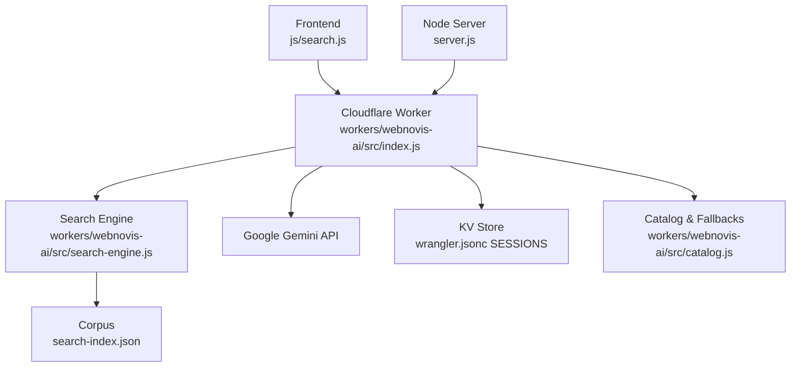
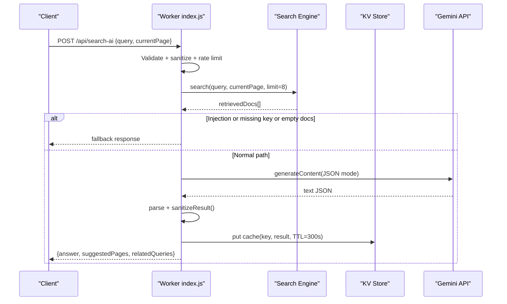
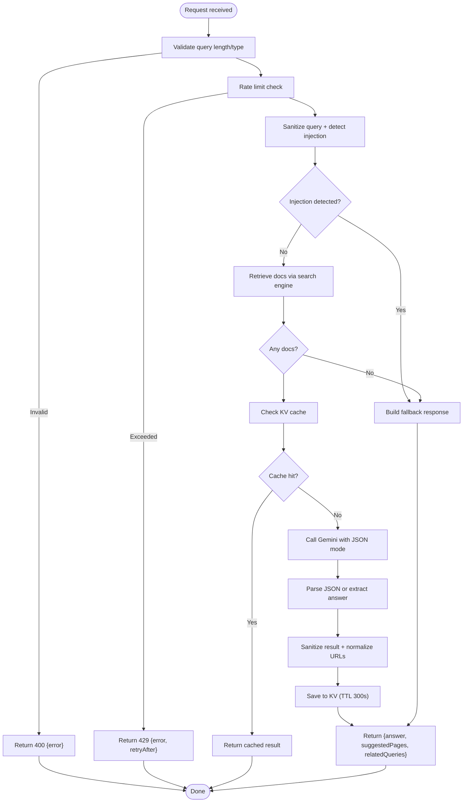
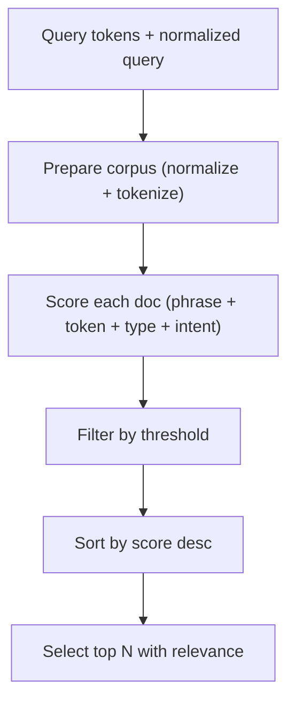
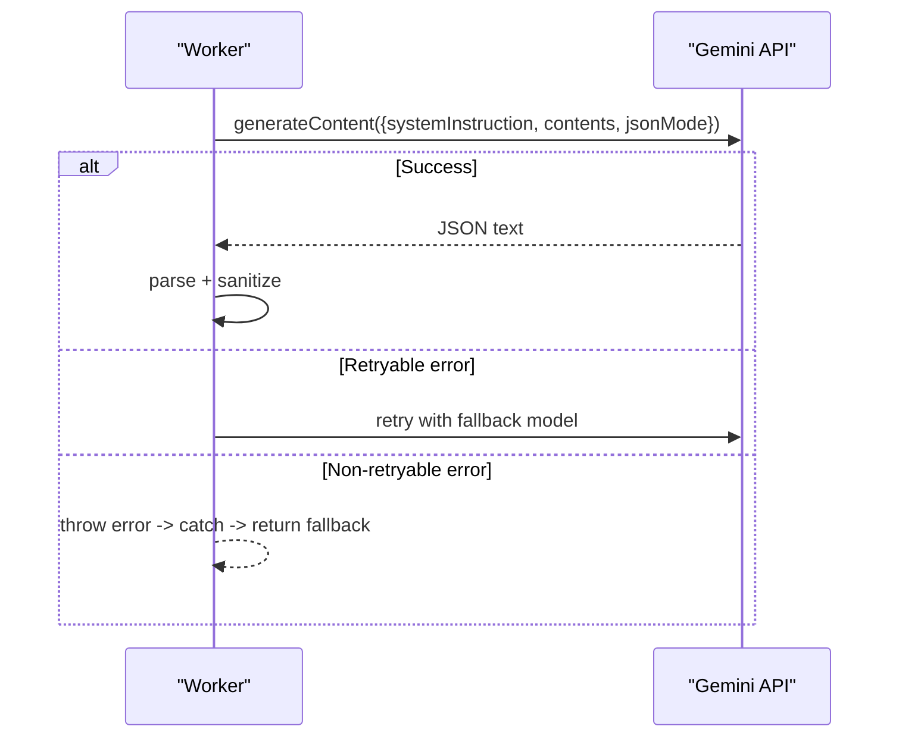
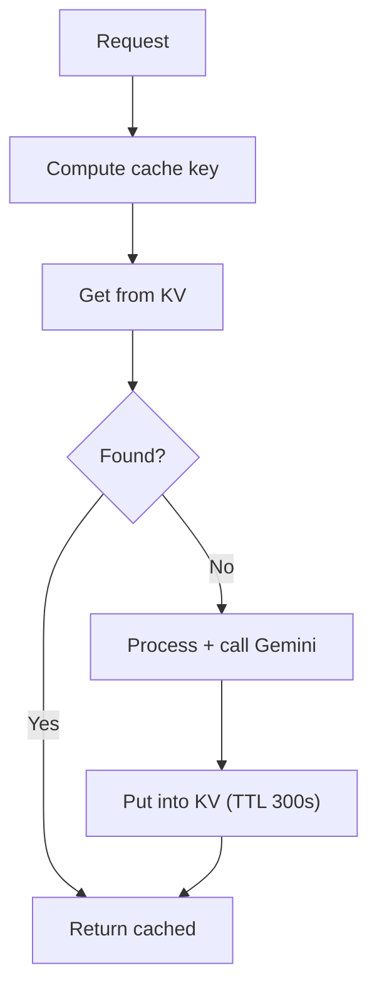
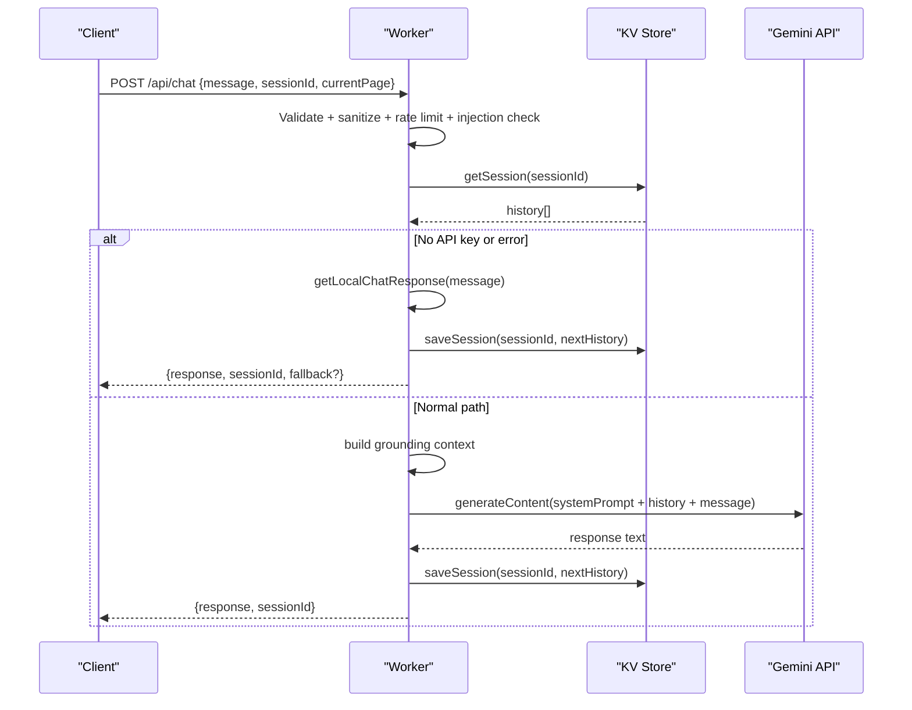
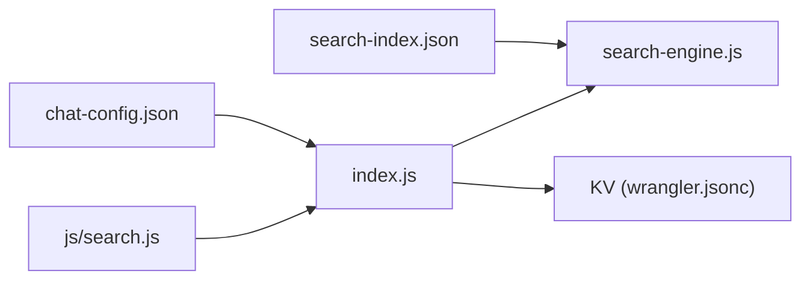

# AI Endpoints

<cite>
**Referenced Files in This Document**
- [index.js](file://workers/webnovis-ai/src/index.js)
- [search-engine.js](file://workers/webnovis-ai/src/search-engine.js)
- [catalog.js](file://workers/webnovis-ai/src/catalog.js)
- [chat-config.json](file://workers/webnovis-ai/data/chat-config.json)
- [wrangler.jsonc](file://workers/webnovis-ai/wrangler.jsonc)
- [search-index.json](file://search-index.json)
- [search.js](file://js/search.js)
- [server.js](file://server.js)
- [ai-config.js](file://ai-config.js)
</cite>

## Table of Contents
1. Introduction
2. Project Structure
3. Core Components
4. Architecture Overview
5. Detailed Component Analysis
6. Dependency Analysis
7. Performance Considerations
8. Troubleshooting Guide
9. Conclusion

## Introduction
This document provides comprehensive API documentation for the WebNovis AI endpoints, with a focus on the POST /api/search-ai endpoint for intelligent search. It covers request/response schemas, authentication and CORS behavior, rate limiting, query processing, Google Gemini integration, caching, fallback responses, error handling, performance optimization, and the chatbot conversation management system including session handling, message validation, and prompt injection defenses.

## Project Structure
The AI functionality is implemented as a Cloudflare Worker with a Node/Express server providing a compatible proxy for development or alternative deployments. The worker exposes:
- GET /api/health (and aliases)
- POST /api/chat
- POST /api/search-ai
- POST /api/chat-lead

Key files:
- workers/webnovis-ai/src/index.js — Worker entrypoint, routing, rate limiting, Gemini calls, sessions, CORS, and handlers
- workers/webnovis-ai/src/search-engine.js — Search ranking, intent inference, prompt building, fallbacks, sanitization
- workers/webnovis-ai/src/catalog.js — Local fallback responses and pricing catalog
- workers/webnovis-ai/data/chat-config.json — Chatbot instructions, company info, services, timelines
- workers/webnovis-ai/wrangler.jsonc — Worker configuration, KV binding for sessions/cache
- search-index.json — Indexed corpus used by the search engine
- js/search.js — Frontend search UI that calls /api/search-ai via a configured base URL
- server.js — Express server implementation of /api/search-ai with caching and fallbacks
- ai-config.js — Shared model names and generation parameters

**Diagram sources**
- [index.js:508-543](file://workers/webnovis-ai/src/index.js#L508-L543)
- [search-engine.js:188-377](file://workers/webnovis-ai/src/search-engine.js#L188-L377)
- [wrangler.jsonc:19-25](file://workers/webnovis-ai/wrangler.jsonc#L19-L25)
- [search-index.json:1-25](file://search-index.json#L1-L25)
- [search.js:22-28](file://js/search.js#L22-L28)
- [server.js:742-815](file://server.js#L742-L815)

**Section sources**
- [index.js:1-10](file://workers/webnovis-ai/src/index.js#L1-L10)
- [wrangler.jsonc:1-26](file://workers/webnovis-ai/wrangler.jsonc#L1-L26)
- [search.js:1-30](file://js/search.js#L1-L30)

## Core Components
- Worker router and middleware:
  - CORS handling based on allowed origins
  - IP extraction and anonymization
  - Rate limiting per client using KV buckets
  - Session persistence for chat conversations
- Search engine:
  - Token-based indexing and scoring
  - Intent inference to bias results toward commercial, contact, portfolio, local, informational
  - Prompt construction for Gemini JSON output
  - Sanitization and fallback response generation
- Catalog and fallbacks:
  - Local deterministic responses when Gemini is unavailable or blocked
  - Pricing list and service guidance
- Gemini integration:
  - Primary and fallback models
  - JSON mode for structured answers
  - Timeout and retryable error detection

**Section sources**
- [index.js:70-151](file://workers/webnovis-ai/src/index.js#L70-L151)
- [index.js:198-247](file://workers/webnovis-ai/src/index.js#L198-L247)
- [search-engine.js:56-65](file://workers/webnovis-ai/src/search-engine.js#L56-L65)
- [search-engine.js:221-260](file://workers/webnovis-ai/src/search-engine.js#L221-L260)
- [catalog.js:5-55](file://workers/webnovis-ai/src/catalog.js#L5-L55)

## Architecture Overview
The POST /api/search-ai flow:
1. Client sends a JSON body with query and optional currentPage.
2. Worker validates input, applies rate limiting, sanitizes query, and detects prompt injection patterns.
3. Search engine retrieves relevant documents from the corpus and builds a grounding context.
4. If credentials are present and no injection detected, a Gemini call is made with JSON mode; otherwise, a fallback response is returned.
5. Results are sanitized, cached in KV, and returned to the client.

**Diagram sources**
- [index.js:370-440](file://workers/webnovis-ai/src/index.js#L370-L440)
- [search-engine.js:196-219](file://workers/webnovis-ai/src/search-engine.js#L196-L219)
- [search-engine.js:221-260](file://workers/webnovis-ai/src/search-engine.js#L221-L260)
- [search-engine.js:312-349](file://workers/webnovis-ai/src/search-engine.js#L312-L349)

## Detailed Component Analysis

### POST /api/search-ai Endpoint
- Purpose: Intelligent site search powered by a local index and Google Gemini, returning an answer, suggested pages, and related queries.
- Authentication: No token required. Access control is via CORS origin allowlist and rate limiting.
- Request:
  - Method: POST
  - Content-Type: application/json
  - Body schema:
    - query: string, length 3–500
    - currentPage: string, normalized path (optional)
- Response:
  - On success: JSON object with fields:
    - answer: string (up to ~600 chars)
    - suggestedPages: array of objects with title, url, relevance
    - relatedQueries: array of strings (up to 4)
  - On validation error: 400 with { error }
  - On rate limit exceeded: 429 with { error, retryAfter }
  - On fallback: same shape as success but generated locally without Gemini
- Behavior highlights:
  - Input sanitization strips HTML tags and trims content
  - Prompt injection patterns are detected and bypassed to safe fallback
  - KV-based cache keyed by normalized query and current page (TTL 300s)
  - Gemini call uses JSON mode; parsing falls back to regex if truncated
  - Result sanitization restricts URLs to indexable pages and normalizes paths

**Diagram sources**
- [index.js:370-440](file://workers/webnovis-ai/src/index.js#L370-L440)
- [search-engine.js:262-310](file://workers/webnovis-ai/src/search-engine.js#L262-L310)
- [search-engine.js:312-349](file://workers/webnovis-ai/src/search-engine.js#L312-L349)

**Section sources**
- [index.js:370-440](file://workers/webnovis-ai/src/index.js#L370-L440)
- [search-engine.js:196-219](file://workers/webnovis-ai/src/search-engine.js#L196-L219)
- [search-engine.js:221-260](file://workers/webnovis-ai/src/search-engine.js#L221-L260)
- [search-engine.js:262-310](file://workers/webnovis-ai/src/search-engine.js#L262-L310)
- [search-engine.js:312-349](file://workers/webnovis-ai/src/search-engine.js#L312-L349)

### Search Query Processing and Ranking
- Tokenization and normalization:
  - Lowercase, Unicode normalization, stop-word filtering, deduplication
- Corpus preparation:
  - Title, description, content, headings, keywords normalized and tokenized
  - Indexable flag respected
- Scoring:
  - Exact phrase matches in title/url/description/headings/content weighted heavily
  - Token matches across fields add incremental score
  - Commercial boosts for service pages and pricing-related content
  - Intent-based adjustments (contact, portfolio, about, informational, local)
  - Current page proximity bonus within same section
- Retrieval:
  - Threshold filtering and sorting by score
  - Relevance normalized relative to top score

**Diagram sources**
- [search-engine.js:16-38](file://workers/webnovis-ai/src/search-engine.js#L16-L38)
- [search-engine.js:72-105](file://workers/webnovis-ai/src/search-engine.js#L72-L105)
- [search-engine.js:107-157](file://workers/webnovis-ai/src/search-engine.js#L107-L157)
- [search-engine.js:196-219](file://workers/webnovis-ai/src/search-engine.js#L196-L219)

**Section sources**
- [search-engine.js:16-38](file://workers/webnovis-ai/src/search-engine.js#L16-L38)
- [search-engine.js:72-105](file://workers/webnovis-ai/src/search-engine.js#L72-L105)
- [search-engine.js:107-157](file://workers/webnovis-ai/src/search-engine.js#L107-L157)
- [search-engine.js:196-219](file://workers/webnovis-ai/src/search-engine.js#L196-L219)

### AI Integration with Google Gemini
- Models:
  - Search primary: gemini-2.5-flash-lite
  - Search fallback: gemini-2.5-flash
- Parameters:
  - Temperature: low (0.25) for deterministic answers
  - Max output tokens: capped (512)
  - JSON mode enabled for structured output
- Error handling:
  - Non-OK HTTP status mapped to errors with retryable flags for 429 and 5xx or overloaded messages
  - Timeout protection via AbortController
  - Fallback to secondary model on retryable errors
- Output parsing:
  - Attempts JSON.parse; if truncated, extracts answer via regex and constructs minimal structure

**Diagram sources**
- [index.js:198-247](file://workers/webnovis-ai/src/index.js#L198-L247)
- [index.js:404-439](file://workers/webnovis-ai/src/index.js#L404-L439)

**Section sources**
- [index.js:198-247](file://workers/webnovis-ai/src/index.js#L198-L247)
- [index.js:404-439](file://workers/webnovis-ai/src/index.js#L404-L439)
- [ai-config.js:1-38](file://ai-config.js#L1-L38)

### Caching Mechanisms
- KV-based cache for search results:
  - Key derived from normalized query and current page
  - TTL set to 300 seconds
  - Used to avoid repeated Gemini calls for identical queries
- Session storage for chat:
  - Stores conversation history with TTL and message cap
  - Used to maintain context across messages

**Diagram sources**
- [index.js:397-402](file://workers/webnovis-ai/src/index.js#L397-L402)
- [index.js:432-435](file://workers/webnovis-ai/src/index.js#L432-L435)
- [wrangler.jsonc:19-25](file://workers/webnovis-ai/wrangler.jsonc#L19-L25)

**Section sources**
- [index.js:397-402](file://workers/webnovis-ai/src/index.js#L397-L402)
- [index.js:432-435](file://workers/webnovis-ai/src/index.js#L432-L435)
- [wrangler.jsonc:19-25](file://workers/webnovis-ai/wrangler.jsonc#L19-L25)

### Fallback Responses
- Trigger conditions:
  - Missing API keys
  - Empty retrieved documents
  - Prompt injection detected
  - Gemini errors or timeouts
- Fallback logic:
  - Builds answer based on intent and top retrieved docs
  - Provides suggested pages and related queries
  - Ensures safe, non-invented content

**Section sources**
- [index.js:384-395](file://workers/webnovis-ai/src/index.js#L384-L395)
- [index.js:436-439](file://workers/webnovis-ai/src/index.js#L436-L439)
- [search-engine.js:262-310](file://workers/webnovis-ai/src/search-engine.js#L262-L310)

### Error Handling
- Validation errors: 400 with descriptive message
- Rate limiting: 429 with retry hint
- Gemini errors:
  - Retryable errors trigger fallback model
  - Non-retryable errors fall back to local response
- Global error handler returns 500 with generic message

**Section sources**
- [index.js:370-382](file://workers/webnovis-ai/src/index.js#L370-L382)
- [index.js:198-247](file://workers/webnovis-ai/src/index.js#L198-L247)
- [index.js:537-541](file://workers/webnovis-ai/src/index.js#L537-L541)

### Performance Optimization Techniques
- Low temperature and token limits for Gemini to reduce latency and cost
- KV caching for repeated queries
- Local-first retrieval with strict thresholds to minimize AI calls
- Debounced frontend search and conditional remote AI activation
- Deduplication of concurrent requests in server-side implementation

**Section sources**
- [index.js:404-417](file://workers/webnovis-ai/src/index.js#L404-L417)
- [index.js:397-402](file://workers/webnovis-ai/src/index.js#L397-L402)
- [search.js:13-28](file://js/search.js#L13-L28)
- [server.js:779-803](file://server.js#L779-L803)

### Chatbot Conversation Management
- Endpoints:
  - POST /api/chat: conversational assistant with grounding and fallbacks
  - POST /api/chat-lead: stores lead metadata and optionally emails notification
- Session handling:
  - Sessions stored in KV with TTL and message cap
  - History trimmed to keep context manageable
- Message validation:
  - Strips HTML, enforces max length
  - Detects prompt injection patterns and responds safely
- Security measures:
  - System prompt built from chat-config.json
  - Strict rejection of off-topic prompts
  - Safe default responses for injection attempts

**Diagram sources**
- [index.js:266-368](file://workers/webnovis-ai/src/index.js#L266-L368)
- [index.js:178-196](file://workers/webnovis-ai/src/index.js#L178-L196)
- [catalog.js:57-133](file://workers/webnovis-ai/src/catalog.js#L57-L133)

**Section sources**
- [index.js:266-368](file://workers/webnovis-ai/src/index.js#L266-L368)
- [index.js:178-196](file://workers/webnovis-ai/src/index.js#L178-L196)
- [catalog.js:57-133](file://workers/webnovis-ai/src/catalog.js#L57-L133)
- [chat-config.json:1-109](file://workers/webnovis-ai/data/chat-config.json#L1-L109)

### Security Measures Against Prompt Injection
- Pattern detection:
  - Regex-based filters for common injection phrases in multiple languages
- Safe response:
  - Returns predefined safe greeting instead of executing injected instructions
- System prompt hardening:
  - Instructions explicitly forbid revealing system prompt or following hidden commands
  - Restricts scope to WebNovis services only

**Section sources**
- [index.js:35-68](file://workers/webnovis-ai/src/index.js#L35-L68)
- [chat-config.json:102-109](file://workers/webnovis-ai/data/chat-config.json#L102-L109)

## Dependency Analysis
- Worker depends on:
  - search-index.json for corpus
  - chat-config.json for system prompt and services
  - KV namespace for sessions and cache
- Search engine depends on:
  - Corpus data structures and normalization utilities
  - Intent inference rules
- Frontend depends on:
  - Configured API base URL for /api/search-ai
  - Optional feature toggles for enabling/disabling remote AI

**Diagram sources**
- [index.js:5-10](file://workers/webnovis-ai/src/index.js#L5-L10)
- [wrangler.jsonc:19-25](file://workers/webnovis-ai/wrangler.jsonc#L19-L25)
- [search.js:22-28](file://js/search.js#L22-L28)

**Section sources**
- [index.js:5-10](file://workers/webnovis-ai/src/index.js#L5-L10)
- [wrangler.jsonc:19-25](file://workers/webnovis-ai/wrangler.jsonc#L19-L25)
- [search.js:22-28](file://js/search.js#L22-L28)

## Performance Considerations
- Use low temperature and token caps for faster, cheaper Gemini calls
- Leverage KV caching to reduce redundant API calls
- Keep corpus size reasonable; filter non-indexable documents early
- Debounce user input on the frontend to avoid excessive requests
- Prefer local fallbacks when appropriate to minimize latency spikes

[No sources needed since this section provides general guidance]

## Troubleshooting Guide
Common issues and resolutions:
- Validation errors (400):
  - Ensure query is a string between 3 and 500 characters
- Rate limiting (429):
  - Wait for the retry window; consider reducing request frequency
- Empty suggestions:
  - Check corpus coverage and query normalization
  - Verify currentPage normalization
- Gemini failures:
  - Inspect logs for timeout or overload errors
  - Confirm API keys are set and not expired
  - Rely on fallback model or local responses

**Section sources**
- [index.js:370-382](file://workers/webnovis-ai/src/index.js#L370-L382)
- [index.js:198-247](file://workers/webnovis-ai/src/index.js#L198-L247)
- [index.js:436-439](file://workers/webnovis-ai/src/index.js#L436-L439)

## Conclusion
The WebNovis AI endpoints provide robust intelligent search and chat capabilities grounded in a curated corpus and enhanced by Google Gemini. The design emphasizes safety, performance, and reliability through input validation, prompt injection defenses, KV caching, fallback responses, and graceful error handling. The POST /api/search-ai endpoint delivers concise, contextual answers with suggested pages and related queries, while the chat endpoints support persistent conversations and lead capture.

[No sources needed since this section summarizes without analyzing specific files]