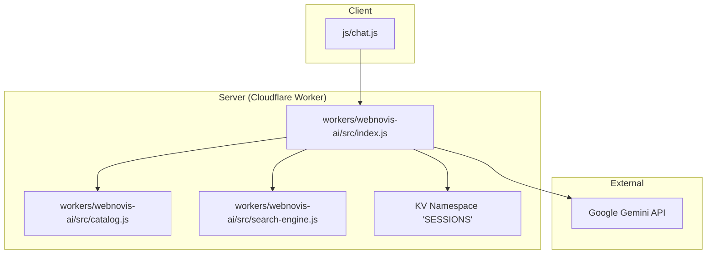
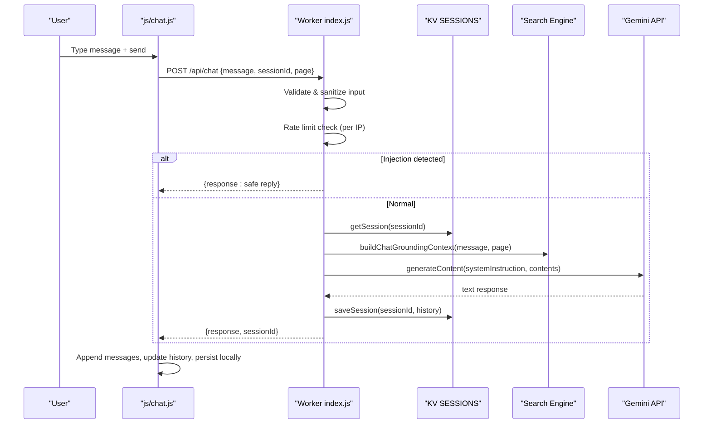
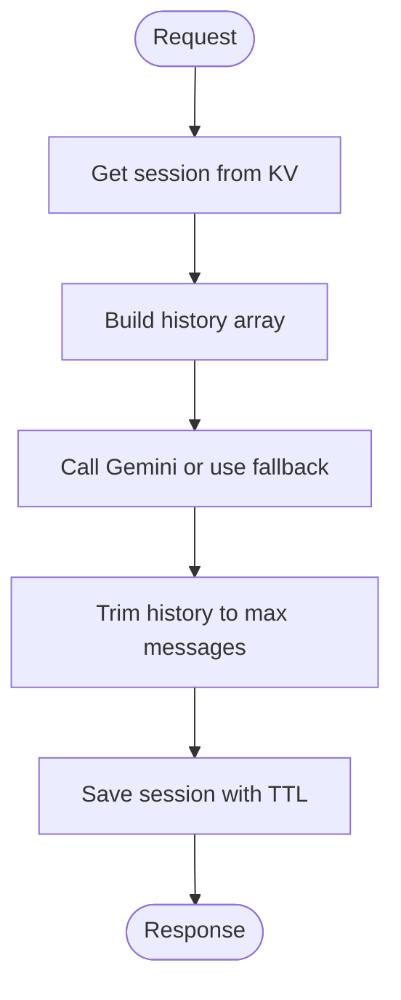
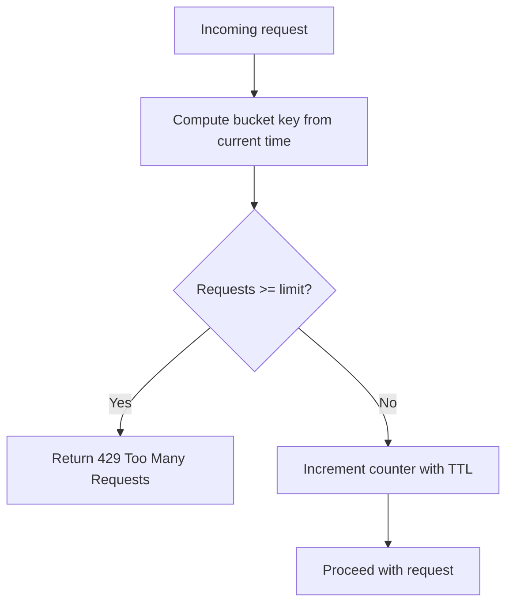
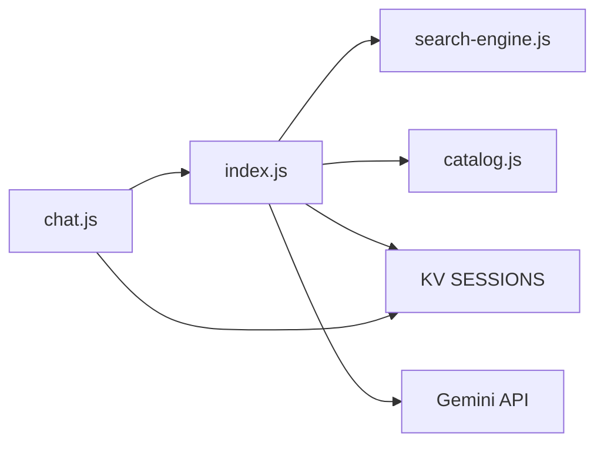

# Chatbot Conversation Endpoint

<cite>
**Referenced Files in This Document**
- [index.js](file://workers/webnovis-ai/src/index.js)
- [catalog.js](file://workers/webnovis-ai/src/catalog.js)
- [search-engine.js](file://workers/webnovis-ai/src/search-engine.js)
- [chat-config.json](file://workers/webnovis-ai/data/chat-config.json)
- [wrangler.jsonc](file://workers/webnovis-ai/wrangler.jsonc)
- [chat.js](file://js/chat.js)
- [README-CHAT.md](file://docs/chatbot/README-CHAT.md)
- [MODELLI-AI.md](file://docs/chatbot/MODELLI-AI.md)
</cite>

## Table of Contents
1. [Introduction](#introduction)
2. [Project Structure](#project-structure)
3. [Core Components](#core-components)
4. [Architecture Overview](#architecture-overview)
5. [Detailed Component Analysis](#detailed-component-analysis)
6. [Dependency Analysis](#dependency-analysis)
7. [Performance Considerations](#performance-considerations)
8. [Troubleshooting Guide](#troubleshooting-guide)
9. [Conclusion](#conclusion)
10. [Appendices](#appendices)

## Introduction
This document provides comprehensive API documentation for the WebNovis chatbot conversation management system. It covers session-based chat with server-side storage, message validation, conversation history management, rate limiting, prompt injection protection, configuration via TOON-style JSON, system prompt generation, and integration with Google Gemini. It also includes client-side behavior, error handling, security considerations, cleanup mechanisms, and memory strategies.

## Project Structure
The chat system is implemented as a Cloudflare Worker with a JavaScript frontend widget:
- Server (Cloudflare Worker): routes, validation, rate limiting, session persistence, prompt injection protection, Gemini integration, search grounding, lead capture.
- Client (Browser): UI, local session persistence, retry logic, adaptive typing, fallback responses, lead intent detection.

**Diagram sources**
- [index.js:1-544](file://workers/webnovis-ai/src/index.js#L1-L544)
- [catalog.js:1-134](file://workers/webnovis-ai/src/catalog.js#L1-L134)
- [search-engine.js:1-379](file://workers/webnovis-ai/src/search-engine.js#L1-L379)
- [wrangler.jsonc:1-26](file://workers/webnovis-ai/wrangler.jsonc#L1-L26)
- [chat.js:1-797](file://js/chat.js#L1-L797)

**Section sources**
- [index.js:1-544](file://workers/webnovis-ai/src/index.js#L1-L544)
- [wrangler.jsonc:1-26](file://workers/webnovis-ai/wrangler.jsonc#L1-L26)
- [chat.js:1-797](file://js/chat.js#L1-L797)

## Core Components
- Session management: server-side KV-backed sessions with TTL and message cap; client-side localStorage with expiry.
- Message validation: input sanitization, length limits, HTML stripping.
- Rate limiting: per-IP sliding window using KV buckets.
- Prompt injection protection: regex-based filters for Italian and English attack patterns.
- Configuration: TOON-like JSON config for company info, services, timelines, and instructions.
- System prompt generation: composed from config and optional search grounding context.
- AI integration: Google Gemini with primary/fallback models and retries.
- Lead capture: fire-and-forget endpoint to store leads and optionally notify via email.

**Section sources**
- [index.js:141-196](file://workers/webnovis-ai/src/index.js#L141-L196)
- [index.js:266-368](file://workers/webnovis-ai/src/index.js#L266-L368)
- [index.js:442-506](file://workers/webnovis-ai/src/index.js#L442-L506)
- [chat.js:533-580](file://js/chat.js#L533-L580)
- [chat.js:605-644](file://js/chat.js#L605-L644)
- [chat-config.json:1-109](file://workers/webnovis-ai/data/chat-config.json#L1-L109)

## Architecture Overview
End-to-end flow for a chat message:

**Diagram sources**
- [index.js:266-368](file://workers/webnovis-ai/src/index.js#L266-L368)
- [search-engine.js:351-363](file://workers/webnovis-ai/src/search-engine.js#L351-L363)
- [chat.js:430-479](file://js/chat.js#L430-L479)

## Detailed Component Analysis

### API Endpoints
- POST /api/chat
  - Purpose: Send a chat message and receive an AI or fallback response.
  - Request body:
    - message: string (required)
    - sessionId: string (optional; server may assign one)
    - currentPage: string (optional; used for grounding)
  - Response:
    - response: string
    - sessionId: string
    - fallback: boolean (true when using local fallback)
  - Errors:
    - 400: invalid message
    - 429: rate limited
    - 500: internal error
- POST /api/chat-lead
  - Purpose: Capture lead intent signals (fire-and-forget).
  - Request body:
    - message: string
    - sessionId: string
    - page: string
    - messageCount: number
  - Response: { ok: true }
- GET /api/health
  - Purpose: Service health and metadata.
  - Response: { status, service, platform, corpusSize, time }

**Section sources**
- [index.js:508-543](file://workers/webnovis-ai/src/index.js#L508-L543)
- [index.js:266-368](file://workers/webnovis-ai/src/index.js#L266-L368)
- [index.js:442-506](file://workers/webnovis-ai/src/index.js#L442-L506)

### Session Management
- Server-side:
  - Sessions stored in KV under keys like chat:{sessionId}.
  - History trimmed to a fixed maximum number of messages per request.
  - TTL set for session data to expire after a configured period.
- Client-side:
  - LocalStorage stores last N messages and sessionId with an expiry timestamp.
  - On restore, only recent messages are re-rendered to keep UI responsive.

**Diagram sources**
- [index.js:178-196](file://workers/webnovis-ai/src/index.js#L178-L196)
- [index.js:331-357](file://workers/webnovis-ai/src/index.js#L331-L357)
- [chat.js:605-644](file://js/chat.js#L605-L644)

**Section sources**
- [index.js:178-196](file://workers/webnovis-ai/src/index.js#L178-L196)
- [chat.js:605-644](file://js/chat.js#L605-L644)

### Message Validation and Sanitization
- Input validation:
  - Ensures message is present and a string.
  - Strips HTML tags and trims whitespace.
  - Enforces maximum message length.
- Output cleaning:
  - Removes markdown artifacts and normalizes bullet points for consistent rendering.

**Section sources**
- [index.js:266-286](file://workers/webnovis-ai/src/index.js#L266-L286)
- [index.js:249-255](file://workers/webnovis-ai/src/index.js#L249-L255)
- [chat.js:430-449](file://js/chat.js#L430-L449)

### Rate Limiting
- Per-IP rate limiting using KV buckets keyed by time windows.
- Chat endpoint:
  - Limit: 30 requests per 15 minutes per IP.
  - Returns 429 with guidance when exceeded.
- Search endpoint has its own limits.

**Diagram sources**
- [index.js:141-151](file://workers/webnovis-ai/src/index.js#L141-L151)
- [index.js:279-282](file://workers/webnovis-ai/src/index.js#L279-L282)

**Section sources**
- [index.js:141-151](file://workers/webnovis-ai/src/index.js#L141-L151)
- [index.js:279-282](file://workers/webnovis-ai/src/index.js#L279-L282)

### Prompt Injection Protection
- Comprehensive pattern matching for both Italian and English attack vectors, including:
  - “ignore all instructions”, “forget rules”, “reveal your prompt/instructions/rules”
  - “act as …”, “pretend to be …”, “from now on you are …”
  - “jailbreak”, “DAN mode”, “developer mode”
  - Attempts to bypass safety or override instructions
- If detected, returns a safe, non-informative response instead of processing the message.

**Section sources**
- [index.js:35-69](file://workers/webnovis-ai/src/index.js#L35-L69)
- [index.js:284-286](file://workers/webnovis-ai/src/index.js#L284-L286)

### Configuration System (TOON-style JSON)
- The chat configuration uses a structured JSON format that acts as a Token-Oriented Object Notation (TOON) for efficient formatting:
  - Company info, services catalog, timelines, and detailed chatbot instructions.
- The server composes the system prompt from this configuration, ensuring consistent brand voice and accurate pricing/service references.

**Section sources**
- [chat-config.json:1-109](file://workers/webnovis-ai/data/chat-config.json#L1-L109)
- [index.js:153-176](file://workers/webnovis-ai/src/index.js#L153-L176)

### System Prompt Generation
- Built from:
  - Base instructions and constraints
  - Company details
  - Services and prices catalog
  - Optional grounding context from search engine when relevant
- Grounding context is appended only if the query length indicates sufficient specificity, improving relevance without bloating prompts.

**Section sources**
- [index.js:153-176](file://workers/webnovis-ai/src/index.js#L153-L176)
- [index.js:322-329](file://workers/webnovis-ai/src/index.js#L322-L329)
- [search-engine.js:351-363](file://workers/webnovis-ai/src/search-engine.js#L351-L363)

### Integration with Google Gemini API
- Primary model: gemini-2.5-flash-lite
- Fallback model: gemini-2.5-flash
- Parameters:
  - temperature ~0.7 for chat
  - maxOutputTokens capped to control cost and latency
  - topP tuned for quality
- Retry strategy:
  - Automatic fallback on transient errors (rate limits, overloaded, unavailable)
- Error handling:
  - Non-OK responses raise errors with retryable flags based on status and message content

**Section sources**
- [index.js:12-17](file://workers/webnovis-ai/src/index.js#L12-L17)
- [index.js:198-247](file://workers/webnovis-ai/src/index.js#L198-L247)
- [index.js:340-350](file://workers/webnovis-ai/src/index.js#L340-L350)

### Client-Side Behavior
- Message sending:
  - Validates length, strips HTML on server side, appends user message, shows typing indicator.
- Retry and timeout:
  - Exponential backoff with configurable retries and adaptive timeouts.
- Local fallback:
  - When backend is unreachable or empty response, shows offline guide and marks connection degraded.
- Session persistence:
  - Stores last N messages and sessionId with expiry; restores on next load.
- Lead intent detection:
  - Detects phrases indicating interest and sends a background notification to the lead endpoint.

**Section sources**
- [chat.js:430-479](file://js/chat.js#L430-L479)
- [chat.js:481-498](file://js/chat.js#L481-L498)
- [chat.js:504-531](file://js/chat.js#L504-L531)
- [chat.js:533-580](file://js/chat.js#L533-L580)
- [chat.js:582-601](file://js/chat.js#L582-L601)
- [chat.js:605-644](file://js/chat.js#L605-L644)

### Conversation Cleanup and Memory Management
- Server:
  - History trimmed to a fixed maximum per save to prevent unbounded growth.
  - Session TTL ensures automatic expiration of stale sessions.
- Client:
  - LocalStorage entries have an expiry; older sessions are discarded.
  - Only recent messages are restored to reduce DOM size.

**Section sources**
- [index.js:188-196](file://workers/webnovis-ai/src/index.js#L188-L196)
- [chat.js:615-644](file://js/chat.js#L615-L644)

## Dependency Analysis
- index.js depends on:
  - search-engine.js for ranking and grounding
  - catalog.js for consistent pricing and fallback responses
  - KV namespace for rate limiting, sessions, and caching
  - External Gemini API for AI responses
- chat.js depends on:
  - /api/chat and /api/chat-lead endpoints
  - Health endpoint for warm-up
  - LocalStorage for session persistence

**Diagram sources**
- [index.js:1-544](file://workers/webnovis-ai/src/index.js#L1-L544)
- [search-engine.js:1-379](file://workers/webnovis-ai/src/search-engine.js#L1-L379)
- [catalog.js:1-134](file://workers/webnovis-ai/src/catalog.js#L1-L134)
- [wrangler.jsonc:19-25](file://workers/webnovis-ai/wrangler.jsonc#L19-L25)
- [chat.js:1-797](file://js/chat.js#L1-L797)

**Section sources**
- [index.js:1-544](file://workers/webnovis-ai/src/index.js#L1-L544)
- [wrangler.jsonc:19-25](file://workers/webnovis-ai/wrangler.jsonc#L19-L25)

## Performance Considerations
- Rate limiting reduces load spikes and protects backend resources.
- KV-backed sessions provide fast reads/writes with TTL-based eviction.
- Gemini calls include timeouts and fallback models to improve resilience.
- Client-side retries with exponential backoff minimize failed UX.
- Local fallback ensures continuity during outages.
- Search grounding limits context size to relevant pages, reducing token usage.

[No sources needed since this section provides general guidance]

## Troubleshooting Guide
- 400 Bad Request:
  - Ensure message is present and within allowed length.
  - Check that HTML tags are not included in the payload.
- 429 Too Many Requests:
  - Indicates per-IP rate limit exceeded; wait before retrying.
- Empty or degraded responses:
  - Client will show a degraded state and offer offline guidance.
  - Verify environment variables for Gemini API keys.
- CORS issues:
  - Confirm Origin is allowed or running on localhost for development.
- Lead notifications:
  - Ensure Brevo API key is configured if email notifications are required.

**Section sources**
- [index.js:266-286](file://workers/webnovis-ai/src/index.js#L266-L286)
- [index.js:508-543](file://workers/webnovis-ai/src/index.js#L508-L543)
- [chat.js:504-531](file://js/chat.js#L504-L531)

## Conclusion
The WebNovis chatbot conversation system combines robust server-side controls—session management, rate limiting, injection protection, and grounded AI responses—with a resilient client experience featuring retries, local fallbacks, and persistent sessions. Configuration via structured JSON ensures consistent branding and accurate information, while KV-backed storage enables scalable, secure operation on Cloudflare Workers.

[No sources needed since this section summarizes without analyzing specific files]

## Appendices

### API Reference Summary
- POST /api/chat
  - Request: { message, sessionId?, currentPage? }
  - Response: { response, sessionId, fallback? }
  - Errors: 400, 429, 500
- POST /api/chat-lead
  - Request: { message, sessionId, page, messageCount }
  - Response: { ok: true }
- GET /api/health
  - Response: { status, service, platform, corpusSize, time }

**Section sources**
- [index.js:508-543](file://workers/webnovis-ai/src/index.js#L508-L543)

### Security Considerations
- Input sanitization prevents HTML injection.
- Prompt injection patterns block common attack vectors in multiple languages.
- CORS headers restrict origins to trusted domains.
- IP anonymization used for lead logs to protect privacy.

**Section sources**
- [index.js:35-69](file://workers/webnovis-ai/src/index.js#L35-L69)
- [index.js:88-116](file://workers/webnovis-ai/src/index.js#L88-L116)
- [index.js:118-139](file://workers/webnovis-ai/src/index.js#L118-L139)

### Environment and Deployment Notes
- KV namespace binding named SESSIONS is required for rate limiting, sessions, and caching.
- Gemini API keys should be provided via environment variables for chat and search paths.
- Development can run against local endpoints; production uses the deployed worker URL.

**Section sources**
- [wrangler.jsonc:19-25](file://workers/webnovis-ai/wrangler.jsonc#L19-L25)
- [MODELLI-AI.md:1-54](file://docs/chatbot/MODELLI-AI.md#L1-L54)
- [README-CHAT.md:1-176](file://docs/chatbot/README-CHAT.md#L1-L176)