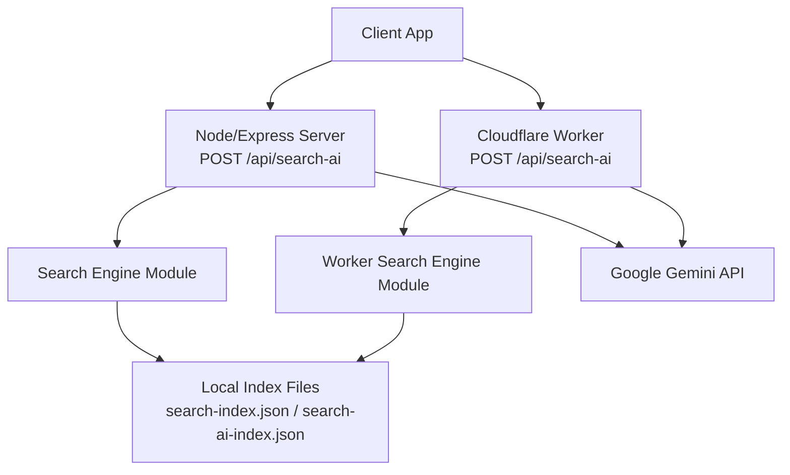
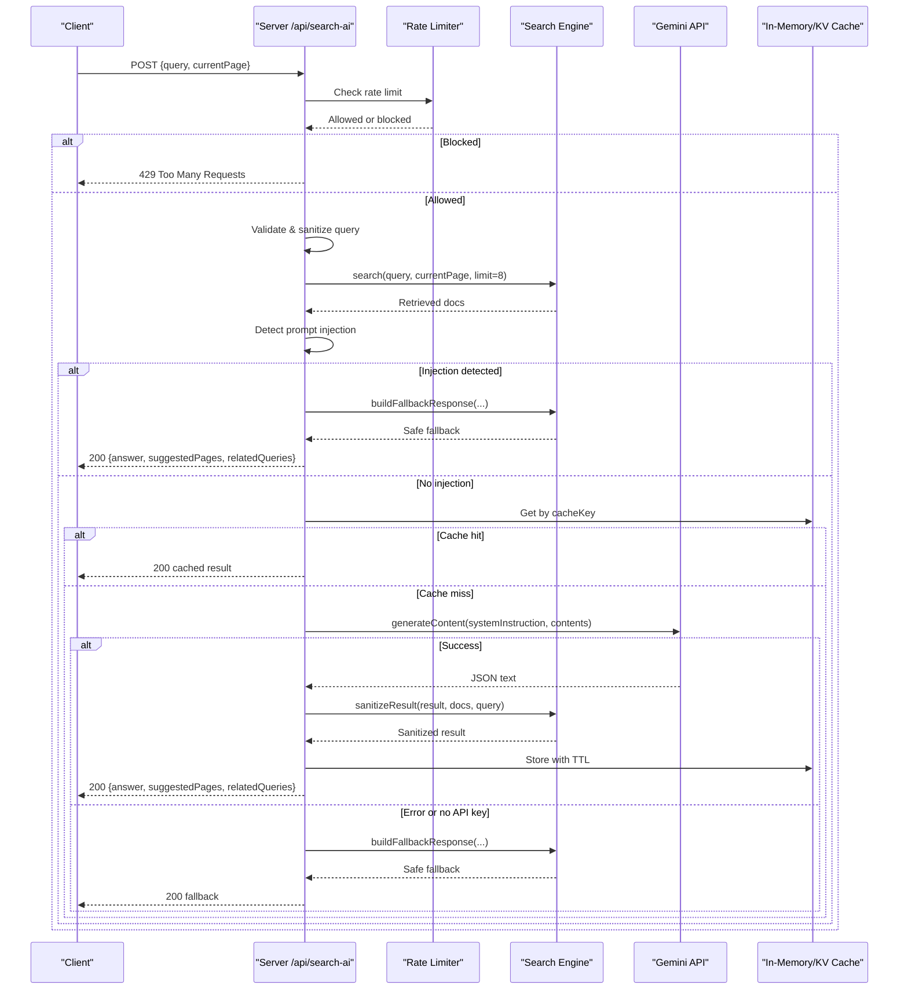
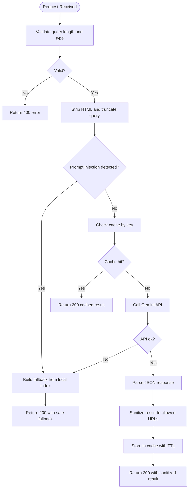
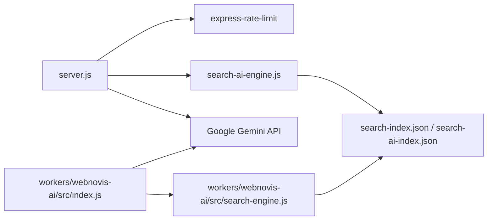

# Search AI Endpoint

<cite>
**Referenced Files in This Document**
- [server.js](file://server.js)
- [search-ai-engine.js](file://search-ai-engine.js)
- [workers/webnovis-ai/src/index.js](file://workers/webnovis-ai/src/index.js)
- [workers/webnovis-ai/src/search-engine.js](file://workers/webnovis-ai/src/search-engine.js)
- [ai-config.js](file://ai-config.js)
- [tests/api-endpoints.test.js](file://tests/api-endpoints.test.js)
</cite>

## Table of Contents
1. [Introduction](#introduction)
2. [Project Structure](#project-structure)
3. [Core Components](#core-components)
4. [Architecture Overview](#architecture-overview)
5. [Detailed Component Analysis](#detailed-component-analysis)
6. [Dependency Analysis](#dependency-analysis)
7. [Performance Considerations](#performance-considerations)
8. [Troubleshooting Guide](#troubleshooting-guide)
9. [Conclusion](#conclusion)

## Introduction
This document provides detailed API documentation for the POST /api/search-ai endpoint, which powers intelligent site search using Google Gemini AI. It covers request/response schemas, authentication and rate limiting, input validation, HTML sanitization, cache key generation, prompt injection detection, in-memory caching with TTL and limits, concurrent request deduplication, fallback mechanisms when Gemini is unavailable, quota monitoring to prevent runaway usage, and security measures against prompt injection attacks.

## Project Structure
The endpoint exists in two runtime implementations:
- Node/Express server implementation (production backend)
- Cloudflare Worker implementation (edge runtime)

Both share a common search engine module that performs corpus retrieval, ranking, prompt construction, fallback response building, and result sanitization.

**Diagram sources**
- [server.js:742-815](file://server.js#L742-L815)
- [workers/webnovis-ai/src/index.js:370-440](file://workers/webnovis-ai/src/index.js#L370-L440)
- [search-ai-engine.js:201-389](file://search-ai-engine.js#L201-L389)
- [workers/webnovis-ai/src/search-engine.js:188-377](file://workers/webnovis-ai/src/search-engine.js#L188-L377)

**Section sources**
- [server.js:742-815](file://server.js#L742-L815)
- [workers/webnovis-ai/src/index.js:370-440](file://workers/webnovis-ai/src/index.js#L370-L440)
- [search-ai-engine.js:201-389](file://search-ai-engine.js#L201-L389)
- [workers/webnovis-ai/src/search-engine.js:188-377](file://workers/webnovis-ai/src/search-engine.js#L188-L377)

## Core Components
- Request validation: query must be a string between 3 and 500 characters.
- Input sanitization: HTML tags are stripped; query length is capped before processing.
- Current page normalization: currentPage is normalized to a safe path used for context and scoring.
- Prompt injection detection: known injection patterns are matched; if detected, a safe fallback response is returned without calling Gemini.
- Rate limiting:
  - Node/Express: 10 requests per minute per IP via express-rate-limit middleware.
  - Cloudflare Worker: configurable KV-backed rate limiter (default 20 per minute per IP).
- Caching:
  - Node/Express: in-memory Map cache with 5-minute TTL and 100-entry limit; oldest entries evicted first.
  - Cloudflare Worker: optional KV-based cache with 5-minute TTL.
- Concurrent request deduplication (Node/Express): identical queries in-flight are coalesced into a single Gemini call.
- Fallback mechanism:
  - If no API key is configured or Gemini fails, a deterministic fallback response is built from local index results.
- Quota monitoring (Node/Express): daily counters per Gemini key with warnings at 80% and hard block at 100%.
- Security:
  - Prompt injection guard prevents malicious prompts from reaching Gemini.
  - Result sanitization restricts suggested pages to allowed URLs from retrieved documents.

**Section sources**
- [server.js:742-815](file://server.js#L742-L815)
- [server.js:129-178](file://server.js#L129-L178)
- [server.js:180-220](file://server.js#L180-L220)
- [server.js:634-641](file://server.js#L634-L641)
- [server.js:646-673](file://server.js#L646-L673)
- [workers/webnovis-ai/src/index.js:370-440](file://workers/webnovis-ai/src/index.js#L370-L440)
- [workers/webnovis-ai/src/index.js:141-151](file://workers/webnovis-ai/src/index.js#L141-L151)
- [workers/webnovis-ai/src/search-engine.js:312-349](file://workers/webnovis-ai/src/search-engine.js#L312-L349)
- [search-ai-engine.js:324-362](file://search-ai-engine.js#L324-L362)

## Architecture Overview
The endpoint processes a user’s search query through a pipeline that validates input, detects prompt injection, retrieves relevant documents from a local index, optionally calls Gemini to generate an answer and suggestions, caches results, and returns a standardized JSON response.

**Diagram sources**
- [server.js:742-815](file://server.js#L742-L815)
- [server.js:676-740](file://server.js#L676-L740)
- [workers/webnovis-ai/src/index.js:370-440](file://workers/webnovis-ai/src/index.js#L370-L440)
- [search-ai-engine.js:232-271](file://search-ai-engine.js#L232-L271)
- [search-ai-engine.js:273-322](file://search-ai-engine.js#L273-L322)
- [search-ai-engine.js:324-362](file://search-ai-engine.js#L324-L362)

## Detailed Component Analysis

### Request Schema
- Method: POST
- Path: /api/search-ai
- Content-Type: application/json
- Body fields:
  - query: string, required, 3–500 characters
  - currentPage: string, optional; normalized to a safe path used for context and scoring

Validation rules:
- Missing or non-string query returns 400 with an error message.
- Query length outside 3–500 returns 400.

**Section sources**
- [server.js:742-749](file://server.js#L742-L749)
- [workers/webnovis-ai/src/index.js:370-377](file://workers/webnovis-ai/src/index.js#L370-L377)
- [tests/api-endpoints.test.js:103-110](file://tests/api-endpoints.test.js#L103-L110)

### Authentication
- The endpoint does not require explicit authentication headers.
- Protection relies on:
  - CORS configuration
  - Rate limiting per IP
  - Prompt injection detection
  - Result sanitization to allowed URLs
- Admin-only endpoints use separate secret-based auth; this endpoint is public but secured by the above controls.

**Section sources**
- [server.js:264-282](file://server.js#L264-L282)
- [server.js:742-815](file://server.js#L742-L815)
- [workers/webnovis-ai/src/index.js:80-116](file://workers/webnovis-ai/src/index.js#L80-L116)

### Rate Limiting
- Node/Express: 10 requests per minute per IP via express-rate-limit middleware.
- Cloudflare Worker: KV-backed rate limiter with default 20 requests per minute per IP.

Behavior:
- Exceeding the limit returns 429 with an error message indicating retry after one minute.

**Section sources**
- [server.js:634-641](file://server.js#L634-L641)
- [workers/webnovis-ai/src/index.js:141-151](file://workers/webnovis-ai/src/index.js#L141-L151)
- [workers/webnovis-ai/src/index.js:379-382](file://workers/webnovis-ai/src/index.js#L379-L382)

### Input Validation and Sanitization
- Query validation: type check and length bounds enforced.
- HTML sanitization: all HTML tags are stripped from the query before further processing.
- Query truncation: sanitized query is truncated to a safe maximum length prior to prompt construction.
- Current page normalization: currentPage is normalized to a canonical path; invalid values default to “/”.

**Section sources**
- [server.js:751-754](file://server.js#L751-L754)
- [server.js:670-673](file://server.js#L670-L673)
- [workers/webnovis-ai/src/index.js:384-385](file://workers/webnovis-ai/src/index.js#L384-L385)

### Cache Key Generation
- Cache key combines normalized query and current page.
- Normalization includes whitespace collapsing and lowercase conversion.
- In Node/Express, keys are stored in an in-memory Map; in the Worker, keys are stored in KV with TTL.

**Section sources**
- [search-ai-engine.js:376-378](file://search-ai-engine.js#L376-L378)
- [workers/webnovis-ai/src/search-engine.js:365-367](file://workers/webnovis-ai/src/search-engine.js#L365-L367)
- [server.js:657-659](file://server.js#L657-L659)

### Prompt Injection Detection
- A comprehensive regex-based guard matches known injection patterns in Italian and English, including leetspeak, indirect extraction, role-play escalation, jailbreak keywords, and system prompt leakage attempts.
- If detected, the endpoint returns a safe fallback response without invoking Gemini.

**Section sources**
- [server.js:129-178](file://server.js#L129-L178)
- [workers/webnovis-ai/src/index.js:35-65](file://workers/webnovis-ai/src/index.js#L35-L65)
- [server.js:756-762](file://server.js#L756-L762)
- [workers/webnovis-ai/src/index.js:388-390](file://workers/webnovis-ai/src/index.js#L388-L390)

### In-Memory Caching System (Node/Express)
- TTL: 5 minutes per entry.
- Max entries: 100; oldest entries are evicted first when capacity is exceeded.
- Deduplication: concurrent identical queries are coalesced into a single Gemini call; subsequent requests wait for the same promise.

Behavior:
- On cache hit within TTL, return cached result immediately.
- On cache miss, execute search and Gemini call, then store result with timestamp.

**Section sources**
- [server.js:646-673](file://server.js#L646-L673)
- [server.js:773-803](file://server.js#L773-L803)

### Fallback Mechanisms
- When no Gemini API key is configured or the API call fails, a deterministic fallback response is generated from local index results.
- Fallback includes:
  - answer: contextual guidance based on intent and top results
  - suggestedPages: up to three relevant pages with relevance scores
  - relatedQueries: derived from top titles

Error handling:
- Network errors, empty responses, and malformed JSON are handled gracefully, returning fallback data.

**Section sources**
- [server.js:764-771](file://server.js#L764-L771)
- [server.js:719-740](file://server.js#L719-L740)
- [search-ai-engine.js:273-322](file://search-ai-engine.js#L273-L322)
- [workers/webnovis-ai/src/index.js:392-439](file://workers/webnovis-ai/src/index.js#L392-L439)

### Quota Monitoring System (Node/Express)
- Daily counters per Gemini key with configurable thresholds:
  - Warn at 80% of daily limit
  - Block at 100% of daily limit
- Prevents runaway API usage by blocking further calls once the daily cap is reached.

**Section sources**
- [server.js:180-220](file://server.js#L180-L220)
- [server.js:680-684](file://server.js#L680-L684)

### Response Schema
- Status codes:
  - 200: success (including fallback responses)
  - 400: invalid query
  - 429: rate limit exceeded
- Response body:
  - answer: string, concise response with inline links where appropriate
  - suggestedPages: array of objects
    - title: string
    - url: string (normalized and allowed)
    - relevance: number (0.25–0.99)
  - relatedQueries: array of strings (up to four)

Examples:
- Successful response with suggested pages and related queries
- Fallback response when no API key or Gemini is unavailable
- Error response for invalid query or rate limit

**Section sources**
- [server.js:742-815](file://server.js#L742-L815)
- [search-ai-engine.js:324-362](file://search-ai-engine.js#L324-L362)
- [workers/webnovis-ai/src/search-engine.js:312-349](file://workers/webnovis-ai/src/search-engine.js#L312-L349)
- [tests/api-endpoints.test.js:103-110](file://tests/api-endpoints.test.js#L103-L110)

### Processing Logic Flowchart

**Diagram sources**
- [server.js:742-815](file://server.js#L742-L815)
- [server.js:676-740](file://server.js#L676-L740)
- [search-ai-engine.js:273-322](file://search-ai-engine.js#L273-L322)
- [search-ai-engine.js:324-362](file://search-ai-engine.js#L324-L362)

## Dependency Analysis
The endpoint depends on:
- Express server and rate limiting middleware (Node/Express)
- Search engine module for corpus retrieval, ranking, prompt construction, fallback, and sanitization
- Google Gemini API for generating answers and suggestions
- Local index files for grounding and fallback content
- Environment variables for API keys and configuration

**Diagram sources**
- [server.js:742-815](file://server.js#L742-L815)
- [search-ai-engine.js:70-117](file://search-ai-engine.js#L70-L117)
- [workers/webnovis-ai/src/index.js:370-440](file://workers/webnovis-ai/src/index.js#L370-L440)
- [workers/webnovis-ai/src/search-engine.js:72-105](file://workers/webnovis-ai/src/search-engine.js#L72-L105)

**Section sources**
- [server.js:742-815](file://server.js#L742-L815)
- [search-ai-engine.js:70-117](file://search-ai-engine.js#L70-L117)
- [workers/webnovis-ai/src/index.js:370-440](file://workers/webnovis-ai/src/index.js#L370-L440)
- [workers/webnovis-ai/src/search-engine.js:72-105](file://workers/webnovis-ai/src/search-engine.js#L72-L105)

## Performance Considerations
- In-memory caching reduces repeated Gemini calls and improves latency for identical queries within TTL.
- Concurrent request deduplication minimizes redundant API calls under load.
- Fallback responses ensure availability even when Gemini is down or unconfigured.
- Prompt injection detection avoids unnecessary API calls for malicious inputs.
- Quota monitoring prevents excessive API usage and potential cost spikes.

[No sources needed since this section provides general guidance]

## Troubleshooting Guide
Common issues and resolutions:
- Invalid query: ensure query is a string between 3 and 500 characters.
- Rate limit exceeded: wait at least one minute before retrying.
- No API key configured: endpoint returns fallback response; configure GEMINI_API_KEY_SEARCH to enable Gemini-powered answers.
- Gemini API errors: endpoint falls back to local index results; check network connectivity and API quotas.
- Prompt injection detected: modify query to avoid known injection patterns.

**Section sources**
- [server.js:742-815](file://server.js#L742-L815)
- [workers/webnovis-ai/src/index.js:370-440](file://workers/webnovis-ai/src/index.js#L370-L440)
- [tests/api-endpoints.test.js:103-110](file://tests/api-endpoints.test.js#L103-L110)

## Conclusion
The POST /api/search-ai endpoint delivers intelligent, secure, and resilient site search powered by Google Gemini AI. It enforces strict input validation, sanitization, and prompt injection detection, while providing robust caching, concurrency control, and fallback mechanisms. Quota monitoring safeguards against runaway usage, and result sanitization ensures only allowed URLs are returned. This design balances performance, reliability, and security for production environments.

[No sources needed since this section summarizes without analyzing specific files]