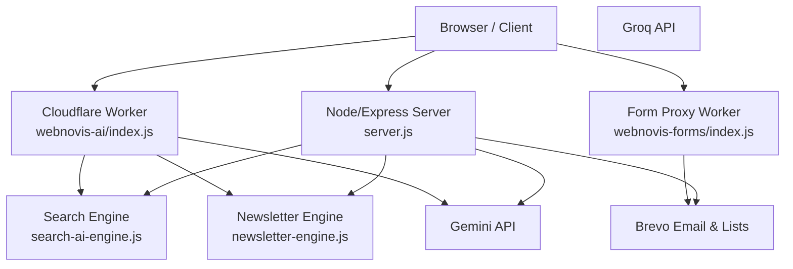
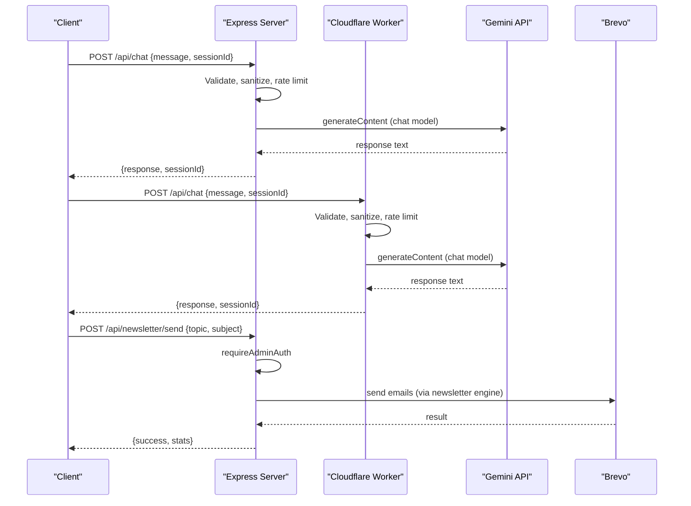
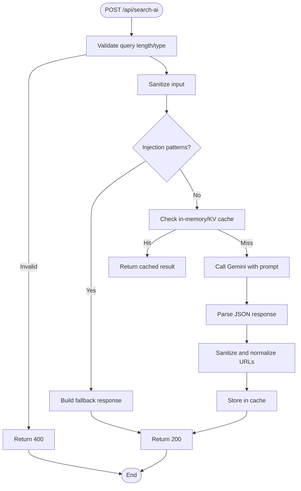
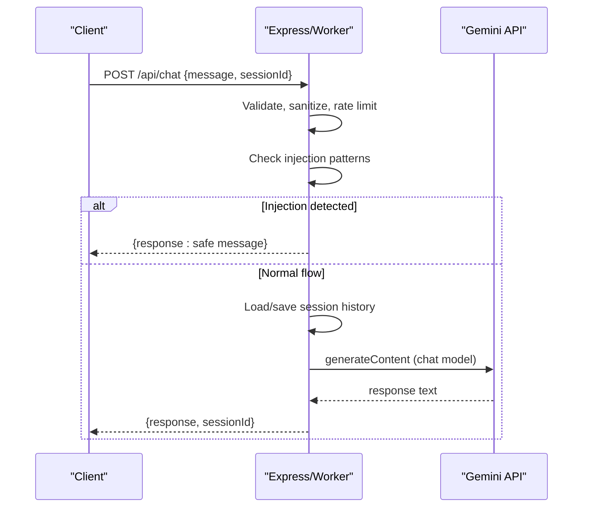
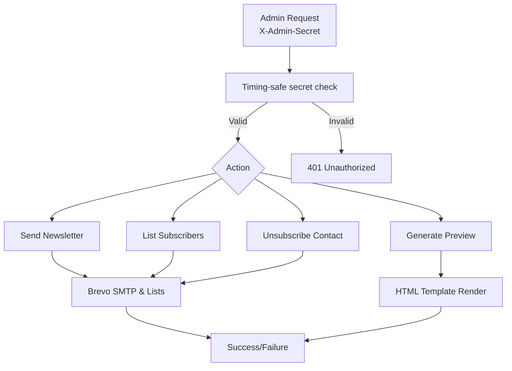
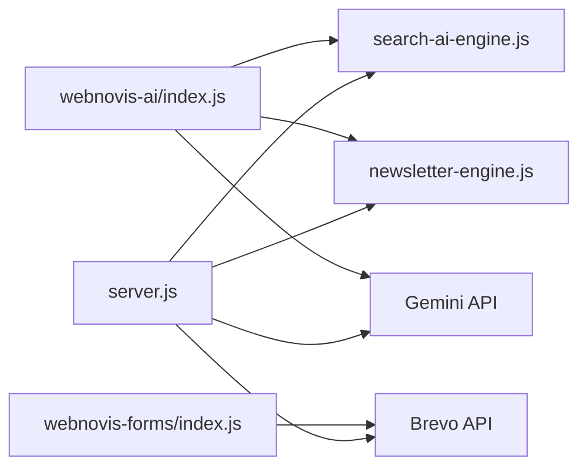

# API Reference

<cite>
**Referenced Files in This Document**
- [server.js](file://server.js)
- [workers/webnovis-ai/src/index.js](file://workers/webnovis-ai/src/index.js)
- [workers/webnovis-forms/src/index.js](file://workers/webnovis-forms/src/index.js)
- [newsletter-engine.js](file://newsletter-engine.js)
- [search-ai-engine.js](file://search-ai-engine.js)
- [config/security-headers.js](file://config/security-headers.js)
- [js/chat.js](file://js/chat.js)
</cite>

## Table of Contents
1. Introduction
2. Project Structure
3. Core Components
4. Architecture Overview
5. Detailed Component Analysis
6. Dependency Analysis
7. Performance Considerations
8. Troubleshooting Guide
9. Conclusion
10. Appendices

## Introduction
This document provides a comprehensive API reference for WebNovis endpoints, including:
- Intelligent search via POST /api/search-ai
- Chatbot conversations via POST /api/chat
- Admin endpoints for newsletter management
- Health and utility endpoints
- Security, rate limiting, authentication, and error handling
- Client implementation guidelines and retry strategies

Where applicable, both the Node/Express server and the Cloudflare Worker implementations are documented.

## Project Structure
WebNovis exposes APIs through two runtime environments:
- Node/Express server (server.js) with middleware for security headers, CORS, rate limiting, admin auth, and integrations
- Cloudflare Worker (workers/webnovis-ai/src/index.js) exposing the same core endpoints with KV-backed sessions and rate limiting
- A form proxy worker (workers/webnovis-forms/src/index.js) for Turnstile verification and forwarding to Web3Forms
- Newsletter engine (newsletter-engine.js) for AI-generated content and email delivery via Brevo
- Search engine (search-ai-engine.js) for indexing and retrieval used by search and chat grounding

**Diagram sources**
- [server.js:224-319](file://server.js#L224-L319)
- [workers/webnovis-ai/src/index.js:508-543](file://workers/webnovis-ai/src/index.js#L508-L543)
- [workers/webnovis-forms/src/index.js:87-171](file://workers/webnovis-forms/src/index.js#L87-L171)
- [newsletter-engine.js:259-349](file://newsletter-engine.js#L259-L349)
- [search-ai-engine.js:201-230](file://search-ai-engine.js#L201-L230)

**Section sources**
- [server.js:224-319](file://server.js#L224-L319)
- [workers/webnovis-ai/src/index.js:508-543](file://workers/webnovis-ai/src/index.js#L508-L543)
- [workers/webnovis-forms/src/index.js:87-171](file://workers/webnovis-forms/src/index.js#L87-L171)
- [newsletter-engine.js:259-349](file://newsletter-engine.js#L259-L349)
- [search-ai-engine.js:201-230](file://search-ai-engine.js#L201-L230)

## Core Components
- Authentication: Admin-only endpoints protected by X-Admin-Secret header using timing-safe comparison
- Rate Limiting: Per-IP limits on chat, search, newsletter, and lead capture
- Security Headers: HSTS, CSP, Referrer-Policy, Permissions-Policy applied globally
- CORS: Configurable allowed origins; non-browser requests handled safely
- Quota Guard: Daily API usage tracking for Gemini keys to prevent runaway spend
- Session Management: In-memory or KV-backed session stores for chat history
- Fallbacks: Graceful fallback responses when external services fail

**Section sources**
- [server.js:75-93](file://server.js#L75-L93)
- [server.js:252-262](file://server.js#L252-L262)
- [server.js:300-319](file://server.js#L300-L319)
- [server.js:180-220](file://server.js#L180-L220)
- [workers/webnovis-ai/src/index.js:141-151](file://workers/webnovis-ai/src/index.js#L141-L151)
- [workers/webnovis-ai/src/index.js:178-196](file://workers/webnovis-ai/src/index.js#L178-L196)

## Architecture Overview
The system supports two deployment targets that expose consistent endpoints:
- Express server routes handle request validation, rate limiting, admin auth, and orchestrate calls to Gemini, Groq, and Brevo
- Cloudflare Worker routes provide similar behavior with KV-backed sessions and rate limiting

**Diagram sources**
- [server.js:1123-1279](file://server.js#L1123-L1279)
- [workers/webnovis-ai/src/index.js:266-368](file://workers/webnovis-ai/src/index.js#L266-L368)
- [server.js:1336-1361](file://server.js#L1336-L1361)
- [newsletter-engine.js:259-349](file://newsletter-engine.js#L259-L349)

## Detailed Component Analysis

### Endpoints Overview
- Health
  - GET /api/health
  - Returns service status and metadata
- Chat
  - POST /api/chat
  - Conversational AI with session persistence and fallbacks
- Search
  - POST /api/search-ai
  - Intelligent site search with grounding and caching
- Newsletter (Admin)
  - POST /api/newsletter/send
  - Generate and send AI-powered newsletters
  - GET /api/newsletter/preview
  - Preview generated newsletter HTML
  - GET /api/newsletter/subscribers
  - List subscribers from Brevo
  - GET /api/newsletter/unsubscribe
  - GDPR-compliant unsubscribe with HMAC token
- Leads
  - POST /api/lead
  - Capture leads with logging and optional Brevo integration
- Chat Lead
  - POST /api/chat-lead
  - Capture high-intent chat interactions
- Form Proxy
  - POST /submit (Worker)
  - Verify Turnstile and forward to Web3Forms

**Section sources**
- [server.js:817-820](file://server.js#L817-L820)
- [server.js:1123-1279](file://server.js#L1123-L1279)
- [server.js:742-815](file://server.js#L742-L815)
- [server.js:1336-1499](file://server.js#L1336-L1499)
- [server.js:899-1022](file://server.js#L899-L1022)
- [server.js:1024-1093](file://server.js#L1024-L1093)
- [workers/webnovis-forms/src/index.js:87-171](file://workers/webnovis-forms/src/index.js#L87-L171)

### POST /api/search-ai
- Purpose: Intelligent search powered by Gemini with grounded retrieval
- Method: POST
- URL: /api/search-ai
- Authentication: None (public), but rate limited per IP
- Rate Limit: 10 requests per minute (Express); 20 per minute (Worker)
- Request Body:
  - query: string, required, min 3 chars, max 500
  - currentPage: string, optional, normalized path
- Response Schema:
  - answer: string
  - suggestedPages: array of { title: string, url: string, relevance: number }
  - relatedQueries: array of strings
- Status Codes:
  - 200: Success
  - 400: Invalid query
  - 429: Rate limited
  - 5xx: Service errors (fallback may still return 200 with safe data)
- Security:
  - Prompt injection guard returns safe fallback
  - Input sanitization strips HTML tags and normalizes
  - Cache key deduplication prevents redundant API calls
- Example Request:
  - Body: { "query": "prezzi servizi web", "currentPage": "/servizi/" }
- Example Response:
  - { "answer": "...", "suggestedPages": [...], "relatedQueries": [...] }

**Diagram sources**
- [server.js:742-815](file://server.js#L742-L815)
- [workers/webnovis-ai/src/index.js:370-440](file://workers/webnovis-ai/src/index.js#L370-L440)
- [search-ai-engine.js:201-230](file://search-ai-engine.js#L201-L230)

**Section sources**
- [server.js:742-815](file://server.js#L742-L815)
- [workers/webnovis-ai/src/index.js:370-440](file://workers/webnovis-ai/src/index.js#L370-L440)
- [search-ai-engine.js:201-230](file://search-ai-engine.js#L201-L230)

### POST /api/chat
- Purpose: Chatbot conversation with session persistence and fallbacks
- Method: POST
- URL: /api/chat
- Authentication: None (public), but rate limited per IP
- Rate Limit: 30 requests per 15 minutes (both Express and Worker)
- Request Body:
  - message: string, required, sanitized and trimmed
  - sessionId: string, optional, server-side session ID
- Response Schema:
  - response: string
  - sessionId: string
  - fallback: boolean (optional, indicates local fallback was used)
- Status Codes:
  - 200: Success
  - 400: Invalid message
  - 429: Rate limited
  - 5xx: Errors (may return fallback with 200 if configured)
- Security:
  - Prompt injection guard returns safe response
  - Server-side session store is source-of-truth for history
  - Quota guard blocks excessive daily API usage
- Example Request:
  - Body: { "message": "Quali sono i vostri servizi?", "sessionId": "abc123" }
- Example Response:
  - { "response": "...", "sessionId": "abc123" }

**Diagram sources**
- [server.js:1123-1279](file://server.js#L1123-L1279)
- [workers/webnovis-ai/src/index.js:266-368](file://workers/webnovis-ai/src/index.js#L266-L368)

**Section sources**
- [server.js:1123-1279](file://server.js#L1123-L1279)
- [workers/webnovis-ai/src/index.js:266-368](file://workers/webnovis-ai/src/index.js#L266-L368)

### Admin Endpoints: Newsletter Management
- POST /api/newsletter/send
  - Requires X-Admin-Secret header
  - Body: { topic: string, subject: string }
  - Sends AI-generated newsletter to all subscribers via Brevo
  - Returns success stats and duration
- GET /api/newsletter/preview
  - Requires X-Admin-Secret header
  - Query: ?topic=...&name=...
  - Returns HTML preview without sending
- GET /api/newsletter/subscribers
  - Requires X-Admin-Secret header
  - Returns subscriber list from Brevo
- GET /api/newsletter/unsubscribe
  - Public endpoint with HMAC token validation
  - Query: ?email=...&token=...
  - Removes subscriber from newsletter list

**Diagram sources**
- [server.js:75-93](file://server.js#L75-L93)
- [server.js:1336-1499](file://server.js#L1336-L1499)
- [newsletter-engine.js:259-349](file://newsletter-engine.js#L259-L349)

**Section sources**
- [server.js:75-93](file://server.js#L75-L93)
- [server.js:1336-1499](file://server.js#L1336-L1499)
- [newsletter-engine.js:259-349](file://newsletter-engine.js#L259-L349)

### Health and Utility Endpoints
- GET /api/health
  - Returns service status and metadata
- GET /api/config (Admin)
  - Requires X-Admin-Secret header
  - Returns safe configuration without sensitive fields

**Section sources**
- [server.js:817-820](file://server.js#L817-L820)
- [server.js:1327-1331](file://server.js#L1327-L1331)

### Form Proxy Endpoint
- POST /submit (Worker)
  - Verifies Turnstile token server-side
  - Forwards form data to Web3Forms
  - Supports JSON and form-encoded payloads
  - Returns success/failure with upstream status

**Section sources**
- [workers/webnovis-forms/src/index.js:87-171](file://workers/webnovis-forms/src/index.js#L87-L171)

## Dependency Analysis
- External Dependencies:
  - Gemini API for chat and search AI
  - Groq API for newsletter content generation
  - Brevo for email delivery and contact lists
  - node-fetch for HTTP requests
  - express-rate-limit for rate limiting
- Internal Dependencies:
  - search-ai-engine for indexing and retrieval
  - newsletter-engine for content generation and email sending
  - config/security-headers for global security policies

**Diagram sources**
- [server.js:224-319](file://server.js#L224-L319)
- [workers/webnovis-ai/src/index.js:508-543](file://workers/webnovis-ai/src/index.js#L508-L543)
- [workers/webnovis-forms/src/index.js:87-171](file://workers/webnovis-forms/src/index.js#L87-L171)
- [newsletter-engine.js:259-349](file://newsletter-engine.js#L259-L349)
- [search-ai-engine.js:201-230](file://search-ai-engine.js#L201-L230)

**Section sources**
- [server.js:224-319](file://server.js#L224-L319)
- [workers/webnovis-ai/src/index.js:508-543](file://workers/webnovis-ai/src/index.js#L508-L543)
- [workers/webnovis-forms/src/index.js:87-171](file://workers/webnovis-forms/src/index.js#L87-L171)
- [newsletter-engine.js:259-349](file://newsletter-engine.js#L259-L349)
- [search-ai-engine.js:201-230](file://search-ai-engine.js#L201-L230)

## Performance Considerations
- Rate Limiting: Prevents abuse and ensures fair usage across clients
- Caching: In-memory and KV-based caching reduces API calls and improves response times
- Compression: Brotli/Gzip compression enabled for text assets
- Quota Guard: Daily API usage tracking prevents runaway costs
- Fallbacks: Graceful degradation when external services fail
- Session Limits: Maximum concurrent sessions and message counts prevent memory exhaustion

[No sources needed since this section provides general guidance]

## Troubleshooting Guide
Common issues and resolutions:
- 401 Unauthorized: Ensure X-Admin-Secret header is set correctly for admin endpoints
- 400 Bad Request: Validate request body schema and field types
- 429 Too Many Requests: Implement exponential backoff and respect retry-after headers
- 5xx Server Errors: Check environment variables (API keys) and external service availability
- CORS Errors: Verify allowed origins configuration
- Rate Limiting: Monitor client IP usage and implement queuing

**Section sources**
- [server.js:75-93](file://server.js#L75-L93)
- [server.js:252-262](file://server.js#L252-L262)
- [workers/webnovis-ai/src/index.js:141-151](file://workers/webnovis-ai/src/index.js#L141-L151)

## Conclusion
WebNovis provides a robust API surface with intelligent search, conversational AI, and administrative capabilities for newsletter management. The system emphasizes security through prompt injection guards, rate limiting, and admin authentication. Both Express and Cloudflare Worker deployments offer consistent endpoints with appropriate fallbacks and performance optimizations.

[No sources needed since this section summarizes without analyzing specific files]

## Appendices

### WebSocket Connections
No WebSocket connections are implemented in the current codebase. Real-time features use HTTP polling and keep-alive mechanisms via the chat widget.

[No sources needed since this section describes absence of WebSocket functionality]

### Client Implementation Guidelines
- Use HTTPS for all API calls
- Implement proper error handling with retries for transient failures
- Respect rate limits and implement exponential backoff
- Store and manage session IDs for chat continuity
- Validate all user inputs before sending to APIs
- Handle CORS properly for browser-based clients

**Section sources**
- [js/chat.js:70-84](file://js/chat.js#L70-L84)
- [config/security-headers.js:40-48](file://config/security-headers.js#L40-L48)

### Security Headers
Global security headers include:
- Strict-Transport-Security
- Content-Security-Policy
- X-Content-Type-Options
- X-Frame-Options
- Referrer-Policy
- Permissions-Policy

**Section sources**
- [config/security-headers.js:40-48](file://config/security-headers.js#L40-L48)

### API Versioning and Deprecation
- Current version: v1 (implicit)
- No explicit versioning strategy implemented
- Deprecation policy: Not defined in current codebase
- Migration guide: Not available

[No sources needed since this section describes absence of versioning strategy]