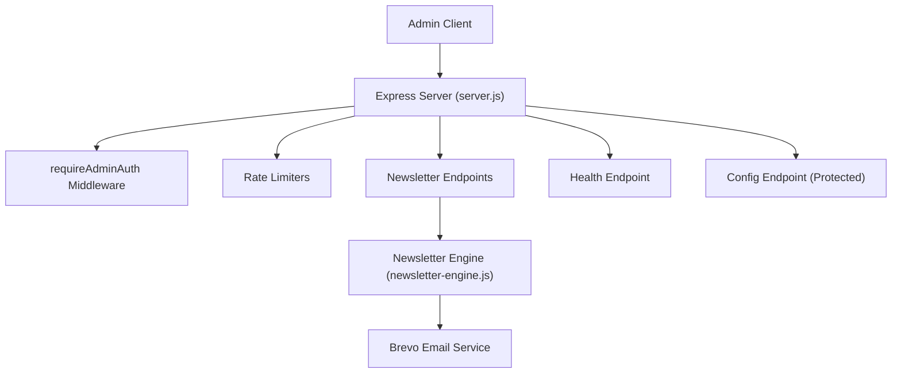
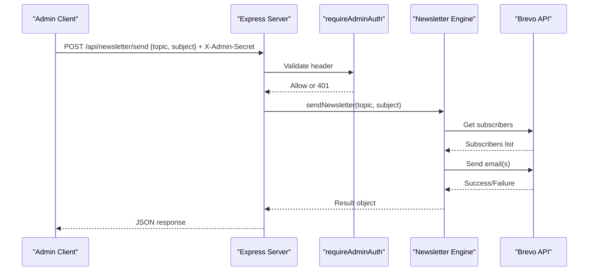
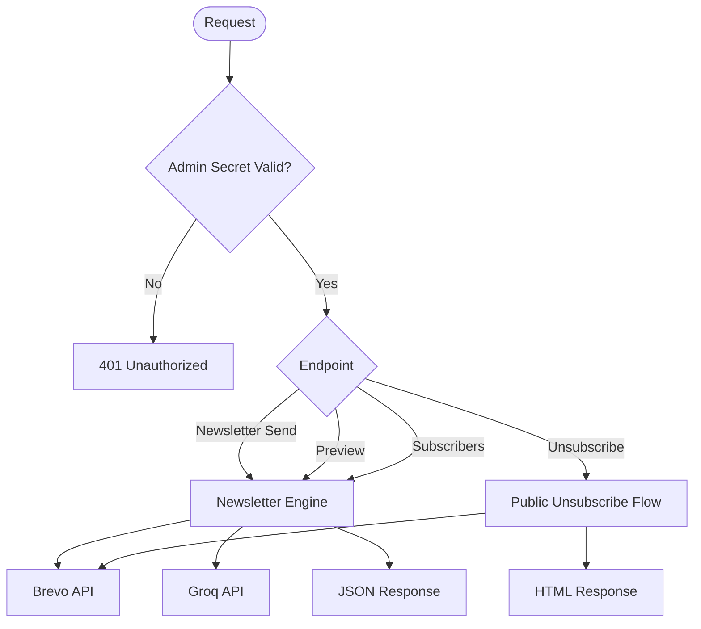

# Admin Endpoints

<cite>
**Referenced Files in This Document**
- [server.js](file://server.js)
- [newsletter-engine.js](file://newsletter-engine.js)
- [security-headers.js](file://config/security-headers.js)
</cite>

## Table of Contents
1. [Introduction](#introduction)
2. [Project Structure](#project-structure)
3. [Core Components](#core-components)
4. [Architecture Overview](#architecture-overview)
5. [Detailed Component Analysis](#detailed-component-analysis)
6. [Dependency Analysis](#dependency-analysis)
7. [Performance Considerations](#performance-considerations)
8. [Troubleshooting Guide](#troubleshooting-guide)
9. [Conclusion](#conclusion)
10. [Appendices](#appendices)

## Introduction
This document provides detailed API documentation for WebNovis administrative endpoints, focusing on newsletter management and related administrative functions. It specifies authentication requirements using the X-Admin-Secret header, request/response schemas, security measures, rate limiting policies, error responses, access control mechanisms, and client implementation guidelines for secure integration.

## Project Structure
The admin functionality is implemented in a Node.js/Express server with modular helpers:
- Authentication middleware protects sensitive endpoints via an admin secret header.
- Newsletter engine handles content generation, subscriber retrieval, and unsubscribe operations.
- Security headers and CORS configuration are centralized to enforce safe defaults.

**Diagram sources**
- [server.js:75-93](file://server.js#L75-L93)
- [server.js:252-282](file://server.js#L252-L282)
- [server.js:818-820](file://server.js#L818-L820)
- [server.js:1328-1331](file://server.js#L1328-L1331)
- [server.js:1339-1409](file://server.js#L1339-L1409)
- [newsletter-engine.js:156-189](file://newsletter-engine.js#L156-L189)
- [newsletter-engine.js:192-227](file://newsletter-engine.js#L192-L227)

**Section sources**
- [server.js:75-93](file://server.js#L75-L93)
- [server.js:252-282](file://server.js#L252-L282)
- [server.js:818-820](file://server.js#L818-L820)
- [server.js:1328-1331](file://server.js#L1328-L1331)
- [server.js:1339-1409](file://server.js#L1339-L1409)
- [newsletter-engine.js:156-189](file://newsletter-engine.js#L156-L189)
- [newsletter-engine.js:192-227](file://newsletter-engine.js#L192-L227)

## Core Components
- Authentication middleware: Validates X-Admin-Secret header using timing-safe comparison against a configured secret.
- Newsletter endpoints: Protected endpoints for sending newsletters, previewing content, listing subscribers, and public unsubscribe handling.
- Health endpoint: Public health check for monitoring.
- Configuration endpoint: Protected endpoint returning sanitized configuration.

Key responsibilities:
- Enforce strict authentication for admin actions.
- Apply rate limiting to prevent abuse.
- Provide GDPR-compliant unsubscribe flows.
- Return structured JSON errors for consistent client handling.

**Section sources**
- [server.js:75-93](file://server.js#L75-L93)
- [server.js:818-820](file://server.js#L818-L820)
- [server.js:1328-1331](file://server.js#L1328-L1331)
- [server.js:1339-1409](file://server.js#L1339-L1409)

## Architecture Overview
The admin API follows a layered architecture:
- Request enters Express server.
- Global middleware applies security headers, CORS, compression, and SEO-related redirects.
- Sensitive routes use requireAdminAuth middleware to validate the X-Admin-Secret header.
- Newsletter endpoints delegate to newsletter-engine for external integrations (Brevo).
- Rate limiters protect endpoints from excessive requests.

**Diagram sources**
- [server.js:75-93](file://server.js#L75-L93)
- [server.js:1339-1361](file://server.js#L1339-L1361)
- [newsletter-engine.js:259-349](file://newsletter-engine.js#L259-L349)
- [newsletter-engine.js:156-189](file://newsletter-engine.js#L156-L189)
- [newsletter-engine.js:192-227](file://newsletter-engine.js#L192-L227)

## Detailed Component Analysis

### Authentication and Access Control
- Header: X-Admin-Secret must be present and match the configured secret.
- Validation uses timing-safe comparison to prevent timing attacks.
- Missing or invalid secret returns 401 Unauthorized.
- If secret is not configured, returns 500 Internal Server Error.

Security notes:
- The header is allowed by CORS configuration.
- Production startup warns if the secret remains placeholder.

**Section sources**
- [server.js:75-93](file://server.js#L75-L93)
- [server.js:265-282](file://server.js#L265-L282)
- [server.js:228-232](file://server.js#L228-L232)

### Newsletter Management Endpoints

#### POST /api/newsletter/send
- Purpose: Generate AI-powered newsletter content and send to all subscribers.
- Authentication: Required (X-Admin-Secret).
- Request body:
  - topic: string — Subject/topic for content generation.
  - subject: string — Email subject line.
- Response:
  - success: boolean
  - skipped: boolean — true when no subscribers exist.
  - subscriberCount: number
  - sent: number
  - failed: number
  - errors: array of objects with email and error message.
  - duration: string — Human-readable duration.
  - edition: string — Edition label based on date.
- Errors:
  - 400: Missing required parameters.
  - 500: Internal error during send.

Example workflow:
- Client sends POST with topic and subject along with X-Admin-Secret.
- Server validates auth, calls newsletter engine.
- Engine retrieves subscribers, generates content, sends emails via Brevo.
- Returns aggregated results.

**Section sources**
- [server.js:1339-1361](file://server.js#L1339-L1361)
- [newsletter-engine.js:259-349](file://newsletter-engine.js#L259-L349)

#### GET /api/newsletter/preview
- Purpose: Preview generated newsletter content without sending.
- Authentication: Required (X-Admin-Secret).
- Query parameters:
  - topic: string — Defaults to a marketing trend topic if omitted.
  - name: string — Sample recipient name; defaults to a sample name.
- Response: HTML preview page showing generated content and metadata.
- Errors:
  - 500: Internal error during content generation.

Usage:
- Useful for administrators to review tone and structure before dispatch.

**Section sources**
- [server.js:1365-1399](file://server.js#L1365-L1399)

#### GET /api/newsletter/subscribers
- Purpose: Retrieve current subscriber list from Brevo.
- Authentication: Required (X-Admin-Secret).
- Response:
  - count: number
  - contacts: array of objects with email and name fields.
- Errors:
  - 500: Internal error retrieving subscribers.

Bulk operations:
- Use this endpoint to audit or export subscriber data for offline processing.
- Combine with external tools to perform bulk updates or segmentation outside the system.

**Section sources**
- [server.js:1402-1409](file://server.js#L1402-L1409)
- [newsletter-engine.js:156-189](file://newsletter-engine.js#L156-L189)

#### GET /api/newsletter/unsubscribe
- Purpose: GDPR-compliant unsubscribe link handler included in emails.
- Authentication: Not required (public), but requires valid HMAC token.
- Query parameters:
  - email: string — Subscriber email.
  - token: string — HMAC token derived from email and admin secret.
- Behavior:
  - Validates email format.
  - Verifies token integrity using timing-safe comparison.
  - Removes subscriber from newsletter list via Brevo.
  - Returns user-friendly HTML confirmation or error pages.
- Errors:
  - 400: Invalid email.
  - 403: Missing or invalid token.
  - 503: Service unavailable due to misconfiguration.
  - 500: Internal error during unsubscribe.

Security:
- Token prevents mass unsubscribes and tampering.
- Uses HMAC with admin secret to bind token to email.

**Section sources**
- [server.js:1412-1498](file://server.js#L1412-L1498)
- [newsletter-engine.js:352-385](file://newsletter-engine.js#L352-L385)

### System Monitoring Endpoints

#### GET /api/health
- Purpose: Health check for uptime monitoring and load balancers.
- Authentication: Not required.
- Response:
  - status: string — "ok"
  - message: string — Confirmation message.

Usage:
- Integrate with monitoring services to verify service availability.

**Section sources**
- [server.js:818-820](file://server.js#L818-L820)

#### GET /api/config
- Purpose: Return sanitized configuration for administrative dashboards.
- Authentication: Required (X-Admin-Secret).
- Response:
  - Excludes sensitive instructions; returns safe configuration sections.
- Errors:
  - 401: Missing or invalid admin secret.

Use cases:
- Display non-sensitive settings in admin UIs.
- Avoid exposing secrets or internal prompts.

**Section sources**
- [server.js:1328-1331](file://server.js#L1328-L1331)

### Content Administration Notes
- There are no explicit content creation/update endpoints exposed in the analyzed code.
- Administrative workflows primarily focus on newsletter dispatch and subscriber management.
- For content changes, consider integrating with existing build pipelines or CMS tools outside these endpoints.

[No sources needed since this section summarizes observed behavior without analyzing specific files]

## Dependency Analysis
- Server depends on:
  - express-rate-limit for rate limiting.
  - compression for response compression.
  - cors for cross-origin policy.
  - crypto for timing-safe comparisons and HMAC tokens.
  - node-fetch for HTTP requests to external services.
- Newsletter engine depends on:
  - Groq API for content generation.
  - Brevo API for subscriber management and email delivery.

**Diagram sources**
- [server.js:75-93](file://server.js#L75-L93)
- [server.js:1339-1409](file://server.js#L1339-L1409)
- [newsletter-engine.js:97-136](file://newsletter-engine.js#L97-L136)
- [newsletter-engine.js:156-189](file://newsletter-engine.js#L156-L189)
- [newsletter-engine.js:192-227](file://newsletter-engine.js#L192-L227)
- [newsletter-engine.js:352-385](file://newsletter-engine.js#L352-L385)

**Section sources**
- [server.js:95-107](file://server.js#L95-L107)
- [server.js:234-249](file://server.js#L234-L249)
- [server.js:265-282](file://server.js#L265-L282)
- [newsletter-engine.js:97-136](file://newsletter-engine.js#L97-L136)
- [newsletter-engine.js:156-189](file://newsletter-engine.js#L156-L189)
- [newsletter-engine.js:192-227](file://newsletter-engine.js#L192-L227)
- [newsletter-engine.js:352-385](file://newsletter-engine.js#L352-L385)

## Performance Considerations
- Rate limiting:
  - Chat API: 30 requests per 15 minutes per IP.
  - Newsletter API: 10 requests per 15 minutes per IP.
  - Lead capture: 5 requests per 15 minutes per IP.
  - Search AI: 10 requests per minute per IP.
- Compression: Brotli/Gzip enabled to reduce payload sizes.
- Quota tracking: Daily usage limits for Gemini APIs with warnings at thresholds.
- Caching: In-memory cache for search AI results with TTL and deduplication of concurrent queries.

Recommendations:
- Ensure express-rate-limit is installed in production to enforce limits.
- Monitor quota logs to avoid exceeding daily API caps.
- Use preview endpoint to validate content before bulk sends.

**Section sources**
- [server.js:252-262](file://server.js#L252-L262)
- [server.js:625-641](file://server.js#L625-L641)
- [server.js:890-897](file://server.js#L890-L897)
- [server.js:180-220](file://server.js#L180-L220)
- [server.js:646-673](file://server.js#L646-L673)

## Troubleshooting Guide
Common issues and resolutions:
- Missing or incorrect X-Admin-Secret:
  - Verify environment variable configuration.
  - Ensure header name matches exactly (case-insensitive in HTTP, but ensure correct casing in client).
- 500 Internal Server Error on protected endpoints:
  - Indicates missing or placeholder admin secret; configure NEWSLETTER_ADMIN_SECRET.
- 401 Unauthorized:
  - Secret mismatch or missing header; recheck client implementation.
- 400 Bad Request:
  - Missing or invalid parameters; validate request schema.
- 403 Forbidden:
  - Invalid unsubscribe token; ensure token generation uses correct secret and email.
- 503 Service Unavailable:
  - Unsubscribe flow misconfigured; check environment variables.

Operational tips:
- Use /api/health to confirm service readiness.
- Review logs for quota warnings and API errors.
- Test preview endpoint before sending newsletters.

**Section sources**
- [server.js:75-93](file://server.js#L75-L93)
- [server.js:228-232](file://server.js#L228-L232)
- [server.js:1412-1498](file://server.js#L1412-L1498)
- [server.js:818-820](file://server.js#L818-L820)

## Conclusion
WebNovis admin endpoints provide secure, rate-limited access to newsletter management and system monitoring. Authentication via X-Admin-Secret ensures only authorized clients can perform administrative actions. The newsletter engine integrates with external services for content generation and email delivery while maintaining GDPR compliance through unsubscribe flows. Clients should implement robust error handling, respect rate limits, and securely manage secrets.

[No sources needed since this section summarizes without analyzing specific files]

## Appendices

### Authentication Requirements
- Header: X-Admin-Secret
- Validation: Timing-safe comparison against configured secret
- CORS: Allowed header for cross-origin admin requests

**Section sources**
- [server.js:75-93](file://server.js#L75-L93)
- [server.js:265-282](file://server.js#L265-L282)

### Request/Response Schemas

#### POST /api/newsletter/send
- Request:
  - Body: { topic: string, subject: string }
  - Headers: X-Admin-Secret: string
- Response:
  - success: boolean
  - skipped: boolean
  - subscriberCount: number
  - sent: number
  - failed: number
  - errors: [{ email: string, error: string }]
  - duration: string
  - edition: string

**Section sources**
- [server.js:1339-1361](file://server.js#L1339-L1361)
- [newsletter-engine.js:259-349](file://newsletter-engine.js#L259-L349)

#### GET /api/newsletter/preview
- Query:
  - topic: string (optional)
  - name: string (optional)
- Headers: X-Admin-Secret: string
- Response: HTML preview page

**Section sources**
- [server.js:1365-1399](file://server.js#L1365-L1399)

#### GET /api/newsletter/subscribers
- Headers: X-Admin-Secret: string
- Response:
  - count: number
  - contacts: [{ email: string, name: string }]

**Section sources**
- [server.js:1402-1409](file://server.js#L1402-L1409)
- [newsletter-engine.js:156-189](file://newsletter-engine.js#L156-L189)

#### GET /api/newsletter/unsubscribe
- Query:
  - email: string
  - token: string
- Response: HTML confirmation or error page

**Section sources**
- [server.js:1412-1498](file://server.js#L1412-L1498)
- [newsletter-engine.js:352-385](file://newsletter-engine.js#L352-L385)

#### GET /api/health
- Response:
  - status: string
  - message: string

**Section sources**
- [server.js:818-820](file://server.js#L818-L820)

#### GET /api/config
- Headers: X-Admin-Secret: string
- Response: Sanitized configuration object

**Section sources**
- [server.js:1328-1331](file://server.js#L1328-L1331)

### Security Measures
- Timing-safe secret comparison to prevent timing attacks.
- HMAC-based unsubscribe tokens bound to email and secret.
- Input sanitization to prevent injection and XSS.
- Rate limiting to mitigate abuse.
- Security headers applied globally.

**Section sources**
- [server.js:75-93](file://server.js#L75-L93)
- [server.js:1412-1498](file://server.js#L1412-L1498)
- [config/security-headers.js:40-48](file://config/security-headers.js#L40-L48)

### Rate Limiting Policies
- Chat API: 30 requests per 15 minutes per IP.
- Newsletter API: 10 requests per 15 minutes per IP.
- Lead capture: 5 requests per 15 minutes per IP.
- Search AI: 10 requests per minute per IP.

**Section sources**
- [server.js:252-262](file://server.js#L252-L262)
- [server.js:625-641](file://server.js#L625-L641)
- [server.js:890-897](file://server.js#L890-L897)

### Client Implementation Guidelines
- Always include X-Admin-Secret header for protected endpoints.
- Handle 401/403 errors gracefully and retry with backoff.
- Respect rate limits; implement exponential backoff on 429 responses.
- Validate request payloads before sending.
- Use preview endpoint to test content before bulk sends.
- Store secrets securely in environment variables; never hardcode.

**Section sources**
- [server.js:75-93](file://server.js#L75-L93)
- [server.js:252-262](file://server.js#L252-L262)
- [server.js:1365-1399](file://server.js#L1365-L1399)