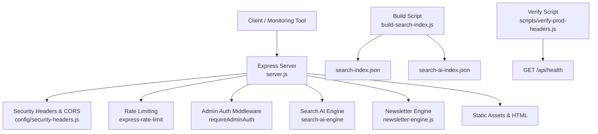
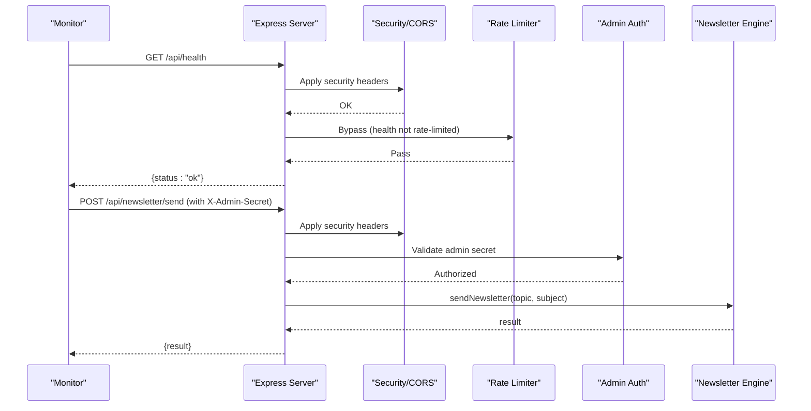
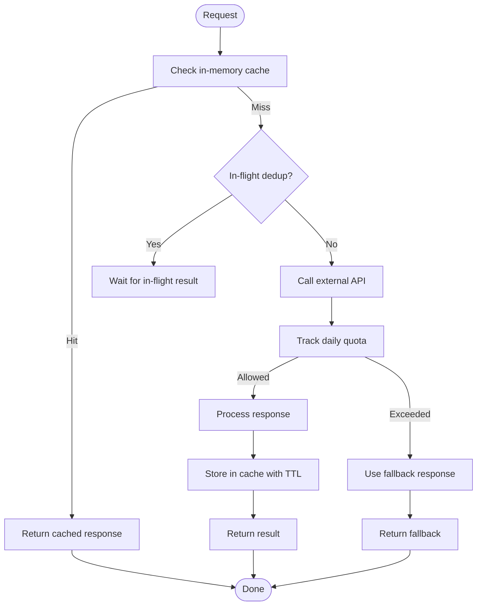
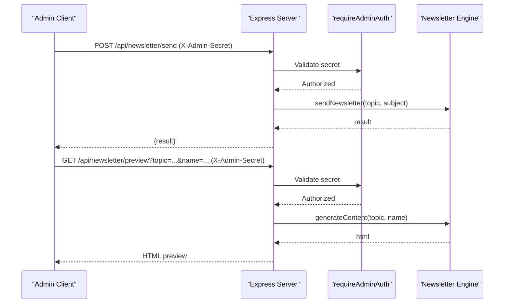
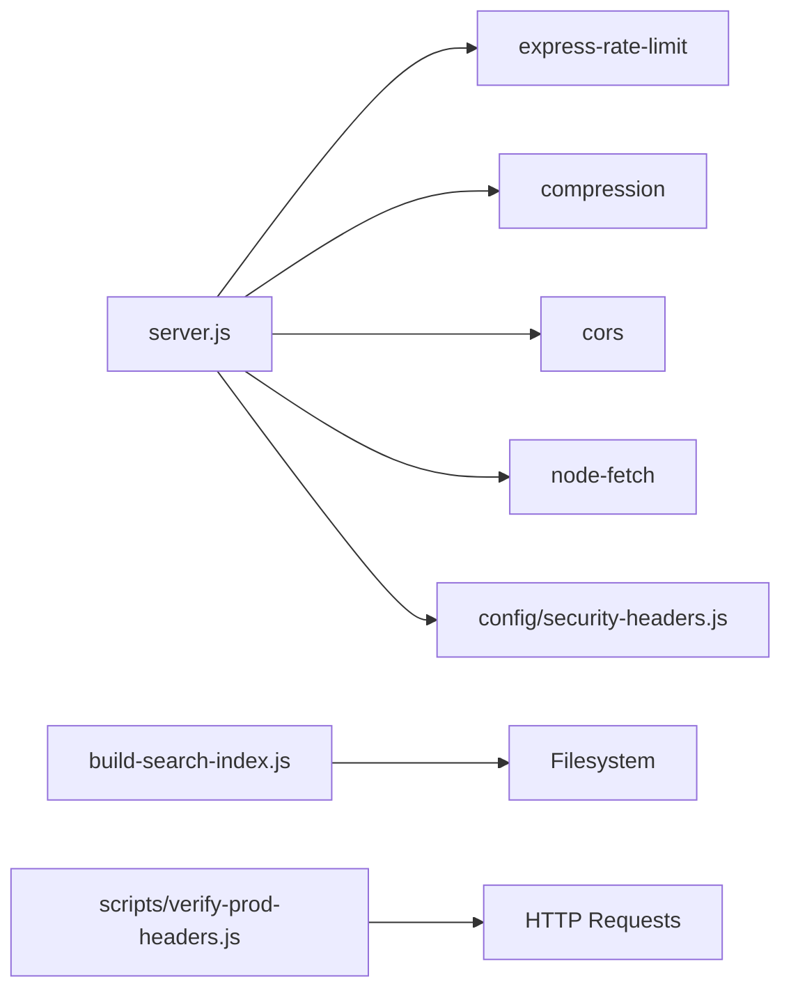

# Utility Endpoints

<cite>
**Referenced Files in This Document**
- [server.js](file://server.js)
- [package.json](file://package.json)
- [build-search-index.js](file://build-search-index.js)
- [newsletter-engine.js](file://newsletter-engine.js)
- [config/security-headers.js](file://config/security-headers.js)
- [scripts/verify-prod-headers.js](file://scripts/verify-prod-headers.js)
- [tests/api-endpoints.test.js](file://tests/api-endpoints.test.js)
</cite>

## Table of Contents
1. [Introduction](#introduction)
2. [Project Structure](#project-structure)
3. [Core Components](#core-components)
4. [Architecture Overview](#architecture-overview)
5. [Detailed Component Analysis](#detailed-component-analysis)
6. [Dependency Analysis](#dependency-analysis)
7. [Performance Considerations](#performance-considerations)
8. [Troubleshooting Guide](#troubleshooting-guide)
9. [Conclusion](#conclusion)
10. [Appendices](#appendices)

## Introduction
This document provides API documentation for WebNovis utility endpoints focused on health checks, system status monitoring, and maintenance utilities. It covers:
- Health check endpoint
- Search index rebuilding (build-time utility)
- Cache management patterns (in-memory caches and static asset caching)
- System diagnostics and verification scripts
- Rate limiting, authentication requirements, and error handling patterns
- Examples of monitoring integrations and automated maintenance workflows

The goal is to enable operators and CI systems to monitor service health, manage search indexing, and perform safe maintenance operations with clear request/response contracts and security considerations.

## Project Structure
The server exposes a small set of utility endpoints under /api, alongside build-time utilities that generate artifacts consumed by the runtime. Key files:
- server.js: Express application defining routes, middleware, rate limiters, admin auth, and utility endpoints
- build-search-index.js: Build script generating public and AI search indexes
- newsletter-engine.js: Newsletter generation and delivery engine used by protected endpoints
- config/security-headers.js: Shared security headers and CORS configuration
- scripts/verify-prod-headers.js: Production header verification including /api/health checks
- tests/api-endpoints.test.js: Smoke tests that start the server and validate /api/health and other behaviors

**Diagram sources**
- [server.js:234-306](file://server.js#L234-L306)
- [config/security-headers.js:40-62](file://config/security-headers.js#L40-L62)
- [build-search-index.js:1-325](file://build-search-index.js#L1-L325)
- [scripts/verify-prod-headers.js:34-58](file://scripts/verify-prod-headers.js#L34-L58)

**Section sources**
- [server.js:234-306](file://server.js#L234-L306)
- [package.json:6-58](file://package.json#L6-L58)

## Core Components
- Health Check: GET /api/health returns a simple JSON status for liveness probes.
- Search Index Rebuilding: Build-time script generates search-index.json and optionally search-ai-index.json.
- Cache Management: In-memory caches for search results and sessions; static assets use cache-control policies.
- Diagnostics: Production header verifier includes /api/health as an API target for validation.
- Maintenance Utilities: Protected newsletter endpoints for sending and previewing content, listing subscribers, and unsubscribe handling.

**Section sources**
- [server.js:817-820](file://server.js#L817-L820)
- [build-search-index.js:1-325](file://build-search-index.js#L1-L325)
- [scripts/verify-prod-headers.js:34-58](file://scripts/verify-prod-headers.js#L34-L58)

## Architecture Overview
The server applies shared security headers, CORS, compression, and rate limiting before routing requests. Utility endpoints are either public (health) or protected via admin secret. The search AI flow uses in-memory caching and quota tracking to reduce external API usage. Build-time scripts produce artifacts consumed at runtime.

**Diagram sources**
- [server.js:234-306](file://server.js#L234-L306)
- [server.js:75-93](file://server.js#L75-L93)
- [server.js:1336-1361](file://server.js#L1336-L1361)
- [newsletter-engine.js:1-200](file://newsletter-engine.js#L1-L200)

## Detailed Component Analysis

### Health Check Endpoint
- Method: GET
- Path: /api/health
- Authentication: None
- Rate Limiting: Not applied to this endpoint
- Response:
  - 200 OK: JSON object with status and message fields indicating server liveness
- Usage scenarios:
  - Kubernetes liveness/readiness probes
  - Uptime monitors and CI smoke tests
- Error handling:
  - If the server process is running, returns 200; otherwise unreachable
- Notes:
  - API paths receive noindex, nofollow robots directives via middleware

**Section sources**
- [server.js:817-820](file://server.js#L817-L820)
- [server.js:308-319](file://server.js#L308-L319)
- [scripts/verify-prod-headers.js:34-58](file://scripts/verify-prod-headers.js#L34-L58)
- [tests/api-endpoints.test.js:42-54](file://tests/api-endpoints.test.js#L42-L54)

### Search Index Rebuilding (Build-Time Utility)
- Purpose: Generate lightweight public index for client-side search and a richer private corpus for server-side AI retrieval
- Invocation:
  - npm run build:search-index
  - npm run build:search-index:dist (public-only mode excludes private AI corpus from artifact)
- Outputs:
  - search-index.json: Public index used by frontend search
  - search-ai-index.json: Private AI corpus (excluded when using public-only mode)
- Behavior:
  - Scans HTML files, extracts metadata, headings, snippets, and classifies page types
  - Respects noindex directives and governance rules
  - Writes JSON artifacts to configured publish directory
- Usage scenarios:
  - CI pipeline step before deployment
  - Scheduled rebuilds to keep search up-to-date
- Error handling:
  - Skips excluded files and directories; logs counts of built entries

**Section sources**
- [package.json:12-13](file://package.json#L12-L13)
- [build-search-index.js:1-325](file://build-search-index.js#L1-L325)

### Cache Management Patterns
- In-Memory Search Result Cache:
  - TTL-based cache for search AI responses to reduce external API calls
  - Deduplication of concurrent identical queries to avoid redundant work
  - Pruning strategy evicts oldest entries beyond a maximum size
- Session Store:
  - In-memory map storing chat session history with max messages and concurrency limits
  - Periodic cleanup removes expired sessions
- Static Asset Caching:
  - Production sets long-lived cache headers for CSS/JS/Img/fonts
  - HTML pages use shorter cache with stale-while-revalidate
  - CDN-specific headers set in production
- Quota Tracking:
  - Daily counters per API key with warning thresholds and hard caps to prevent runaway spend

**Diagram sources**
- [server.js:646-740](file://server.js#L646-L740)
- [server.js:584-619](file://server.js#L584-L619)
- [server.js:180-220](file://server.js#L180-L220)

**Section sources**
- [server.js:646-740](file://server.js#L646-L740)
- [server.js:584-619](file://server.js#L584-L619)
- [server.js:180-220](file://server.js#L180-L220)

### System Diagnostics and Verification
- Production Header Verifier:
  - Validates site and API endpoints, including /api/health
  - Checks expected status codes and headers such as X-Robots-Tag
- Usage:
  - Run as part of CI or pre-deploy checks to ensure correct headers and redirects
- Output:
  - Logs OK/WARN for each target; failures reported for mismatches

**Section sources**
- [scripts/verify-prod-headers.js:34-58](file://scripts/verify-prod-headers.js#L34-L58)
- [scripts/verify-prod-headers.js:99-133](file://scripts/verify-prod-headers.js#L99-L133)

### Maintenance Utilities (Protected)
- Newsletter Send:
  - Method: POST
  - Path: /api/newsletter/send
  - Authentication: Requires X-Admin-Secret header matching NEWSLETTER_ADMIN_SECRET
  - Request body: topic, subject
  - Response: result object from newsletter engine
  - Use case: Trigger AI-generated newsletter dispatch
- Newsletter Preview:
  - Method: GET
  - Path: /api/newsletter/preview
  - Query params: topic, name
  - Authentication: Requires X-Admin-Secret
  - Response: HTML preview of generated email content
- Subscribers List:
  - Method: GET
  - Path: /api/newsletter/subscribers
  - Authentication: Requires X-Admin-Secret
  - Response: subscriber count and contact list
- Unsubscribe:
  - Method: GET
  - Path: /api/newsletter/unsubscribe
  - Query params: email, token (HMAC-signed)
  - Response: HTML confirmation or error pages
  - Security: Token validation prevents mass unsubscribes

**Diagram sources**
- [server.js:75-93](file://server.js#L75-L93)
- [server.js:1336-1399](file://server.js#L1336-L1399)
- [newsletter-engine.js:1-200](file://newsletter-engine.js#L1-L200)

**Section sources**
- [server.js:75-93](file://server.js#L75-L93)
- [server.js:1336-1399](file://server.js#L1336-L1399)
- [newsletter-engine.js:1-200](file://newsletter-engine.js#L1-L200)

## Dependency Analysis
- Server depends on:
  - express-rate-limit for rate limiting
  - compression for response compression
  - cors for cross-origin policy
  - dotenv for environment variables
  - node-fetch for HTTP calls
  - nunjucks templating
- Configuration:
  - Security headers and CORS origins centralized in config/security-headers.js
  - Environment variables control API keys, secrets, and behavior
- Build-time dependencies:
  - build-search-index.js reads HTML files and writes JSON artifacts
  - verify-prod-headers.js validates live endpoints and headers

**Diagram sources**
- [package.json:69-77](file://package.json#L69-L77)
- [config/security-headers.js:40-62](file://config/security-headers.js#L40-L62)
- [build-search-index.js:1-325](file://build-search-index.js#L1-L325)
- [scripts/verify-prod-headers.js:34-58](file://scripts/verify-prod-headers.js#L34-L58)

**Section sources**
- [package.json:69-77](file://package.json#L69-L77)
- [config/security-headers.js:40-62](file://config/security-headers.js#L40-L62)

## Performance Considerations
- Compression enabled reduces transfer sizes significantly for text assets
- Static assets use long cache lifetimes in production to minimize bandwidth and latency
- HTML pages use short cache with stale-while-revalidate to balance freshness and performance
- In-memory caches reduce external API calls and improve response times for repeated queries
- Quota tracking prevents excessive spending and ensures graceful fallbacks when limits are reached
- Rate limiting protects endpoints from abuse while allowing legitimate traffic

[No sources needed since this section provides general guidance]

## Troubleshooting Guide
- Health Check Failures:
  - Ensure server process is running and listening on configured port
  - Verify network reachability and firewall rules
  - Confirm that /api/health is not blocked by proxies or WAFs
- Search Index Issues:
  - Rebuild indexes using provided npm scripts
  - Validate that source HTML files are present and not excluded
  - Check for noindex directives that may exclude pages from indices
- Newsletter Errors:
  - Verify required environment variables (GROQ_API_KEY, BREVO_API_KEY, NEWSLETTER_ADMIN_SECRET)
  - Confirm admin secret matches X-Admin-Secret header
  - Review logs for API errors from Groq or Brevo
- Header Verification:
  - Use verify-prod-headers script to detect mismatches in security headers
  - Ensure production deployments apply expected headers and redirects

**Section sources**
- [server.js:817-820](file://server.js#L817-L820)
- [build-search-index.js:1-325](file://build-search-index.js#L1-L325)
- [newsletter-engine.js:1-200](file://newsletter-engine.js#L1-L200)
- [scripts/verify-prod-headers.js:99-133](file://scripts/verify-prod-headers.js#L99-L133)

## Conclusion
WebNovis provides a minimal but robust set of utility endpoints for operational needs:
- Health checks for liveness and uptime monitoring
- Build-time search index generation to keep search accurate
- In-memory caching and quota controls to optimize performance and cost
- Protected maintenance endpoints for newsletter operations
- Diagnostics scripts to validate production configurations

Operators should integrate /api/health into monitoring systems, schedule search index rebuilds in CI, and secure maintenance endpoints with strong admin secrets.

[No sources needed since this section summarizes without analyzing specific files]

## Appendices

### Rate Limiting Summary
- Chat API: 30 requests per 15 minutes per IP
- Newsletter subscription: 10 requests per 15 minutes per IP
- Lead capture: 5 requests per 15 minutes per IP
- Search AI: 10 requests per minute per IP
- Health check: No rate limiting applied

**Section sources**
- [server.js:252-262](file://server.js#L252-L262)
- [server.js:625-641](file://server.js#L625-L641)
- [server.js:890-897](file://server.js#L890-L897)

### Authentication Requirements
- Admin endpoints require X-Admin-Secret header matching NEWSLETTER_ADMIN_SECRET
- Unauthorized or invalid secret returns 401
- Misconfiguration returns 500 during startup checks in production

**Section sources**
- [server.js:75-93](file://server.js#L75-L93)
- [server.js:228-232](file://server.js#L228-L232)

### Error Handling Patterns
- Validation errors return 400 with descriptive messages
- External API failures trigger fallback responses where implemented
- Quota exceeded results in local fallback responses to maintain availability
- Generic 500 responses for unexpected server errors

**Section sources**
- [server.js:742-815](file://server.js#L742-L815)
- [server.js:1126-1279](file://server.js#L1126-L1279)
- [server.js:1336-1361](file://server.js#L1336-L1361)

### Monitoring Integrations and Automated Workflows
- Liveness probe: Poll GET /api/health periodically
- CI smoke test: Start server, wait for health readiness, then run endpoint validations
- Pre-deploy checks: Run verify-prod-headers to ensure correct headers and redirects
- Scheduled tasks: Use CI or external cron to call protected newsletter endpoints with admin secret

**Section sources**
- [tests/api-endpoints.test.js:42-54](file://tests/api-endpoints.test.js#L42-L54)
- [scripts/verify-prod-headers.js:34-58](file://scripts/verify-prod-headers.js#L34-L58)
- [server.js:1515-1567](file://server.js#L1515-L1567)