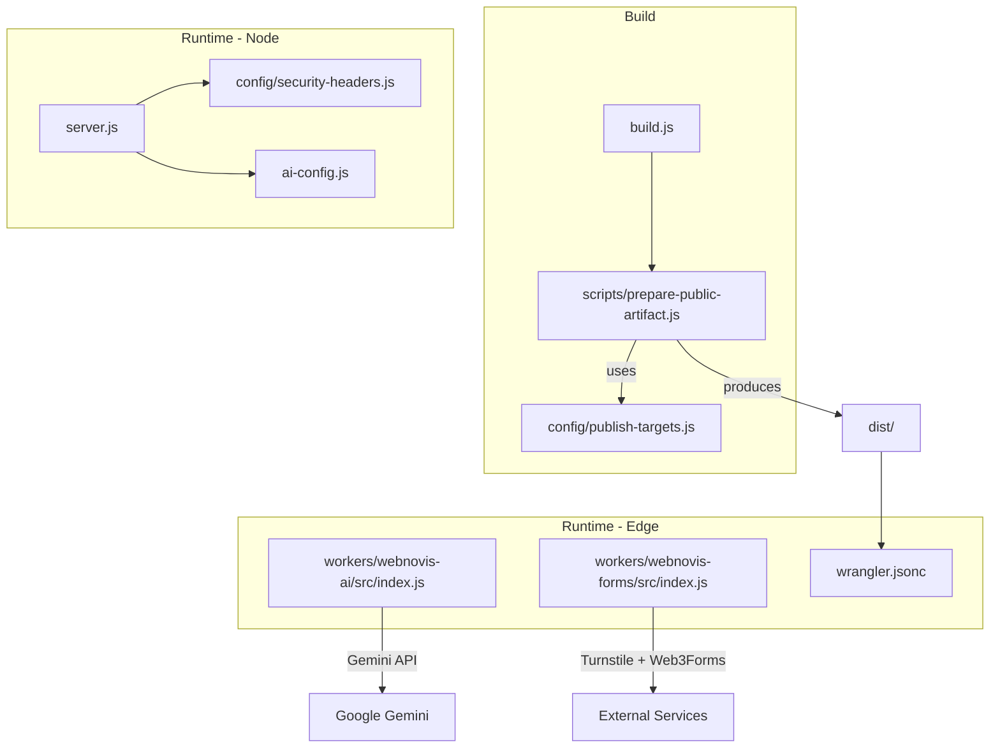
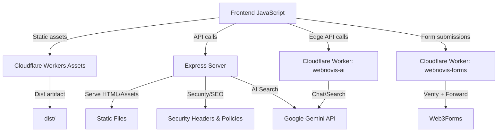
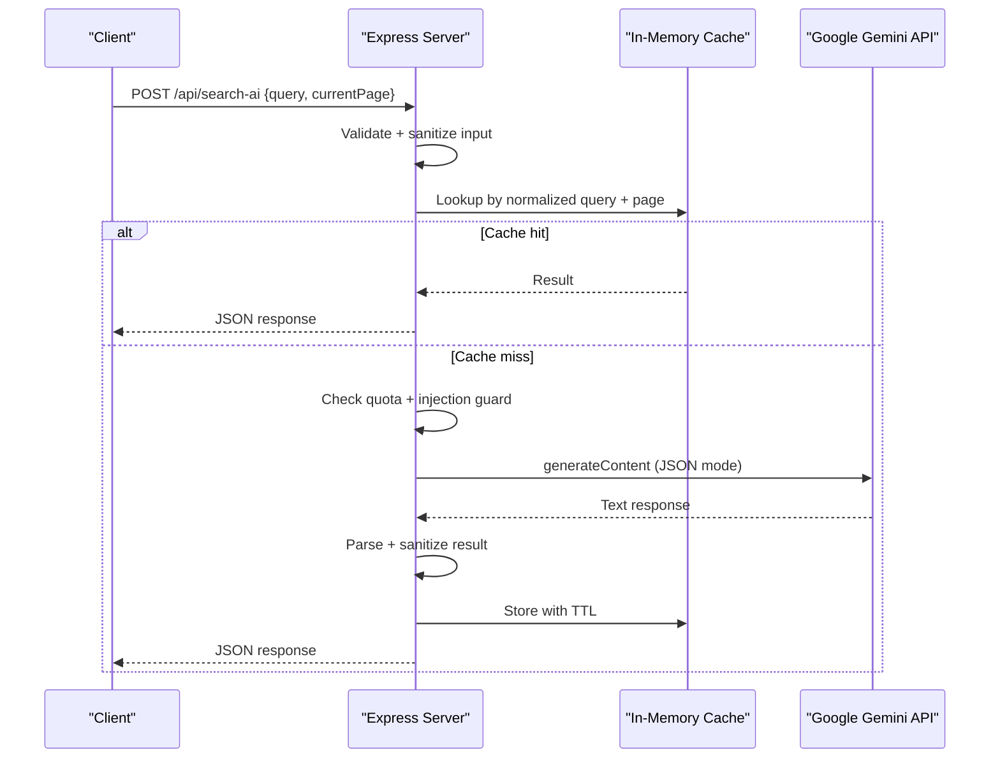
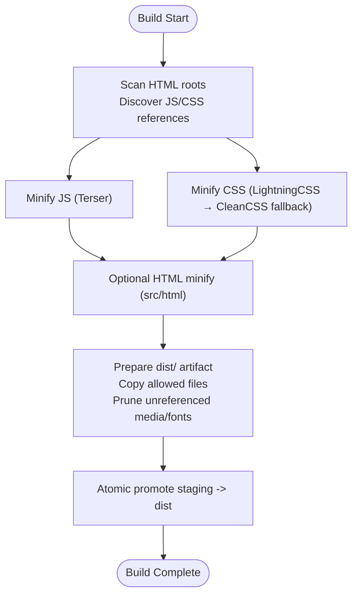
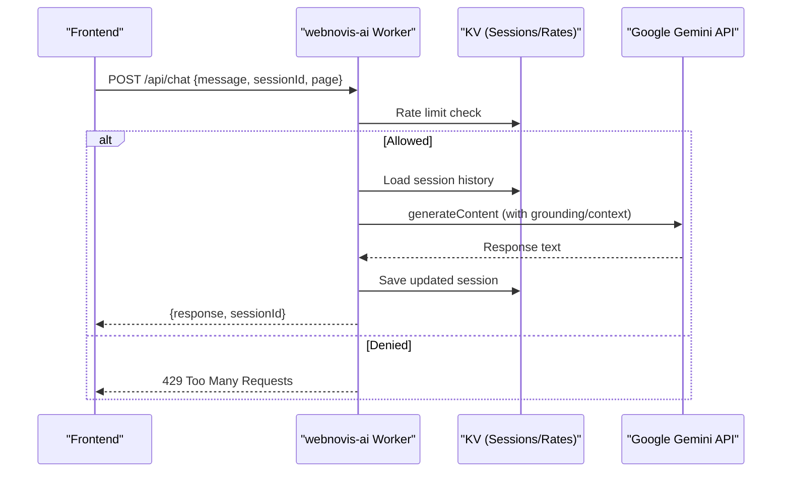
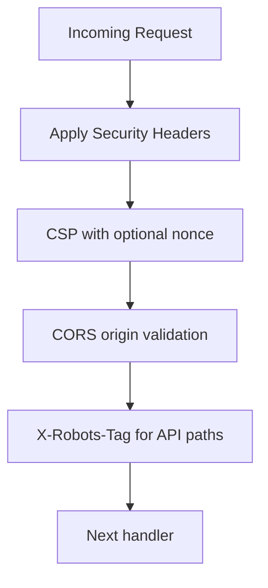
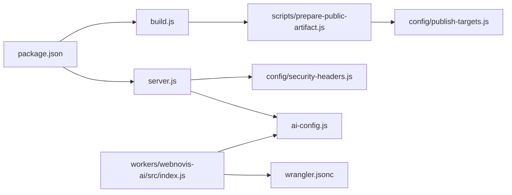

# Architecture Overview

<cite>
**Referenced Files in This Document**
- [server.js](file://server.js)
- [build.js](file://build.js)
- [package.json](file://package.json)
- [wrangler.jsonc](file://wrangler.jsonc)
- [ai-config.js](file://ai-config.js)
- [workers/webnovis-ai/src/index.js](file://workers/webnovis-ai/src/index.js)
- [workers/webnovis-ai/wrangler.jsonc](file://workers/webnovis-ai/wrangler.jsonc)
- [workers/webnovis-forms/src/index.js](file://workers/webnovis-forms/src/index.js)
- [workers/webnovis-forms/wrangler.jsonc](file://workers/webnovis-forms/wrangler.jsonc)
- [config/security-headers.js](file://config/security-headers.js)
- [scripts/prepare-public-artifact.js](file://scripts/prepare-public-artifact.js)
- [config/publish-targets.js](file://config/publish-targets.js)
</cite>

## Table of Contents
1. Introduction
2. Project Structure
3. Core Components
4. Architecture Overview
5. Detailed Component Analysis
6. Dependency Analysis
7. Performance Considerations
8. Troubleshooting Guide
9. Conclusion
10. Appendices

## Introduction
WebNovis is a dual-mode system that supports both static and dynamic deployments:
- Static mode: A build pipeline produces a hardened, minimal `dist/` artifact served by Cloudflare Workers Assets for maximum performance and security.
- Dynamic mode: An Express server provides runtime APIs (chat, search, newsletter), serves selected static pages, and applies security, SEO, and caching middleware.

The system integrates Google Gemini AI for chat and intelligent search, uses Nunjucks templates during content generation, and exposes Cloudflare Workers for edge-native AI and form handling.

## Project Structure
At a high level:
- Build pipeline transforms source assets into a production-ready `dist/` artifact.
- Express server runs locally or on a Node host to serve pages and APIs.
- Cloudflare Workers serve the static site and provide AI/form endpoints at the edge.
- Configuration centralizes security headers, CORS, and publish targets.

**Diagram sources**
- [build.js:1-502](file://build.js#L1-L502)
- [scripts/prepare-public-artifact.js:1-200](file://scripts/prepare-public-artifact.js#L1-L200)
- [config/publish-targets.js:1-37](file://config/publish-targets.js#L1-L37)
- [server.js:1-800](file://server.js#L1-L800)
- [config/security-headers.js:1-113](file://config/security-headers.js#L1-L113)
- [ai-config.js:1-38](file://ai-config.js#L1-L38)
- [workers/webnovis-ai/src/index.js:1-544](file://workers/webnovis-ai/src/index.js#L1-L544)
- [workers/webnovis-forms/src/index.js:1-172](file://workers/webnovis-forms/src/index.js#L1-L172)
- [wrangler.jsonc:1-30](file://wrangler.jsonc#L1-L30)

**Section sources**
- [build.js:1-502](file://build.js#L1-L502)
- [scripts/prepare-public-artifact.js:1-200](file://scripts/prepare-public-artifact.js#L1-L200)
- [config/publish-targets.js:1-37](file://config/publish-targets.js#L1-L37)
- [server.js:1-800](file://server.js#L1-L800)
- [config/security-headers.js:1-113](file://config/security-headers.js#L1-L113)
- [ai-config.js:1-38](file://ai-config.js#L1-L38)
- [workers/webnovis-ai/src/index.js:1-544](file://workers/webnovis-ai/src/index.js#L1-L544)
- [workers/webnovis-forms/src/index.js:1-172](file://workers/webnovis-forms/src/index.js#L1-L172)
- [wrangler.jsonc:1-30](file://wrangler.jsonc#L1-L30)

## Core Components
- Express server: Serves static assets, HTML pages, and APIs with security headers, rate limiting, canonicalization, bot logging, and cache policies.
- Build pipeline: Minifies JS/CSS, optionally minifies HTML, discovers referenced assets, and prepares a sanitized `dist/` artifact for deployment.
- AI integration layer: Centralized configuration for Gemini models and parameters; used by both Node server and Cloudflare Worker.
- Cloudflare Workers:
  - webnovis-ai: Chat, search, health, and lead capture endpoints with KV-backed sessions/rate limits and Gemini fallbacks.
  - webnovis-forms: Turnstile verification and forwarding to Web3Forms.
- Security and headers: Centralized CSP, HSTS, CORS allowlists, and generated `_headers` for platforms.

**Section sources**
- [server.js:1-800](file://server.js#L1-L800)
- [build.js:1-502](file://build.js#L1-L502)
- [ai-config.js:1-38](file://ai-config.js#L1-L38)
- [workers/webnovis-ai/src/index.js:1-544](file://workers/webnovis-ai/src/index.js#L1-L544)
- [workers/webnovis-forms/src/index.js:1-172](file://workers/webnovis-forms/src/index.js#L1-L172)
- [config/security-headers.js:1-113](file://config/security-headers.js#L1-L113)

## Architecture Overview
The system supports two complementary modes:

- Static-only (Cloudflare Workers Assets):
  - Build produces `dist/`.
  - `wrangler.jsonc` serves `dist/` with `html_handling: none` to preserve `.html` URLs.
  - Security and cache headers are enforced via generated files included in the artifact.

- Dynamic (Express server):
  - Serves static assets and selected HTML pages.
  - Provides `/api/*` endpoints for chat/search/newsletter with rate limiting, quota tracking, and prompt-injection guards.
  - Applies canonical redirects, trailing slash normalization, UTM stripping, and X-Robots-Tag directives.

**Diagram sources**
- [wrangler.jsonc:1-30](file://wrangler.jsonc#L1-L30)
- [server.js:1-800](file://server.js#L1-L800)
- [workers/webnovis-ai/src/index.js:1-544](file://workers/webnovis-ai/src/index.js#L1-L544)
- [workers/webnovis-forms/src/index.js:1-172](file://workers/webnovis-forms/src/index.js#L1-L172)
- [config/security-headers.js:1-113](file://config/security-headers.js#L1-L113)

## Detailed Component Analysis

### Express Server (Dynamic Mode)
Responsibilities:
- Middleware stack: CORS, compression, trust proxy, JSON body parsing, canonical host redirect, security headers, robots directives, legacy redirects, trailing slash normalization, UTM stripping, singular/plural page canonicalization, bot detection logging, public file prefix stripping.
- Static asset serving with environment-aware cache headers.
- Public HTML routing for core and pSEO pages with per-file cache control and AI-discoverable open CORS for specific files.
- Session management for chat with memory limits and cleanup.
- Rate limiting for chat, newsletter, and search endpoints.
- Quota tracking for Gemini keys with daily caps and warnings.
- Prompt injection guard patterns and safe fallback responses.
- In-memory search AI cache with TTL and in-flight deduplication.
- Integration with Gemini via fetch with timeouts and robust JSON parsing.

**Diagram sources**
- [server.js:643-800](file://server.js#L643-L800)

**Section sources**
- [server.js:1-800](file://server.js#L1-L800)

### Build Pipeline (Static Mode)
Responsibilities:
- Discover HTML roots and scan for referenced JS/CSS assets.
- Minify JS using Terser with strict options and per-file overrides.
- Minify CSS using Lightning CSS with CleanCSS fallback; preserves cascade safely.
- Optional HTML minification for src/html outputs with SEO transforms applied before minification.
- Prepare a hardened `dist/` artifact with allowlist-based copying, asset pruning, and atomic promotion.
- Publish target resolution via CLI args and environment variables.

**Diagram sources**
- [build.js:1-502](file://build.js#L1-L502)
- [scripts/prepare-public-artifact.js:1-200](file://scripts/prepare-public-artifact.js#L1-L200)
- [config/publish-targets.js:1-37](file://config/publish-targets.js#L1-L37)

**Section sources**
- [build.js:1-502](file://build.js#L1-L502)
- [scripts/prepare-public-artifact.js:1-200](file://scripts/prepare-public-artifact.js#L1-L200)
- [config/publish-targets.js:1-37](file://config/publish-targets.js#L1-L37)

### Cloudflare Workers (Edge AI and Forms)
- webnovis-ai:
  - Endpoints: health, chat, search-ai, chat-lead.
  - Rate limiting via KV namespaces with time-bucketed counters.
  - Sessions persisted in KV with TTL and message trimming.
  - Gemini integration with primary/fallback models and retryable error handling.
  - Local fallback catalog responses when API key missing or errors occur.
  - CORS handling based on configured origins.
- webnovis-forms:
  - Validates Turnstile tokens server-side and forwards to Web3Forms.
  - Supports JSON and form-data payloads, honeypot anti-bot field, and hostname validation.

**Diagram sources**
- [workers/webnovis-ai/src/index.js:1-544](file://workers/webnovis-ai/src/index.js#L1-L544)
- [workers/webnovis-ai/wrangler.jsonc:1-26](file://workers/webnovis-ai/wrangler.jsonc#L1-L26)

**Section sources**
- [workers/webnovis-ai/src/index.js:1-544](file://workers/webnovis-ai/src/index.js#L1-L544)
- [workers/webnovis-ai/wrangler.jsonc:1-26](file://workers/webnovis-ai/wrangler.jsonc#L1-L26)
- [workers/webnovis-forms/src/index.js:1-172](file://workers/webnovis-forms/src/index.js#L1-L172)
- [workers/webnovis-forms/wrangler.jsonc:1-20](file://workers/webnovis-forms/wrangler.jsonc#L1-L20)

### Security Middleware and Policies
- Security headers: HSTS, nosniff, X-Frame-Options, CSP, Referrer-Policy, Permissions-Policy.
- CSP supports nonce-based inline script execution and whitelisted domains for analytics, forms, and third-party widgets.
- CORS allowlists configurable via environment variables.
- Generated `_headers` file for platform-specific header enforcement.

**Diagram sources**
- [config/security-headers.js:1-113](file://config/security-headers.js#L1-L113)
- [server.js:289-319](file://server.js#L289-L319)

**Section sources**
- [config/security-headers.js:1-113](file://config/security-headers.js#L1-L113)
- [server.js:289-319](file://server.js#L289-L319)

### Technology Stack and Third-Party Dependencies
- Runtime:
  - Express server with compression, CORS, dotenv, node-fetch, express-rate-limit.
  - Nunjucks dependency present for template rendering in content generation workflows.
- Build tools:
  - Terser for JS minification.
  - Lightning CSS with CleanCSS fallback for CSS minification.
  - html-minifier-terser for optional HTML minification.
  - Sharp for image processing (dev dependency).
- Edge:
  - Wrangler for Cloudflare Workers deployment and configuration.
  - KV namespaces for sessions, rate limits, and caches in AI worker.
- External services:
  - Google Gemini API for chat and search.
  - Cloudflare Turnstile for CAPTCHA verification.
  - Web3Forms for email delivery.

**Section sources**
- [package.json:1-92](file://package.json#L1-L92)
- [ai-config.js:1-38](file://ai-config.js#L1-L38)
- [workers/webnovis-ai/wrangler.jsonc:1-26](file://workers/webnovis-ai/wrangler.jsonc#L1-L26)
- [workers/webnovis-forms/wrangler.jsonc:1-20](file://workers/webnovis-forms/wrangler.jsonc#L1-L20)

## Dependency Analysis
Key relationships:
- Build pipeline depends on config modules for publish targets and SEO transforms.
- Express server depends on security headers module and AI configuration.
- Workers depend on shared search engine logic and external APIs.
- Deployment relies on wrangler configuration to serve only the sanitized `dist/` artifact.

**Diagram sources**
- [package.json:1-92](file://package.json#L1-L92)
- [server.js:1-800](file://server.js#L1-L800)
- [build.js:1-502](file://build.js#L1-L502)
- [scripts/prepare-public-artifact.js:1-200](file://scripts/prepare-public-artifact.js#L1-L200)
- [config/publish-targets.js:1-37](file://config/publish-targets.js#L1-L37)
- [config/security-headers.js:1-113](file://config/security-headers.js#L1-L113)
- [ai-config.js:1-38](file://ai-config.js#L1-L38)
- [workers/webnovis-ai/src/index.js:1-544](file://workers/webnovis-ai/src/index.js#L1-L544)
- [wrangler.jsonc:1-30](file://wrangler.jsonc#L1-L30)

**Section sources**
- [package.json:1-92](file://package.json#L1-L92)
- [server.js:1-800](file://server.js#L1-L800)
- [build.js:1-502](file://build.js#L1-L502)
- [scripts/prepare-public-artifact.js:1-200](file://scripts/prepare-public-artifact.js#L1-L200)
- [config/publish-targets.js:1-37](file://config/publish-targets.js#L1-L37)
- [config/security-headers.js:1-113](file://config/security-headers.js#L1-L113)
- [ai-config.js:1-38](file://ai-config.js#L1-L38)
- [workers/webnovis-ai/src/index.js:1-544](file://workers/webnovis-ai/src/index.js#L1-L544)
- [wrangler.jsonc:1-30](file://wrangler.jsonc#L1-L30)

## Performance Considerations
- Compression middleware reduces transfer size for text assets.
- Static assets use long-lived immutable caching in production; HTML uses short TTL with stale-while-revalidate.
- In-memory search AI cache with TTL and max entries prevents repeated API calls.
- In-flight deduplication coalesces concurrent identical queries to reduce load.
- KV-backed rate limiting and sessions scale at the edge without persistent databases.
- Asset pruning removes unreferenced media/fonts from the artifact to minimize payload.
- Gemini requests include timeouts and fallback models to handle overload conditions.

[No sources needed since this section provides general guidance]

## Troubleshooting Guide
Common issues and mitigations:
- Missing rate limiter in production: The server refuses to start if express-rate-limit is not installed in production.
- Newsletter secret misconfiguration: Startup warning emitted if placeholder secret is detected in production.
- Gemini API failures: Both Node and Worker implementations fall back to local responses or alternate models; search returns a structured fallback with suggested pages.
- Prompt injection attempts: Detected via regex patterns; safe responses returned instead of invoking AI.
- Quota exceeded: Daily counters block further calls once thresholds are reached; logs warn near cap.
- Build failures: Non-zero exit codes when minification fails; detailed logs indicate which step errored.
- Artifact integrity: Verification scripts ensure only allowed files are published and headers are synchronized.

**Section sources**
- [server.js:95-107](file://server.js#L95-L107)
- [server.js:228-232](file://server.js#L228-L232)
- [server.js:675-740](file://server.js#L675-L740)
- [workers/webnovis-ai/src/index.js:238-247](file://workers/webnovis-ai/src/index.js#L238-L247)
- [workers/webnovis-ai/src/index.js:370-440](file://workers/webnovis-ai/src/index.js#L370-L440)
- [build.js:422-426](file://build.js#L422-L426)

## Conclusion
WebNovis combines a robust static build pipeline with flexible runtime capabilities. The dual-mode architecture enables:
- High-performance static hosting via Cloudflare Workers Assets with strict security and caching.
- Rich dynamic features through an Express server with comprehensive middleware, rate limiting, and AI integrations.
- Edge-native AI and form handling via Cloudflare Workers with resilient fallbacks and KV-backed state.

This design balances scalability, security, and maintainability while supporting modern frontend interactions and AI-powered experiences.

[No sources needed since this section summarizes without analyzing specific files]

## Appendices

### Infrastructure Requirements
- Node.js environment for build and Express server.
- npm dependencies including Express, compression, cors, dotenv, node-fetch, express-rate-limit, nunjucks, and dev tools for minification.
- Wrangler CLI for deploying Workers and managing secrets.
- Environment variables for API keys (Gemini, Turnstile, Web3Forms), CORS origins, and admin secrets.

**Section sources**
- [package.json:1-92](file://package.json#L1-L92)
- [workers/webnovis-forms/wrangler.jsonc:1-20](file://workers/webnovis-forms/wrangler.jsonc#L1-L20)

### Scalability Considerations
- Use Cloudflare Workers for AI endpoints to leverage global edge distribution and KV-backed rate limiting.
- Implement request deduplication and caching to reduce redundant AI calls.
- Configure appropriate timeouts and fallback strategies for external API resilience.
- Monitor quotas and usage to prevent runaway costs and service degradation.

[No sources needed since this section provides general guidance]

### Deployment Topology Options
- Static-only: Deploy `dist/` via Cloudflare Workers Assets with `html_handling: none` to preserve `.html` URLs.
- Dynamic: Run Express server behind a reverse proxy or platform with TLS termination; apply security headers and rate limiting.
- Hybrid: Serve static assets via Workers and route API calls to either Express or Workers depending on latency and cost requirements.

**Section sources**
- [wrangler.jsonc:1-30](file://wrangler.jsonc#L1-L30)
- [docs/deploy/WORKERS-ASSETS-DIST.md:1-91](file://docs/deploy/WORKERS-ASSETS-DIST.md#L1-L91)