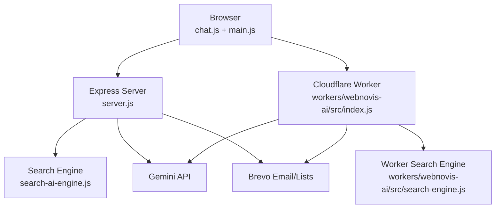
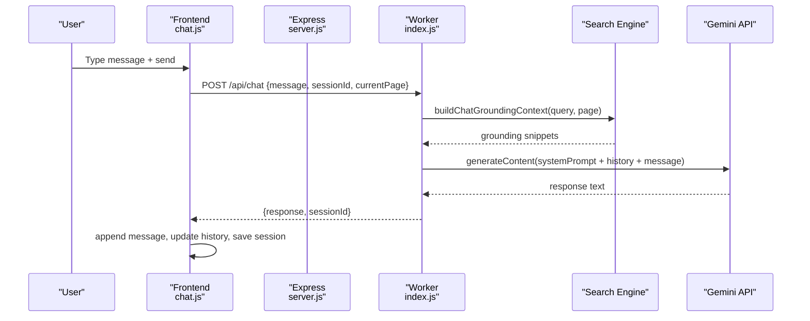
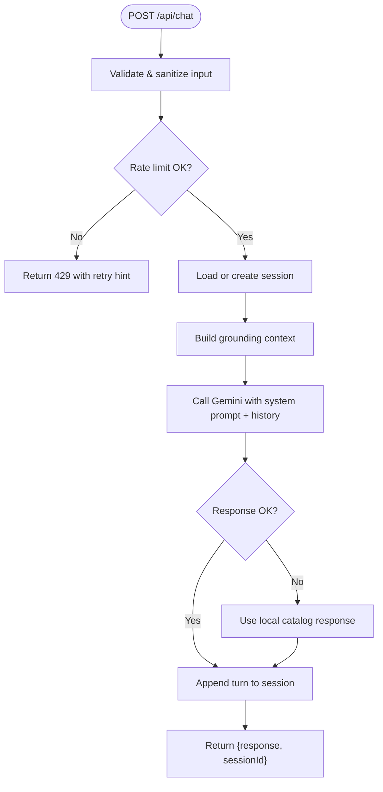
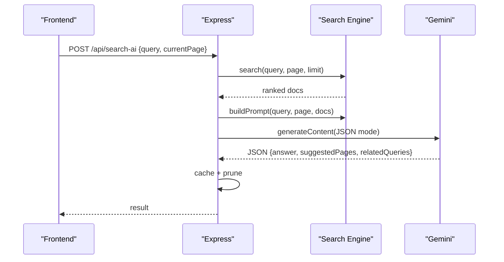
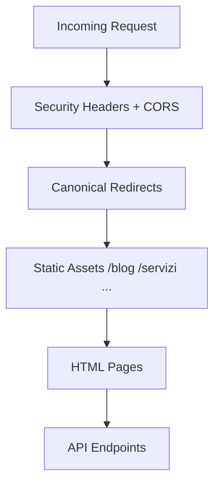
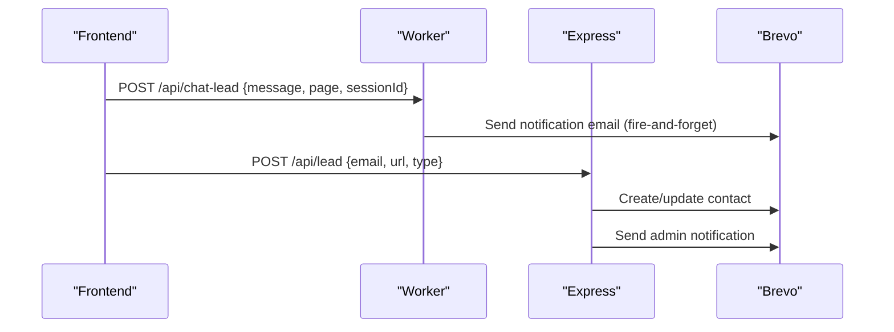
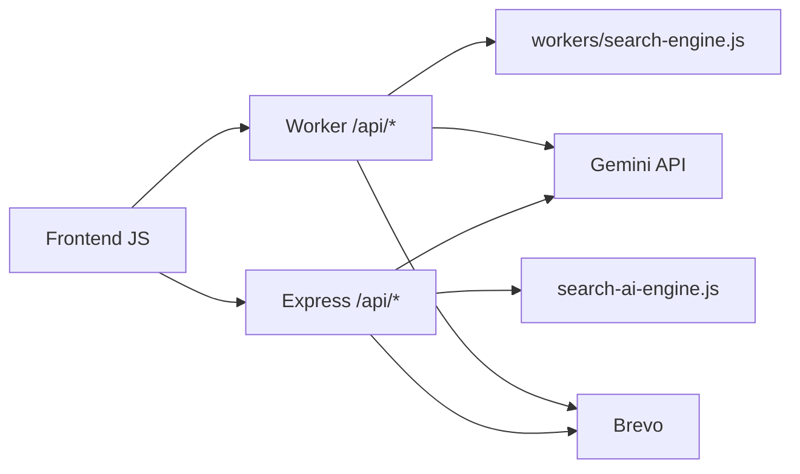

# Component Interactions

<cite>
**Referenced Files in This Document**
- [server.js](file://server.js)
- [chat.js](file://js/chat.js)
- [main.js](file://js/main.js)
- [index.js](file://workers/webnovis-ai/src/index.js)
- [search-engine.js](file://workers/webnovis-ai/src/search-engine.js)
- [catalog.js](file://workers/webnovis-ai/src/catalog.js)
- [search-ai-engine.js](file://search-ai-engine.js)
- [ai-config.js](file://ai-config.js)
- [chat-config.json](file://chat-config.json)
- [package.json](file://package.json)
</cite>

## Table of Contents
1. Introduction
2. Project Structure
3. Core Components
4. Architecture Overview
5. Detailed Component Analysis
6. Dependency Analysis
7. Performance Considerations
8. Troubleshooting Guide
9. Conclusion

## Introduction
This document explains how the WebNovis frontend JavaScript communicates with backend APIs to deliver chatbot conversations, intelligent site search, and form/lead capture flows. It maps the request-response lifecycle from user interaction to AI service calls (Gemini), through Express server routing and Cloudflare Worker endpoints, and back to the client. It also documents caching strategies, error propagation, event-driven interactions, and performance considerations such as rate limiting, connection reuse, and concurrent operation handling.

## Project Structure
WebNovis uses a hybrid runtime:
- Express server serves static assets, routes API endpoints, and proxies or orchestrates AI calls when needed.
- A Cloudflare Worker exposes /api/chat, /api/search-ai, /api/chat-lead, and health endpoints for low-latency edge execution.
- Frontend JavaScript drives UI events, manages local session state, and calls the appropriate endpoint based on environment.

**Diagram sources**
- [server.js:224-530](file://server.js#L224-L530)
- [index.js:508-543](file://workers/webnovis-ai/src/index.js#L508-L543)
- [search-ai-engine.js:201-389](file://search-ai-engine.js#L201-L389)
- [search-engine.js:188-379](file://workers/webnovis-ai/src/search-engine.js#L188-L379)

**Section sources**
- [package.json:1-92](file://package.json#L1-L92)
- [server.js:224-530](file://server.js#L224-L530)
- [index.js:508-543](file://workers/webnovis-ai/src/index.js#L508-L543)

## Core Components
- Frontend Chat UI: chat.js handles user input, retries, typing indicators, session persistence, lead intent detection, and adaptive timeouts.
- Express Server: server.js provides API endpoints (/api/chat, /api/search-ai, /api/newsletter, /api/lead, /api/chat-lead), security headers, CORS, compression, static asset serving, and fallback logic.
- Cloudflare Worker: index.js implements /api/chat, /api/search-ai, /api/chat-lead with KV-backed sessions/cache, rate limiting, and Gemini integration.
- Search Engines: search-ai-engine.js (Node) and workers/webnovis-ai/src/search-engine.js (Worker) provide token-based ranking, prompt building, fallback responses, and sanitization.
- Configuration: ai-config.js centralizes model names and parameters; chat-config.json defines company info, services, and bot instructions.

**Section sources**
- [chat.js:1-797](file://js/chat.js#L1-L797)
- [server.js:742-815](file://server.js#L742-L815)
- [index.js:266-506](file://workers/webnovis-ai/src/index.js#L266-L506)
- [search-ai-engine.js:201-389](file://search-ai-engine.js#L201-L389)
- [search-engine.js:188-379](file://workers/webnovis-ai/src/search-engine.js#L188-L379)
- [ai-config.js:1-38](file://ai-config.js#L1-L38)
- [chat-config.json:1-109](file://chat-config.json#L1-L109)

## Architecture Overview
The system supports two primary flows:
- Chatbot conversation flow: Client sends messages to either the Worker (production) or Express (local/dev). Both validate inputs, enforce rate limits, maintain sessions, optionally ground responses with site content, call Gemini, and return sanitized text. On failure, they fall back to local catalog responses.
- Intelligent search flow: Client queries /api/search-ai. The backend ranks relevant pages using token-based scoring, builds a prompt with retrieved context, calls Gemini for JSON output, caches results, and returns answer + suggested pages.

**Diagram sources**
- [chat.js:533-580](file://js/chat.js#L533-L580)
- [index.js:266-368](file://workers/webnovis-ai/src/index.js#L266-L368)
- [search-engine.js:351-367](file://workers/webnovis-ai/src/search-engine.js#L351-L367)

**Section sources**
- [chat.js:430-479](file://js/chat.js#L430-L479)
- [index.js:266-368](file://workers/webnovis-ai/src/index.js#L266-L368)

## Detailed Component Analysis

### Chat Flow: User Interaction to AI Response
- Input validation and sanitization occur on both client and server/worker sides.
- Rate limiting protects endpoints from abuse.
- Sessions are maintained server-side (Worker KV or Express memory) to preserve conversation context securely.
- Grounding enriches responses with relevant site content via the search engine.
- Gemini calls include retry/fallback to alternate models and local catalog responses on errors.
- Frontend renders rich content, persists session in localStorage, and shows degraded mode if network/API fails.

**Diagram sources**
- [index.js:266-368](file://workers/webnovis-ai/src/index.js#L266-L368)
- [server.js:1123-1279](file://server.js#L1123-L1279)
- [catalog.js:57-134](file://workers/webnovis-ai/src/catalog.js#L57-L134)

**Section sources**
- [index.js:266-368](file://workers/webnovis-ai/src/index.js#L266-L368)
- [server.js:1123-1279](file://server.js#L1123-L1279)
- [catalog.js:57-134](file://workers/webnovis-ai/src/catalog.js#L57-L134)

### Search Flow: Query to Ranked Results and AI Answer
- Client posts query and current page to /api/search-ai.
- Backend normalizes query, searches corpus, builds prompt, calls Gemini for structured JSON, caches result, and returns answer with suggested pages and related queries.
- In-flight deduplication prevents duplicate API calls for identical concurrent queries.

**Diagram sources**
- [server.js:643-815](file://server.js#L643-L815)
- [search-ai-engine.js:232-362](file://search-ai-engine.js#L232-L362)

**Section sources**
- [server.js:643-815](file://server.js#L643-L815)
- [search-ai-engine.js:232-362](file://search-ai-engine.js#L232-L362)

### Static Asset Delivery and Routing
- Express serves CSS/JS/Images/fonts with production caching headers and dev no-cache behavior.
- HTML directories use short TTL with stale-while-revalidate.
- Canonical redirects handle non-www, trailing slashes, legacy paths, and public prefix stripping.
- Security headers and robots directives are applied globally.

**Diagram sources**
- [server.js:289-530](file://server.js#L289-L530)

**Section sources**
- [server.js:289-530](file://server.js#L289-L530)

### Lead Capture and Newsletter Integration
- Chat leads are detected client-side and sent fire-and-forget to /api/chat-lead (Worker or Express).
- Express /api/lead captures 404-page leads, logs to file, updates Brevo lists, and sends notification emails.
- Newsletter endpoints support subscription, unsubscribe (HMAC-protected), preview, and scheduled sending.

**Diagram sources**
- [index.js:442-506](file://workers/webnovis-ai/src/index.js#L442-L506)
- [server.js:899-1093](file://server.js#L899-L1093)

**Section sources**
- [index.js:442-506](file://workers/webnovis-ai/src/index.js#L442-L506)
- [server.js:899-1093](file://server.js#L899-L1093)

### Error Propagation and Fallbacks
- Prompt injection patterns are blocked early with safe responses.
- Quota guards prevent exceeding daily API limits; requests are blocked after cap.
- Network or model errors trigger fallback to local catalog responses and degrade UX gracefully.
- Frontend shows offline/degraded banner and retries with exponential backoff.

**Section sources**
- [server.js:129-220](file://server.js#L129-L220)
- [server.js:1123-1279](file://server.js#L1123-L1279)
- [index.js:266-368](file://workers/webnovis-ai/src/index.js#L266-L368)
- [chat.js:481-531](file://js/chat.js#L481-L531)

## Dependency Analysis
- Frontend depends on Worker endpoints in production and can be configured for local development.
- Express server depends on Node-fetch, compression, cors, express-rate-limit, and configuration modules.
- Both Express and Worker depend on shared search engines for ranking and prompt construction.
- External dependencies include Gemini API and Brevo for email/lists.

**Diagram sources**
- [package.json:69-77](file://package.json#L69-L77)
- [index.js:508-543](file://workers/webnovis-ai/src/index.js#L508-L543)
- [server.js:224-530](file://server.js#L224-L530)

**Section sources**
- [package.json:69-77](file://package.json#L69-L77)
- [index.js:508-543](file://workers/webnovis-ai/src/index.js#L508-L543)
- [server.js:224-530](file://server.js#L224-L530)

## Performance Considerations
- Connection reuse: node-fetch is eagerly imported and pre-warmed at startup to reduce cold-start latency.
- Caching:
  - Express in-memory LRU-style cache for search results with TTL and max entries; in-flight deduplication coalesces concurrent identical queries.
  - Worker KV cache for search results and sessions with expiration.
- Rate limiting:
  - Per-IP limits for chat, search, newsletter, and lead endpoints to protect against abuse.
- Concurrency:
  - Worker leverages Cloudflare’s concurrency model; Express relies on Node’s async I/O.
- Compression:
  - Brotli/Gzip enabled for text assets to reduce transfer size.
- Model selection:
  - Primary and fallback Gemini models per feature (chat vs search) to balance cost and latency.

[No sources needed since this section provides general guidance]

## Troubleshooting Guide
- Chat not responding:
  - Check worker health endpoint and ensure CORS allows your origin.
  - Verify rate limits are not exceeded; inspect retry-after hints.
  - Confirm GEMINI_API_KEY_CHAT is set; otherwise local fallback will be used.
- Search returning generic answers:
  - Ensure search index files exist and are valid JSON.
  - Validate query length and normalization; check injection guard triggers.
  - Inspect KV cache keys and TTL if using Worker.
- Newsletter/Lead issues:
  - Validate email format and required fields.
  - Confirm Brevo API key and list IDs are configured.
  - Review logs for email send failures and deduplication codes.

**Section sources**
- [index.js:518-543](file://workers/webnovis-ai/src/index.js#L518-L543)
- [server.js:817-888](file://server.js#L817-L888)
- [server.js:899-1093](file://server.js#L899-L1093)

## Conclusion
WebNovis integrates a responsive frontend with robust backend orchestration across Express and Cloudflare Workers to deliver secure, performant, and resilient AI-powered features. The design emphasizes safety (prompt injection guards, quotas), reliability (fallbacks, retries), and efficiency (caching, deduplication, compression). Clear API contracts and separation of concerns enable smooth evolution of components while maintaining consistent user experiences.