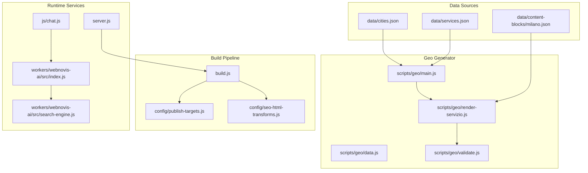
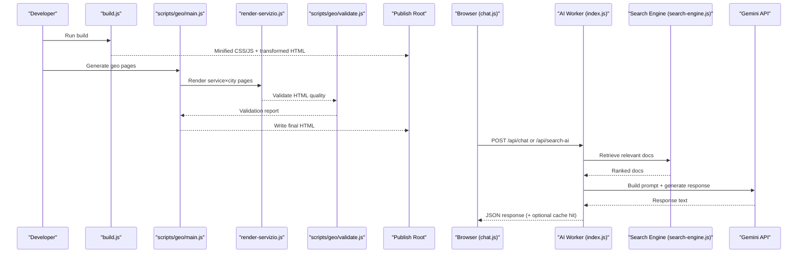
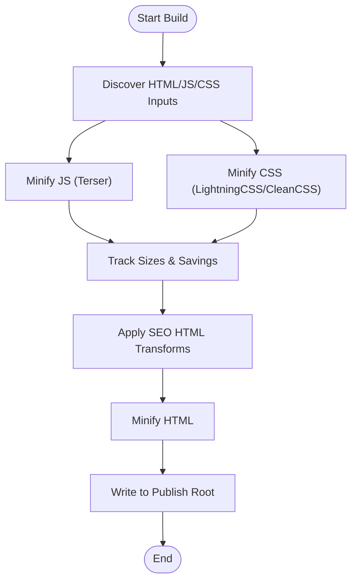
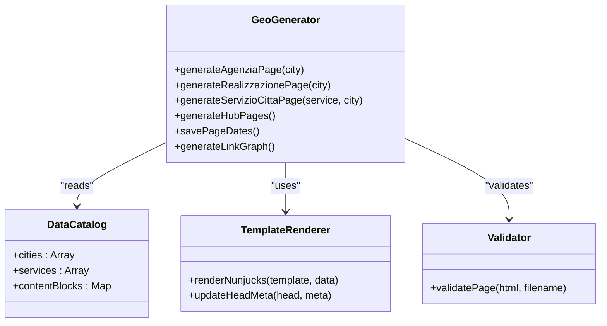
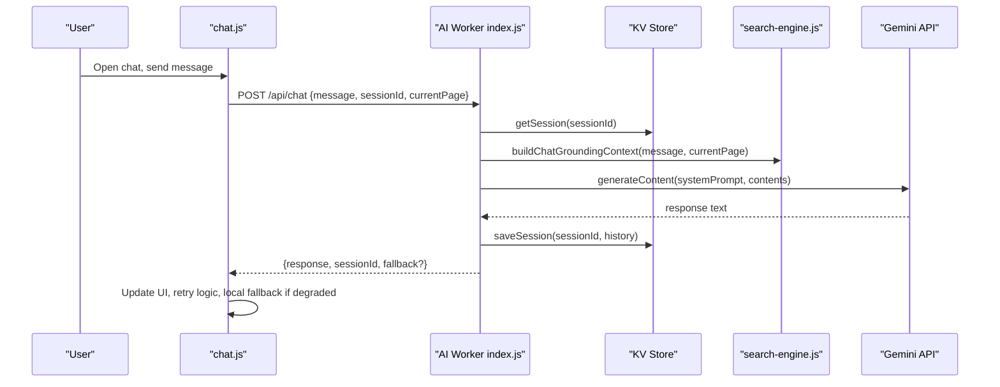
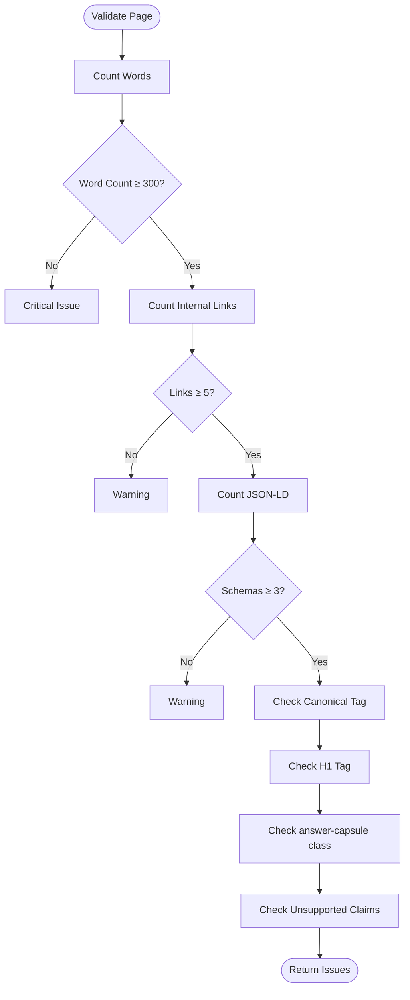
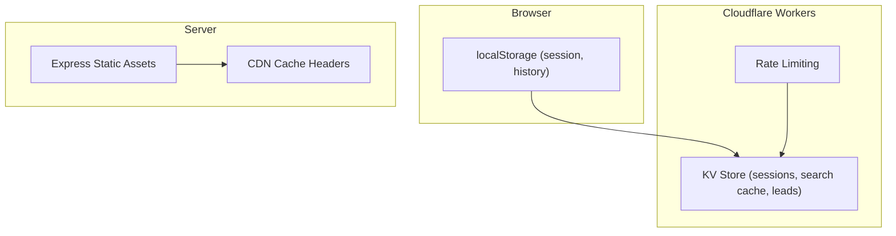
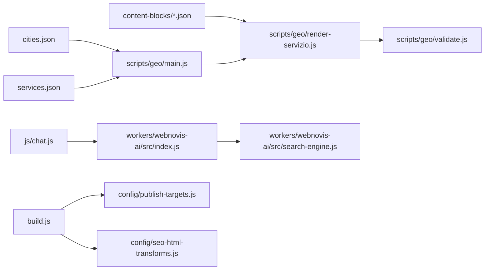

# Data Flow Patterns

<cite>
**Referenced Files in This Document**
- [build.js](file://build.js)
- [publish-targets.js](file://config/publish-targets.js)
- [seo-html-transforms.js](file://config/seo-html-transforms.js)
- [main.js](file://scripts/geo/main.js)
- [data.js](file://scripts/geo/data.js)
- [render-servizio.js](file://scripts/geo/render-servizio.js)
- [validate.js](file://scripts/geo/validate.js)
- [cities.json](file://data/cities.json)
- [services.json](file://data/services.json)
- [content-blocks/milano.json](file://data/content-blocks/milano.json)
- [chat-config.json](file://chat-config.json)
- [index.js](file://workers/webnovis-ai/src/index.js)
- [search-engine.js](file://workers/webnovis-ai/src/search-engine.js)
- [chat.js](file://js/chat.js)
- [server.js](file://server.js)
</cite>

## Table of Contents
1. [Introduction](#introduction)
2. [Project Structure](#project-structure)
3. [Core Components](#core-components)
4. [Architecture Overview](#architecture-overview)
5. [Detailed Component Analysis](#detailed-component-analysis)
6. [Dependency Analysis](#dependency-analysis)
7. [Performance Considerations](#performance-considerations)
8. [Troubleshooting Guide](#troubleshooting-guide)
9. [Conclusion](#conclusion)

## Introduction
This document explains the end-to-end data flow patterns in the WebNovis system, focusing on how JSON content sources are transformed into HTML through build and generation pipelines, how geo-targeted pages are created from city and service data, and how real-time AI features (chatbot and intelligent search) operate at runtime. It also covers caching strategies across in-memory, CDN, and browser storage layers; data validation, transformation, and sanitization processes; and consistency, versioning, and migration considerations for data stores.

## Project Structure
WebNovis organizes data, templates, generators, and runtime services in a modular way:
- Data sources: centralized JSON catalogs for cities, services, and per-city content blocks.
- Build pipeline: asset minification, HTML transforms, and output publishing.
- Geo page generator: orchestrates creation of agency, realization, and service×city pages using Nunjucks templates.
- AI worker: Cloudflare Worker exposing chat and search endpoints with retrieval-augmented responses.
- Frontend: client-side chat UI with session persistence and fallback behavior.
- Server: Express server serving static assets with cache headers.

**Diagram sources**
- [build.js:1-502](file://build.js#L1-L502)
- [publish-targets.js:1-37](file://config/publish-targets.js#L1-L37)
- [seo-html-transforms.js:1-200](file://config/seo-html-transforms.js#L1-L200)
- [main.js:1-292](file://scripts/geo/main.js#L1-L292)
- [data.js](file://scripts/geo/data.js)
- [render-servizio.js:1-200](file://scripts/geo/render-servizio.js#L1-L200)
- [validate.js:1-55](file://scripts/geo/validate.js#L1-L55)
- [cities.json:1-800](file://data/cities.json#L1-L800)
- [services.json:1-307](file://data/services.json#L1-L307)
- [content-blocks/milano.json:1-64](file://data/content-blocks/milano.json#L1-L64)
- [index.js:1-544](file://workers/webnovis-ai/src/index.js#L1-L544)
- [search-engine.js:1-200](file://workers/webnovis-ai/src/search-engine.js#L1-L200)
- [chat.js:1-797](file://js/chat.js#L1-L797)
- [server.js:458-481](file://server.js#L458-L481)

**Section sources**
- [build.js:1-502](file://build.js#L1-L502)
- [publish-targets.js:1-37](file://config/publish-targets.js#L1-L37)
- [seo-html-transforms.js:1-200](file://config/seo-html-transforms.js#L1-L200)
- [main.js:1-292](file://scripts/geo/main.js#L1-L292)
- [data.js](file://scripts/geo/data.js)
- [render-servizio.js:1-200](file://scripts/geo/render-servizio.js#L1-L200)
- [validate.js:1-55](file://scripts/geo/validate.js#L1-L55)
- [cities.json:1-800](file://data/cities.json#L1-L800)
- [services.json:1-307](file://data/services.json#L1-L307)
- [content-blocks/milano.json:1-64](file://data/content-blocks/milano.json#L1-L64)
- [index.js:1-544](file://workers/webnovis-ai/src/index.js#L1-L544)
- [search-engine.js:1-200](file://workers/webnovis-ai/src/search-engine.js#L1-L200)
- [chat.js:1-797](file://js/chat.js#L1-L797)
- [server.js:458-481](file://server.js#L458-L481)

## Core Components
- Build system: discovers and minifies JS/CSS, applies SEO HTML transforms to src/html files, and writes outputs to the publish root.
- Geo generator: reads cities and services catalogs, renders three page types (agenzia, realizzazione, servizio×città), validates outputs, and persists dates and link graphs.
- AI worker: exposes /api/chat, /api/search-ai, and /api/chat-lead; builds prompts from chat config; retrieves relevant docs via search engine; caches results in KV; rate-limits requests.
- Client chat UI: manages sessions, retries, typing UX, lead intent detection, and offline fallback messaging.
- Server: serves static assets with immutable cache headers in production.

**Section sources**
- [build.js:1-502](file://build.js#L1-L502)
- [main.js:1-292](file://scripts/geo/main.js#L1-L292)
- [render-servizio.js:1-200](file://scripts/geo/render-servizio.js#L1-L200)
- [validate.js:1-55](file://scripts/geo/validate.js#L1-L55)
- [index.js:1-544](file://workers/webnovis-ai/src/index.js#L1-L544)
- [search-engine.js:1-200](file://workers/webnovis-ai/src/search-engine.js#L1-L200)
- [chat.js:1-797](file://js/chat.js#L1-L797)
- [server.js:458-481](file://server.js#L458-L481)

## Architecture Overview
The system follows a clear separation between build-time generation and runtime AI interactions:
- Build-time: JSON catalogs → Nunjucks templates → validated HTML → minified assets → published site.
- Runtime: Browser chat UI → Cloudflare Worker → Gemini API → cached responses → email notifications for leads.

**Diagram sources**
- [build.js:1-502](file://build.js#L1-L502)
- [main.js:1-292](file://scripts/geo/main.js#L1-L292)
- [render-servizio.js:1-200](file://scripts/geo/render-servizio.js#L1-L200)
- [validate.js:1-55](file://scripts/geo/validate.js#L1-L55)
- [index.js:1-544](file://workers/webnovis-ai/src/index.js#L1-L544)
- [search-engine.js:1-200](file://workers/webnovis-ai/src/search-engine.js#L1-L200)
- [chat.js:1-797](file://js/chat.js#L1-L797)

## Detailed Component Analysis

### Build Pipeline: JSON to HTML and Asset Processing
- Inputs: source HTML under src/html, JS/CSS inputs discovered from HTML references and explicit lists.
- Processing:
  - JS minification via Terser with strict options.
  - CSS minification via Lightning CSS with CleanCSS fallback.
  - HTML minification after applying SEO transforms (meta tags, canonical, robots directives).
- Outputs: minified assets and optimized HTML written to the publish root.

**Diagram sources**
- [build.js:1-502](file://build.js#L1-L502)
- [publish-targets.js:1-37](file://config/publish-targets.js#L1-L37)
- [seo-html-transforms.js:1-200](file://config/seo-html-transforms.js#L1-L200)

**Section sources**
- [build.js:1-502](file://build.js#L1-L502)
- [publish-targets.js:1-37](file://config/publish-targets.js#L1-L37)
- [seo-html-transforms.js:1-200](file://config/seo-html-transforms.js#L1-L200)

### Geo Page Generation: City × Service Matrix
- Orchestration: main.js iterates over cities and services based on GEN_TYPE filters and generates agenzia, realizzazione, and servizio×città pages.
- Rendering: render-servizio.js composes template data from cities.json, services.json, and per-city content blocks (e.g., milano.json), selects FAQ pools by service cluster, and injects AI-derived content.
- Validation: validate.js enforces minimum word count, internal links, schema counts, canonical/H1 presence, and checks against governance rules.
- Persistence: page dates and link graph are saved post-generation.

**Diagram sources**
- [main.js:1-292](file://scripts/geo/main.js#L1-L292)
- [render-servizio.js:1-200](file://scripts/geo/render-servizio.js#L1-L200)
- [validate.js:1-55](file://scripts/geo/validate.js#L1-L55)
- [data.js](file://scripts/geo/data.js)

**Section sources**
- [main.js:1-292](file://scripts/geo/main.js#L1-L292)
- [render-servizio.js:1-200](file://scripts/geo/render-servizio.js#L1-L200)
- [validate.js:1-55](file://scripts/geo/validate.js#L1-L55)
- [cities.json:1-800](file://data/cities.json#L1-L800)
- [services.json:1-307](file://data/services.json#L1-L307)
- [content-blocks/milano.json:1-64](file://data/content-blocks/milano.json#L1-L64)

### Real-Time AI Chat and Intelligent Search
- Chat flow:
  - Client sends message with sessionId and currentPage.
  - Worker validates input, applies rate limiting, detects injection attempts, and builds system prompt from chat-config.json.
  - If configured, calls Gemini with primary/fallback models; otherwise uses local catalog responses.
  - Saves conversation history to KV with TTL; returns sanitized response.
- Search flow:
  - Client sends query and currentPage.
  - Worker normalizes query, retrieves top documents via search engine, builds prompt, calls Gemini with JSON mode, sanitizes result, caches in KV, and returns structured answer.
- Lead capture:
  - On lead intent detected, client posts to /api/chat-lead; worker stores lead metadata in KV and optionally emails via Brevo.

**Diagram sources**
- [chat.js:1-797](file://js/chat.js#L1-L797)
- [index.js:1-544](file://workers/webnovis-ai/src/index.js#L1-L544)
- [search-engine.js:1-200](file://workers/webnovis-ai/src/search-engine.js#L1-L200)
- [chat-config.json:1-109](file://chat-config.json#L1-L109)

**Section sources**
- [index.js:1-544](file://workers/webnovis-ai/src/index.js#L1-L544)
- [search-engine.js:1-200](file://workers/webnovis-ai/src/search-engine.js#L1-L200)
- [chat.js:1-797](file://js/chat.js#L1-L797)
- [chat-config.json:1-109](file://chat-config.json#L1-L109)

### Data Validation, Transformation, and Sanitization
- Geo HTML validation:
  - Word count thresholds, internal link targets, JSON-LD schema counts, canonical/H1 presence, answer-capsule class check, and unsupported claim detection.
- Input sanitization:
  - Strip HTML tags, enforce length limits, normalize paths/text, escape unsafe characters.
- SEO transforms:
  - Canonical tags, robots directives, strategic internal links, and content block injections based on path and governance rules.

**Diagram sources**
- [validate.js:1-55](file://scripts/geo/validate.js#L1-L55)
- [seo-html-transforms.js:1-200](file://config/seo-html-transforms.js#L1-L200)

**Section sources**
- [validate.js:1-55](file://scripts/geo/validate.js#L1-L55)
- [seo-html-transforms.js:1-200](file://config/seo-html-transforms.js#L1-L200)

### Caching Strategies Across Layers
- In-memory and KV caching:
  - Worker caches search results and chat sessions in KV with TTLs; rate limits enforced per IP per window.
- CDN and server caching:
  - Static assets served with immutable cache headers in production; HTML uses short max-age with stale-while-revalidate.
- Browser storage:
  - Chat UI persists session history and sessionId in localStorage with expiry; maintains connection state and degraded mode indicators.

**Diagram sources**
- [index.js:1-544](file://workers/webnovis-ai/src/index.js#L1-L544)
- [chat.js:1-797](file://js/chat.js#L1-L797)
- [server.js:458-481](file://server.js#L458-L481)

**Section sources**
- [index.js:1-544](file://workers/webnovis-ai/src/index.js#L1-L544)
- [chat.js:1-797](file://js/chat.js#L1-L797)
- [server.js:458-481](file://server.js#L458-L481)

### Data Consistency, Versioning, and Migration
- Versioning:
  - cities.json and services.json include _meta.version and lastUpdated fields to track changes.
  - Content blocks (e.g., milano.json) include model and version metadata for generated content.
- Consistency:
  - Geo generator enforces tier classification and indexability rules; validation ensures structural integrity and governance compliance.
- Migration:
  - Use of canonical URLs and redirects for deprecated clusters; editorial overrides allow controlled evolution without breaking existing pages.

**Section sources**
- [cities.json:1-800](file://data/cities.json#L1-L800)
- [services.json:1-307](file://data/services.json#L1-L307)
- [content-blocks/milano.json:1-64](file://data/content-blocks/milano.json#L1-L64)
- [main.js:1-292](file://scripts/geo/main.js#L1-L292)
- [validate.js:1-55](file://scripts/geo/validate.js#L1-L55)

## Dependency Analysis
Key dependencies and relationships:
- Geo generator depends on data catalogs and Nunjucks templates; validation is decoupled but invoked post-render.
- AI worker depends on search engine for retrieval and Gemini API for generation; KV provides persistence and caching.
- Build pipeline depends on configuration modules for roots and SEO transforms.

**Diagram sources**
- [main.js:1-292](file://scripts/geo/main.js#L1-L292)
- [render-servizio.js:1-200](file://scripts/geo/render-servizio.js#L1-L200)
- [validate.js:1-55](file://scripts/geo/validate.js#L1-L55)
- [chat.js:1-797](file://js/chat.js#L1-L797)
- [index.js:1-544](file://workers/webnovis-ai/src/index.js#L1-L544)
- [search-engine.js:1-200](file://workers/webnovis-ai/src/search-engine.js#L1-L200)
- [build.js:1-502](file://build.js#L1-L502)
- [publish-targets.js:1-37](file://config/publish-targets.js#L1-L37)
- [seo-html-transforms.js:1-200](file://config/seo-html-transforms.js#L1-L200)

**Section sources**
- [main.js:1-292](file://scripts/geo/main.js#L1-L292)
- [render-servizio.js:1-200](file://scripts/geo/render-servizio.js#L1-L200)
- [validate.js:1-55](file://scripts/geo/validate.js#L1-L55)
- [chat.js:1-797](file://js/chat.js#L1-L797)
- [index.js:1-544](file://workers/webnovis-ai/src/index.js#L1-L544)
- [search-engine.js:1-200](file://workers/webnovis-ai/src/search-engine.js#L1-L200)
- [build.js:1-502](file://build.js#L1-L502)
- [publish-targets.js:1-37](file://config/publish-targets.js#L1-L37)
- [seo-html-transforms.js:1-200](file://config/seo-html-transforms.js#L1-L200)

## Performance Considerations
- Asset optimization:
  - JS minification with dead code elimination and pure function stripping.
  - CSS minification with safe fallback to avoid risky reordering.
  - HTML minification applied only to src/html files to preserve geo-generated pages.
- Caching:
  - Immutable cache headers for static assets; short-lived HTML cache with stale-while-revalidate.
  - KV caching for search results and chat sessions reduces latency and API costs.
- Client-side:
  - Adaptive typing delays and retry logic improve perceived performance and resilience.
  - LocalStorage session persistence avoids repeated handshakes.

[No sources needed since this section provides general guidance]

## Troubleshooting Guide
- Geo generation failures:
  - Check validation issues (word count, internal links, schemas, canonical/H1).
  - Review blocked/failed counts and target mismatches in console output.
- AI chat errors:
  - Inspect rate limit responses and fallback behavior; verify environment variables (API keys, CORS origins).
  - Confirm session persistence and localStorage expiry settings.
- Build errors:
  - Ensure required dependencies (html-minifier-terser) are installed.
  - Verify publish root configuration and input discovery.

**Section sources**
- [validate.js:1-55](file://scripts/geo/validate.js#L1-L55)
- [main.js:1-292](file://scripts/geo/main.js#L1-L292)
- [index.js:1-544](file://workers/webnovis-ai/src/index.js#L1-L544)
- [chat.js:1-797](file://js/chat.js#L1-L797)
- [build.js:1-502](file://build.js#L1-L502)

## Conclusion
WebNovis implements a robust, modular data flow architecture that transforms JSON catalogs into high-quality, validated HTML through a configurable build and generation pipeline. The geo-targeted content engine scales across cities and services, while the AI-powered chat and search features provide real-time, retrieval-augmented interactions with strong caching and security measures. Comprehensive validation, sanitization, and caching strategies ensure data integrity, performance, and reliability across all layers.

[No sources needed since this section summarizes without analyzing specific files]