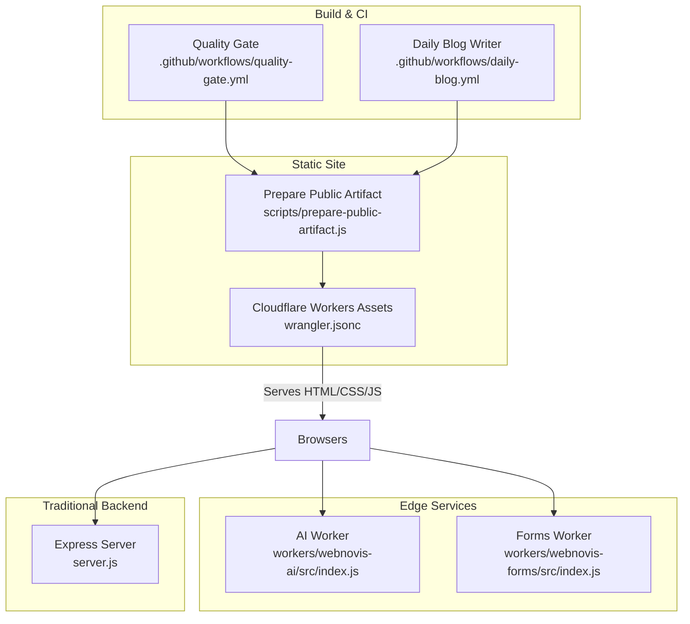
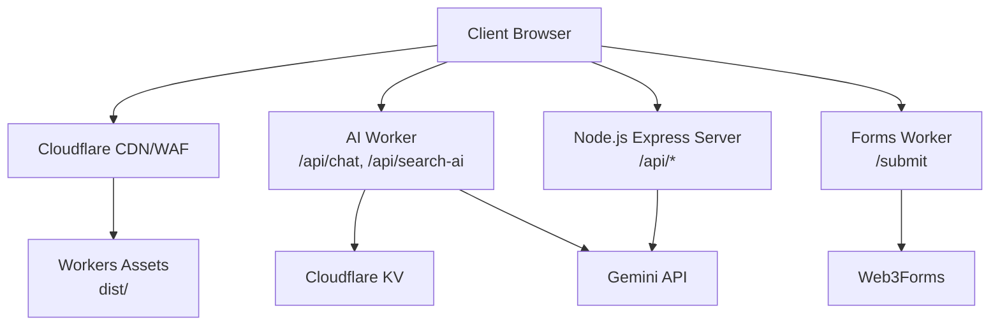
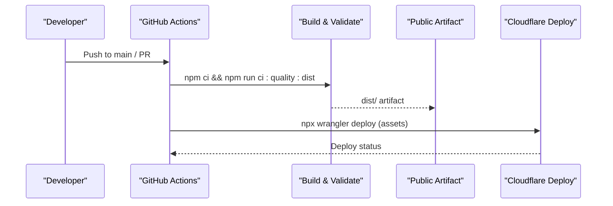
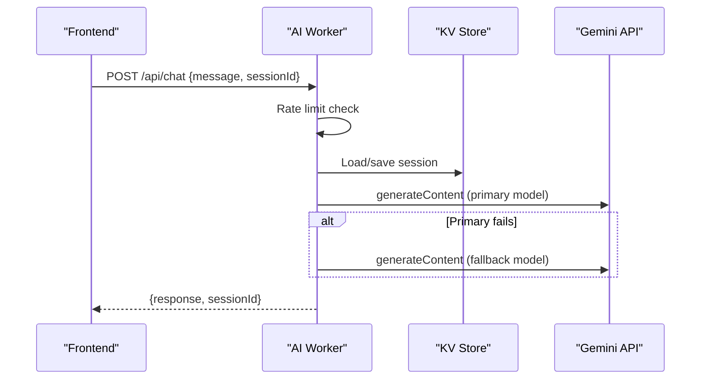
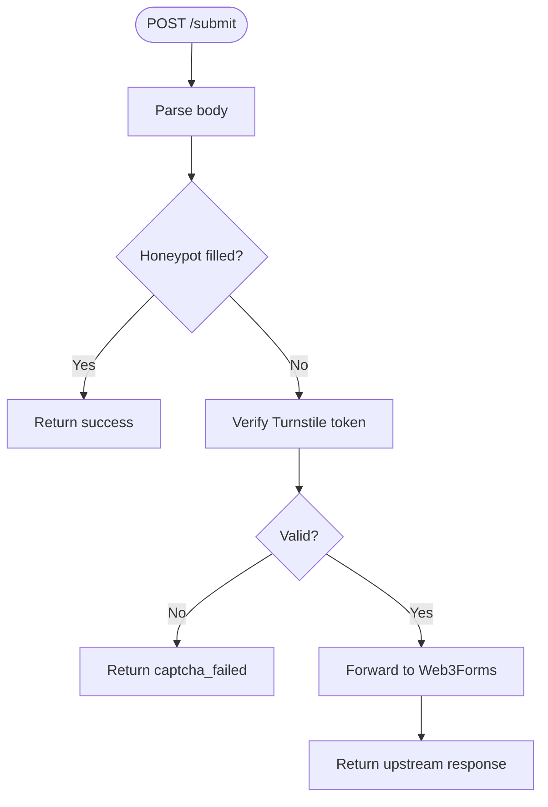
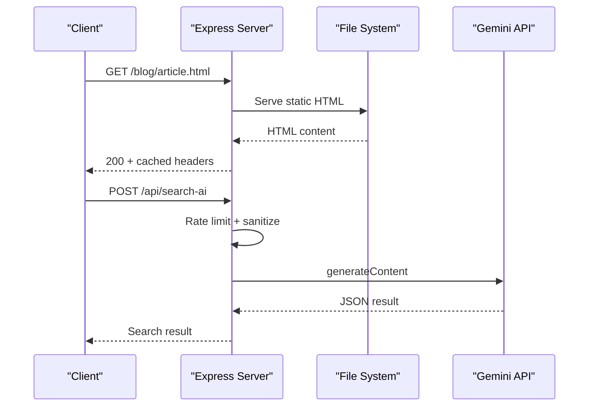
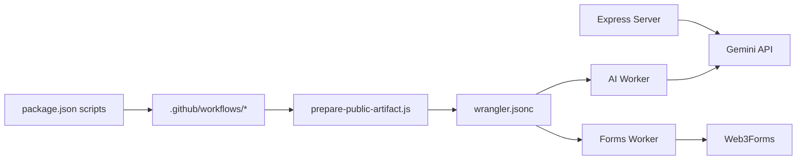
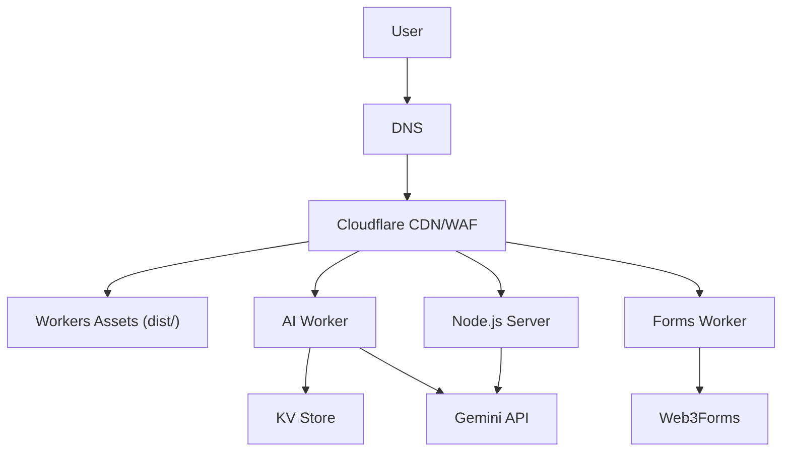

# Deployment Topology

<cite>
**Referenced Files in This Document**
- [wrangler.jsonc](file://wrangler.jsonc)
- [server.js](file://server.js)
- [package.json](file://package.json)
- [.github/workflows/quality-gate.yml](file://.github/workflows/quality-gate.yml)
- [.github/workflows/daily-blog.yml](file://.github/workflows/daily-blog.yml)
- [workers/webnovis-ai/wrangler.jsonc](file://workers/webnovis-ai/wrangler.jsonc)
- [workers/webnovis-forms/wrangler.jsonc](file://workers/webnovis-forms/wrangler.jsonc)
- [workers/webnovis-ai/src/index.js](file://workers/webnovis-ai/src/index.js)
- [workers/webnovis-forms/src/index.js](file://workers/webnovis-forms/src/index.js)
- [scripts/prepare-public-artifact.js](file://scripts/prepare-public-artifact.js)
- [docs/deploy/CLOUDFLARE-CONFIGURAZIONE-PASSO-PASSO.md](file://docs/deploy/CLOUDFLARE-CONFIGURAZIONE-PASSO-PASSO.md)
- [docs/deploy/DEPLOY-GITHUB.md](file://docs/deploy/DEPLOY-GITHUB.md)
</cite>

## Table of Contents
1. Introduction
2. Project Structure
3. Core Components
4. Architecture Overview
5. Detailed Component Analysis
6. Dependency Analysis
7. Performance Considerations
8. Troubleshooting Guide
9. Conclusion
10. Appendices

## Introduction
This document explains the flexible deployment topology that supports both traditional web hosting and modern edge computing platforms. It details a dual deployment strategy:
- Traditional Node.js Express server for API endpoints (chat, search AI, newsletter, lead capture).
- Edge-first static site with Cloudflare Workers Assets for fast global delivery, plus two Cloudflare Workers for AI chat/search and form submission.

It covers infrastructure requirements per mode, CI/CD automation, scaling considerations, network topology, environment configuration, secrets management, monitoring, and zero-downtime update procedures.

## Project Structure
The repository is organized to support multiple runtime targets from a single codebase:
- Static site build pipeline produces a sanitized public artifact under dist/.
- Cloudflare Workers Assets serve the static site with strict asset handling and redirects.
- A Node.js Express server provides backend APIs when needed.
- Two Cloudflare Workers provide edge services: AI chat/search and forms proxy.
- GitHub Actions automate quality gates, builds, and deployments.

**Diagram sources**
- [.github/workflows/quality-gate.yml:1-47](file://.github/workflows/quality-gate.yml#L1-L47)
- [.github/workflows/daily-blog.yml:1-56](file://.github/workflows/daily-blog.yml#L1-L56)
- [scripts/prepare-public-artifact.js:183-249](file://scripts/prepare-public-artifact.js#L183-L249)
- [wrangler.jsonc:1-30](file://wrangler.jsonc#L1-L30)
- [workers/webnovis-ai/src/index.js:508-543](file://workers/webnovis-ai/src/index.js#L508-L543)
- [workers/webnovis-forms/src/index.js:87-171](file://workers/webnovis-forms/src/index.js#L87-L171)
- [server.js:224-530](file://server.js#L224-L530)

**Section sources**
- [wrangler.jsonc:1-30](file://wrangler.jsonc#L1-L30)
- [scripts/prepare-public-artifact.js:183-249](file://scripts/prepare-public-artifact.js#L183-L249)
- [package.json:6-60](file://package.json#L6-L60)

## Core Components
- Static site build and artifact preparation:
  - Generates geo pages, search index, sitemap, LLMs exports, security headers sync, and prunes unreferenced assets into a clean dist/ artifact.
- Cloudflare Workers Assets:
  - Serves dist/ with html_handling set to none to preserve .html URLs and uses _redirects for directory indexes.
- Express server:
  - Provides /api/chat, /api/search-ai, newsletter endpoints, rate limiting, CORS, canonical redirects, and static file serving for development or traditional hosting.
- Cloudflare Workers:
  - AI worker: chat, search-ai, health, and lead capture with KV-backed sessions/rate limits and Gemini fallback models.
  - Forms worker: Turnstile verification then forwards to Web3Forms.

**Section sources**
- [scripts/prepare-public-artifact.js:87-249](file://scripts/prepare-public-artifact.js#L87-L249)
- [wrangler.jsonc:15-29](file://wrangler.jsonc#L15-L29)
- [server.js:224-530](file://server.js#L224-L530)
- [workers/webnovis-ai/src/index.js:12-24](file://workers/webnovis-ai/src/index.js#L12-L24)
- [workers/webnovis-forms/src/index.js:87-171](file://workers/webnovis-forms/src/index.js#L87-L171)

## Architecture Overview
The system supports two primary deployment modes:

- Mode A: Edge-first static site + edge workers
  - Static site built to dist/ and deployed via Cloudflare Workers Assets.
  - AI and forms run as Cloudflare Workers with KV storage and secrets.
  - Optional CDN/WAF rules at Cloudflare for security headers and source protection.

- Mode B: Traditional Node.js server
  - Express server serves static files and APIs on a Node.js runtime (e.g., Render/Railway/VPS).
  - Frontend can point to this backend for live chat/search; otherwise, edge workers can be used independently.

**Diagram sources**
- [wrangler.jsonc:15-29](file://wrangler.jsonc#L15-L29)
- [workers/webnovis-ai/src/index.js:198-247](file://workers/webnovis-ai/src/index.js#L198-L247)
- [workers/webnovis-forms/src/index.js:147-169](file://workers/webnovis-forms/src/index.js#L147-L169)
- [server.js:643-740](file://server.js#L643-L740)

## Detailed Component Analysis

### Dual Deployment Strategy
- Edge-first (recommended):
  - Build artifact via prepare-public-artifact.js and deploy with Wrangler to Workers Assets.
  - Use Cloudflare Transform Rules for CSP and WAF to block source exposure.
  - Deploy AI and Forms Workers with secrets via Wrangler.
- Traditional Node.js:
  - Run server.js on a Node.js host; serve static files and APIs.
  - Useful if you need server-side logic not yet moved to edge.

Infrastructure requirements:
- Edge-first:
  - Node.js for build tooling only.
  - Cloudflare account with Workers, KV namespace, and domain configured.
  - Secrets: GEMINI_API_KEY_CHAT, GEMINI_API_KEY_SEARCH, TURNSTILE_SECRET, optional BREVO keys.
- Traditional Node.js:
  - Node.js runtime (v20 recommended by CI).
  - Environment variables for API keys and admin secret.
  - Optional reverse proxy (Nginx/Traefik) for TLS and headers.

**Section sources**
- [wrangler.jsonc:1-30](file://wrangler.jsonc#L1-L30)
- [docs/deploy/CLOUDFLARE-CONFIGURAZIONE-PASSO-PASSO.md:28-159](file://docs/deploy/CLOUDFLARE-CONFIGURAZIONE-PASSO-PASSO.md#L28-L159)
- [docs/deploy/DEPLOY-GITHUB.md:51-64](file://docs/deploy/DEPLOY-GITHUB.md#L51-L64)
- [package.json:18-22](file://package.json#L18-L22)

### CI/CD Pipeline Architecture
- Quality Gate:
  - Installs dependencies, runs full build and validation, uploads dist/ artifact, and verifies production headers on main branch pushes.
- Daily Blog Writer:
  - Triggered manually or scheduled; generates articles using Gemini/Groq and commits changes.

**Diagram sources**
- [.github/workflows/quality-gate.yml:14-47](file://.github/workflows/quality-gate.yml#L14-L47)
- [package.json:46-53](file://package.json#L46-L53)

**Section sources**
- [.github/workflows/quality-gate.yml:1-47](file://.github/workflows/quality-gate.yml#L1-L47)
- [.github/workflows/daily-blog.yml:1-56](file://.github/workflows/daily-blog.yml#L1-L56)
- [package.json:46-53](file://package.json#L46-L53)

### AI Worker (Cloudflare)
- Endpoints: /api/health, /api/chat, /api/search-ai, /api/chat-lead.
- Rate limiting and session persistence via KV.
- Gemini model fallback chain for resilience.
- Local fallback responses when API keys are missing or errors occur.

**Diagram sources**
- [workers/webnovis-ai/src/index.js:266-368](file://workers/webnovis-ai/src/index.js#L266-L368)
- [workers/webnovis-ai/src/index.js:198-247](file://workers/webnovis-ai/src/index.js#L198-L247)
- [workers/webnovis-ai/wrangler.jsonc:19-25](file://workers/webnovis-ai/wrangler.jsonc#L19-L25)

**Section sources**
- [workers/webnovis-ai/src/index.js:12-24](file://workers/webnovis-ai/src/index.js#L12-L24)
- [workers/webnovis-ai/src/index.js:266-368](file://workers/webnovis-ai/src/index.js#L266-L368)
- [workers/webnovis-ai/wrangler.jsonc:1-26](file://workers/webnovis-ai/wrangler.jsonc#L1-L26)

### Forms Worker (Cloudflare)
- Validates Turnstile tokens server-side.
- Forwards form data to Web3Forms endpoint.
- Supports JSON or form-encoded payloads.

**Diagram sources**
- [workers/webnovis-forms/src/index.js:87-171](file://workers/webnovis-forms/src/index.js#L87-L171)

**Section sources**
- [workers/webnovis-forms/src/index.js:87-171](file://workers/webnovis-forms/src/index.js#L87-L171)
- [workers/webnovis-forms/wrangler.jsonc:1-20](file://workers/webnovis-forms/wrangler.jsonc#L1-L20)

### Express Server (Traditional Hosting)
- Serves static assets and HTML directories with appropriate cache headers.
- Implements canonical redirects, trailing slash normalization, UTM stripping, and legacy path redirects.
- Protects sensitive endpoints with rate limiting and admin secret authentication.
- Integrates search AI with Gemini and in-memory caching with deduplication.

**Diagram sources**
- [server.js:289-530](file://server.js#L289-L530)
- [server.js:643-740](file://server.js#L643-L740)

**Section sources**
- [server.js:224-530](file://server.js#L224-L530)
- [server.js:643-740](file://server.js#L643-L740)

## Dependency Analysis
- Build-time dependencies:
  - Node.js v20 (CI), Wrangler for Workers, minifiers, validators.
- Runtime dependencies:
  - Express server requires Node.js runtime and external APIs (Gemini).
  - Workers require Cloudflare runtime, KV namespaces, and secrets.
- External integrations:
  - Gemini API for AI chat/search.
  - Web3Forms for email delivery.
  - Cloudflare WAF/Transform Rules for security headers and source blocking.

**Diagram sources**
- [package.json:6-60](file://package.json#L6-L60)
- [wrangler.jsonc:1-30](file://wrangler.jsonc#L1-L30)
- [workers/webnovis-ai/wrangler.jsonc:1-26](file://workers/webnovis-ai/wrangler.jsonc#L1-L26)
- [workers/webnovis-forms/wrangler.jsonc:1-20](file://workers/webnovis-forms/wrangler.jsonc#L1-L20)

**Section sources**
- [package.json:69-90](file://package.json#L69-L90)
- [wrangler.jsonc:1-30](file://wrangler.jsonc#L1-L30)

## Performance Considerations
- Static asset optimization:
  - Asset pruning removes unreferenced media/fonts during artifact preparation.
  - Versioned CSS/JS can be cached immutably via Cloudflare Cache Rules.
- Edge caching:
  - Workers Assets with html_handling none preserves .html URLs and avoids unwanted redirects.
  - Short TTL for HTML with stale-while-revalidate improves freshness and performance.
- Concurrency and AI requests:
  - In-memory deduplication and TTL caches reduce redundant API calls on Express.
  - KV-backed rate limiting and session stores scale globally on Workers.
  - Model fallback chains improve resilience under high demand.
- Scaling strategies:
  - Prefer edge workers for stateless operations and small payloads.
  - Use KV for distributed sessions and caches.
  - Offload heavy generation tasks to background jobs or batched builds.

[No sources needed since this section provides general guidance]

## Troubleshooting Guide
- Missing production headers:
  - The Quality Gate enforces header checks; ensure Cloudflare Transform Rules are configured as documented.
- Source exposure:
  - Configure WAF custom rule to block access to sensitive paths and files.
- Chatbot not working on GitHub Pages:
  - GitHub Pages is static-only; use edge workers or a separate backend for live APIs.
- Forms submission failures:
  - Ensure TURNSTILE_SECRET and TURNSTILE_HOSTNAMES are set; verify Web3Forms endpoint availability.

**Section sources**
- [.github/workflows/quality-gate.yml:41-47](file://.github/workflows/quality-gate.yml#L41-L47)
- [docs/deploy/CLOUDFLARE-CONFIGURAZIONE-PASSO-PASSO.md:104-159](file://docs/deploy/CLOUDFLARE-CONFIGURAZIONE-PASSO-PASSO.md#L104-L159)
- [docs/deploy/DEPLOY-GITHUB.md:256-309](file://docs/deploy/DEPLOY-GITHUB.md#L256-L309)
- [workers/webnovis-forms/wrangler.jsonc:8-19](file://workers/webnovis-forms/wrangler.jsonc#L8-L19)

## Conclusion
The project implements a robust dual deployment strategy:
- Edge-first static site with Cloudflare Workers Assets for speed and reliability.
- Traditional Node.js server for environments requiring server-side execution.
Automated CI/CD ensures consistent builds, validations, and safe deployments. Security headers, WAF rules, and secrets management are enforced through repository-driven checks and platform configurations. Scaling is achieved via edge caching, KV-backed state, and resilient AI model fallbacks.

[No sources needed since this section summarizes without analyzing specific files]

## Appendices

### Network Topology Diagram

**Diagram sources**
- [wrangler.jsonc:15-29](file://wrangler.jsonc#L15-L29)
- [workers/webnovis-ai/src/index.js:198-247](file://workers/webnovis-ai/src/index.js#L198-L247)
- [workers/webnovis-forms/src/index.js:147-169](file://workers/webnovis-forms/src/index.js#L147-L169)
- [server.js:643-740](file://server.js#L643-L740)

### Environment-Specific Configuration and Secrets Management
- Cloudflare Workers:
  - Vars: SERVICE_NAME, ENVIRONMENT, TURNSTILE_HOSTNAMES, WEB3FORMS_ENDPOINT.
  - Secrets: GEMINI_API_KEY_CHAT, GEMINI_API_KEY_SEARCH, TURNSTILE_SECRET, BREVO_API_KEY.
- Express server:
  - Environment variables for API keys and admin secret; rate limiting enabled in production.
- CI/CD:
  - GitHub Actions secrets for Gemini and IndexNow keys used by blog writer workflow.

**Section sources**
- [workers/webnovis-ai/wrangler.jsonc:15-25](file://workers/webnovis-ai/wrangler.jsonc#L15-L25)
- [workers/webnovis-forms/wrangler.jsonc:8-19](file://workers/webnovis-forms/wrangler.jsonc#L8-L19)
- [server.js:75-107](file://server.js#L75-L107)
- [.github/workflows/daily-blog.yml:44-47](file://.github/workflows/daily-blog.yml#L44-L47)

### Monitoring Setup
- Observability:
  - Workers observability enabled with head sampling.
- Logging:
  - Bot access logs written to file on Express server.
- Health endpoints:
  - AI worker exposes /api/health; forms worker exposes /health.

**Section sources**
- [workers/webnovis-ai/wrangler.jsonc:11-14](file://workers/webnovis-ai/wrangler.jsonc#L11-L14)
- [server.js:395-429](file://server.js#L395-L429)
- [workers/webnovis-ai/src/index.js:519-526](file://workers/webnovis-ai/src/index.js#L519-L526)
- [workers/webnovis-forms/src/index.js:95-101](file://workers/webnovis-forms/src/index.js#L95-L101)

### Rollback Strategies, Blue-Green Deployments, and Zero-Downtime Updates
- Zero-downtime updates:
  - Workers Assets atomic publish replaces previous dist atomically; Wrangler supports dry-run before deploy.
  - Express server can use blue-green patterns by running two instances behind a load balancer and switching traffic.
- Rollbacks:
  - Re-deploy previous commit via Wrangler for Workers Assets.
  - For Express, switch back to previous instance or tag in container registry.
- Validation:
  - Quality Gate ensures artifact integrity and header compliance before promotion.

**Section sources**
- [wrangler.jsonc:4-13](file://wrangler.jsonc#L4-L13)
- [.github/workflows/quality-gate.yml:27-47](file://.github/workflows/quality-gate.yml#L27-L47)
- [scripts/prepare-public-artifact.js:158-181](file://scripts/prepare-public-artifact.js#L158-L181)