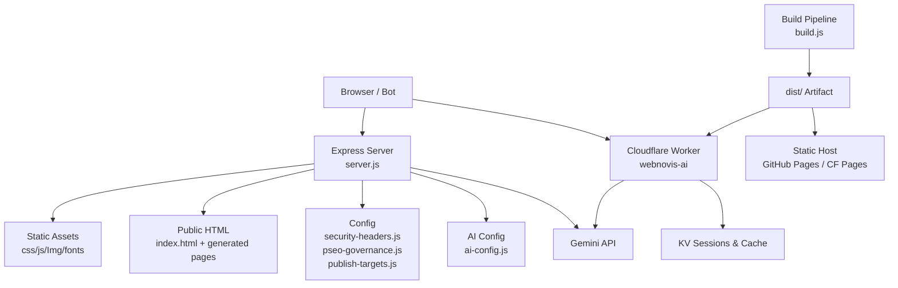
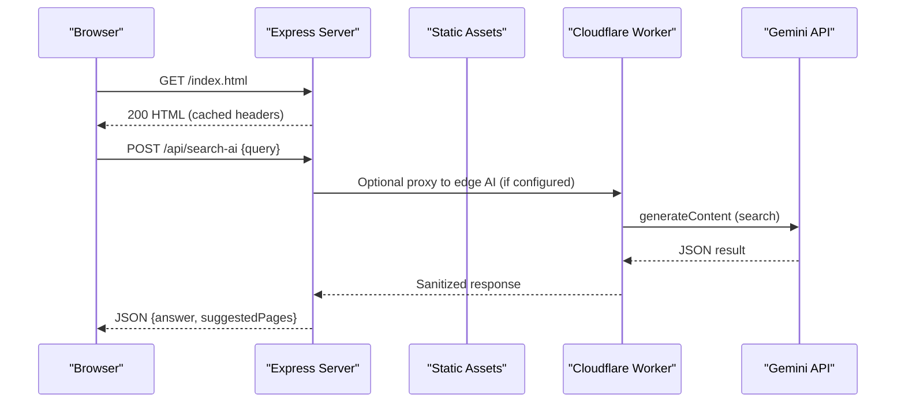
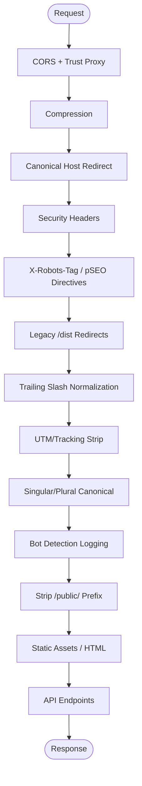
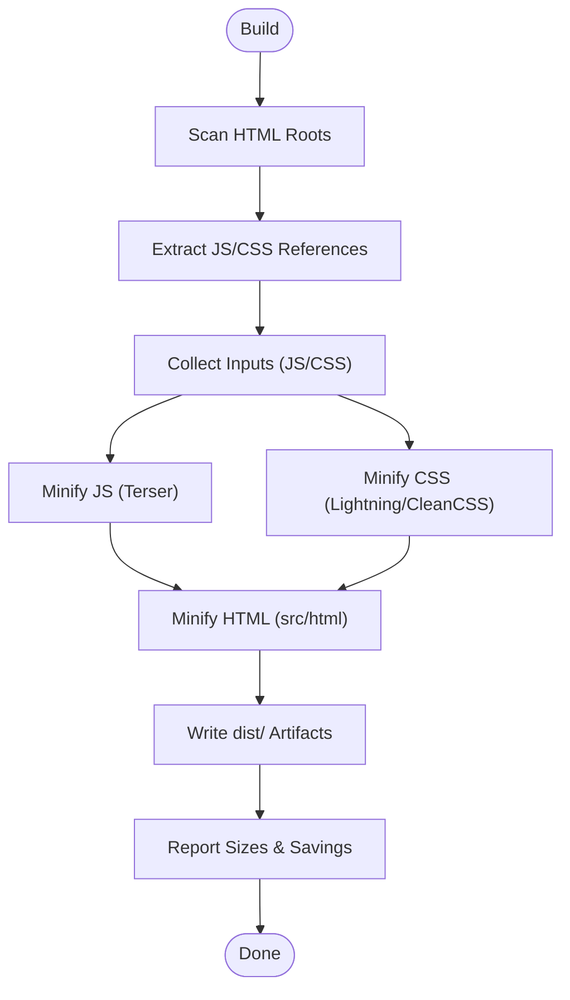
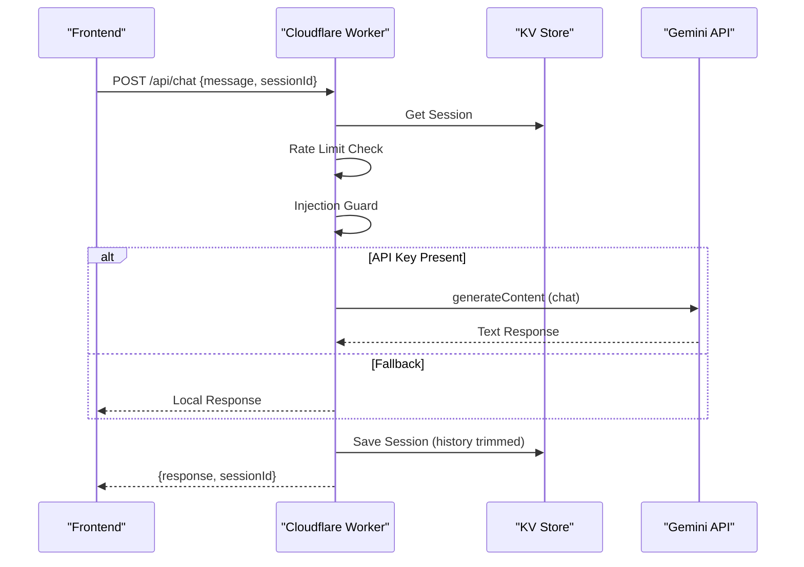
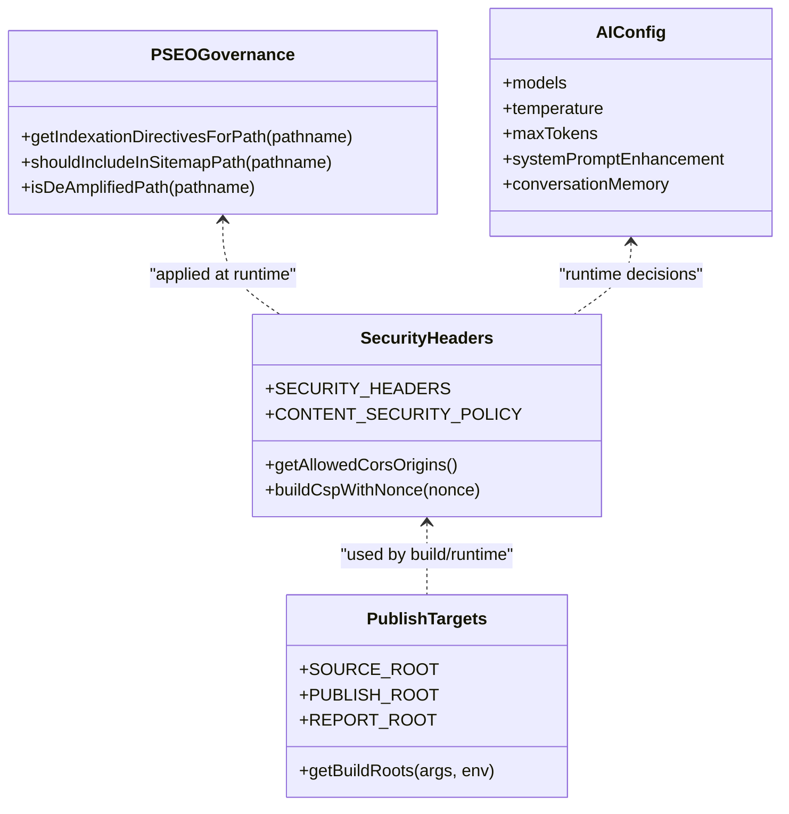
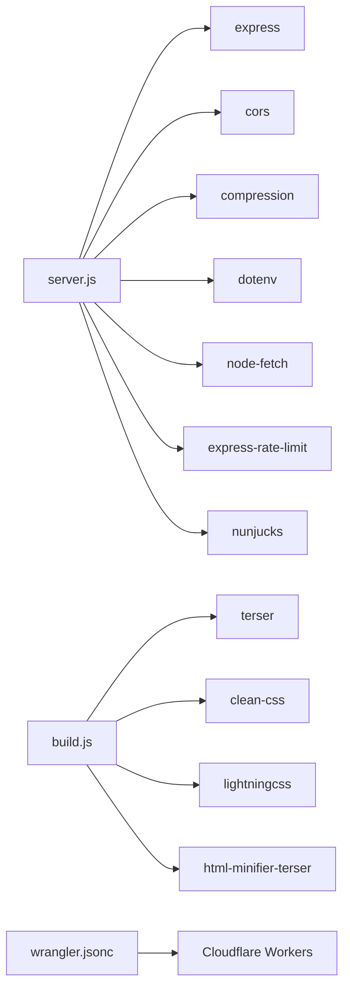

# System Architecture

<cite>
**Referenced Files in This Document**
- [server.js](file://server.js)
- [build.js](file://build.js)
- [package.json](file://package.json)
- [README.md](file://README.md)
- [config/security-headers.js](file://config/security-headers.js)
- [config/publish-targets.js](file://config/publish-targets.js)
- [workers/webnovis-ai/src/index.js](file://workers/webnovis-ai/src/index.js)
- [wrangler.jsonc](file://wrangler.jsonc)
- [ai-config.js](file://ai-config.js)
- [config/pseo-governance.js](file://config/pseo-governance.js)
</cite>

## Table of Contents
1. [Introduction](#introduction)
2. [Project Structure](#project-structure)
3. [Core Components](#core-components)
4. [Architecture Overview](#architecture-overview)
5. [Detailed Component Analysis](#detailed-component-analysis)
6. [Dependency Analysis](#dependency-analysis)
7. [Performance Considerations](#performance-considerations)
8. [Troubleshooting Guide](#troubleshooting-guide)
9. [Conclusion](#conclusion)
10. [Appendices](#appendices)

## Introduction
WebNovis is a dual-mode platform that supports both static site generation and dynamic runtime execution. In static mode, the site serves prebuilt HTML/CSS/JS assets suitable for traditional hosting or edge platforms. In Node mode, an Express server orchestrates request routing, middleware processing, security headers, caching, redirects, and API endpoints (chat, search AI, newsletter). A dedicated build pipeline transforms source templates and assets into optimized static artifacts ready for deployment to GitHub Pages, Cloudflare Workers, or other static hosts. The architecture emphasizes modularity, scalability, and maintainability while supporting both traditional hosting and modern edge deployments.

## Project Structure
At a high level:
- Runtime server: Express-based backend with middleware stack, static file serving, and API endpoints.
- Build pipeline: Asset minification, HTML minification, SEO transforms, and artifact preparation.
- Edge worker: Cloudflare Worker providing AI chat/search endpoints with KV-backed sessions and rate limiting.
- Configuration: Security headers, CORS, pSEO governance, publish targets, and AI model configuration.
- Scripts: Geo page generation, sitemap creation, search index building, validation, and CI tasks.

**Diagram sources**
- [server.js:224-530](file://server.js#L224-L530)
- [build.js:373-496](file://build.js#L373-L496)
- [workers/webnovis-ai/src/index.js:508-543](file://workers/webnovis-ai/src/index.js#L508-L543)
- [wrangler.jsonc:22-28](file://wrangler.jsonc#L22-L28)
- [config/security-headers.js:40-48](file://config/security-headers.js#L40-L48)
- [config/pseo-governance.js:279-287](file://config/pseo-governance.js#L279-L287)
- [config/publish-targets.js:21-27](file://config/publish-targets.js#L21-L27)
- [ai-config.js:3-37](file://ai-config.js#L3-L37)

**Section sources**
- [README.md:53-58](file://README.md#L53-L58)
- [package.json:6-59](file://package.json#L6-L59)

## Core Components
- Express server: Central orchestrator for routing, middleware, static asset serving, canonical redirects, security headers, bot logging, and API endpoints.
- Build pipeline: Scans HTML, discovers JS/CSS references, minifies assets, applies SEO transforms, and outputs optimized artifacts.
- Cloudflare Worker: Edge AI service for chat and search with rate limiting, session persistence via KV, and fallback responses.
- Configuration modules: Security headers, CORS allowlists, pSEO governance for indexation control, and publish target resolution.
- AI configuration: Shared model names, parameters, and behavior flags used by both server and worker.

**Section sources**
- [server.js:224-530](file://server.js#L224-L530)
- [build.js:373-496](file://build.js#L373-L496)
- [workers/webnovis-ai/src/index.js:508-543](file://workers/webnovis-ai/src/index.js#L508-L543)
- [config/security-headers.js:40-48](file://config/security-headers.js#L40-L48)
- [config/pseo-governance.js:279-287](file://config/pseo-governance.js#L279-L287)
- [config/publish-targets.js:21-27](file://config/publish-targets.js#L21-L27)
- [ai-config.js:3-37](file://ai-config.js#L3-L37)

## Architecture Overview
The platform operates in two modes:
- Static mode: Serves prebuilt HTML/CSS/JS from a static host. No backend APIs are available; features like AI chat/search fall back to client-side logic or are disabled.
- Node mode: Runs the Express server, enabling API endpoints, runtime security headers, canonical redirects, compression, and advanced caching strategies.

**Diagram sources**
- [server.js:289-384](file://server.js#L289-L384)
- [server.js:441-530](file://server.js#L441-L530)
- [workers/webnovis-ai/src/index.js:370-440](file://workers/webnovis-ai/src/index.js#L370-L440)
- [workers/webnovis-ai/src/index.js:198-247](file://workers/webnovis-ai/src/index.js#L198-L247)

## Detailed Component Analysis

### Express Server (Central Orchestrator)
Responsibilities:
- Middleware stack: CORS, compression, trust proxy, JSON parsing, canonical host redirect, security headers, robots directives, legacy redirects, trailing slash normalization, UTM stripping, singular/plural canonicalization, bot detection logging, public prefix stripping.
- Static asset serving: CSS, JS, images, fonts with environment-aware cache headers.
- Public HTML serving: Core files and auto-discovered pSEO pages with appropriate caching.
- API endpoints: Chat, search AI, newsletter admin (rate-limited), session management, quota tracking, prompt injection guards.
- Governance: Indexation directives based on pSEO allowlists.

**Diagram sources**
- [server.js:264-439](file://server.js#L264-L439)
- [server.js:441-530](file://server.js#L441-L530)

Key implementation highlights:
- Security headers sourced from centralized config module.
- pSEO governance applied per path to set noindex/follow for non-indexable GEO pages.
- Rate limiting for chat and search APIs to prevent abuse.
- Quota tracking for Gemini keys to avoid runaway spend.
- Prompt injection guard patterns to block malicious inputs.

**Section sources**
- [server.js:224-530](file://server.js#L224-L530)
- [config/security-headers.js:40-48](file://config/security-headers.js#L40-L48)
- [config/pseo-governance.js:279-287](file://config/pseo-governance.js#L279-L287)

### Build Pipeline
Responsibilities:
- Discover HTML files and extract referenced JS/CSS assets.
- Minify JS using Terser with strict options and per-file overrides.
- Minify CSS using Lightning CSS with CleanCSS fallback for compatibility.
- Minify HTML from src/html to output paths, applying SEO transforms.
- Report sizes, savings, and errors; exit with code on failures.

**Diagram sources**
- [build.js:242-279](file://build.js#L242-L279)
- [build.js:290-371](file://build.js#L290-L371)
- [build.js:428-496](file://build.js#L428-L496)

Design principles:
- Modularity: Separate concerns for JS, CSS, and HTML minification.
- Resilience: Fallback from Lightning CSS to CleanCSS when needed.
- Observability: Detailed logs with size metrics and error reporting.

**Section sources**
- [build.js:373-496](file://build.js#L373-L496)

### Cloudflare Worker (Edge AI Service)
Responsibilities:
- Provide health, chat, search AI, and lead capture endpoints.
- Enforce rate limiting per IP using KV-backed counters.
- Manage sessions with TTL and message limits.
- Call Gemini with primary/fallback models and robust error handling.
- Apply prompt injection guards and sanitize results.
- Integrate with Brevo for lead notifications.

**Diagram sources**
- [workers/webnovis-ai/src/index.js:266-368](file://workers/webnovis-ai/src/index.js#L266-L368)
- [workers/webnovis-ai/src/index.js:178-196](file://workers/webnovis-ai/src/index.js#L178-L196)
- [workers/webnovis-ai/src/index.js:141-151](file://workers/webnovis-ai/src/index.js#L141-L151)
- [workers/webnovis-ai/src/index.js:198-247](file://workers/webnovis-ai/src/index.js#L198-L247)

**Section sources**
- [workers/webnovis-ai/src/index.js:508-543](file://workers/webnovis-ai/src/index.js#L508-L543)

### Configuration Modules
- Security headers: Centralized CSP, HSTS, permissions policy, and cache rules for static assets.
- Publish targets: Resolve source and publish directories via CLI args or environment variables.
- pSEO governance: Allowlist-based indexation control for GEO pages, including tiered sets and removed paths.
- AI configuration: Shared model names, parameters, and behavior flags across server and worker.

**Diagram sources**
- [config/security-headers.js:40-48](file://config/security-headers.js#L40-L48)
- [config/publish-targets.js:21-27](file://config/publish-targets.js#L21-L27)
- [config/pseo-governance.js:279-287](file://config/pseo-governance.js#L279-L287)
- [ai-config.js:3-37](file://ai-config.js#L3-L37)

**Section sources**
- [config/security-headers.js:40-48](file://config/security-headers.js#L40-L48)
- [config/publish-targets.js:21-27](file://config/publish-targets.js#L21-L27)
- [config/pseo-governance.js:279-287](file://config/pseo-governance.js#L279-L287)
- [ai-config.js:3-37](file://ai-config.js#L3-L37)

## Dependency Analysis
Runtime dependencies:
- Express, CORS, compression, dotenv, node-fetch, express-rate-limit, nunjucks.
- Dev dependencies include minifiers (terser, clean-css, html-minifier-terser), lightningcss, wrangler, vitest, sharp.

Build-time dependencies:
- Asset discovery and minification rely on terser, clean-css, lightningcss, html-minifier-terser.
- Publishing targets resolved via publish-targets module.

Deployment targets:
- Static host (GitHub Pages, Netlify, Vercel) for pure static mode.
- Cloudflare Workers for edge deployment with assets directory and specific HTML handling.

**Diagram sources**
- [package.json:69-89](file://package.json#L69-L89)
- [wrangler.jsonc:22-28](file://wrangler.jsonc#L22-L28)

**Section sources**
- [package.json:69-89](file://package.json#L69-L89)
- [wrangler.jsonc:22-28](file://wrangler.jsonc#L22-L28)

## Performance Considerations
- Compression enabled for text assets to reduce transfer size.
- Environment-aware caching: immutable long-lived caching for static assets in production; no-cache in development.
- Stale-while-revalidate for HTML to improve perceived performance.
- In-memory caches for search AI results with TTL and deduplication of concurrent queries.
- KV-backed rate limiting and session storage in the worker for scalable edge performance.
- Quota tracking prevents runaway API usage and ensures cost control.

[No sources needed since this section provides general guidance]

## Troubleshooting Guide
Common issues and mitigations:
- Missing rate limiter dependency in production: Server refuses to start without express-rate-limit in production; install the package.
- Placeholder admin secret: Startup warning if NEWSLETTER_ADMIN_SECRET remains default; configure securely before deploying.
- Compression not installed: Warning logged; optional but recommended for performance.
- HTML minification skipped: If html-minifier-terser is not installed, HTML minification step is skipped; install for optimal payload size.
- AI API key missing: Search/chat endpoints return fallback responses; ensure GEMINI_API_KEY_SEARCH/GEMINI_API_KEY_CHAT are configured.
- KV not available: Worker falls back to in-memory behavior for rate limiting and sessions; deploy with KV enabled for full functionality.

**Section sources**
- [server.js:95-107](file://server.js#L95-L107)
- [server.js:228-232](file://server.js#L228-L232)
- [server.js:234-249](file://server.js#L234-L249)
- [build.js:428-496](file://build.js#L428-L496)
- [workers/webnovis-ai/src/index.js:141-151](file://workers/webnovis-ai/src/index.js#L141-L151)

## Conclusion
WebNovis employs a dual-mode architecture that balances static efficiency with dynamic capabilities. The Express server centralizes routing, middleware, security, and API orchestration, while the build pipeline produces optimized static artifacts for broad hosting compatibility. The Cloudflare Worker extends functionality to the edge with resilient AI services, rate limiting, and session management. Design principles of modularity, scalability, and maintainability guide the system structure, enabling support for both traditional hosting and modern edge deployment scenarios.

[No sources needed since this section summarizes without analyzing specific files]

## Appendices

### Deployment Modes
- Static mode: Suitable for GitHub Pages and other static hosts; backend APIs are unavailable.
- Node mode: Enables full feature set including AI endpoints, runtime security headers, and advanced caching.
- Edge mode: Deploy static assets to Cloudflare Workers with specific HTML handling to preserve URL semantics.

**Section sources**
- [README.md:53-58](file://README.md#L53-L58)
- [wrangler.jsonc:22-28](file://wrangler.jsonc#L22-L28)