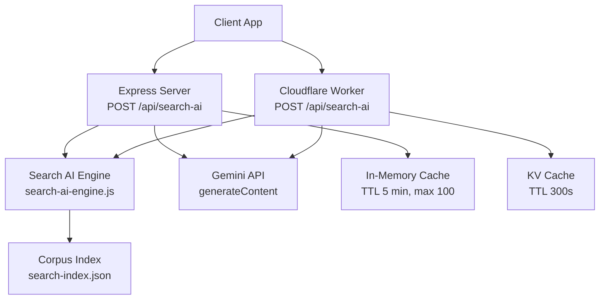
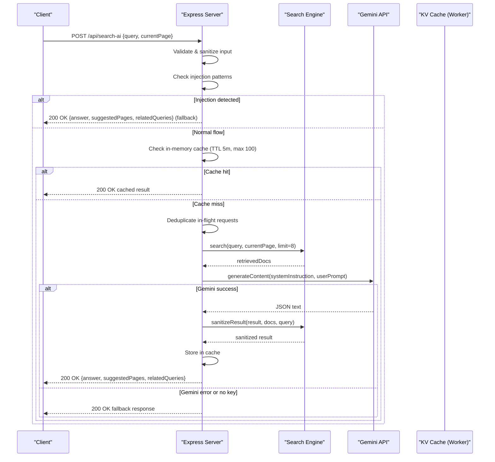
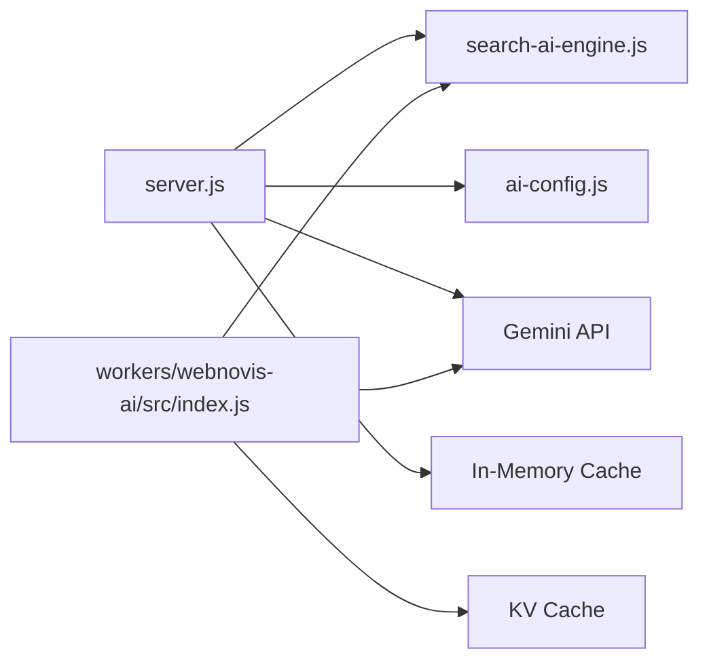

# AI Search API

<cite>
**Referenced Files in This Document**
- [server.js](file://server.js)
- [search-ai-engine.js](file://search-ai-engine.js)
- [ai-config.js](file://ai-config.js)
- [workers/webnovis-ai/src/index.js](file://workers/webnovis-ai/src/index.js)
- [tests/api-endpoints.test.js](file://tests/api-endpoints.test.js)
</cite>

## Table of Contents
1. [Introduction](#introduction)
2. [Project Structure](#project-structure)
3. [Core Components](#core-components)
4. [Architecture Overview](#architecture-overview)
5. [Detailed Component Analysis](#detailed-component-analysis)
6. [Dependency Analysis](#dependency-analysis)
7. [Performance Considerations](#performance-considerations)
8. [Troubleshooting Guide](#troubleshooting-guide)
9. [Conclusion](#conclusion)
10. [Appendices](#appendices)

## Introduction
This document provides detailed API documentation for the AI-powered search endpoint POST /api/search-ai. It covers request/response schemas, authentication (none required), rate limiting, error handling, caching and deduplication, prompt injection protection, fallback behavior when Gemini is unavailable, quota management, performance optimization, and integration patterns for client applications.

## Project Structure
The AI search feature is implemented across two runtime targets:
- Node/Express server (server.js) with an in-memory cache and in-flight deduplication
- Cloudflare Worker (workers/webnovis-ai/src/index.js) with KV-based caching and rate limiting

Both implementations share a common search engine module that loads a corpus index, ranks documents, builds prompts, sanitizes results, and constructs safe fallback responses.

**Diagram sources**
- [server.js:634-815](file://server.js#L634-L815)
- [workers/webnovis-ai/src/index.js:370-440](file://workers/webnovis-ai/src/index.js#L370-L440)
- [search-ai-engine.js:201-390](file://search-ai-engine.js#L201-L390)

**Section sources**
- [server.js:634-815](file://server.js#L634-L815)
- [workers/webnovis-ai/src/index.js:370-440](file://workers/webnovis-ai/src/index.js#L370-L440)
- [search-ai-engine.js:201-390](file://search-ai-engine.js#L201-L390)

## Core Components
- Endpoint: POST /api/search-ai
- Authentication: None required
- Rate limiting: 10 requests per minute per IP
- Request body: query (string, 3–500 chars), currentPage (optional path)
- Response: JSON object with answer, suggestedPages, relatedQueries
- Caching:
  - Express: in-memory Map with 5-minute TTL and 100-entry limit
  - Worker: KV store with 300-second TTL
- In-flight deduplication: Coalesces concurrent identical queries to one Gemini call
- Prompt injection protection: Blocks suspicious inputs and returns safe fallback
- Fallback: When Gemini API key missing or API errors occur, returns a local fallback response built from ranked documents
- Quota management: Daily usage tracking with warnings and hard cap for Gemini keys

**Section sources**
- [server.js:634-815](file://server.js#L634-L815)
- [workers/webnovis-ai/src/index.js:370-440](file://workers/webnovis-ai/src/index.js#L370-L440)
- [search-ai-engine.js:273-362](file://search-ai-engine.js#L273-L362)
- [ai-config.js:1-38](file://ai-config.js#L1-L38)

## Architecture Overview
The endpoint validates input, sanitizes the query, checks for prompt injection, applies rate limiting, then either serves cached data or calls Gemini. Results are sanitized against allowed URLs and returned as JSON. Errors and missing keys trigger a safe fallback response.

**Diagram sources**
- [server.js:634-815](file://server.js#L634-L815)
- [search-ai-engine.js:232-362](file://search-ai-engine.js#L232-L362)
- [workers/webnovis-ai/src/index.js:370-440](file://workers/webnovis-ai/src/index.js#L370-L440)

## Detailed Component Analysis

### Endpoint: POST /api/search-ai
- Path: /api/search-ai
- Method: POST
- Content-Type: application/json
- Authentication: None
- Rate Limiting: 10 requests per minute per IP
- Request Body Schema:
  - query: string, length 3–500
  - currentPage: optional string path; normalized and validated
- Response Schema:
  - answer: string (safe, truncated)
  - suggestedPages: array of objects
    - title: string
    - url: string (normalized, allowed)
    - relevance: number (clamped between 0 and 0.99)
  - relatedQueries: array of strings (max 4)

Example valid request:
- POST /api/search-ai
- Headers: Content-Type: application/json
- Body: {"query": "sviluppo siti web milano", "currentPage": "/"}

Example successful response:
- Status: 200 OK
- Body: {"answer":"...","suggestedPages":[{"title":"...","url":"/servizi/sviluppo-siti-web.html","relevance":0.95}],"relatedQueries":["..."]}

Error scenarios:
- 400 Bad Request: Invalid query (missing, wrong type, too short/long)
- 429 Too Many Requests: Rate limit exceeded (10 req/min per IP)
- 200 OK with fallback: Missing API key or Gemini error; still returns structured response

Notes:
- The endpoint never exposes API keys to clients
- All URLs in suggestedPages are validated against the corpus index

**Section sources**
- [server.js:634-815](file://server.js#L634-L815)
- [workers/webnovis-ai/src/index.js:370-440](file://workers/webnovis-ai/src/index.js#L370-L440)
- [search-ai-engine.js:324-362](file://search-ai-engine.js#L324-L362)
- [tests/api-endpoints.test.js:103-110](file://tests/api-endpoints.test.js#L103-L110)

### Request Validation and Sanitization
- Query validation: must be a string with length between 3 and 500 characters
- HTML stripping and truncation applied to prevent injection and control payload size
- currentPage normalization: ensures canonical paths without fragments or query strings

**Section sources**
- [server.js:743-754](file://server.js#L743-L754)
- [workers/webnovis-ai/src/index.js:370-385](file://workers/webnovis-ai/src/index.js#L370-L385)
- [search-ai-engine.js:46-52](file://search-ai-engine.js#L46-L52)

### Rate Limiting
- 10 requests per minute per IP
- Implemented via express-rate-limit on the server and custom rate limiting in the worker
- Standard headers enabled for client retry guidance

**Section sources**
- [server.js:634-641](file://server.js#L634-L641)
- [workers/webnovis-ai/src/index.js:379-382](file://workers/webnovis-ai/src/index.js#L379-L382)

### Caching Mechanism
- Express server:
  - In-memory Map cache
  - TTL: 5 minutes
  - Max entries: 100 (oldest evicted first)
- Worker:
  - KV-backed cache
  - TTL: 300 seconds
  - Key includes normalized query and currentPage

Cache key construction normalizes whitespace and path to ensure consistent hits.

**Section sources**
- [server.js:646-668](file://server.js#L646-L668)
- [workers/webnovis-ai/src/index.js:397-402](file://workers/webnovis-ai/src/index.js#L397-L402)
- [search-ai-engine.js:376-378](file://search-ai-engine.js#L376-L378)

### In-Flight Deduplication
- Concurrent identical queries coalesce into a single Gemini call
- Prevents redundant API usage during bursts
- Failed in-flight requests fall through to initiate a new call

**Section sources**
- [server.js:650-651](file://server.js#L650-L651)
- [server.js:779-803](file://server.js#L779-L803)

### Prompt Injection Protection
- Regex-based guard detects known injection patterns in Italian and English
- If detected, returns a safe fallback response instead of calling Gemini
- Protects system instructions and prevents misuse

**Section sources**
- [server.js:129-178](file://server.js#L129-L178)
- [server.js:756-762](file://server.js#L756-L762)
- [workers/webnovis-ai/src/index.js:388-390](file://workers/webnovis-ai/src/index.js#L388-L390)

### Fallback Mechanisms
- Triggered when:
  - GEMINI_API_KEY_SEARCH is not configured
  - Gemini API returns an error
  - JSON parsing fails (robust extraction attempted)
- Returns a structured response with answer, suggestedPages, and relatedQueries derived from ranked documents
- Ensures continuity even when external services are unavailable

**Section sources**
- [server.js:764-771](file://server.js#L764-L771)
- [server.js:719-740](file://server.js#L719-L740)
- [search-ai-engine.js:273-322](file://search-ai-engine.js#L273-L322)
- [workers/webnovis-ai/src/index.js:392-395](file://workers/webnovis-ai/src/index.js#L392-L395)
- [workers/webnovis-ai/src/index.js:419-439](file://workers/webnovis-ai/src/index.js#L419-L439)

### Quota Management
- Daily counters per Gemini key with configurable thresholds
- Warns at 80% usage and blocks further calls at 100%
- Helps prevent runaway spend and abuse

**Section sources**
- [server.js:180-220](file://server.js#L180-L220)

### Error Handling
- Input validation errors return 400 with a concise error message
- Rate limit exceeded returns 429 with retry guidance
- Unexpected errors log details and return a safe fallback response
- Tests validate invalid query handling and graceful fallback when API key is missing

**Section sources**
- [server.js:743-749](file://server.js#L743-L749)
- [server.js:805-814](file://server.js#L805-L814)
- [workers/webnovis-ai/src/index.js:375-382](file://workers/webnovis-ai/src/index.js#L375-L382)
- [tests/api-endpoints.test.js:103-110](file://tests/api-endpoints.test.js#L103-L110)

## Dependency Analysis
The endpoint depends on:
- Express server middleware for CORS, compression, security headers, and rate limiting
- Search engine module for indexing, ranking, prompting, and sanitization
- Gemini API for generating answers (with fallback)
- Caching layers (in-memory and KV) for performance
- Configuration for model selection and parameters

**Diagram sources**
- [server.js:634-815](file://server.js#L634-L815)
- [search-ai-engine.js:201-390](file://search-ai-engine.js#L201-L390)
- [ai-config.js:1-38](file://ai-config.js#L1-L38)
- [workers/webnovis-ai/src/index.js:370-440](file://workers/webnovis-ai/src/index.js#L370-L440)

**Section sources**
- [server.js:634-815](file://server.js#L634-L815)
- [search-ai-engine.js:201-390](file://search-ai-engine.js#L201-L390)
- [ai-config.js:1-38](file://ai-config.js#L1-L38)
- [workers/webnovis-ai/src/index.js:370-440](file://workers/webnovis-ai/src/index.js#L370-L440)

## Performance Considerations
- Compression middleware reduces transfer sizes for text assets
- Pre-warming fetch avoids cold-start latency
- In-memory cache with TTL and LRU eviction improves throughput
- In-flight deduplication reduces redundant Gemini calls under burst traffic
- KV caching in workers persists results across instances
- Strict input limits and sanitization mitigate DoS risks
- Quota monitoring prevents excessive API consumption

[No sources needed since this section provides general guidance]

## Troubleshooting Guide
Common issues and resolutions:
- 400 Bad Request: Ensure query is a string with length between 3 and 500 characters
- 429 Too Many Requests: Wait before retrying; respect Retry-After header if present
- Empty or malformed response: Check network connectivity and Gemini availability; fallback should still provide structured data
- Missing suggestedPages: Verify corpus index exists and contains indexable documents
- High latency: Inspect cache hit rates and consider increasing cache TTL or reducing concurrent load

Operational tips:
- Monitor logs for Gemini errors and quota warnings
- Validate environment variables for API keys
- Use health endpoints to verify service readiness

**Section sources**
- [server.js:743-749](file://server.js#L743-L749)
- [server.js:805-814](file://server.js#L805-L814)
- [workers/webnovis-ai/src/index.js:375-382](file://workers/webnovis-ai/src/index.js#L375-L382)
- [tests/api-endpoints.test.js:103-110](file://tests/api-endpoints.test.js#L103-L110)

## Conclusion
The POST /api/search-ai endpoint delivers intelligent, grounded search results with robust protections and high availability. It enforces strict input validation, rate limiting, prompt injection safeguards, and provides reliable fallbacks when external services are unavailable. Caching and deduplication optimize performance, while quota management protects against abuse and cost overruns. Clients can integrate confidently using the documented schema and error handling strategies.

[No sources needed since this section summarizes without analyzing specific files]

## Appendices

### Integration Patterns for Client Applications
- Always send Content-Type: application/json
- Include query and optional currentPage in the request body
- Handle 400 and 429 status codes gracefully
- Expect structured JSON responses even in error/fallback cases
- Implement retry logic respecting rate limit headers
- Cache responses locally to reduce repeated requests

**Section sources**
- [server.js:634-815](file://server.js#L634-L815)
- [workers/webnovis-ai/src/index.js:370-440](file://workers/webnovis-ai/src/index.js#L370-L440)
- [tests/api-endpoints.test.js:103-110](file://tests/api-endpoints.test.js#L103-L110)