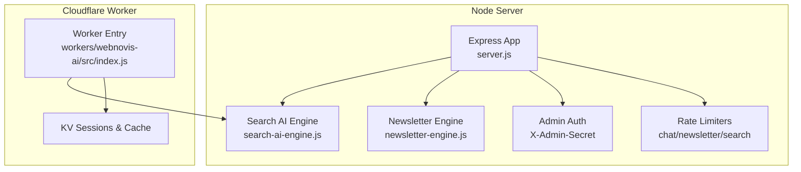
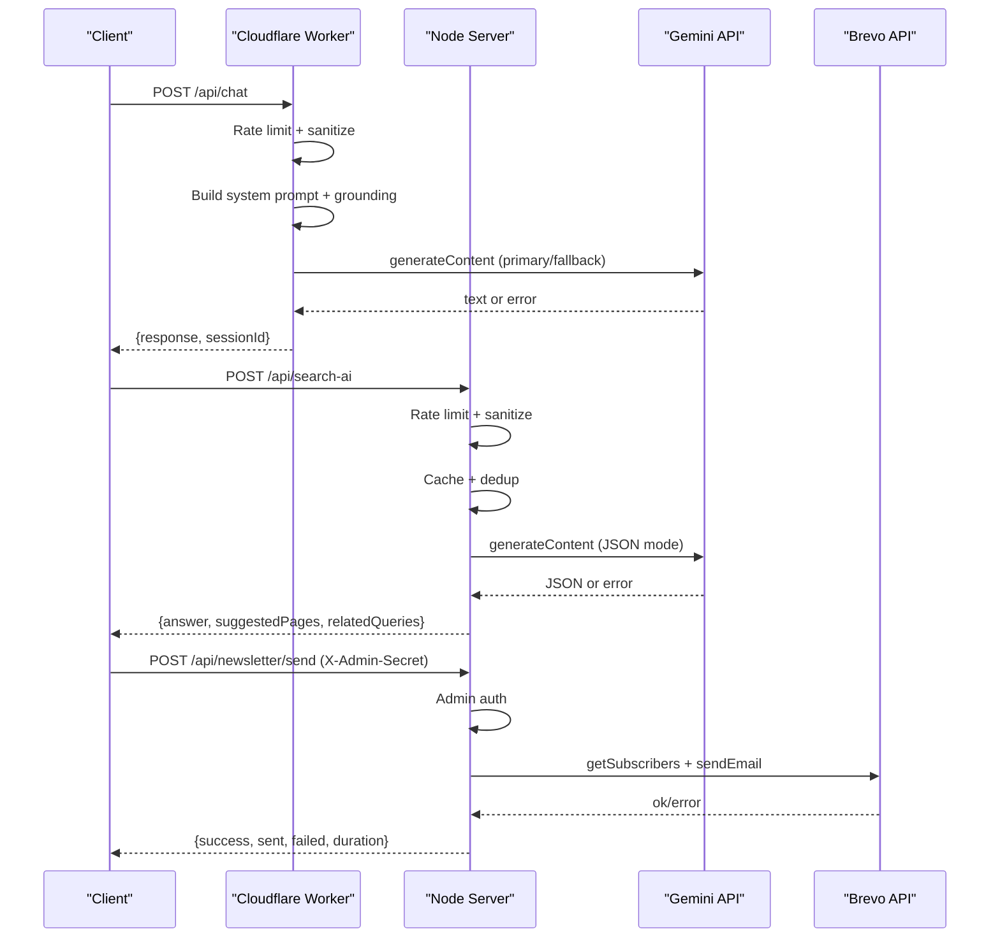
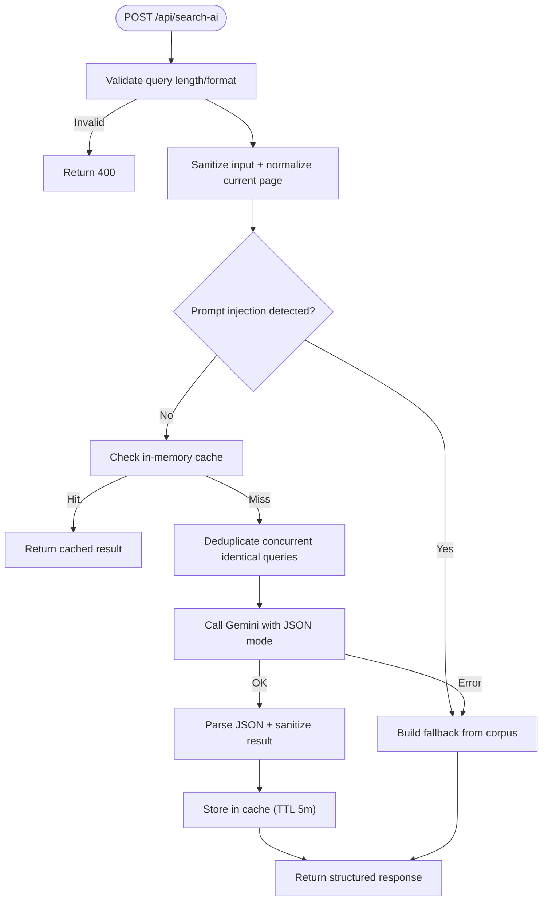
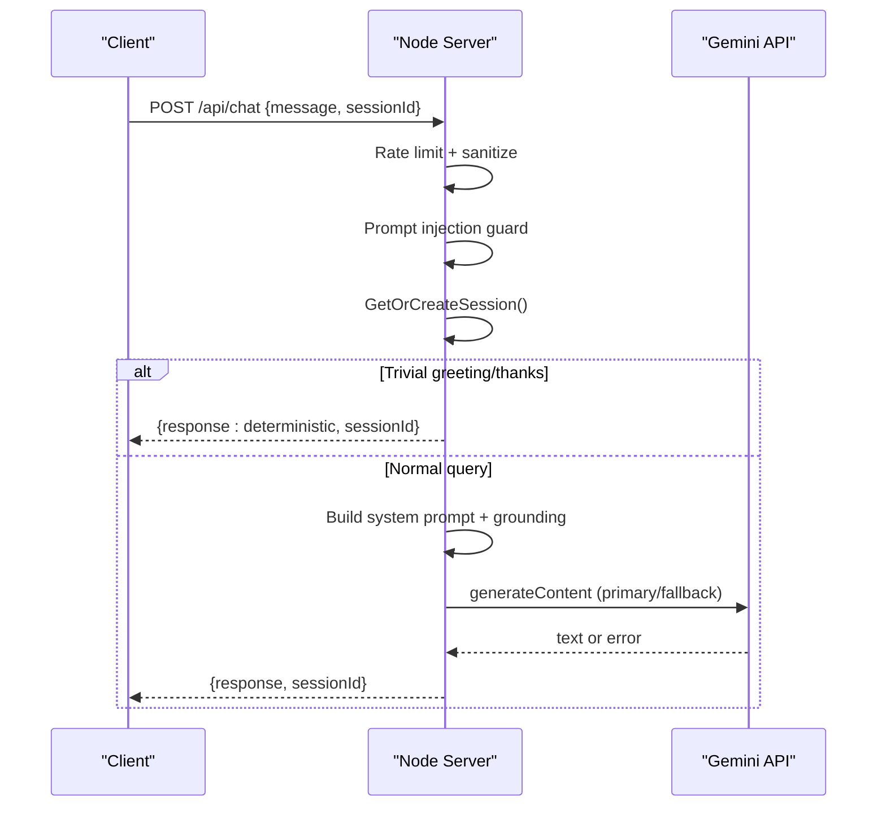
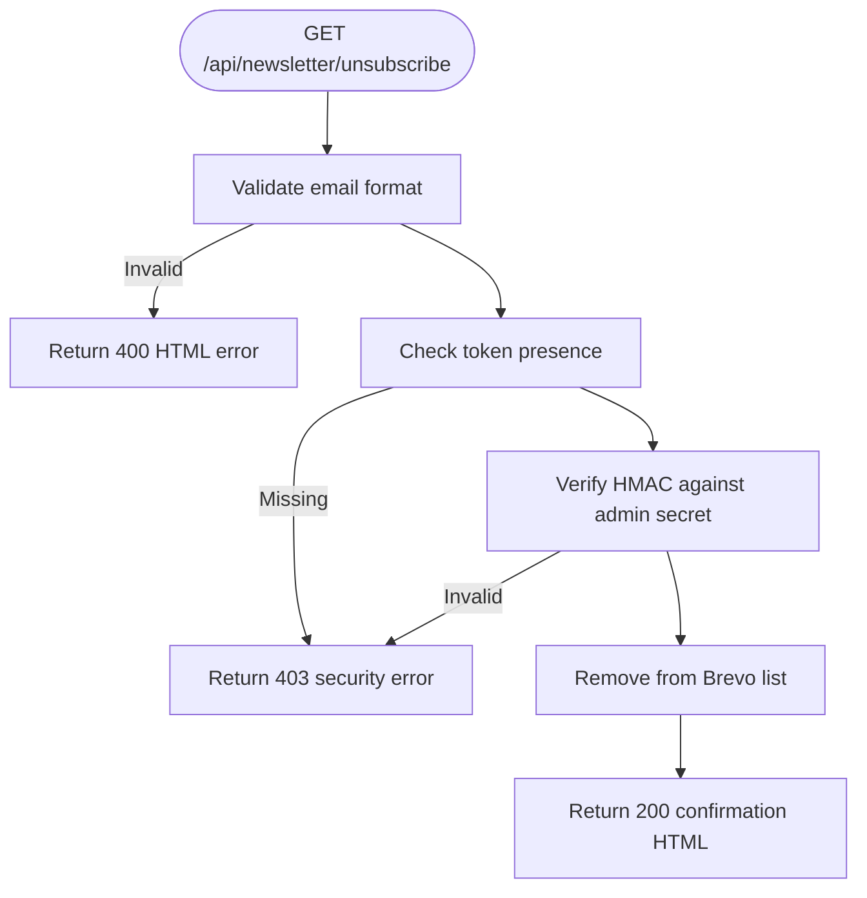
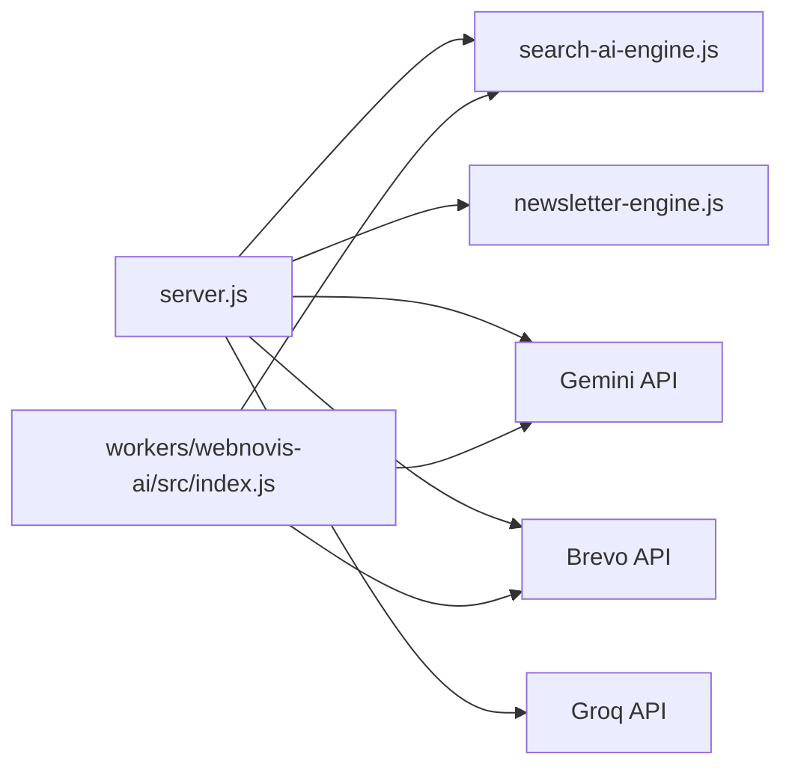

# API Endpoints Reference

<cite>
**Referenced Files in This Document**
- [server.js](file://server.js)
- [workers/webnovis-ai/src/index.js](file://workers/webnovis-ai/src/index.js)
- [newsletter-engine.js](file://newsletter-engine.js)
- [search-ai-engine.js](file://search-ai-engine.js)
- [tests/api-endpoints.test.js](file://tests/api-endpoints.test.js)
</cite>

## Table of Contents
1. [Introduction](#introduction)
2. [Project Structure](#project-structure)
3. [Core Components](#core-components)
4. [Architecture Overview](#architecture-overview)
5. [Detailed Component Analysis](#detailed-component-analysis)
6. [Dependency Analysis](#dependency-analysis)
7. [Performance Considerations](#performance-considerations)
8. [Troubleshooting Guide](#troubleshooting-guide)
9. [Conclusion](#conclusion)

## Introduction
This document provides a comprehensive API reference for the WebNovis REST endpoints, focusing on:
- AI search endpoint (/api/search-ai): request/response schemas, authentication, rate limiting, error handling, and fallback behavior.
- Chat endpoint (/api/chat): session management, conversation history, message formatting, and fallback mechanisms.
- Newsletter management endpoints: admin authentication via X-Admin-Secret header, send/preview/subscribers/unsubscribe flows.
- Health check endpoints and standardized error response formats.
- Rate limiting policies, quota management, and common use cases with concrete examples.

The system exposes two runtime surfaces:
- Node.js Express server (server.js) hosting most endpoints.
- Cloudflare Worker (workers/webnovis-ai/src/index.js) exposing /api/health, /api/chat, /api/search-ai, and /api/chat-lead.

## Project Structure
Key files relevant to the API surface:
- server.js: Express application defining all REST endpoints, middleware, rate limiters, admin auth, and integrations.
- workers/webnovis-ai/src/index.js: Cloudflare Worker implementing health, chat, search-ai, and chat-lead endpoints with KV-backed sessions and rate limiting.
- newsletter-engine.js: Newsletter content generation (Groq), email sending (Brevo), unsubscribe flow, and subscriber listing.
- search-ai-engine.js: In-memory search engine used by both server and worker to build prompts, rank documents, and produce fallback responses.
- tests/api-endpoints.test.js: Smoke tests validating key behaviors like invalid queries, graceful fallbacks, and unsubscribe security.

**Diagram sources**
- [server.js:252-262](file://server.js#L252-L262)
- [server.js:625-641](file://server.js#L625-L641)
- [server.js:76-93](file://server.js#L76-L93)
- [newsletter-engine.js:1](file://newsletter-engine.js#L1-L30)
- [search-ai-engine.js:201-230](file://search-ai-engine.js#L201-L230)
- [workers/webnovis-ai/src/index.js:10-24](file://workers/webnovis-ai/src/index.js#L10-L24)

**Section sources**
- [server.js:1-120](file://server.js#L1-L120)
- [workers/webnovis-ai/src/index.js:1-120](file://workers/webnovis-ai/src/index.js#L1-L120)

## Core Components
- AI Search Engine: Builds prompts from indexed corpus, ranks pages, sanitizes results, and produces structured JSON answers with suggested pages and related queries.
- Chat Session Manager: Maintains server-side conversation history per session, enforces token limits, and applies prompt injection guards.
- Newsletter Engine: Generates HTML content via Groq, sends emails via Brevo, manages unsubscribes with HMAC tokens, and lists subscribers.
- Security and Limits: Global CORS, compression, IP anonymization, prompt-injection guard, per-endpoint rate limiters, and daily API quotas.

**Section sources**
- [search-ai-engine.js:201-390](file://search-ai-engine.js#L201-L390)
- [server.js:584-619](file://server.js#L584-L619)
- [newsletter-engine.js:259-349](file://newsletter-engine.js#L259-L349)
- [server.js:95-107](file://server.js#L95-L107)

## Architecture Overview
The API is served by two runtimes:
- Node server handles most endpoints including chat, search-ai, newsletter operations, lead capture, and health checks.
- Cloudflare Worker provides lightweight endpoints for health, chat, search-ai, and chat-lead with KV-backed persistence and rate limiting.

**Diagram sources**
- [workers/webnovis-ai/src/index.js:266-368](file://workers/webnovis-ai/src/index.js#L266-L368)
- [server.js:743-815](file://server.js#L743-L815)
- [server.js:1339-1361](file://server.js#L1339-L1361)
- [newsletter-engine.js:192-227](file://newsletter-engine.js#L192-L227)

## Detailed Component Analysis

### AI Search Endpoint: POST /api/search-ai
- Purpose: Intelligent site search powered by Gemini using an in-memory corpus index. Returns a structured answer, suggested pages, and related queries.
- Authentication: None required. Protected by rate limiter and optional API key presence.
- Rate Limiting: 10 requests per minute per IP (Node server). Worker uses KV-based rate limiting with configurable limits.
- Quota Management: Daily usage tracked per Gemini key; warns at 80% and blocks at 100%.
- Request Schema:
  - Body: JSON object
    - query: string (required, min 3 chars, max 500)
    - currentPage: string (optional, normalized path)
- Response Schema:
  - answer: string
  - suggestedPages: array of { title: string, url: string, relevance: number }
  - relatedQueries: array of strings
- Fallback Behavior: If no API key or quota exceeded, returns a deterministic fallback built from the corpus.
- Error Handling:
  - 400: Invalid query length/format
  - 429: Rate limited
  - 5xx: Internal errors return fallback response to keep UI functional
- Example Call:
  - curl -X POST https://www.webnovis.com/api/search-ai -H "Content-Type: application/json" -d '{"query":"sviluppo siti web a milano","currentPage":"/servizi"}'
  - Expected 200 with structured JSON even when API keys are missing.

**Diagram sources**
- [server.js:743-815](file://server.js#L743-L815)
- [search-ai-engine.js:232-322](file://search-ai-engine.js#L232-L322)

**Section sources**
- [server.js:634-641](file://server.js#L634-L641)
- [server.js:183-220](file://server.js#L183-L220)
- [search-ai-engine.js:201-390](file://search-ai-engine.js#L201-L390)
- [tests/api-endpoints.test.js:103-110](file://tests/api-endpoints.test.js#L103-L110)

### Chat Endpoint: POST /api/chat
- Purpose: Conversational assistant with server-side session history, prompt injection guard, and Gemini-powered responses.
- Authentication: None required. Protected by rate limiter and daily quota.
- Rate Limiting: 30 requests per 15 minutes per IP (Node server). Worker uses KV-based rate limiting.
- Session Management:
  - Server-side Map stores sessions with lastActivity timestamps.
  - Max messages per session enforced; oldest sessions evicted under memory pressure.
  - Worker persists sessions via KV with TTL.
- Request Schema:
  - Body: JSON object
    - message: string (required, sanitized, max 500)
    - sessionId: string (optional; server generates if missing)
- Response Schema:
  - response: string (sanitized text)
  - sessionId: string (stable across turns)
  - Optional fields: fallback boolean (worker only)
- Fallback Behavior:
  - Deterministic local responses for trivial greetings/thanks.
  - If Gemini unavailable or quota exceeded, returns local fallback while preserving session.
- Error Handling:
  - 400: Invalid message
  - 429: Rate limited
  - 500: Internal error (may return fallback depending on config)
- Example Call:
  - curl -X POST https://www.webnovis.com/api/chat -H "Content-Type: application/json" -d '{"message":"Ciao, quanto costa un sito vetrina?","sessionId":"abc123"}'

**Diagram sources**
- [server.js:1126-1279](file://server.js#L1126-L1279)
- [workers/webnovis-ai/src/index.js:266-368](file://workers/webnovis-ai/src/index.js#L266-L368)

**Section sources**
- [server.js:252-262](file://server.js#L252-L262)
- [server.js:584-619](file://server.js#L584-L619)
- [workers/webnovis-ai/src/index.js:178-196](file://workers/webnovis-ai/src/index.js#L178-L196)

### Newsletter Management Endpoints
All admin endpoints require X-Admin-Secret header matching NEWSLETTER_ADMIN_SECRET.

- POST /api/newsletter/send
  - Purpose: Generate and send AI-powered newsletter to all subscribers.
  - Request: { topic: string, subject: string }
  - Response: { success: boolean, skipped: boolean, subscriberCount: number, sent: number, failed: number, errors: array, duration: string, edition: string }
  - Errors: 400 missing params, 500 internal error
  - Example: curl -X POST https://www.webnovis.com/api/newsletter/send -H "X-Admin-Secret: YOUR_SECRET" -H "Content-Type: application/json" -d '{"topic":"SEO trends 2026","subject":"WebNovis Digest — Gennaio 2026"}'

- GET /api/newsletter/preview
  - Purpose: Preview generated newsletter content without sending.
  - Query: ?topic=string&name=string
  - Response: HTML preview
  - Errors: 500 internal error

- GET /api/newsletter/subscribers
  - Purpose: List subscribers from Brevo.
  - Response: { count: number, contacts: [{ email: string, name: string }] }
  - Errors: 500 internal error

- GET /api/newsletter/unsubscribe
  - Purpose: GDPR-compliant unsubscribe via HMAC token.
  - Query: ?email=string&token=string
  - Response: HTML confirmation page
  - Errors: 400 invalid email, 403 missing/invalid token, 503 service not configured

**Diagram sources**
- [server.js:1412-1498](file://server.js#L1412-L1498)
- [newsletter-engine.js:352-385](file://newsletter-engine.js#L352-L385)

**Section sources**
- [server.js:76-93](file://server.js#L76-L93)
- [server.js:1339-1361](file://server.js#L1339-L1361)
- [server.js:1365-1399](file://server.js#L1365-L1399)
- [server.js:1402-1409](file://server.js#L1402-L1409)
- [newsletter-engine.js:259-349](file://newsletter-engine.js#L259-L349)

### Health Check Endpoints
- GET /api/health (Node server)
  - Response: { status: "ok", message: "Server is awake and running! 🚀" }
  - Status: 200

- GET /api/health (Cloudflare Worker)
  - Response: { status: "ok", service: "webnovis-ai", platform: "cloudflare-workers", corpusSize: number, time: string }
  - Status: 200

**Section sources**
- [server.js:818-820](file://server.js#L818-L820)
- [workers/webnovis-ai/src/index.js:519-526](file://workers/webnovis-ai/src/index.js#L519-L526)

### Additional Endpoints
- POST /api/lead: Captures leads from 404 page, logs to file, optionally saves to Brevo and sends notification email.
- POST /api/chat-lead: Captures high-intent chat users, logs to file, optionally sends notification email.
- GET /api/config: Returns safe configuration (admin-only).

**Section sources**
- [server.js:901-1022](file://server.js#L901-L1022)
- [server.js:1025-1093](file://server.js#L1025-L1093)
- [server.js:1328-1331](file://server.js#L1328-L1331)

## Dependency Analysis
- External APIs:
  - Gemini API: Used for chat and search-ai responses with primary/fallback models.
  - Brevo API: Used for newsletter sending, subscriber management, and transactional emails.
  - Groq API: Used for newsletter content generation.
- Internal Dependencies:
  - search-ai-engine.js: Provides indexing, ranking, prompt building, and fallback logic.
  - newsletter-engine.js: Handles content generation, email sending, and unsubscribe flows.
- Security Dependencies:
  - express-rate-limit: Rate limiting (required in production).
  - crypto: Timing-safe comparisons for admin secrets and unsubscribe tokens.

**Diagram sources**
- [server.js:1-20](file://server.js#L1-L20)
- [newsletter-engine.js:1-30](file://newsletter-engine.js#L1-L30)
- [search-ai-engine.js:1-30](file://search-ai-engine.js#L1-L30)
- [workers/webnovis-ai/src/index.js:1-20](file://workers/webnovis-ai/src/index.js#L1-L20)

**Section sources**
- [server.js:1-20](file://server.js#L1-L20)
- [newsletter-engine.js:1-30](file://newsletter-engine.js#L1-L30)
- [search-ai-engine.js:1-30](file://search-ai-engine.js#L1-L30)
- [workers/webnovis-ai/src/index.js:1-20](file://workers/webnovis-ai/src/index.js#L1-L20)

## Performance Considerations
- Caching:
  - Search AI: In-memory cache with 5-minute TTL and 100-entry limit; concurrent query deduplication.
  - Worker: KV-backed cache for search results with expiration.
- Compression: Brotli/Gzip enabled for text assets reducing transfer size ~70%.
- Rate Limiting: Per-IP limits prevent abuse and manage external API costs.
- Quota Management: Daily counters warn at 80% and block at 100% to prevent runaway spend.
- Memory Management: Session eviction under pressure; periodic cleanup of expired sessions.

[No sources needed since this section provides general guidance]

## Troubleshooting Guide
Common issues and resolutions:
- Missing API Keys:
  - Chat/Search fallback to local responses when GEMINI_API_KEY_CHAT or GEMINI_API_KEY_SEARCH is not configured.
  - Newsletter operations skip if BREVO_API_KEY or GROQ_API_KEY are not set.
- Rate Limiting:
  - 429 responses indicate too many requests; implement retry with exponential backoff.
- Prompt Injection:
  - Requests matching injection patterns return safe responses without calling external APIs.
- Unsubscribe Token Validation:
  - 403 errors occur if token is missing or invalid; ensure proper HMAC generation.
- Health Checks:
  - Use /api/health to verify service availability during deployment.

**Section sources**
- [server.js:1160-1177](file://server.js#L1160-L1177)
- [server.js:743-771](file://server.js#L743-L771)
- [server.js:1412-1498](file://server.js#L1412-L1498)
- [tests/api-endpoints.test.js:103-116](file://tests/api-endpoints.test.js#L103-L116)

## Conclusion
The WebNovis API provides robust, secure, and scalable endpoints for AI-powered search, conversational chat, and newsletter management. Key strengths include:
- Comprehensive security measures: prompt injection guards, admin authentication, timing-safe comparisons, and IP anonymization.
- Resilient fallback mechanisms ensuring functionality even when external APIs are unavailable.
- Efficient caching and rate limiting to optimize performance and control costs.
- Clear error handling and standardized response formats for easy integration.

For optimal integration, clients should:
- Implement proper error handling and retry logic for rate-limited endpoints.
- Respect rate limits and implement exponential backoff strategies.
- Use provided health check endpoints for monitoring and deployment validation.
- Securely manage admin secrets and unsubscribe tokens.