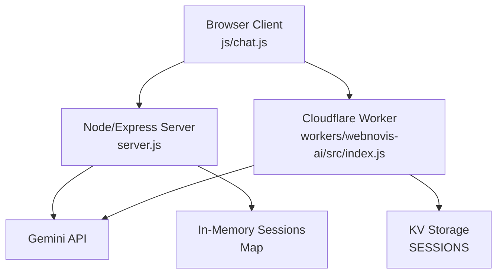
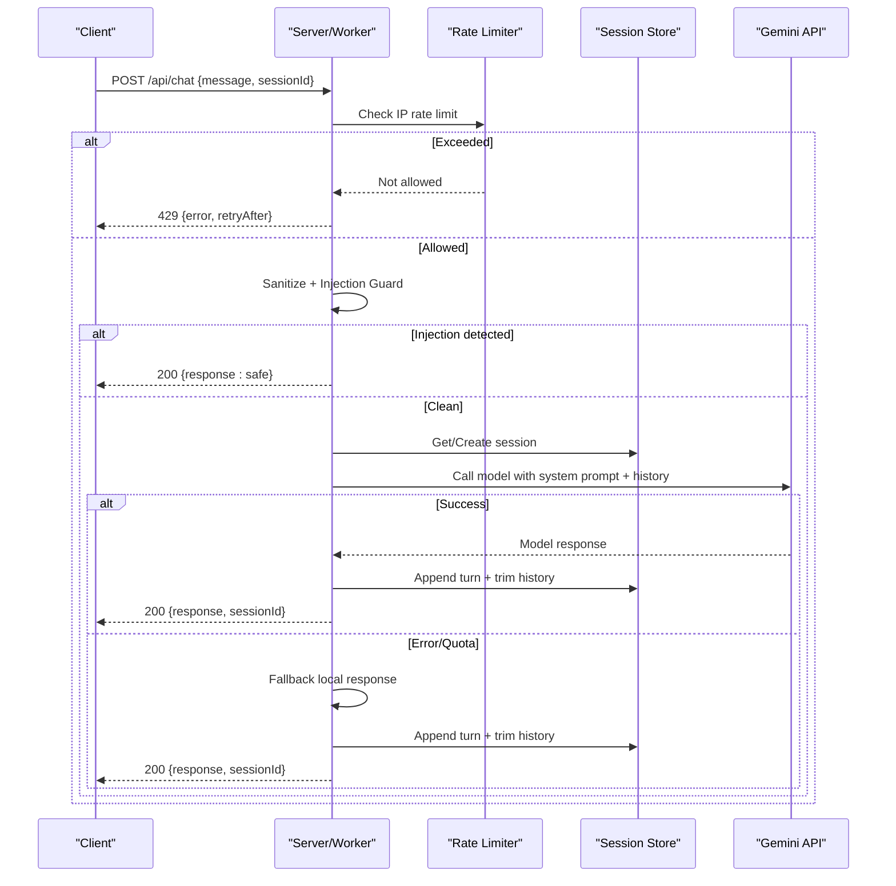
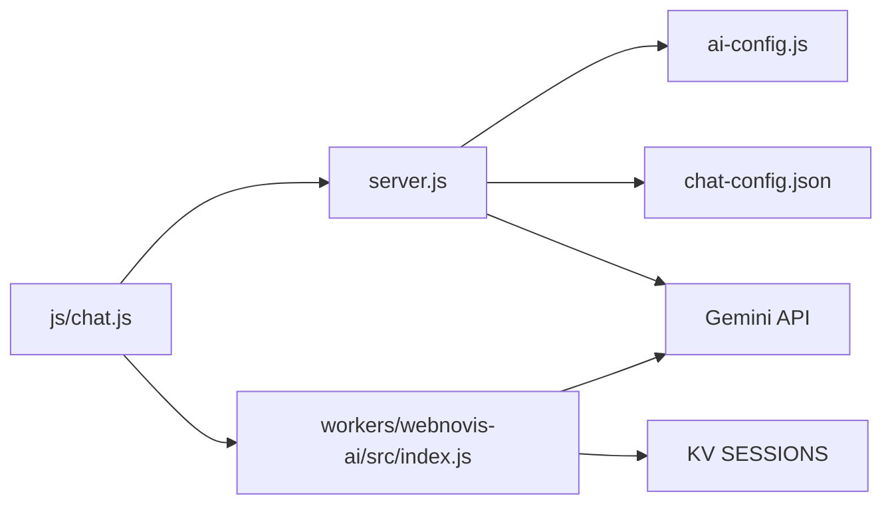

# Chat API

<cite>
**Referenced Files in This Document**
- [server.js](file://server.js)
- [ai-config.js](file://ai-config.js)
- [chat-config.json](file://chat-config.json)
- [workers/webnovis-ai/src/index.js](file://workers/webnovis-ai/src/index.js)
- [js/chat.js](file://js/chat.js)
</cite>

## Table of Contents
1. [Introduction](#introduction)
2. [Project Structure](#project-structure)
3. [Core Components](#core-components)
4. [Architecture Overview](#architecture-overview)
5. [Detailed Component Analysis](#detailed-component-analysis)
6. [Dependency Analysis](#dependency-analysis)
7. [Performance Considerations](#performance-considerations)
8. [Troubleshooting Guide](#troubleshooting-guide)
9. [Conclusion](#conclusion)
10. [Appendices](#appendices)

## Introduction
This document provides comprehensive API documentation for the chatbot conversation endpoint POST /api/chat. It covers request/response schemas, session management, conversation history handling, message processing, rate limiting, prompt injection protection, safety responses, and integration patterns across both the Node/Express server and the Cloudflare Worker implementation.

## Project Structure
The chat API is implemented in two runtime environments:
- Node/Express server (server.js): In-memory session store with strict limits and robust fallbacks.
- Cloudflare Worker (workers/webnovis-ai/src/index.js): KV-backed sessions and rate limiting with similar behavior.

The frontend client (js/chat.js) manages UI, local session persistence, retries, and lead intent signaling.

**Diagram sources**
- [server.js:584-619](file://server.js#L584-L619)
- [workers/webnovis-ai/src/index.js:178-196](file://workers/webnovis-ai/src/index.js#L178-L196)
- [js/chat.js:533-558](file://js/chat.js#L533-L558)

**Section sources**
- [server.js:584-619](file://server.js#L584-L619)
- [workers/webnovis-ai/src/index.js:178-196](file://workers/webnovis-ai/src/index.js#L178-L196)
- [js/chat.js:533-558](file://js/chat.js#L533-L558)

## Core Components
- POST /api/chat: Main conversation endpoint that validates input, sanitizes messages, applies rate limiting and injection guards, manages sessions, builds context, calls the AI model, and returns a response with an updated sessionId.
- Session store:
  - Node/Express: In-memory Map with 30-minute TTL, 20-message limit per session, and up to 1000 concurrent sessions.
  - Cloudflare Worker: KV-backed sessions with TTL and message trimming.
- Rate limiting: 30 requests per 15 minutes per IP.
- Prompt injection protection: Regex-based guard blocks known attack patterns and returns a safe response.
- Safety and fallback: Local deterministic responses when AI is unavailable or quota exceeded; graceful degradation.

**Section sources**
- [server.js:252-262](file://server.js#L252-L262)
- [server.js:584-619](file://server.js#L584-L619)
- [server.js:1123-1279](file://server.js#L1123-L1279)
- [workers/webnovis-ai/src/index.js:19-24](file://workers/webnovis-ai/src/index.js#L19-L24)
- [workers/webnovis-ai/src/index.js:141-151](file://workers/webnovis-ai/src/index.js#L141-L151)
- [workers/webnovis-ai/src/index.js:266-367](file://workers/webnovis-ai/src/index.js#L266-L367)

## Architecture Overview
The endpoint enforces security and reliability through layered checks before invoking the AI model.

**Diagram sources**
- [server.js:252-262](file://server.js#L252-L262)
- [server.js:1123-1279](file://server.js#L1123-L1279)
- [workers/webnovis-ai/src/index.js:141-151](file://workers/webnovis-ai/src/index.js#L141-L151)
- [workers/webnovis-ai/src/index.js:266-367](file://workers/webnovis-ai/src/index.js#L266-L367)

## Detailed Component Analysis

### Endpoint: POST /api/chat
- Purpose: Process a user message within a session and return an AI-generated or fallback response.
- Request body:
  - message: string (required). Max length enforced by client and server (up to 500 characters after sanitization).
  - sessionId: string (optional). If missing or invalid, server assigns one.
  - currentPage/page: string (optional). Used for grounding context on some implementations.
- Response body:
  - response: string (the assistant’s reply).
  - sessionId: string (updated or assigned by server).
  - Optional fields: error (on validation/rate-limit), retryAfter (on rate-limit), fallback (in worker when using local fallback).

Processing steps:
1. Validate presence and type of message.
2. Sanitize input: strip HTML tags, trim, cap length.
3. Apply prompt injection guard; if matched, return a safe canned response.
4. Retrieve or create session from server-side store.
5. Determine deterministic local response for trivial greetings/thanks (server only).
6. If AI key present and quota available, call Gemini with system prompt and server-tracked history.
7. On success, append user+assistant turns to session history (trimmed to configured max).
8. Return response and sessionId.

Error handling:
- 400: Invalid message.
- 429: Rate limited (with retryAfter guidance).
- 500: Internal error (unless fallback enabled, then returns 200 with local response).

Security measures:
- Input sanitization strips HTML to prevent injection into prompts.
- Prompt injection guard blocks known attack patterns early.
- Server-side session store prevents history forgery; client-sent history is ignored.
- Quota monitoring caps daily API usage per key.

Integration notes:
- The client sends sessionId and accepts updated sessionId from the server.
- The client persists a short local history for UX but relies on server for authoritative context.

**Section sources**
- [server.js:1123-1279](file://server.js#L1123-L1279)
- [workers/webnovis-ai/src/index.js:266-367](file://workers/webnovis-ai/src/index.js#L266-L367)
- [js/chat.js:533-558](file://js/chat.js#L533-L558)

### Session Management
- Node/Express:
  - In-memory Map keyed by sessionId.
  - TTL: 30 minutes since last activity; cleaned every 5 minutes.
  - Max concurrent sessions: 1000; oldest evicted when capacity reached.
  - History limit: 20 messages per session.
- Cloudflare Worker:
  - KV storage under keys like chat:{sessionId}.
  - TTL: 30 minutes expirationTtl.
  - History trimmed to last N messages on save.

Behavior:
- If no sessionId provided or invalid, server generates a new one.
- Each request updates lastActivity timestamp.
- History appended with alternating roles (user/model) for AI context.

**Section sources**
- [server.js:584-619](file://server.js#L584-L619)
- [workers/webnovis-ai/src/index.js:178-196](file://workers/webnovis-ai/src/index.js#L178-L196)

### Message Processing and Context
- Deterministic local responses:
  - Pure greetings and thanks are answered locally to save tokens.
- Grounding context:
  - For longer messages, a concise internal context may be injected to improve relevance.
- System prompt:
  - Built from chat configuration and company info; cached at startup.
- Model invocation:
  - Primary model with optional fallback model on transient errors.
  - Generation config includes temperature, maxOutputTokens, topP.

**Section sources**
- [server.js:1103-1121](file://server.js#L1103-L1121)
- [server.js:541-582](file://server.js#L541-L582)
- [workers/webnovis-ai/src/index.js:153-176](file://workers/webnovis-ai/src/index.js#L153-L176)
- [workers/webnovis-ai/src/index.js:198-236](file://workers/webnovis-ai/src/index.js#L198-L236)

### Rate Limiting
- Node/Express:
  - 30 requests per 15 minutes per IP via express-rate-limit middleware.
  - Returns 429 with error and retryAfter guidance.
- Cloudflare Worker:
  - KV-based sliding window limiter with same limits.
  - Returns 429 with retryAfter guidance.

**Section sources**
- [server.js:252-262](file://server.js#L252-L262)
- [workers/webnovis-ai/src/index.js:19-24](file://workers/webnovis-ai/src/index.js#L19-L24)
- [workers/webnovis-ai/src/index.js:141-151](file://workers/webnovis-ai/src/index.js#L141-L151)

### Prompt Injection Protection and Safety Responses
- Pattern matching detects direct and indirect injection attempts in multiple languages.
- When detected, returns a safe canned response without calling the AI.
- Additional safeguards:
  - Input sanitization removes HTML tags.
  - Strict role enforcement in history (user/model).
  - Quota monitoring prevents runaway spend.

**Section sources**
- [server.js:129-178](file://server.js#L129-L178)
- [workers/webnovis-ai/src/index.js:35-68](file://workers/webnovis-ai/src/index.js#L35-L68)
- [server.js:1134-1143](file://server.js#L1134-L1143)
- [workers/webnovis-ai/src/index.js:276-286](file://workers/webnovis-ai/src/index.js#L276-L286)

### Error Handling and Fallbacks
- Validation errors: 400 with descriptive message.
- Rate limit exceeded: 429 with retryAfter guidance.
- AI failures:
  - Retryable errors trigger fallback model (if configured).
  - If all models fail and fallback enabled, returns local response with 200.
  - Otherwise returns 500 with generic error.

**Section sources**
- [server.js:1236-1279](file://server.js#L1236-L1279)
- [workers/webnovis-ai/src/index.js:322-367](file://workers/webnovis-ai/src/index.js#L322-L367)

### Integration Patterns
- Client responsibilities:
  - Send message and optional sessionId.
  - Accept and use updated sessionId from response.
  - Persist local history for UX; rely on server for authoritative context.
  - Implement retries with backoff and handle degraded mode.
- Lead capture:
  - Client can fire-and-forget a separate lead signal when intent is detected.

**Section sources**
- [js/chat.js:430-479](file://js/chat.js#L430-L479)
- [js/chat.js:533-558](file://js/chat.js#L533-L558)
- [js/chat.js:582-601](file://js/chat.js#L582-L601)

## Dependency Analysis
- server.js depends on:
  - ai-config.js for model names and generation parameters.
  - chat-config.json for system prompt content and company data.
  - Express middleware for CORS, compression, and rate limiting.
  - External Gemini API for AI responses.
- workers/webnovis-ai/src/index.js depends on:
  - KV storage (env.SESSIONS) for sessions and caching.
  - Search engine utilities for grounding context.
  - External Gemini API for AI responses.
- js/chat.js depends on:
  - Network fetch to call /api/chat and /api/chat-lead.
  - LocalStorage for session persistence and recent history.

**Diagram sources**
- [server.js:541-582](file://server.js#L541-L582)
- [workers/webnovis-ai/src/index.js:153-176](file://workers/webnovis-ai/src/index.js#L153-L176)
- [js/chat.js:533-558](file://js/chat.js#L533-L558)

**Section sources**
- [server.js:541-582](file://server.js#L541-L582)
- [workers/webnovis-ai/src/index.js:153-176](file://workers/webnovis-ai/src/index.js#L153-L176)
- [js/chat.js:533-558](file://js/chat.js#L533-L558)

## Performance Considerations
- Deterministic local responses for trivial inputs reduce unnecessary API calls.
- System prompt is cached at startup to avoid regeneration per request.
- In-memory session cleanup runs periodically to free memory.
- Worker uses KV TTL and message trimming to minimize storage overhead.
- Adaptive timeouts and retries improve resilience under load.

[No sources needed since this section provides general guidance]

## Troubleshooting Guide
Common issues and resolutions:
- 400 Bad Request: Ensure message is a non-empty string within length limits.
- 429 Too Many Requests: Wait for the indicated retry window; consider reducing request frequency.
- Empty or unexpected response: Check network connectivity and backend health; client will show degraded state and offer offline guidance.
- Session drift: Always use the sessionId returned by the server; do not rely solely on client-stored IDs.

Operational tips:
- Monitor quota warnings and hard-caps in logs to avoid service disruption.
- Verify environment variables for API keys and admin secrets.
- Use health endpoints to confirm availability.

**Section sources**
- [server.js:1123-1279](file://server.js#L1123-L1279)
- [workers/webnovis-ai/src/index.js:266-367](file://workers/webnovis-ai/src/index.js#L266-L367)
- [js/chat.js:481-498](file://js/chat.js#L481-L498)

## Conclusion
The POST /api/chat endpoint provides a secure, resilient, and efficient chat experience with strong protections against abuse and prompt injection. It maintains authoritative conversation history server-side, enforces strict rate limits and quotas, and offers reliable fallbacks to ensure continuity even when external services are unavailable. Clients should manage local UX state while relying on the server for session integrity and context.

[No sources needed since this section summarizes without analyzing specific files]

## Appendices

### Request Schema
- Endpoint: POST /api/chat
- Body:
  - message: string (required, max ~500 chars after sanitization)
  - sessionId: string (optional; server assigns if missing/invalid)
  - currentPage/page: string (optional; used for grounding)

### Response Schema
- 200 OK:
  - response: string (assistant reply)
  - sessionId: string (assigned or updated)
  - Optional: fallback: boolean (worker indicates local fallback)
- 400 Bad Request:
  - error: string
- 429 Too Many Requests:
  - error: string
  - retryAfter: string (e.g., “15 minuti”)
- 500 Internal Server Error:
  - error: string (when fallback disabled)

### Multi-turn Conversation Example
- Turn 1:
  - Client sends message and optional sessionId.
  - Server creates or retrieves session, appends user turn, calls AI, appends assistant turn, returns response and sessionId.
- Turn 2:
  - Client sends next message with the returned sessionId.
  - Server loads history, appends current user message, calls AI with full context, returns updated response and sessionId.

### Session Persistence
- Server-side:
  - Node/Express: In-memory Map with 30-minute TTL and periodic cleanup.
  - Worker: KV with 30-minute expirationTtl and trimmed history.
- Client-side:
  - LocalStorage stores recent history and sessionId for UX continuity.

### Security Measures
- Input sanitization: Strip HTML tags before processing.
- Prompt injection guard: Block known attack patterns with safe responses.
- Quota monitoring: Track daily API usage per key; warn and block near limits.
- Abuse prevention: Rate limiting per IP; session eviction under capacity pressure.

**Section sources**
- [server.js:129-178](file://server.js#L129-L178)
- [server.js:180-220](file://server.js#L180-L220)
- [server.js:584-619](file://server.js#L584-L619)
- [workers/webnovis-ai/src/index.js:19-24](file://workers/webnovis-ai/src/index.js#L19-L24)
- [workers/webnovis-ai/src/index.js:141-151](file://workers/webnovis-ai/src/index.js#L141-L151)
- [workers/webnovis-ai/src/index.js:178-196](file://workers/webnovis-ai/src/index.js#L178-L196)