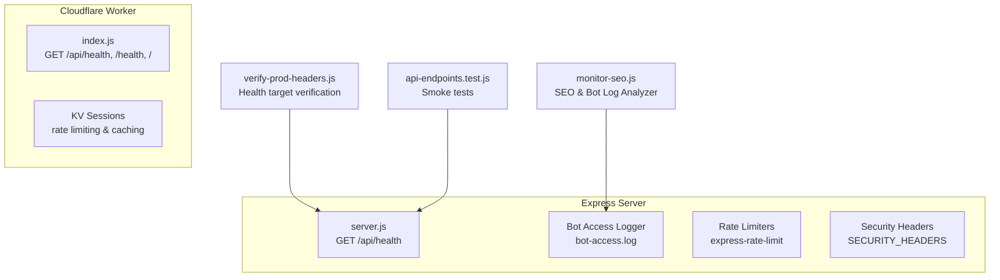
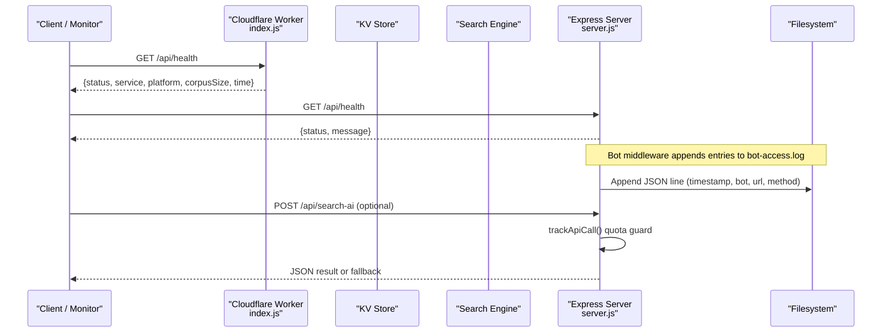
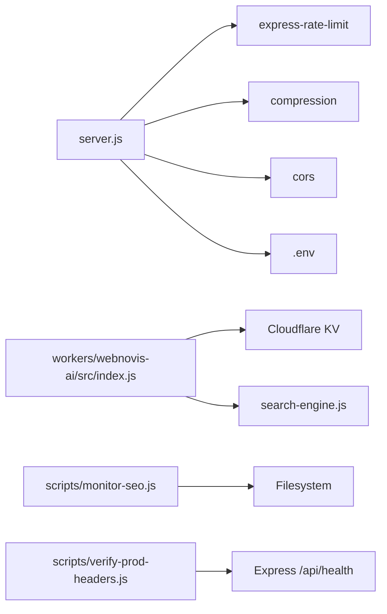

# Health & Monitoring Endpoints

<cite>
**Referenced Files in This Document**
- [server.js](file://server.js)
- [workers/webnovis-ai/src/index.js](file://workers/webnovis-ai/src/index.js)
- [scripts/monitor-seo.js](file://scripts/monitor-seo.js)
- [scripts/verify-prod-headers.js](file://scripts/verify-prod-headers.js)
- [tests/api-endpoints.test.js](file://tests/api-endpoints.test.js)
- [package.json](file://package.json)
</cite>

## Table of Contents
1. Introduction
2. Project Structure
3. Core Components
4. Architecture Overview
5. Detailed Component Analysis
6. Dependency Analysis
7. Performance Considerations
8. Troubleshooting Guide
9. Conclusion

## Introduction
This document provides API documentation for health check and monitoring endpoints across the Node.js application server and the Cloudflare Worker. It covers:
- GET endpoints for system status and service availability
- Response schemas with status indicators, uptime information, and resource utilization data
- Monitoring capabilities for bot detection logging, API usage tracking, and quota monitoring
- Examples of health check requests and response formats
- Integration guidance for monitoring systems
- Logging mechanisms for bot access, API call tracking, and system diagnostics
- Rate limiting policies, access controls, and security considerations for monitoring endpoints

## Project Structure
The health and monitoring surface is implemented in two places:
- Express server (Node.js) exposes a minimal /api/health endpoint and includes middleware for bot logging, rate limiting, and security headers.
- Cloudflare Worker exposes /api/health (and aliases) with richer metadata such as platform and corpus size.

**Diagram sources**
- [server.js:817-820](file://server.js#L817-L820)
- [server.js:395-429](file://server.js#L395-L429)
- [workers/webnovis-ai/src/index.js:519-526](file://workers/webnovis-ai/src/index.js#L519-L526)
- [scripts/monitor-seo.js:117-145](file://scripts/monitor-seo.js#L117-L145)
- [scripts/verify-prod-headers.js:47-55](file://scripts/verify-prod-headers.js#L47-L55)
- [tests/api-endpoints.test.js:42-54](file://tests/api-endpoints.test.js#L42-L54)

**Section sources**
- [server.js:817-820](file://server.js#L817-L820)
- [workers/webnovis-ai/src/index.js:519-526](file://workers/webnovis-ai/src/index.js#L519-L526)
- [scripts/monitor-seo.js:117-145](file://scripts/monitor-seo.js#L117-L145)
- [scripts/verify-prod-headers.js:47-55](file://scripts/verify-prod-headers.js#L47-L55)
- [tests/api-endpoints.test.js:42-54](file://tests/api-endpoints.test.js#L42-L54)

## Core Components
- Express /api/health: Returns a simple JSON status to indicate process liveness.
- Cloudflare Worker /api/health: Returns a richer JSON payload including service name, platform, corpus size, and timestamp.
- Bot access logging: Middleware logs bot crawls to a file for later analysis.
- SEO monitoring script: Aggregates sitemap freshness, bot log stats, link graph integrity, and data layer health.
- Header verification: CI tool asserts expected behavior for /api/health on configured base URLs.

Key responsibilities:
- Liveness checks via /api/health
- Observability via bot-access.log and monitor-seo.js reports
- Security via rate limiting and CORS configuration
- Quota tracking for AI API calls

**Section sources**
- [server.js:817-820](file://server.js#L817-L820)
- [workers/webnovis-ai/src/index.js:519-526](file://workers/webnovis-ai/src/index.js#L519-L526)
- [server.js:395-429](file://server.js#L395-L429)
- [scripts/monitor-seo.js:284-336](file://scripts/monitor-seo.js#L284-L336)
- [scripts/verify-prod-headers.js:47-55](file://scripts/verify-prod-headers.js#L47-L55)

## Architecture Overview
The health and monitoring architecture spans two runtime environments:

**Diagram sources**
- [workers/webnovis-ai/src/index.js:519-526](file://workers/webnovis-ai/src/index.js#L519-L526)
- [server.js:817-820](file://server.js#L817-L820)
- [server.js:395-429](file://server.js#L395-L429)
- [server.js:180-220](file://server.js#L180-L220)

## Detailed Component Analysis

### Endpoint: GET /api/health (Express)
- Purpose: Liveness probe for the Node.js server.
- Method: GET
- Path: /api/health
- Authentication: None
- Rate limiting: Not applied to this endpoint
- Security headers: Applied globally by middleware
- Expected response:
  - Status: 200
  - Body: JSON object with fields:
    - status: string — always "ok"
    - message: string — human-readable liveness message

Example request:
- curl -sS https://www.webnovis.com/api/health

Example response:
- { "status": "ok", "message": "Server is awake and running! 🚀" }

Integration notes:
- Use periodic polling (e.g., every 60 seconds) from your monitoring system.
- Expect no body changes beyond the message; treat any non-200 as unhealthy.

**Section sources**
- [server.js:817-820](file://server.js#L817-L820)
- [server.js:300-319](file://server.js#L300-L319)

### Endpoint: GET /api/health (Cloudflare Worker)
- Purpose: Liveness probe for the Cloudflare Worker with additional context.
- Methods: GET
- Paths: /api/health, /health, /
- Authentication: None
- Rate limiting: Not applied to this endpoint
- CORS: Enabled per origin policy
- Expected response:
  - Status: 200
  - Body: JSON object with fields:
    - status: string — "ok"
    - service: string — "webnovis-ai"
    - platform: string — "cloudflare-workers"
    - corpusSize: number — size of search index used by the worker
    - time: string — ISO timestamp

Example request:
- curl -sS https://webnovis-ai.nexify-api.workers.dev/api/health

Example response:
- { "status": "ok", "service": "webnovis-ai", "platform": "cloudflare-workers", "corpusSize": <number>, "time": "<ISO timestamp>" }

**Section sources**
- [workers/webnovis-ai/src/index.js:519-526](file://workers/webnovis-ai/src/index.js#L519-L526)

### Bot Detection Logging
- Mechanism: Express middleware inspects User-Agent against known bot patterns and appends a JSON line to bot-access.log.
- Rotation: Truncates the log if it exceeds 10MB.
- Fields per entry:
  - timestamp: ISO string
  - bot: string — detected bot name
  - url: string — original request URL
  - method: string — HTTP method

Operational guidance:
- Consume bot-access.log with a log shipper or tailing process.
- Use scripts/monitor-seo.js to summarize recent activity (last 7 days).

**Section sources**
- [server.js:395-429](file://server.js#L395-L429)
- [scripts/monitor-seo.js:117-145](file://scripts/monitor-seo.js#L117-L145)

### API Usage Tracking and Quota Monitoring
- Scope: Tracks daily usage for Gemini API keys used by search and chat flows.
- Behavior:
  - Increments counters per key per day
  - Warns at configured percentage thresholds
  - Blocks further calls when daily limit is reached
- Output: Console warnings/errors with counts and remaining quotas

Usage integration:
- Integrate with external monitoring by capturing console logs or adding structured logging sinks.
- Alert when approaching warnPct or hitting daily cap.

**Section sources**
- [server.js:180-220](file://server.js#L180-L220)

### SEO Monitoring Script
- Purpose: Post-deploy health report covering sitemap, content freshness, bot crawl activity, link graph integrity, and data layer health.
- Modes:
  - Default: Human-readable report to stdout
  - --json: Machine-readable JSON output for CI/alerting
  - --freshness: Content freshness only

Output highlights:
- Sitemap totals and categories
- Stale/critical pages based on lastmod
- Bot log summary (requests and unique pages per bot)
- Link graph issues (broken links, zero inbound, mismatches)
- Data layer metrics (cities, services, AI content coverage)

**Section sources**
- [scripts/monitor-seo.js:284-336](file://scripts/monitor-seo.js#L284-L336)
- [scripts/monitor-seo.js:338-414](file://scripts/monitor-seo.js#L338-L414)

### Header Verification Target for /api/health
- CI verifies that /api/health returns 200 and includes X-Robots-Tag: noindex, nofollow when API_BASE_URL is set.
- Useful for ensuring production endpoints are not indexed.

**Section sources**
- [scripts/verify-prod-headers.js:47-55](file://scripts/verify-prod-headers.js#L47-L55)

### Smoke Tests for Health Endpoint
- The test suite starts the server and polls /api/health until ready.
- Validates basic behaviors for other endpoints as part of smoke testing.

**Section sources**
- [tests/api-endpoints.test.js:42-54](file://tests/api-endpoints.test.js#L42-L54)

## Dependency Analysis
- Express server depends on:
  - express-rate-limit for rate limiting
  - compression for response compression
  - cors for cross-origin requests
  - dotenv for environment variables
- Cloudflare Worker depends on:
  - KV storage for rate limiting and caching
  - Search engine module for indexing and queries
- Monitoring tools depend on:
  - Filesystem for reading bot-access.log and sitemap.xml
  - Optional GSC API credentials for future enhancements

**Diagram sources**
- [package.json:69-76](file://package.json#L69-L76)
- [workers/webnovis-ai/src/index.js:141-151](file://workers/webnovis-ai/src/index.js#L141-L151)
- [scripts/monitor-seo.js:24-31](file://scripts/monitor-seo.js#L24-L31)
- [scripts/verify-prod-headers.js:47-55](file://scripts/verify-prod-headers.js#L47-L55)

**Section sources**
- [package.json:69-76](file://package.json#L69-L76)
- [workers/webnovis-ai/src/index.js:141-151](file://workers/webnovis-ai/src/index.js#L141-L151)
- [scripts/monitor-seo.js:24-31](file://scripts/monitor-seo.js#L24-L31)
- [scripts/verify-prod-headers.js:47-55](file://scripts/verify-prod-headers.js#L47-L55)

## Performance Considerations
- Keep /api/health lightweight: both implementations return minimal JSON without heavy I/O.
- Compression is enabled for text responses in the Express server; ensure monitoring clients accept compressed payloads or disable compression for probes if needed.
- Avoid frequent polling of /api/health to reduce load; typical intervals are 30–120 seconds.
- For Cloudflare Worker, KV-backed rate limiting and caching reduce downstream costs and latency.

[No sources needed since this section provides general guidance]

## Troubleshooting Guide
Common issues and resolutions:
- Health endpoint returns non-200:
  - Check server startup logs for missing dependencies (e.g., express-rate-limit in production).
  - Verify environment variables and secrets are correctly set.
- No bot-access.log entries:
  - Ensure bots send recognizable User-Agent strings.
  - Confirm the middleware runs before static handlers.
- Quota warnings or blocks:
  - Review console logs for QUOTA WARNING/EXCEEDED messages.
  - Adjust thresholds or increase limits as appropriate.
- CI header verification fails:
  - Ensure API_BASE_URL is configured so verify-prod-headers.js targets /api/health.
  - Confirm X-Robots-Tag is present on API responses.

**Section sources**
- [server.js:95-107](file://server.js#L95-L107)
- [server.js:395-429](file://server.js#L395-L429)
- [server.js:180-220](file://server.js#L180-L220)
- [scripts/verify-prod-headers.js:47-55](file://scripts/verify-prod-headers.js#L47-L55)

## Conclusion
The health and monitoring surface provides robust liveness checks across both the Express server and Cloudflare Worker, complemented by bot logging, quota tracking, and an SEO monitoring script. These components enable reliable uptime monitoring, observability into crawler behavior, and proactive alerts around API usage and content freshness. Integrating these endpoints with your monitoring stack ensures early detection of issues and continuous insight into system health.

[No sources needed since this section summarizes without analyzing specific files]