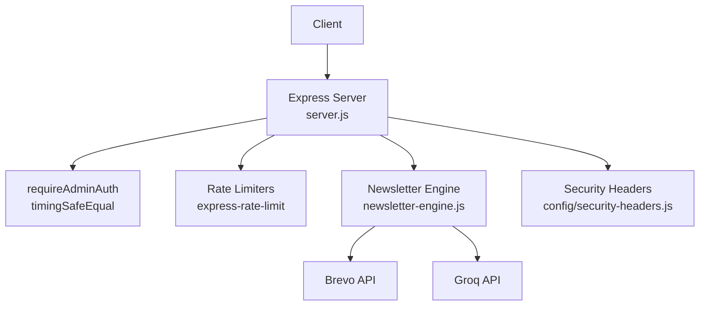
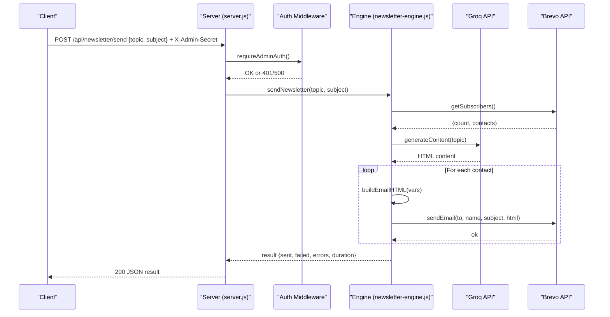
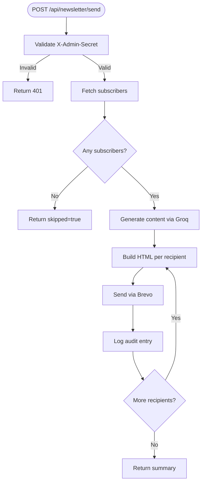
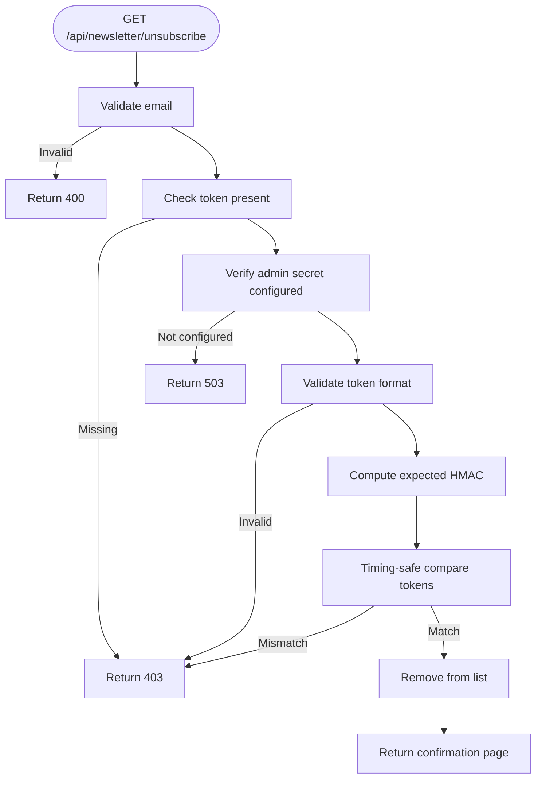

# Newsletter Management API

<cite>
**Referenced Files in This Document**
- [server.js](file://server.js)
- [newsletter-engine.js](file://newsletter-engine.js)
- [config/security-headers.js](file://config/security-headers.js)
- [newsletter-template.html](file://newsletter-template.html)
</cite>

## Table of Contents
1. [Introduction](#introduction)
2. [Project Structure](#project-structure)
3. [Core Components](#core-components)
4. [Architecture Overview](#architecture-overview)
5. [Detailed Component Analysis](#detailed-component-analysis)
6. [Dependency Analysis](#dependency-analysis)
7. [Performance Considerations](#performance-considerations)
8. [Troubleshooting Guide](#troubleshooting-guide)
9. [Conclusion](#conclusion)
10. [Appendices](#appendices)

## Introduction
This document provides detailed API documentation for the newsletter management endpoints. It covers authentication via a timing-safe admin secret, rate limiting, security headers, request/response schemas, error handling, and production best practices. The API supports:
- Sending AI-generated newsletters to subscribers
- Previewing newsletter content without sending
- Listing current subscribers
- GDPR-compliant unsubscribe flow

All protected endpoints require an admin secret passed in the X-Admin-Secret header.

## Project Structure
The newsletter functionality is implemented across two main files:
- server.js: Express routes, authentication middleware, rate limiting, and security headers
- newsletter-engine.js: Business logic for generating content, building emails, managing subscribers, and unsubscribing

**Diagram sources**
- [server.js:75-93](file://server.js#L75-L93)
- [server.js:625-632](file://server.js#L625-L632)
- [newsletter-engine.js:96-136](file://newsletter-engine.js#L96-L136)
- [newsletter-engine.js:155-189](file://newsletter-engine.js#L155-L189)
- [config/security-headers.js:40-48](file://config/security-headers.js#L40-L48)

**Section sources**
- [server.js:75-93](file://server.js#L75-L93)
- [server.js:625-632](file://server.js#L625-L632)
- [newsletter-engine.js:96-136](file://newsletter-engine.js#L96-L136)
- [newsletter-engine.js:155-189](file://newsletter-engine.js#L155-L189)
- [config/security-headers.js:40-48](file://config/security-headers.js#L40-L48)

## Core Components
- Authentication middleware: Validates X-Admin-Secret using timing-safe comparison to prevent timing attacks.
- Rate limiting: Protects sensitive endpoints with per-IP limits (10 requests per 15 minutes).
- Security headers: Centralized policy applied to all responses.
- Newsletter engine: Orchestrates content generation, email assembly, subscriber retrieval, and unsubscribe operations.

Key responsibilities:
- Protected endpoints: send, preview, subscribers
- Public endpoint: unsubscribe (token-protected)
- External integrations: Groq (content generation), Brevo (email delivery and list management)

**Section sources**
- [server.js:75-93](file://server.js#L75-L93)
- [server.js:625-632](file://server.js#L625-L632)
- [newsletter-engine.js:48-62](file://newsletter-engine.js#L48-L62)
- [newsletter-engine.js:96-136](file://newsletter-engine.js#L96-L136)
- [newsletter-engine.js:155-189](file://newsletter-engine.js#L155-L189)
- [newsletter-engine.js:191-227](file://newsletter-engine.js#L191-L227)
- [newsletter-engine.js:351-385](file://newsletter-engine.js#L351-L385)
- [config/security-headers.js:40-48](file://config/security-headers.js#L40-L48)

## Architecture Overview
The API follows a layered approach:
- HTTP layer: Express routes with CORS, JSON parsing, compression, and security headers
- Middleware layer: Admin auth and rate limiting
- Service layer: Newsletter engine encapsulates business logic
- Integration layer: External APIs (Groq, Brevo)

**Diagram sources**
- [server.js:1336-1361](file://server.js#L1336-L1361)
- [server.js:75-93](file://server.js#L75-L93)
- [newsletter-engine.js:259-349](file://newsletter-engine.js#L259-L349)
- [newsletter-engine.js:96-136](file://newsletter-engine.js#L96-L136)
- [newsletter-engine.js:155-189](file://newsletter-engine.js#L155-L189)
- [newsletter-engine.js:191-227](file://newsletter-engine.js#L191-L227)

## Detailed Component Analysis

### Authentication: X-Admin-Secret
- Header name: X-Admin-Secret
- Validation: Timing-safe comparison against NEWSLETTER_ADMIN_SECRET environment variable
- Behavior:
  - Missing or placeholder secret returns 500 with configuration error
  - Invalid or missing secret returns 401 with authentication error
  - Valid secret grants access to protected endpoints

Example authenticated call:
- Method: POST
- Path: /api/newsletter/send
- Headers:
  - Content-Type: application/json
  - X-Admin-Secret: <your-secret>
- Body:
  - topic: string
  - subject: string

Error responses:
- 401 Unauthorized: Missing or invalid secret
- 500 Internal Server Error: Secret not configured or placeholder

**Section sources**
- [server.js:75-93](file://server.js#L75-L93)
- [server.js:228-232](file://server.js#L228-L232)

### Rate Limiting
- Scope: All newsletter endpoints are protected by a limiter that allows 10 requests per 15 minutes per IP
- Implementation: express-rate-limit with standard headers enabled
- Behavior on limit exceeded: Returns error message indicating retry window

Notes:
- Trust proxy is enabled so rate limiting uses real client IPs behind proxies
- In production, rate limiting is mandatory; startup fails if the module is missing

**Section sources**
- [server.js:95-107](file://server.js#L95-L107)
- [server.js:284-287](file://server.js#L284-L287)
- [server.js:625-632](file://server.js#L625-L632)

### Security Headers
- Centralized policy applied to all responses
- Includes HSTS, XSS protection, frame options, referrer policy, permissions policy, and CSP
- API paths receive noindex, nofollow robots directive

**Section sources**
- [config/security-headers.js:40-48](file://config/security-headers.js#L40-L48)
- [server.js:300-306](file://server.js#L300-L306)
- [server.js:308-319](file://server.js#L308-L319)

### Endpoints

#### POST /api/newsletter/send
Generates and sends a newsletter to all subscribers. Requires admin authentication.

Request:
- Method: POST
- Path: /api/newsletter/send
- Headers:
  - Content-Type: application/json
  - X-Admin-Secret: <your-secret>
- Body:
  - topic: string — Topic for AI content generation
  - subject: string — Email subject line

Response (200 OK):
- success: boolean
- skipped: boolean — true when there are zero subscribers
- subscriberCount: number
- sent: number
- failed: number
- errors: array of { email, error }
- duration: string — e.g., "12.3s"
- edition: string — Edition label based on date

Errors:
- 400 Bad Request: Missing required fields
- 401 Unauthorized: Invalid or missing admin secret
- 500 Internal Server Error: Configuration or runtime errors

Example:
- curl -X POST https://www.webnovis.com/api/newsletter/send \
  -H "Content-Type: application/json" \
  -H "X-Admin-Secret: <your-secret>" \
  -d '{"topic":"AI trends","subject":"WebNovis Digest"}'

**Section sources**
- [server.js:1336-1361](file://server.js#L1336-L1361)
- [newsletter-engine.js:259-349](file://newsletter-engine.js#L259-L349)

#### GET /api/newsletter/preview
Generates a preview of the newsletter content without sending. Requires admin authentication.

Request:
- Method: GET
- Path: /api/newsletter/preview
- Query:
  - topic: string — Defaults to a marketing trend topic
  - name: string — Recipient name used in greeting
- Headers:
  - X-Admin-Secret: <your-secret>

Response (200 OK):
- content: string — Generated HTML content snippet for the body

Errors:
- 401 Unauthorized: Invalid or missing admin secret
- 500 Internal Server Error: Configuration or runtime errors

Example:
- curl "https://www.webnovis.com/api/newsletter/preview?topic=SEO+tips&name=Marco" \
  -H "X-Admin-Secret: <your-secret>"

**Section sources**
- [server.js:1363-1379](file://server.js#L1363-L1379)
- [newsletter-engine.js:96-136](file://newsletter-engine.js#L96-L136)

#### GET /api/newsletter/subscribers
Lists current subscribers from the mailing list. Requires admin authentication.

Request:
- Method: GET
- Path: /api/newsletter/subscribers
- Headers:
  - X-Admin-Secret: <your-secret>

Response (200 OK):
- count: number
- contacts: array of { email, name }

Errors:
- 401 Unauthorized: Invalid or missing admin secret
- 500 Internal Server Error: Configuration or runtime errors

Example:
- curl https://www.webnovis.com/api/newsletter/subscribers \
  -H "X-Admin-Secret: <your-secret>"

**Section sources**
- [server.js:1401-1409](file://server.js#L1401-L1409)
- [newsletter-engine.js:155-189](file://newsletter-engine.js#L155-L189)

#### GET /api/newsletter/unsubscribe
GDPR-compliant unsubscribe endpoint. Publicly accessible but token-protected.

Request:
- Method: GET
- Path: /api/newsletter/unsubscribe
- Query:
  - email: string — Subscriber email
  - token: string — HMAC token generated with admin secret

Behavior:
- Validates email format
- Validates token presence and format
- Verifies token using timing-safe comparison against expected HMAC
- Removes subscriber from the mailing list
- Returns confirmation page on success

Errors:
- 400 Bad Request: Invalid email
- 403 Forbidden: Missing or invalid token
- 503 Service Unavailable: Admin secret not configured

Example:
- curl "https://www.webnovis.com/api/newsletter/unsubscribe?email=user%40example.com&token=<hmac-token>"

**Section sources**
- [server.js:1411-1498](file://server.js#L1411-L1498)
- [newsletter-engine.js:351-385](file://newsletter-engine.js#L351-L385)

### Data Flows

#### Send Newsletter Flow

**Diagram sources**
- [newsletter-engine.js:259-349](file://newsletter-engine.js#L259-L349)
- [newsletter-engine.js:96-136](file://newsletter-engine.js#L96-L136)
- [newsletter-engine.js:155-189](file://newsletter-engine.js#L155-L189)
- [newsletter-engine.js:191-227](file://newsletter-engine.js#L191-L227)

#### Unsubscribe Flow

**Diagram sources**
- [server.js:1411-1498](file://server.js#L1411-L1498)
- [newsletter-engine.js:351-385](file://newsletter-engine.js#L351-L385)

## Dependency Analysis
- server.js depends on:
  - express-rate-limit for rate limiting
  - crypto.timingSafeEqual for secure comparisons
  - config/security-headers.js for centralized security headers
  - newsletter-engine.js for business logic
- newsletter-engine.js depends on:
  - node-fetch for HTTP calls
  - Environment variables: GROQ_API_KEY, BREVO_API_KEY, BREVO_LIST_ID, BREVO_SENDER_EMAIL, BREVO_SENDER_NAME, NEWSLETTER_ADMIN_SECRET

External services:
- Groq API: Generates newsletter content
- Brevo API: Manages subscriber lists and sends transactional emails

Potential coupling:
- Tight coupling between server routes and newsletter engine functions
- External service failures propagate as errors up to the API response

Circular dependencies:
- None observed between server.js and newsletter-engine.js

**Section sources**
- [server.js:95-107](file://server.js#L95-L107)
- [server.js:75-93](file://server.js#L75-L93)
- [newsletter-engine.js:16-24](file://newsletter-engine.js#L16-L24)
- [newsletter-engine.js:96-136](file://newsletter-engine.js#L96-L136)
- [newsletter-engine.js:155-189](file://newsletter-engine.js#L155-L189)
- [newsletter-engine.js:191-227](file://newsletter-engine.js#L191-L227)

## Performance Considerations
- Compression: Enabled to reduce payload sizes
- JSON body size limit: 16kb to mitigate DoS via large payloads
- Rate limiting: Prevents abuse and protects external API quotas
- External API timeouts: Search AI uses abort controller; newsletter sends include small delays to respect provider limits
- In-memory caches: Used for search results; newsletter operations are primarily I/O bound

Recommendations:
- Monitor external API quotas and adjust limits accordingly
- Use persistent storage for logs in production (e.g., structured logging to a log aggregator)
- Consider queueing newsletter sends for large subscriber lists to avoid long-running requests

[No sources needed since this section provides general guidance]

## Troubleshooting Guide
Common issues and resolutions:
- 401 Unauthorized: Ensure X-Admin-Secret matches the configured secret exactly; verify case sensitivity and length
- 500 Internal Server Error: Check that NEWSLETTER_ADMIN_SECRET is set and not a placeholder
- 503 Service Unavailable: Unsubscribe endpoint requires admin secret to be configured; configure it before enabling unsubscribe links
- Rate limit exceeded: Wait for the retry window indicated by the rate limiter; ensure clients implement backoff
- External API errors: Review logs for Groq or Brevo errors; validate API keys and quotas

Operational checks:
- Verify security headers are present on responses
- Confirm rate limiting is active in production
- Ensure CORS allows your client origins

**Section sources**
- [server.js:75-93](file://server.js#L75-L93)
- [server.js:228-232](file://server.js#L228-L232)
- [server.js:300-306](file://server.js#L300-L306)
- [server.js:625-632](file://server.js#L625-L632)
- [newsletter-engine.js:48-62](file://newsletter-engine.js#L48-L62)
- [newsletter-engine.js:96-136](file://newsletter-engine.js#L96-L136)
- [newsletter-engine.js:155-189](file://newsletter-engine.js#L155-L189)

## Conclusion
The newsletter management API provides secure, rate-limited endpoints for sending, previewing, listing subscribers, and unsubscribing. Authentication relies on a timing-safe admin secret, and security headers are centrally managed. Production deployments should ensure proper secret management, enable rate limiting, monitor external API quotas, and implement robust logging and alerting.

[No sources needed since this section summarizes without analyzing specific files]

## Appendices

### Request/Response Schemas

- POST /api/newsletter/send
  - Request body:
    - topic: string
    - subject: string
  - Success response:
    - success: boolean
    - skipped: boolean
    - subscriberCount: number
    - sent: number
    - failed: number
    - errors: array of { email, error }
    - duration: string
    - edition: string

- GET /api/newsletter/preview
  - Query parameters:
    - topic: string
    - name: string
  - Success response:
    - content: string

- GET /api/newsletter/subscribers
  - Success response:
    - count: number
    - contacts: array of { email, name }

- GET /api/newsletter/unsubscribe
  - Query parameters:
    - email: string
    - token: string
  - Response: HTML confirmation page on success; error pages on failure

**Section sources**
- [server.js:1336-1361](file://server.js#L1336-L1361)
- [server.js:1363-1379](file://server.js#L1363-L1379)
- [server.js:1401-1409](file://server.js#L1401-L1409)
- [server.js:1411-1498](file://server.js#L1411-L1498)
- [newsletter-engine.js:259-349](file://newsletter-engine.js#L259-L349)
- [newsletter-engine.js:155-189](file://newsletter-engine.js#L155-L189)

### Security Best Practices
- Use strong, random secrets for NEWSLETTER_ADMIN_SECRET
- Never expose secrets in client-side code
- Enforce HTTPS and rely on HSTS
- Keep rate limiting enabled in production
- Validate and sanitize inputs to prevent injection
- Monitor external API usage and set alerts for quota thresholds

**Section sources**
- [server.js:75-93](file://server.js#L75-L93)
- [config/security-headers.js:40-48](file://config/security-headers.js#L40-L48)
- [newsletter-engine.js:37-46](file://newsletter-engine.js#L37-L46)

### Production Deployment Considerations
- Ensure express-rate-limit is installed; startup fails without it in production
- Configure CORS origins appropriately
- Set up structured logging and rotate logs
- Use a process manager or platform cron to trigger scheduled newsletter sends
- Back up and secure environment variables containing API keys

**Section sources**
- [server.js:95-107](file://server.js#L95-L107)
- [server.js:265-282](file://server.js#L265-L282)
- [server.js:1515-1567](file://server.js#L1515-L1567)