# Backend Server & API

<cite>
**Referenced Files in This Document**
- [server.js](file://server.js)
- [package.json](file://package.json)
- [ai-config.js](file://ai-config.js)
- [chat-config.json](file://chat-config.json)
- [search-ai-engine.js](file://search-ai-engine.js)
- [config/security-headers.js](file://config/security-headers.js)
- [newsletter-engine.js](file://newsletter-engine.js)
- [tests/api-endpoints.test.js](file://tests/api-endpoints.test.js)
- [tests/health.test.js](file://tests/health.test.js)
</cite>

## Table of Contents
1. [Introduction](#introduction)
2. [Project Structure](#project-structure)
3. [Core Components](#core-components)
4. [Architecture Overview](#architecture-overview)
5. [Detailed Component Analysis](#detailed-component-analysis)
6. [Dependency Analysis](#dependency-analysis)
7. [Performance Considerations](#performance-considerations)
8. [Troubleshooting Guide](#troubleshooting-guide)
9. [Conclusion](#conclusion)
10. [Appendices](#appendices)

## Introduction
This document provides comprehensive backend server documentation for the WebNovis Express.js application. It covers the middleware stack (security headers, CORS, rate limiting, input sanitization), all REST API endpoints with methods and request/response schemas, authentication mechanisms, AI integration endpoints for chat and search, newsletter management, health checks, admin APIs, security considerations (prompt injection protection, input validation, API quota management), performance optimizations, caching strategies, and monitoring approaches suitable for production deployments.

## Project Structure
The backend is a single-process Express application that serves static assets, exposes REST APIs, integrates with external AI services (Gemini and Groq), and manages newsletter operations via Brevo. Key modules:
- server.js: Main Express app, middleware stack, routes, session store, quotas, and cron-like scheduler.
- ai-config.js: Shared AI model configuration and generation parameters.
- chat-config.json: Chatbot system prompt and company/service data.
- search-ai-engine.js: In-memory search engine, ranking, fallback responses, and prompt building for Gemini search.
- config/security-headers.js: Security headers, CSP directives, CORS origin management, and static header generator.
- newsletter-engine.js: Newsletter content generation (Groq), email sending (Brevo), subscriber list retrieval, unsubscribe handling.
- package.json: Dependencies, scripts, and entry point.

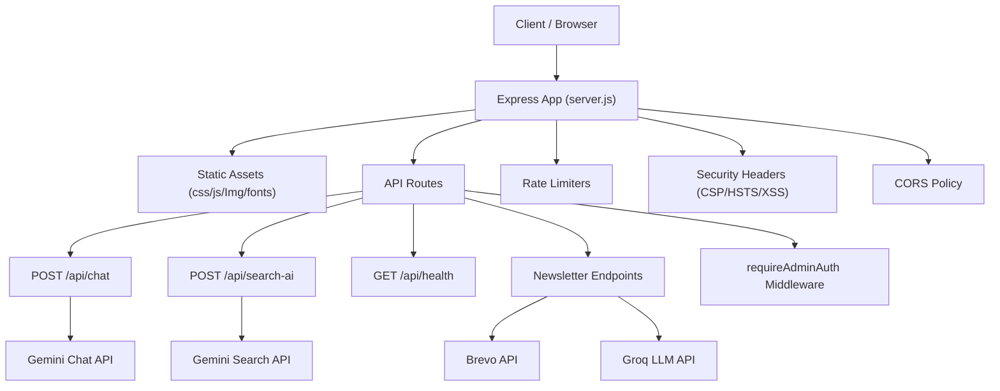

**Diagram sources**
- [server.js:224-320](file://server.js#L224-L320)
- [config/security-headers.js:40-48](file://config/security-headers.js#L40-L48)
- [search-ai-engine.js:201-230](file://search-ai-engine.js#L201-L230)
- [newsletter-engine.js:259-349](file://newsletter-engine.js#L259-L349)

**Section sources**
- [server.js:1-120](file://server.js#L1-L120)
- [package.json:1-30](file://package.json#L1-L30)

## Core Components
- Express app initialization and environment setup
- Middleware stack: compression, CORS, JSON parsing, security headers, SEO redirects, trailing slash normalization, UTM stripping, bot logging, public file serving
- Session store for chat conversations (in-memory Map)
- Rate limiters per endpoint (chat, newsletter, search, lead capture)
- API quota tracking for Gemini keys (daily counters with warn/hard-cap thresholds)
- Prompt injection guard patterns and safe responses
- Static asset caching policies and CDN-friendly headers
- Custom 404 handler and canonical host redirect

Key implementation highlights:
- Compression enabled with threshold and filter options
- CORS allows configured origins and local development hosts
- JSON body size limited to prevent DoS
- Security headers applied globally including HSTS, X-Frame-Options, CSP, Referrer-Policy, Permissions-Policy
- SEO-related redirects and canonicalization
- Bot detection logs access patterns
- Public files served with appropriate cache-control headers
- In-memory sessions with eviction and cleanup
- Quota tracking per key with warnings and blocking at daily limits

**Section sources**
- [server.js:224-530](file://server.js#L224-L530)
- [server.js:584-620](file://server.js#L584-L620)
- [server.js:180-221](file://server.js#L180-L221)
- [config/security-headers.js:40-48](file://config/security-headers.js#L40-L48)

## Architecture Overview
The backend architecture centers around an Express server that orchestrates multiple concerns:
- Request lifecycle: incoming requests pass through middleware (compression, CORS, JSON parsing, security headers, SEO redirects, static file serving) before reaching route handlers.
- AI integrations: Chat and Search endpoints call Gemini APIs with robust error handling, fallbacks, and quota management.
- Newsletter pipeline: Content generation via Groq, email dispatch via Brevo, subscriber management, unsubscribe flow with HMAC tokens.
- Monitoring and observability: Bot access logs, lead logs, newsletter audit trail, console logs for errors and warnings.

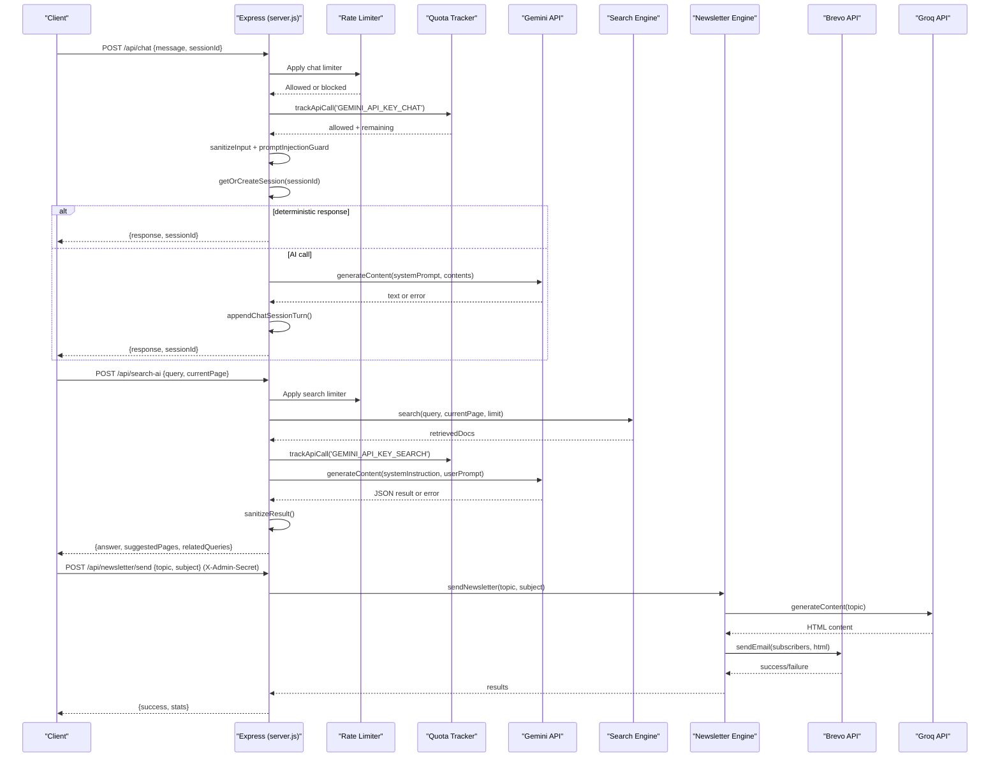

**Diagram sources**
- [server.js:1123-1279](file://server.js#L1123-L1279)
- [server.js:742-815](file://server.js#L742-L815)
- [newsletter-engine.js:259-349](file://newsletter-engine.js#L259-L349)
- [search-ai-engine.js:232-271](file://search-ai-engine.js#L232-L271)

## Detailed Component Analysis

### Middleware Stack
- Compression: Enabled with configurable threshold and filter; reduces payload sizes significantly.
- CORS: Configured to allow specific origins and local development; supports preflight requests.
- JSON parsing: Limits body size to 16KB to mitigate DoS.
- Security headers: Global application of HSTS, X-Frame-Options, CSP, Referrer-Policy, Permissions-Policy.
- SEO redirects: Canonical host redirect (non-www to www), legacy path redirects, trailing slash normalization, UTM parameter stripping, singular/plural page canonicalization.
- Bot logging: Detects known bots and logs access patterns with rotation.
- Static file serving: Serves core public files and generated pSEO pages with appropriate cache headers.

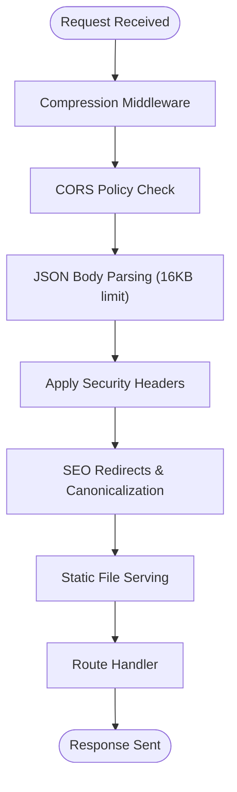

**Diagram sources**
- [server.js:234-249](file://server.js#L234-L249)
- [server.js:265-282](file://server.js#L265-L282)
- [server.js:287-319](file://server.js#L287-L319)
- [server.js:325-393](file://server.js#L325-L393)
- [server.js:441-522](file://server.js#L441-L522)

**Section sources**
- [server.js:234-522](file://server.js#L234-L522)
- [config/security-headers.js:40-48](file://config/security-headers.js#L40-L48)

### Authentication & Authorization
- requireAdminAuth middleware: Validates X-Admin-Secret header using timing-safe comparison against NEWSLETTER_ADMIN_SECRET environment variable.
- Protected endpoints: Newsletter send, preview, subscribers, and config endpoints require admin authentication.
- Unsubscribe endpoint: Uses HMAC token validation to prevent unauthorized mass unsubscribes.

Authentication flow:
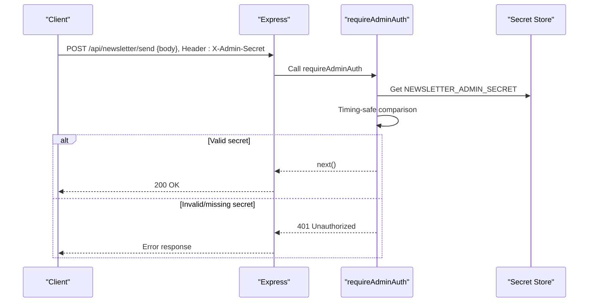

**Diagram sources**
- [server.js:75-93](file://server.js#L75-L93)
- [server.js:1328-1331](file://server.js#L1328-L1331)
- [server.js:1412-1498](file://server.js#L1412-L1498)

**Section sources**
- [server.js:75-93](file://server.js#L75-L93)
- [server.js:1328-1331](file://server.js#L1328-L1331)
- [server.js:1412-1498](file://server.js#L1412-L1498)

### Rate Limiting & API Quotas
- Rate limiters: Per-IP limits for chat (30 req/15min), newsletter (10 req/15min), search AI (10 req/min), lead capture (5 req/15min).
- API quota tracking: Daily counters for Gemini API keys with warning at 80% usage and hard block at 100%.
- Graceful degradation: When quotas exceeded, fallback responses are provided.

Quota tracking logic:
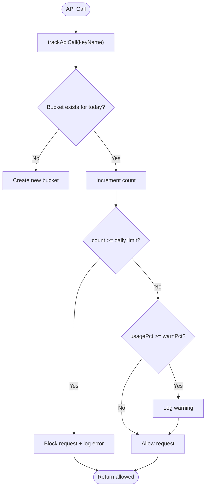

**Diagram sources**
- [server.js:180-221](file://server.js#L180-L221)
- [server.js:252-262](file://server.js#L252-L262)
- [server.js:625-641](file://server.js#L625-L641)
- [server.js:890-897](file://server.js#L890-L897)

**Section sources**
- [server.js:180-221](file://server.js#L180-L221)
- [server.js:252-262](file://server.js#L252-L262)
- [server.js:625-641](file://server.js#L625-L641)
- [server.js:890-897](file://server.js#L890-L897)

### Input Sanitization & Security
- HTML tag stripping: All user inputs sanitized by removing HTML tags.
- Prompt injection protection: Comprehensive regex patterns detect Italian and English injection attempts, leetspeak variations, role-play escalation, jailbreak keywords.
- Safe responses: When injection detected, predefined safe responses returned without calling AI APIs.
- IP anonymization: Last octet zeroed for IPv4, last 80 bits for IPv6 to comply with GDPR while preserving geographic analysis capability.

Security measures:
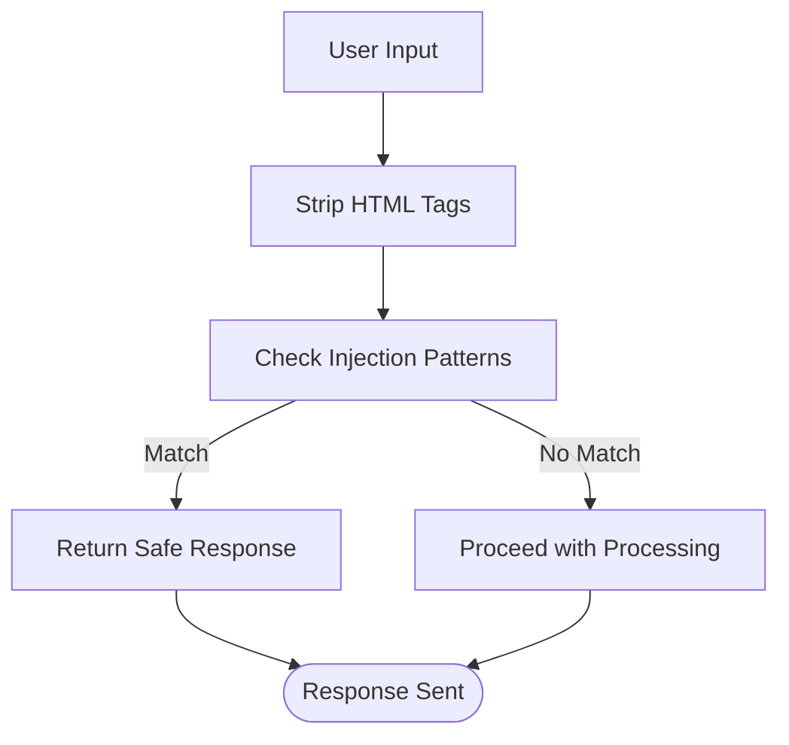

**Diagram sources**
- [server.js:129-178](file://server.js#L129-L178)
- [server.js:112-127](file://server.js#L112-L127)

**Section sources**
- [server.js:129-178](file://server.js#L129-L178)
- [server.js:112-127](file://server.js#L112-L127)

### Session Management
- In-memory session store: Map-based storage with automatic eviction when capacity reached.
- Session lifecycle: 30-minute TTL with activity-based expiration.
- History management: Maximum 20 messages per session, server-side only (client history ignored).
- Cleanup interval: Periodic removal of expired sessions every 5 minutes.

Session operations:
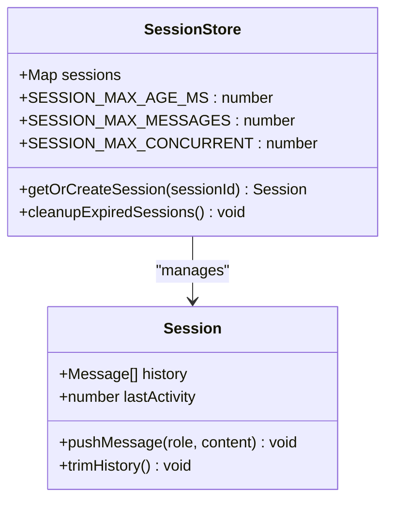

**Diagram sources**
- [server.js:584-620](file://server.js#L584-L620)

**Section sources**
- [server.js:584-620](file://server.js#L584-L620)

## Architecture Overview
The system architecture follows a layered approach with clear separation of concerns:
- Presentation layer: Express middleware handles HTTP concerns (compression, CORS, security headers)
- Business logic layer: Route handlers implement domain-specific functionality
- Integration layer: External service calls (Gemini, Groq, Brevo) with retry and fallback mechanisms
- Data layer: In-memory stores for sessions, quotas, and search cache

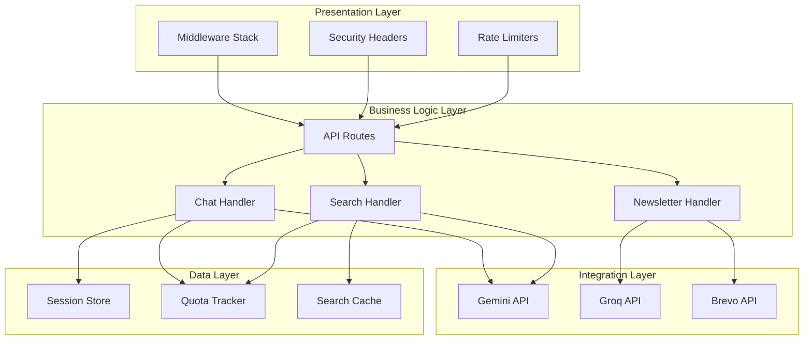

**Diagram sources**
- [server.js:224-530](file://server.js#L224-L530)
- [search-ai-engine.js:201-230](file://search-ai-engine.js#L201-L230)
- [newsletter-engine.js:259-349](file://newsletter-engine.js#L259-L349)

## Detailed Component Analysis

### REST API Endpoints

#### Health Check
- Method: GET
- URL: /api/health
- Authentication: None
- Request: None
- Response: 200 OK with status message
- Purpose: Basic health check for load balancers and monitoring

#### Chat API
- Method: POST
- URL: /api/chat
- Authentication: None (rate limited)
- Request Schema:
  - message: string (required, max 500 chars, HTML stripped)
  - sessionId: string (optional, auto-generated if missing)
- Response Schema:
  - response: string (AI-generated or fallback response)
  - sessionId: string (session identifier)
- Error Handling:
  - 400: Invalid message format
  - 500: Internal server error (fallback response may be sent)
- Fallback Mechanisms:
  - Deterministic responses for greetings/thanks
  - Local fallback when Gemini API unavailable
  - Quota exceeded handling with local responses

#### Search AI
- Method: POST
- URL: /api/search-ai
- Authentication: None (rate limited)
- Request Schema:
  - query: string (required, 3-500 chars, HTML stripped)
  - currentPage: string (optional, normalized path)
- Response Schema:
  - answer: string (AI-generated answer with inline links)
  - suggestedPages: array of objects [{title, url, relevance}]
  - relatedQueries: array of strings
- Error Handling:
  - 400: Invalid query format
  - 200 with fallback: When API keys missing or errors occur
- Caching:
  - In-memory cache with 5-minute TTL
  - Deduplication of concurrent identical queries

#### Newsletter Management
- Subscribe:
  - Method: POST
  - URL: /api/newsletter
  - Authentication: None (rate limited)
  - Request Schema: {email, name, source}
  - Response: {success, message, brevoConfigured?}
  
- Send Newsletter (Admin):
  - Method: POST
  - URL: /api/newsletter/send
  - Authentication: Required (X-Admin-Secret header)
  - Request Schema: {topic, subject}
  - Response: {success, stats}
  
- Preview Newsletter (Admin):
  - Method: GET
  - URL: /api/newsletter/preview
  - Authentication: Required (X-Admin-Secret header)
  - Query Params: topic, name
  - Response: HTML preview
  
- List Subscribers (Admin):
  - Method: GET
  - URL: /api/newsletter/subscribers
  - Authentication: Required (X-Admin-Secret header)
  - Response: {count, contacts[]}
  
- Unsubscribe:
  - Method: GET
  - URL: /api/newsletter/unsubscribe
  - Authentication: None (HMAC token required)
  - Query Params: email, token
  - Response: HTML confirmation page

#### Lead Capture
- Method: POST
- URL: /api/lead
- Authentication: None (rate limited)
- Request Schema: {email, url, type}
- Response: {success, message}
- Features: Logs to file, optional Brevo integration, notification emails

#### Chat Lead Capture
- Method: POST
- URL: /api/chat-lead
- Authentication: None (rate limited)
- Request Schema: {message, sessionId, page, messageCount}
- Response: {ok: true}
- Purpose: High-intent user detection from chat interactions

#### Configuration
- Method: GET
- URL: /api/config
- Authentication: Required (X-Admin-Secret header)
- Response: Safe configuration object (excludes sensitive instructions)

**Section sources**
- [server.js:817-820](file://server.js#L817-L820)
- [server.js:1123-1279](file://server.js#L1123-L1279)
- [server.js:742-815](file://server.js#L742-L815)
- [server.js:822-888](file://server.js#L822-L888)
- [server.js:1336-1409](file://server.js#L1336-L1409)
- [server.js:899-1022](file://server.js#L899-L1022)
- [server.js:1024-1093](file://server.js#L1024-L1093)
- [server.js:1328-1331](file://server.js#L1328-L1331)

### AI Integration Endpoints

#### Chat Endpoint Flow
The chat endpoint implements a sophisticated flow with multiple safety layers:
1. Input validation and sanitization
2. Prompt injection detection
3. Session management (server-side only)
4. Deterministic response routing for trivial messages
5. Gemini API call with timeout and retry logic
6. Fallback mechanisms for API failures
7. Session history maintenance

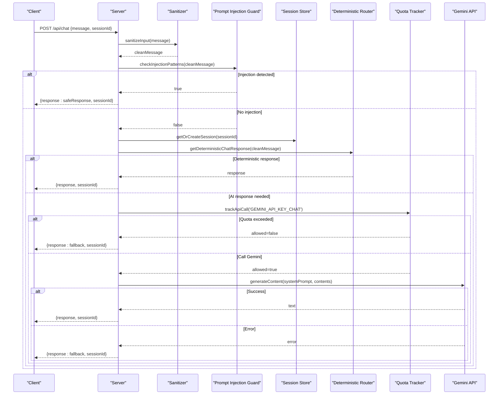

**Diagram sources**
- [server.js:1123-1279](file://server.js#L1123-L1279)
- [server.js:1103-1121](file://server.js#L1103-L1121)
- [server.js:180-221](file://server.js#L180-L221)

#### Search AI Flow
The search endpoint combines in-memory search with AI enhancement:
1. Query validation and sanitization
2. Prompt injection detection
3. In-memory search engine execution
4. Cache lookup with deduplication
5. Gemini API call with structured prompt
6. Result sanitization and validation
7. Fallback response generation

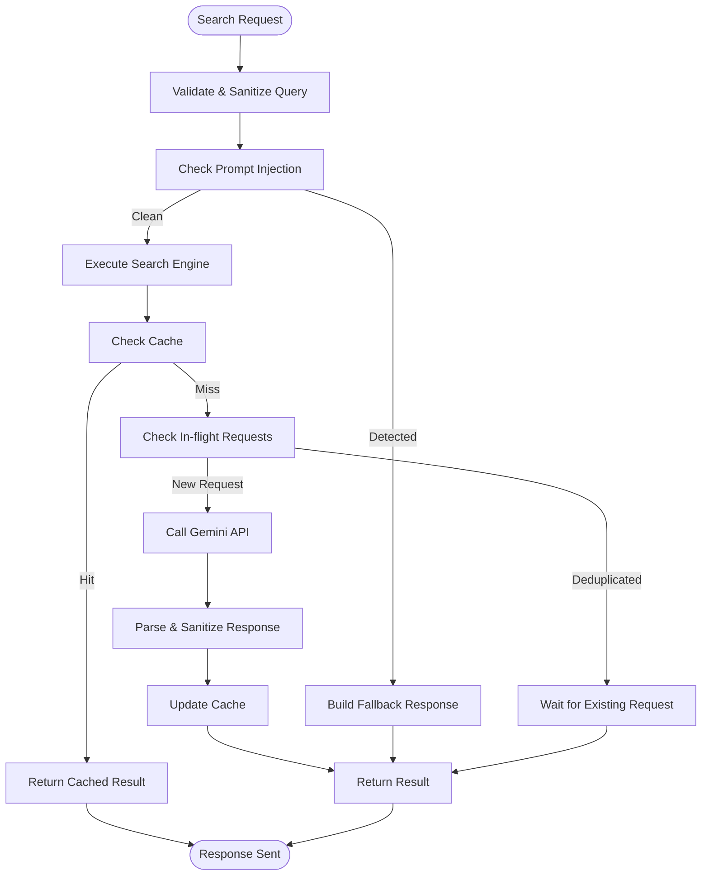

**Diagram sources**
- [server.js:742-815](file://server.js#L742-L815)
- [search-ai-engine.js:210-230](file://search-ai-engine.js#L210-L230)

**Section sources**
- [server.js:742-815](file://server.js#L742-L815)
- [server.js:1123-1279](file://server.js#L1123-L1279)
- [search-ai-engine.js:210-230](file://search-ai-engine.js#L210-L230)

### Newsletter Management System
The newsletter system provides comprehensive email marketing capabilities:
- AI-powered content generation using Groq's Llama 3.3
- Template-based email construction with secure variable substitution
- Subscriber management via Brevo API
- Automated weekly scheduling with topic rotation
- GDPR-compliant unsubscribe mechanism with HMAC tokens
- Audit logging for compliance and debugging

Newsletter workflow:
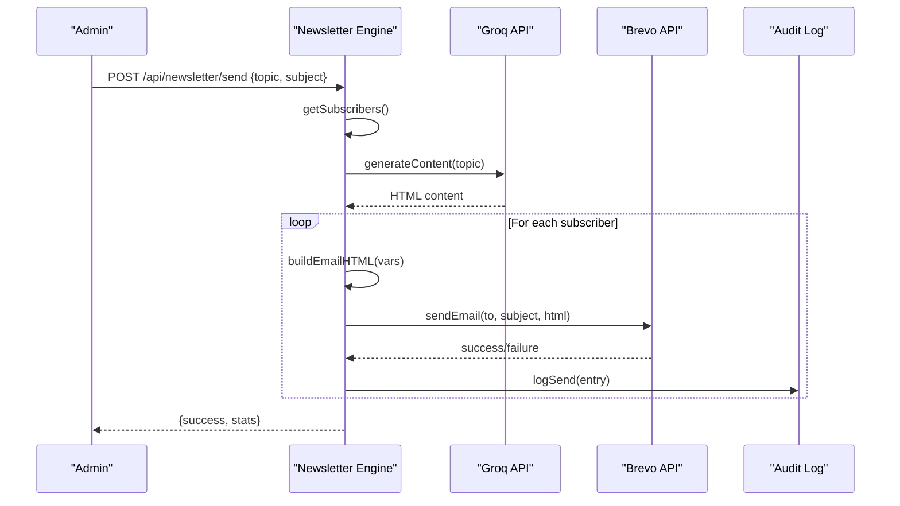

**Diagram sources**
- [newsletter-engine.js:259-349](file://newsletter-engine.js#L259-L349)
- [newsletter-engine.js:156-189](file://newsletter-engine.js#L156-L189)
- [newsletter-engine.js:192-227](file://newsletter-engine.js#L192-L227)

**Section sources**
- [newsletter-engine.js:259-349](file://newsletter-engine.js#L259-L349)
- [newsletter-engine.js:156-189](file://newsletter-engine.js#L156-L189)
- [newsletter-engine.js:192-227](file://newsletter-engine.js#L192-L227)

## Dependency Analysis
The application has well-defined dependencies with clear separation between core functionality and external integrations:

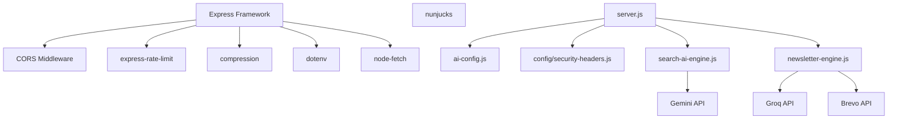

**Diagram sources**
- [package.json:69-76](file://package.json#L69-L76)
- [server.js:1-12](file://server.js#L1-L12)
- [newsletter-engine.js:16-24](file://newsletter-engine.js#L16-L24)

**Section sources**
- [package.json:69-76](file://package.json#L69-L76)
- [server.js:1-12](file://server.js#L1-L12)

## Performance Considerations
Several optimization techniques are implemented:

### Caching Strategies
- **Search AI Cache**: In-memory cache with 5-minute TTL and 100-entry limit with LRU eviction
- **System Prompt Cache**: Cached at startup to avoid regeneration per request
- **Static Asset Caching**: Long-term caching for CSS/JS/images with immutable headers
- **HTML Caching**: Short-term caching with stale-while-revalidate for dynamic content
- **CDN Optimization**: CDN-Cache-Control and Surrogate-Control headers for proxy caching

### Memory Management
- **Session Cleanup**: Automatic cleanup of expired sessions every 5 minutes
- **Session Eviction**: Oldest sessions evicted when concurrent limit reached
- **Cache Pruning**: LRU eviction for search cache when maximum size exceeded
- **File Rotation**: Bot access logs rotated when exceeding 10MB

### Network Optimization
- **Compression**: Brotli/Gzip compression enabled with configurable threshold
- **Connection Reuse**: node-fetch instance reused across requests
- **Timeout Handling**: AbortController for API calls with appropriate timeouts
- **Deduplication**: Concurrent identical search requests deduplicated

### Production Optimizations
- **Environment Detection**: Different behavior for development vs production
- **Lazy Loading**: Optional dependencies loaded on demand
- **Error Boundaries**: Graceful degradation when external services unavailable
- **Monitoring**: Comprehensive logging with structured JSONL formats

**Section sources**
- [server.js:646-668](file://server.js#L646-L668)
- [server.js:581-582](file://server.js#L581-L582)
- [server.js:458-522](file://server.js#L458-L522)
- [server.js:614-619](file://server.js#L614-L619)
- [server.js:418-429](file://server.js#L418-L429)

## Troubleshooting Guide

### Common Issues and Solutions

#### API Keys Not Configured
- **Symptom**: AI endpoints return fallback responses instead of AI-generated content
- **Solution**: Ensure GEMINI_API_KEY_CHAT, GEMINI_API_KEY_SEARCH, and GROQ_API_KEY are set in environment variables
- **Verification**: Check server startup logs for API key configuration status

#### Rate Limiting Errors
- **Symptom**: 429 Too Many Requests responses
- **Solution**: Implement exponential backoff on client side or increase rate limits if legitimate high traffic
- **Monitoring**: Check console logs for rate limit warnings

#### Prompt Injection Attacks
- **Symptom**: Unexpected behavior or security violations in AI responses
- **Solution**: Review INJECTION_PATTERNS regex and add new attack vectors as needed
- **Detection**: Monitor console logs for injection attempt warnings

#### Newsletter Sending Failures
- **Symptom**: Newsletter send fails or subscribers not receiving emails
- **Solution**: Verify BREVO_API_KEY configuration and network connectivity
- **Debugging**: Check newsletter-log.jsonl for detailed error information

#### Memory Leaks
- **Symptom**: Increasing memory usage over time
- **Solution**: Monitor session cleanup intervals and cache pruning effectiveness
- **Investigation**: Use Node.js memory profiling tools to identify leaks

### Monitoring and Logging
- **Bot Access Logs**: bot-access.log with structured JSON entries
- **Lead Logs**: leads-log.jsonl for lead capture events
- **Newsletter Logs**: newsletter-log.jsonl for audit trail
- **Console Logging**: Structured logs with emoji prefixes for easy filtering

**Section sources**
- [server.js:404-429](file://server.js#L404-L429)
- [newsletter-engine.js:239-250](file://newsletter-engine.js#L239-L250)
- [server.js:1593-1600](file://server.js#L1593-L1600)

## Conclusion
The WebNovis Express.js backend provides a robust, secure, and scalable foundation for AI-powered web applications. The comprehensive middleware stack ensures security and performance, while the modular architecture allows for easy extension and maintenance. The AI integration endpoints offer sophisticated chat and search capabilities with robust fallback mechanisms, and the newsletter system provides enterprise-grade email marketing functionality.

Key strengths include:
- Strong security posture with multiple defense layers
- Comprehensive rate limiting and quota management
- Intelligent caching and performance optimizations
- Graceful degradation and fallback mechanisms
- Extensive monitoring and logging capabilities
- GDPR-compliant data handling practices

The system is well-suited for production deployment with proper environment configuration and monitoring setup.

## Appendices

### Environment Variables Reference
- **GEMINI_API_KEY_CHAT**: API key for chatbot functionality
- **GEMINI_API_KEY_SEARCH**: API key for search AI functionality  
- **GEMINI_API_KEY_WRITER**: API key for content generation
- **GROQ_API_KEY**: API key for newsletter content generation
- **BREVO_API_KEY**: API key for email marketing platform
- **BREVO_LIST_ID**: Brevo list ID for newsletter subscribers
- **NEWSLETTER_ADMIN_SECRET**: Secret for admin endpoint authentication
- **PORT**: Server port (default: 3000)
- **NODE_ENV**: Environment (development/production)
- **CORS_ORIGINS**: Comma-separated list of allowed CORS origins

### API Response Examples

#### Health Check Response
```json
{
  "status": "ok",
  "message": "Server is awake and running! 🚀"
}
```

#### Chat Response
```json
{
  "response": "Ciao! Sono Weby, l'assistente AI di WebNovis...",
  "sessionId": "abc123def456"
}
```

#### Search AI Response
```json
{
  "answer": "Per contattare WebNovis ti conviene aprire [Contatti](/contatti.html)...",
  "suggestedPages": [
    {"title": "Contatti", "url": "/contatti.html", "relevance": 0.95}
  ],
  "relatedQueries": ["servizi webnovis", "contatti webnovis"]
}
```

#### Newsletter Send Response
```json
{
  "success": true,
  "subscriberCount": 150,
  "sent": 148,
  "failed": 2,
  "errors": [],
  "duration": "12.5s",
  "edition": "Marzo 2026 — Settimana 12"
}
```

**Section sources**
- [server.js:817-820](file://server.js#L817-L820)
- [server.js:1123-1279](file://server.js#L1123-L1279)
- [server.js:742-815](file://server.js#L742-L815)
- [newsletter-engine.js:259-349](file://newsletter-engine.js#L259-L349)