# Express Application Architecture

<cite>
**Referenced Files in This Document**
- [server.js](file://server.js)
- [package.json](file://package.json)
- [config/security-headers.js](file://config/security-headers.js)
- [ai-config.js](file://ai-config.js)
- [search-ai-engine.js](file://search-ai-engine.js)
</cite>

## Table of Contents
1. [Introduction](#introduction)
2. [Project Structure](#project-structure)
3. [Core Components](#core-components)
4. [Architecture Overview](#architecture-overview)
5. [Detailed Component Analysis](#detailed-component-analysis)
6. [Dependency Analysis](#dependency-analysis)
7. [Performance Considerations](#performance-considerations)
8. [Troubleshooting Guide](#troubleshooting-guide)
9. [Conclusion](#conclusion)

## Introduction
This document explains the Express.js application architecture with a focus on the middleware stack, security headers, CORS configuration, rate limiting, input sanitization, static file serving strategy (including cache optimization and SEO redirects), bot detection, IP anonymization for GDPR compliance, and the comprehensive security chain. It also covers initialization, environment configuration, startup checks, and error handling strategies used across API endpoints.

## Project Structure
The application is a Node.js/Express server that serves static HTML assets, provides APIs for chat, search, newsletter, and lead capture, and enforces a strict security and SEO posture through middleware. Key runtime dependencies include Express, CORS, compression, dotenv, express-rate-limit, node-fetch, and Nunjucks. The build scripts generate search indexes, sitemaps, and public artifacts, while tests validate security headers and behavior.

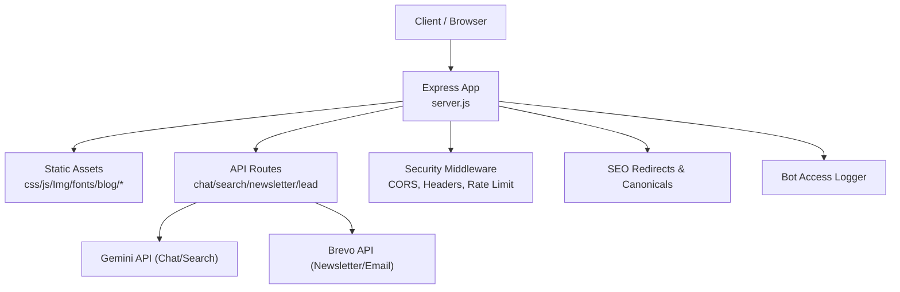

**Diagram sources**
- [server.js:224-530](file://server.js#L224-L530)
- [server.js:743-815](file://server.js#L743-L815)
- [server.js:825-1093](file://server.js#L825-L1093)
- [server.js:1126-1279](file://server.js#L1126-L1279)

**Section sources**
- [package.json:1-92](file://package.json#L1-L92)
- [server.js:1-120](file://server.js#L1-L120)

## Core Components
- Application bootstrap and environment loading
- Compression, CORS, JSON parsing, trust proxy
- Security headers from centralized config
- SEO redirect middleware (canonical host, legacy paths, trailing slash, UTM stripping, singular/plural canonicalization)
- Static asset serving with cache policies
- Bot detection logging
- API routes with rate limiting, input validation, prompt injection guards, quota tracking, fallback responses
- Admin-only endpoints protected by header-based secret
- Custom 404 handler

**Section sources**
- [server.js:224-530](file://server.js#L224-L530)
- [server.js:743-815](file://server.js#L743-L815)
- [server.js:825-1093](file://server.js#L825-L1093)
- [server.js:1126-1279](file://server.js#L1126-L1279)
- [config/security-headers.js:40-48](file://config/security-headers.js#L40-L48)

## Architecture Overview
The request lifecycle flows through a layered middleware pipeline:
1. Compression (optional)
2. CORS with dynamic origin allowlist
3. Trust proxy
4. JSON body parser with size limit
5. Canonical host redirect (non-www to www in production)
6. Security headers applied globally
7. X-Robots-Tag directives for API and governed pages
8. Legacy URL redirects and path normalization
9. Trailing slash normalization and UTM parameter stripping
10. Singular/plural page canonicalization
11. Bot detection logging
12. Public file serving with cache headers
13. Route handlers for APIs with per-endpoint rate limits and validations
14. Fallback 404 handler

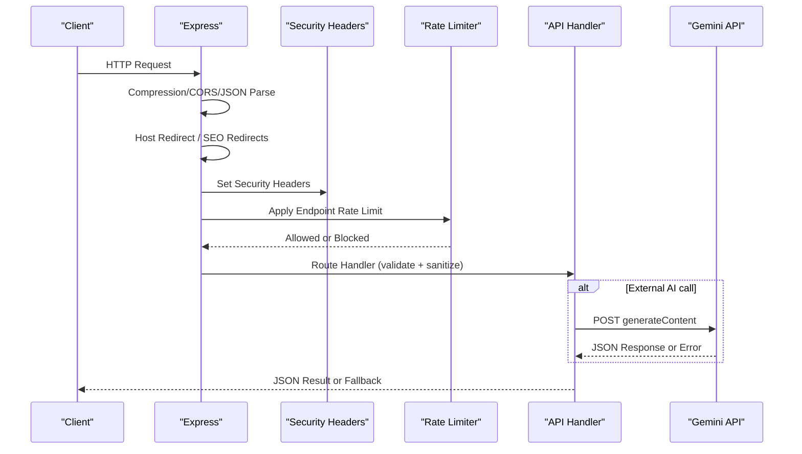

**Diagram sources**
- [server.js:224-530](file://server.js#L224-L530)
- [server.js:743-815](file://server.js#L743-L815)
- [server.js:1126-1279](file://server.js#L1126-L1279)

## Detailed Component Analysis

### Middleware Stack and Security Headers
- Compression: optional gzip/brotli with threshold and filter override.
- CORS: allows configured origins via helper; non-browser requests without Origin are allowed but protected by rate limiting and admin auth on sensitive endpoints.
- Trust Proxy: set to 1 to honor first proxy header for client IP.
- JSON Parser: limited to 16kb to mitigate large payload DoS.
- Security Headers: centralized in config, including HSTS, nosniff, frame options, CSP, referrer policy, permissions policy, and XSS protection flag.
- X-Robots-Tag: noindex/nofollow for API/admin paths and governed pages.

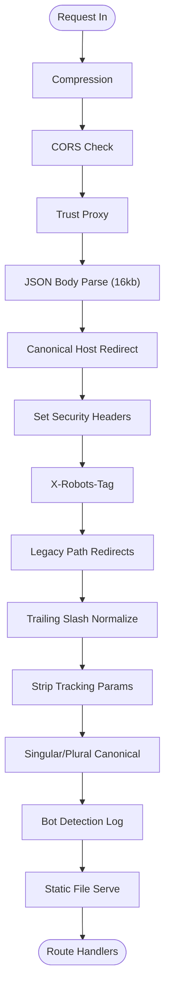

**Diagram sources**
- [server.js:234-530](file://server.js#L234-L530)
- [config/security-headers.js:40-48](file://config/security-headers.js#L40-L48)

**Section sources**
- [server.js:234-530](file://server.js#L234-L530)
- [config/security-headers.js:40-48](file://config/security-headers.js#L40-L48)

### Environment Configuration and Startup Checks
- Loads .env variables at boot.
- Pre-warms fetch module to reduce cold-start latency.
- Validates presence of critical secrets in production (e.g., newsletter admin secret).
- Initializes shared CORS origins from environment and defaults.
- Logs model and API key status at startup.

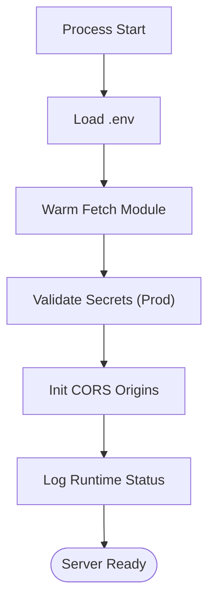

**Diagram sources**
- [server.js:1-21](file://server.js#L1-L21)
- [server.js:224-232](file://server.js#L224-L232)
- [server.js:1581-1599](file://server.js#L1581-L1599)

**Section sources**
- [server.js:1-21](file://server.js#L1-L21)
- [server.js:224-232](file://server.js#L224-L232)
- [server.js:1581-1599](file://server.js#L1581-L1599)

### Static File Serving Strategy and Cache Optimization
- Static directories served with long-lived immutable caching in production for css/js/Img/fonts.
- HTML directories use shorter cache with stale-while-revalidate.
- Public files (core and generated pSEO pages) are explicitly routed with appropriate cache headers.
- AI-discoverable files (robots.txt, sitemap.xml, ai.txt, llms.*) open CORS for crawlers.

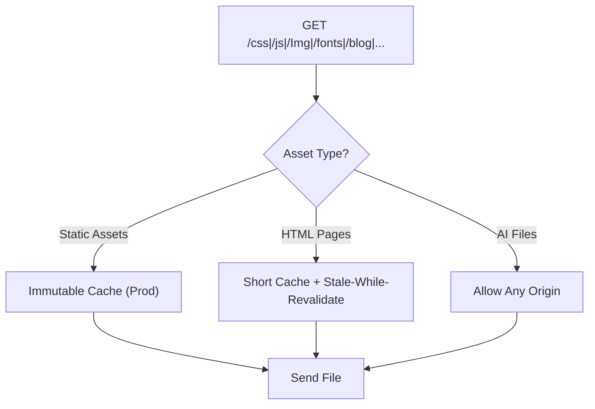

**Diagram sources**
- [server.js:458-530](file://server.js#L458-L530)

**Section sources**
- [server.js:458-530](file://server.js#L458-L530)

### Redirect Handling for SEO and Legacy Compatibility
- Canonical host redirect: non-www to www in production.
- Legacy build-artifact redirects collapsing /dist/ URLs to canonical paths.
- Deprecated cluster redirects for old service slugs.
- Trailing slash normalization excluding specific directories.
- UTM/tracking parameter stripping to prevent duplicate content.
- Singular/plural location page canonicalization.

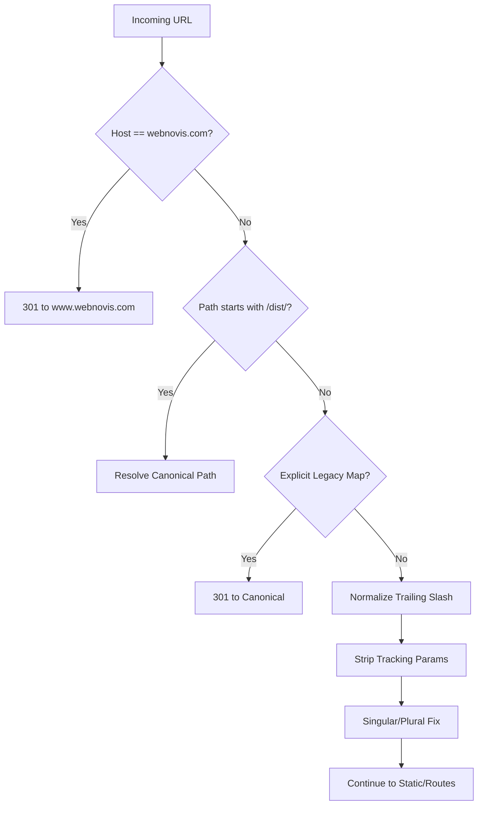

**Diagram sources**
- [server.js:291-393](file://server.js#L291-L393)
- [server.js:334-356](file://server.js#L334-L356)

**Section sources**
- [server.js:291-393](file://server.js#L291-L393)
- [server.js:334-356](file://server.js#L334-L356)

### Bot Detection System
- Detects known bots via User-Agent patterns.
- Logs timestamp, bot name, URL, and method to a rotating log file.
- Helps inform GEO strategy and crawl intelligence.

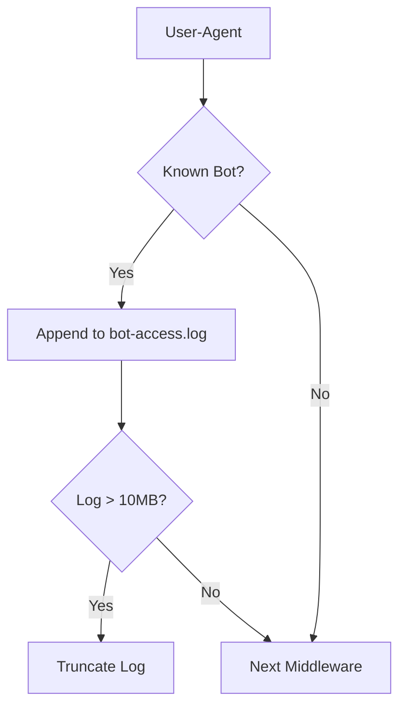

**Diagram sources**
- [server.js:395-429](file://server.js#L395-L429)

**Section sources**
- [server.js:395-429](file://server.js#L395-L429)

### IP Anonymization for GDPR Compliance
- Truncates IPv4 last octet or IPv6 last 80 bits to remove PII while preserving geographic utility.
- Used when logging leads and chat leads to ensure privacy.

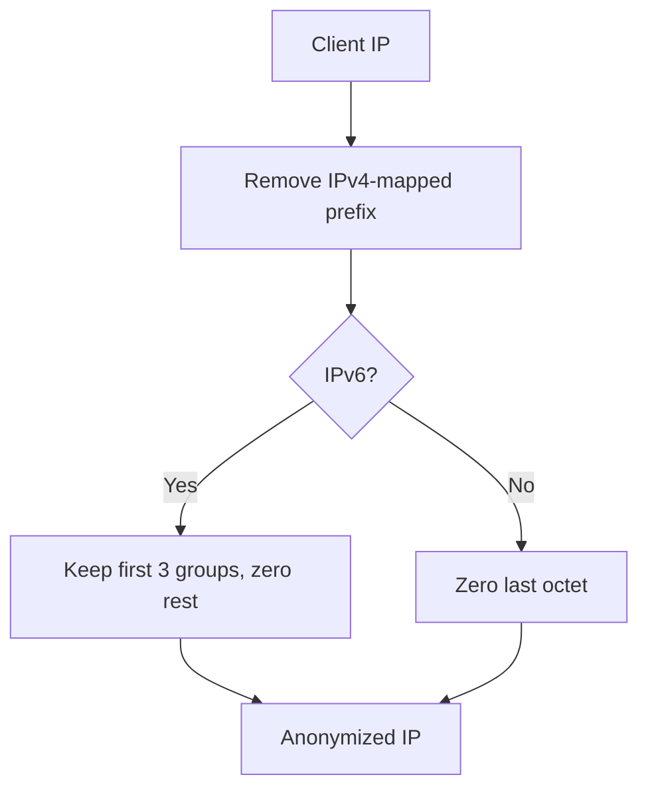

**Diagram sources**
- [server.js:109-127](file://server.js#L109-L127)

**Section sources**
- [server.js:109-127](file://server.js#L109-L127)

### Comprehensive Security Middleware Chain
- Prompt injection guard: regex-based detection blocks obvious attacks early, returning safe responses for chat and search.
- Quota monitoring: per-key daily counters warn and block after thresholds to prevent runaway spend.
- Session store: server-side conversation history prevents client tampering; sessions expire and evict oldest under capacity.
- Admin authentication: timing-safe comparison of secret header for protected endpoints.
- Input validation and sanitization: email regex, length limits, HTML tag stripping, URL whitelisting for linkable fields.
- Rate limiting: per-endpoint limits for chat, newsletter, search, and lead capture.

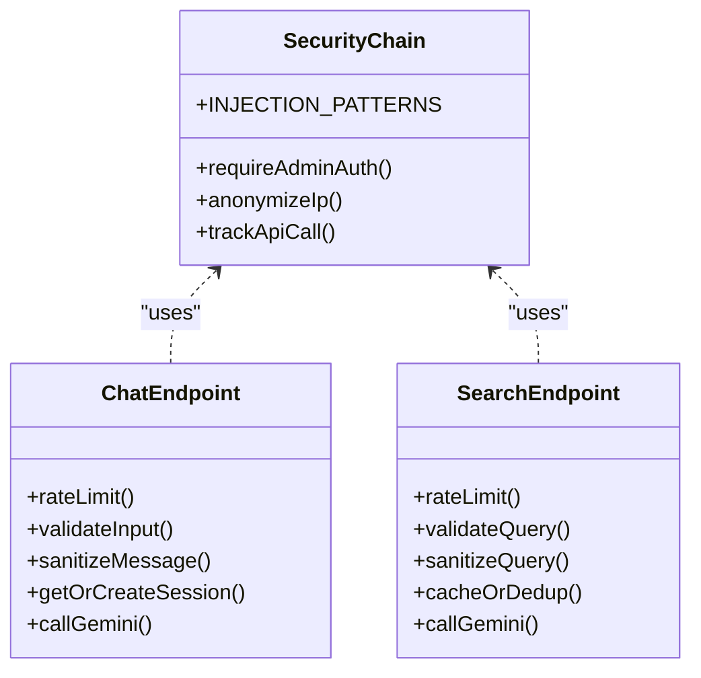

**Diagram sources**
- [server.js:75-93](file://server.js#L75-L93)
- [server.js:109-127](file://server.js#L109-L127)
- [server.js:129-187](file://server.js#L129-L187)
- [server.js:584-619](file://server.js#L584-L619)
- [server.js:743-815](file://server.js#L743-L815)
- [server.js:1126-1279](file://server.js#L1126-L1279)

**Section sources**
- [server.js:75-93](file://server.js#L75-L93)
- [server.js:109-127](file://server.js#L109-L127)
- [server.js:129-187](file://server.js#L129-L187)
- [server.js:584-619](file://server.js#L584-L619)
- [server.js:743-815](file://server.js#L743-L815)
- [server.js:1126-1279](file://server.js#L1126-L1279)

### API Endpoints and Error Handling Strategies
- Health check: simple status endpoint.
- Newsletter subscription: validates email, integrates with Brevo, handles duplicates gracefully.
- Lead capture: validates and sanitizes inputs, logs to JSONL, optionally saves to Brevo and sends notification emails.
- Chat: rate-limited, validates message, strips HTML tags, applies injection guard, uses server-side session, calls Gemini with timeout and retry to fallback model, returns local fallback if needed.
- Search AI: rate-limited, validates query, sanitizes, caches results, deduplicates concurrent requests, calls Gemini with timeout, robust JSON parsing with fallback.
- Admin-only endpoints: require header secret with timing-safe comparison.

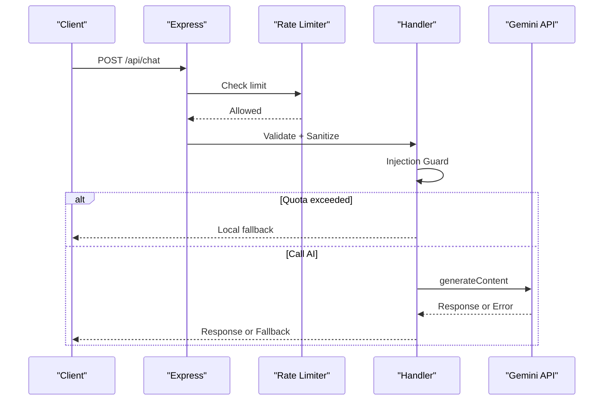

**Diagram sources**
- [server.js:817-820](file://server.js#L817-L820)
- [server.js:825-888](file://server.js#L825-L888)
- [server.js:901-1022](file://server.js#L901-L1022)
- [server.js:1126-1279](file://server.js#L1126-L1279)
- [server.js:743-815](file://server.js#L743-L815)

**Section sources**
- [server.js:817-820](file://server.js#L817-L820)
- [server.js:825-888](file://server.js#L825-L888)
- [server.js:901-1022](file://server.js#L901-L1022)
- [server.js:1126-1279](file://server.js#L1126-L1279)
- [server.js:743-815](file://server.js#L743-L815)

## Dependency Analysis
- Express app depends on:
  - cors for cross-origin control
  - compression for response compression
  - dotenv for environment variables
  - express-rate-limit for per-endpoint throttling
  - node-fetch for external API calls
  - Nunjucks templating (if used elsewhere)
- Centralized security headers and CORS helpers decouple policy from runtime logic.
- Search engine module encapsulates corpus loading, scoring, prompting, and result sanitization.

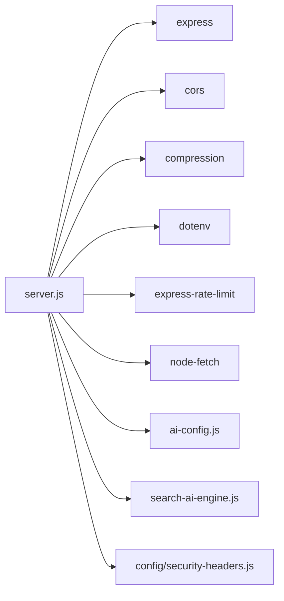

**Diagram sources**
- [package.json:69-77](file://package.json#L69-L77)
- [server.js:1-12](file://server.js#L1-L12)

**Section sources**
- [package.json:69-77](file://package.json#L69-L77)
- [server.js:1-12](file://server.js#L1-L12)

## Performance Considerations
- Compression reduces transfer sizes for text assets.
- Static assets use immutable caching in production to leverage browser and CDN caches.
- HTML pages use short cache with stale-while-revalidate for freshness.
- Search AI uses in-memory TTL cache and in-flight deduplication to minimize redundant API calls.
- Chat uses deterministic local responses for trivial greetings/thanks to save tokens.
- Quota monitoring prevents runaway spend and ensures graceful degradation.

[No sources needed since this section provides general guidance]

## Troubleshooting Guide
- Missing rate limiter dependency: in production, the server refuses to start without express-rate-limit installed.
- Missing admin secret: production warns if newsletter admin secret is still placeholder; protected endpoints will reject requests.
- Missing API keys: chat/search/writer endpoints log missing keys and fall back to local responses where possible.
- External API errors: chat and search handle timeouts and non-OK responses with retries or fallbacks.
- Brevo integration failures: newsletter and lead endpoints log errors and continue operation where possible.

**Section sources**
- [server.js:95-107](file://server.js#L95-L107)
- [server.js:228-232](file://server.js#L228-L232)
- [server.js:1581-1599](file://server.js#L1581-L1599)
- [server.js:1126-1279](file://server.js#L1126-L1279)
- [server.js:743-815](file://server.js#L743-L815)
- [server.js:825-888](file://server.js#L825-L888)
- [server.js:901-1022](file://server.js#L901-L1022)

## Conclusion
The application implements a robust, secure, and SEO-friendly Express architecture. The middleware pipeline enforces strong security headers, CORS policies, rate limiting, and input sanitization. Static assets are served with optimized caching, and SEO redirects ensure canonical URLs and legacy compatibility. Bot detection and IP anonymization support analytics and GDPR compliance. API endpoints integrate with external services while providing resilient fallbacks and clear error handling. Centralized configuration and modular design improve maintainability and safety.