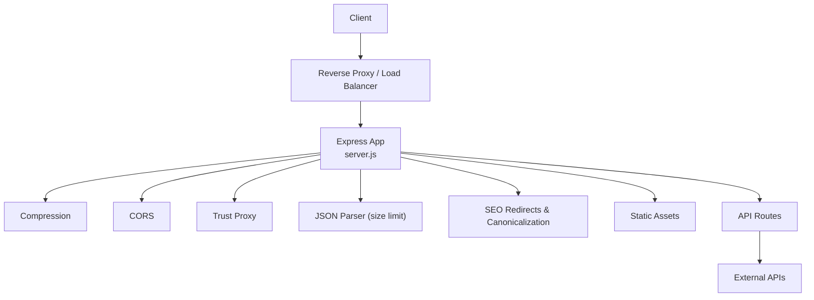
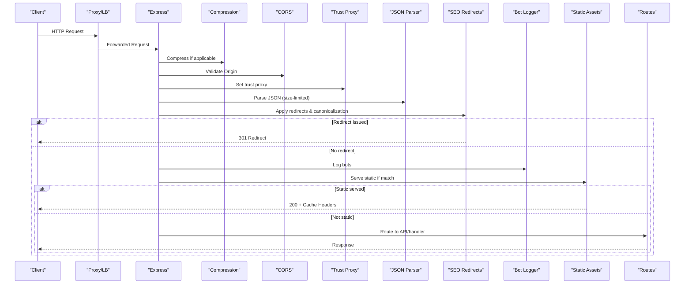
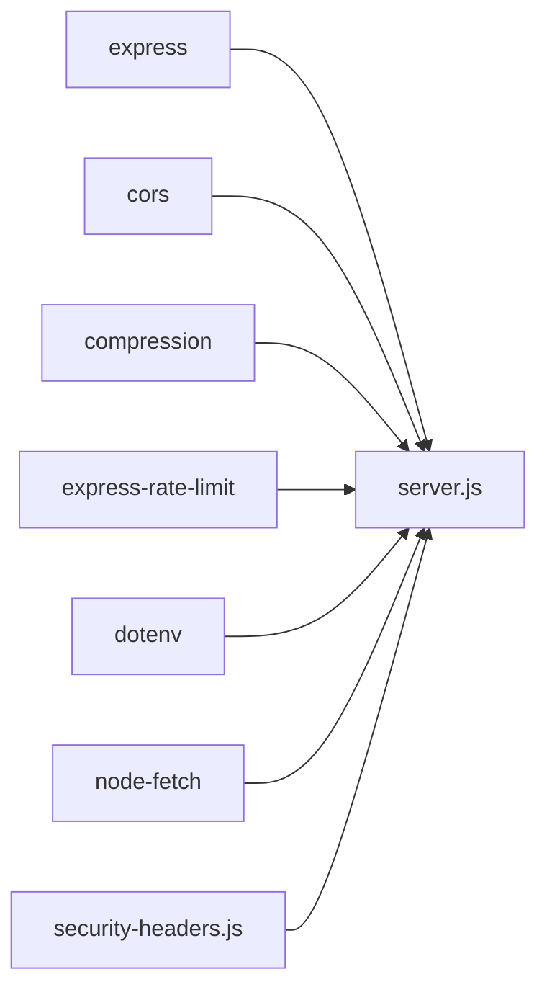

# Middleware Stack & Request Processing

<cite>
**Referenced Files in This Document**
- [server.js](file://server.js)
- [security-headers.js](file://config/security-headers.js)
- [package.json](file://package.json)
</cite>

## Table of Contents
1. [Introduction](#introduction)
2. [Project Structure](#project-structure)
3. [Core Components](#core-components)
4. [Architecture Overview](#architecture-overview)
5. [Detailed Component Analysis](#detailed-component-analysis)
6. [Dependency Analysis](#dependency-analysis)
7. [Performance Considerations](#performance-considerations)
8. [Troubleshooting Guide](#troubleshooting-guide)
9. [Conclusion](#conclusion)

## Introduction
This document explains the Express.js middleware stack and request processing pipeline used by the server. It covers the sequential order of middleware execution, including CORS configuration, JSON parsing with size limits, SEO-related redirects and canonicalization, bot detection logging, static file serving strategies, compression, trust proxy settings, cache header management, rate limiting, and error handling patterns. The goal is to provide a clear understanding of how each middleware contributes to security and performance, and how custom middleware can be added safely.

## Project Structure
The application is an Express server that wires together several middleware layers before routing to API endpoints or serving static content. Key files:
- server.js: Main Express app, middleware registration, routes, and handlers
- config/security-headers.js: Centralized security headers and CORS origin helpers
- package.json: Dependencies (Express, CORS, compression, express-rate-limit, etc.)

**Diagram sources**
- [server.js:234-287](file://server.js#L234-L287)
- [server.js:292-500](file://server.js#L292-L500)
- [server.js:817-1600](file://server.js#L817-L1600)

**Section sources**
- [server.js:1-120](file://server.js#L1-L120)
- [package.json:69-76](file://package.json#L69-L76)

## Core Components
- Compression: Optional Brotli/Gzip compression for text assets with threshold and filter support
- CORS: Whitelist-based origins with local development allowances
- Trust Proxy: Configured to trust the first proxy for accurate client IP resolution
- JSON Parser: Limits request body size to prevent DoS
- SEO Middleware Chain: Canonical host redirect, security headers, robots directives, legacy URL redirects, trailing slash normalization, UTM parameter stripping, singular/plural page canonicalization, public prefix stripping
- Bot Detection Logging: Logs known bot user agents to a rotating log file
- Static File Serving: Cache-aware static asset serving for CSS/JS/Images/fonts and HTML directories
- Rate Limiting: Per-endpoint rate limits for chat, newsletter, search AI, and lead capture
- Error Handling: Custom 404 handler returning HTML or JSON based on Accept header

**Section sources**
- [server.js:234-287](file://server.js#L234-L287)
- [server.js:292-500](file://server.js#L292-L500)
- [server.js:817-1600](file://server.js#L817-L1600)
- [security-headers.js:40-62](file://config/security-headers.js#L40-L62)

## Architecture Overview
The request lifecycle flows through a well-ordered middleware chain designed for security, SEO correctness, and performance:

**Diagram sources**
- [server.js:234-287](file://server.js#L234-L287)
- [server.js:292-500](file://server.js#L292-L500)
- [server.js:817-1600](file://server.js#L817-L1600)

## Detailed Component Analysis

### CORS Configuration
- Purpose: Restrict cross-origin requests to allowed domains while permitting non-browser requests without Origin header
- Behavior:
  - Allows requests without Origin (e.g., curl, health checks)
  - Validates against configured origins plus local development hosts
  - Sets allowed methods and headers
- Security impact: Prevents unauthorized cross-origin access; sensitive endpoints rely on additional auth and rate limiting

**Section sources**
- [server.js:265-282](file://server.js#L265-L282)
- [security-headers.js:50-62](file://config/security-headers.js#L50-L62)

### JSON Parsing with Size Limits
- Purpose: Parse JSON bodies and protect against oversized payloads
- Behavior:
  - Uses built-in JSON parser with a strict size limit
- Security impact: Mitigates memory exhaustion and DoS via large payloads

**Section sources**
- [server.js:287-287](file://server.js#L287-L287)

### SEO Middleware Chain
Includes multiple middleware steps executed in sequence:

1. Canonical Host Redirect
   - Redirects non-www to www in production
2. Security Headers
   - Applies centralized security headers (HSTS, CSP, X-Frame-Options, Referrer-Policy, Permissions-Policy)
3. Robots Directives
   - Adds noindex/nofollow for API/admin paths and pages governed by policy
4. Legacy URL Redirects
   - Parametric redirect for deprecated cluster URLs
   - Map-based redirects for stale build artifacts and blog paths
   - Dist path canonicalization for safe legacy extensions
5. Trailing Slash Normalization
   - 301 redirects to remove trailing slashes except for specific directories
6. UTM/Tracking Parameter Stripping
   - Removes tracking parameters to avoid duplicate content
7. Singular/Plural Page Canonicalization
   - Redirects plural forms to singular where needed
8. Public Prefix Stripping
   - Redirects /public/ prefixed paths to canonical paths

Security and SEO benefits:
- Enforces canonical URLs to consolidate ranking signals
- Blocks indexing of internal/API paths
- Reduces duplicate content risks
- Maintains backward compatibility for legacy URLs

**Section sources**
- [server.js:292-439](file://server.js#L292-L439)
- [security-headers.js:40-48](file://config/security-headers.js#L40-L48)

### Bot Detection Logging
- Purpose: Track crawler activity for GEO strategy insights
- Behavior:
  - Matches known bot user agents
  - Appends structured log entries to a file
  - Rotates logs when exceeding size thresholds
- Performance considerations: Asynchronous append with fallback; rotation prevents unbounded growth

**Section sources**
- [server.js:395-429](file://server.js#L395-L429)

### Static File Serving Strategies
- Purpose: Serve CSS, JS, images, fonts, and HTML directories with appropriate caching
- Behavior:
  - Development: no-cache headers to ensure fresh assets during builds
  - Production: long-lived immutable caching for assets; shorter TTL with stale-while-revalidate for HTML
  - AI-discoverable files open CORS for broad accessibility
  - Specific routes serve index.html for key sections with tailored cache headers
- Performance benefits:
  - Leverages browser and CDN caching
  - Reduces bandwidth and improves load times

**Section sources**
- [server.js:458-530](file://server.js#L458-L530)

### Compression Middleware Setup
- Purpose: Reduce transfer sizes for text responses
- Behavior:
  - Optional dependency; gracefully degrades if not installed
  - Configurable level and threshold
  - Respects x-no-compression header to disable per-request
- Performance benefits: Significant reduction in payload size for text-heavy responses

**Section sources**
- [server.js:234-249](file://server.js#L234-L249)

### Trust Proxy Configuration
- Purpose: Correctly resolve client IP behind proxies/load balancers
- Behavior:
  - Trusts the first proxy hop
- Security impact: Ensures accurate IP-based rate limiting and logging

**Section sources**
- [server.js:284-285](file://server.js#L284-L285)

### Cache Header Management Strategies
- Purpose: Optimize caching across environments
- Behavior:
  - Centralized helper sets Cache-Control and platform-specific headers (CDN-Cache-Control, Surrogate-Control)
  - Different policies for assets vs HTML
  - AI-discoverable files set permissive CORS for crawlers
- Performance benefits: Improves repeat visit performance and reduces server load

**Section sources**
- [server.js:458-530](file://server.js#L458-L530)

### Rate Limiting Configuration
- Purpose: Protect endpoints from abuse and manage resource usage
- Behavior:
  - Chat endpoint: 30 requests per 15 minutes per IP
  - Newsletter endpoint: 10 requests per 15 minutes per IP
  - Search AI endpoint: 10 requests per minute per IP
  - Lead capture endpoint: 5 requests per 15 minutes per IP
  - Graceful fallback in dev if dependency missing; fatal in production
- Security benefits: Mitigates brute-force and scraping attempts

**Section sources**
- [server.js:95-107](file://server.js#L95-L107)
- [server.js:252-262](file://server.js#L252-L262)
- [server.js:625-641](file://server.js#L625-L641)
- [server.js:890-897](file://server.js#L890-L897)

### Comprehensive Redirect System for Legacy URL Compatibility
- Purpose: Maintain SEO continuity and user experience for old URLs
- Behavior:
  - Parametric redirects for deprecated service clusters
  - Explicit mapping for stale build artifacts and blog paths
  - Dist path canonicalization for safe legacy extensions
  - Trailing slash normalization and UTM stripping
  - Singular/plural page canonicalization
  - Public prefix stripping
- Impact: Consolidates link equity and avoids duplicate content penalties

**Section sources**
- [server.js:321-393](file://server.js#L321-L393)
- [server.js:334-356](file://server.js#L334-L356)

### Custom Middleware Implementation Examples
- Admin authentication middleware: Validates secret via timing-safe comparison
- Bot logger middleware: Detects and logs bot traffic
- SEO redirect middleware: Implements canonicalization and legacy redirects
- Static asset middleware: Applies environment-aware cache headers

Implementation guidance:
- Place security-sensitive middleware early (auth, CORS, trust proxy)
- Place SEO redirects before static serving to intercept legacy paths
- Use small, focused middleware for single responsibilities
- Ensure next() is called to continue the chain

**Section sources**
- [server.js:75-93](file://server.js#L75-L93)
- [server.js:395-429](file://server.js#L395-L429)
- [server.js:292-439](file://server.js#L292-L439)

### Error Handling Patterns
- Custom 404 handler: Returns branded HTML or JSON based on Accept header
- API route errors: Return structured JSON with status codes
- Fallback logic: Graceful degradation when external services are unavailable
- Logging: Errors logged with context for debugging

**Section sources**
- [server.js:1569-1579](file://server.js#L1569-L1579)
- [server.js:817-820](file://server.js#L817-L820)
- [server.js:1263-1278](file://server.js#L1263-L1278)

## Dependency Analysis
Key dependencies and their roles:
- express: Web framework and middleware engine
- cors: Cross-origin resource sharing control
- compression: Response compression for performance
- express-rate-limit: Per-endpoint rate limiting
- dotenv: Environment variable loading
- node-fetch: HTTP client for external APIs

**Diagram sources**
- [package.json:69-76](file://package.json#L69-L76)
- [server.js:234-287](file://server.js#L234-L287)

**Section sources**
- [package.json:69-76](file://package.json#L69-L76)
- [server.js:234-287](file://server.js#L234-L287)

## Performance Considerations
- Enable compression to reduce payload sizes for text responses
- Use long-lived immutable caching for assets in production
- Apply stale-while-revalidate for HTML to improve perceived performance
- Strip unnecessary query parameters to reduce cache bloat
- Rate limit high-cost endpoints to protect resources
- Avoid synchronous I/O in hot paths; use async operations where possible
- Rotate logs to prevent disk exhaustion

[No sources needed since this section provides general guidance]

## Troubleshooting Guide
Common issues and resolutions:
- Missing compression dependency: Install optional dependency or accept degraded behavior
- CORS failures: Verify allowed origins include the requesting domain; check local development exceptions
- Incorrect client IP: Ensure trust proxy is configured correctly behind reverse proxies
- Large payload errors: Adjust JSON parser limit if legitimate large uploads are required
- Duplicate content warnings: Confirm trailing slash normalization and UTM stripping are active
- Bot logs not written: Check file permissions and disk space; verify rotation logic

**Section sources**
- [server.js:234-249](file://server.js#L234-L249)
- [server.js:265-282](file://server.js#L265-L282)
- [server.js:284-287](file://server.js#L284-L287)
- [server.js:395-429](file://server.js#L395-L429)

## Conclusion
The Express middleware stack is carefully ordered to enforce security, optimize performance, and maintain SEO integrity. Early layers handle compression, CORS, trust proxy, and input validation. The SEO chain ensures canonical URLs, blocks indexing of sensitive paths, and preserves legacy compatibility. Static assets are served with environment-aware caching, and rate limiting protects high-cost endpoints. Custom middleware should follow the same principles: secure, focused, and placed appropriately in the chain.