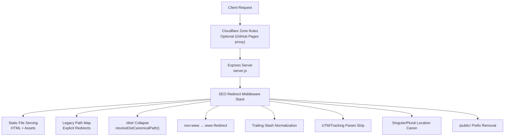
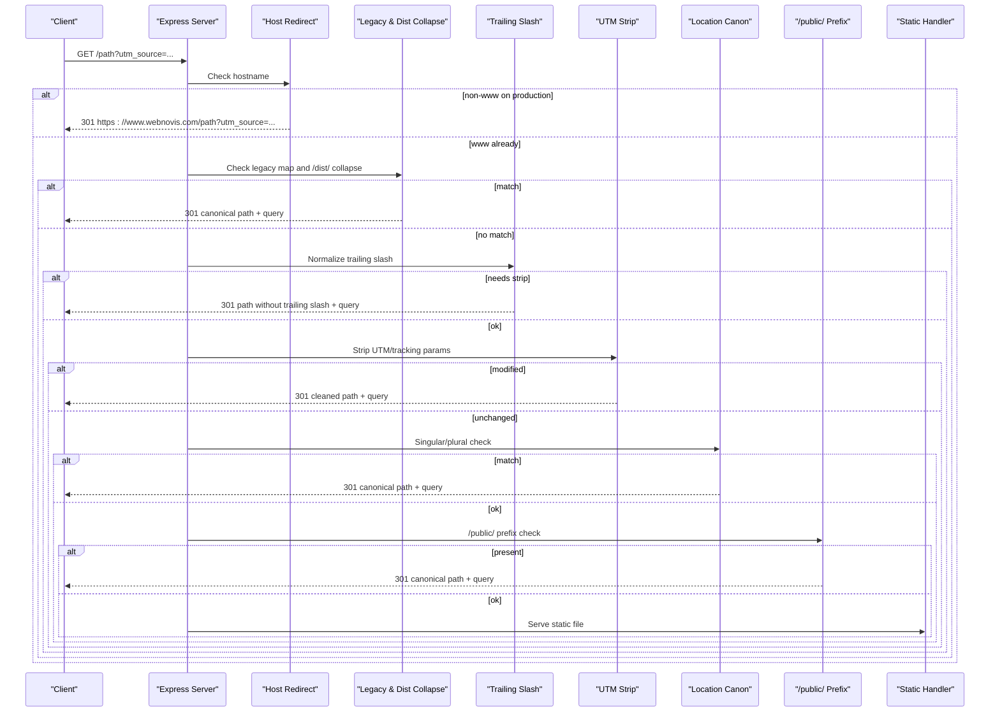
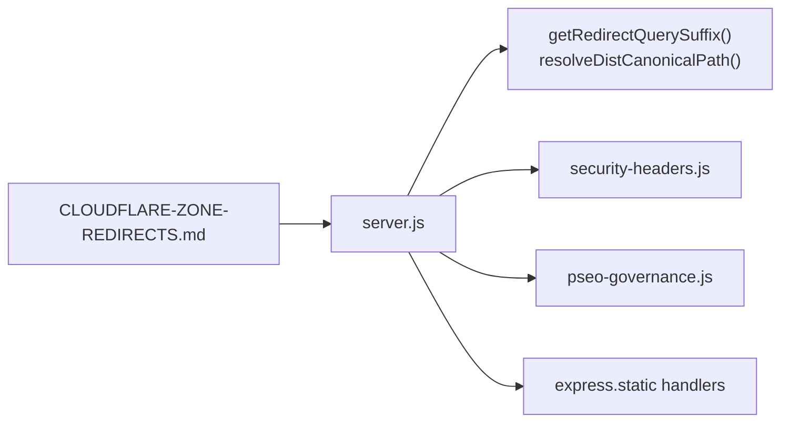

# SEO Redirect System

<cite>
**Referenced Files in This Document**
- [server.js](file://server.js)
- [pseo-governance.js](file://config/pseo-governance.js)
- [security-headers.js](file://config/security-headers.js)
- [CLOUDFLARE-ZONE-REDIRECTS.md](file://docs/deploy/CLOUDFLARE-ZONE-REDIRECTS.md)
- [MIGRAZIONE-CLOUDFLARE-PAGES.md](file://docs/deploy/MIGRAZIONE-CLOUDFLARE-PAGES.md)
- [public-artifact.js](file://scripts/public-artifact.js)
- [normalize-public-html.js](file://scripts/normalize-public-html.js)
</cite>

## Table of Contents
1. [Introduction](#introduction)
2. [Project Structure](#project-structure)
3. [Core Components](#core-components)
4. [Architecture Overview](#architecture-overview)
5. [Detailed Component Analysis](#detailed-component-analysis)
6. [Dependency Analysis](#dependency-analysis)
7. [Performance Considerations](#performance-considerations)
8. [Troubleshooting Guide](#troubleshooting-guide)
9. [Conclusion](#conclusion)

## Introduction
This document explains the site’s comprehensive SEO redirect system implemented at runtime and during deployment. It covers:
- Canonical host redirect from non-www to www
- Deprecated cluster redirects for legacy URL patterns
- Build-artifact redirects that collapse stale /dist/ URLs to canonical paths
- Trailing slash normalization with directory exclusions
- UTM/tracking parameter stripping to prevent duplicate content
- Singular/plural location page canonicalization
- /public/ prefix removal
It also documents query parameter preservation, redirect chain implications, and how the legacy path mapping maintains backward compatibility while enforcing SEO best practices.

## Project Structure
The redirect logic is primarily implemented as Express middleware in the server process, with additional platform-level redirects documented for Cloudflare when serving via GitHub Pages. Build-time scripts support artifact integrity and HTML normalization.

**Diagram sources**
- [server.js:291-439](file://server.js#L291-L439)
- [CLOUDFLARE-ZONE-REDIRECTS.md:1-46](file://docs/deploy/CLOUDFLARE-ZONE-REDIRECTS.md#L1-L46)

**Section sources**
- [server.js:291-439](file://server.js#L291-L439)
- [CLOUDFLARE-ZONE-REDIRECTS.md:1-46](file://docs/deploy/CLOUDFLARE-ZONE-REDIRECTS.md#L1-L46)

## Core Components
- Canonical host redirect: Enforces www on production requests.
- Deprecated cluster redirects: Maps deprecated service-cluster URLs to current slugs.
- Build-artifact redirects: Collapses stale /dist/ URLs to canonical public paths.
- Trailing slash normalization: Removes trailing slashes except for specific directories served via static handlers.
- UTM/tracking parameter stripping: Removes campaign and tracking parameters to avoid duplicate content.
- Singular/plural location page canonicalization: Redirects known plural typos to singular canonical pages.
- /public/ prefix removal: Redirects /public/ prefixed paths to their canonical counterparts.

**Section sources**
- [server.js:291-439](file://server.js#L291-L439)

## Architecture Overview
The request lifecycle flows through a well-ordered middleware stack designed to normalize URLs early and minimize downstream processing. Each redirect returns a 301 status code to signal permanent redirection and preserve link equity. Query strings are preserved across redirects using a helper function.

**Diagram sources**
- [server.js:291-439](file://server.js#L291-L439)

## Detailed Component Analysis

### Canonical Host Redirect (non-www to www)
- Behavior: On production, any request to webnovis.com is permanently redirected to www.webnovis.com with the original URL and query string preserved.
- Purpose: Consolidates authority and avoids duplicate content between www and non-www variants.
- Example:
  - Input: http://webnovis.com/servizi?utm_campaign=email
  - Output: 301 https://www.webnovis.com/servizi?utm_campaign=email

**Section sources**
- [server.js:291-298](file://server.js#L291-L298)

### Deprecated Cluster Redirects (legacy URL patterns)
- Behavior: Requests matching the deprecated pattern /consulenza-digitale-{slug}.html are redirected to /consulenze-{slug}.html.
- Purpose: Maintains backward compatibility for old service-cluster URLs while consolidating to the canonical slug pattern.
- Example:
  - Input: /consulenza-digitale-milano.html
  - Output: 301 /consulenze-milano.html

**Section sources**
- [server.js:321-332](file://server.js#L321-L332)

### Build-Artifact Redirects (/dist/ collapse)
- Behavior: Stale /dist/ URLs are collapsed to their canonical public paths. The resolver checks filesystem existence and normalizes index.html to directory roots where appropriate. Only safe legacy extensions are allowed for direct file mapping.
- Purpose: Prevents 404s from historical build artifacts and consolidates indexing signals.
- Examples:
  - Input: /dist/blog/article.html
  - Output: 301 /blog/article.html
  - Input: /dist/index.html
  - Output: 301 /
- Note: If the target does not exist or extension is not allowed, the request proceeds to subsequent middleware.

**Section sources**
- [server.js:37-73](file://server.js#L37-L73)
- [server.js:334-356](file://server.js#L334-L356)

### Explicit Legacy Path Mapping
- Behavior: A small set of explicit legacy paths are mapped to canonical targets, preserving query strings.
- Purpose: Handles known historical URLs that do not fit generic patterns.
- Examples:
  - /accessibilita-rho.html → /servizi/accessibilita.html
  - /social-media-rho.html → /servizi/social-media.html
  - /chiedere-recensioni-clienti → /blog/chiedere-recensioni-clienti.html
  - /blog/* → /blog/

**Section sources**
- [server.js:334-356](file://server.js#L334-L356)

### Trailing Slash Normalization with Directory Exclusions
- Behavior: For paths longer than one character ending with a slash, the trailing slash is removed unless the path starts with an excluded directory prefix.
- Excluded directories: /blog/, /servizi/, /agenzia-web/, /realizzazione-siti-web/, /zone-servite/. These serve index.html via express.static and should keep their trailing slash behavior.
- Purpose: Avoids duplicate content between /page and /page/ while preserving correct routing for directories.
- Example:
  - Input: /portfolio/
  - Output: 301 /portfolio

**Section sources**
- [server.js:358-367](file://server.js#L358-L367)

### UTM/Tracking Parameter Stripping
- Behavior: Campaign and tracking parameters (e.g., utm_source, utm_medium, utm_campaign, utm_term, utm_content, fbclid, gclid) are stripped before serving content.
- Purpose: Prevents duplicate content caused by marketing links and ensures consistent canonical URLs for crawlers.
- Example:
  - Input: /servizi?utm_source=newsletter&utm_medium=email
  - Output: 301 /servizi

**Section sources**
- [server.js:369-384](file://server.js#L369-L384)

### Singular/Plural Location Page Canonicalization
- Behavior: Known plural typos for location pages are redirected to their singular canonical form.
- Purpose: Consolidates ranking signals and prevents duplicate content from common misspellings.
- Example:
  - Input: /agenzie-web-rho.html
  - Output: 301 /agenzia-web-rho.html

**Section sources**
- [server.js:386-393](file://server.js#L386-L393)

### /public/ Prefix Removal
- Behavior: Any request starting with /public/ is redirected to the same path without the /public/ prefix.
- Purpose: Ensures internal build artifacts or staging prefixes do not become indexable endpoints.
- Example:
  - Input: /public/css/style.css
  - Output: 301 /css/style.css

**Section sources**
- [server.js:431-439](file://server.js#L431-L439)

### Query Parameter Preservation Across Redirects
- Behavior: All redirects preserve the original query string using a helper that extracts everything after the first “?” in the request URL.
- Impact: Marketing campaigns and analytics remain intact through redirects, enabling accurate attribution while still canonicalizing the path.

**Section sources**
- [server.js:33-35](file://server.js#L33-L35)
- [server.js:321-393](file://server.js#L321-L393)

### Platform-Level Redirects (Cloudflare Single Redirects)
- Behavior: When serving via GitHub Pages behind Cloudflare, zone-level Single Redirects can enforce canonical host and /dist/ collapsing at the edge.
- Purpose: Reduces latency and offloads redirect logic to the CDN layer during transitional hosting setups.
- Examples documented:
  - Plural-to-singular typo redirect for Rho location page
  - /dist/* collapse to canonical root path

**Section sources**
- [CLOUDFLARE-ZONE-REDIRECTS.md:1-46](file://docs/deploy/CLOUDFLARE-ZONE-REDIRECTS.md#L1-L46)

### Legacy Path Mapping System and Backward Compatibility
- Behavior: The server combines parametric pattern-based redirects (deprecated clusters) with explicit mappings for known legacy URLs.
- Purpose: Maintains backward compatibility for external links and bookmarks while enforcing canonicalization and SEO best practices.
- Governance: Non-indexable GEO pages are controlled by pSEO governance; removed or de-amplified paths receive noindex directives to protect crawl budget.

**Section sources**
- [server.js:321-356](file://server.js#L321-L356)
- [pseo-governance.js:171-287](file://config/pseo-governance.js#L171-L287)

## Dependency Analysis
The redirect system depends on:
- Express middleware ordering to ensure canonicalization happens before static file serving.
- Helper functions for query extraction and /dist/ resolution.
- Configuration modules for security headers and pSEO governance.
- Optional platform-level rules (Cloudflare) when hosted via GitHub Pages.

**Diagram sources**
- [server.js:291-439](file://server.js#L291-L439)
- [security-headers.js:40-48](file://config/security-headers.js#L40-L48)
- [pseo-governance.js:279-287](file://config/pseo-governance.js#L279-L287)
- [CLOUDFLARE-ZONE-REDIRECTS.md:1-46](file://docs/deploy/CLOUDFLARE-ZONE-REDIRECTS.md#L1-L46)

**Section sources**
- [server.js:291-439](file://server.js#L291-L439)
- [security-headers.js:40-48](file://config/security-headers.js#L40-L48)
- [pseo-governance.js:279-287](file://config/pseo-governance.js#L279-L287)

## Performance Considerations
- Redirect chains: Each redirect adds an extra round trip. The middleware order minimizes chains by handling host, legacy, dist collapse, trailing slash, UTM stripping, and prefix removal in sequence. Prefer platform-level redirects (Cloudflare) for high-volume cases to reduce origin load.
- Query parsing: Using URL constructor for UTM stripping is efficient but incurs per-request overhead. Keep the list of parameters minimal and targeted.
- Filesystem checks: /dist/ collapse performs fs.statSync checks; ensure only necessary paths reach this middleware to avoid disk I/O on every request.
- Cache headers: Static assets and HTML use cache-control strategies to reduce repeated fetches and improve perceived performance.

[No sources needed since this section provides general guidance]

## Troubleshooting Guide
- Unexpected 404 after /dist/ access: Verify the target exists under the public root and has a safe extension. If not, the request will proceed to other middleware and may result in 404 if no route matches.
- Duplicate content warnings: Ensure UTM stripping is active and canonical host redirect is enforced. Check for missing trailing slash normalization on custom routes.
- Broken campaign links: Confirm query parameter preservation is working; inspect logs for 301 responses and verify final URL contains expected query string.
- Hosting-specific behavior: When using GitHub Pages behind Cloudflare, configure zone-level Single Redirects for canonical host and /dist/ collapse to avoid extra hops.

**Section sources**
- [server.js:37-73](file://server.js#L37-L73)
- [server.js:369-384](file://server.js#L369-L384)
- [CLOUDFLARE-ZONE-REDIRECTS.md:1-46](file://docs/deploy/CLOUDFLARE-ZONE-REDIRECTS.md#L1-L46)

## Conclusion
The SEO redirect system enforces canonical URLs, consolidates legacy paths, and removes duplicate content sources through a layered approach combining server-side middleware and optional platform-level rules. By preserving query parameters, excluding key directories from trailing slash normalization, and collapsing stale build artifacts, the system maintains backward compatibility while optimizing crawl efficiency and ranking signals. Proper configuration and monitoring ensure robust SEO outcomes across different hosting environments.

[No sources needed since this section summarizes without analyzing specific files]