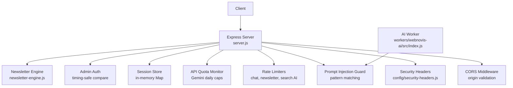
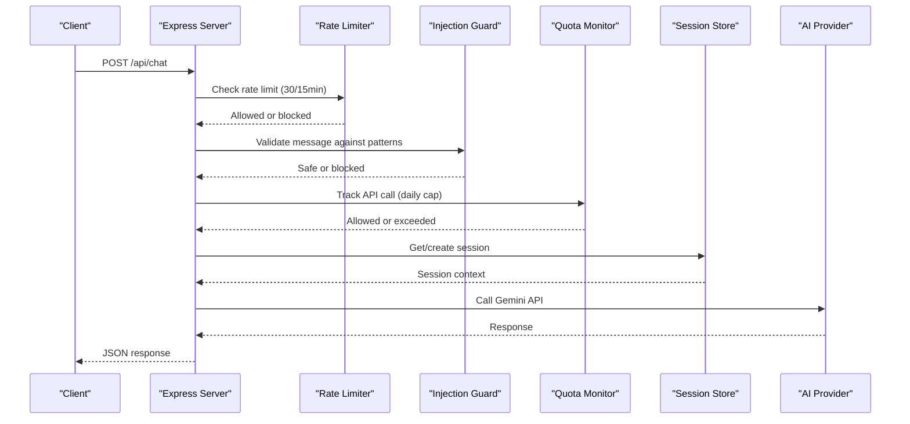
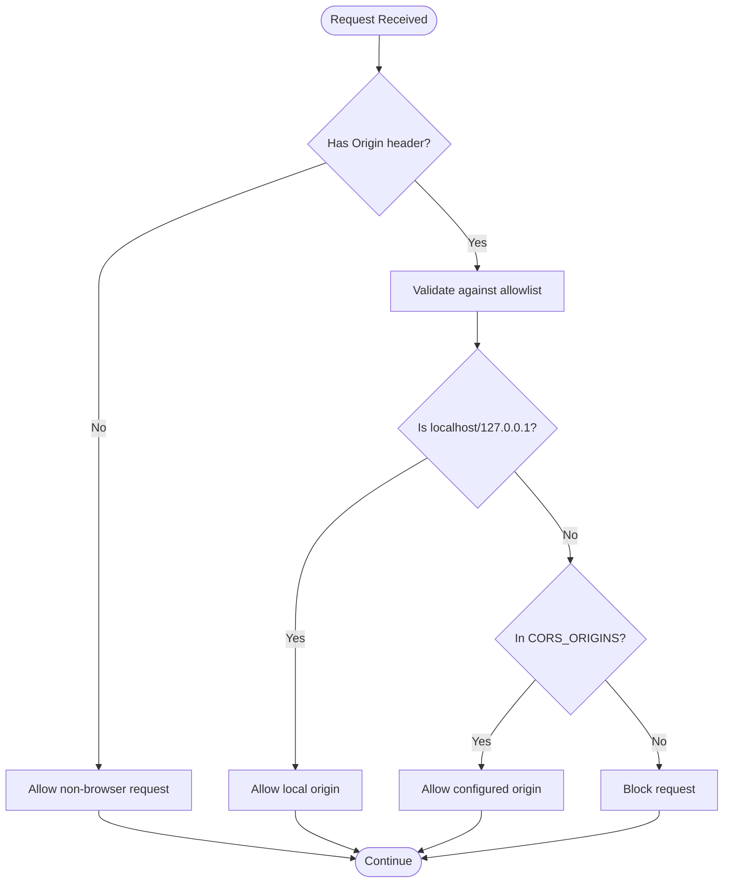
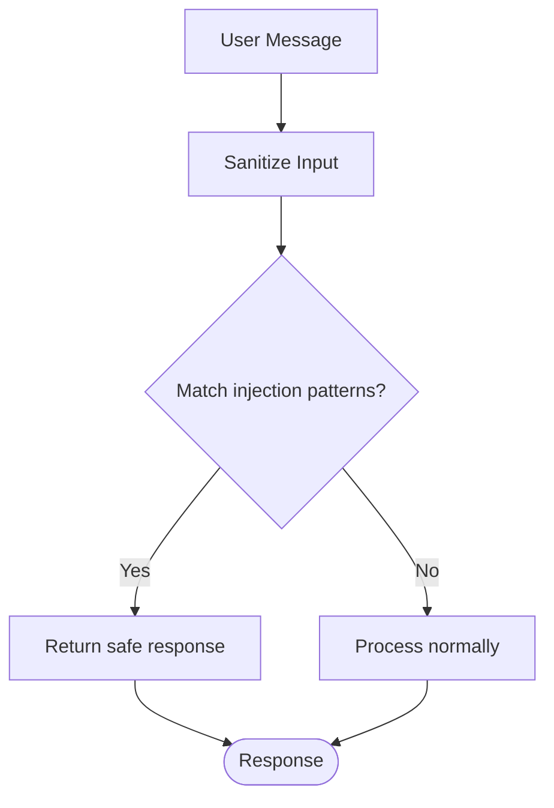
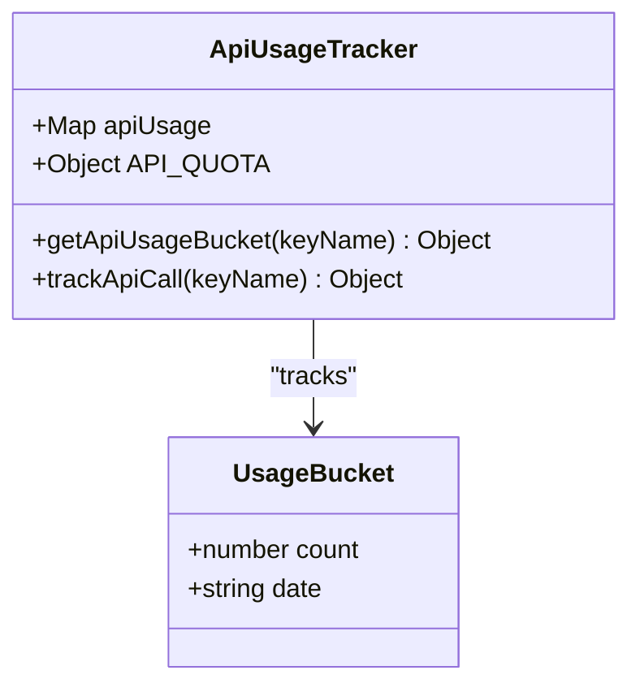
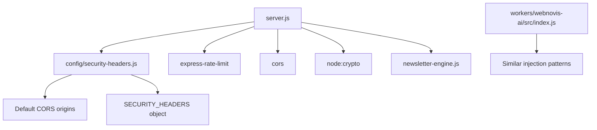

# Security Middleware & Protection

<cite>
**Referenced Files in This Document**
- [server.js](file://server.js)
- [security-headers.js](file://config/security-headers.js)
- [newsletter-engine.js](file://newsletter-engine.js)
- [index.js (webnovis-ai worker)](file://workers/webnovis-ai/src/index.js)
</cite>

## Table of Contents
1. [Introduction](#introduction)
2. [Project Structure](#project-structure)
3. [Core Components](#core-components)
4. [Architecture Overview](#architecture-overview)
5. [Detailed Component Analysis](#detailed-component-analysis)
6. [Dependency Analysis](#dependency-analysis)
7. [Performance Considerations](#performance-considerations)
8. [Troubleshooting Guide](#troubleshooting-guide)
9. [Conclusion](#conclusion)

## Introduction
This document explains the security middleware layer and protections implemented in the Node.js server. It covers CORS with origin validation, JSON payload size limits, trust proxy configuration, comprehensive security headers, prompt injection protection (Italian and English patterns, leetspeak detection, indirect injection prevention), API quota monitoring for Gemini usage, rate limiting for chat, newsletter, and search AI endpoints, IP anonymization for GDPR compliance, memory-based session management, and admin authentication using timing-safe comparison.

## Project Structure
The security middleware is primarily implemented in the Express server and a shared security headers module. Additional protections are present in the AI worker code. The newsletter engine provides secure email operations and unsubscribe handling.

**Diagram sources**
- [server.js:250-287](file://server.js#L250-L287)
- [security-headers.js:40-48](file://config/security-headers.js#L40-L48)
- [server.js:253-262](file://server.js#L253-L262)
- [server.js:625-641](file://server.js#L625-L641)
- [server.js:129-175](file://server.js#L129-L175)
- [server.js:180-220](file://server.js#L180-L220)
- [server.js:584-619](file://server.js#L584-L619)
- [server.js:75-93](file://server.js#L75-L93)
- [newsletter-engine.js:156-227](file://newsletter-engine.js#L156-L227)
- [index.js (webnovis-ai worker):35-65](file://workers/webnovis-ai/src/index.js#L35-L65)

**Section sources**
- [server.js:1-120](file://server.js#L1-L120)
- [security-headers.js:1-48](file://config/security-headers.js#L1-L48)

## Core Components
- CORS with strict origin allowlist and local development support
- JSON body parser limited to 16KB to prevent DoS via large payloads
- Trust proxy set to one hop for correct client IP resolution behind proxies
- Comprehensive security headers including HSTS, CSP, X-Frame-Options, Referrer-Policy, Permissions-Policy
- Prompt injection guard with multi-language pattern matching and leetspeak detection
- API quota monitoring per key with warning thresholds and hard caps
- Rate limiters for chat (30/15min), newsletter (10/15min), search AI (10/min)
- IP anonymization for GDPR compliance
- Memory-based session store with TTL and eviction policies
- Admin authentication using timing-safe comparison

**Section sources**
- [server.js:250-287](file://server.js#L250-L287)
- [server.js:287](file://server.js#L287)
- [server.js:285](file://server.js#L285)
- [security-headers.js:40-48](file://config/security-headers.js#L40-L48)
- [server.js:129-175](file://server.js#L129-L175)
- [server.js:180-220](file://server.js#L180-L220)
- [server.js:253-262](file://server.js#L253-L262)
- [server.js:625-641](file://server.js#L625-L641)
- [server.js:109-127](file://server.js#L109-L127)
- [server.js:584-619](file://server.js#L584-L619)
- [server.js:75-93](file://server.js#L75-L93)

## Architecture Overview
The server applies middleware in a layered order:
1. CORS with dynamic origin validation
2. Trust proxy configuration
3. JSON body parsing with size limits
4. Security headers applied to all responses
5. SEO-related redirects and canonicalization
6. Bot logging and static asset serving
7. Endpoint-specific rate limiters
8. Prompt injection checks before AI calls
9. Quota tracking before external API calls
10. Session management for stateful interactions
11. Admin authentication for protected endpoints

**Diagram sources**
- [server.js:253-262](file://server.js#L253-L262)
- [server.js:129-175](file://server.js#L129-L175)
- [server.js:180-220](file://server.js#L180-L220)
- [server.js:584-619](file://server.js#L584-L619)
- [server.js:1126-1279](file://server.js#L1126-L1279)

## Detailed Component Analysis

### CORS Configuration with Origin Validation
The CORS middleware validates origins against an allowlist that includes default production domains and environment-configured origins. Local development origins (localhost, 127.0.0.1) are automatically allowed. Non-browser requests without Origin headers are permitted but rely on other security measures like rate limiting and admin authentication.

**Diagram sources**
- [server.js:265-282](file://server.js#L265-L282)
- [security-headers.js:57-62](file://config/security-headers.js#L57-L62)

**Section sources**
- [server.js:265-282](file://server.js#L265-L282)
- [security-headers.js:1-62](file://config/security-headers.js#L1-L62)

### JSON Payload Size Limits and Trust Proxy
The Express JSON parser is configured with a 16KB limit to prevent denial-of-service attacks through oversized payloads. Trust proxy is set to 1 to correctly resolve client IPs when requests come through reverse proxies like Nginx or load balancers.

**Section sources**
- [server.js:287](file://server.js#L287)
- [server.js:285](file://server.js#L285)

### Comprehensive Security Headers Implementation
Security headers are centrally managed and applied to all responses, including:
- Strict-Transport-Security for HTTPS enforcement
- X-Content-Type-Options to prevent MIME sniffing
- X-Frame-Options to prevent clickjacking
- Content-Security-Policy with strict directives
- Referrer-Policy for privacy control
- Permissions-Policy to restrict browser features
- XSS-Protection disabled in favor of modern CSP

**Section sources**
- [security-headers.js:40-48](file://config/security-headers.js#L40-L48)
- [server.js:303-306](file://server.js#L303-L306)

### Prompt Injection Protection System
The injection guard uses comprehensive regex patterns to detect both direct and indirect prompt injection attempts in Italian and English, including:
- Direct commands like "ignore instructions", "forget rules"
- Leetspeak variations like "ign0ra", spaced-out text
- Indirect extraction via translation commands
- Role-play escalation and jailbreak keywords
- Multi-turn preamble attacks

When injection is detected, safe fallback responses are returned instead of processing the malicious input.

**Diagram sources**
- [server.js:129-175](file://server.js#L129-L175)
- [server.js:177-178](file://server.js#L177-L178)

**Section sources**
- [server.js:129-175](file://server.js#L129-L175)
- [server.js:177-178](file://server.js#L177-L178)

### API Quota Monitoring System
The quota system tracks daily usage per API key with configurable warning thresholds and hard caps:
- Daily limits: 1500 requests per key (matching Gemini free tier)
- Warning threshold: 80% usage triggers console warnings
- Hard cap: Requests blocked when daily limit is reached
- Graceful degradation: Fallback responses when quotas are exceeded

**Diagram sources**
- [server.js:180-220](file://server.js#L180-L220)

**Section sources**
- [server.js:180-220](file://server.js#L180-L220)

### Rate Limiting Configuration
Three distinct rate limiters protect different endpoints:
- Chat API: 30 requests per 15 minutes per IP
- Newsletter API: 10 requests per 15 minutes per IP  
- Search AI: 10 requests per minute per IP

Each limiter returns standard headers and custom error messages when limits are exceeded.

**Section sources**
- [server.js:253-262](file://server.js#L253-L262)
- [server.js:625-641](file://server.js#L625-L641)

### IP Anonymization for GDPR Compliance
IP addresses are anonymized to comply with GDPR requirements:
- IPv4: Last octet zeroed out
- IPv6: Last 80 bits zeroed out
- Preserves enough information for geographic analysis while removing PII

**Section sources**
- [server.js:109-127](file://server.js#L109-L127)

### Session Management with Memory-Based Storage
Server-side sessions provide tamper-proof conversation history:
- In-memory Map storage with automatic cleanup
- 30-minute TTL for inactive sessions
- Maximum 100 concurrent sessions with LRU eviction
- Client-sent history is ignored to prevent forgery
- Periodic cleanup runs every 5 minutes

**Section sources**
- [server.js:584-619](file://server.js#L584-L619)

### Admin Authentication Using Timing-Safe Comparison
Protected endpoints use timing-safe comparison to prevent timing attacks:
- Secret validated from X-Admin-Secret header
- Length check prevents timing leaks
- crypto.timingSafeEqual ensures constant-time comparison
- Secure error messages don't reveal authentication status

**Section sources**
- [server.js:75-93](file://server.js#L75-L93)

## Dependency Analysis
The security middleware has clear dependencies and relationships:

**Diagram sources**
- [server.js:1-12](file://server.js#L1-L12)
- [security-headers.js:1-112](file://config/security-headers.js#L1-L112)
- [index.js (webnovis-ai worker):35-65](file://workers/webnovis-ai/src/index.js#L35-L65)

**Section sources**
- [server.js:1-12](file://server.js#L1-L12)
- [security-headers.js:1-112](file://config/security-headers.js#L1-L112)

## Performance Considerations
- Compression middleware reduces transfer sizes by ~70% for text assets
- In-memory caching for search AI results with 5-minute TTL
- Session cleanup prevents memory leaks with periodic garbage collection
- Rate limiting protects against resource exhaustion
- Quota monitoring prevents runaway API costs
- Static file serving optimized with appropriate cache headers

## Troubleshooting Guide
Common issues and their solutions:

**CORS Errors:**
- Verify CORS_ORIGINS environment variable includes your domain
- Check that localhost development works automatically
- Ensure proper Origin header is sent from clients

**Rate Limiting Issues:**
- Monitor standard rate limit headers in responses
- Adjust windowMs and max values based on traffic patterns
- Check for legitimate high-volume users who may need whitelisting

**Injection Detection False Positives:**
- Review INJECTION_PATTERNS regex for overly broad matches
- Test with legitimate user queries to ensure they pass validation
- Consider adding allowlists for specific phrases if needed

**Quota Exceeded:**
- Monitor console warnings at 80% usage threshold
- Implement alerting for quota warnings
- Consider increasing limits or implementing backoff strategies

**Session Memory Issues:**
- Monitor session count and memory usage
- Adjust SESSION_MAX_CONCURRENT based on available memory
- Ensure regular cleanup is functioning properly

**Section sources**
- [server.js:265-282](file://server.js#L265-L282)
- [server.js:253-262](file://server.js#L253-L262)
- [server.js:129-175](file://server.js#L129-L175)
- [server.js:180-220](file://server.js#L180-L220)
- [server.js:584-619](file://server.js#L584-L619)

## Conclusion
The security middleware layer provides comprehensive protection through multiple defense-in-depth strategies. The combination of CORS validation, payload limits, security headers, injection protection, quota monitoring, rate limiting, IP anonymization, secure sessions, and authenticated access creates a robust security posture. The implementation balances security with usability while maintaining performance through caching and efficient data structures. Regular monitoring and tuning of thresholds ensures optimal operation under varying load conditions.