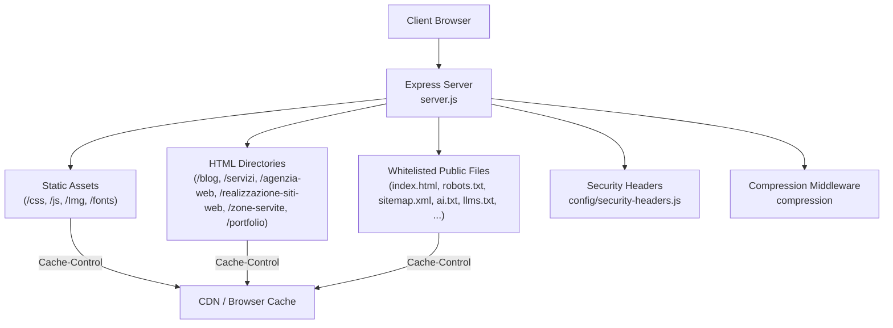
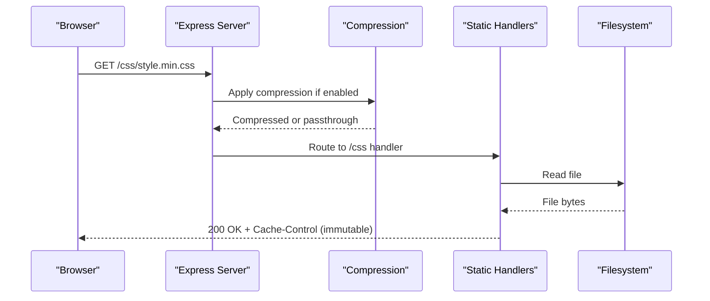
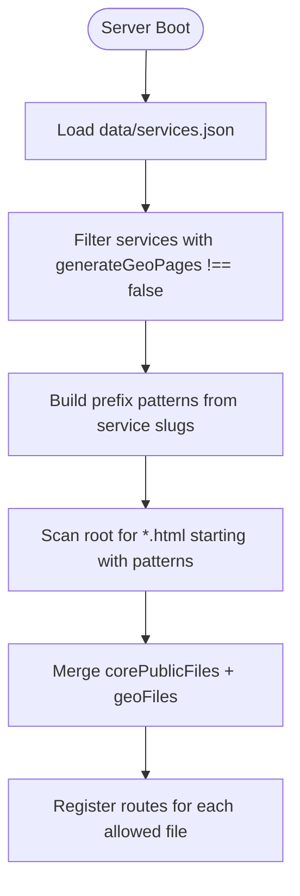
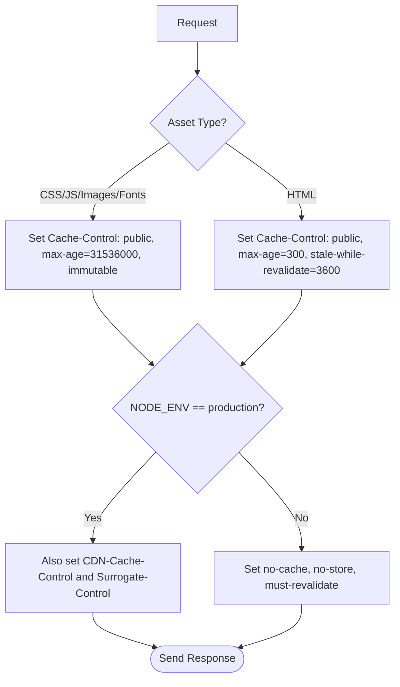
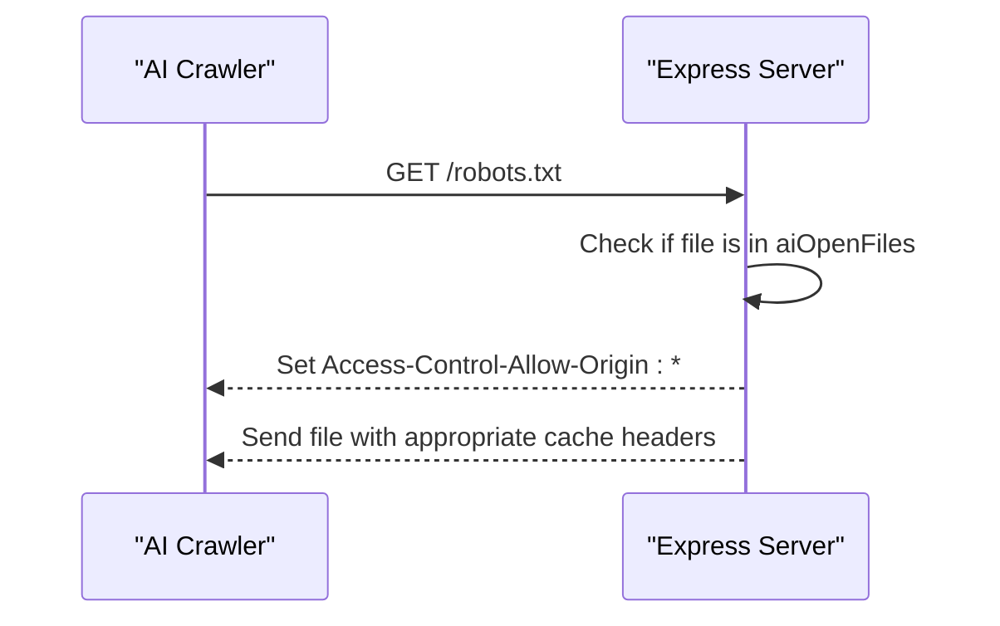
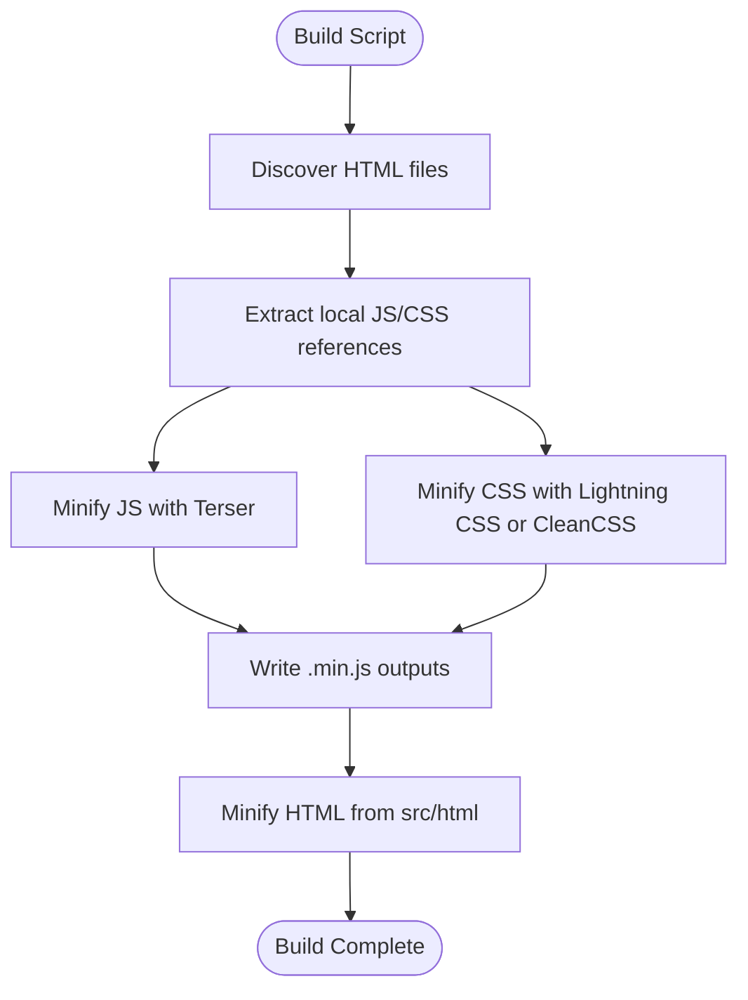
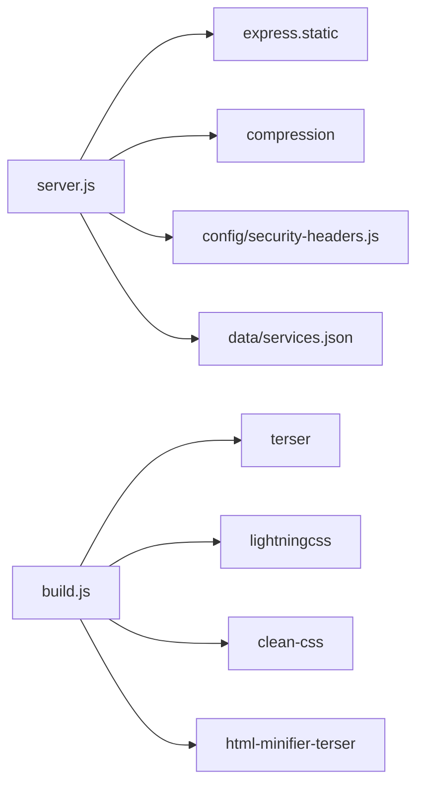

# Static File Serving & Caching

<cite>
**Referenced Files in This Document**
- [server.js](file://server.js)
- [build.js](file://build.js)
- [ai-config.js](file://ai-config.js)
- [data/services.json](file://data/services.json)
- [config/security-headers.js](file://config/security-headers.js)
- [robots.txt](file://robots.txt)
- [sitemap.xml](file://sitemap.xml)
- [ai.txt](file://ai.txt)
- [llms.txt](file://llms.txt)
</cite>

## Table of Contents
1. [Introduction](#introduction)
2. [Project Structure](#project-structure)
3. [Core Components](#core-components)
4. [Architecture Overview](#architecture-overview)
5. [Detailed Component Analysis](#detailed-component-analysis)
6. [Dependency Analysis](#dependency-analysis)
7. [Performance Considerations](#performance-considerations)
8. [Troubleshooting Guide](#troubleshooting-guide)
9. [Conclusion](#conclusion)

## Introduction
This document explains the static file serving architecture for the project. It covers a dual-layer approach:
- Core public files that are manually maintained and explicitly whitelisted for safe serving.
- Auto-discovered pSEO pages generated from services and cities, dynamically included at runtime.

It also documents caching strategies for immutable assets versus HTML, development versus production behavior, AI-accessible files with open CORS, file discovery via services.json, compression middleware, and security considerations to ensure only safe public files are served.

## Project Structure
The static serving layer is implemented in the Express server and supported by build-time asset processing. The key directories and files involved are:
- Root-level public files (e.g., index.html, robots.txt, sitemap.xml, ai.txt, llms.txt).
- Asset directories served statically (/css, /js, /Img, /fonts).
- HTML content directories served with short cache policies (/blog, /servizi, /agenzia-web, /realizzazione-siti-web, /zone-servite, /portfolio).
- Configuration for security headers and CORS origins.
- Build script that minifies JS/CSS and processes HTML.

**Diagram sources**
- [server.js:458-526](file://server.js#L458-L526)
- [config/security-headers.js:40-100](file://config/security-headers.js#L40-L100)

**Section sources**
- [server.js:441-526](file://server.js#L441-L526)
- [config/security-headers.js:40-100](file://config/security-headers.js#L40-L100)

## Core Components
- Dual-layer static serving:
  - Core public files: a curated list of safe files explicitly allowed to be served.
  - pSEO pages: auto-discovered HTML files matching service prefixes, derived from data/services.json and filesystem scanning.
- Caching strategy:
  - Immutable assets with long-term caching (CSS, JS, images, fonts).
  - HTML files with short cache plus stale-while-revalidate.
  - Development vs production differences enforced via environment checks.
- AI-accessible files:
  - Open CORS for specific AI discovery files (robots.txt, sitemap.xml, ai.txt, llms.txt, llms-full.txt, webnovis-ai-data.json).
- Compression:
  - Optional gzip/brotli compression middleware applied before static handlers.
- Security:
  - Strict whitelist of public files.
  - Canonical redirects and trailing slash normalization.
  - Security headers applied globally.

**Section sources**
- [server.js:441-526](file://server.js#L441-L526)
- [server.js:234-249](file://server.js#L234-L249)
- [config/security-headers.js:40-100](file://config/security-headers.js#L40-L100)

## Architecture Overview
The request flow for static resources goes through a series of middleware and handlers:
1. Compression middleware optionally compresses responses.
2. Security headers are set on every response.
3. Redirects handle canonical host, legacy paths, trailing slashes, and parameter stripping.
4. Static assets under /css, /js, /Img, /fonts are served with immutable caching in production.
5. HTML directories are served with short cache and stale-while-revalidate.
6. Whitelisted root-level public files are served with tailored cache headers; AI discovery files get open CORS.

**Diagram sources**
- [server.js:234-249](file://server.js#L234-L249)
- [server.js:458-481](file://server.js#L458-L481)

## Detailed Component Analysis

### Dual-Layer Static Serving: Core Public Files and pSEO Pages
- Core public files are explicitly enumerated and served only if they match the whitelist. This prevents accidental exposure of server code or configuration.
- pSEO pages are discovered by:
  - Reading data/services.json to collect service slugs where geo page generation is enabled.
  - Scanning the root directory for HTML files whose names start with known service prefixes (e.g., agenzia-web-, agenzie-web-, realizzazione-siti-web-).
  - Combining core public files with discovered pSEO files into a single allowlist used by the route handler.

**Diagram sources**
- [server.js:441-456](file://server.js#L441-L456)
- [data/services.json:1-307](file://data/services.json#L1-L307)

**Section sources**
- [server.js:441-456](file://server.js#L441-L456)
- [data/services.json:1-307](file://data/services.json#L1-L307)

### Caching Strategies: Immutable Assets vs HTML
- Immutable assets:
  - CSS, JS, images, and fonts under /css, /js, /Img, /fonts are served with long-term caching and immutable flag in production.
  - In development, no-cache headers are applied to avoid stale assets during edits.
- HTML files:
  - Root-level HTML files and HTML directories use short max-age with stale-while-revalidate to balance freshness and performance.
  - Production sets additional CDN-specific headers to propagate cache policy to edge caches.

**Diagram sources**
- [server.js:458-481](file://server.js#L458-L481)
- [server.js:483-526](file://server.js#L483-L526)

**Section sources**
- [server.js:458-526](file://server.js#L458-L526)

### Development vs Production Differences
- Development:
  - Static assets and HTML are served with strict no-cache headers to ensure changes are immediately visible.
  - Compression middleware may not be installed; warnings are logged but do not block startup.
- Production:
  - Immutable caching for assets ensures maximum browser and CDN reuse.
  - HTML uses short cache with stale-while-revalidate to keep content fresh while leveraging cache.
  - Additional CDN headers are set to coordinate with edge caches.

**Section sources**
- [server.js:466-481](file://server.js#L466-L481)
- [server.js:483-526](file://server.js#L483-L526)

### AI-Accessible Files Configuration
- A dedicated set of AI discovery files is configured to allow open CORS so any AI crawler or tool can fetch them regardless of Origin.
- These include robots.txt, sitemap.xml, ai.txt, llms.txt, llms-full.txt, and webnovis-ai-data.json.
- When these files are requested, the server sets Access-Control-Allow-Origin to wildcard.

**Diagram sources**
- [server.js:501-521](file://server.js#L501-L521)

**Section sources**
- [server.js:501-521](file://server.js#L501-L521)
- [robots.txt:1-117](file://robots.txt#L1-L117)
- [sitemap.xml:1-800](file://sitemap.xml#L1-L800)
- [ai.txt:1-56](file://ai.txt#L1-L56)
- [llms.txt:1-120](file://llms.txt#L1-L120)

### Compression Middleware Setup
- Compression is conditionally enabled if the compression package is installed.
- It applies to text-based responses with a threshold and filter to skip when requested.
- If missing in production, a warning is logged; in non-production, it is optional.

**Section sources**
- [server.js:234-249](file://server.js#L234-L249)

### Security Considerations for Serving Only Safe Public Files
- Whitelist enforcement:
  - Only files in the explicit allowlist are served from the root path, preventing access to server code, configs, or sensitive files.
- Canonicalization and redirects:
  - Non-www to www redirect in production.
  - Legacy path redirects and trailing slash normalization reduce duplicate content risks.
- Security headers:
  - Global application of security headers including CSP, HSTS, X-Frame-Options, and others.
- Bot logging and rate limiting:
  - Bot user-agent logging helps monitor crawl activity.
  - Rate limiting protects API endpoints.

**Section sources**
- [server.js:291-393](file://server.js#L291-L393)
- [server.js:441-456](file://server.js#L441-L456)
- [config/security-headers.js:40-100](file://config/security-headers.js#L40-L100)

### Build-Time Asset Processing
- The build script discovers and minifies JavaScript and CSS assets referenced by HTML files.
- It supports modern CSS via Lightning CSS with a fallback to CleanCSS.
- HTML minification is applied to source HTML under src/html, producing optimized output in the publish root.

**Diagram sources**
- [build.js:242-279](file://build.js#L242-L279)
- [build.js:290-371](file://build.js#L290-L371)
- [build.js:428-493](file://build.js#L428-L493)

**Section sources**
- [build.js:242-279](file://build.js#L242-L279)
- [build.js:290-371](file://build.js#L290-L371)
- [build.js:428-493](file://build.js#L428-L493)

## Dependency Analysis
- server.js depends on:
  - express.static for serving static assets and directories.
  - compression middleware for optional response compression.
  - config/security-headers.js for global security headers and CORS origin helpers.
  - data/services.json for dynamic inclusion of pSEO pages.
- build.js depends on:
  - terser for JS minification.
  - lightningcss and clean-css for CSS minification.
  - html-minifier-terser for HTML minification (optional).

**Diagram sources**
- [server.js:234-249](file://server.js#L234-L249)
- [server.js:458-526](file://server.js#L458-L526)
- [build.js:15-27](file://build.js#L15-L27)
- [build.js:290-371](file://build.js#L290-L371)
- [build.js:428-493](file://build.js#L428-L493)

**Section sources**
- [server.js:234-249](file://server.js#L234-L249)
- [server.js:458-526](file://server.js#L458-L526)
- [build.js:15-27](file://build.js#L15-L27)
- [build.js:290-371](file://build.js#L290-L371)
- [build.js:428-493](file://build.js#L428-L493)

## Performance Considerations
- Use immutable caching for static assets to maximize browser and CDN reuse.
- Apply short cache with stale-while-revalidate for HTML to keep content fresh without sacrificing performance.
- Enable compression middleware to reduce transfer sizes for text-based responses.
- Ensure cache-busting query parameters are used in development to avoid stale assets.
- Monitor CDN headers to ensure consistent caching behavior across edge nodes.

[No sources needed since this section provides general guidance]

## Troubleshooting Guide
- Missing compression:
  - If compression middleware is not installed, a warning is logged. Install the dependency to enable compression.
- Unexpected 404 for public files:
  - Verify the file is included in the whitelist or matches pSEO discovery patterns.
- Stale assets in development:
  - Confirm no-cache headers are applied and cache-busting parameters are used.
- AI crawlers blocked by CORS:
  - Ensure requests target AI-accessible files which have open CORS enabled.
- Security headers misconfiguration:
  - Review shared security headers configuration and ensure they are applied globally.

**Section sources**
- [server.js:234-249](file://server.js#L234-L249)
- [server.js:441-456](file://server.js#L441-L456)
- [server.js:501-521](file://server.js#L501-L521)
- [config/security-headers.js:40-100](file://config/security-headers.js#L40-L100)

## Conclusion
The static file serving architecture combines a secure, explicit whitelist for core public files with dynamic discovery of pSEO pages based on services.json. Caching is optimized for both immutable assets and frequently updated HTML, with clear differences between development and production. AI discovery files are intentionally accessible via open CORS to support AI crawlers. Compression and security headers further enhance performance and safety. This design balances scalability, maintainability, and security while enabling robust SEO and AI visibility.

[No sources needed since this section summarizes without analyzing specific files]