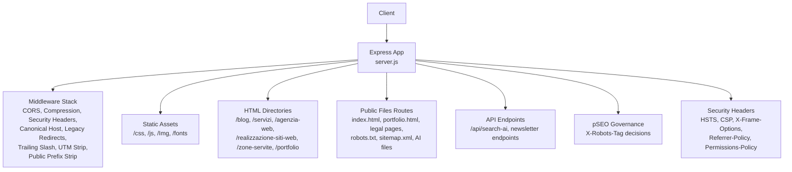
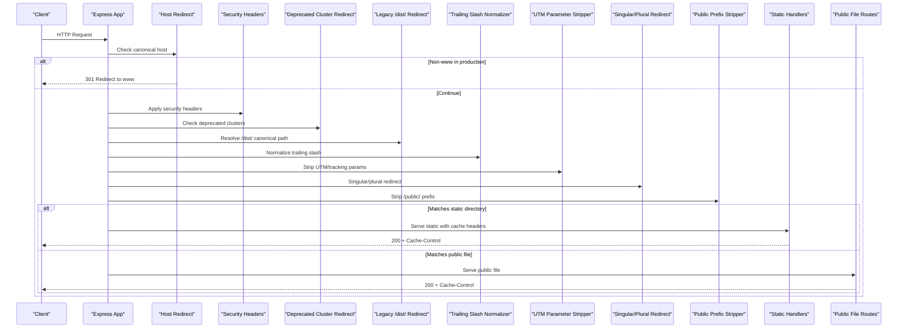
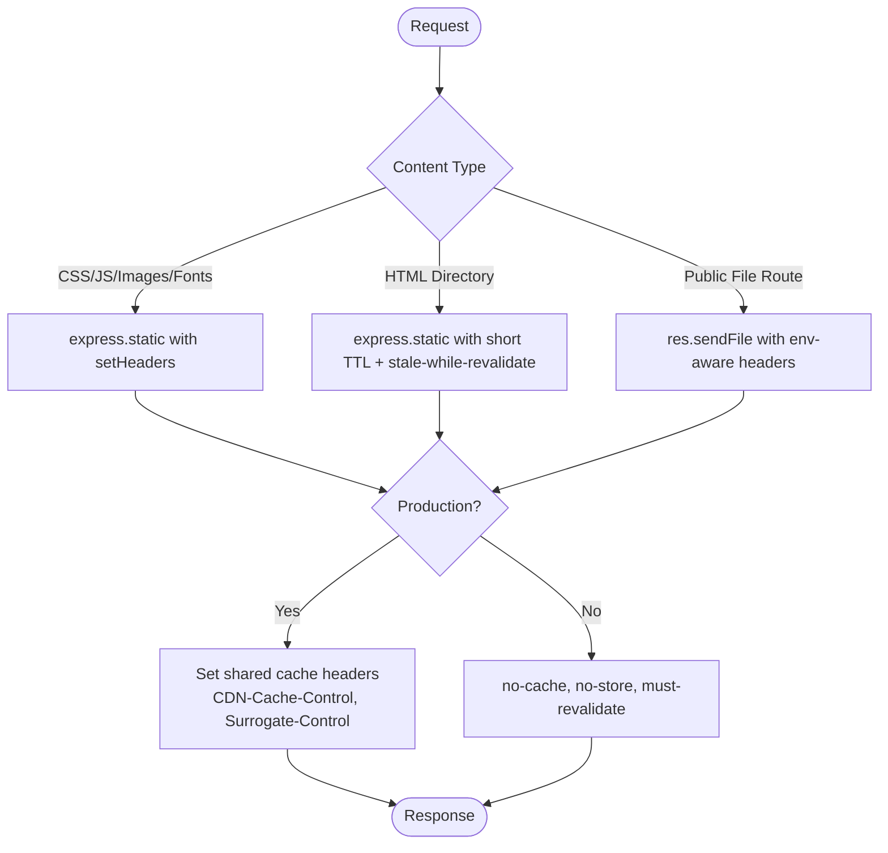
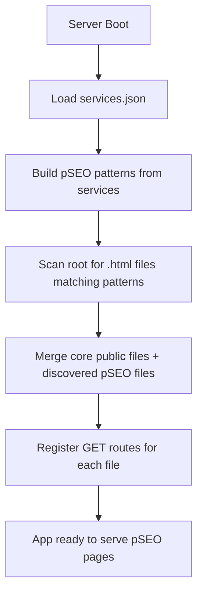
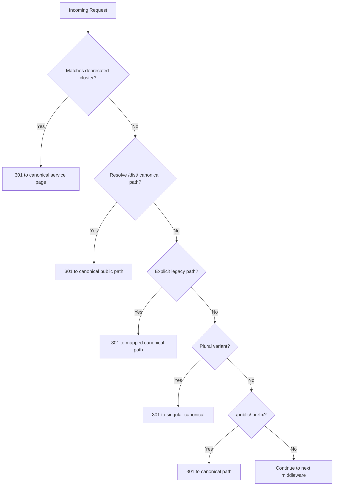
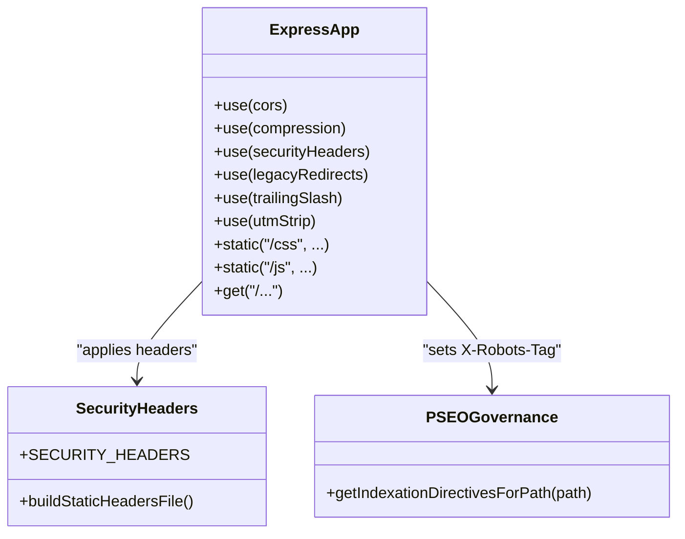
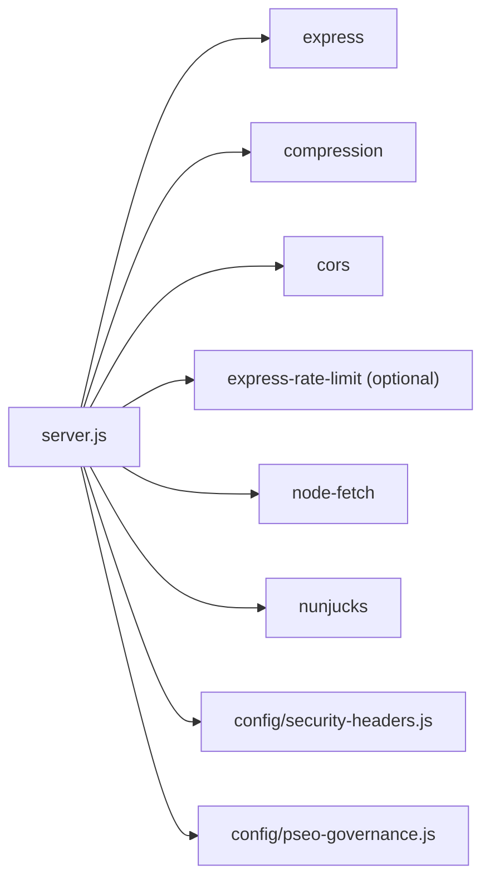

# Routing & URL Management

<cite>
**Referenced Files in This Document**
- [server.js](file://server.js)
- [security-headers.js](file://config/security-headers.js)
- [pseo-governance.js](file://config/pseo-governance.js)
- [package.json](file://package.json)
</cite>

## Table of Contents
1. [Introduction](#introduction)
2. [Project Structure](#project-structure)
3. [Core Components](#core-components)
4. [Architecture Overview](#architecture-overview)
5. [Detailed Component Analysis](#detailed-component-analysis)
6. [Dependency Analysis](#dependency-analysis)
7. [Performance Considerations](#performance-considerations)
8. [Troubleshooting Guide](#troubleshooting-guide)
9. [Conclusion](#conclusion)

## Introduction
This document explains the Express.js routing and URL management system used by the application. It covers static file serving with intelligent caching, dynamic route generation for pSEO pages, redirect handling for legacy URLs, trailing slash normalization, UTM parameter stripping, canonical enforcement, singular/plural page redirections, and public file discovery. It also details middleware composition patterns, cache header strategies for different content types, and how the system adapts to development and production environments.

## Project Structure
The routing and URL management logic is centralized in the server entry point and supported by configuration modules:
- Server entry point defines the Express app, middleware stack, redirects, static asset serving, and public file routes.
- Security headers module centralizes security policies and generates static host headers for edge platforms.
- pSEO governance module controls indexation directives for generated geo/service pages.
- Package manifest declares runtime dependencies (Express, compression, CORS, rate limiting).

**Diagram sources**
- [server.js:224-530](file://server.js#L224-L530)
- [security-headers.js:40-48](file://config/security-headers.js#L40-L48)
- [pseo-governance.js:279-281](file://config/pseo-governance.js#L279-L281)

**Section sources**
- [server.js:224-530](file://server.js#L224-L530)
- [security-headers.js:40-48](file://config/security-headers.js#L40-L48)
- [pseo-governance.js:279-281](file://config/pseo-governance.js#L279-L281)
- [package.json:69-77](file://package.json#L69-L77)

## Core Components
- Canonical host redirect: Enforces www in production.
- Security headers: Centralized policy applied to all responses.
- Deprecated cluster redirects: Parametric 301 from deprecated service clusters to canonical ones.
- Legacy build-artifact redirects: Collapses stale /dist/ URLs and explicit legacy paths to canonical public paths.
- Trailing slash normalization: Removes trailing slashes except for specific directories that serve index.html via static handlers.
- UTM/tracking parameter stripping: Prevents duplicate content by removing campaign parameters.
- Singular/plural location page canonicalization: Redirects plural variants to singular canonical pages.
- Public prefix strip: Redirects /public/ prefixed requests to canonical paths.
- Static assets and HTML directories: Serve with environment-aware cache headers.
- Public file discovery: Auto-discovers pSEO pages based on patterns and services configuration; serves only safe public files.
- pSEO indexation control: Sets X-Robots-Tag directives based on allowlists and tiers.

**Section sources**
- [server.js:291-439](file://server.js#L291-L439)
- [server.js:441-530](file://server.js#L441-L530)
- [pseo-governance.js:279-281](file://config/pseo-governance.js#L279-L281)

## Architecture Overview
The request lifecycle flows through a carefully ordered middleware stack before reaching static or route handlers. The order ensures canonicalization and redirects happen early, preventing unnecessary processing and avoiding duplicate content.

**Diagram sources**
- [server.js:291-439](file://server.js#L291-L439)
- [server.js:466-530](file://server.js#L466-L530)

## Detailed Component Analysis

### Static File Serving Strategy with Intelligent Caching
- Asset directories (/css, /js, /Img, /fonts) are served via express.static with custom setHeaders:
  - Production: long-lived immutable caching for stable filenames.
  - Development: no-cache to support frequent changes during development.
- HTML directories (/blog, /servizi, /agenzia-web, /realizzazione-siti-web, /zone-servite, /portfolio) use short TTL with stale-while-revalidate to balance freshness and performance.
- Root and individual public files apply short TTLs for HTML and slightly longer for other assets.
- CDN-specific headers are added in production to propagate cache policies to edge caches.

**Diagram sources**
- [server.js:458-530](file://server.js#L458-L530)

**Section sources**
- [server.js:458-530](file://server.js#L458-L530)

### Dynamic Route Generation for pSEO Pages
- At startup, the server reads services configuration and builds a list of pSEO patterns.
- It scans the project root for HTML files matching these patterns, creating a combined list of core public files and discovered pSEO pages.
- Each discovered file is registered as a GET route at its filename path, enabling dynamic serving without hardcoding every pSEO page.
- This approach scales automatically as new geo/service pages are generated.

**Diagram sources**
- [server.js:441-456](file://server.js#L441-L456)
- [server.js:504-522](file://server.js#L504-L522)

**Section sources**
- [server.js:441-456](file://server.js#L441-L456)
- [server.js:504-522](file://server.js#L504-L522)

### Redirect Handling for Legacy URLs
- Deprecated cluster redirects: Parametric middleware matches old service cluster URLs and redirects to canonical equivalents.
- Legacy build-artifact redirects: A map of explicit legacy paths plus a resolver for /dist/ URLs collapses them to canonical public paths.
- Singular/plural canonicalization: Specific plural URLs redirect to singular canonical pages.
- Public prefix stripping: Requests under /public/ are redirected to their canonical paths.

**Diagram sources**
- [server.js:321-393](file://server.js#L321-L393)
- [server.js:334-356](file://server.js#L334-L356)

**Section sources**
- [server.js:321-393](file://server.js#L321-L393)
- [server.js:334-356](file://server.js#L334-L356)

### Trailing Slash Normalization
- Removes trailing slashes for non-root paths unless the path starts with specific directories that serve index.html via static handlers.
- Preserves query strings during redirection.

**Section sources**
- [server.js:358-367](file://server.js#L358-L367)

### UTM Parameter Stripping
- Detects and removes tracking parameters (e.g., utm_source, fbclid, gclid) to prevent duplicate content issues.
- Performs a 301 redirect to the cleaned URL when modifications occur.

**Section sources**
- [server.js:369-384](file://server.js#L369-L384)

### Canonical URL Enforcement
- Canonical host redirect enforces www in production, ensuring consistent hostnames for SEO and analytics.
- X-Robots-Tag directives are set per-path using pSEO governance to control indexing behavior for generated geo pages.

**Section sources**
- [server.js:291-298](file://server.js#L291-L298)
- [server.js:308-319](file://server.js#L308-L319)
- [pseo-governance.js:279-281](file://config/pseo-governance.js#L279-L281)

### Public File Discovery Mechanism
- Core public files are explicitly whitelisted to avoid exposing server code or sensitive files.
- pSEO pages are auto-discovered by scanning for HTML files matching service patterns derived from services configuration.
- Only the combined list of safe files is exposed via routes, ensuring controlled access.

**Section sources**
- [server.js:441-456](file://server.js#L441-L456)

### Middleware Composition Examples
- Compression: Applied globally with a filter to respect client preferences.
- CORS: Configured with allowed origins from environment variables and local development allowances.
- Security headers: Applied to all responses via a centralized policy.
- Rate limiting: Applied selectively to API endpoints to protect against abuse.

**Diagram sources**
- [server.js:234-287](file://server.js#L234-L287)
- [security-headers.js:40-48](file://config/security-headers.js#L40-L48)
- [pseo-governance.js:279-281](file://config/pseo-governance.js#L279-L281)

**Section sources**
- [server.js:234-287](file://server.js#L234-L287)
- [security-headers.js:40-48](file://config/security-headers.js#L40-L48)
- [pseo-governance.js:279-281](file://config/pseo-governance.js#L279-L281)

### Environment-Aware Caching Policies
- Development: No caching for assets and HTML to facilitate rapid iteration.
- Production: Long-lived immutable caching for stable assets; short TTL with stale-while-revalidate for HTML; CDN-specific headers propagated to edge caches.
- The same strategy applies across static directories and public file routes.

**Section sources**
- [server.js:458-530](file://server.js#L458-L530)

## Dependency Analysis
- Runtime dependencies include Express for routing, compression for response compression, cors for cross-origin configuration, dotenv for environment loading, node-fetch for external API calls, and nunjucks for templating.
- Rate limiting is conditionally loaded; in production, missing rate limiting causes a fatal error to enforce protection.
- Security headers are centralized and can be synchronized to static host files for edge platforms.

**Diagram sources**
- [package.json:69-77](file://package.json#L69-L77)
- [server.js:234-287](file://server.js#L234-L287)
- [server.js:95-107](file://server.js#L95-L107)

**Section sources**
- [package.json:69-77](file://package.json#L69-L77)
- [server.js:95-107](file://server.js#L95-L107)

## Performance Considerations
- Compression reduces transfer sizes for text-based responses.
- Static assets use immutable caching in production to minimize revalidation.
- HTML uses short TTL with stale-while-revalidate to improve perceived performance while keeping content fresh.
- Bot logging helps analyze crawl behavior without impacting performance significantly.
- Rate limiting protects APIs and reduces load spikes.

[No sources needed since this section provides general guidance]

## Troubleshooting Guide
- If requests are not cached as expected, verify environment mode and ensure production headers are applied.
- For duplicate content warnings, confirm UTM stripping and trailing slash normalization are active.
- If legacy URLs return 404, check the legacy redirect map and /dist/ resolution logic.
- If pSEO pages are not served, ensure services.json is available and patterns match generated files.
- For API errors, inspect rate limits and quota tracking logs.

**Section sources**
- [server.js:334-393](file://server.js#L334-L393)
- [server.js:441-456](file://server.js#L441-L456)
- [server.js:458-530](file://server.js#L458-L530)

## Conclusion
The routing and URL management system implements a robust, scalable approach to serving static and generated content while enforcing canonical URLs, controlling indexation, and optimizing caching for both development and production. The middleware-first design ensures consistent behavior across all requests, and the dynamic discovery mechanism supports growth without manual route maintenance.

[No sources needed since this section summarizes without analyzing specific files]