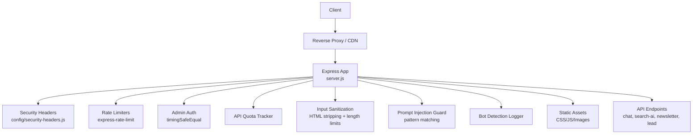
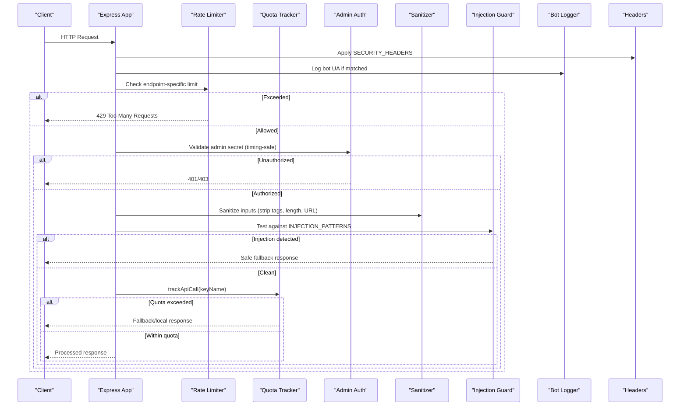
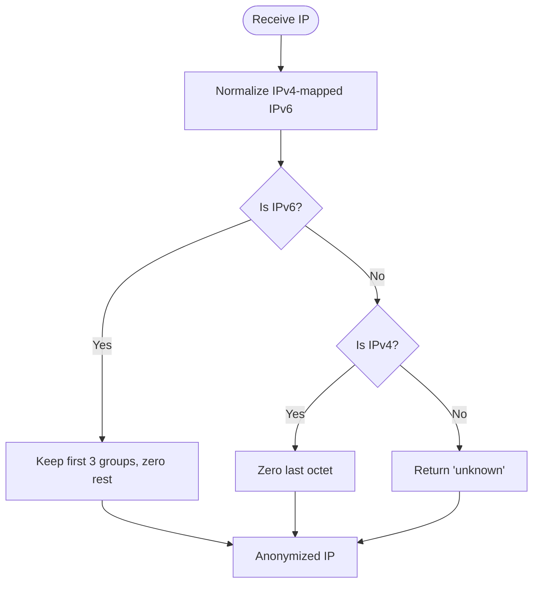
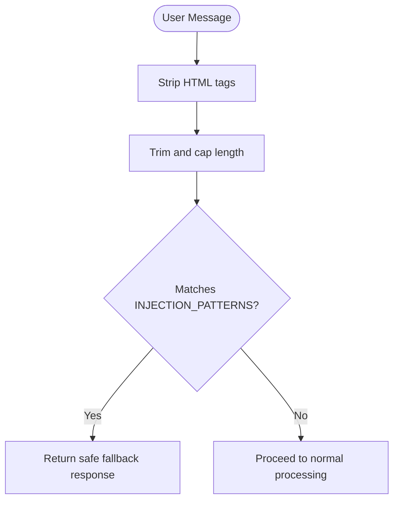
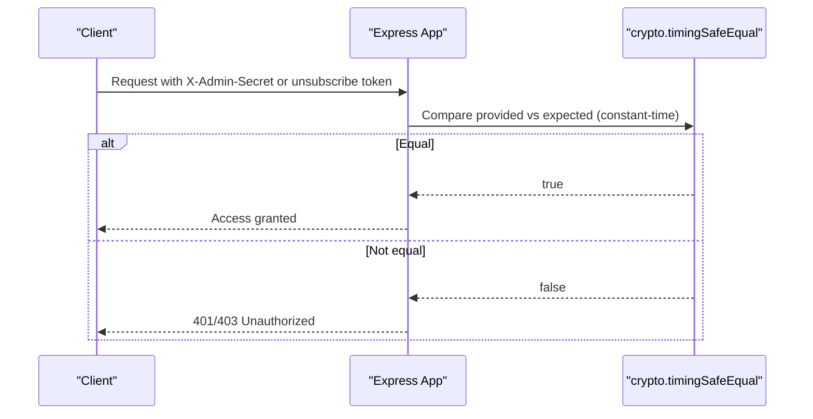
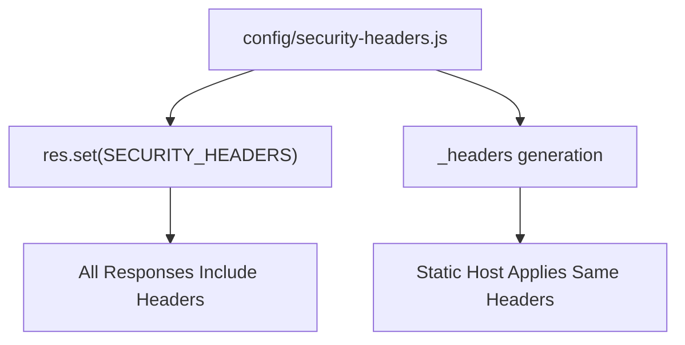
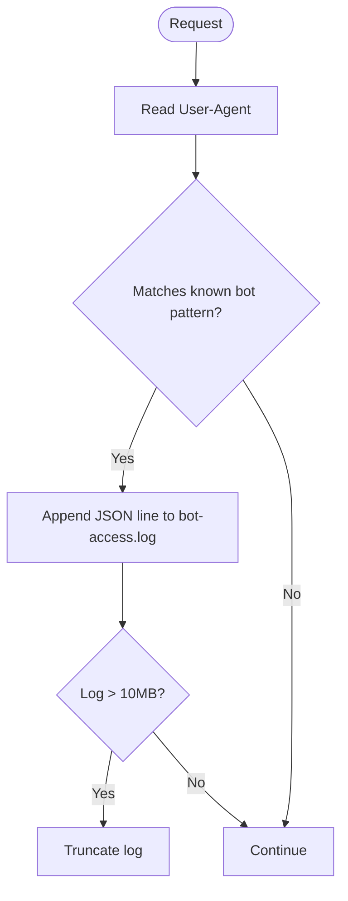
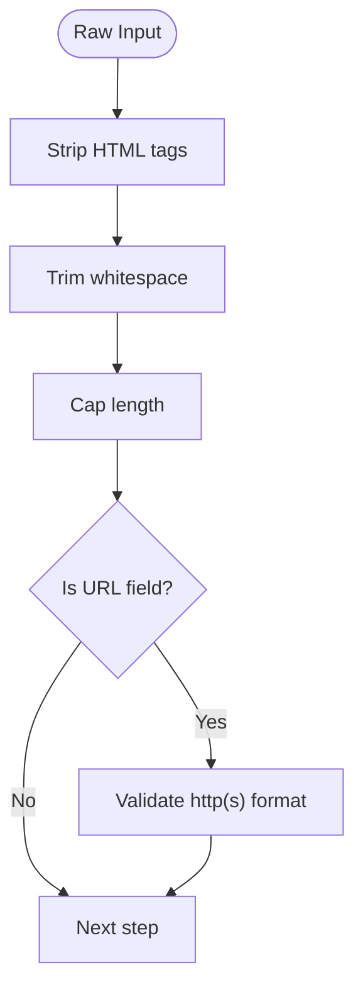
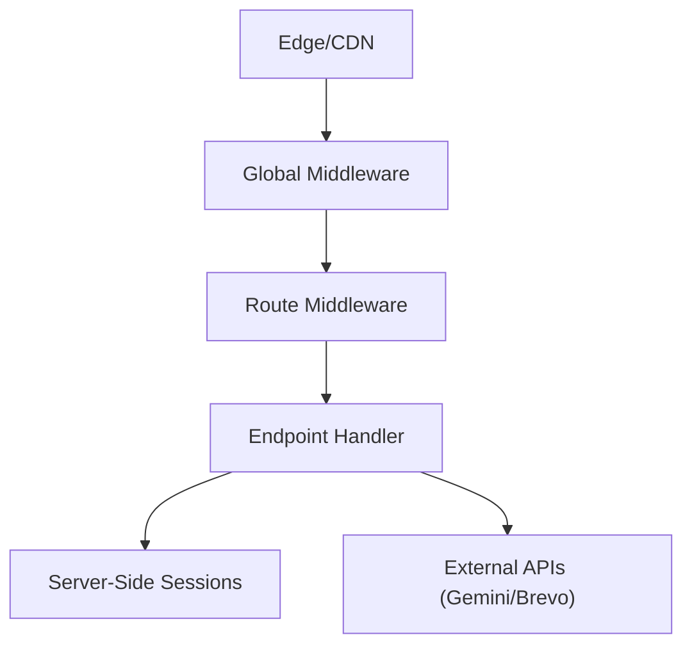
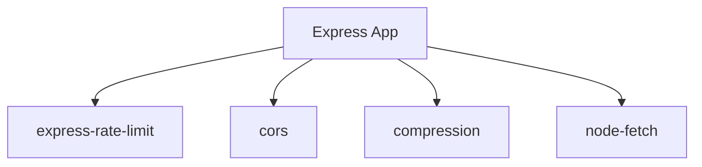

# Security Middleware & Protection

<cite>
**Referenced Files in This Document**
- [server.js](file://server.js)
- [security-headers.js](file://config/security-headers.js)
- [package.json](file://package.json)
- [security-and-legal-regressions.test.js](file://tests/security-and-legal-regressions.test.js)
- [security-header-regressions.test.js](file://tests/security-header-regressions.test.js)
- [sync-security-headers.js](file://scripts/sync-security-headers.js)
- [monitor-seo.js](file://scripts/monitor-seo.js)
- [index.js (AI worker)](file://workers/webnovis-ai/src/index.js)
</cite>

## Table of Contents
1. [Introduction](#introduction)
2. [Project Structure](#project-structure)
3. [Core Components](#core-components)
4. [Architecture Overview](#architecture-overview)
5. [Detailed Component Analysis](#detailed-component-analysis)
6. [Dependency Analysis](#dependency-analysis)
7. [Performance Considerations](#performance-considerations)
8. [Troubleshooting Guide](#troubleshooting-guide)
9. [Conclusion](#conclusion)

## Introduction
This document explains the comprehensive security implementation for the Express application, focusing on a defense-in-depth strategy that spans input validation, prompt injection protection, API quota monitoring and rate limiting, admin authentication with timing-safe comparisons, security headers, bot detection, and input sanitization. It also details how common attack vectors such as SQL injection, XSS, and brute force are mitigated through layered controls.

## Project Structure
The security features are primarily implemented in the main server file and centralized configuration:
- Server-side middleware and endpoints: server.js
- Centralized security headers and CORS policy: config/security-headers.js
- Dependency declarations including rate-limiting library: package.json
- Tests ensuring security header consistency and shared configuration usage: tests/*
- Scripts to synchronize static headers across environments: scripts/sync-security-headers.js
- Bot log analysis utility: scripts/monitor-seo.js
- Complementary IP anonymization and rate limiting in the AI worker: workers/webnovis-ai/src/index.js



**Diagram sources**
- [server.js](file://server.js)
- [security-headers.js](file://config/security-headers.js)
- [package.json](file://package.json)

**Section sources**
- [server.js](file://server.js)
- [security-headers.js](file://config/security-headers.js)
- [package.json](file://package.json)

## Core Components
- IP Anonymization: Truncates IPv4 last octet or IPv6 last 80 bits to remove PII while preserving geographic signals.
- Prompt Injection Protection: Pattern-based guard blocks known injection attempts in chat and search flows.
- API Quota Monitoring: Per-key daily counters with warn/hard-cap thresholds to prevent runaway spend and abuse.
- Admin Authentication: Timing-safe comparison using crypto.timingSafeEqual for secrets like X-Admin-Secret and unsubscribe tokens.
- Security Headers: Centralized CSP, HSTS, X-Frame-Options, Permissions-Policy, Referrer-Policy applied via middleware.
- Bot Detection: User-Agent pattern matching logs bot activity to a rotating log file.
- Input Sanitization: HTML tag stripping, length limits, URL validation, and strict JSON payload size limits.
- Rate Limiting: Per-endpoint limits for chat, newsletter, search AI, and lead capture.

**Section sources**
- [server.js](file://server.js)
- [security-headers.js](file://config/security-headers.js)

## Architecture Overview
The application enforces security at multiple layers:
- Edge/CDN may enforce additional headers and caching policies.
- Express middleware applies global security headers and CORS rules.
- Route-level middleware enforces rate limits and admin authentication.
- Endpoint handlers sanitize inputs, check quotas, and apply prompt injection guards.
- Session management is server-side only to prevent history forgery.



**Diagram sources**
- [server.js](file://server.js)
- [security-headers.js](file://config/security-headers.js)

## Detailed Component Analysis

### IP Anonymization for GDPR Compliance
- Purpose: Remove PII from client IPs while retaining coarse-grained location data.
- Implementation: Normalizes IPv4-mapped IPv6, truncates last octet for IPv4, zeros last 80 bits for IPv6.
- Usage: Applied when logging leads and bot access; consistent logic mirrored in the AI worker.



**Diagram sources**
- [server.js](file://server.js)
- [index.js (AI worker)](file://workers/webnovis-ai/src/index.js)

**Section sources**
- [server.js](file://server.js)
- [index.js (AI worker)](file://workers/webnovis-ai/src/index.js)

### Prompt Injection Protection with Pattern Matching
- Purpose: Block attempts to override system instructions or extract prompts.
- Implementation: Comprehensive regex covering Italian and English patterns, leetspeak, indirect translation tricks, role-play escalation, jailbreak keywords, and universal markers.
- Behavior: Returns safe predefined responses for chat and search when patterns match.



**Diagram sources**
- [server.js](file://server.js)

**Section sources**
- [server.js](file://server.js)

### API Quota Monitoring and Rate Limiting
- Quota Tracking: Per-key daily counters with configurable warn/hard-cap thresholds; logs warnings near thresholds and blocks after hitting daily limit.
- Rate Limiting: Per-endpoint limits using express-rate-limit with windowMs and max requests; standard headers enabled.
- Endpoints Covered: Chat, newsletter, search AI, lead capture.

```mermaid
classDiagram
class QuotaTracker {
+daily : number
+warnPct : number
+trackApiCall(keyName) : {allowed : boolean, remaining : number}
}
class RateLimiter {
+windowMs : number
+max : number
+standardHeaders : boolean
+legacyHeaders : boolean
}
class Endpoints {
+chat
+newsletter
+search-ai
+lead
}
QuotaTracker <.. Endpoints : "per-key daily caps"
RateLimiter <.. Endpoints : "per-window request caps"
```

**Diagram sources**
- [server.js](file://server.js)
- [package.json](file://package.json)

**Section sources**
- [server.js](file://server.js)
- [package.json](file://package.json)

### Admin Authentication with Timing-Safe Comparisons
- Purpose: Protect sensitive endpoints and unsubscribe actions from timing attacks.
- Implementation: Uses crypto.timingSafeEqual to compare provided secrets and HMAC tokens against stored values.
- Usage: X-Admin-Secret header for admin endpoints; HMAC token for newsletter unsubscribe.



**Diagram sources**
- [server.js](file://server.js)

**Section sources**
- [server.js](file://server.js)

### Security Headers Implementation
- Centralized Policy: SECURITY_HEADERS includes HSTS, X-Content-Type-Options, X-Frame-Options, CSP, Referrer-Policy, Permissions-Policy.
- Application: Applied globally via middleware; CSP intentionally avoids nonce until inline script injection is fully supported.
- Static Sync: buildStaticHeadersFile generates _headers for static hosts; sync script ensures consistency.



**Diagram sources**
- [security-headers.js](file://config/security-headers.js)
- [server.js](file://server.js)
- [sync-security-headers.js](file://scripts/sync-security-headers.js)

**Section sources**
- [security-headers.js](file://config/security-headers.js)
- [server.js](file://server.js)
- [sync-security-headers.js](file://scripts/sync-security-headers.js)

### Bot Detection System
- Purpose: Identify and log major bots for analytics and GEO strategy.
- Implementation: Matches User-Agent against known patterns; appends structured JSON lines to a rotating log file.
- Rotation: Truncates log if exceeding size threshold.



**Diagram sources**
- [server.js](file://server.js)

**Section sources**
- [server.js](file://server.js)

### Input Sanitization Strategies
- Techniques: Strip HTML tags, normalize whitespace, enforce maximum lengths, validate URLs strictly, limit JSON payload size.
- Rationale: Prevents XSS, reduces prompt pollution, avoids DoS via large payloads, and ensures safe downstream processing.



**Diagram sources**
- [server.js](file://server.js)

**Section sources**
- [server.js](file://server.js)

### Defense-in-Depth Architecture
- Layers:
  - Edge/CDN: Optional header enforcement and caching policies.
  - Global Middleware: Security headers, CORS, compression, trust proxy.
  - Route Middleware: Rate limiting, admin auth.
  - Endpoint Handlers: Input sanitization, prompt injection guard, quota checks.
  - Session Management: Server-side-only conversation history to prevent tampering.
- Outcome: Multiple overlapping controls reduce risk even if one layer fails.



[No sources needed since this diagram shows conceptual workflow, not actual code structure]

## Dependency Analysis
Key dependencies enabling security features:
- express-rate-limit: Enforces per-endpoint rate limits.
- cors: Whitelisted origins based on environment variables.
- compression: Reduces transfer sizes for text assets.
- node-fetch: Used for external API calls with timeouts and error handling.



**Diagram sources**
- [package.json](file://package.json)
- [server.js](file://server.js)

**Section sources**
- [package.json](file://package.json)
- [server.js](file://server.js)

## Performance Considerations
- Compression: Enabled with tunable level and filter; improves bandwidth efficiency.
- Cache Policies: Short TTLs for HTML with stale-while-revalidate; stable asset paths avoid immutable caching prematurely.
- In-memory caches: Search AI cache with TTL and deduplication reduces redundant API calls.
- Session cleanup: Periodic eviction of expired sessions prevents memory growth.

[No sources needed since this section provides general guidance]

## Troubleshooting Guide
Common issues and resolutions:
- Missing rate limiter dependency: Ensure express-rate-limit is installed; startup will fail in production if absent.
- Unconfigured admin secret: Startup warns if placeholder value remains; configure NEWSLETTER_ADMIN_SECRET.
- CORS rejections: Verify allowed origins include client domains; use CORS_ORIGINS env variable.
- CSP nonce mismatch: Avoid enabling nonce unless all inline scripts inject matching attributes.
- Bot log rotation: Monitor disk usage; ensure write permissions for log files.
- Quota exhaustion: Review daily limits and adjust thresholds; monitor warning logs.

**Section sources**
- [server.js](file://server.js)
- [security-and-legal-regressions.test.js](file://tests/security-and-legal-regressions.test.js)
- [security-header-regressions.test.js](file://tests/security-header-regressions.test.js)

## Conclusion
The application employs a robust, multi-layered security architecture combining input sanitization, prompt injection protection, quota tracking, rate limiting, admin authentication with timing-safe comparisons, and centralized security headers. These measures collectively mitigate common attack vectors such as XSS, SQL injection, brute force, and prompt manipulation, while maintaining compliance and operational resilience. Continuous verification via tests and synchronized header generation ensures long-term security posture.