# Security Middleware & Protection

<cite>
**Referenced Files in This Document**
- [server.js](file://server.js)
- [config/security-headers.js](file://config/security-headers.js)
- [workers/webnovis-ai/src/index.js](file://workers/webnovis-ai/src/index.js)
- [tests/security-and-legal-regressions.test.js](file://tests/security-and-legal-regressions.test.js)
- [tests/security-header-regressions.test.js](file://tests/security-header-regressions.test.js)
</cite>

## Table of Contents
1. Introduction
2. Project Structure
3. Core Components
4. Architecture Overview
5. Detailed Component Analysis
6. Dependency Analysis
7. Performance Considerations
8. Troubleshooting Guide
9. Conclusion
10. Appendices

## Introduction
This document explains the comprehensive security middleware and protection mechanisms implemented for the application. It covers prompt injection protection (Italian and English), input validation and sanitization, rate limiting strategies, CORS configuration, security headers (CSP, HSTS, and others), IP anonymization for GDPR compliance, server-side session management with memory storage, and API quota monitoring. It also provides examples of security patterns, attack prevention techniques, and configuration options for different deployment environments.

## Project Structure
The security implementation is primarily centered around:
- A shared security configuration module that defines headers, CSP directives, and CORS helpers.
- An Express-based server that wires middleware for CORS, compression, JSON parsing limits, canonical redirects, SEO-related headers, static assets, and API endpoints with rate limiting and quotas.
- A Cloudflare Worker variant that mirrors key protections (CORS, IP anonymization, rate limiting, prompt injection guard).
- Regression tests ensuring the server uses the shared security config and that generated static headers stay synchronized.

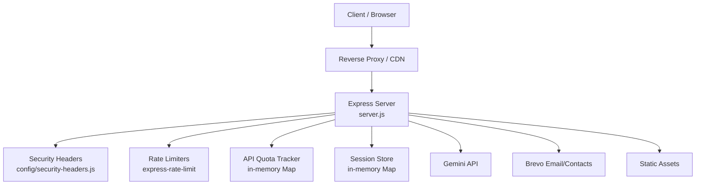

**Diagram sources**
- [server.js:250-319](file://server.js#L250-L319)
- [config/security-headers.js:1-48](file://config/security-headers.js#L1-L48)

**Section sources**
- [server.js:250-319](file://server.js#L250-L319)
- [config/security-headers.js:1-48](file://config/security-headers.js#L1-L48)

## Core Components
- Shared security headers and CSP configuration with nonce support helper and static header generator.
- CORS policy with environment-driven origin allowlist.
- Input validation and sanitization across all APIs.
- Prompt injection detection with multilingual pattern matching.
- Per-endpoint rate limiting to prevent abuse.
- In-memory session store with lifecycle controls.
- Daily API quota tracking per key with warnings and hard caps.
- IP anonymization for GDPR-compliant logging.

**Section sources**
- [config/security-headers.js:1-112](file://config/security-headers.js#L1-L112)
- [server.js:95-127](file://server.js#L95-L127)
- [server.js:129-178](file://server.js#L129-L178)
- [server.js:180-220](file://server.js#L180-L220)
- [server.js:250-319](file://server.js#L250-L319)
- [server.js:584-619](file://server.js#L584-L619)
- [server.js:625-641](file://server.js#L625-L641)
- [server.js:825-888](file://server.js#L825-L888)
- [server.js:890-1022](file://server.js#L890-L1022)
- [server.js:1024-1093](file://server.js#L1024-L1093)
- [server.js:1123-1279](file://server.js#L1123-L1279)

## Architecture Overview
The request flow applies a layered defense:
- CORS allows only configured origins (plus local dev).
- Compression reduces payload size where supported.
- JSON body size is limited to mitigate DoS via large payloads.
- Canonical host redirect ensures www usage in production.
- Security headers are applied globally.
- X-Robots-Tag prevents indexing of API/admin paths.
- Legacy path handling and trailing slash normalization reduce duplicate content risks.
- Bot access logging supports crawl intelligence.
- Public files are served from an explicit allowlist; sensitive files are never exposed.
- API endpoints enforce rate limits, input validation, prompt injection checks, quotas, and server-side sessions.

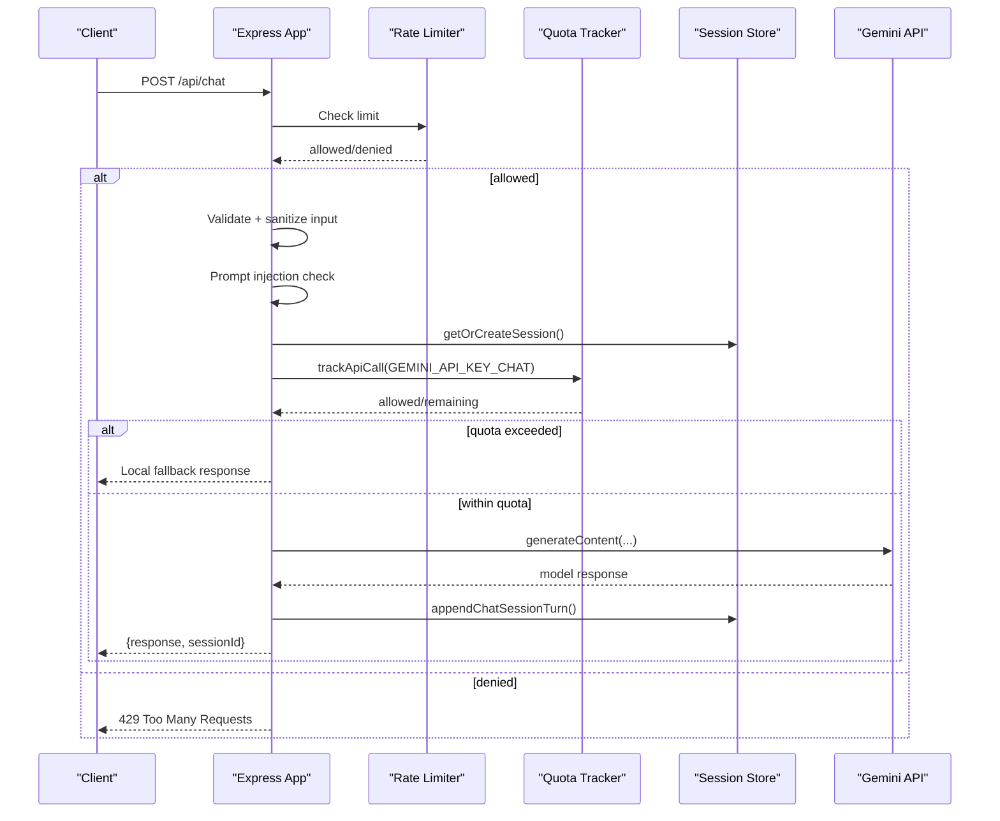

**Diagram sources**
- [server.js:252-262](file://server.js#L252-L262)
- [server.js:625-641](file://server.js#L625-L641)
- [server.js:1123-1279](file://server.js#L1123-L1279)
- [server.js:180-220](file://server.js#L180-L220)
- [server.js:584-619](file://server.js#L584-L619)

## Detailed Component Analysis

### Security Headers and CSP
- Global headers include HSTS, XSS protection toggle, MIME sniffing prevention, frame clickjacking protection, referrer policy, permissions policy, and a strict CSP.
- CSP directives restrict default sources, scripts, styles, images, fonts, connections, frames, base URIs, form actions, and enforce upgrade-insecure-requests.
- A nonce-aware CSP builder exists for future use when inline script attributes can be injected consistently.
- A static header file generator produces platform-compatible rules for edge caching and robots tags on API paths.

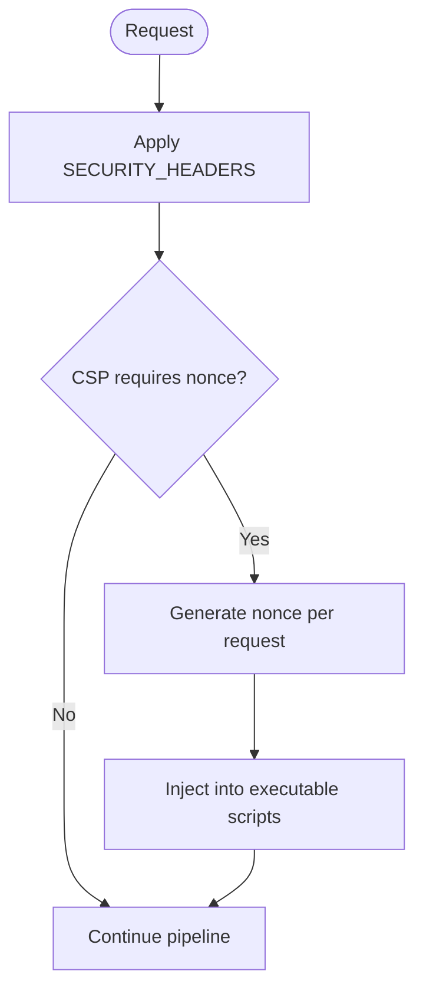

**Diagram sources**
- [config/security-headers.js:7-48](file://config/security-headers.js#L7-L48)
- [config/security-headers.js:64-101](file://config/security-headers.js#L64-L101)
- [server.js:300-319](file://server.js#L300-L319)

**Section sources**
- [config/security-headers.js:1-112](file://config/security-headers.js#L1-L112)
- [server.js:300-319](file://server.js#L300-L319)

### CORS Configuration
- Allowed origins are derived from a default set plus an environment variable list.
- The CORS middleware allows GET, POST, OPTIONS and specific headers.
- Non-browser requests without Origin are permitted but protected by rate limiting and admin-only endpoints.

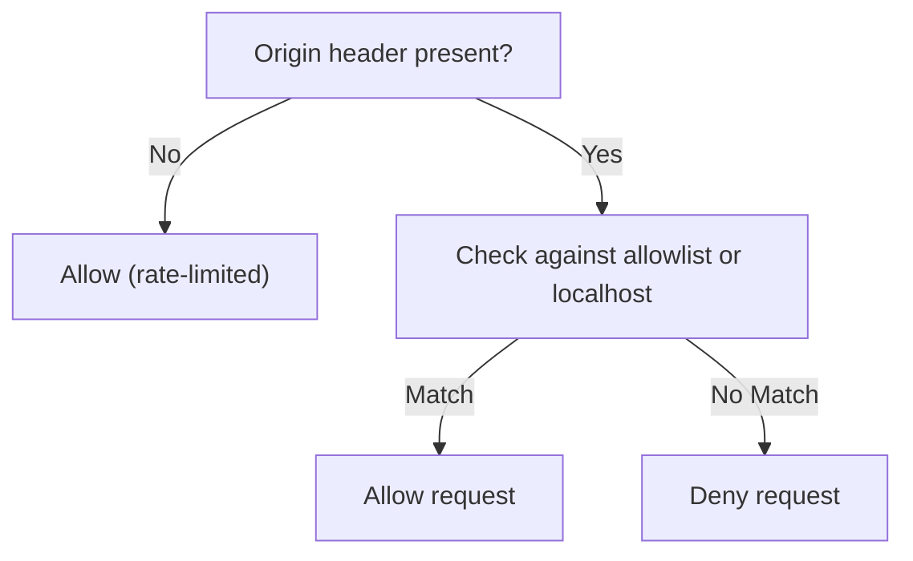

**Diagram sources**
- [config/security-headers.js:50-62](file://config/security-headers.js#L50-L62)
- [server.js:250-282](file://server.js#L250-L282)

**Section sources**
- [config/security-headers.js:50-62](file://config/security-headers.js#L50-L62)
- [server.js:250-282](file://server.js#L250-L282)

### Prompt Injection Protection
- A comprehensive regex-based guard detects Italian and English attack vectors, including leetspeak, spacing tricks, indirect extraction, role-play escalation, jailbreak keywords, and system prompt leakage attempts.
- When detected, the chat endpoint returns a safe canned response; the search endpoint returns a safe structured fallback.
- The same pattern set is mirrored in the worker implementation for consistent protection at the edge.

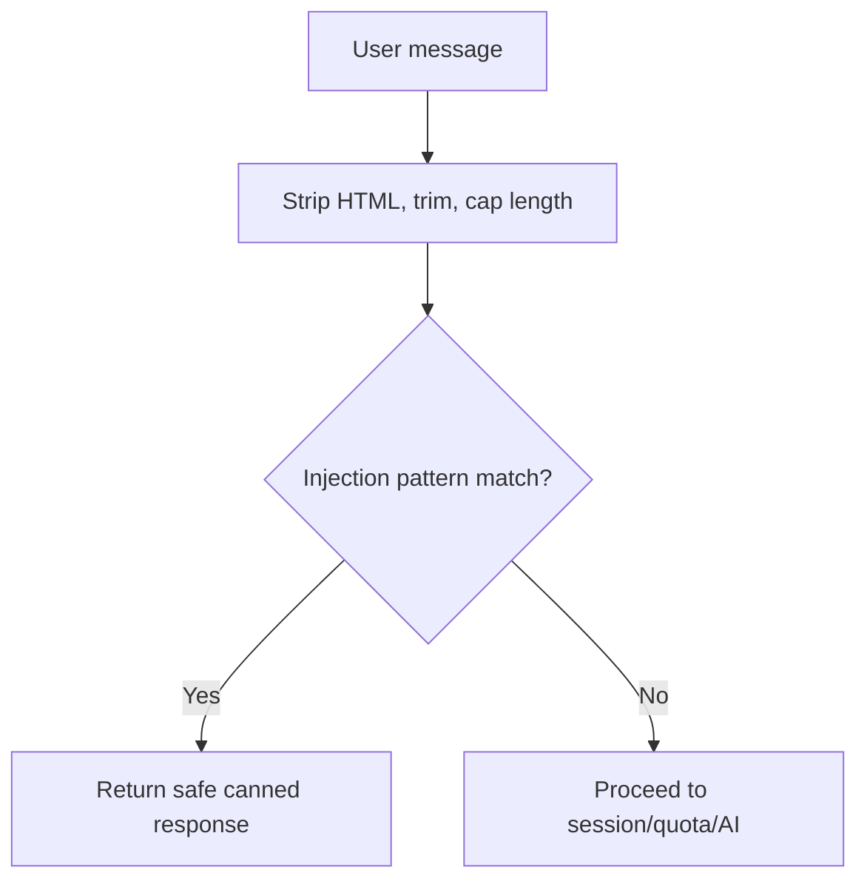

**Diagram sources**
- [server.js:129-178](file://server.js#L129-L178)
- [server.js:1134-1143](file://server.js#L1134-L1143)
- [server.js:743-762](file://server.js#L743-L762)
- [workers/webnovis-ai/src/index.js:266-288](file://workers/webnovis-ai/src/index.js#L266-L288)

**Section sources**
- [server.js:129-178](file://server.js#L129-L178)
- [server.js:1134-1143](file://server.js#L1134-L1143)
- [server.js:743-762](file://server.js#L743-L762)
- [workers/webnovis-ai/src/index.js:266-288](file://workers/webnovis-ai/src/index.js#L266-L288)

### Input Validation and Sanitization
- JSON bodies are limited to 16KB to mitigate DoS via oversized payloads.
- Each API validates required fields and formats:
  - Newsletter and lead capture validate email format and length.
  - Chat and search inputs strip HTML tags, normalize whitespace, and enforce maximum lengths.
  - Current page parameters are normalized to safe paths.
- URLs intended to become clickable links are validated against a strict http(s) pattern before rendering.

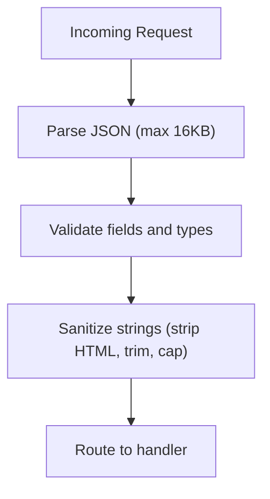

**Diagram sources**
- [server.js:287-287](file://server.js#L287-L287)
- [server.js:825-888](file://server.js#L825-L888)
- [server.js:890-1022](file://server.js#L890-L1022)
- [server.js:1024-1093](file://server.js#L1024-L1093)
- [server.js:1123-1143](file://server.js#L1123-L1143)
- [server.js:743-762](file://server.js#L743-L762)

**Section sources**
- [server.js:287-287](file://server.js#L287-L287)
- [server.js:825-888](file://server.js#L825-L888)
- [server.js:890-1022](file://server.js#L890-L1022)
- [server.js:1024-1093](file://server.js#L1024-L1093)
- [server.js:1123-1143](file://server.js#L1123-L1143)
- [server.js:743-762](file://server.js#L743-L762)

### Rate Limiting Strategies
- Dedicated rate limiters protect high-risk endpoints:
  - Chat API: 30 requests per 15 minutes per IP.
  - Newsletter API: 10 requests per 15 minutes per IP.
  - Search AI: 10 requests per minute per IP.
  - Lead capture: 5 requests per 15 minutes per IP.
- Missing express-rate-limit in production causes startup failure to ensure protection is always enforced.

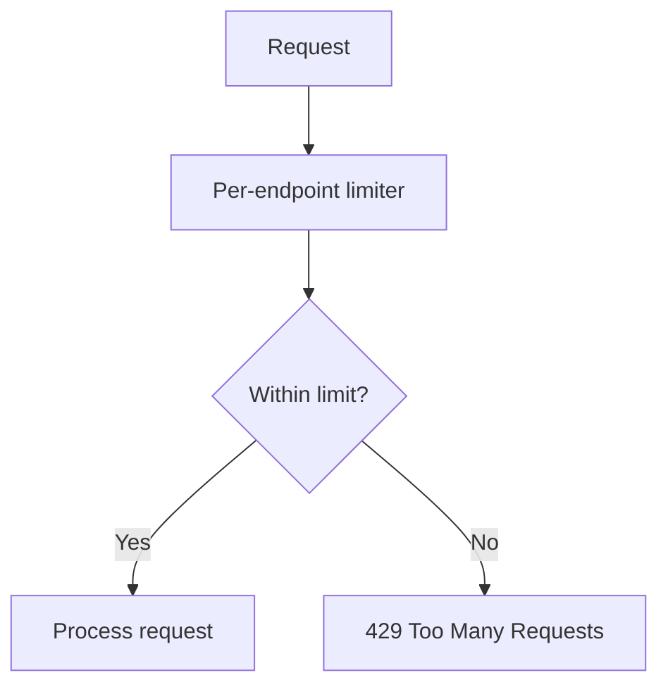

**Diagram sources**
- [server.js:95-107](file://server.js#L95-L107)
- [server.js:252-262](file://server.js#L252-L262)
- [server.js:625-641](file://server.js#L625-L641)
- [server.js:890-897](file://server.js#L890-L897)

**Section sources**
- [server.js:95-107](file://server.js#L95-L107)
- [server.js:252-262](file://server.js#L252-L262)
- [server.js:625-641](file://server.js#L625-L641)
- [server.js:890-897](file://server.js#L890-L897)

### IP Anonymization (GDPR Compliance)
- IP addresses are anonymized before logging:
  - IPv4: last octet zeroed.
  - IPv6: last 80 bits zeroed while preserving top-level routing info.
- Applied to lead logs and chat lead logs to comply with privacy requirements.

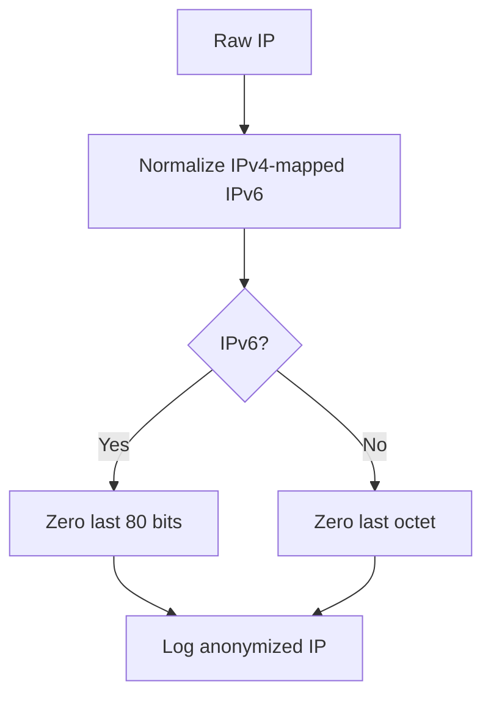

**Diagram sources**
- [server.js:109-127](file://server.js#L109-L127)
- [server.js:919-932](file://server.js#L919-L932)
- [server.js:1039-1053](file://server.js#L1039-L1053)
- [workers/webnovis-ai/src/index.js:118-139](file://workers/webnovis-ai/src/index.js#L118-L139)

**Section sources**
- [server.js:109-127](file://server.js#L109-L127)
- [server.js:919-932](file://server.js#L919-L932)
- [server.js:1039-1053](file://server.js#L1039-L1053)
- [workers/webnovis-ai/src/index.js:118-139](file://workers/webnovis-ai/src/index.js#L118-L139)

### Session Management (Memory-Based)
- Server-side sessions store conversation history to prevent client-side tampering.
- Sessions have:
  - Max age (30 minutes).
  - Max messages per session (20).
  - Max concurrent sessions (1000) with oldest eviction.
- Periodic cleanup removes expired sessions.

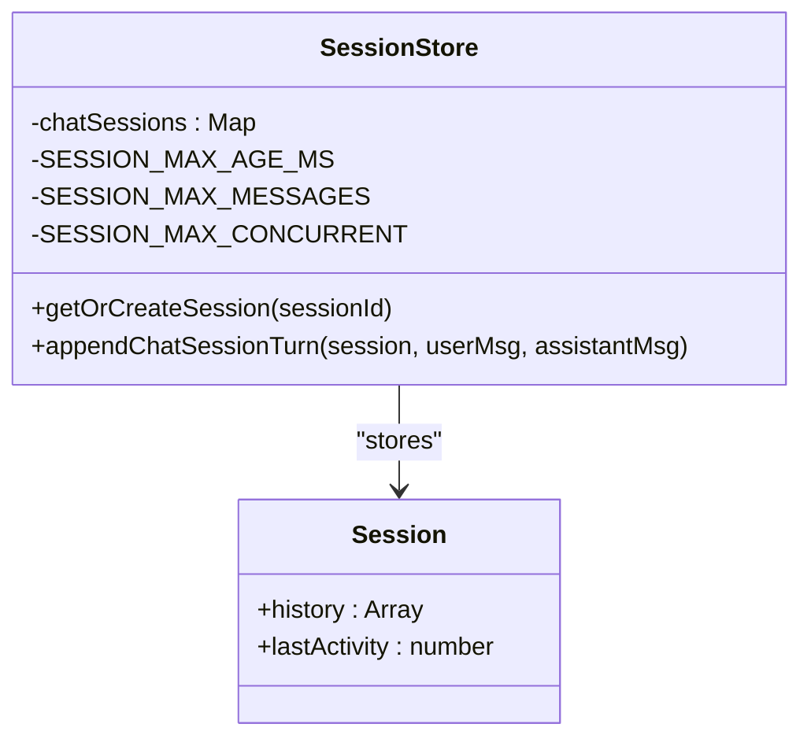

**Diagram sources**
- [server.js:584-619](file://server.js#L584-L619)
- [server.js:1095-1101](file://server.js#L1095-L1101)

**Section sources**
- [server.js:584-619](file://server.js#L584-L619)
- [server.js:1095-1101](file://server.js#L1095-L1101)

### API Quota Monitoring
- Tracks daily usage per Gemini API key with configurable thresholds.
- Warns at 80% usage and blocks further calls at 100%.
- Used for both chat and search flows to prevent runaway spend or abuse.

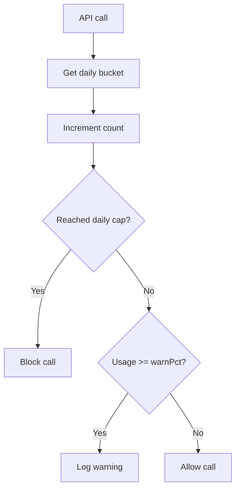

**Diagram sources**
- [server.js:180-220](file://server.js#L180-L220)
- [server.js:1170-1177](file://server.js#L1170-L1177)
- [server.js:680-684](file://server.js#L680-L684)

**Section sources**
- [server.js:180-220](file://server.js#L180-L220)
- [server.js:1170-1177](file://server.js#L1170-L1177)
- [server.js:680-684](file://server.js#L680-L684)

### Admin Authentication and Protected Endpoints
- Admin-only endpoints require a secret passed via a custom header.
- Secret comparison uses timing-safe equality to prevent timing attacks.
- Startup checks warn if secrets remain at defaults in production.

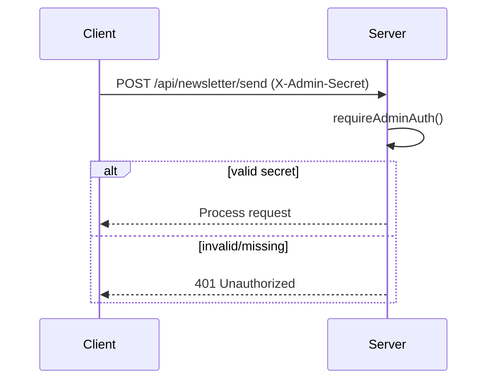

**Diagram sources**
- [server.js:75-93](file://server.js#L75-L93)
- [server.js:1327-1361](file://server.js#L1327-L1361)

**Section sources**
- [server.js:75-93](file://server.js#L75-L93)
- [server.js:1327-1361](file://server.js#L1327-L1361)

### Edge Worker Protections
- The Cloudflare Worker implements similar protections:
  - CORS handling tailored for edge responses.
  - IP anonymization aligned with server logic.
  - Rate limiting using KV-backed counters.
  - Prompt injection guard mirroring server patterns.

**Section sources**
- [workers/webnovis-ai/src/index.js:107-151](file://workers/webnovis-ai/src/index.js#L107-L151)
- [workers/webnovis-ai/src/index.js:266-288](file://workers/webnovis-ai/src/index.js#L266-L288)

## Dependency Analysis
- The server imports shared security configuration for headers and CORS helpers.
- Tests assert that the server uses the shared config and that generated static headers remain synchronized with the committed file.
- The worker shares conceptual protections but is independent of the Express stack.

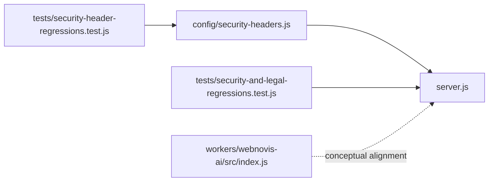

**Diagram sources**
- [server.js:10-11](file://server.js#L10-L11)
- [tests/security-and-legal-regressions.test.js:13-31](file://tests/security-and-legal-regressions.test.js#L13-L31)
- [tests/security-header-regressions.test.js:16-31](file://tests/security-header-regressions.test.js#L16-L31)

**Section sources**
- [server.js:10-11](file://server.js#L10-L11)
- [tests/security-and-legal-regressions.test.js:13-31](file://tests/security-and-legal-regressions.test.js#L13-L31)
- [tests/security-header-regressions.test.js:16-31](file://tests/security-header-regressions.test.js#L16-L31)

## Performance Considerations
- Compression middleware reduces transfer sizes for text assets.
- Static assets and HTML directories use appropriate cache headers; development disables caching to aid debugging.
- In-memory caches for search results and deduplication of concurrent queries reduce external API load.
- Rate limiting protects backend resources and improves stability under load.
- Quota tracking prevents excessive spending and enforces budget constraints.

[No sources needed since this section provides general guidance]

## Troubleshooting Guide
- If rate limiting is missing in production, the server refuses to start to ensure protection is enforced.
- If admin secrets are not configured or remain at defaults, startup warns and protected endpoints will reject requests.
- If CORS origins are misconfigured, cross-origin requests will be denied; verify environment variables and default allowlist.
- If CSP blocks scripts, ensure nonces are injected consistently or adjust directives carefully.
- For quota issues, monitor logs for warnings near thresholds and adjust daily limits accordingly.

**Section sources**
- [server.js:95-107](file://server.js#L95-L107)
- [server.js:228-232](file://server.js#L228-L232)
- [server.js:250-282](file://server.js#L250-L282)
- [config/security-headers.js:7-48](file://config/security-headers.js#L7-L48)
- [server.js:180-220](file://server.js#L180-L220)

## Conclusion
The application implements a robust, layered security posture:
- Strong headers and CSP minimize browser-side attack surfaces.
- Strict CORS policies and input validation reduce exposure.
- Prompt injection guards protect AI endpoints across languages.
- Rate limiting and quotas safeguard availability and cost.
- IP anonymization and server-side sessions uphold privacy and integrity.
- Tests ensure configuration consistency and operational safety.

[No sources needed since this section summarizes without analyzing specific files]

## Appendices

### Configuration Options by Environment
- CORS_ORIGINS: Comma-separated list appended to default allowed origins.
- NODE_ENV: Controls behavior such as caching and startup checks.
- NEWSLETTER_ADMIN_SECRET: Required for admin-only endpoints; must not be default in production.
- BREVO_*: Optional integrations for newsletter and lead notifications.
- GEMINI_API_KEY_CHAT / GEMINI_API_KEY_SEARCH: Control AI features and quotas.

**Section sources**
- [config/security-headers.js:50-62](file://config/security-headers.js#L50-L62)
- [server.js:228-232](file://server.js#L228-L232)
- [server.js:825-888](file://server.js#L825-L888)
- [server.js:890-1022](file://server.js#L890-L1022)
- [server.js:1123-1279](file://server.js#L1123-L1279)