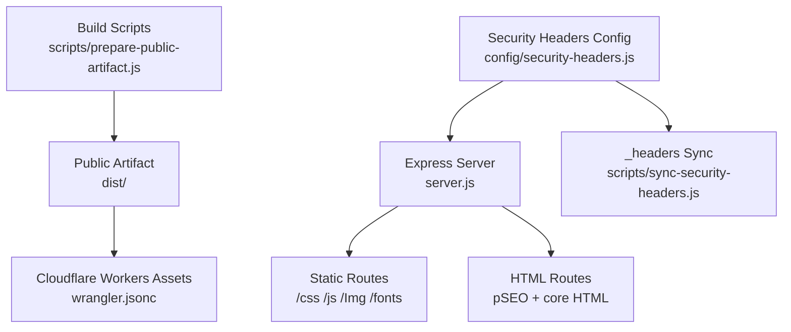
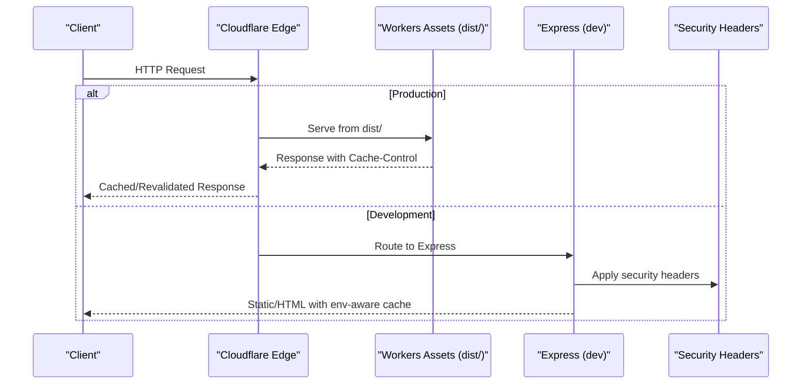
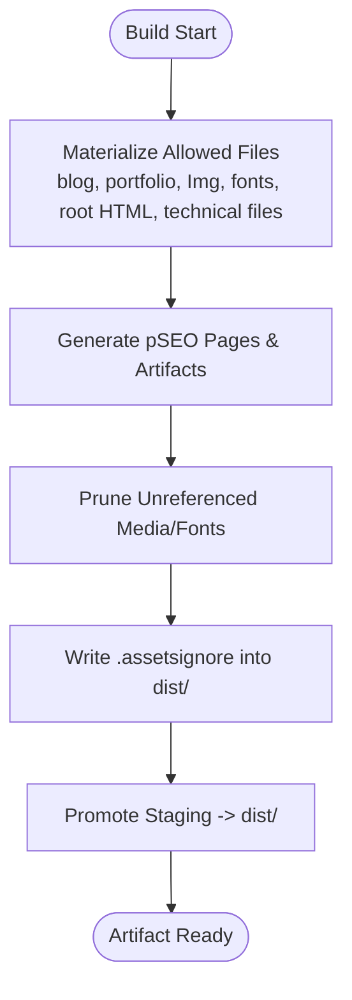
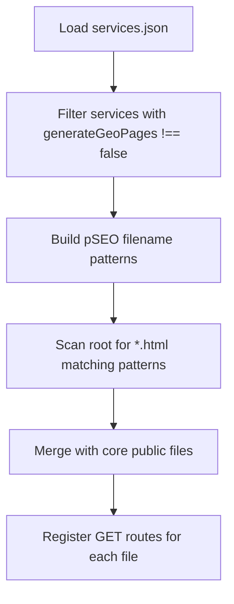
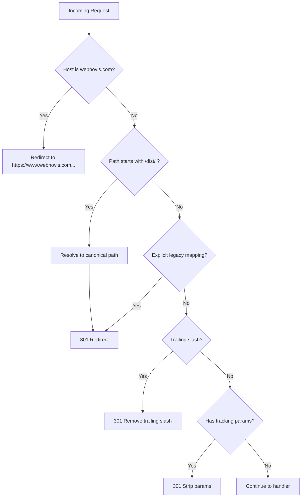
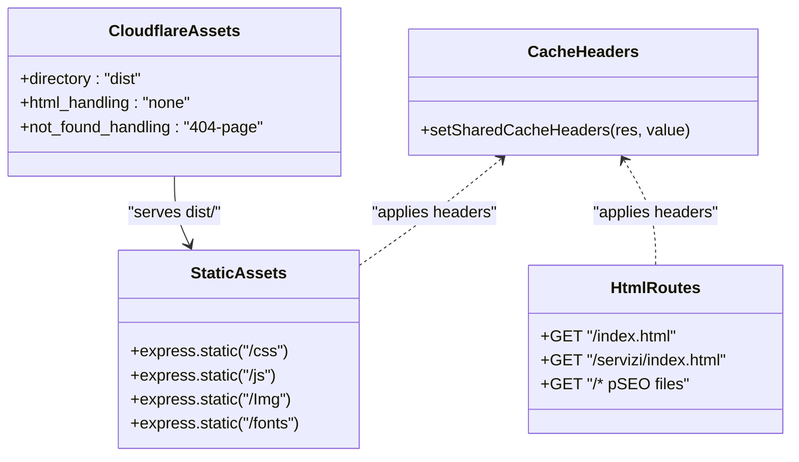
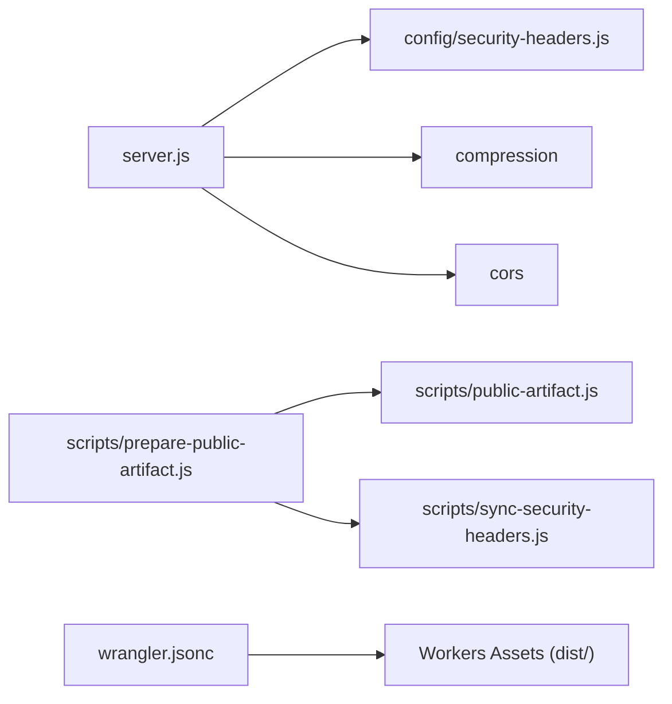

# Static File Serving & Caching

<cite>
**Referenced Files in This Document**
- [server.js](file://server.js)
- [wrangler.jsonc](file://wrangler.jsonc)
- [package.json](file://package.json)
- [config/security-headers.js](file://config/security-headers.js)
- [scripts/prepare-public-artifact.js](file://scripts/prepare-public-artifact.js)
- [scripts/public-artifact.js](file://scripts/public-artifact.js)
- [scripts/sync-security-headers.js](file://scripts/sync-security-headers.js)
- [robots.txt](file://robots.txt)
- [docs/deploy-header-matrix.md](file://docs/deploy-header-matrix.md)
</cite>

## Table of Contents
1. [Introduction](#introduction)
2. [Project Structure](#project-structure)
3. [Core Components](#core-components)
4. [Architecture Overview](#architecture-overview)
5. [Detailed Component Analysis](#detailed-component-analysis)
6. [Dependency Analysis](#dependency-analysis)
7. [Performance Considerations](#performance-considerations)
8. [Troubleshooting Guide](#troubleshooting-guide)
9. [Conclusion](#conclusion)
10. [Appendices](#appendices)

## Introduction
This document explains the static file serving system, caching strategies, CDN integration, and performance optimizations used by the project. It covers:
- How public files are discovered and served safely
- Redirect handling for legacy URLs and canonical normalization
- Cache control headers, stale-while-revalidate usage, and environment-specific behavior
- CDN configuration via Cloudflare Workers Assets
- Public file whitelist and AI-discoverable files access
- Directory structure organization and build-time artifact preparation

## Project Structure
The site is built into a sanitized public artifact (dist/) and served either by an Express server during development or by Cloudflare Workers Assets in production. The build pipeline prepares a minimal, safe set of assets and generates pSEO pages and other artifacts.

**Diagram sources**
- [scripts/prepare-public-artifact.js:183-248](file://scripts/prepare-public-artifact.js#L183-L248)
- [wrangler.jsonc:22-28](file://wrangler.jsonc#L22-L28)
- [server.js:458-526](file://server.js#L458-L526)
- [config/security-headers.js:64-100](file://config/security-headers.js#L64-L100)
- [scripts/sync-security-headers.js:1-18](file://scripts/sync-security-headers.js#L1-L18)

**Section sources**
- [scripts/prepare-public-artifact.js:183-248](file://scripts/prepare-public-artifact.js#L183-L248)
- [wrangler.jsonc:22-28](file://wrangler.jsonc#L22-L28)
- [server.js:458-526](file://server.js#L458-L526)
- [config/security-headers.js:64-100](file://config/security-headers.js#L64-L100)
- [scripts/sync-security-headers.js:1-18](file://scripts/sync-security-headers.js#L1-L18)

## Core Components
- Express server routes and middleware for redirects, trailing slash normalization, UTM stripping, canonical host redirect, and static asset serving with environment-aware cache headers.
- Cloudflare Workers Assets configuration to serve the dist/ artifact with explicit html_handling and not_found_handling.
- Security headers and cache rules centralized in config/security-headers.js and synchronized to _headers for static hosts.
- Build-time artifact preparation that materializes only allowed public files, generates pSEO pages, and prunes unreferenced media/fonts.

Key responsibilities:
- Safe public file discovery and whitelisting
- Canonical URL normalization and legacy redirects
- Consistent cache-control across runtime and edge
- AI-accessible technical files with open CORS where needed

**Section sources**
- [server.js:291-393](file://server.js#L291-L393)
- [server.js:441-526](file://server.js#L441-L526)
- [wrangler.jsonc:22-28](file://wrangler.jsonc#L22-L28)
- [config/security-headers.js:64-100](file://config/security-headers.js#L64-L100)
- [scripts/prepare-public-artifact.js:87-125](file://scripts/prepare-public-artifact.js#L87-L125)

## Architecture Overview
The request flow differs between development (Express) and production (Cloudflare Workers Assets). In both cases, cache headers and redirects are enforced consistently.

**Diagram sources**
- [wrangler.jsonc:22-28](file://wrangler.jsonc#L22-L28)
- [server.js:458-526](file://server.js#L458-L526)
- [config/security-headers.js:64-100](file://config/security-headers.js#L64-L100)

## Detailed Component Analysis

### File Discovery and Public Whitelist
- The build script materializes a curated subset of files into dist/:
  - Core HTML root files
  - Blog and portfolio HTML
  - Media and fonts filtered by allowed extensions
  - Technical files like robots.txt, sitemap.xml, manifest.json, ai.txt, llms.txt, etc.
- Forbidden prefixes and base names prevent sensitive source code or internal directories from being published.
- An .assetsignore is written into dist/ to further restrict what Workers Assets serves.
- Unreferenced media/fonts are pruned to reduce artifact size.

**Diagram sources**
- [scripts/prepare-public-artifact.js:87-125](file://scripts/prepare-public-artifact.js#L87-L125)
- [scripts/prepare-public-artifact.js:127-156](file://scripts/prepare-public-artifact.js#L127-L156)
- [scripts/public-artifact.js:8-69](file://scripts/public-artifact.js#L8-L69)
- [scripts/public-artifact.js:98-134](file://scripts/public-artifact.js#L98-L134)

**Section sources**
- [scripts/prepare-public-artifact.js:87-156](file://scripts/prepare-public-artifact.js#L87-L156)
- [scripts/public-artifact.js:8-69](file://scripts/public-artifact.js#L8-L69)
- [scripts/public-artifact.js:98-134](file://scripts/public-artifact.js#L98-L134)

### pSEO Page Discovery Mechanism
- At runtime, the server dynamically discovers generated pSEO HTML files at the root directory matching service slugs and patterns (e.g., agenzia-web-, realizzazione-siti-web-, and service-specific prefixes).
- These discovered files are added to the public route allowlist alongside core HTML files.
- The build process also generates these pages and includes them in the artifact.

**Diagram sources**
- [server.js:441-456](file://server.js#L441-L456)

**Section sources**
- [server.js:441-456](file://server.js#L441-L456)

### Redirect Handling and Canonical URL Normalization
- Non-www to www redirect in production ensures a single canonical host.
- Legacy build-artifact paths under /dist/ are resolved to canonical public paths and redirected with 301.
- Explicit legacy path mappings redirect deprecated URLs to current ones.
- Trailing slash normalization removes unnecessary slashes except for specific directories that serve index.html via static handlers.
- Tracking parameters (UTM, fbclid, gclid) are stripped to avoid duplicate content.
- Singular/plural page canonicalization redirects old filenames to new ones.
- /public/ prefix is stripped to canonical paths.

**Diagram sources**
- [server.js:291-298](file://server.js#L291-L298)
- [server.js:334-356](file://server.js#L334-L356)
- [server.js:358-367](file://server.js#L358-L367)
- [server.js:369-384](file://server.js#L369-L384)
- [server.js:386-393](file://server.js#L386-L393)
- [server.js:431-439](file://server.js#L431-L439)

**Section sources**
- [server.js:291-393](file://server.js#L291-L393)
- [server.js:431-439](file://server.js#L431-L439)

### Cache Control Headers and CDN Integration
- A shared helper sets Cache-Control and, in production, also sets CDN-Cache-Control and Surrogate-Control for consistent edge behavior.
- Static assets (CSS/JS/Images/Fonts) use long-lived immutable caching in production; development uses no-cache with cache-busting query strings.
- HTML responses use short max-age with stale-while-revalidate to balance freshness and performance.
- The static host header matrix defines expected cache behaviors per resource type and enforces hard checks in CI.
- Cloudflare Workers Assets serves the dist/ artifact with html_handling set to none to preserve .html URLs and rely on rewrite rules for directory indexes.

**Diagram sources**
- [server.js:458-526](file://server.js#L458-L526)
- [wrangler.jsonc:22-28](file://wrangler.jsonc#L22-L28)
- [config/security-headers.js:64-100](file://config/security-headers.js#L64-L100)

**Section sources**
- [server.js:458-526](file://server.js#L458-L526)
- [wrangler.jsonc:22-28](file://wrangler.jsonc#L22-L28)
- [config/security-headers.js:64-100](file://config/security-headers.js#L64-L100)
- [docs/deploy-header-matrix.md:1-17](file://docs/deploy-header-matrix.md#L1-L17)

### Environment-Specific Caching Behavior
- Development:
  - Static assets: no-cache, no-store, must-revalidate; relies on cache-busting query parameters.
  - HTML: no-cache, no-store, must-revalidate.
- Production:
  - Static assets: public, max-age=31536000, immutable.
  - HTML: public, max-age=300, stale-while-revalidate=3600.
  - Additional CDN headers: CDN-Cache-Control and Surrogate-Control mirror Cache-Control values.

**Section sources**
- [server.js:458-526](file://server.js#L458-L526)

### AI-Discoverable Files Access
- Certain technical files are explicitly allowed to be fetched by AI crawlers/tools:
  - robots.txt, sitemap.xml, ai.txt, llms.txt, llms-full.txt, webnovis-ai-data.json
- For these files, the server sets Access-Control-Allow-Origin: * to permit cross-origin access regardless of Origin header.
- robots.txt allows crawling of these files.

**Section sources**
- [server.js:501-521](file://server.js#L501-L521)
- [robots.txt:8-20](file://robots.txt#L8-L20)

### Directory Structure Organization
- Root-level HTML files include core pages and generated pSEO pages.
- Subdirectories organize content:
  - /blog: blog articles and index
  - /servizi: service hub and subpages
  - /agenzia-web: agency hub pages
  - /realizzazione-siti-web: realization hub pages
  - /zone-servite: service area hubs
  - /portfolio: case studies
  - /Img: images
  - /fonts: fonts
  - /css: stylesheets
  - /js: scripts
- Build-time artifact contains only necessary files; unused media/fonts are pruned.

**Section sources**
- [scripts/prepare-public-artifact.js:87-125](file://scripts/prepare-public-artifact.js#L87-L125)
- [scripts/public-artifact.js:98-134](file://scripts/public-artifact.js#L98-L134)

## Dependency Analysis
- server.js depends on:
  - express for routing and static serving
  - compression for response compression
  - cors for cross-origin requests
  - config/security-headers.js for security and cache header definitions
  - node-fetch for API calls
- Build pipeline depends on:
  - scripts/prepare-public-artifact.js orchestrating generation steps
  - scripts/public-artifact.js for allowlists and validations
  - scripts/sync-security-headers.js to keep _headers in sync
- Cloudflare Workers Assets reads wrangler.jsonc to serve dist/ with configured settings.

**Diagram sources**
- [server.js:1-11](file://server.js#L1-L11)
- [server.js:234-282](file://server.js#L234-L282)
- [scripts/prepare-public-artifact.js:183-248](file://scripts/prepare-public-artifact.js#L183-L248)
- [scripts/public-artifact.js:8-69](file://scripts/public-artifact.js#L8-L69)
- [scripts/sync-security-headers.js:1-18](file://scripts/sync-security-headers.js#L1-L18)
- [wrangler.jsonc:22-28](file://wrangler.jsonc#L22-L28)

**Section sources**
- [server.js:1-11](file://server.js#L1-L11)
- [server.js:234-282](file://server.js#L234-L282)
- [scripts/prepare-public-artifact.js:183-248](file://scripts/prepare-public-artifact.js#L183-L248)
- [scripts/public-artifact.js:8-69](file://scripts/public-artifact.js#L8-L69)
- [scripts/sync-security-headers.js:1-18](file://scripts/sync-security-headers.js#L1-L18)
- [wrangler.jsonc:22-28](file://wrangler.jsonc#L22-L28)

## Performance Considerations
- Compression enabled for text assets reduces transfer size significantly.
- Long-lived immutable caching for stable assets improves repeat visit performance.
- Short TTL with stale-while-revalidate for HTML balances freshness and speed.
- Asset pruning removes unreferenced media/fonts to minimize payload.
- Avoiding unnecessary redirects and normalizing URLs reduces crawl overhead and duplicate content risks.
- Bot logging helps analyze crawler behavior without impacting performance.

[No sources needed since this section provides general guidance]

## Troubleshooting Guide
- If static assets are not cached as expected:
  - Verify environment variable NODE_ENV is set to production for immutable caching.
  - Ensure CDN-Cache-Control and Surrogate-Control are present in production responses.
  - Confirm that static routes are mounted correctly and headers are applied.
- If HTML pages are not revalidating properly:
  - Check that HTML responses have appropriate max-age and stale-while-revalidate values.
  - Validate that redirects do not interfere with intended URLs.
- If AI tools cannot fetch technical files:
  - Confirm Access-Control-Allow-Origin: * is set for those files.
  - Ensure robots.txt allows crawling of these files.
- If legacy URLs return 404:
  - Check redirect mappings and dist canonical resolution logic.
  - Verify trailing slash exclusions and parameter stripping behavior.

**Section sources**
- [server.js:458-526](file://server.js#L458-L526)
- [server.js:334-393](file://server.js#L334-L393)
- [server.js:501-521](file://server.js#L501-L521)
- [robots.txt:8-20](file://robots.txt#L8-L20)

## Conclusion
The static file serving system combines a secure, curated build artifact with robust runtime and edge caching strategies. Canonical URL normalization and comprehensive redirect handling ensure clean indexing and user experience. Environment-aware cache headers and CDN integration deliver optimal performance while maintaining freshness for dynamic content. The public whitelist and AI-accessible files enable safe, efficient distribution of resources to both users and automated systems.

[No sources needed since this section summarizes without analyzing specific files]

## Appendices

### Example Cache Configuration Summary
- Static assets (production): public, max-age=31536000, immutable
- HTML (production): public, max-age=300, stale-while-revalidate=3600
- Development: no-cache, no-store, must-revalidate for all
- CDN headers: CDN-Cache-Control and Surrogate-Control mirror Cache-Control in production

**Section sources**
- [server.js:458-526](file://server.js#L458-L526)
- [config/security-headers.js:64-100](file://config/security-headers.js#L64-L100)

### Example Redirect Rules Summary
- Non-www to www redirect in production
- Legacy /dist/ paths mapped to canonical public paths
- Explicit legacy path mappings for deprecated URLs
- Trailing slash normalization excluding specific directories
- UTM/tracking parameter stripping
- Singular/plural page canonicalization
- /public/ prefix stripping

**Section sources**
- [server.js:291-393](file://server.js#L291-L393)
- [server.js:431-439](file://server.js#L431-L439)

### Performance Tuning Options
- Enable compression for text assets
- Use immutable caching for stable assets
- Apply stale-while-revalidate for HTML to improve perceived performance
- Prune unreferenced media/fonts during build
- Monitor bot access logs for crawl insights

**Section sources**
- [server.js:234-249](file://server.js#L234-L249)
- [scripts/prepare-public-artifact.js:127-156](file://scripts/prepare-public-artifact.js#L127-L156)
- [server.js:395-429](file://server.js#L395-L429)