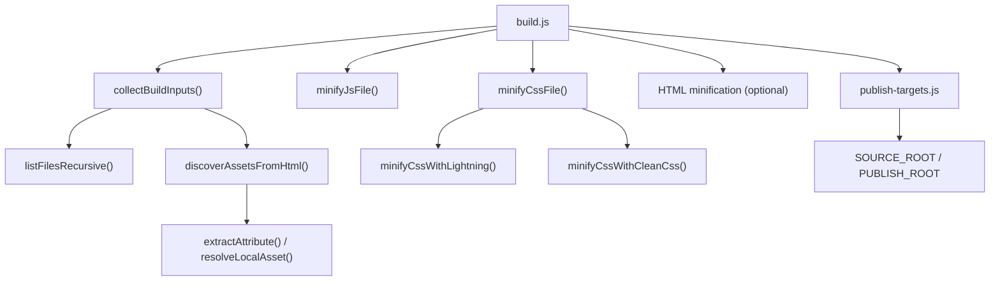
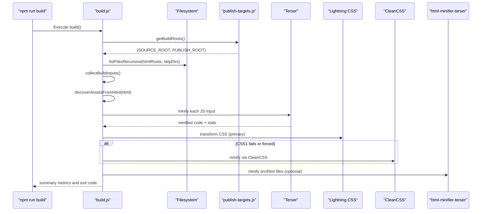
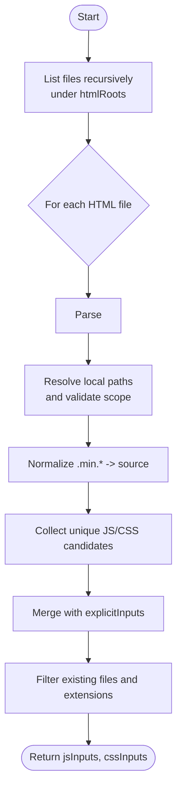
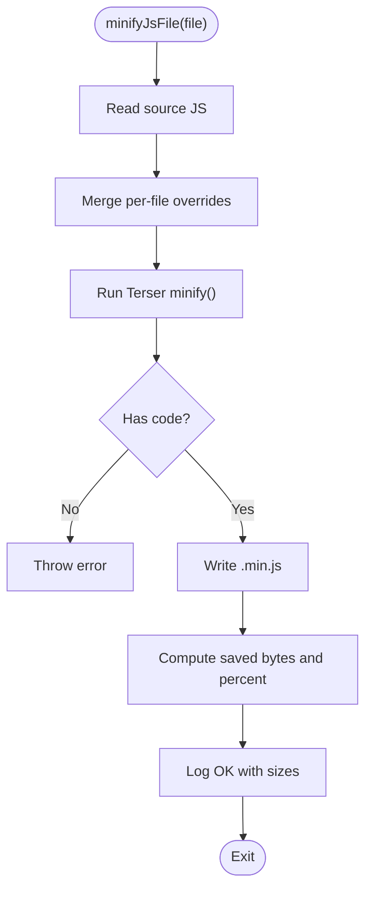
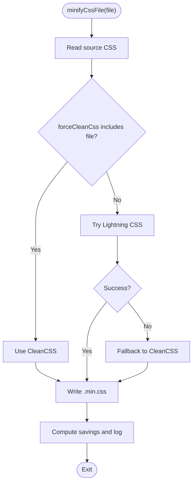
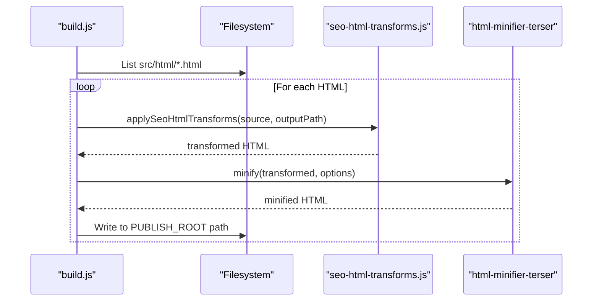
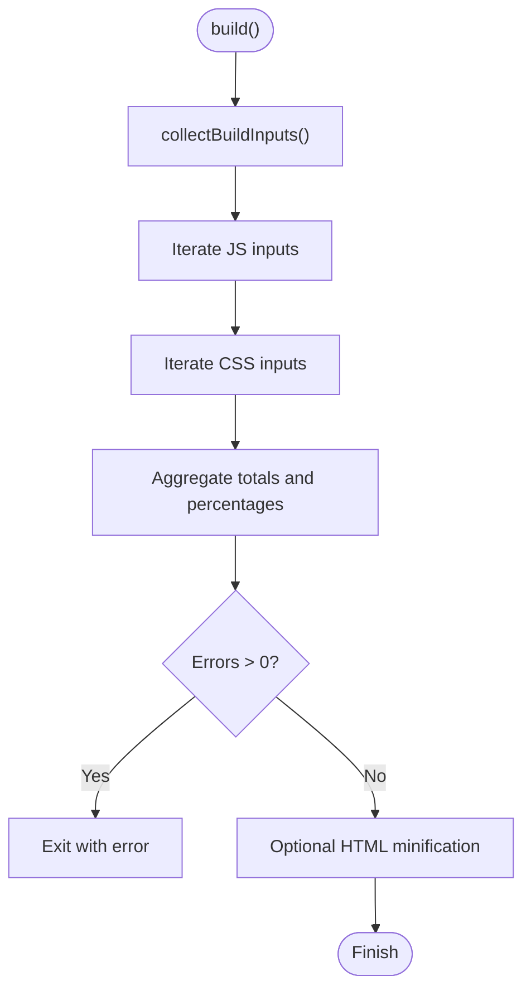
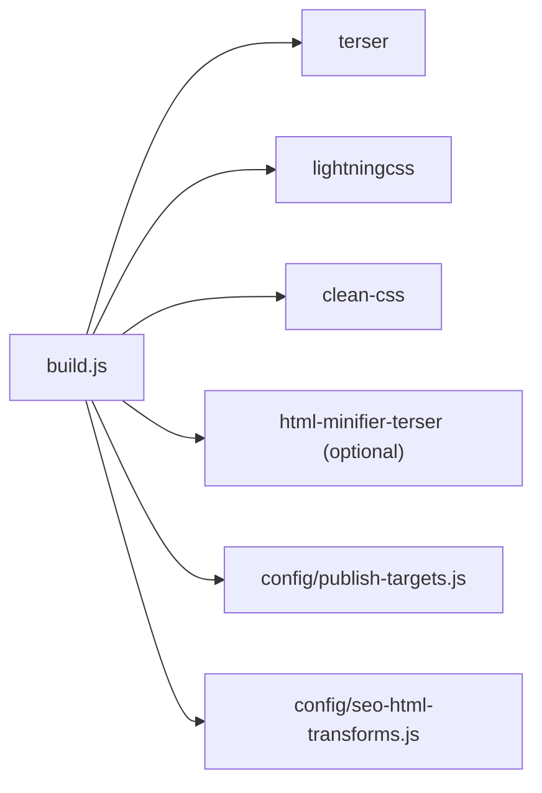

# Asset Optimization Pipeline

<cite>
**Referenced Files in This Document**
- [build.js](file://build.js)
- [package.json](file://package.json)
- [publish-targets.js](file://config/publish-targets.js)
- [seo-html-transforms.js](file://config/seo-html-transforms.js)
- [.assetsignore](file://.assetsignore)
- [prepare-public-artifact.js](file://scripts/prepare-public-artifact.js)
</cite>

## Table of Contents
1. [Introduction](#introduction)
2. [Project Structure](#project-structure)
3. [Core Components](#core-components)
4. [Architecture Overview](#architecture-overview)
5. [Detailed Component Analysis](#detailed-component-analysis)
6. [Dependency Analysis](#dependency-analysis)
7. [Performance Considerations](#performance-considerations)
8. [Troubleshooting Guide](#troubleshooting-guide)
9. [Conclusion](#conclusion)
10. [Appendices](#appendices)

## Introduction
This document explains the WebNovis asset optimization pipeline that automatically discovers JavaScript and CSS dependencies from HTML, minifies them with a dual-engine approach (Lightning CSS with CleanCSS fallback), and compresses JavaScript using Terser with advanced compression settings. It also covers configuration options, per-file overrides, skip lists, error handling, performance metrics, and debugging techniques.

## Project Structure
The build system is implemented as a Node.js script that:
- Scans HTML files to discover local JS and CSS references
- Builds an input set by combining explicit inputs and discovered assets
- Minifies JS via Terser and CSS via Lightning CSS with CleanCSS fallback
- Optionally minifies source HTML through html-minifier-terser
- Writes optimized outputs into the publish root

**Diagram sources**
- [build.js:159-279](file://build.js#L159-L279)
- [publish-targets.js:21-27](file://config/publish-targets.js#L21-L27)

**Section sources**
- [build.js:1-113](file://build.js#L1-L113)
- [publish-targets.js:1-37](file://config/publish-targets.js#L1-L37)

## Core Components
- Automatic asset discovery: scans HTML for <script src="..."> and <link rel="stylesheet" href="...">, resolves relative paths, filters out external or data URIs, and maps .min.* back to source files.
- JavaScript minification: uses Terser with aggressive compression (dead code elimination, unused removal, multiple passes, pure functions, global definitions). Per-file overrides are supported.
- CSS minification: primary engine Lightning CSS; if unavailable or fails, falls back to CleanCSS with safe level-1 transforms. Per-file overrides supported; force-clean-css list available.
- HTML minification: optional step using html-minifier-terser on src/html files only, after SEO transforms are applied.
- Build roots and output: SOURCE_ROOT and PUBLISH_ROOT are resolved via publish-targets.js; outputs are written next to source files with configured suffixes (.min.js, .min.css).

Key configuration areas:
- Discovery: htmlRoots, skipDirs
- JS: explicitInputs, suffix, skip, overrides, terserOptions
- CSS: explicitInputs, suffix, skip, forceCleanCss, overrides, lightningOptions, cleanCssFallbackOptions
- HTML: optional minification with conservative options

**Section sources**
- [build.js:31-113](file://build.js#L31-L113)
- [build.js:242-279](file://build.js#L242-L279)
- [build.js:290-371](file://build.js#L290-L371)
- [build.js:428-493](file://build.js#L428-L493)

## Architecture Overview
The pipeline orchestrates discovery, transformation, and output generation with clear separation between source and publish roots.

**Diagram sources**
- [build.js:373-496](file://build.js#L373-L496)
- [publish-targets.js:21-27](file://config/publish-targets.js#L21-L27)

## Detailed Component Analysis

### Automatic Asset Discovery
- Recursively lists files under configured htmlRoots while skipping specified directories.
- Parses each HTML file for <script> tags and <link rel="stylesheet"> tags.
- Resolves relative paths against the HTML’s directory and ensures references stay within SOURCE_ROOT.
- Filters out external URLs and data URIs.
- Normalizes .min.* references back to their source counterparts.
- Combines explicitInputs with discovered assets to form final JS/CSS input sets.

**Diagram sources**
- [build.js:159-207](file://build.js#L159-L207)
- [build.js:209-240](file://build.js#L209-L240)
- [build.js:242-279](file://build.js#L242-L279)

**Section sources**
- [build.js:159-279](file://build.js#L159-L279)

### JavaScript Minification with Terser
- Reads source JS, computes original size, merges per-file overrides into terserOptions, and runs minify().
- Validates non-empty output, writes .min.js next to source, and logs savings.
- Advanced compression includes dead_code, unused, passes, pure_funcs, pure_getters, and global_defs. Source maps disabled by default.

**Diagram sources**
- [build.js:290-313](file://build.js#L290-L313)

**Section sources**
- [build.js:290-313](file://build.js#L290-L313)

### CSS Minification: Dual-Engine Approach
- Primary engine: Lightning CSS with minify enabled and drafts for nesting/custom media.
- Fallback: CleanCSS with level-1 transforms only (safe mode) to avoid risky reordering.
- Per-file overrides can adjust either engine’s options; forceCleanCss forces fallback regardless of availability.
- On failure or forced fallback, logs engine used and continues.

**Diagram sources**
- [build.js:315-371](file://build.js#L315-L371)

**Section sources**
- [build.js:315-371](file://build.js#L315-L371)

### HTML Minification (Optional)
- If html-minifier-terser is installed, it minifies files under src/html and writes outputs to corresponding paths in PUBLISH_ROOT.
- Applies SEO transforms before minification.
- Uses conservative options to preserve structure while removing whitespace/comments and collapsing attributes.

**Diagram sources**
- [build.js:428-493](file://build.js#L428-L493)
- [seo-html-transforms.js:1-20](file://config/seo-html-transforms.js#L1-L20)

**Section sources**
- [build.js:428-493](file://build.js#L428-L493)

### Configuration and Overrides
- Discovery:
  - htmlRoots: array of directories to scan for HTML
  - skipDirs: directories to ignore during recursion
- JS:
  - explicitInputs: list of JS files to always include
  - suffix: output extension (.min.js)
  - skip: per-file skip list
  - overrides: per-file Terser options merge
  - terserOptions: compression, mangling, formatting, sourceMap
- CSS:
  - explicitInputs: list of CSS files to always include
  - suffix: output extension (.min.css)
  - skip: per-file skip list
  - forceCleanCss: per-file fallback forcing
  - overrides: per-file Lightning CSS options merge
  - lightningOptions: minify, sourceMap, drafts
  - cleanCssFallbackOptions: level-1 safe transforms
- HTML:
  - Optional minification with conservative options

**Section sources**
- [build.js:31-113](file://build.js#L31-L113)

### Build Orchestration and Metrics
- Aggregates success/error counts and total bytes before/after minification.
- Exits with non-zero status when errors occur.
- Logs per-file results and overall savings percentage.

**Diagram sources**
- [build.js:373-426](file://build.js#L373-L426)

**Section sources**
- [build.js:373-426](file://build.js#L373-L426)

## Dependency Analysis
- External libraries:
  - terser: JS minification
  - lightningcss: CSS minification (primary)
  - clean-css: CSS minification (fallback)
  - html-minifier-terser: optional HTML minification
- Internal modules:
  - config/publish-targets.js: resolves SOURCE_ROOT and PUBLISH_ROOT
  - config/seo-html-transforms.js: applies SEO transformations to HTML before minification

**Diagram sources**
- [build.js:15-27](file://build.js#L15-L27)
- [publish-targets.js:21-27](file://config/publish-targets.js#L21-L27)
- [seo-html-transforms.js:1-20](file://config/seo-html-transforms.js#L1-L20)

**Section sources**
- [build.js:15-27](file://build.js#L15-L27)
- [package.json:78-90](file://package.json#L78-L90)

## Performance Considerations
- Terser settings:
  - Multiple passes (passes: 3)
  - Dead code elimination and unused removal
  - Pure function and getter optimizations
  - Global definitions for conditional compilation
- Lightning CSS:
  - Enables modern features (nesting, custom media) and minification
- CleanCSS fallback:
  - Level-1 transforms only to avoid risky reordering
- HTML minification:
  - Conservative collapse and attribute cleanup
- Output metrics:
  - Per-file and aggregate savings reported in bytes and percentage

[No sources needed since this section provides general guidance]

## Troubleshooting Guide
Common issues and remedies:
- Lightning CSS unavailable or failing:
  - The pipeline will fall back to CleanCSS and log a warning. Ensure lightningcss is installed or add the file to forceCleanCss if necessary.
- Empty Terser output:
  - Indicates invalid JS or misconfiguration. Verify syntax and ensure overrides do not disable required features.
- Missing inputs:
  - When building to a separate publish root, both JS and CSS inputs must be non-zero; otherwise the build throws an error.
- HTML minification skipped:
  - Occurs when html-minifier-terser is not installed. Install the dependency or accept that HTML minification is skipped.
- Assets not discovered:
  - Confirm HTML references use local paths and are not external/data URIs. Ensure referenced files exist under SOURCE_ROOT.
- Skip lists:
  - Files listed in skip arrays will be ignored. Remove entries if you expect processing.

Operational tips:
- Use npm scripts:
  - build: node build.js
  - build:dist: node build.js --out-dir=dist
  - build:watch: nodemon --watch js --watch css --exec npm run build
- Inspect logs:
  - Each file logs OK/SKIP/ERR with sizes and percentages. Aggregate totals show overall savings.
- Debugging:
  - Temporarily remove per-file overrides to isolate issues.
  - Force CleanCSS for problematic CSS files to confirm correctness.

**Section sources**
- [build.js:315-371](file://build.js#L315-L371)
- [build.js:290-313](file://build.js#L290-L313)
- [build.js:373-426](file://build.js#L373-L426)
- [build.js:428-493](file://build.js#L428-L493)
- [package.json:6-11](file://package.json#L6-L11)

## Conclusion
The WebNovis asset optimization pipeline provides robust automatic discovery of JS and CSS dependencies from HTML, high-performance minification with a resilient dual-engine CSS strategy, and advanced JS compression. It offers fine-grained configuration, per-file overrides, and comprehensive logging for reliable builds and easy troubleshooting.

[No sources needed since this section summarizes without analyzing specific files]

## Appendices

### Build Configuration Examples
- Basic build:
  - npm run build
- Dist build:
  - npm run build:dist
- Watch mode:
  - npm run build:watch

**Section sources**
- [package.json:6-11](file://package.json#L6-L11)

### Skip Lists and Overrides
- Skip files:
  - Add paths to config.js.skip and config.css.skip
- Per-file overrides:
  - Provide overrides for specific files under config.js.overrides and config.css.overrides
- Force CleanCSS:
  - Add CSS file paths to config.css.forceCleanCss

**Section sources**
- [build.js:31-113](file://build.js#L31-L113)

### Custom Processing Rules
- Discovery roots:
  - Adjust config.discovery.htmlRoots and config.discovery.skipDirs
- Explicit inputs:
  - Extend config.js.explicitInputs and config.css.explicitInputs
- HTML minification:
  - Ensure html-minifier-terser is installed to enable optional HTML minification

**Section sources**
- [build.js:31-113](file://build.js#L31-L113)
- [build.js:428-493](file://build.js#L428-L493)

### Error Handling and Exit Codes
- Non-zero exit on errors:
  - The build sets process.exitCode when any file processing fails.
- Logging:
  - INFO, OK, SKIP, WARN, ERR levels provide detailed feedback.

**Section sources**
- [build.js:373-426](file://build.js#L373-L426)

### Publishing and Ignore Rules
- Publish targets:
  - SOURCE_ROOT and PUBLISH_ROOT are resolved via publish-targets.js
- Assets ignore:
  - .assetsignore excludes sensitive and build-related files from public artifacts
- Prepare artifact:
  - prepare-public-artifact.js generates dist-specific .assetsignore for deployment

**Section sources**
- [publish-targets.js:21-27](file://config/publish-targets.js#L21-L27)
- [.assetsignore:1-98](file://.assetsignore#L1-L98)
- [prepare-public-artifact.js:116-118](file://scripts/prepare-public-artifact.js#L116-L118)