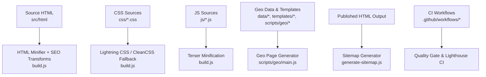
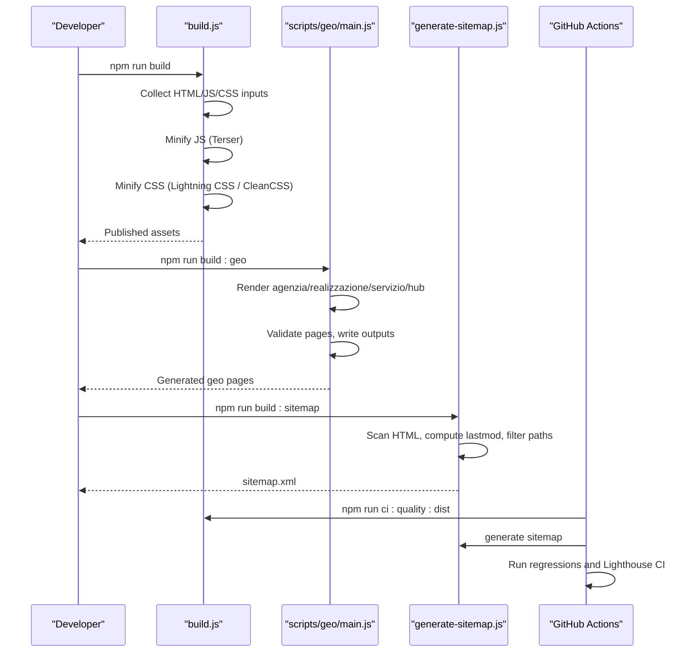
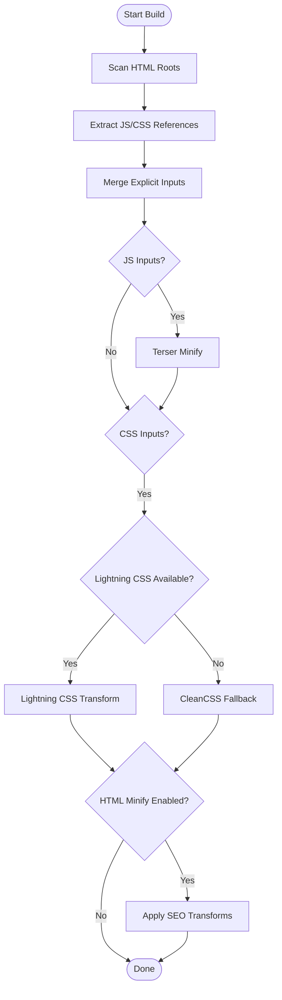
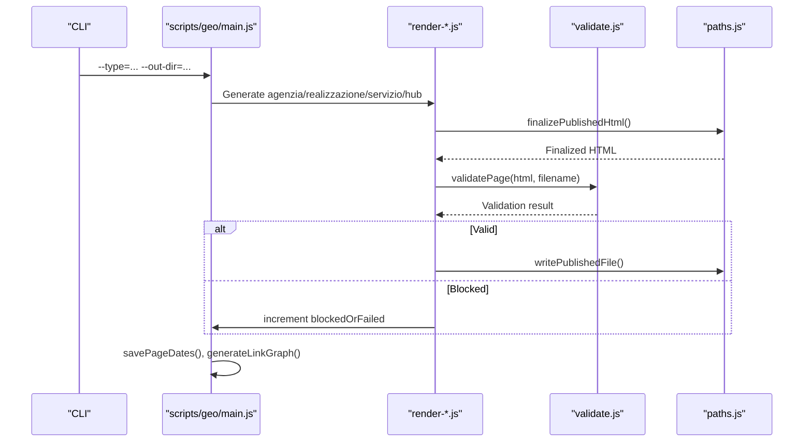
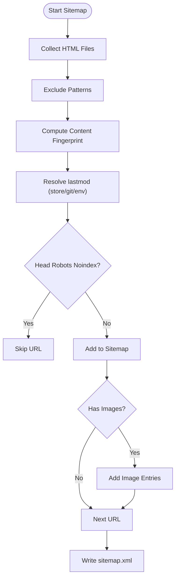
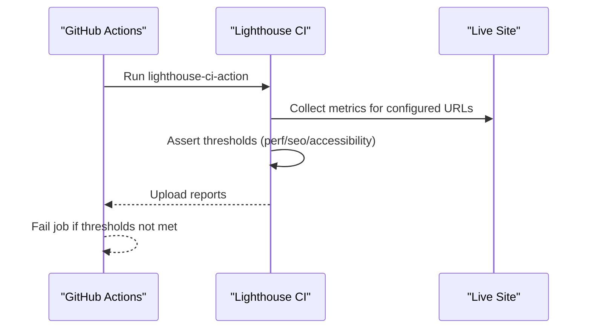
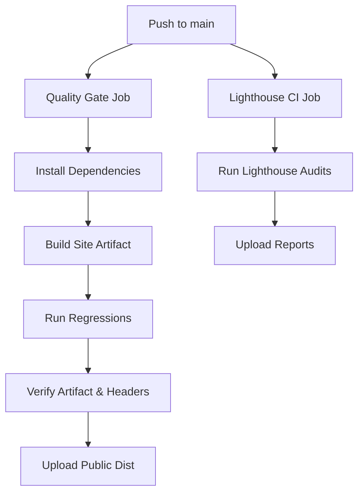
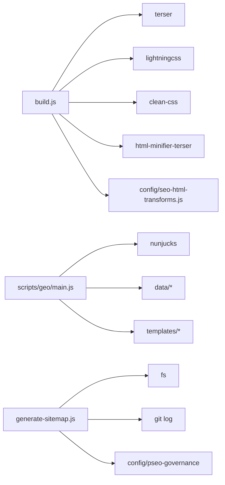

# Build System & Asset Pipeline

<cite>
**Referenced Files in This Document**
- [build.js](file://build.js)
- [package.json](file://package.json)
- [lighthouserc.js](file://lighthouserc.js)
- [generate-sitemap.js](file://generate-sitemap.js)
- [scripts/generate-all-geo.js](file://scripts/generate-all-geo.js)
- [scripts/geo/main.js](file://scripts/geo/main.js)
- [scripts/geo/config.js](file://scripts/geo/config.js)
- [scripts/geo/render-agenzia.js](file://scripts/geo/render-agenzia.js)
- [scripts/geo/render-servizio.js](file://scripts/geo/render-servizio.js)
- [config/publish-targets.js](file://config/publish-targets.js)
- [config/seo-html-transforms.js](file://config/seo-html-transforms.js)
- [.github/workflows/lighthouse-ci.yml](file://.github/workflows/lighthouse-ci.yml)
- [.github/workflows/quality-gate.yml](file://.github/workflows/quality-gate.yml)
- [scripts/fix-cache-busting.js](file://scripts/fix-cache-busting.js)
</cite>

## Table of Contents
1. [Introduction](#introduction)
2. [Project Structure](#project-structure)
3. [Core Components](#core-components)
4. [Architecture Overview](#architecture-overview)
5. [Detailed Component Analysis](#detailed-component-analysis)
6. [Dependency Analysis](#dependency-analysis)
7. [Performance Considerations](#performance-considerations)
8. [Troubleshooting Guide](#troubleshooting-guide)
9. [Conclusion](#conclusion)
10. [Appendices](#appendices)

## Introduction
This document explains the WebNovis build system and asset pipeline with a focus on:
- Asset discovery, optimization, minification, and template rendering
- The geo-page generation system that creates location-specific content automatically
- CSS minification, JavaScript bundling strategy, image handling, and cache busting
- Lighthouse integration for performance testing
- Sitemap generation and lastmod strategy
- CI/CD patterns, error handling, debugging techniques, and extension points

The goal is to help developers understand how source files map to generated output, how to customize the pipeline, and how to extend it safely without breaking existing behavior.

## Project Structure
At a high level, the repository separates:
- Source assets under `src/html`, `css`, `js`
- Geo page templates and data under `templates`, `data`, and `scripts/geo`
- Build orchestration at the root (`build.js`, `generate-sitemap.js`, `scripts/generate-all-geo.js`)
- Configuration for publish targets and SEO transforms under `config`
- CI workflows under `.github/workflows`

**Diagram sources**
- [build.js:31-113](file://build.js#L31-L113)
- [scripts/geo/main.js:38-66](file://scripts/geo/main.js#L38-L66)
- [generate-sitemap.js:14-37](file://generate-sitemap.js#L14-L37)
- [.github/workflows/quality-gate.yml:9-47](file://.github/workflows/quality-gate.yml#L9-L47)
- [.github/workflows/lighthouse-ci.yml:1-27](file://.github/workflows/lighthouse-ci.yml#L1-L27)

**Section sources**
- [build.js:31-113](file://build.js#L31-L113)
- [scripts/geo/main.js:38-66](file://scripts/geo/main.js#L38-L66)
- [generate-sitemap.js:14-37](file://generate-sitemap.js#L14-L37)
- [package.json:6-60](file://package.json#L6-L60)

## Core Components
- Build orchestrator: discovers HTML, JS, and CSS inputs; minifies JS and CSS; optionally minifies source HTML and applies SEO transforms.
- Geo generator: composes pages per city/service using Nunjucks templates, editorial overrides, and schema injection.
- Sitemap generator: scans published HTML, computes deterministic lastmod, filters indexable paths, and writes sitemap.xml.
- CI pipelines: quality gate runs full artifact preparation and validation; Lighthouse CI enforces performance thresholds.

Key configuration:
- Publish roots and report directories are resolved from CLI args or environment variables.
- SEO transforms inject canonical tags, robots directives, strategic links, and content upgrades into built HTML.

**Section sources**
- [build.js:159-279](file://build.js#L159-L279)
- [config/publish-targets.js:1-37](file://config/publish-targets.js#L1-L37)
- [config/seo-html-transforms.js:1-27](file://config/seo-html-transforms.js#L1-L27)
- [scripts/geo/config.js:16-48](file://scripts/geo/config.js#L16-L48)

## Architecture Overview
The build pipeline has two major flows:

1) Static asset build flow
- Discover HTML files and extract referenced JS/CSS
- Minify JS with Terser
- Minify CSS with Lightning CSS, falling back to CleanCSS when needed
- Optionally minify source HTML and apply SEO transforms

2) Geo page generation flow
- Load cities/services data and Nunjucks templates
- Generate agenzia, realizzazione, servizio×città, and hub pages
- Validate each page and write outputs (or dry-run/validate-only)
- Persist link graph and editorial dates

**Diagram sources**
- [build.js:373-496](file://build.js#L373-L496)
- [scripts/geo/main.js:38-289](file://scripts/geo/main.js#L38-L289)
- [generate-sitemap.js:200-254](file://generate-sitemap.js#L200-L254)
- [.github/workflows/quality-gate.yml:24-47](file://.github/workflows/quality-gate.yml#L24-L47)
- [.github/workflows/lighthouse-ci.yml:9-27](file://.github/workflows/lighthouse-ci.yml#L9-L27)

## Detailed Component Analysis

### Asset Discovery and Optimization
- Input collection:
  - Scans HTML roots for `.html` files
  - Extracts `<script src>` and `<link rel="stylesheet">` references
  - Resolves local assets relative to HTML directory
  - Merges explicit inputs from configuration with discovered assets
- JS minification:
  - Uses Terser with aggressive dead code removal, console stripping, and mangle options
  - Supports per-file overrides via configuration
- CSS minification:
  - Primary engine: Lightning CSS with modern features enabled
  - Fallback: CleanCSS with conservative transformations to preserve cascade safety
  - Per-file overrides supported
- HTML minification:
  - Optional step for source HTML under `src/html`
  - Applies SEO transforms before minification
  - Writes minified HTML to publish root paths

**Diagram sources**
- [build.js:159-279](file://build.js#L159-L279)
- [build.js:290-371](file://build.js#L290-L371)
- [build.js:428-493](file://build.js#L428-L493)

**Section sources**
- [build.js:31-113](file://build.js#L31-L113)
- [build.js:159-279](file://build.js#L159-L279)
- [build.js:290-371](file://build.js#L290-L371)
- [build.js:428-493](file://build.js#L428-L493)

### Geo-Page Generation System
The geo generator produces three primary page types plus hubs:
- Agenzia pages: localized agency landing per city
- Realizzazione pages: localized web development landing per city
- Servizio×Città pages: service-city combinatorial matrix
- Hub pages: internal linking bridges

Generation steps:
- Load centralized data (cities, services, content blocks)
- Render content via Nunjucks templates
- Inject head meta, canonical, robots, and JSON-LD schemas
- Validate pages (word count, links, schema presence)
- Write outputs or skip based on flags (`--dry-run`, `--validate-only`)
- Persist link graph and editorial dates

**Diagram sources**
- [scripts/geo/main.js:38-289](file://scripts/geo/main.js#L38-L289)
- [scripts/geo/render-agenzia.js:34-189](file://scripts/geo/render-agenzia.js#L34-L189)
- [scripts/geo/render-servizio.js:36-284](file://scripts/geo/render-servizio.js#L36-L284)

**Section sources**
- [scripts/generate-all-geo.js:1-58](file://scripts/generate-all-geo.js#L1-L58)
- [scripts/geo/main.js:38-289](file://scripts/geo/main.js#L38-L289)
- [scripts/geo/render-agenzia.js:34-189](file://scripts/geo/render-agenzia.js#L34-L189)
- [scripts/geo/render-servizio.js:36-284](file://scripts/geo/render-servizio.js#L36-L284)

### Sitemap Generation and Lastmod Strategy
- Scans published HTML recursively
- Excludes non-public paths (docs, dist, templates, node_modules, etc.)
- Computes lastmod deterministically:
  - Content fingerprint ignores shared chrome (scripts, styles, nav, header, footer, links, timestamps)
  - Persists lastmod mapping to avoid rebuild churn
  - Falls back to git commit date or environment variables if available
- Filters out noindex pages and applies governance rules
- Generates XML with optional image entries for portfolio case studies

**Diagram sources**
- [generate-sitemap.js:63-80](file://generate-sitemap.js#L63-L80)
- [generate-sitemap.js:126-141](file://generate-sitemap.js#L126-L141)
- [generate-sitemap.js:185-198](file://generate-sitemap.js#L185-L198)
- [generate-sitemap.js:200-254](file://generate-sitemap.js#L200-L254)

**Section sources**
- [generate-sitemap.js:14-37](file://generate-sitemap.js#L14-L37)
- [generate-sitemap.js:63-80](file://generate-sitemap.js#L63-L80)
- [generate-sitemap.js:126-141](file://generate-sitemap.js#L126-L141)
- [generate-sitemap.js:185-198](file://generate-sitemap.js#L185-L198)
- [generate-sitemap.js:200-254](file://generate-sitemap.js#L200-L254)

### Lighthouse Integration
- Configured via `lighthouserc.js`
- Targets key pages for performance, SEO, and accessibility
- Enforces minimum scores:
  - Performance: warn below threshold
  - SEO: error below threshold
  - Accessibility: warn below threshold
- Runs multiple runs per URL for stability
- Uploads reports to temporary public storage for review

**Diagram sources**
- [.github/workflows/lighthouse-ci.yml:9-27](file://.github/workflows/lighthouse-ci.yml#L9-L27)
- [lighthouserc.js:1-28](file://lighthouserc.js#L1-L28)

**Section sources**
- [.github/workflows/lighthouse-ci.yml:1-27](file://.github/workflows/lighthouse-ci.yml#L1-L27)
- [lighthouserc.js:1-28](file://lighthouserc.js#L1-L28)

### CI/CD Integration Patterns
- Quality Gate workflow:
  - Installs dependencies
  - Builds site artifact
  - Verifies artifact integrity
  - Runs regression tests
  - Ensures no tracked source mutation by build
  - Uploads sanitized public artifact
  - Verifies production headers on non-fork PRs
- Lighthouse CI workflow:
  - Scheduled and manual triggers
  - Enforces performance thresholds
  - Uploads reports for 30 days

**Diagram sources**
- [.github/workflows/quality-gate.yml:9-47](file://.github/workflows/quality-gate.yml#L9-L47)
- [.github/workflows/lighthouse-ci.yml:1-27](file://.github/workflows/lighthouse-ci.yml#L1-L27)

**Section sources**
- [.github/workflows/quality-gate.yml:9-47](file://.github/workflows/quality-gate.yml#L9-L47)
- [.github/workflows/lighthouse-ci.yml:1-27](file://.github/workflows/lighthouse-ci.yml#L1-L27)

## Dependency Analysis
- Build script depends on:
  - Terser for JS minification
  - Lightning CSS with CleanCSS fallback
  - Optional html-minifier-terser for HTML minification
  - SEO transforms module for content enhancements
- Geo generator depends on:
  - Nunjucks for templating
  - Centralized data (cities, services, content blocks)
  - Editorial overrides and governance rules
- Sitemap generator depends on:
  - File system scanning
  - Git commands for lastmod resolution
  - Governance rules for path inclusion

**Diagram sources**
- [build.js:13-27](file://build.js#L13-L27)
- [scripts/geo/main.js:1-37](file://scripts/geo/main.js#L1-L37)
- [generate-sitemap.js:8-13](file://generate-sitemap.js#L8-L13)

**Section sources**
- [build.js:13-27](file://build.js#L13-L27)
- [scripts/geo/main.js:1-37](file://scripts/geo/main.js#L1-L37)
- [generate-sitemap.js:8-13](file://generate-sitemap.js#L8-L13)

## Performance Considerations
- Asset optimization:
  - JS minification removes unused code and console statements
  - CSS uses Lightning CSS for modern syntax support with safe fallback
  - HTML minification reduces payload size where applicable
- Cache busting:
  - Content-hash versioning for CSS/JS references ensures browsers fetch updated assets
  - Script exists to add/update version parameters across HTML files
- Sitemap lastmod:
  - Deterministic lastmod avoids unnecessary re-crawls
  - Content fingerprint ignores shared chrome to reflect real changes
- CI enforcement:
  - Lighthouse thresholds prevent performance regressions
  - Quality gate validates artifacts and headers

[No sources needed since this section provides general guidance]

## Troubleshooting Guide
Common issues and resolutions:
- Build fails due to missing assets:
  - Ensure referenced JS/CSS exist in source paths
  - Check explicit input lists in build configuration
- CSS minification errors:
  - Lightning CSS may fail on unsupported syntax; check fallback logs
  - Use per-file overrides to force CleanCSS for problematic files
- Geo page generation blocked:
  - Review validation warnings and blocked pages
  - Use `--dry-run` and `--validate-only` to test without writing
- Sitemap lastmod not updating:
  - Verify content fingerprint logic and git availability
  - Check environment variables for deterministic builds
- CI failures:
  - Inspect Lighthouse reports for performance regressions
  - Ensure security headers are present in production

**Section sources**
- [build.js:309-371](file://build.js#L309-L371)
- [scripts/geo/main.js:240-289](file://scripts/geo/main.js#L240-L289)
- [generate-sitemap.js:163-179](file://generate-sitemap.js#L163-L179)
- [.github/workflows/lighthouse-ci.yml:16-27](file://.github/workflows/lighthouse-ci.yml#L16-L27)

## Conclusion
The WebNovis build system combines robust asset optimization, automated geo-page generation, and strict CI/CD gates to maintain performance and quality. Key strengths include:
- Safe CSS minification with fallback mechanisms
- Comprehensive geo-page generation with validation and schema injection
- Deterministic sitemap generation with meaningful lastmod
- Integrated Lighthouse CI for continuous performance monitoring

Extensions should follow established patterns:
- Add new asset processors via configuration overrides
- Extend geo generators with new page types and templates
- Enhance SEO transforms for new content strategies
- Update CI workflows to enforce new quality gates

[No sources needed since this section summarizes without analyzing specific files]

## Appendices

### Build Scripts and Commands
- Core build: `npm run build`
- Geo generation: `npm run build:geo`
- Sitemap generation: `npm run build:sitemap`
- CI quality gate: `npm run ci:quality:dist`
- Lighthouse CI: triggered by GitHub Actions

**Section sources**
- [package.json:6-60](file://package.json#L6-L60)

### Customization Points
- Asset inputs: modify explicit input lists in build configuration
- CSS processing: adjust Lightning CSS options or force CleanCSS fallback
- HTML transforms: extend SEO transforms for new content strategies
- Geo pages: add new city/service combinations in data files
- Sitemap exclusions: update exclude patterns for new paths

**Section sources**
- [build.js:31-113](file://build.js#L31-L113)
- [config/seo-html-transforms.js:1-27](file://config/seo-html-transforms.js#L1-L27)
- [generate-sitemap.js:18-37](file://generate-sitemap.js#L18-L37)

### Cache Busting Strategy
- Content-hash versioning for CSS/JS references
- Script updates existing version parameters to use content hashes
- Skips external URLs and already-versioned references

**Section sources**
- [scripts/fix-cache-busting.js:1-99](file://scripts/fix-cache-busting.js#L1-L99)