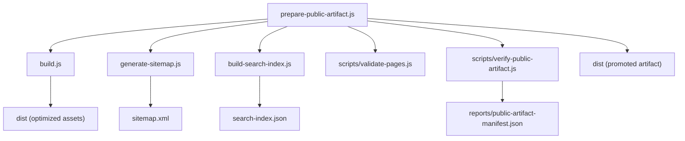
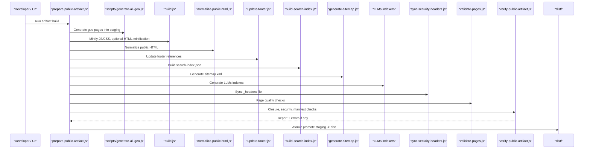
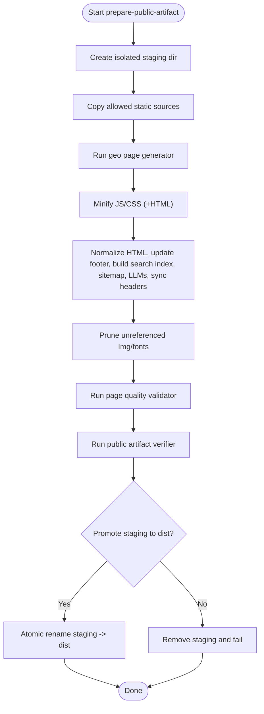
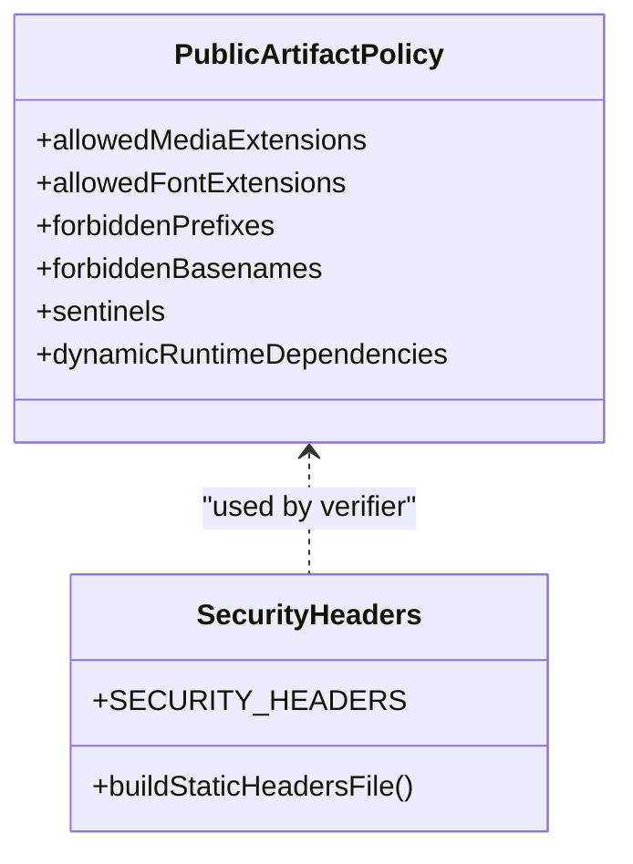
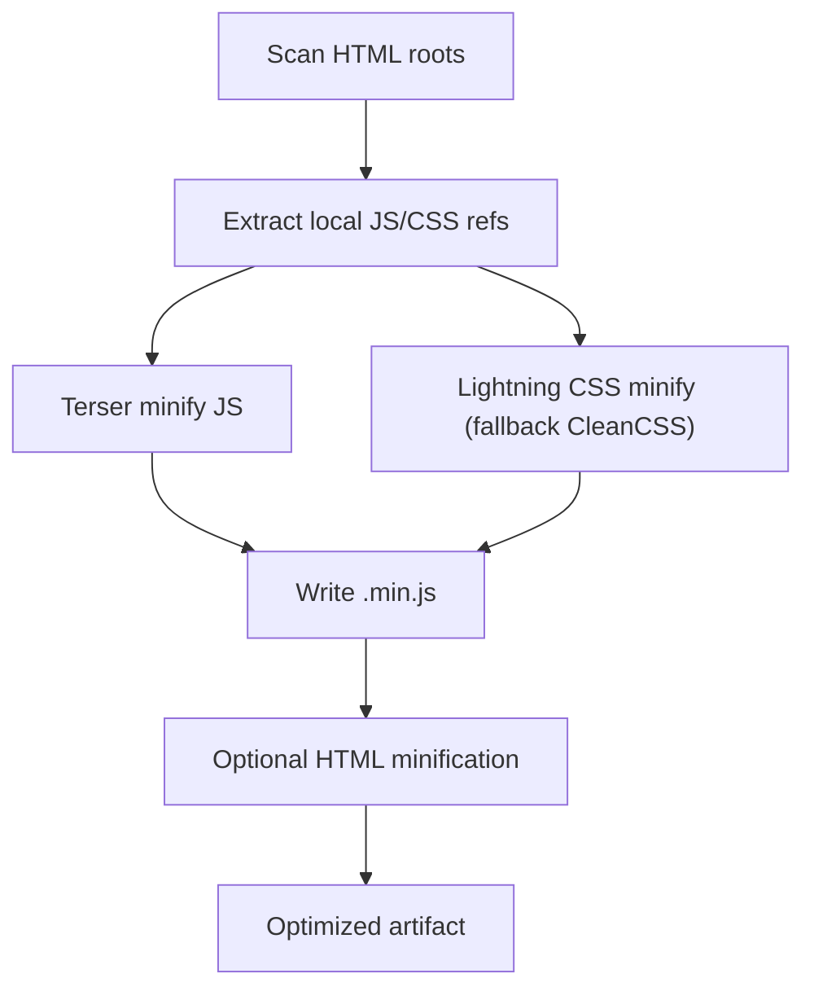
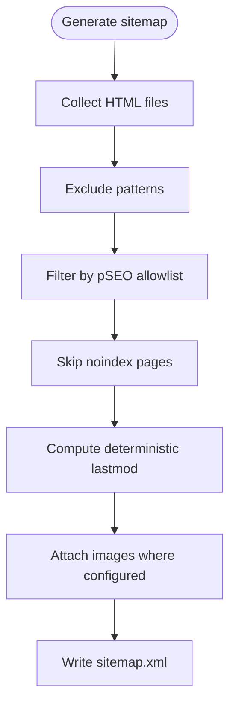
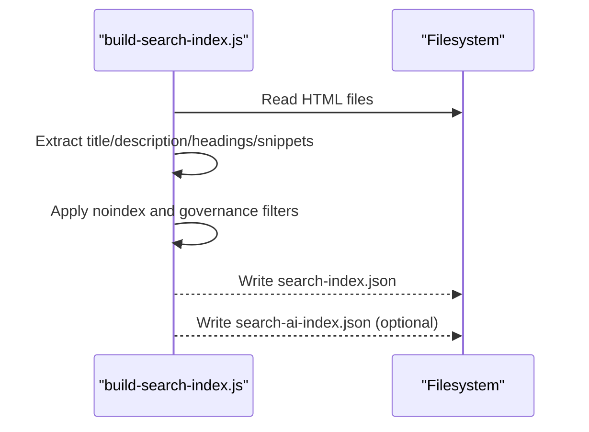
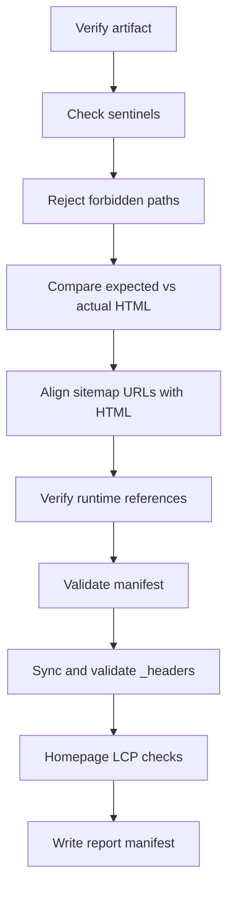
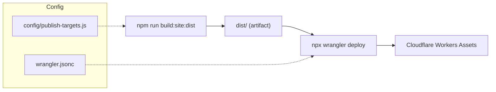
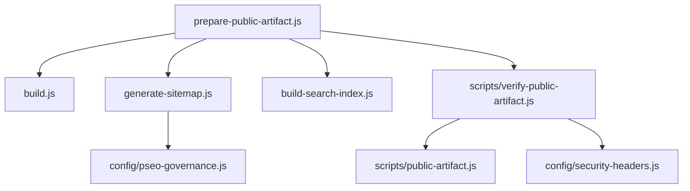

# Deployment Preparation & Artifact Generation

<cite>
**Referenced Files in This Document**
- [scripts/prepare-public-artifact.js](file://scripts/prepare-public-artifact.js)
- [scripts/public-artifact.js](file://scripts/public-artifact.js)
- [scripts/verify-public-artifact.js](file://scripts/verify-public-artifact.js)
- [generate-sitemap.js](file://generate-sitemap.js)
- [build.js](file://build.js)
- [build-search-index.js](file://build-search-index.js)
- [config/publish-targets.js](file://config/publish-targets.js)
- [config/security-headers.js](file://config/security-headers.js)
- [config/pseo-governance.js](file://config/pseo-governance.js)
- [wrangler.jsonc](file://wrangler.jsonc)
- [package.json](file://package.json)
</cite>

## Table of Contents
1. [Introduction](#introduction)
2. [Project Structure](#project-structure)
3. [Core Components](#core-components)
4. [Architecture Overview](#architecture-overview)
5. [Detailed Component Analysis](#detailed-component-analysis)
6. [Dependency Analysis](#dependency-analysis)
7. [Performance Considerations](#performance-considerations)
8. [Troubleshooting Guide](#troubleshooting-guide)
9. [Conclusion](#conclusion)
10. [Appendices](#appendices)

## Introduction
This document explains the deployment preparation and artifact generation system that produces optimized, validated static assets for production hosting. It covers:
- How public artifacts are assembled from sources and build outputs
- File organization, asset pruning, and cache-busting strategy
- Dynamic sitemap generation with indexation governance
- Search indexing for client-side search and AI retrieval
- Validation gates, rollback behavior, and monitoring hooks
- Environment-specific configuration and deployment workflows

The system is designed to be deterministic, auditable, and safe for automated CI/CD pipelines.

## Project Structure
At a high level, the pipeline orchestrates several Node scripts to materialize, optimize, validate, and publish a static site artifact. The key directories and files involved include:
- Build orchestration and optimization: `scripts/prepare-public-artifact.js`, `build.js`
- Sitemap and search index generation: `generate-sitemap.js`, `build-search-index.js`
- Public artifact policy and validation: `scripts/public-artifact.js`, `scripts/verify-public-artifact.js`
- Configuration: `config/publish-targets.js`, `config/security-headers.js`, `config/pseo-governance.js`
- Deployment target and runtime: `wrangler.jsonc`, `package.json`

**Diagram sources**
- [scripts/prepare-public-artifact.js:183-259](file://scripts/prepare-public-artifact.js#L183-L259)
- [build.js:373-496](file://build.js#L373-L496)
- [generate-sitemap.js:200-254](file://generate-sitemap.js#L200-L254)
- [build-search-index.js:292-325](file://build-search-index.js#L292-L325)
- [scripts/verify-public-artifact.js:235-393](file://scripts/verify-public-artifact.js#L235-L393)

**Section sources**
- [scripts/prepare-public-artifact.js:183-259](file://scripts/prepare-public-artifact.js#L183-L259)
- [package.json:6-58](file://package.json#L6-L58)

## Core Components
- Artifact assembly and promotion: prepares a staging directory, runs generators and builders, prunes unreferenced assets, validates, then atomically promotes to the publish directory.
- Static asset policy: defines allowed extensions, forbidden paths, sentinel files, and dynamic runtime dependencies.
- Build pipeline: minifies JS/CSS, optionally minifies HTML templates, and discovers referenced assets.
- Sitemap generator: scans published HTML, computes lastmod deterministically, applies indexation governance, and writes XML including image entries.
- Search indexer: builds public and private indexes from HTML content, respecting noindex directives.
- Validator: enforces closure, security headers synchronization, manifest integrity, and performance constraints.

**Section sources**
- [scripts/public-artifact.js:8-134](file://scripts/public-artifact.js#L8-L134)
- [build.js:31-113](file://build.js#L31-L113)
- [generate-sitemap.js:14-37](file://generate-sitemap.js#L14-L37)
- [build-search-index.js:20-34](file://build-search-index.js#L20-L34)
- [scripts/verify-public-artifact.js:235-393](file://scripts/verify-public-artifact.js#L235-L393)

## Architecture Overview
The artifact pipeline ensures a clean, reproducible build into an isolated staging directory, followed by strict validation and atomic promotion to the final publish directory.

**Diagram sources**
- [scripts/prepare-public-artifact.js:205-249](file://scripts/prepare-public-artifact.js#L205-L249)
- [build.js:373-496](file://build.js#L373-L496)
- [generate-sitemap.js:200-254](file://generate-sitemap.js#L200-L254)
- [build-search-index.js:292-325](file://build-search-index.js#L292-L325)
- [scripts/verify-public-artifact.js:235-393](file://scripts/verify-public-artifact.js#L235-L393)

## Detailed Component Analysis

### Artifact Assembly and Promotion
- Staging isolation: Uses a PID-scoped `.dist.__staging__-*` directory to avoid race conditions and ensure clean builds.
- Source materialization: Copies only allowed media, fonts, root HTML, technical files, and generated HTML; writes a dist-specific `.assetsignore`.
- Asset pruning: Analyzes text-based files for references to `Img/` and `fonts/`, removes unreferenced assets, and reports counts.
- Atomic promotion: Moves previous `dist/` to a temporary backup, renames staging to `dist/`, and cleans up on success or failure.

**Diagram sources**
- [scripts/prepare-public-artifact.js:183-259](file://scripts/prepare-public-artifact.js#L183-L259)
- [scripts/public-artifact.js:195-228](file://scripts/public-artifact.js#L195-L228)

**Section sources**
- [scripts/prepare-public-artifact.js:87-156](file://scripts/prepare-public-artifact.js#L87-L156)
- [scripts/prepare-public-artifact.js:158-181](file://scripts/prepare-public-artifact.js#L158-L181)
- [scripts/public-artifact.js:195-228](file://scripts/public-artifact.js#L195-L228)

### Static Asset Policy and Cache Strategy
- Allowed media and font extensions are explicitly enumerated to prevent accidental inclusion of non-web assets.
- Forbidden prefixes and basenames block sensitive or build-only files from being published.
- Sentinel files ensure critical resources exist in the artifact.
- Runtime dependency map declares dynamic loaders and their required assets.
- Security headers are synchronized to `_headers` and validated during verification.

**Diagram sources**
- [scripts/public-artifact.js:8-134](file://scripts/public-artifact.js#L8-L134)
- [config/security-headers.js:40-100](file://config/security-headers.js#L40-L100)

**Section sources**
- [scripts/public-artifact.js:8-134](file://scripts/public-artifact.js#L8-L134)
- [config/security-headers.js:40-100](file://config/security-headers.js#L40-L100)

### Build Pipeline (JS/CSS/HTML)
- Discovers HTML roots and extracts local JS/CSS references from `<script>` and `<link rel="stylesheet">`.
- Minifies JS via Terser with aggressive dead code elimination and console stripping.
- Minifies CSS using Lightning CSS with a CleanCSS fallback for compatibility.
- Optionally minifies HTML templates under `src/html/` while preserving SEO transforms.

**Diagram sources**
- [build.js:242-279](file://build.js#L242-L279)
- [build.js:290-371](file://build.js#L290-L371)
- [build.js:428-496](file://build.js#L428-L496)

**Section sources**
- [build.js:31-113](file://build.js#L31-L113)
- [build.js:242-279](file://build.js#L242-L279)
- [build.js:290-371](file://build.js#L290-L371)
- [build.js:428-496](file://build.js#L428-L496)

### Sitemap Generation System
- Scans all HTML files in the published artifact, excluding internal/build directories and specific legacy pages.
- Computes `lastmod` deterministically:
  - Uses a stored fingerprint per URL to avoid changing dates on unrelated rebuilds.
  - Falls back to git commit date or environment-provided epoch/date.
- Applies pSEO governance to filter out de-amplified or removed paths.
- Respects per-page `noindex` meta robots directives.
- Emits image sitemaps for selected portfolio case studies.

**Diagram sources**
- [generate-sitemap.js:63-80](file://generate-sitemap.js#L63-L80)
- [generate-sitemap.js:95-113](file://generate-sitemap.js#L95-L113)
- [generate-sitemap.js:117-179](file://generate-sitemap.js#L117-L179)
- [generate-sitemap.js:185-198](file://generate-sitemap.js#L185-L198)
- [generate-sitemap.js:200-254](file://generate-sitemap.js#L200-L254)
- [config/pseo-governance.js:279-287](file://config/pseo-governance.js#L279-L287)

**Section sources**
- [generate-sitemap.js:14-37](file://generate-sitemap.js#L14-L37)
- [generate-sitemap.js:63-80](file://generate-sitemap.js#L63-L80)
- [generate-sitemap.js:95-113](file://generate-sitemap.js#L95-L113)
- [generate-sitemap.js:117-179](file://generate-sitemap.js#L117-L179)
- [generate-sitemap.js:185-198](file://generate-sitemap.js#L185-L198)
- [generate-sitemap.js:200-254](file://generate-sitemap.js#L200-L254)
- [config/pseo-governance.js:279-287](file://config/pseo-governance.js#L279-L287)

### Search Index Generation
- Walks published HTML and extracts titles, descriptions, headings, and snippets.
- Builds two indexes:
  - Public index (`search-index.json`) for client-side search.
  - Private AI corpus (`search-ai-index.json`) for server-side retrieval (excluded when running with `--public-only`).
- Excludes pages marked `noindex` or governed by pSEO rules.

**Diagram sources**
- [build-search-index.js:202-233](file://build-search-index.js#L202-L233)
- [build-search-index.js:270-307](file://build-search-index.js#L270-L307)
- [build-search-index.js:309-325](file://build-search-index.js#L309-L325)

**Section sources**
- [build-search-index.js:20-34](file://build-search-index.js#L20-L34)
- [build-search-index.js:202-233](file://build-search-index.js#L202-L233)
- [build-search-index.js:270-307](file://build-search-index.js#L270-L307)
- [build-search-index.js:309-325](file://build-search-index.js#L309-L325)

### Validation and Quality Gates
- Enforces presence of sentinel files and absence of forbidden paths.
- Validates expected vs actual HTML sets.
- Ensures sitemap URLs match built HTML and excludes noindex pages.
- Verifies runtime closure for HTML/CSS/JS references and dynamic loader policies.
- Checks Web App Manifest integrity.
- Confirms `_headers` synchronization and CSP alignment.
- Validates homepage LCP image priority and prevents logo competition.

**Diagram sources**
- [scripts/verify-public-artifact.js:235-393](file://scripts/verify-public-artifact.js#L235-L393)

**Section sources**
- [scripts/verify-public-artifact.js:235-393](file://scripts/verify-public-artifact.js#L235-L393)

### Deployment Workflows and Environment Configuration
- Local and CI flows use npm scripts to build, validate, and deploy.
- Cloudflare Workers Assets serves the `dist/` directory with explicit `html_handling: none` to preserve `.html` URLs.
- Publish targets and report directories are configurable via CLI flags and environment variables.

**Diagram sources**
- [wrangler.jsonc:1-30](file://wrangler.jsonc#L1-L30)
- [config/publish-targets.js:11-27](file://config/publish-targets.js#L11-L27)
- [package.json:32-58](file://package.json#L32-L58)

**Section sources**
- [wrangler.jsonc:1-30](file://wrangler.jsonc#L1-L30)
- [config/publish-targets.js:11-27](file://config/publish-targets.js#L11-L27)
- [package.json:32-58](file://package.json#L32-L58)

## Dependency Analysis
- Orchestration: `prepare-public-artifact.js` depends on `build.js`, `generate-sitemap.js`, `build-search-index.js`, and various scripts for normalization, footer updates, header sync, and validation.
- Policies: `scripts/public-artifact.js` centralizes allowed extensions, forbidden paths, and sentinel expectations used by both assembly and verification.
- Governance: `config/pseo-governance.js` controls which GEO paths are indexable and included in the sitemap.
- Security: `config/security-headers.js` generates `_headers` and CSP directives validated by the verifier.

**Diagram sources**
- [scripts/prepare-public-artifact.js:205-249](file://scripts/prepare-public-artifact.js#L205-L249)
- [scripts/verify-public-artifact.js:235-393](file://scripts/verify-public-artifact.js#L235-L393)
- [generate-sitemap.js:200-254](file://generate-sitemap.js#L200-L254)
- [config/pseo-governance.js:279-287](file://config/pseo-governance.js#L279-L287)
- [config/security-headers.js:40-100](file://config/security-headers.js#L40-L100)

**Section sources**
- [scripts/prepare-public-artifact.js:205-249](file://scripts/prepare-public-artifact.js#L205-L249)
- [scripts/verify-public-artifact.js:235-393](file://scripts/verify-public-artifact.js#L235-L393)
- [generate-sitemap.js:200-254](file://generate-sitemap.js#L200-L254)
- [config/pseo-governance.js:279-287](file://config/pseo-governance.js#L279-L287)
- [config/security-headers.js:40-100](file://config/security-headers.js#L40-L100)

## Performance Considerations
- Deterministic lastmod avoids unnecessary crawl churn by tracking substantive content changes only.
- Asset pruning reduces payload size by removing unreferenced media and fonts.
- Minification strategies remove dead code, unused styles, and comments to reduce transfer sizes.
- Stable caching via `_headers` enables efficient CDN caching without immutable tags on stable paths.

[No sources needed since this section provides general guidance]

## Troubleshooting Guide
Common issues and resolutions:
- Missing sentinel files: Ensure required files like `index.html`, `robots.txt`, and minified assets are present.
- Forbidden paths detected: Remove sensitive or build-only files from the artifact root.
- Sitemap mismatch: Confirm that every URL in `sitemap.xml` has a corresponding HTML file and is not marked `noindex`.
- Runtime reference missing: Add missing JS/CSS/media referenced by HTML or other assets.
- `_headers` out of sync: Re-run header synchronization script to regenerate `_headers`.
- Homepage LCP issue: Ensure the hero image retains high fetch priority and the logo does not compete.

**Section sources**
- [scripts/verify-public-artifact.js:235-393](file://scripts/verify-public-artifact.js#L235-L393)
- [config/security-headers.js:40-100](file://config/security-headers.js#L40-L100)

## Conclusion
The artifact generation system delivers a secure, optimized, and validated static site suitable for production hosting. It combines deterministic builds, strict asset policies, comprehensive validation, and robust sitemap generation aligned with indexation governance. With atomic promotions and clear reporting, it supports reliable CI/CD deployments and easy rollbacks.

[No sources needed since this section summarizes without analyzing specific files]

## Appendices

### Example Artifact Structure
A typical `dist/` artifact includes:
- Root HTML pages (e.g., `index.html`, service hubs, legal pages)
- Minified assets (`css/*.min.css`, `js/*.min.js`)
- Media and fonts (`Img/*`, `fonts/*`)
- Technical files (`robots.txt`, `manifest.json`, `_headers`, `_redirects`)
- Generated outputs (`sitemap.xml`, `search-index.json`, LLMs indexes)

[No sources needed since this section describes conceptual structure]

### Deployment Workflow Summary
- Build: `npm run build:site:dist`
- Validate: `npm run verify:artifact`
- Deploy: `npm run deploy:site` (uses Wrangler to publish `dist/`)

**Section sources**
- [package.json:32-58](file://package.json#L32-L58)
- [wrangler.jsonc:1-30](file://wrangler.jsonc#L1-L30)