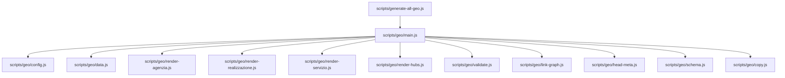
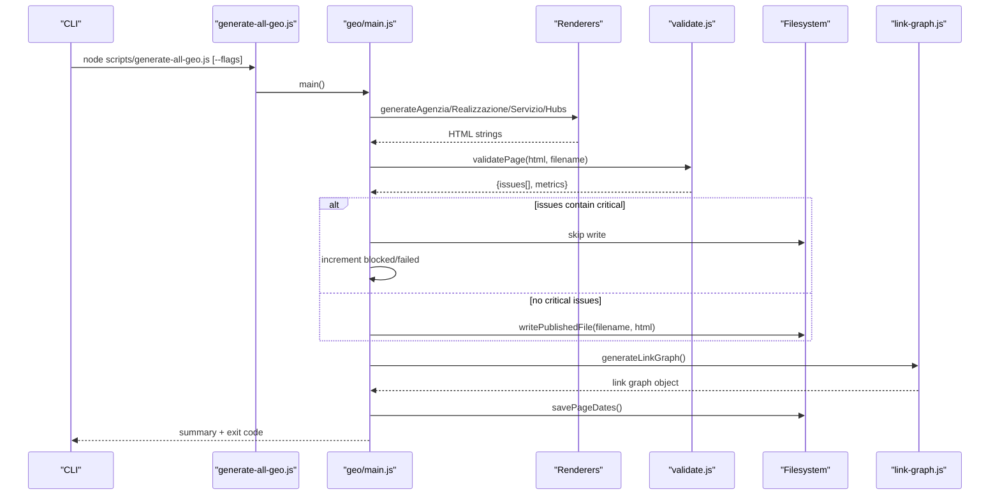
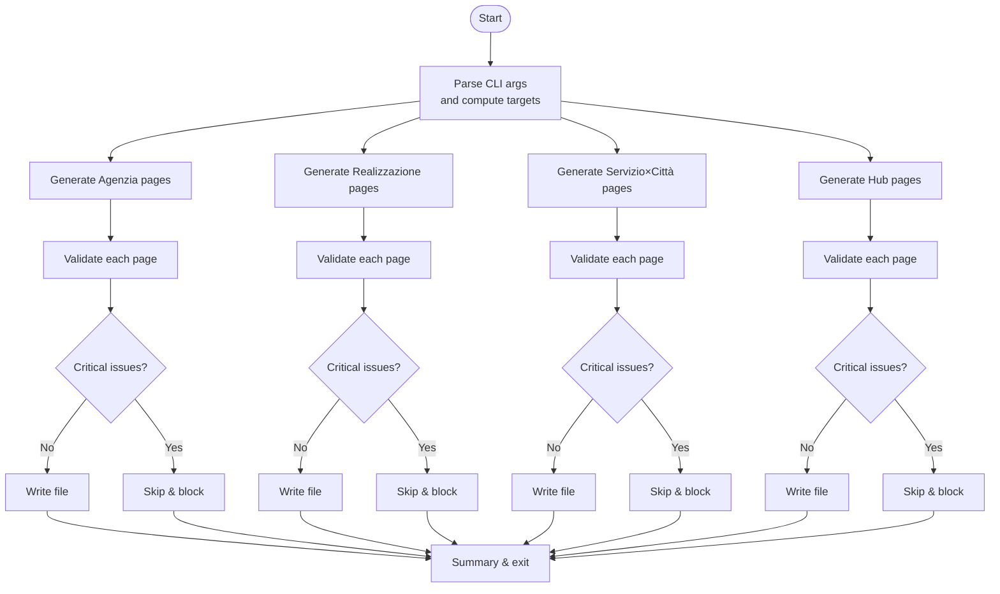
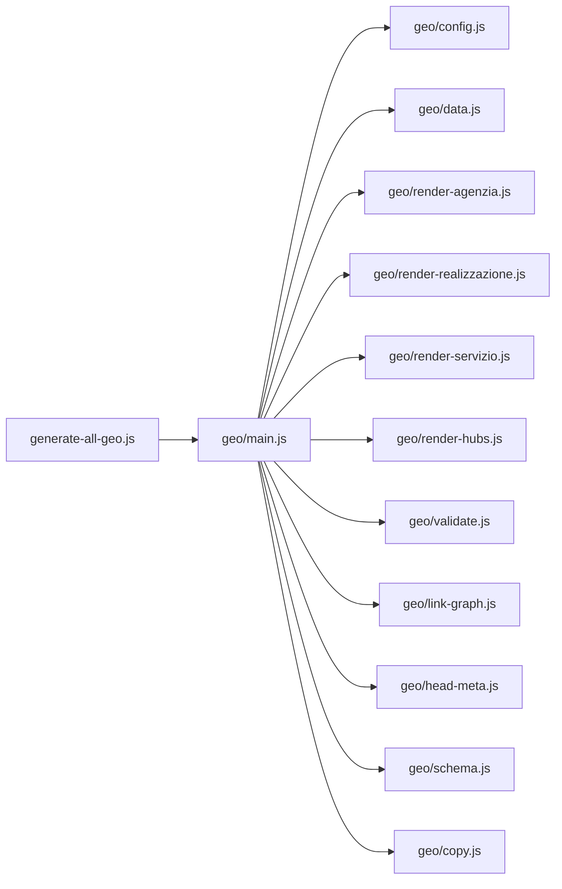

# Content Generation Workflow

<cite>
**Referenced Files in This Document**
- [scripts/generate-all-geo.js](file://scripts/generate-all-geo.js)
- [scripts/geo/main.js](file://scripts/geo/main.js)
- [scripts/geo/config.js](file://scripts/geo/config.js)
- [scripts/geo/data.js](file://scripts/geo/data.js)
- [scripts/geo/render-agenzia.js](file://scripts/geo/render-agenzia.js)
- [scripts/geo/render-realizzazione.js](file://scripts/geo/render-realizzazione.js)
- [scripts/geo/render-servizio.js](file://scripts/geo/render-servizio.js)
- [scripts/geo/render-hubs.js](file://scripts/geo/render-hubs.js)
- [scripts/geo/copy.js](file://scripts/geo/copy.js)
- [scripts/geo/validate.js](file://scripts/geo/validate.js)
- [scripts/geo/link-graph.js](file://scripts/geo/link-graph.js)
- [scripts/geo/head-meta.js](file://scripts/geo/head-meta.js)
- [scripts/geo/schema.js](file://scripts/geo/schema.js)
- [package.json](file://package.json)
</cite>

## Table of Contents
1. [Introduction](#introduction)
2. [Project Structure](#project-structure)
3. [Core Components](#core-components)
4. [Architecture Overview](#architecture-overview)
5. [Detailed Component Analysis](#detailed-component-analysis)
6. [Dependency Analysis](#dependency-analysis)
7. [Performance Considerations](#performance-considerations)
8. [Troubleshooting Guide](#troubleshooting-guide)
9. [Conclusion](#conclusion)
10. [Appendices](#appendices)

## Introduction
This document explains the complete content generation workflow that builds geo pages for WebNovis, from data processing to final HTML output. It covers the build pipeline orchestrating three page families (Agenzia Web per città, Realizzazione Siti Web per città, and Servizio×Città), hub pages, internal linking, validation, SEO copy generation, and JSON-LD schema injection. It also provides command-line usage patterns, error handling behavior, and troubleshooting guidance.

## Project Structure
The geo generator is implemented under scripts/geo with a clear separation of concerns:
- Orchestration and CLI entrypoint
- Configuration and flags
- Data loading and Nunjucks environment setup
- Page renderers for each page family
- Copy builders for SEO text
- Validation rules
- Internal link graph builder
- Head meta normalization and base page assembly
- Schema generation utilities

**Diagram sources**
- [scripts/generate-all-geo.js:1-58](file://scripts/generate-all-geo.js#L1-L58)
- [scripts/geo/main.js:1-292](file://scripts/geo/main.js#L1-L292)
- [scripts/geo/config.js:1-114](file://scripts/geo/config.js#L1-L114)
- [scripts/geo/data.js:1-197](file://scripts/geo/data.js#L1-L197)
- [scripts/geo/render-agenzia.js:1-194](file://scripts/geo/render-agenzia.js#L1-L194)
- [scripts/geo/render-realizzazione.js:1-241](file://scripts/geo/render-realizzazione.js#L1-L241)
- [scripts/geo/render-servizio.js:1-289](file://scripts/geo/render-servizio.js#L1-L289)
- [scripts/geo/render-hubs.js:1-296](file://scripts/geo/render-hubs.js#L1-L296)
- [scripts/geo/validate.js:1-55](file://scripts/geo/validate.js#L1-L55)
- [scripts/geo/link-graph.js:1-96](file://scripts/geo/link-graph.js#L1-L96)
- [scripts/geo/head-meta.js:1-156](file://scripts/geo/head-meta.js#L1-L156)
- [scripts/geo/schema.js:1-199](file://scripts/geo/schema.js#L1-L199)
- [scripts/geo/copy.js:1-800](file://scripts/geo/copy.js#L1-L800)

**Section sources**
- [scripts/generate-all-geo.js:1-58](file://scripts/generate-all-geo.js#L1-L58)
- [scripts/geo/main.js:1-292](file://scripts/geo/main.js#L1-L292)

## Core Components
- Entrypoint and CLI: scripts/generate-all-geo.js re-exports key symbols and delegates to main().
- Orchestration: scripts/geo/main.js drives the full pipeline: generate agenzia, realizzazione, servizio×città, hubs; validate; write files; build link graph; persist dates.
- Configuration: scripts/geo/config.js centralizes paths, site constants, CLI flags, indexability helpers, and robots directives.
- Data layer: scripts/geo/data.js loads cities/services JSON, approved content blocks, blog index, and configures Nunjucks.
- Renderers:
  - Agenzia: scripts/geo/render-agenzia.js (Nunjucks + base page).
  - Realizzazione: scripts/geo/render-realizzazione.js (regex-based base template).
  - Servizio×Città: scripts/geo/render-servizio.js (Nunjucks).
  - Hubs: scripts/geo/render-hubs.js (three hub pages).
- Copy system: scripts/geo/copy.js generates localized SEO copy per service/city.
- Validation: scripts/geo/validate.js enforces word count, links, schemas, canonical/H1, answer capsule, and unsupported claims.
- Link graph: scripts/geo/link-graph.js extracts internal links and produces data/link-graph.json.
- Head/meta: scripts/geo/head-meta.js normalizes head, canonical, robots, hreflang, and FAQ schema.
- Schema: scripts/geo/schema.js emits BreadcrumbList, WebPage, Service, OfferCatalog, and FAQPage JSON-LD.

**Section sources**
- [scripts/generate-all-geo.js:1-58](file://scripts/generate-all-geo.js#L1-L58)
- [scripts/geo/main.js:1-292](file://scripts/geo/main.js#L1-L292)
- [scripts/geo/config.js:1-114](file://scripts/geo/config.js#L1-L114)
- [scripts/geo/data.js:1-197](file://scripts/geo/data.js#L1-L197)
- [scripts/geo/render-agenzia.js:1-194](file://scripts/geo/render-agenzia.js#L1-L194)
- [scripts/geo/render-realizzazione.js:1-241](file://scripts/geo/render-realizzazione.js#L1-L241)
- [scripts/geo/render-servizio.js:1-289](file://scripts/geo/render-servizio.js#L1-L289)
- [scripts/geo/render-hubs.js:1-296](file://scripts/geo/render-hubs.js#L1-L296)
- [scripts/geo/copy.js:1-800](file://scripts/geo/copy.js#L1-L800)
- [scripts/geo/validate.js:1-55](file://scripts/geo/validate.js#L1-L55)
- [scripts/geo/link-graph.js:1-96](file://scripts/geo/link-graph.js#L1-L96)
- [scripts/geo/head-meta.js:1-156](file://scripts/geo/head-meta.js#L1-L156)
- [scripts/geo/schema.js:1-199](file://scripts/geo/schema.js#L1-L199)

## Architecture Overview
The pipeline follows a fail-closed strategy: any critical validation issue prevents file writing and marks the run as failed. The flow includes:
- Parse CLI flags and compute targets
- Generate pages per type
- Validate each page
- Write outputs only if valid
- Build link graph and persist editorial dates

**Diagram sources**
- [scripts/generate-all-geo.js:1-58](file://scripts/generate-all-geo.js#L1-L58)
- [scripts/geo/main.js:1-292](file://scripts/geo/main.js#L1-L292)
- [scripts/geo/validate.js:1-55](file://scripts/geo/validate.js#L1-L55)
- [scripts/geo/link-graph.js:1-96](file://scripts/geo/link-graph.js#L1-L96)

## Detailed Component Analysis

### Orchestration and CLI
- Entry point re-exports core functions and invokes main().
- main() computes expected counts by type, iterates cities/services, renders pages, validates, writes files, and aggregates results.
- Supports --dry-run, --validate-only, --type, --out-dir, --report-dir, --city, --service filters.

**Diagram sources**
- [scripts/geo/main.js:1-292](file://scripts/geo/main.js#L1-L292)
- [scripts/geo/config.js:1-114](file://scripts/geo/config.js#L1-L114)

**Section sources**
- [scripts/generate-all-geo.js:1-58](file://scripts/generate-all-geo.js#L1-L58)
- [scripts/geo/main.js:1-292](file://scripts/geo/main.js#L1-L292)
- [scripts/geo/config.js:1-114](file://scripts/geo/config.js#L1-L114)

### Data Layer and Nunjucks
- Loads cities.json, services.json, approved content blocks, and optional search-index.json for cross-linking.
- Configures Nunjucks with custom filters and exposes helper methods for prices, city avatars, and blog link selection.

**Section sources**
- [scripts/geo/data.js:1-197](file://scripts/geo/data.js#L1-L197)

### Agenzia Page Renderer
- Uses Nunjucks template and a hand-crafted base page for Rho.
- Builds template data including nearest cities, related pages, blog links, tier classification, and AI-enriched content blocks.
- Injects head meta, nav/footer, schemas, and tail assets.

**Section sources**
- [scripts/geo/render-agenzia.js:1-194](file://scripts/geo/render-agenzia.js#L1-L194)
- [scripts/geo/head-meta.js:1-156](file://scripts/geo/head-meta.js#L1-L156)
- [scripts/geo/schema.js:1-199](file://scripts/geo/schema.js#L1-L199)

### Realizzazione Page Renderer
- Regex-based templating over a base source page.
- Performs targeted replacements for city-specific text, images, breadcrumbs, and LocalBusiness schema fields.
- Inserts editorial Tier 1 sections, geo links, FAQs, and schemas.

**Section sources**
- [scripts/geo/render-realizzazione.js:1-241](file://scripts/geo/render-realizzazione.js#L1-L241)
- [scripts/geo/link-graph.js:1-96](file://scripts/geo/link-graph.js#L1-L96)
- [scripts/geo/schema.js:1-199](file://scripts/geo/schema.js#L1-L199)

### Servizio×Città Page Renderer
- Generates combinatorial matrix pages per service and city using Nunjucks.
- Selects FAQ pools based on service clusters to avoid duplication.
- Produces rich internal linking to other services in the same city and nearby cities.

**Section sources**
- [scripts/geo/render-servizio.js:1-289](file://scripts/geo/render-servizio.js#L1-L289)
- [scripts/geo/copy.js:1-800](file://scripts/geo/copy.js#L1-L800)
- [scripts/geo/schema.js:1-199](file://scripts/geo/schema.js#L1-L199)

### Hub Pages Generator
- Creates three hub pages: Agenzia Web, Realizzazione Siti Web, Zone Servite.
- Renders templates, injects CSS, updates relative paths for subdirectory serving, and attaches BreadcrumbList and CollectionPage schemas.

**Section sources**
- [scripts/geo/render-hubs.js:1-296](file://scripts/geo/render-hubs.js#L1-L296)
- [scripts/geo/schema.js:1-199](file://scripts/geo/schema.js#L1-L199)

### Copy Generation System
- Provides localized SEO copy for each service and city, including titles, descriptions, hero tags, process steps, CTAs, and schema descriptions.
- Specialized overrides exist for specific service clusters (e.g., landing-page, ecommerce, seo-locale).

**Section sources**
- [scripts/geo/copy.js:1-800](file://scripts/geo/copy.js#L1-L800)

### Validation System
- Enforces minimum word count, internal link density, JSON-LD schema presence, canonical tag, H1, answer capsule class, and unsupported claims detection.
- Critical issues block file writing and increment failure counters.

**Section sources**
- [scripts/geo/validate.js:1-55](file://scripts/geo/validate.js#L1-L55)

### Internal Linking System
- Builds geo-links sections for near cities and local context paragraphs.
- Scans published HTML to extract internal links and constructs a link graph saved to data/link-graph.json.

**Section sources**
- [scripts/geo/link-graph.js:1-96](file://scripts/geo/link-graph.js#L1-L96)

### Head Meta and Base Page Assembly
- Normalizes head content, canonical, robots, hreflang, and FAQ schema.
- Ensures consistent meta across generated pages and handles hand-crafted base page adjustments.

**Section sources**
- [scripts/geo/head-meta.js:1-156](file://scripts/geo/head-meta.js#L1-L156)

### Schema Generation
- Emits BreadcrumbList, WebPage, Service, OfferCatalog, and FAQPage JSON-LD.
- Includes area served entities, provider references, and offers with price currency.

**Section sources**
- [scripts/geo/schema.js:1-199](file://scripts/geo/schema.js#L1-L199)

## Dependency Analysis
The following diagram shows how modules depend on each other during generation.

**Diagram sources**
- [scripts/generate-all-geo.js:1-58](file://scripts/generate-all-geo.js#L1-L58)
- [scripts/geo/main.js:1-292](file://scripts/geo/main.js#L1-L292)
- [scripts/geo/config.js:1-114](file://scripts/geo/config.js#L1-L114)
- [scripts/geo/data.js:1-197](file://scripts/geo/data.js#L1-L197)
- [scripts/geo/render-agenzia.js:1-194](file://scripts/geo/render-agenzia.js#L1-L194)
- [scripts/geo/render-realizzazione.js:1-241](file://scripts/geo/render-realizzazione.js#L1-L241)
- [scripts/geo/render-servizio.js:1-289](file://scripts/geo/render-servizio.js#L1-L289)
- [scripts/geo/render-hubs.js:1-296](file://scripts/geo/render-hubs.js#L1-L296)
- [scripts/geo/validate.js:1-55](file://scripts/geo/validate.js#L1-L55)
- [scripts/geo/link-graph.js:1-96](file://scripts/geo/link-graph.js#L1-L96)
- [scripts/geo/head-meta.js:1-156](file://scripts/geo/head-meta.js#L1-L156)
- [scripts/geo/schema.js:1-199](file://scripts/geo/schema.js#L1-L199)
- [scripts/geo/copy.js:1-800](file://scripts/geo/copy.js#L1-L800)

**Section sources**
- [scripts/geo/main.js:1-292](file://scripts/geo/main.js#L1-L292)

## Performance Considerations
- Template rendering uses Nunjucks with trimmed blocks and autoescape disabled for performance and control.
- Regex-based replacement for realizzazione avoids heavy parsing overhead.
- Link graph generation reads only published files once at the end of the run.
- Content blocks are loaded once and reused across renderers.
- Avoid unnecessary file writes by supporting --dry-run and --validate-only modes.

[No sources needed since this section provides general guidance]

## Troubleshooting Guide
Common issues and resolutions:
- Missing base pages: Ensure base templates exist (agenzia-web-source.html, realizzazione-siti-web-source.html).
- Validation failures: Check word count, internal links, canonical/H1 presence, answer capsule class, and unsupported claims.
- Blocked pages: Critical validation issues prevent writing; review warnings and fix content or structure.
- Link graph errors: Published files must exist before building the link graph; ensure prior generation step succeeded.
- Date persistence: Dates are saved after successful writes; partial failures do not corrupt date indices.

**Section sources**
- [scripts/geo/validate.js:1-55](file://scripts/geo/validate.js#L1-L55)
- [scripts/geo/main.js:1-292](file://scripts/geo/main.js#L1-L292)
- [scripts/geo/link-graph.js:1-96](file://scripts/geo/link-graph.js#L1-L96)

## Conclusion
The geo content generation pipeline is modular, deterministic, and fail-closed. It combines centralized data, templating engines, robust validation, and structured internal linking to produce SEO-optimized geo pages and hubs. By leveraging CLI flags and strict validation, it ensures quality and consistency across all generated outputs.

[No sources needed since this section summarizes without analyzing specific files]

## Appendices

### Command-Line Usage Examples
- Generate all types:
  - npm run build:geo
- Dry run (no files written):
  - npm run build:geo:dry
- Validate only (no files written):
  - npm run build:geo:validate
- Target specific cities or services:
  - node scripts/generate-all-geo.js --city=arese,bollate
  - node scripts/generate-all-geo.js --service=seo-locale,social-media
- Change output directory:
  - npm run build:geo:dist
  - node scripts/generate-all-geo.js --out-dir=dist

**Section sources**
- [package.json:1-92](file://package.json#L1-L92)
- [scripts/geo/config.js:1-114](file://scripts/geo/config.js#L1-L114)
- [scripts/generate-all-geo.js:1-58](file://scripts/generate-all-geo.js#L1-L58)