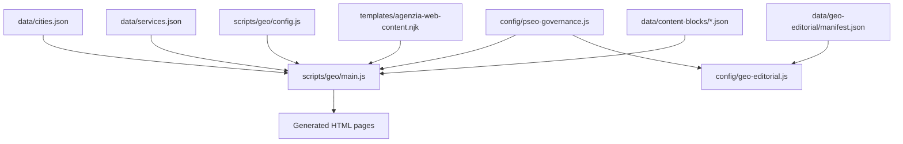
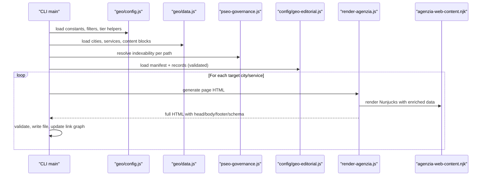
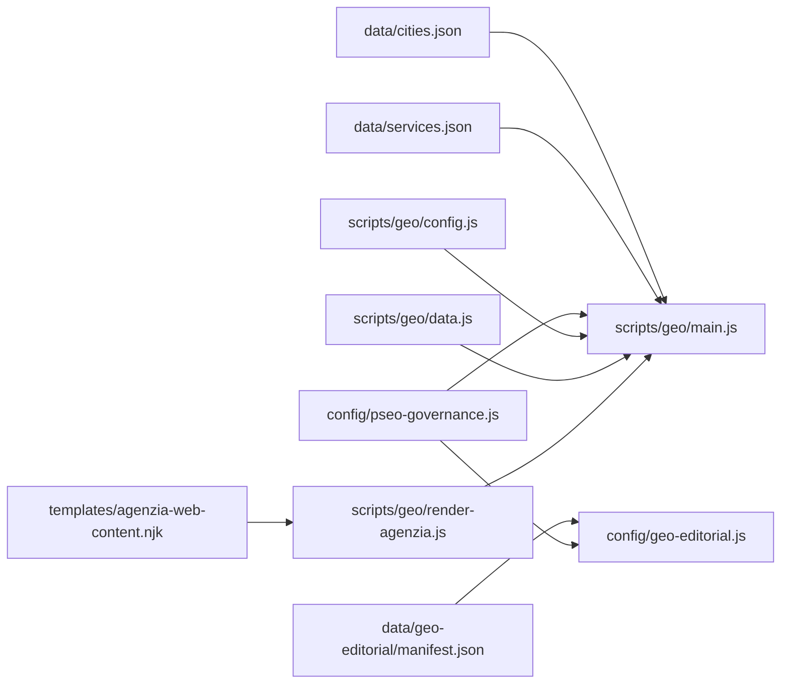

# Geo Data Structure & Configuration

<cite>
**Referenced Files in This Document**
- [cities.json](file://data/cities.json)
- [services.json](file://data/services.json)
- [manifest.json](file://data/geo-editorial/manifest.json)
- [agency.json](file://data/geo-editorial/agency.json)
- [geo-editorial.js](file://config/geo-editorial.js)
- [pseo-governance.js](file://config/pseo-governance.js)
- [geo/config.js](file://scripts/geo/config.js)
- [geo/main.js](file://scripts/geo/main.js)
- [geo/data.js](file://scripts/geo/data.js)
- [render-agenzia.js](file://scripts/geo/render-agenzia.js)
- [agenzia-web-content.njk](file://templates/agenzia-web-content.njk)
- [milano.json](file://data/content-blocks/milano.json)
</cite>

## Table of Contents
1. [Introduction](#introduction)
2. [Project Structure](#project-structure)
3. [Core Components](#core-components)
4. [Architecture Overview](#architecture-overview)
5. [Detailed Component Analysis](#detailed-component-analysis)
6. [Dependency Analysis](#dependency-analysis)
7. [Performance Considerations](#performance-considerations)
8. [Troubleshooting Guide](#troubleshooting-guide)
9. [Conclusion](#conclusion)
10. [Appendices](#appendices)

## Introduction
This document explains the geo-targeted data structure and configuration system used to generate localized service pages across cities. It covers:
- The city data model and how locations are defined, related, and enriched with local context.
- The services catalog and how services are classified for geo generation.
- The editorial content organization and manifest that coordinates geo-page generation.
- Validation rules, localization support, and extension points for adding new locations or services.
- Examples of city configurations, service hierarchies, and content block structures.

The system is designed to be fail-closed: invalid or inconsistent data prevents generation, ensuring only governed, indexable pages are published.

## Project Structure
Geo page generation relies on a small set of core data files, a governance allowlist, an editorial manifest, and a Node-based generator pipeline.

**Diagram sources**
- [geo/main.js:1-292](file://scripts/geo/main.js#L1-L292)
- [geo/config.js:1-114](file://scripts/geo/config.js#L1-L114)
- [geo/data.js:1-197](file://scripts/geo/data.js#L1-L197)
- [pseo-governance.js:1-200](file://config/pseo-governance.js#L1-L200)
- [geo-editorial.js:1-527](file://config/geo-editorial.js#L1-L527)
- [agenzia-web-content.njk:1-200](file://templates/agenzia-web-content.njk#L1-L200)

**Section sources**
- [geo/main.js:1-292](file://scripts/geo/main.js#L1-L292)
- [geo/config.js:1-114](file://scripts/geo/config.js#L1-L114)
- [geo/data.js:1-197](file://scripts/geo/data.js#L1-L197)
- [pseo-governance.js:1-200](file://config/pseo-governance.js#L1-L200)
- [geo-editorial.js:1-527](file://config/geo-editorial.js#L1-L527)
- [agenzia-web-content.njk:1-200](file://templates/agenzia-web-content.njk#L1-L200)

## Core Components
- City model: defines location identity, geography, relationships, and local context.
- Services catalog: defines service offerings, pricing, tiers, and whether they participate in geo generation.
- Editorial manifest: indexes hand-authored content clusters, enforces integrity via hashes, and maps paths to tiers.
- Governance allowlist: controls which generated paths are indexable (Tier 1, Tier 2, data-validated).
- Generator pipeline: orchestrates rendering of agenzia, realizzazione, servizio×città, and hub pages with validation and publishing.

**Section sources**
- [cities.json:1-800](file://data/cities.json#L1-L800)
- [services.json:1-307](file://data/services.json#L1-L307)
- [manifest.json:1-451](file://data/geo-editorial/manifest.json#L1-L451)
- [pseo-governance.js:1-200](file://config/pseo-governance.js#L1-L200)
- [geo/main.js:1-292](file://scripts/geo/main.js#L1-L292)

## Architecture Overview
The geo generator composes data from multiple sources and renders structured pages with strict validation.

**Diagram sources**
- [geo/main.js:1-292](file://scripts/geo/main.js#L1-L292)
- [geo/config.js:1-114](file://scripts/geo/config.js#L1-L114)
- [geo/data.js:1-197](file://scripts/geo/data.js#L1-L197)
- [pseo-governance.js:1-200](file://config/pseo-governance.js#L1-L200)
- [geo-editorial.js:1-527](file://config/geo-editorial.js#L1-L527)
- [render-agenzia.js:1-194](file://scripts/geo/render-agenzia.js#L1-L194)
- [agenzia-web-content.njk:1-200](file://templates/agenzia-web-content.njk#L1-L200)

## Detailed Component Analysis

### City Data Model
Cities are defined centrally and drive both content and linking. Each city includes:
- Identity: slug, name, CAP, province, coordinates, population, Wikipedia link.
- Generation flags: which page types to generate (e.g., agenzia, realizzazione).
- Relationships: nearCities array for internal linking and proximity signals.
- Local context: highlights, economic fabric description, key sectors, digital opportunity narrative.
- Images and FAQs: per-city assets and service-specific FAQ sets.

Example fields and behaviors:
- Distance to headquarters and whether it is the headquarters influence copy and schema.
- nearCities drives “area served” sections and cross-links to other geo pages.
- localContext feeds section text and market analysis; optional AI-generated blocks can augment content.

Validation and governance:
- Only cities present in the central dataset are recognized by path derivation.
- Headquarters must be exactly one city (Rho), enforced during editorial validation.

**Section sources**
- [cities.json:1-800](file://data/cities.json#L1-L800)
- [geo-editorial.js:183-213](file://config/geo-editorial.js#L183-L213)
- [geo-editorial.js:215-312](file://config/geo-editorial.js#L215-L312)

### Services Catalog
Services define what is offered, priced, and eligible for geo generation. Key fields:
- slug, name, shortName, schemaType, url, hasPage, tier, priceFrom, priceCurrency, timeEstimate.
- Description, shortDesc, targetKeyword, idealFor.
- Flags controlling geo participation: skipGeoGeneration, generateGeoPages, canonicalServiceSlug.

Behavior:
- Core services are always shown in geo pages; extended services appear where appropriate.
- shouldGenerateGeoForService determines eligibility; deprecated clusters can opt out explicitly.
- Prices are normalized and validated against editorial copy to prevent uncatalogued claims.

Examples:
- Sito Vetrina, E-Commerce Custom, Landing Page, Graphic Design, Social Media Marketing, Accessibilità Web EAA, SEO Locale, etc.

**Section sources**
- [services.json:1-307](file://data/services.json#L1-L307)
- [geo/data.js:15-60](file://scripts/geo/data.js#L15-L60)
- [geo-editorial.js:97-118](file://config/geo-editorial.js#L97-L118)

### Editorial Content Organization and Manifest
Hand-authored content is organized into clusters (e.g., agency, realizzazione, ecommerce, seo-locale, other-services) and indexed by a manifest.

Manifest responsibilities:
- Declares schemaVersion, editorialVersion, editorialDate, totalRecords, files, recordIndex.
- Each file entry includes cluster, file, recordCount, sourceArtifact, sourceSha256, contentSha256.
- recordIndex maps each generated path to a unique record_id and tier.

Validation rules:
- Exact field sets enforced for manifest, file entries, and record index.
- SHA-256 integrity checks ensure content matches declared artifacts.
- Path patterns, canonicalization, and governance tier alignment are enforced.
- Duplicate paths, IDs, and mismatches between manifest and governance tiers cause failures.

Record structure:
- path, city, service, title, description, h1, answer_capsule, intro, sections[], faqs[], cta.
- Sections and FAQs have strict length and content constraints.
- Visible text is scanned for unsupported claims and prices not found in the services catalogue.

**Section sources**
- [manifest.json:1-451](file://data/geo-editorial/manifest.json#L1-L451)
- [agency.json:1-200](file://data/geo-editorial/agency.json#L1-L200)
- [geo-editorial.js:18-95](file://config/geo-editorial.js#L18-L95)
- [geo-editorial.js:215-312](file://config/geo-editorial.js#L215-L312)
- [geo-editorial.js:314-399](file://config/geo-editorial.js#L314-L399)
- [geo-editorial.js:407-459](file://config/geo-editorial.js#L407-L459)

### Governance Allowlist and Indexation Control
Only specific generated paths are allowed to be indexed. Paths are grouped into tiers:
- Tier 1: high-priority pages with unique-by-hand content.
- Tier 2: commercial support pages for long-tail and cross-linking.
- Data-validated: re-opened based on observed search signals and sufficient content.

Governance functions:
- Determine if a path is indexable, tiered, or de-amplified.
- Provide robots directives and sitemap inclusion decisions.
- Maintain explicit de-amplification lists and removed paths.

**Section sources**
- [pseo-governance.js:1-200](file://config/pseo-governance.js#L1-L200)
- [geo/config.js:62-78](file://scripts/geo/config.js#L62-L78)

### Generator Pipeline and Rendering
The generator orchestrates three primary page types plus hubs:
- Agenzia pages: per-city landing for web agency services.
- Realizzazione pages: per-city landing for website development.
- Servizio×Città pages: combinatorial matrix of services × cities.
- Hub pages: internal linking bridges.

Flow:
- Load configuration, cities, services, content blocks, and editorial corpus.
- Filter targets by CLI args (city, service, type).
- Generate HTML using Nunjucks templates and enrich with editorial overrides and schemas.
- Validate output, write files, and persist dates and link graphs.

Templates:
- agenzia-web-content.njk defines hero, sections, services grid, area served, comparison table, process steps, and CTAs.
- Tier 1 pages can include hand-crafted editorial blocks when available.

**Section sources**
- [geo/main.js:1-292](file://scripts/geo/main.js#L1-L292)
- [render-agenzia.js:1-194](file://scripts/geo/render-agenzia.js#L1-L194)
- [agenzia-web-content.njk:1-200](file://templates/agenzia-web-content.njk#L1-L200)

### Content Blocks and Localization
City-specific content blocks provide AI-assisted market analysis and competitive context. They are approved before use and can augment default local context.

Key aspects:
- Approved blocks are loaded from data/content-blocks and merged into page data.
- For Tier 1 pages, optional hand-crafted blocks can override sections.
- Localization uses Italian locale formatting for numbers and currency.

Example:
- milano.json contains local market analysis, competitive context, FAQs, and unique data points.

**Section sources**
- [geo/data.js:91-98](file://scripts/geo/data.js#L91-L98)
- [milano.json:1-64](file://data/content-blocks/milano.json#L1-L64)
- [agenzia-web-content.njk:74-106](file://templates/agenzia-web-content.njk#L74-L106)

## Dependency Analysis
High-level dependencies among components:

**Diagram sources**
- [geo/main.js:1-292](file://scripts/geo/main.js#L1-L292)
- [geo/config.js:1-114](file://scripts/geo/config.js#L1-L114)
- [geo/data.js:1-197](file://scripts/geo/data.js#L1-L197)
- [pseo-governance.js:1-200](file://config/pseo-governance.js#L1-L200)
- [geo-editorial.js:1-527](file://config/geo-editorial.js#L1-L527)
- [render-agenzia.js:1-194](file://scripts/geo/render-agenzia.js#L1-L194)
- [agenzia-web-content.njk:1-200](file://templates/agenzia-web-content.njk#L1-L200)

**Section sources**
- [geo/main.js:1-292](file://scripts/geo/main.js#L1-L292)
- [geo/config.js:1-114](file://scripts/geo/config.js#L1-L114)
- [geo/data.js:1-197](file://scripts/geo/data.js#L1-L197)
- [pseo-governance.js:1-200](file://config/pseo-governance.js#L1-L200)
- [geo-editorial.js:1-527](file://config/geo-editorial.js#L1-L527)
- [render-agenzia.js:1-194](file://scripts/geo/render-agenzia.js#L1-L194)
- [agenzia-web-content.njk:1-200](file://templates/agenzia-web-content.njk#L1-L200)

## Performance Considerations
- Fail-closed validation prevents publishing invalid pages, reducing maintenance overhead.
- Manifest integrity checks (SHA-256) avoid serving stale or tampered content.
- Tiered indexation concentrates authority on strategic pages, improving crawl efficiency.
- Content blocks are approved and cached to minimize runtime cost.
- Nunjucks templating is configured for performance (trimBlocks, lstripBlocks).

[No sources needed since this section provides general guidance]

## Troubleshooting Guide
Common issues and resolutions:
- Manifest mismatch: Ensure editorialVersion matches expected value and totalRecords equals the sum of file record counts.
- Duplicate paths or IDs: Check manifest.recordIndex for duplicates and ensure each path appears exactly once.
- Governance tier mismatch: Confirm each path’s tier aligns with pseo-governance allowlists.
- Uncatalogued prices: Remove or adjust prices in editorial copy to match services.json priceFrom values.
- Unsupported claims: Avoid numeric performance ratings or unsupported metrics in visible text.
- Missing base pages: Ensure required base pages exist for template assembly.
- Failed generation: Review blocked/failed outputs and validation warnings; fix data or content accordingly.

**Section sources**
- [geo-editorial.js:215-312](file://config/geo-editorial.js#L215-L312)
- [geo-editorial.js:339-399](file://config/geo-editorial.js#L339-L399)
- [geo/main.js:239-286](file://scripts/geo/main.js#L239-L286)

## Conclusion
The geo-targeted system combines a robust city model, a clear services catalog, a validated editorial manifest, and strict governance to generate scalable, compliant, and indexable geo pages. Its fail-closed design ensures data integrity, while tiered indexation focuses SEO effort on strategic content. Extensions—adding new cities or services—are straightforward when following the established schemas and validation rules.

[No sources needed since this section summarizes without analyzing specific files]

## Appendices

### City Configuration Example
A city entry typically includes:
- slug, name, cap, lat, lng, population, province, wikipedia
- distanzaSede, distanzaSedeKm, isSede
- generate flags (agenzia, realizzazione)
- nearCities list
- localContext with highlights, tessutoEconomico, settoriChiave, opportunitaDigitale
- images and faqs per service type

**Section sources**
- [cities.json:15-115](file://data/cities.json#L15-L115)

### Service Hierarchy Example
Services include:
- slug, name, shortName, schemaType, url, hasPage, tier
- priceFrom, priceCurrency, timeEstimate
- description, shortDesc, targetKeyword, idealFor
- Optional flags: skipGeoGeneration, generateGeoPages, canonicalServiceSlug

**Section sources**
- [services.json:9-40](file://data/services.json#L9-L40)
- [services.json:107-138](file://data/services.json#L107-L138)
- [services.json:221-240](file://data/services.json#L221-L240)

### Content Block Structure Example
Content blocks may contain:
- _meta with city, generatedAt, model, version
- localMarketAnalysis, competitiveContext
- faqsAgenzia, faqsRealizzazione
- uniqueDataPoints with estimatedLocalBusinesses, topSearchQueries, competitionLevel

**Section sources**
- [milano.json:1-64](file://data/content-blocks/milano.json#L1-L64)

### Editorial Record Structure Example
Each record includes:
- path, city, service, title, description, h1, answer_capsule, intro
- sections[] with heading and body
- faqs[] with question and answer
- cta

**Section sources**
- [agency.json:1-44](file://data/geo-editorial/agency.json#L1-L44)
- [geo-editorial.js:18-30](file://config/geo-editorial.js#L18-L30)
- [geo-editorial.js:314-358](file://config/geo-editorial.js#L314-L358)

### Extension Points
Adding a new city:
- Add a city entry in cities.json with required fields and generate flags.
- Ensure nearCities references existing slugs.
- If targeting Tier 1, prepare hand-crafted content and update manifest accordingly.

Adding a new service:
- Add a service entry in services.json with pricing and tier.
- Decide geo participation via skipGeoGeneration/generateGeoPages.
- Update editorial clusters and manifest if generating service×city pages.

Updating editorial content:
- Edit cluster JSON files and update manifest with correct recordCount and SHA-256 hashes.
- Ensure all paths remain within governance allowlists and tiers.

**Section sources**
- [cities.json:15-115](file://data/cities.json#L15-L115)
- [services.json:9-40](file://data/services.json#L9-L40)
- [manifest.json:6-46](file://data/geo-editorial/manifest.json#L6-L46)
- [geo-editorial.js:215-312](file://config/geo-editorial.js#L215-L312)