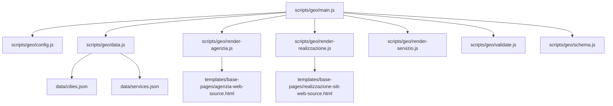
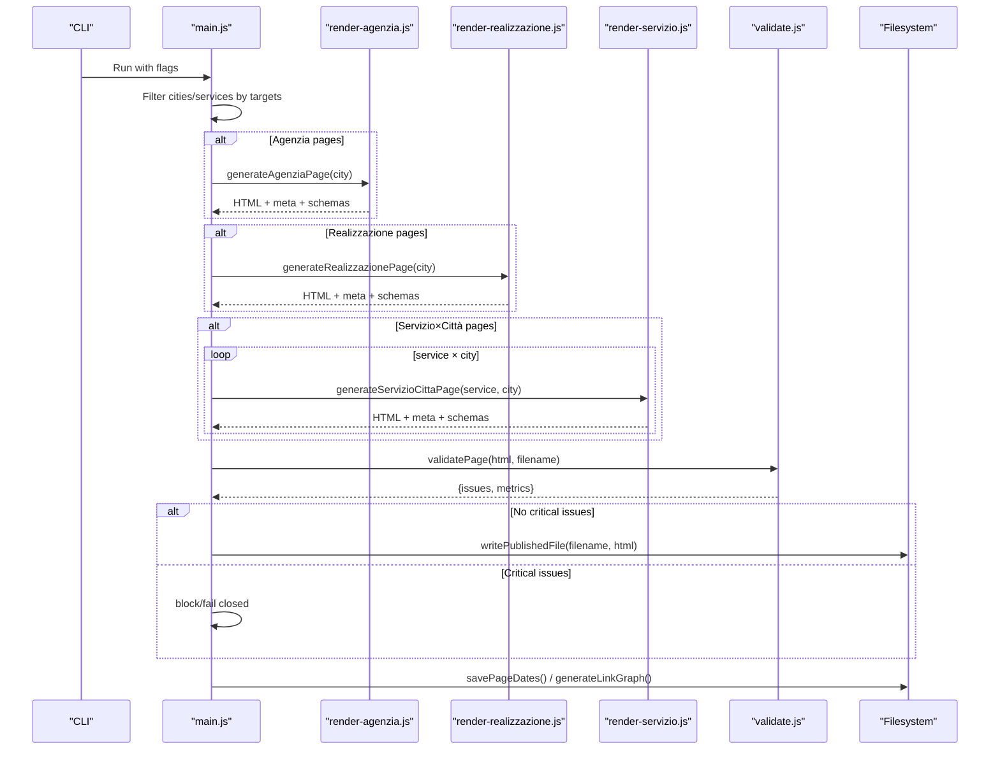
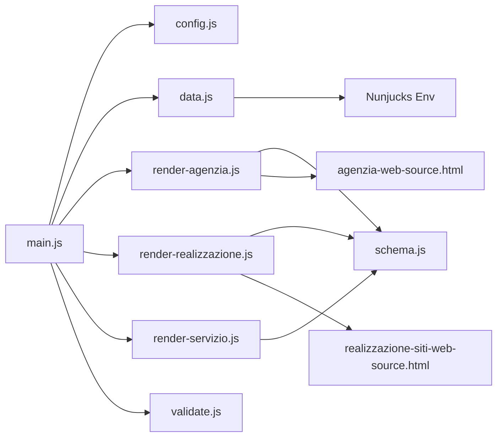

# Geo-Page Generation System

<cite>
**Referenced Files in This Document**
- [scripts/geo/main.js](file://scripts/geo/main.js)
- [scripts/geo/config.js](file://scripts/geo/config.js)
- [scripts/geo/data.js](file://scripts/geo/data.js)
- [scripts/geo/render-agenzia.js](file://scripts/geo/render-agenzia.js)
- [scripts/geo/render-realizzazione.js](file://scripts/geo/render-realizzazione.js)
- [scripts/geo/render-servizio.js](file://scripts/geo/render-servizio.js)
- [scripts/geo/schema.js](file://scripts/geo/schema.js)
- [scripts/geo/validate.js](file://scripts/geo/validate.js)
- [data/cities.json](file://data/cities.json)
- [data/services.json](file://data/services.json)
- [templates/base-pages/agenzia-web-source.html](file://templates/base-pages/agenzia-web-source.html)
- [templates/base-pages/realizzazione-siti-web-source.html](file://templates/base-pages/realizzazione-siti-web-source.html)
</cite>

## Table of Contents
1. Introduction
2. Project Structure
3. Core Components
4. Architecture Overview
5. Detailed Component Analysis
6. Dependency Analysis
7. Performance Considerations
8. Troubleshooting Guide
9. Conclusion

## Introduction
This document explains the geo-page generation system that automatically creates location-specific content pages for a web agency. The system is data-driven: it reads city and service catalogs, merges AI-approved content blocks, renders templates with Nunjucks or regex-based base pages, validates output, and writes published HTML files. It supports three page families:
- Agenzia (agency) pages per city
- Realizzazione (website building) pages per city
- Servizio × Città (service × city) combinatorial matrix pages
It also generates hub pages and link graphs, applies local SEO metadata, and emits structured data (JSON-LD) for search engines.

## Project Structure
The generator lives under scripts/geo and orchestrates data loading, rendering, validation, and publishing. City and service catalogs are JSON files. Base HTML templates provide shared layout and head/footer for generated pages.

**Diagram sources**
- [scripts/geo/main.js:1-292](file://scripts/geo/main.js#L1-L292)
- [scripts/geo/config.js:1-114](file://scripts/geo/config.js#L1-L114)
- [scripts/geo/data.js:1-197](file://scripts/geo/data.js#L1-L197)
- [scripts/geo/render-agenzia.js:1-194](file://scripts/geo/render-agenzia.js#L1-L194)
- [scripts/geo/render-realizzazione.js:1-241](file://scripts/geo/render-realizzazione.js#L1-L241)
- [scripts/geo/render-servizio.js:1-289](file://scripts/geo/render-servizio.js#L1-L289)
- [scripts/geo/schema.js:1-199](file://scripts/geo/schema.js#L1-L199)
- [data/cities.json:1-800](file://data/cities.json#L1-L800)
- [data/services.json:1-307](file://data/services.json#L1-L307)
- [templates/base-pages/agenzia-web-source.html:1-14](file://templates/base-pages/agenzia-web-source.html#L1-L14)
- [templates/base-pages/realizzazione-siti-web-source.html:1-5](file://templates/base-pages/realizzazione-siti-web-source.html#L1-L5)

**Section sources**
- [scripts/geo/main.js:1-292](file://scripts/geo/main.js#L1-L292)
- [scripts/geo/config.js:1-114](file://scripts/geo/config.js#L1-L114)
- [scripts/geo/data.js:1-197](file://scripts/geo/data.js#L1-L197)
- [data/cities.json:1-800](file://data/cities.json#L1-L800)
- [data/services.json:1-307](file://data/services.json#L1-L307)
- [templates/base-pages/agenzia-web-source.html:1-14](file://templates/base-pages/agenzia-web-source.html#L1-L14)
- [templates/base-pages/realizzazione-siti-web-source.html:1-5](file://templates/base-pages/realizzazione-siti-web-source.html#L1-L5)

## Core Components
- Orchestration: main entrypoint iterates cities and services, selects page types, calls renderers, validates, and writes outputs.
- Configuration: CLI flags, site constants, publish/report directories, indexability helpers, robots directives.
- Data layer: loads cities/services, approved content blocks, blog index, configures Nunjucks, provides helper utilities.
- Renderers:
  - Agenzia: Nunjucks-rendered content injected into Rho base template; schema and meta derived from city/service data.
  - Realizzazione: Regex-based substitution on Rho base template to produce city-specific pages.
  - Servizio×Città: Nunjucks-rendered content using a service-city context; rich FAQ pools and related links.
- Schema: Generates JSON-LD for WebPage, Service, OfferCatalog, BreadcrumbList, FAQPage, and areaServed entities.
- Validation: Fail-closed checks for word count, internal links, schemas, canonical/H1 presence, answer capsule class, and unsupported claims.

**Section sources**
- [scripts/geo/main.js:38-289](file://scripts/geo/main.js#L38-L289)
- [scripts/geo/config.js:16-114](file://scripts/geo/config.js#L16-L114)
- [scripts/geo/data.js:15-197](file://scripts/geo/data.js#L15-L197)
- [scripts/geo/render-agenzia.js:34-189](file://scripts/geo/render-agenzia.js#L34-L189)
- [scripts/geo/render-realizzazione.js:33-200](file://scripts/geo/render-realizzazione.js#L33-L200)
- [scripts/geo/render-servizio.js:36-284](file://scripts/geo/render-servizio.js#L36-L284)
- [scripts/geo/schema.js:18-199](file://scripts/geo/schema.js#L18-L199)
- [scripts/geo/validate.js:7-50](file://scripts/geo/validate.js#L7-L50)

## Architecture Overview
The pipeline is modular and fail-closed:
- Load configuration and data
- For each page type, generate HTML via renderer
- Post-process head/meta and inject schemas
- Validate output; block if critical issues found
- Write published file unless dry-run or validate-only
- Persist date index and build link graph

**Diagram sources**
- [scripts/geo/main.js:70-237](file://scripts/geo/main.js#L70-L237)
- [scripts/geo/render-agenzia.js:34-189](file://scripts/geo/render-agenzia.js#L34-L189)
- [scripts/geo/render-realizzazione.js:33-200](file://scripts/geo/render-realizzazione.js#L33-L200)
- [scripts/geo/render-servizio.js:36-284](file://scripts/geo/render-servizio.js#L36-L284)
- [scripts/geo/validate.js:7-50](file://scripts/geo/validate.js#L7-L50)

## Detailed Component Analysis

### Orchestration (main.js)
- Parses CLI flags and filters cities/services
- Computes expected counts per category
- Iterates and invokes renderers per page family
- Finalizes HTML, validates, and writes outputs
- Persists editorial dates and builds link graph
- Exits with error code if blocked/failed or mismatches

Key behaviors:
- Agenzia: special handling for Rho source fallback and hand-crafted FAQs
- Realizzazione: direct renderer call per city
- Servizio×Città: nested loops over eligible services and cities
- Hubs: single pass generating hub pages

**Section sources**
- [scripts/geo/main.js:38-289](file://scripts/geo/main.js#L38-L289)

### Configuration (config.js)
- Defines ROOT, SITE, coordinates, first deploy date, avatar directory
- Resolves today’s date tokens for dynamic content
- Parses CLI args: --dry-run, --validate-only, --type, --out-dir, --report-dir, --city, --service
- Provides tier resolution and target matching helpers
- Builds robots directives based on governance rules

**Section sources**
- [scripts/geo/config.js:16-114](file://scripts/geo/config.js#L16-L114)

### Data Layer (data.js)
- Loads cities.json and services.json
- Builds service maps, price formatters, and eligibility predicate shouldGenerateGeoForService
- Loads approved content blocks (AI-generated) and optional blog index
- Configures Nunjucks environment with autoescape off and whitespace trimming
- Provides helpers for province display, geo modifiers, avatar paths, and UI enrichment

**Section sources**
- [scripts/geo/data.js:15-197](file://scripts/geo/data.js#L15-L197)

### Agenzia Page Renderer (render-agenzia.js)
- Uses Rho base template as shell
- Builds template data from city, services, nearby cities, blog links, and editorial overrides
- Renders content via Nunjucks template agenzia-web-content.njk
- Updates derived head meta (title, description, canonical, robots, OG/Twitter)
- Injects JSON-LD schemas (WebPage, Service, OfferCatalog, FAQPage)
- Assembles final HTML with nav, content, footer, and tail scripts

Template customization points:
- H1, hero capsule, section titles/intro, cards, FAQs, related pages, tier classification, and editorial overrides

**Section sources**
- [scripts/geo/render-agenzia.js:34-189](file://scripts/geo/render-agenzia.js#L34-L189)
- [templates/base-pages/agenzia-web-source.html:1-14](file://templates/base-pages/agenzia-web-source.html#L1-L14)

### Realizzazione Page Renderer (render-realizzazione.js)
- Uses Rho base template as shell
- Applies extensive regex substitutions to localize copy, images, breadcrumbs, and schema values
- Injects editorial body sections and geo links
- Replaces time/date tokens and updates LocalBusiness schema fields
- Renders FAQ section and appends JSON-LD schemas before footer

Template customization points:
- Hero tag/h1/capsule, market intro, areas served, images, visible FAQs, and embedded Tier 1 editorial blocks

**Section sources**
- [scripts/geo/render-realizzazione.js:33-200](file://scripts/geo/render-realizzazione.js#L33-L200)
- [templates/base-pages/realizzazione-siti-web-source.html:1-5](file://templates/base-pages/realizzazione-siti-web-source.html#L1-L5)

### Servizio×Città Page Renderer (render-servizio.js)
- Uses Rho base template as shell
- Builds rich context: service, city, SEO copy, nearest city pages, related services, and AI-enriched content angle
- Selects FAQ pool based on service cluster (web build, marketing, strategy)
- Renders content via Nunjucks template servizio-citta-content.njk
- Updates head meta and injects JSON-LD: BreadcrumbList, WebPage, Service with areaServed and offers, FAQPage

Template customization points:
- Service-specific copy, localized pricing/time estimates, related city/service links, and tier-aware structure

**Section sources**
- [scripts/geo/render-servizio.js:36-284](file://scripts/geo/render-servizio.js#L36-L284)

### Schema Generator (schema.js)
- Creates areaServed entities per city (City or AdministrativeArea), including CAP and Wikipedia sameAs when available
- Builds coverage scopes for hubs
- Emits consistent JSON-LD sets: BreadcrumbList, WebPage, Service (with offer catalog and offers), core service entries, and FAQPage

**Section sources**
- [scripts/geo/schema.js:18-199](file://scripts/geo/schema.js#L18-L199)

### Validation (validate.js)
- Counts words and warns below thresholds
- Checks minimum internal links
- Ensures at least 3 JSON-LD schemas
- Requires canonical and H1 tags
- Looks for answer-capsule class for GEO optimization
- Scans for unsupported published claims and marks them critical

**Section sources**
- [scripts/geo/validate.js:7-50](file://scripts/geo/validate.js#L7-L50)

## Dependency Analysis
- main.js depends on config, data, renderers, validate, paths, dates, and link-graph modules
- Renderers depend on data (Nunjucks env, content blocks, city/service maps), config (site, dates, governance), and schema
- data.js depends on Nunjucks and governance loaders for approved content blocks
- Base templates provide shared shell; renderers inject content and metadata

**Diagram sources**
- [scripts/geo/main.js:1-292](file://scripts/geo/main.js#L1-L292)
- [scripts/geo/config.js:1-114](file://scripts/geo/config.js#L1-L114)
- [scripts/geo/data.js:1-197](file://scripts/geo/data.js#L1-L197)
- [scripts/geo/render-agenzia.js:1-194](file://scripts/geo/render-agenzia.js#L1-L194)
- [scripts/geo/render-realizzazione.js:1-241](file://scripts/geo/render-realizzazione.js#L1-L241)
- [scripts/geo/render-servizio.js:1-289](file://scripts/geo/render-servizio.js#L1-L289)
- [scripts/geo/schema.js:1-199](file://scripts/geo/schema.js#L1-L199)
- [templates/base-pages/agenzia-web-source.html:1-14](file://templates/base-pages/agenzia-web-source.html#L1-L14)
- [templates/base-pages/realizzazione-siti-web-source.html:1-5](file://templates/base-pages/realizzazione-siti-web-source.html#L1-L5)

**Section sources**
- [scripts/geo/main.js:1-292](file://scripts/geo/main.js#L1-L292)
- [scripts/geo/data.js:1-197](file://scripts/geo/data.js#L1-L197)
- [scripts/geo/render-agenzia.js:1-194](file://scripts/geo/render-agenzia.js#L1-L194)
- [scripts/geo/render-realizzazione.js:1-241](file://scripts/geo/render-realizzazione.js#L1-L241)
- [scripts/geo/render-servizio.js:1-289](file://scripts/geo/render-servizio.js#L1-L289)
- [scripts/geo/schema.js:1-199](file://scripts/geo/schema.js#L1-L199)

## Performance Considerations
- Template rendering uses Nunjucks with autoescape disabled; ensure content blocks are trusted and validated.
- Regex replacements in realizzazione renderer are efficient but must be precise to avoid unintended matches.
- Validation runs per page; consider batching or parallelization if scaling to many cities/services.
- Link graph generation and date persistence occur post-write; keep these operations lightweight.

[No sources needed since this section provides general guidance]

## Troubleshooting Guide
Common issues and resolutions:
- Missing base template: Ensure the Rho base template exists and is readable; renderers return null if not found.
- Critical validation failures: Pages with missing canonical, H1, or insufficient word/link/schema counts are blocked. Fix content or template injection.
- Unsupported claims: Content claim governance scans will mark unsupported statements; update content blocks or editorial overrides.
- Target filtering: Use CLI flags to limit generation to specific cities or services for faster iteration.
- Date tokens: If dates do not appear, verify PAGE_DATE_ISO_TOKEN and PAGE_DATE_HUMAN_TOKEN replacement logic in renderers.

**Section sources**
- [scripts/geo/render-agenzia.js:34-40](file://scripts/geo/render-agenzia.js#L34-L40)
- [scripts/geo/render-realizzazione.js:33-39](file://scripts/geo/render-realizzazione.js#L33-L39)
- [scripts/geo/validate.js:7-50](file://scripts/geo/validate.js#L7-L50)
- [scripts/geo/config.js:32-60](file://scripts/geo/config.js#L32-L60)

## Conclusion
The geo-page generation system provides a robust, data-driven workflow to produce scalable, locally optimized pages across multiple categories. By combining JSON catalogs, approved AI content blocks, Nunjucks templating, and rigorous validation, it ensures high-quality, SEO-ready outputs. The modular design allows easy extension to new page types, services, or cities while maintaining consistency and compliance with governance rules.