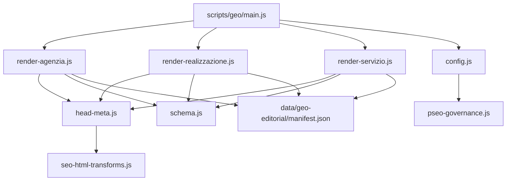
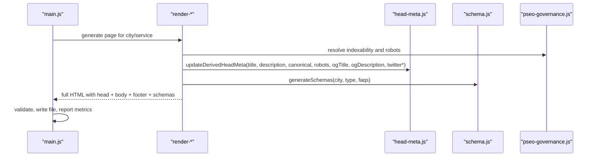
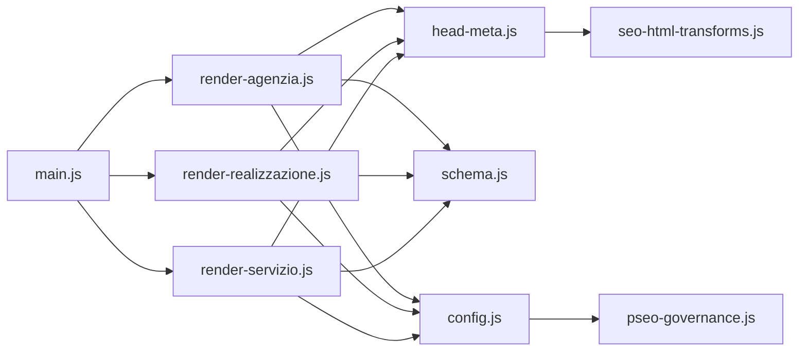

# SEO & Schema Markup Generation

<cite>
**Referenced Files in This Document**
- [scripts/geo/schema.js](file://scripts/geo/schema.js)
- [scripts/geo/head-meta.js](file://scripts/geo/head-meta.js)
- [scripts/geo/render-agenzia.js](file://scripts/geo/render-agenzia.js)
- [scripts/geo/render-realizzazione.js](file://scripts/geo/render-realizzazione.js)
- [scripts/geo/render-servizio.js](file://scripts/geo/render-servizio.js)
- [scripts/geo/main.js](file://scripts/geo/main.js)
- [scripts/geo/config.js](file://scripts/geo/config.js)
- [config/pseo-governance.js](file://config/pseo-governance.js)
- [data/geo-editorial/manifest.json](file://data/geo-editorial/manifest.json)
- [config/seo-html-transforms.js](file://config/seo-html-transforms.js)
</cite>

## Table of Contents
1. Introduction
2. Project Structure
3. Core Components
4. Architecture Overview
5. Detailed Component Analysis
6. Dependency Analysis
7. Performance Considerations
8. Troubleshooting Guide
9. Conclusion

## Introduction
This document explains how geo pages are generated with strong search engine optimization and structured data. It covers automatic schema markup for local business entities, meta tag optimization, Open Graph and Twitter card handling, canonical URL management, robots directives, and the head metadata system that produces location-specific titles, descriptions, and social tags. It also outlines SEO best practices implemented by the generator and the performance impact of these enhancements.

## Project Structure
The geo page generation pipeline is orchestrated by a main script that renders three families of pages:
- Agenzia (agency) pages per city
- Realizzazione (website development) pages per city
- Servizio × Città (service × city) combinatorial pages

Each family uses shared utilities to build head metadata, inject JSON-LD schemas, and apply governance-driven indexation rules.

**Diagram sources**
- [scripts/geo/main.js:38-225](file://scripts/geo/main.js#L38-L225)
- [scripts/geo/render-agenzia.js:34-188](file://scripts/geo/render-agenzia.js#L34-L188)
- [scripts/geo/render-realizzazione.js:33-199](file://scripts/geo/render-realizzazione.js#L33-L199)
- [scripts/geo/render-servizio.js:36-283](file://scripts/geo/render-servizio.js#L36-L283)
- [scripts/geo/head-meta.js:18-145](file://scripts/geo/head-meta.js#L18-L145)
- [scripts/geo/schema.js:73-191](file://scripts/geo/schema.js#L73-L191)
- [scripts/geo/config.js:62-78](file://scripts/geo/config.js#L62-L78)
- [config/pseo-governance.js:250-287](file://config/pseo-governance.js#L250-L287)
- [data/geo-editorial/manifest.json:1-47](file://data/geo-editorial/manifest.json#L1-L47)
- [config/seo-html-transforms.js:1-20](file://config/seo-html-transforms.js#L1-L20)

**Section sources**
- [scripts/geo/main.js:38-225](file://scripts/geo/main.js#L38-L225)
- [scripts/geo/config.js:16-78](file://scripts/geo/config.js#L16-L78)
- [config/pseo-governance.js:1-16](file://config/pseo-governance.js#L1-L16)

## Core Components
- Head metadata system: updates title, description, canonical, robots, Open Graph, and Twitter tags; ensures self-referencing hreflang; strips or rewrites legacy JSON-LD in hand-crafted pages.
- Schema generator: builds BreadcrumbList, WebPage, Service, OfferCatalog, FAQPage, and areaServed entities tied to cities and administrative areas.
- Page renderers: assemble HTML from base templates, inject editorial content, FAQs, internal links, and append JSON-LD before final output.
- Governance layer: controls which geo paths are indexable, de-amplified, or removed, and derives robots directives accordingly.
- Editorial manifest: declares tiered, approved geo records and their provenance.

**Section sources**
- [scripts/geo/head-meta.js:18-145](file://scripts/geo/head-meta.js#L18-L145)
- [scripts/geo/schema.js:18-191](file://scripts/geo/schema.js#L18-L191)
- [scripts/geo/render-agenzia.js:34-188](file://scripts/geo/render-agenzia.js#L34-L188)
- [scripts/geo/render-realizzazione.js:33-199](file://scripts/geo/render-realizzazione.js#L33-L199)
- [scripts/geo/render-servizio.js:36-283](file://scripts/geo/render-servizio.js#L36-L283)
- [config/pseo-governance.js:250-287](file://config/pseo-governance.js#L250-L287)
- [data/geo-editorial/manifest.json:1-47](file://data/geo-editorial/manifest.json#L1-L47)

## Architecture Overview
The generator composes each page in four stages:
1. Select base template and compute page context (city, service, editorial overrides).
2. Build head metadata using updateDerivedHeadMeta with canonical, robots, OG/Twitter tags, and keywords when applicable.
3. Render body content via Nunjucks or regex/template substitution, injecting FAQs, editorial blocks, and internal links.
4. Append JSON-LD schemas (WebPage, Service, BreadcrumbList, FAQPage) and finalize published HTML.

**Diagram sources**
- [scripts/geo/main.js:70-225](file://scripts/geo/main.js#L70-L225)
- [scripts/geo/render-agenzia.js:149-188](file://scripts/geo/render-agenzia.js#L149-L188)
- [scripts/geo/render-realizzazione.js:52-99](file://scripts/geo/render-realizzazione.js#L52-L99)
- [scripts/geo/render-servizio.js:194-283](file://scripts/geo/render-servizio.js#L194-L283)
- [scripts/geo/head-meta.js:123-145](file://scripts/geo/head-meta.js#L123-L145)
- [scripts/geo/schema.js:73-191](file://scripts/geo/schema.js#L73-L191)
- [config/pseo-governance.js:279-287](file://config/pseo-governance.js#L279-L287)

## Detailed Component Analysis

### Head Metadata System
- Title, description, canonical, robots, and social tags are rewritten in one pass.
- Canonical link rel="canonical" is updated to the page’s absolute URL.
- Robots directive is derived from governance rules per path.
- Self-referencing hreflang="it-IT" is ensured if missing.
- Hand-crafted Rho agency page normalizes embedded JSON-LD and replaces outdated FAQ schemas with the resolved set.

Examples of behavior:
- Replaces meta[name="description"], meta[property="og:*"], meta[name="twitter:*"].
- Ensures canonical and hreflang consistency.
- Strips old JSON-LD blocks from head when needed.

**Section sources**
- [scripts/geo/head-meta.js:18-145](file://scripts/geo/head-meta.js#L18-L145)
- [scripts/geo/render-agenzia.js:149-160](file://scripts/geo/render-agenzia.js#L149-L160)
- [scripts/geo/render-realizzazione.js:52-64](file://scripts/geo/render-realizzazione.js#L52-L64)
- [scripts/geo/render-servizio.js:194-205](file://scripts/geo/render-servizio.js#L194-L205)

### Automatic Schema Markup Generation
Core schemas produced per page:
- BreadcrumbList: Home → Hub/Service → City page.
- WebPage: identifies the page, language, site association, about LocalBusiness, and dates.
- Service: describes the offering, provider, area served, offers, and optional offer catalog.
- FAQPage: included only when FAQs exist.

Area served logic:
- Primary entity is City or AdministrativeArea depending on synthetic zones.
- Nearby cities are added as City entities.
- Broader regions like “Hinterland milanese” and “Città Metropolitana di Milano” are included.

Local Business linkage:
- Pages reference a singleton LocalBusiness @id for consistent entity resolution across the site.

Examples of implementation:
- Agenzia and Realizzazione families use generateSchemas to produce a unified set of schemas.
- Servizio×Città pages build tailored Service and Offer structures with price and currency.

**Section sources**
- [scripts/geo/schema.js:18-191](file://scripts/geo/schema.js#L18-L191)
- [scripts/geo/render-agenzia.js:179-188](file://scripts/geo/render-agenzia.js#L179-L188)
- [scripts/geo/render-realizzazione.js:194-197](file://scripts/geo/render-realizzazione.js#L194-L197)
- [scripts/geo/render-servizio.js:218-283](file://scripts/geo/render-servizio.js#L218-L283)
- [scripts/geo/config.js:19-23](file://scripts/geo/config.js#L19-L23)

### Structured Data Implementation Patterns
- BreadcrumbList: three-level hierarchy aligning with site navigation.
- WebPage: includes @id, name, description, url, language, site association, and about LocalBusiness.
- Service: includes serviceType, name, description, provider, areaServed, offers, and optional hasOfferCatalog.
- FAQPage: maps visible Q&A into Question/Answer pairs.

These patterns ensure rich SERP features (breadcrumbs, FAQs) and clear semantic signals for crawlers.

**Section sources**
- [scripts/geo/schema.js:114-191](file://scripts/geo/schema.js#L114-L191)
- [scripts/geo/render-servizio.js:218-283](file://scripts/geo/render-servizio.js#L218-L283)

### Meta Tag Optimization and Social Tags
- Title and description are injected per page context.
- Open Graph tags (og:title, og:description, og:url) are set consistently.
- Twitter tags (twitter:title, twitter:description) mirror OG where appropriate.
- Keywords meta may be added for specific page types.
- Robots meta is governed by pSEO allowlists and de-amplification rules.

Canonical URL Handling:
- Each page sets a unique canonical URL pointing to its own slug under the site root.
- The head system ensures canonical link rel="canonical" is present and correct.

Hreflang:
- A self-referencing hreflang="it-IT" link is inserted if absent.

**Section sources**
- [scripts/geo/head-meta.js:77-145](file://scripts/geo/head-meta.js#L77-L145)
- [scripts/geo/render-agenzia.js:149-160](file://scripts/geo/render-agenzia.js#L149-L160)
- [scripts/geo/render-realizzazione.js:52-64](file://scripts/geo/render-realizzazione.js#L52-L64)
- [scripts/geo/render-servizio.js:194-205](file://scripts/geo/render-servizio.js#L194-L205)

### Search Engine Optimization Strategies
- Tiered indexation: only Tier 1, Tier 2, and data-validated paths are indexable; others receive noindex,follow to reduce doorway footprint.
- Editorial governance: approved content blocks and manifests control high-value pages and prevent unapproved overrides.
- Internal linking: geo link sections and related city/service pages strengthen topical clusters.
- Content uniqueness: AI-enriched local market analysis and competitive context vary by service cluster to avoid duplication.
- FAQ visibility: visible FAQs match FAQPage schema for enhanced SERP presence.

**Section sources**
- [config/pseo-governance.js:1-16](file://config/pseo-governance.js#L1-L16)
- [config/pseo-governance.js:250-287](file://config/pseo-governance.js#L250-L287)
- [data/geo-editorial/manifest.json:1-47](file://data/geo-editorial/manifest.json#L1-L47)
- [scripts/geo/render-servizio.js:68-88](file://scripts/geo/render-servizio.js#L68-L88)

### Performance Impact of SEO Enhancements
- JSON-LD injection occurs once per page after rendering; it adds minimal payload but improves crawlability.
- Head rewriting is regex-based and fast; stripping/replacing tags is O(n) over head size.
- Governance checks are constant-time lookups in Sets.
- Avoiding unnecessary JSON-LD in non-indexable pages reduces bloat.
- Hand-crafted page normalization preserves existing structure while updating only necessary parts.

[No sources needed since this section provides general guidance]

## Dependency Analysis
Key dependencies and coupling:
- main.js orchestrates generation and depends on renderers, config, validation, and reporting modules.
- Renderers depend on head-meta for head updates, schema for JSON-LD, editorial for overrides, and governance for robots/indexability.
- Config centralizes site constants, CLI flags, and governance helpers.
- pseo-governance defines allowlists and de-amplification rules used across renderers and head/meta logic.
- seo-html-transforms contributes global transforms and policies applied during publishing.

**Diagram sources**
- [scripts/geo/main.js:38-225](file://scripts/geo/main.js#L38-L225)
- [scripts/geo/render-agenzia.js:34-188](file://scripts/geo/render-agenzia.js#L34-L188)
- [scripts/geo/render-realizzazione.js:33-199](file://scripts/geo/render-realizzazione.js#L33-L199)
- [scripts/geo/render-servizio.js:36-283](file://scripts/geo/render-servizio.js#L36-L283)
- [scripts/geo/head-meta.js:18-145](file://scripts/geo/head-meta.js#L18-L145)
- [scripts/geo/schema.js:73-191](file://scripts/geo/schema.js#L73-L191)
- [scripts/geo/config.js:16-78](file://scripts/geo/config.js#L16-L78)
- [config/pseo-governance.js:250-287](file://config/pseo-governance.js#L250-L287)
- [config/seo-html-transforms.js:1-20](file://config/seo-html-transforms.js#L1-L20)

**Section sources**
- [scripts/geo/main.js:38-225](file://scripts/geo/main.js#L38-L225)
- [scripts/geo/config.js:16-78](file://scripts/geo/config.js#L16-L78)
- [config/pseo-governance.js:250-287](file://config/pseo-governance.js#L250-L287)

## Performance Considerations
- Keep JSON-LD concise and relevant; avoid redundant entities.
- Prefer server-side head rewriting to minimize client-side work.
- Use governance to limit indexable pages to those with real value, reducing crawl budget waste.
- Validate outputs in dry-run mode to catch issues early without writing files.
- Monitor page sizes and word counts reported by the generator to detect regressions.

[No sources needed since this section provides general guidance]

## Troubleshooting Guide
Common issues and resolutions:
- Missing or incorrect canonical: verify updateDerivedHeadMeta receives the correct canonical URL per page.
- Duplicate or stale JSON-LD: ensure stripJsonLdFromHead runs on hand-crafted pages and that new schemas are appended once.
- Noindex unexpectedly applied: check pseo-governance allowlists and whether the path is de-amplified.
- Open Graph/Twitter tags not appearing: confirm meta replacement functions target the correct attributes and values.
- Validation failures: review warnings and blocked issues printed by the generator; fix content or schema mismatches.

**Section sources**
- [scripts/geo/head-meta.js:18-145](file://scripts/geo/head-meta.js#L18-L145)
- [scripts/geo/main.js:94-110](file://scripts/geo/main.js#L94-L110)
- [scripts/geo/main.js:131-147](file://scripts/geo/main.js#L131-L147)
- [scripts/geo/main.js:170-185](file://scripts/geo/main.js#L170-L185)
- [config/pseo-governance.js:250-287](file://config/pseo-governance.js#L250-L287)

## Conclusion
The geo page generator implements a robust SEO and structured data pipeline. It produces location-specific titles, descriptions, and social tags; generates comprehensive JSON-LD for local businesses, services, breadcrumbs, and FAQs; and enforces strict indexation governance to focus crawl budget on high-value pages. By combining editorial controls, automated schema generation, and careful head metadata updates, the system delivers strong search visibility while maintaining performance and maintainability.

[No sources needed since this section summarizes without analyzing specific files]