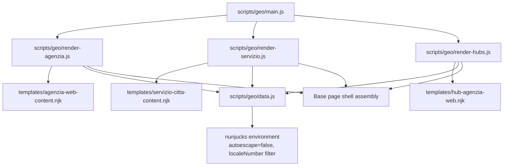
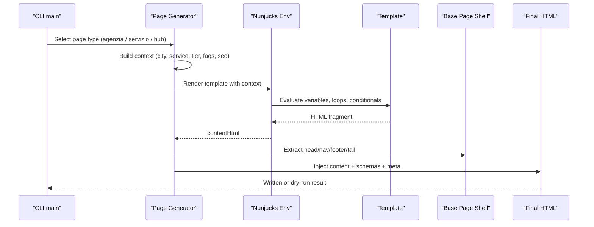
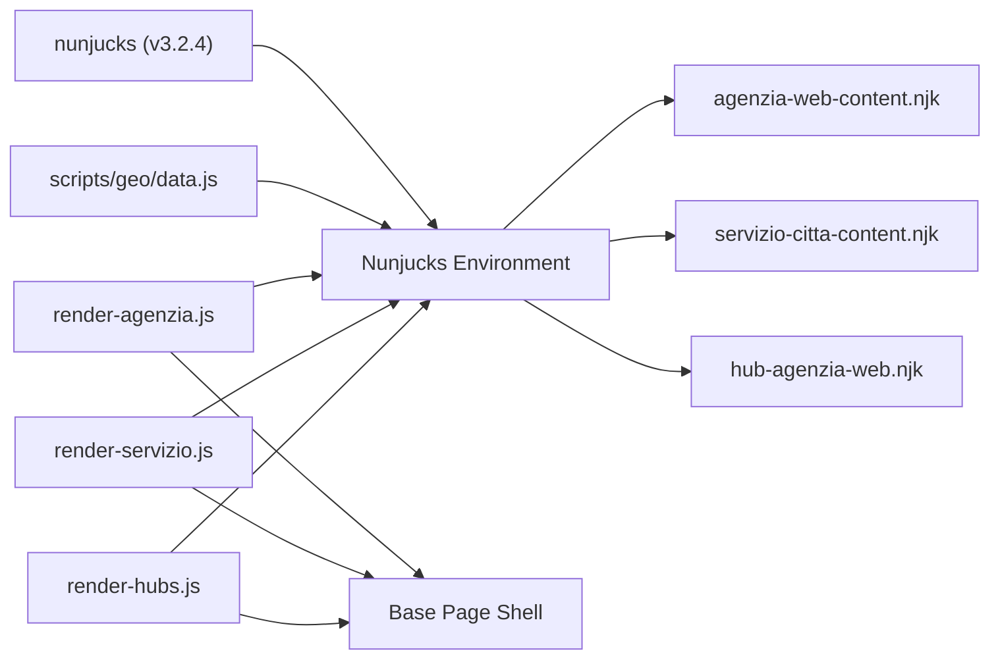

# Template Engine & Content Rendering

<cite>
**Referenced Files in This Document**
- [build.js](file://build.js)
- [package-lock.json](file://package-lock.json)
- [scripts/geo/main.js](file://scripts/geo/main.js)
- [scripts/geo/data.js](file://scripts/geo/data.js)
- [scripts/geo/render-agenzia.js](file://scripts/geo/render-agenzia.js)
- [scripts/geo/render-servizio.js](file://scripts/geo/render-servizio.js)
- [scripts/geo/render-hubs.js](file://scripts/geo/render-hubs.js)
- [templates/agenzia-web-content.njk](file://templates/agenzia-web-content.njk)
- [templates/servizio-citta-content.njk](file://templates/servizio-citta-content.njk)
- [templates/hub-agenzia-web.njk](file://templates/hub-agenzia-web.njk)
- [data/content-blocks/milano.json](file://data/content-blocks/milano.json)
</cite>

## Table of Contents
1. Introduction
2. Project Structure
3. Core Components
4. Architecture Overview
5. Detailed Component Analysis
6. Dependency Analysis
7. Performance Considerations
8. Troubleshooting Guide
9. Conclusion

## Introduction
This document explains the Nunjucks-based template system used to generate geo-targeted content pages for the site. It covers the template hierarchy, data binding patterns, dynamic content insertion, and the content block system that enables modular page composition with reusable components and conditional rendering logic. It also documents template inheritance via a shared base page, partial rendering through reusable templates, examples of data injection and custom filters, and guidance for debugging template-related issues.

## Project Structure
The geo page generation pipeline is orchestrated by Node scripts that:
- Load configuration and datasets (cities, services, approved content blocks).
- Prepare per-page context data.
- Render Nunjucks templates into HTML fragments.
- Assemble full pages by injecting rendered content into a shared base page shell.
- Write final HTML files and persist metadata.

**Diagram sources**
- [scripts/geo/main.js:38-225](file://scripts/geo/main.js#L38-L225)
- [scripts/geo/render-agenzia.js:34-188](file://scripts/geo/render-agenzia.js#L34-L188)
- [scripts/geo/render-servizio.js:36-283](file://scripts/geo/render-servizio.js#L36-L283)
- [scripts/geo/render-hubs.js:51-287](file://scripts/geo/render-hubs.js#L51-L287)
- [scripts/geo/data.js:113-119](file://scripts/geo/data.js#L113-L119)

**Section sources**
- [scripts/geo/main.js:38-225](file://scripts/geo/main.js#L38-L225)
- [scripts/geo/data.js:15-119](file://scripts/geo/data.js#L15-L119)

## Core Components
- Nunjucks environment: configured once with autoescape disabled and helpful filters (e.g., localeNumber).
- Page generators:
  - Agenzia pages: render city-specific agency landing pages.
  - Servizio×Città pages: render service-by-city pages with rich local context.
  - Hub pages: aggregate index pages for agencies, realization, and served zones.
- Base page assembly: each generator extracts head/nav/footer from a shared base page and injects the rendered content plus JSON-LD schemas.
- Data sources: cities, services, approved content blocks, editorial records, and optional AI-enriched content.

Key responsibilities:
- Data preparation and enrichment (pricing, links, FAQs, tiers).
- Template rendering with localized data.
- Final page assembly and validation before writing.

**Section sources**
- [scripts/geo/data.js:113-119](file://scripts/geo/data.js#L113-L119)
- [scripts/geo/render-agenzia.js:34-188](file://scripts/geo/render-agenzia.js#L34-L188)
- [scripts/geo/render-servizio.js:36-283](file://scripts/geo/render-servizio.js#L36-L283)
- [scripts/geo/render-hubs.js:51-287](file://scripts/geo/render-hubs.js#L51-L287)

## Architecture Overview
The system composes pages using a hybrid approach:
- Shared base page provides consistent head, navigation, footer, and tail assets.
- Nunjucks templates provide section-level layouts and content blocks.
- Generators compute per-page data and inject it into templates.
- Final output includes structured data (JSON-LD) and SEO metadata.

**Diagram sources**
- [scripts/geo/main.js:70-225](file://scripts/geo/main.js#L70-L225)
- [scripts/geo/render-agenzia.js:146-188](file://scripts/geo/render-agenzia.js#L146-L188)
- [scripts/geo/render-servizio.js:192-283](file://scripts/geo/render-servizio.js#L192-L283)
- [scripts/geo/render-hubs.js:64-124](file://scripts/geo/render-hubs.js#L64-L124)

## Detailed Component Analysis

### Template Hierarchy and Inheritance
- Templates live under templates/ and are rendered by generators.
- There is no explicit Nunjucks extends/include usage; instead, a shared base page shell is reused by extracting head, nav, footer, and tail segments during assembly.
- Each page type has its own focused template:
  - Agency pages: templates/agenzia-web-content.njk
  - Service×City pages: templates/servizio-citta-content.njk
  - Hub pages: templates/hub-agenzia-web.njk

Inheritance pattern:
- Base page shell is not a Nunjucks include but a static HTML file whose sections are programmatically extracted and reassembled around the rendered template content.

**Section sources**
- [scripts/geo/render-agenzia.js:149-186](file://scripts/geo/render-agenzia.js#L149-L186)
- [scripts/geo/render-servizio.js:194-283](file://scripts/geo/render-servizio.js#L194-L283)
- [scripts/geo/render-hubs.js:64-124](file://scripts/geo/render-hubs.js#L64-L124)

### Data Binding Patterns
- Variables passed to templates include:
  - city/service objects with labels, distances, and local context.
  - seo object with hero copy, titles, descriptions, and CTAs.
  - faqs arrays for Q&A sections.
  - relatedPages/relatedServicePages for internal linking.
  - tier flags controlling structural differentiation.
  - today/todayFormatted for date display.
- Loops render grids, tables, and lists.
- Safe filters are used for HTML content where appropriate.

Examples of bindings:
- Hero capsule and H1 from city/service data.
- Service grid from tableServices.
- FAQ details from faqs array.
- Tier 1 editorial block from tier1Content when present.

**Section sources**
- [templates/agenzia-web-content.njk:1-278](file://templates/agenzia-web-content.njk#L1-L278)
- [templates/servizio-citta-content.njk:1-374](file://templates/servizio-citta-content.njk#L1-L374)
- [templates/hub-agenzia-web.njk:1-145](file://templates/hub-agenzia-web.njk#L1-L145)

### Dynamic Content Insertion
- AI-enriched content blocks can be injected into specific sections when available.
- Local market analysis and competitive context are merged into page content based on service cluster and city data.
- Approved content blocks (tier1) allow hand-crafted overrides for high-value pages.

Insertion points:
- Agency pages: local market context and competitive insights.
- Service×City pages: AI content, data points, competitive insight, decision framework cards, deliverables, intent queries.

**Section sources**
- [scripts/geo/render-agenzia.js:80-92](file://scripts/geo/render-agenzia.js#L80-L92)
- [scripts/geo/render-servizio.js:68-94](file://scripts/geo/render-servizio.js#L68-L94)
- [data/content-blocks/milano.json:1-64](file://data/content-blocks/milano.json#L1-L64)

### Content Block System and Reusable Components
- Approved content blocks directory holds per-city data including FAQs and unique data points.
- Tier 1 override files enable per-city/per-service editorial content.
- Generators load these blocks and pass them into templates for conditional rendering.

Reusable components:
- Service grids, comparison tables, FAQ details, and hub city cards are consistently rendered across templates.
- Conditional sections activate based on tier and presence of data.

**Section sources**
- [scripts/geo/data.js:91-98](file://scripts/geo/data.js#L91-L98)
- [scripts/geo/render-agenzia.js:69-77](file://scripts/geo/render-agenzia.js#L69-L77)
- [scripts/geo/render-servizio.js:143-155](file://scripts/geo/render-servizio.js#L143-L155)
- [templates/agenzia-web-content.njk:74-106](file://templates/agenzia-web-content.njk#L74-L106)
- [templates/servizio-citta-content.njk:153-184](file://templates/servizio-citta-content.njk#L153-L184)

### Conditional Rendering Logic
- Tier classification drives structural differences:
  - Tier 1: extra editorial block and full feature set.
  - Tier 2: standard template with full internal linking.
  - Tier 0: de-amplified pages omit certain link-heavy sections to reduce doorway footprint.
- Conditional blocks appear throughout templates for FAQs, related pages, and comparison tables.

**Section sources**
- [templates/servizio-citta-content.njk:280-311](file://templates/servizio-citta-content.njk#L280-L311)
- [templates/servizio-citta-content.njk:328-342](file://templates/servizio-citta-content.njk#L328-L342)
- [scripts/geo/render-servizio.js:143-155](file://scripts/geo/render-servizio.js#L143-L155)

### Examples of Template Usage and Data Injection
- Agency page example:
  - Variables: city, services, nearCitiesData, relatedPages, blogLinks, tier, tier1Content, editorial, today, todayFormatted.
  - Sections: hero, local context, services grid, area served, market context, comparison table, process, sectors, FAQ, blog links, CTA.
- Service×City page example:
  - Variables: city, service, seo, faqs, aiContent, competitiveInsight, dataPoints, relatedCityPages, relatedServicePages, allCoreServices, tier, tier1Content.
  - Sections: hero highlights, service description, why choose us, process, local market context, tier 1 editorial, competitive insight, decision framework, deliverables, intent queries, comparison table, FAQ, nearby cities, other services, CTA.
- Hub page example:
  - Variables: cities, coreServices, networkCoverageCount, totalCities, today, todayFormatted, site.
  - Sections: hero, featured territories, city selection grid, reasons to choose local, services table, CTA.

**Section sources**
- [templates/agenzia-web-content.njk:1-278](file://templates/agenzia-web-content.njk#L1-L278)
- [templates/servizio-citta-content.njk:1-374](file://templates/servizio-citta-content.njk#L1-L374)
- [templates/hub-agenzia-web.njk:1-145](file://templates/hub-agenzia-web.njk#L1-L145)

### Custom Filter Implementation
- The Nunjucks environment adds a localeNumber filter to format numbers according to locale conventions.
- Filters are applied in templates to display population counts and other numeric values.

Usage examples:
- Population display in hub city cards.
- Number formatting in service grids and tables.

**Section sources**
- [scripts/geo/data.js:113-119](file://scripts/geo/data.js#L113-L119)
- [templates/hub-agenzia-web.njk:69-83](file://templates/hub-agenzia-web.njk#L69-L83)

### Partial Rendering and Modular Composition
- While there are no Nunjucks includes, modularity is achieved by:
  - Reusing the same base page shell across all generated pages.
  - Composing pages from consistent sections (hero, grids, tables, FAQs, CTAs).
  - Passing structured data to templates so sections render uniformly.

**Section sources**
- [scripts/geo/render-agenzia.js:149-186](file://scripts/geo/render-agenzia.js#L149-L186)
- [scripts/geo/render-servizio.js:194-283](file://scripts/geo/render-servizio.js#L194-L283)
- [scripts/geo/render-hubs.js:64-124](file://scripts/geo/render-hubs.js#L64-L124)

### Debugging Template-Related Issues
- Validation step:
  - After rendering, each page is validated; blocking issues prevent writing.
  - Warnings are logged without blocking unless critical.
- Dry run and validate-only modes:
  - Useful for testing template rendering without writing files.
- Common checks:
  - Ensure base page exists and can be parsed for head/nav/footer extraction.
  - Verify template variables exist and have expected types.
  - Confirm approved content blocks are loaded and accessible.
  - Inspect generated HTML for missing sections or malformed markup.

**Section sources**
- [scripts/geo/main.js:70-225](file://scripts/geo/main.js#L70-L225)
- [scripts/geo/render-agenzia.js:34-40](file://scripts/geo/render-agenzia.js#L34-L40)
- [scripts/geo/render-servizio.js:36-38](file://scripts/geo/render-servizio.js#L36-L38)
- [scripts/geo/render-hubs.js:51-56](file://scripts/geo/render-hubs.js#L51-L56)

## Dependency Analysis
The template system depends on:
- Nunjucks runtime for rendering templates.
- Data modules for cities, services, and approved content blocks.
- Generators for assembling pages and injecting metadata.
- Base page shell for consistent layout.

**Diagram sources**
- [package-lock.json:4447-4471](file://package-lock.json#L4447-L4471)
- [scripts/geo/data.js:113-119](file://scripts/geo/data.js#L113-L119)
- [scripts/geo/render-agenzia.js:146-188](file://scripts/geo/render-agenzia.js#L146-L188)
- [scripts/geo/render-servizio.js:192-283](file://scripts/geo/render-servizio.js#L192-L283)
- [scripts/geo/render-hubs.js:64-124](file://scripts/geo/render-hubs.js#L64-L124)

**Section sources**
- [package-lock.json:4447-4471](file://package-lock.json#L4447-L4471)
- [scripts/geo/data.js:113-119](file://scripts/geo/data.js#L113-L119)

## Performance Considerations
- Autoescape is disabled globally; ensure content is sanitized at the source to avoid XSS risks.
- Use approved content blocks to limit untrusted HTML injection.
- Keep template data structures minimal to reduce rendering overhead.
- Avoid excessive nested loops or heavy computations inside templates.
- Validate outputs early to catch performance regressions during development.

[No sources needed since this section provides general guidance]

## Troubleshooting Guide
Common issues and resolutions:
- Missing base page:
  - Symptom: generators cannot extract head/nav/footer.
  - Resolution: ensure the base page file exists and is readable.
- Empty or invalid content blocks:
  - Symptom: sections do not render or show placeholders.
  - Resolution: verify approved content blocks are present and correctly formatted.
- Template variable errors:
  - Symptom: undefined variables cause rendering failures.
  - Resolution: check context construction in generators and ensure required fields are provided.
- Validation blocks:
  - Symptom: pages are blocked due to critical issues.
  - Resolution: review validation warnings and fix structural or SEO issues.

Operational tips:
- Use dry run mode to test changes without writing files.
- Use validate-only mode to inspect outputs and metrics.
- Inspect generated HTML for correct injection of content, schemas, and metadata.

**Section sources**
- [scripts/geo/main.js:70-225](file://scripts/geo/main.js#L70-L225)
- [scripts/geo/render-agenzia.js:34-40](file://scripts/geo/render-agenzia.js#L34-L40)
- [scripts/geo/render-servizio.js:36-38](file://scripts/geo/render-servizio.js#L36-L38)
- [scripts/geo/render-hubs.js:51-56](file://scripts/geo/render-hubs.js#L51-L56)

## Conclusion
The Nunjucks template system provides a robust, modular foundation for generating geo-targeted pages. By combining a shared base page shell with focused templates and rich data contexts, the system supports flexible content composition, conditional rendering, and scalable page generation. Approved content blocks and tier-based differentiation ensure both quality and control over published content. With careful data preparation and validation, the pipeline delivers consistent, SEO-friendly pages tailored to local markets.

[No sources needed since this section summarizes without analyzing specific files]