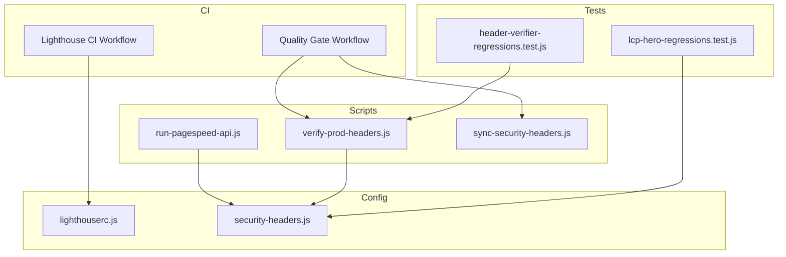
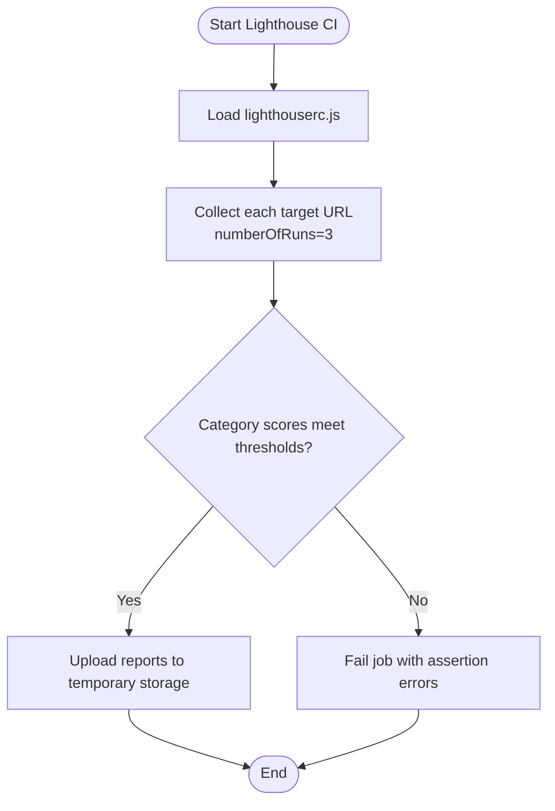
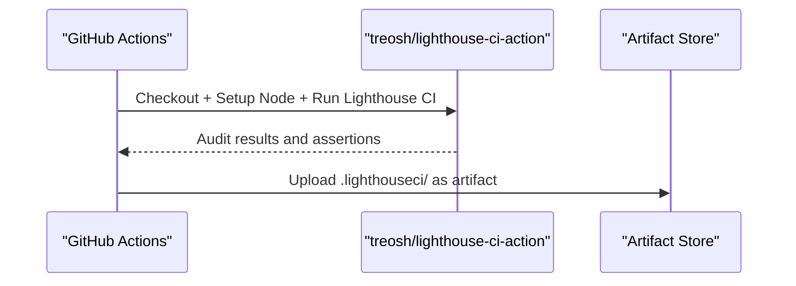
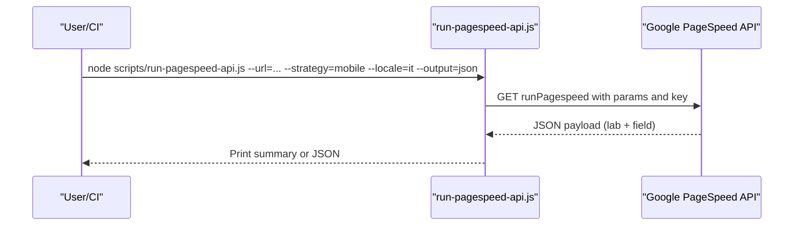
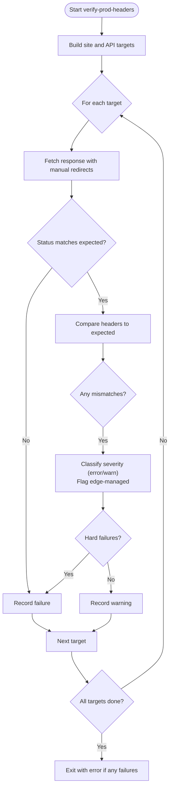
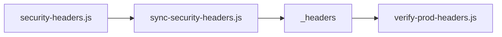
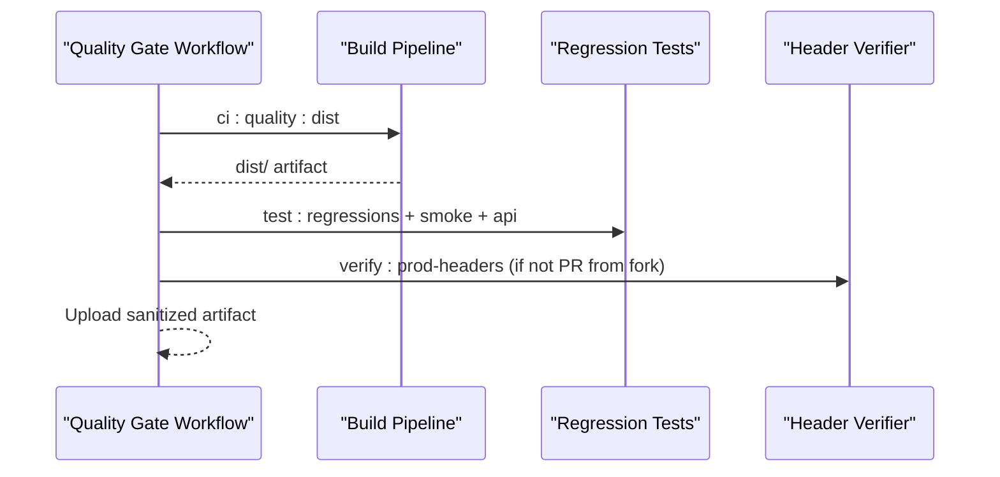
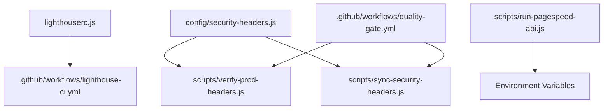

# Performance Testing & Lighthouse Integration

<cite>
**Referenced Files in This Document**
- [lighthouserc.js](file://lighthouserc.js)
- [lighthouse-ci.yml](file://.github/workflows/lighthouse-ci.yml)
- [run-pagespeed-api.js](file://scripts/run-pagespeed-api.js)
- [verify-prod-headers.js](file://scripts/verify-prod-headers.js)
- [security-headers.js](file://config/security-headers.js)
- [sync-security-headers.js](file://scripts/sync-security-headers.js)
- [quality-gate.yml](file://.github/workflows/quality-gate.yml)
- [package.json](file://package.json)
- [header-verifier-regressions.test.js](file://tests/header-verifier-regressions.test.js)
- [lcp-hero-regressions.test.js](file://tests/lcp-hero-regressions.test.js)
- [PAGESPEED-MOBILE-AUDIT-2026-02-27.md](file://docs/PAGESPEED-MOBILE-AUDIT-2026-02-27.md)
</cite>

## Table of Contents
1. [Introduction](#introduction)
2. [Project Structure](#project-structure)
3. [Core Components](#core-components)
4. [Architecture Overview](#architecture-overview)
5. [Detailed Component Analysis](#detailed-component-analysis)
6. [Dependency Analysis](#dependency-analysis)
7. [Performance Considerations](#performance-considerations)
8. [Troubleshooting Guide](#troubleshooting-guide)
9. [Conclusion](#conclusion)
10. [Appendices](#appendices)

## Introduction
This document explains the performance testing infrastructure and Lighthouse integration for the project. It covers:
- Lighthouse configuration for consistent audits across key pages
- CI/CD pipeline integration for automated performance checks and reporting
- PageSpeed API usage for external field data collection and monitoring
- Production header verification scripts and health checks
- Test configurations, metrics collection, and reporting formats
- Regression detection, threshold alerts, and optimization recommendations based on audit results

## Project Structure
The performance system spans configuration, CI workflows, CLI tools, tests, and documentation:
- Lighthouse config defines target URLs, runs, thresholds, and report upload behavior
- GitHub Actions run Lighthouse CI on pushes to main, manual triggers, and a weekly schedule
- A PageSpeed API script fetches lab and field metrics with structured output
- A production header verifier validates security headers and redirects against expected values
- Tests assert correctness of the verifier and guard critical performance properties (e.g., LCP hero)
- Documentation captures historical mobile performance findings and current status



**Diagram sources**
- [lighthouse-ci.yml:1-27](file://.github/workflows/lighthouse-ci.yml#L1-L27)
- [lighthouserc.js:1-28](file://lighthouserc.js#L1-L28)
- [run-pagespeed-api.js:1-128](file://scripts/run-pagespeed-api.js#L1-L128)
- [verify-prod-headers.js:1-172](file://scripts/verify-prod-headers.js#L1-L172)
- [security-headers.js:1-113](file://config/security-headers.js#L1-L113)
- [sync-security-headers.js:1-18](file://scripts/sync-security-headers.js#L1-L18)
- [header-verifier-regressions.test.js:1-78](file://tests/header-verifier-regressions.test.js#L1-L78)
- [lcp-hero-regressions.test.js:1-74](file://tests/lcp-hero-regressions.test.js#L1-L74)

**Section sources**
- [lighthouserc.js:1-28](file://lighthouserc.js#L1-L28)
- [lighthouse-ci.yml:1-27](file://.github/workflows/lighthouse-ci.yml#L1-L27)
- [run-pagespeed-api.js:1-128](file://scripts/run-pagespeed-api.js#L1-L128)
- [verify-prod-headers.js:1-172](file://scripts/verify-prod-headers.js#L1-L172)
- [security-headers.js:1-113](file://config/security-headers.js#L1-L113)
- [sync-security-headers.js:1-18](file://scripts/sync-security-headers.js#L1-L18)
- [header-verifier-regressions.test.js:1-78](file://tests/header-verifier-regressions.test.js#L1-L78)
- [lcp-hero-regressions.test.js:1-74](file://tests/lcp-hero-regressions.test.js#L1-L74)

## Core Components
- Lighthouse configuration: Defines multiple target URLs, number of runs per page, category thresholds, and report upload to temporary public storage.
- Lighthouse CI workflow: Runs Lighthouse on push to main, manual dispatch, and weekly schedule; uploads reports as artifacts.
- PageSpeed API integration: Fetches lab and field metrics via Google’s PageSpeed API, supports strategy/locale/output options, and prints or emits JSON summaries.
- Production header verification: Validates HTTP responses and headers against expected values, including redirect handling and severity classification.
- Security headers source: Centralized header definitions and cache policies used by verification and static header generation.
- Quality gate workflow: Builds site, runs regressions, verifies artifact, and conditionally verifies production headers on non-fork PRs and pushes to main.
- Tests: Assert verifier behavior and guard critical performance properties like LCP hero rules and image attributes.

**Section sources**
- [lighthouserc.js:1-28](file://lighthouserc.js#L1-L28)
- [lighthouse-ci.yml:1-27](file://.github/workflows/lighthouse-ci.yml#L1-L27)
- [run-pagespeed-api.js:1-128](file://scripts/run-pagespeed-api.js#L1-L128)
- [verify-prod-headers.js:1-172](file://scripts/verify-prod-headers.js#L1-L172)
- [security-headers.js:1-113](file://config/security-headers.js#L1-L113)
- [quality-gate.yml:1-47](file://.github/workflows/quality-gate.yml#L1-L47)
- [header-verifier-regressions.test.js:1-78](file://tests/header-verifier-regressions.test.js#L1-L78)
- [lcp-hero-regressions.test.js:1-74](file://tests/lcp-hero-regressions.test.js#L1-L74)

## Architecture Overview
The performance system integrates local configuration, CI automation, external APIs, and validation scripts:

```mermaid
sequenceDiagram
participant Dev as "Developer"
participant GH as "GitHub Actions"
participant LH as "Lighthouse CI"
participant CFG as "lighthouserc.js"
participant API as "PageSpeed API"
participant VER as "Header Verifier"
participant SEC as "Security Headers Config"
Dev->>GH : Push to main / Manual trigger / Weekly schedule
GH->>LH : Run lighthouse-ci-action with configPath
LH->>CFG : Load targets, thresholds, upload settings
LH-->>GH : Reports uploaded to temporary storage
GH->>VER : Execute verify : prod-headers (on main)
VER->>SEC : Read expected headers and policies
VER-->>GH : Fail if hard mismatches; warn otherwise
Dev->>API : Run run-pagespeed-api.js with URL/strategy/locale
API-->>Dev : JSON or console summary with lab + field metrics
```

**Diagram sources**
- [lighthouse-ci.yml:1-27](file://.github/workflows/lighthouse-ci.yml#L1-L27)
- [lighthouserc.js:1-28](file://lighthouserc.js#L1-L28)
- [run-pagespeed-api.js:1-128](file://scripts/run-pagespeed-api.js#L1-L128)
- [verify-prod-headers.js:1-172](file://scripts/verify-prod-headers.js#L1-L172)
- [security-headers.js:1-113](file://config/security-headers.js#L1-L113)

## Detailed Component Analysis

### Lighthouse Configuration
- Targets: Multiple key pages are audited to cover core user journeys and content hubs.
- Runs: Each page is audited multiple times to reduce variance.
- Thresholds: Category-level assertions enforce minimum scores for performance, SEO, and accessibility.
- Upload: Reports are published to temporary public storage for easy access in CI.



**Diagram sources**
- [lighthouserc.js:1-28](file://lighthouserc.js#L1-L28)

**Section sources**
- [lighthouserc.js:1-28](file://lighthouserc.js#L1-L28)

### Lighthouse CI Workflow
- Triggers: On push to main, manual dispatch, and weekly schedule.
- Environment: Node 20 environment.
- Execution: Uses treosh/lighthouse-ci-action with the provided config path.
- Artifacts: Reports are uploaded for 30 days when the job completes.



**Diagram sources**
- [lighthouse-ci.yml:1-27](file://.github/workflows/lighthouse-ci.yml#L1-L27)

**Section sources**
- [lighthouse-ci.yml:1-27](file://.github/workflows/lighthouse-ci.yml#L1-L27)

### PageSpeed API Integration
- Purpose: Retrieve lab and field performance metrics for external monitoring and dashboards.
- Inputs: URL, strategy (mobile/desktop), locale, and optional JSON output.
- Output: Structured summary including performance score, lab metrics (FCP, LCP, Speed Index, TBT, CLS), and field percentiles (FCP, LCP, CLS, INP).
- Error handling: Exits with error details and activation help link when API returns an error.



**Diagram sources**
- [run-pagespeed-api.js:1-128](file://scripts/run-pagespeed-api.js#L1-L128)

**Section sources**
- [run-pagespeed-api.js:1-128](file://scripts/run-pagespeed-api.js#L1-L128)

### Production Header Verification
- Purpose: Ensure production responses match expected statuses, redirects, and security headers.
- Behavior:
  - Reads expected headers from centralized security configuration.
  - Supports opt-in API endpoint checks via environment variable.
  - Classifies mismatches by severity (error vs warn) and flags edge-managed headers.
  - Inspects redirects without following them to validate Location paths.
- Reporting: Prints OK/WARN/FAIL lines; throws on failures with aggregated mismatch details.



**Diagram sources**
- [verify-prod-headers.js:1-172](file://scripts/verify-prod-headers.js#L1-L172)
- [security-headers.js:1-113](file://config/security-headers.js#L1-L113)

**Section sources**
- [verify-prod-headers.js:1-172](file://scripts/verify-prod-headers.js#L1-L172)
- [security-headers.js:1-113](file://config/security-headers.js#L1-L113)

### Security Headers Source and Sync
- Centralized definitions: Security headers and cache policies are defined in one place.
- Static file generation: A script regenerates the platform-specific _headers file from the central config.
- Usage: The header verifier reads these expectations to compare against live responses.



**Diagram sources**
- [security-headers.js:1-113](file://config/security-headers.js#L1-L113)
- [sync-security-headers.js:1-18](file://scripts/sync-security-headers.js#L1-L18)
- [verify-prod-headers.js:1-172](file://scripts/verify-prod-headers.js#L1-L172)

**Section sources**
- [security-headers.js:1-113](file://config/security-headers.js#L1-L113)
- [sync-security-headers.js:1-18](file://scripts/sync-security-headers.js#L1-L18)
- [verify-prod-headers.js:1-172](file://scripts/verify-prod-headers.js#L1-L172)

### Quality Gate and CI Integration
- Build and validations: Executes build steps, normalizes HTML, generates search index and sitemap, validates pages, and runs regression suites.
- Artifact verification: Ensures the built artifact meets requirements before deployment.
- Production header checks: Runs on non-fork events to catch missing security headers in production.



**Diagram sources**
- [quality-gate.yml:1-47](file://.github/workflows/quality-gate.yml#L1-L47)
- [package.json:1-92](file://package.json#L1-L92)

**Section sources**
- [quality-gate.yml:1-47](file://.github/workflows/quality-gate.yml#L1-L47)
- [package.json:1-92](file://package.json#L1-L92)

### Regression Tests for Performance and Headers
- Header verifier tests: Validate that the verifier classifies mismatches by severity, models edge-managed exceptions, inspects redirects without following them, and handles API target opt-in behavior.
- LCP hero regression tests: Enforce CSS and HTML constraints to ensure a reliable LCP candidate on mobile (e.g., no opacity-zero animations, high-priority LCP image, avoiding competing high-priority assets).

```mermaid
classDiagram
class HeaderVerifierTests {
+buildTargets()
+verifyTarget()
+assert severity classification
+assert edgeManaged flag
+assert redirect manual
}
class LcpHeroTests {
+assert hero-title rules
+assert hero-content rules
+assert LCP img presence
+assert fetchpriority usage
}
HeaderVerifierTests <.. "uses" : verify-prod-headers.js
LcpHeroTests <.. "inspects" : css/style.css,index.html
```

**Diagram sources**
- [header-verifier-regressions.test.js:1-78](file://tests/header-verifier-regressions.test.js#L1-L78)
- [lcp-hero-regressions.test.js:1-74](file://tests/lcp-hero-regressions.test.js#L1-L74)

**Section sources**
- [header-verifier-regressions.test.js:1-78](file://tests/header-verifier-regressions.test.js#L1-L78)
- [lcp-hero-regressions.test.js:1-74](file://tests/lcp-hero-regressions.test.js#L1-L74)

## Dependency Analysis
- Lighthouse CI depends on lighthouserc.js for targets and thresholds.
- PageSpeed API script depends on environment variables for API keys and outputs structured metrics.
- Header verifier depends on centralized security headers and can optionally check API endpoints.
- Quality gate orchestrates build, validations, and header verification, producing a sanitized artifact.



**Diagram sources**
- [lighthouserc.js:1-28](file://lighthouserc.js#L1-L28)
- [lighthouse-ci.yml:1-27](file://.github/workflows/lighthouse-ci.yml#L1-L27)
- [security-headers.js:1-113](file://config/security-headers.js#L1-L113)
- [verify-prod-headers.js:1-172](file://scripts/verify-prod-headers.js#L1-L172)
- [sync-security-headers.js:1-18](file://scripts/sync-security-headers.js#L1-L18)
- [run-pagespeed-api.js:1-128](file://scripts/run-pagespeed-api.js#L1-L128)
- [quality-gate.yml:1-47](file://.github/workflows/quality-gate.yml#L1-L47)

**Section sources**
- [lighthouserc.js:1-28](file://lighthouserc.js#L1-L28)
- [lighthouse-ci.yml:1-27](file://.github/workflows/lighthouse-ci.yml#L1-L27)
- [security-headers.js:1-113](file://config/security-headers.js#L1-L113)
- [verify-prod-headers.js:1-172](file://scripts/verify-prod-headers.js#L1-L172)
- [sync-security-headers.js:1-18](file://scripts/sync-security-headers.js#L1-L18)
- [run-pagespeed-api.js:1-128](file://scripts/run-pagespeed-api.js#L1-L128)
- [quality-gate.yml:1-47](file://.github/workflows/quality-gate.yml#L1-L47)

## Performance Considerations
- Consistent Audits: Use fixed strategies and locales in PageSpeed API calls to stabilize comparisons over time.
- Threshold Alerts: Leverage Lighthouse category assertions to fail builds when performance, SEO, or accessibility drop below set thresholds.
- Field Data Monitoring: Use PageSpeed API to collect real-user metrics (FCP, LCP, CLS, INP) for ongoing trend analysis.
- Header Health: Ensure security headers are enforced in production to avoid misconfiguration risks that could impact performance indirectly (e.g., CSP blocking resources).
- LCP Optimization: Guard against CSS animations that delay first paint and ensure LCP images use appropriate priority attributes.

[No sources needed since this section provides general guidance]

## Troubleshooting Guide
- Missing PageSpeed API Key: The script exits with an error message indicating which environment variable to set.
- API Errors: The script prints error codes/messages and includes activation/quota help links when available.
- Header Mismatches: The verifier logs expected vs actual values and categorizes severity; hard failures cause the job to fail.
- Redirect Issues: The verifier inspects Location headers without following redirects; mismatches indicate incorrect redirection logic.
- LCP Hero Regressions: Tests enforce specific CSS and HTML patterns; failures point to problematic animations or missing high-priority images.

**Section sources**
- [run-pagespeed-api.js:1-128](file://scripts/run-pagespeed-api.js#L1-L128)
- [verify-prod-headers.js:1-172](file://scripts/verify-prod-headers.js#L1-L172)
- [lcp-hero-regressions.test.js:1-74](file://tests/lcp-hero-regressions.test.js#L1-L74)

## Conclusion
The repository implements a robust performance testing and monitoring system:
- Lighthouse CI enforces quality thresholds on key pages and publishes reports.
- PageSpeed API integration enables external monitoring with structured metrics.
- Production header verification ensures security and correct redirects.
- Regression tests protect critical performance characteristics.
- The quality gate workflow ties build, validations, and header checks into a cohesive CI process.

[No sources needed since this section summarizes without analyzing specific files]

## Appendices

### Example Test Configurations and Commands
- Lighthouse CI: Triggered automatically on main pushes, manually, and weekly; uses lighthouserc.js for configuration.
- PageSpeed API: Run with URL, strategy, locale, and output options; supports JSON output for automation.
- Header Verification: Executed via npm script; validates site and optional API endpoints against expected headers and statuses.

**Section sources**
- [lighthouse-ci.yml:1-27](file://.github/workflows/lighthouse-ci.yml#L1-L27)
- [run-pagespeed-api.js:1-128](file://scripts/run-pagespeed-api.js#L1-L128)
- [verify-prod-headers.js:1-172](file://scripts/verify-prod-headers.js#L1-L172)
- [package.json:1-92](file://package.json#L1-L92)

### Reporting Formats
- Lighthouse Reports: Uploaded to temporary public storage for review and archival.
- PageSpeed API Output: Console table or JSON with lab and field metrics for integration into dashboards.
- Header Verification Output: Console logs with OK/WARN/FAIL lines and detailed mismatch information on errors.

**Section sources**
- [lighthouse-ci.yml:1-27](file://.github/workflows/lighthouse-ci.yml#L1-L27)
- [run-pagespeed-api.js:1-128](file://scripts/run-pagespeed-api.js#L1-L128)
- [verify-prod-headers.js:1-172](file://scripts/verify-prod-headers.js#L1-L172)

### Historical Context and Recommendations
- Mobile performance audit notes highlight ongoing concerns such as high LCP in the hero area and CLS above the fold.
- Recommended next steps include reducing runtime work in the hero, stabilizing viewport dimensions, verifying production headers, and re-measuring Lighthouse after optimizations.

**Section sources**
- [PAGESPEED-MOBILE-AUDIT-2026-02-27.md:1-36](file://docs/PAGESPEED-MOBILE-AUDIT-2026-02-27.md#L1-L36)