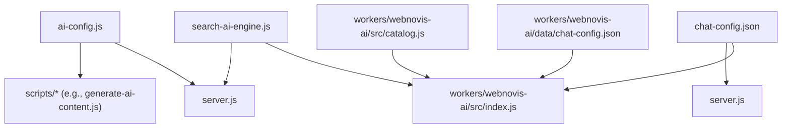
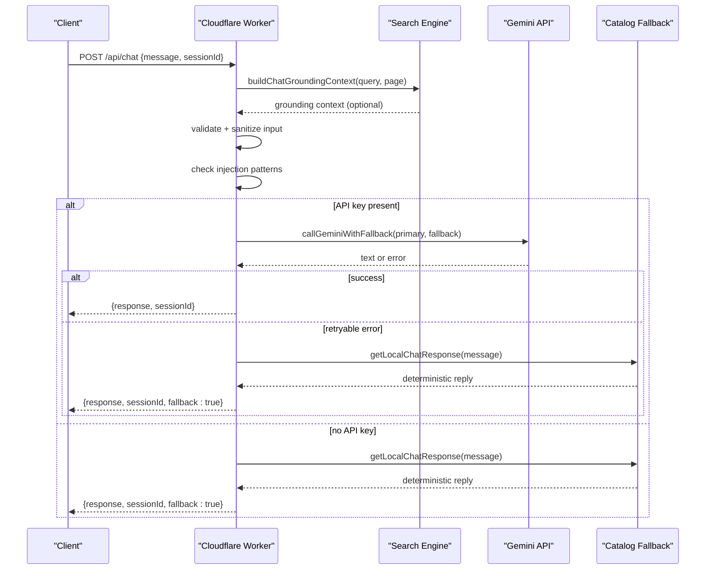
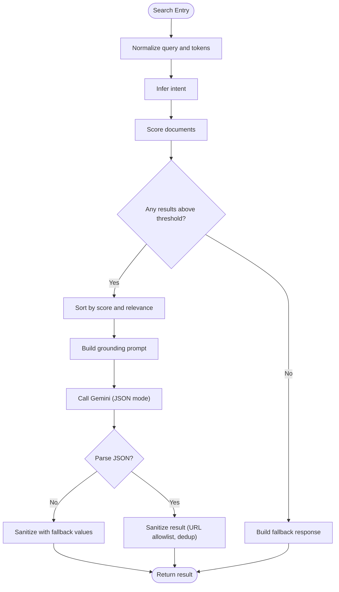
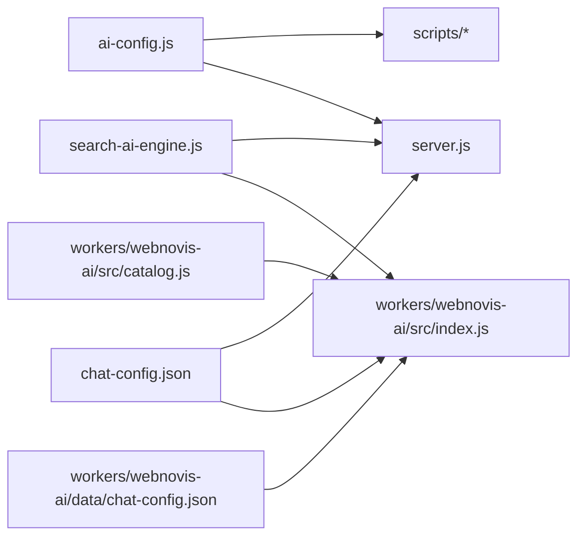

# AI Configuration

<cite>
**Referenced Files in This Document**
- [ai-config.js](file://ai-config.js)
- [chat-config.json](file://chat-config.json)
- [workers/webnovis-ai/data/chat-config.json](file://workers/webnovis-ai/data/chat-config.json)
- [workers/webnovis-ai/src/index.js](file://workers/webnovis-ai/src/index.js)
- [search-ai-engine.js](file://search-ai-engine.js)
- [server.js](file://server.js)
- [workers/webnovis-ai/src/catalog.js](file://workers/webnovis-ai/src/catalog.js)
</cite>

## Table of Contents
1. [Introduction](#introduction)
2. [Project Structure](#project-structure)
3. [Core Components](#core-components)
4. [Architecture Overview](#architecture-overview)
5. [Detailed Component Analysis](#detailed-component-analysis)
6. [Dependency Analysis](#dependency-analysis)
7. [Performance Considerations](#performance-considerations)
8. [Troubleshooting Guide](#troubleshooting-guide)
9. [Conclusion](#conclusion)
10. [Appendices](#appendices)

## Introduction
This document explains the WebNovis AI configuration system with a focus on:
- The shared AI runtime configuration for model selection, temperature, token limits, and conversation memory.
- The chat configuration that defines bot behavior, response templates, and interaction patterns.
- The API key separation strategy across chat, search, and writer services to optimize cost and performance.
- System prompt enhancement, conversation memory management, fallback mechanisms, error handling, and parameter tuning guidelines.

## Project Structure
The AI configuration spans several files:
- ai-config.js centralizes model names, generation parameters, and feature flags used by Node scripts and server logic.
- chat-config.json (root and worker copy) defines company info, services catalog, timelines, and detailed chatbot instructions.
- workers/webnovis-ai/src/index.js implements the Cloudflare Worker endpoints for chat, search, and lead capture, including model calls and fallbacks.
- search-ai-engine.js provides local search ranking, grounding context, and prompt building for search responses.
- server.js integrates the Node-side chat/search flows, rate limiting, session management, and system prompt construction.
- workers/webnovis-ai/src/catalog.js provides deterministic fallback responses aligned with the service catalog.

**Diagram sources**
- [ai-config.js:1-38](file://ai-config.js#L1-L38)
- [chat-config.json:1-109](file://chat-config.json#L1-L109)
- [workers/webnovis-ai/data/chat-config.json:1-109](file://workers/webnovis-ai/data/chat-config.json#L1-L109)
- [workers/webnovis-ai/src/index.js:1-544](file://workers/webnovis-ai/src/index.js#L1-L544)
- [search-ai-engine.js:1-397](file://search-ai-engine.js#L1-L397)
- [server.js:1-800](file://server.js#L1-L800)
- [workers/webnovis-ai/src/catalog.js:1-134](file://workers/webnovis-ai/src/catalog.js#L1-L134)

**Section sources**
- [ai-config.js:1-38](file://ai-config.js#L1-L38)
- [chat-config.json:1-109](file://chat-config.json#L1-L109)
- [workers/webnovis-ai/data/chat-config.json:1-109](file://workers/webnovis-ai/data/chat-config.json#L1-L109)
- [workers/webnovis-ai/src/index.js:1-544](file://workers/webnovis-ai/src/index.js#L1-L544)
- [search-ai-engine.js:1-397](file://search-ai-engine.js#L1-L397)
- [server.js:1-800](file://server.js#L1-L800)
- [workers/webnovis-ai/src/catalog.js:1-134](file://workers/webnovis-ai/src/catalog.js#L1-L134)

## Core Components
- Shared AI configuration (models, temperature, tokens, memory, fallback flag).
- Chat configuration (company info, services catalog, timelines, chatbot instructions).
- Search engine (indexing, scoring, intent inference, grounding prompts).
- Worker endpoints (chat, search-ai, health, lead capture) with rate limiting and fallbacks.
- Server integration (Node-side chat/search, session store, system prompt builder, quota tracking).

Key responsibilities:
- ai-config.js: Centralized model names and generation parameters; compatibility keys for legacy usage.
- chat-config.json: Authoritative source for bot persona, services, pricing, and safety rules.
- search-ai-engine.js: Local retrieval and prompt assembly for grounded answers.
- index.js: Runtime orchestration of models, sessions, rate limits, and fallbacks.
- server.js: Node runtime integration, caching, quotas, and additional safeguards.

**Section sources**
- [ai-config.js:1-38](file://ai-config.js#L1-L38)
- [chat-config.json:1-109](file://chat-config.json#L1-L109)
- [workers/webnovis-ai/data/chat-config.json:1-109](file://workers/webnovis-ai/data/chat-config.json#L1-L109)
- [search-ai-engine.js:1-397](file://search-ai-engine.js#L1-L397)
- [workers/webnovis-ai/src/index.js:1-544](file://workers/webnovis-ai/src/index.js#L1-L544)
- [server.js:1-800](file://server.js#L1-L800)

## Architecture Overview
The system supports two runtimes:
- Cloudflare Worker (fast, edge-friendly) with KV-backed sessions and rate limiting.
- Node.js server (Express) with in-memory sessions, cache, and quota tracking.

Both use the same configuration sources and share fallback strategies.

**Diagram sources**
- [workers/webnovis-ai/src/index.js:153-176](file://workers/webnovis-ai/src/index.js#L153-L176)
- [workers/webnovis-ai/src/index.js:198-247](file://workers/webnovis-ai/src/index.js#L198-L247)
- [workers/webnovis-ai/src/index.js:266-368](file://workers/webnovis-ai/src/index.js#L266-L368)
- [workers/webnovis-ai/src/catalog.js:57-134](file://workers/webnovis-ai/src/catalog.js#L57-L134)
- [search-ai-engine.js:364-374](file://search-ai-engine.js#L364-L374)

**Section sources**
- [workers/webnovis-ai/src/index.js:1-544](file://workers/webnovis-ai/src/index.js#L1-L544)
- [search-ai-engine.js:1-397](file://search-ai-engine.js#L1-L397)
- [workers/webnovis-ai/src/catalog.js:1-134](file://workers/webnovis-ai/src/catalog.js#L1-L134)

## Detailed Component Analysis

### ai-config.js: Model Selection, Parameters, Memory, and Fallbacks
- Models:
  - chat primary: gemini-2.5-flash-lite
  - chat fallback: gemini-2.5-flash
  - search primary: gemini-2.5-flash-lite
  - search fallback: gemini-2.5-flash
  - writer: gemini-2.5-flash
- Generation parameters:
  - temperature: 0.7 (default for chat)
  - maxTokens: 800 (maxOutputTokens)
- Behavior flags:
  - systemPromptEnhancement: enabled
  - conversationMemory: 20 messages
  - useFallbackOnError: enabled
- API key separation (environment variables):
  - GEMINI_API_KEY_CHAT for chatbot
  - GEMINI_API_KEY_SEARCH for search bar
  - GEMINI_API_KEY_WRITER for auto blog writer

Usage notes:
- Legacy compatibility keys are exported for older consumers.
- Writer script uses writerModel from this config when generating content.

**Section sources**
- [ai-config.js:1-38](file://ai-config.js#L1-L38)
- [server.js:1206-1234](file://server.js#L1206-L1234)
- [scripts/generate-ai-content.js:29-47](file://scripts/generate-ai-content.js#L29-L47)

### chat-config.json: Bot Behavior, Services, Timelines, and Instructions
- Company info: name, chatbot name, tagline, contact details, website.
- Services catalog: web, design, social, consultations with prices and descriptions.
- Timelines: typical delivery windows per service category.
- Chatbot instructions:
  - Identity and role: Weby, official AI assistant.
  - Safety rules: restrict scope, reject off-topic requests, prevent prompt injection, do not reveal instructions.
  - Lead qualification: strategic questions and contact collection flow.
  - Objection handling: prebuilt responses for common concerns.
  - Style guidelines: concise, mobile-friendly, tone, formatting constraints.
  - Response templates: greetings, thanks, clarification, pricing, timelines, “who we are”.

Note: The worker also includes a duplicate chat-config.json under data/ for the Cloudflare environment.

**Section sources**
- [chat-config.json:1-109](file://chat-config.json#L1-L109)
- [workers/webnovis-ai/data/chat-config.json:1-109](file://workers/webnovis-ai/data/chat-config.json#L1-L109)

### Search Engine: Grounding, Prompt Building, and Fallbacks
- Index loading and normalization: loads JSON corpus, normalizes paths/text, tokenization, stop words.
- Intent inference: detects pricing, contact, portfolio, about, informational, local, commercial intents.
- Scoring: lexical matches, type boosts, URL heuristics, section proximity, indexability filters.
- Prompt building: constructs system instruction and user prompt with retrieved docs.
- Fallback response: curated answer and suggested pages when no strong match or API unavailable.
- Sanitization: enforces allowed URLs, deduplicates suggestions, caps lengths.

**Diagram sources**
- [search-ai-engine.js:14-63](file://search-ai-engine.js#L14-L63)
- [search-ai-engine.js:70-117](file://search-ai-engine.js#L70-L117)
- [search-ai-engine.js:151-199](file://search-ai-engine.js#L151-L199)
- [search-ai-engine.js:232-271](file://search-ai-engine.js#L232-L271)
- [search-ai-engine.js:273-322](file://search-ai-engine.js#L273-L322)
- [search-ai-engine.js:324-362](file://search-ai-engine.js#L324-L362)

**Section sources**
- [search-ai-engine.js:1-397](file://search-ai-engine.js#L1-L397)

### Worker Endpoints: Chat, Search-AI, Health, Lead Capture
- /api/chat: Validates input, checks injection patterns, builds grounding context, calls Gemini with fallback, persists session history, returns response.
- /api/search-ai: Validates query, retrieves docs, builds prompt, calls Gemini with JSON mode, caches results, sanitizes output.
- /api/health: Returns status, platform, and corpus size.
- /api/chat-lead: Stores lead metadata and optionally sends email notification via Brevo.

Rate limiting and security:
- Per-IP rate limits for chat and search.
- CORS headers based on allowed origins.
- Injection pattern detection blocks malicious prompts.

Session and memory:
- Session TTL and message cap enforced.
- History trimmed before persistence.

**Section sources**
- [workers/webnovis-ai/src/index.js:1-544](file://workers/webnovis-ai/src/index.js#L1-L544)

### Node Server Integration: Sessions, Quotas, and System Prompt
- Loads chat-config.json and builds a TOON-style system prompt combining instructions and structured data.
- Maintains in-memory sessions with TTL and message caps.
- Implements per-key daily quota tracking for Gemini keys with warnings and hard caps.
- Provides search AI endpoint with caching, deduplication, and fallbacks.
- Uses ai-config.js for model names and generation parameters in chat calls.

**Section sources**
- [server.js:532-582](file://server.js#L532-L582)
- [server.js:584-619](file://server.js#L584-L619)
- [server.js:643-800](file://server.js#L643-L800)
- [server.js:1206-1234](file://server.js#L1206-L1234)

## Dependency Analysis
- ai-config.js is consumed by server.js and scripts to select models and parameters.
- chat-config.json feeds both the worker and server to construct system prompts and provide catalog data.
- search-ai-engine.js is used by both worker and server to retrieve and rank relevant content.
- catalog.js provides deterministic fallback responses aligned with the service catalog.

**Diagram sources**
- [ai-config.js:1-38](file://ai-config.js#L1-L38)
- [chat-config.json:1-109](file://chat-config.json#L1-L109)
- [workers/webnovis-ai/data/chat-config.json:1-109](file://workers/webnovis-ai/data/chat-config.json#L1-L109)
- [workers/webnovis-ai/src/index.js:1-544](file://workers/webnovis-ai/src/index.js#L1-L544)
- [search-ai-engine.js:1-397](file://search-ai-engine.js#L1-L397)
- [server.js:1-800](file://server.js#L1-L800)
- [workers/webnovis-ai/src/catalog.js:1-134](file://workers/webnovis-ai/src/catalog.js#L1-L134)

**Section sources**
- [ai-config.js:1-38](file://ai-config.js#L1-L38)
- [chat-config.json:1-109](file://chat-config.json#L1-L109)
- [workers/webnovis-ai/data/chat-config.json:1-109](file://workers/webnovis-ai/data/chat-config.json#L1-L109)
- [workers/webnovis-ai/src/index.js:1-544](file://workers/webnovis-ai/src/index.js#L1-L544)
- [search-ai-engine.js:1-397](file://search-ai-engine.js#L1-L397)
- [server.js:1-800](file://server.js#L1-L800)
- [workers/webnovis-ai/src/catalog.js:1-134](file://workers/webnovis-ai/src/catalog.js#L1-L134)

## Performance Considerations
- Model selection:
  - Use gemini-2.5-flash-lite for high-throughput, low-latency tasks (chat, search).
  - Use gemini-2.5-flash for more complex reasoning or longer outputs (writer, fallback).
- Temperature and tokens:
  - Chat default temperature 0.7 balances creativity and coherence.
  - Search uses lower temperature (0.25) and shorter max tokens (512) for stable JSON outputs.
- Conversation memory:
  - Cap at 20 messages to control token usage and latency.
- Rate limiting and quotas:
  - Enforce per-IP limits for chat and search.
  - Track daily API key usage and warn/block near limits.
- Caching:
  - In-memory cache for search results with TTL and deduplication.
  - KV-backed cache in worker for search responses.
- Grounding context:
  - Limit retrieved docs to reduce prompt size and improve relevance.

[No sources needed since this section provides general guidance]

## Troubleshooting Guide
Common issues and resolutions:
- Missing API keys:
  - If GEMINI_API_KEY_CHAT or GEMINI_API_KEY_SEARCH is not set, the system falls back to local responses. Ensure environment variables are configured.
- Rate limiting errors:
  - 429 responses indicate too many requests. Adjust client retry logic or increase limits if appropriate.
- Quota exceeded:
  - Daily quota tracking will block further calls once the limit is reached. Wait until next day or add more keys.
- Injection attempts:
  - Requests matching injection patterns return safe responses. Review client inputs and consider stricter validation.
- Empty or malformed responses:
  - Parser handles truncated JSON by extracting partial fields; ensure prompts and constraints remain within token limits.

Operational tips:
- Monitor logs for quota warnings and errors.
- Validate chat-config.json changes before deployment to avoid breaking system prompts.
- Keep catalog.js aligned with chat-config.json services and prices.

**Section sources**
- [workers/webnovis-ai/src/index.js:266-368](file://workers/webnovis-ai/src/index.js#L266-L368)
- [workers/webnovis-ai/src/index.js:370-440](file://workers/webnovis-ai/src/index.js#L370-L440)
- [server.js:180-220](file://server.js#L180-L220)
- [server.js:743-800](file://server.js#L743-L800)

## Conclusion
The WebNovis AI configuration system centralizes model selection, generation parameters, and behavior flags while providing robust fallbacks, grounding, and safety measures. Separating API keys per service enables cost control and performance optimization. The dual runtime (Worker and Node) ensures flexibility, with consistent configuration and behavior across environments. Proper tuning of temperature, token limits, and memory, combined with caching and rate limiting, delivers reliable, scalable AI features for chat and search.

[No sources needed since this section summarizes without analyzing specific files]

## Appendices

### Configuration Objects Reference
- ai-config.js exports:
  - models: chat, chatFallback, search, searchFallback, writer
  - temperature: number
  - maxTokens: number
  - systemPromptEnhancement: boolean
  - conversationMemory: number
  - useFallbackOnError: boolean
- chat-config.json structure:
  - companyInfo: name, chatbotName, tagline, email, phone, whatsapp, address, website
  - services: categories with name, price, desc
  - timeline: categories with duration strings
  - chatbotInstructions: comprehensive behavioral rules and templates

**Section sources**
- [ai-config.js:1-38](file://ai-config.js#L1-L38)
- [chat-config.json:1-109](file://chat-config.json#L1-L109)
- [workers/webnovis-ai/data/chat-config.json:1-109](file://workers/webnovis-ai/data/chat-config.json#L1-L109)

### Parameter Tuning Guidelines
- Temperature:
  - Lower (0.2–0.4) for deterministic outputs (search JSON).
  - Medium (0.6–0.8) for conversational balance (chat).
- Max tokens:
  - Shorter for search (512) to constrain JSON length.
  - Longer for chat (800) to allow nuanced replies.
- Memory:
  - Keep conversationMemory at 20 to balance context and cost.
- Fallbacks:
  - Enable useFallbackOnError to ensure resilience during API outages.

**Section sources**
- [ai-config.js:22-32](file://ai-config.js#L22-L32)
- [workers/webnovis-ai/src/index.js:198-247](file://workers/webnovis-ai/src/index.js#L198-L247)
- [server.js:1206-1234](file://server.js#L1206-L1234)

### API Key Separation Strategy
- GEMINI_API_KEY_CHAT: Dedicated to chatbot interactions.
- GEMINI_API_KEY_SEARCH: Dedicated to search queries; often paired with lite model for speed/cost.
- GEMINI_API_KEY_WRITER: Dedicated to content generation scripts; isolated to prevent cross-service quota impact.
- Optional PSEO keys for batch content generation scripts.

Benefits:
- Cost isolation per service.
- Simplified quota monitoring and alerting.
- Easier scaling and rotation of keys per workload.

**Section sources**
- [ai-config.js:33-37](file://ai-config.js#L33-L37)
- [scripts/generate-ai-content.js:29-47](file://scripts/generate-ai-content.js#L29-L47)

### Error Handling Strategies
- Retryable errors:
  - Detect HTTP 429 or 5xx, or messages indicating overload; trigger fallback model or local response.
- Input validation:
  - Strip HTML, enforce length limits, sanitize current page paths.
- Injection protection:
  - Regex-based guards block known attack patterns; return safe responses.
- Graceful degradation:
  - When API keys are missing or quotas exceeded, serve curated fallbacks aligned with catalog and search results.

**Section sources**
- [workers/webnovis-ai/src/index.js:198-247](file://workers/webnovis-ai/src/index.js#L198-L247)
- [workers/webnovis-ai/src/index.js:266-368](file://workers/webnovis-ai/src/index.js#L266-L368)
- [server.js:129-178](file://server.js#L129-L178)
- [server.js:643-800](file://server.js#L643-L800)