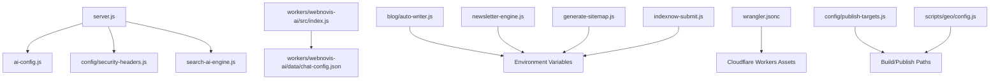
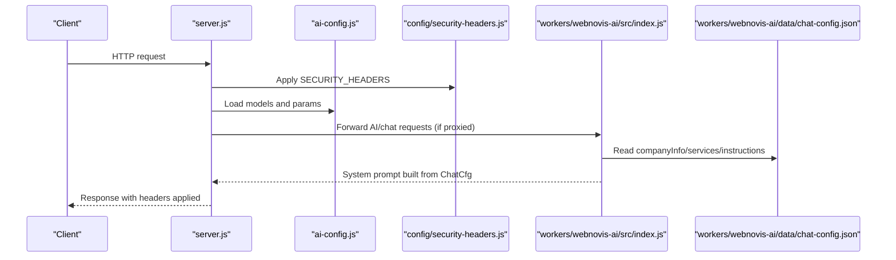
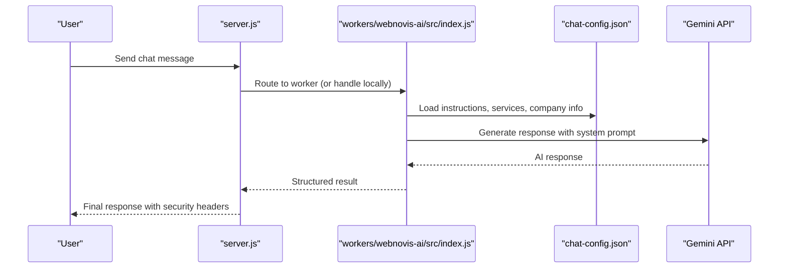
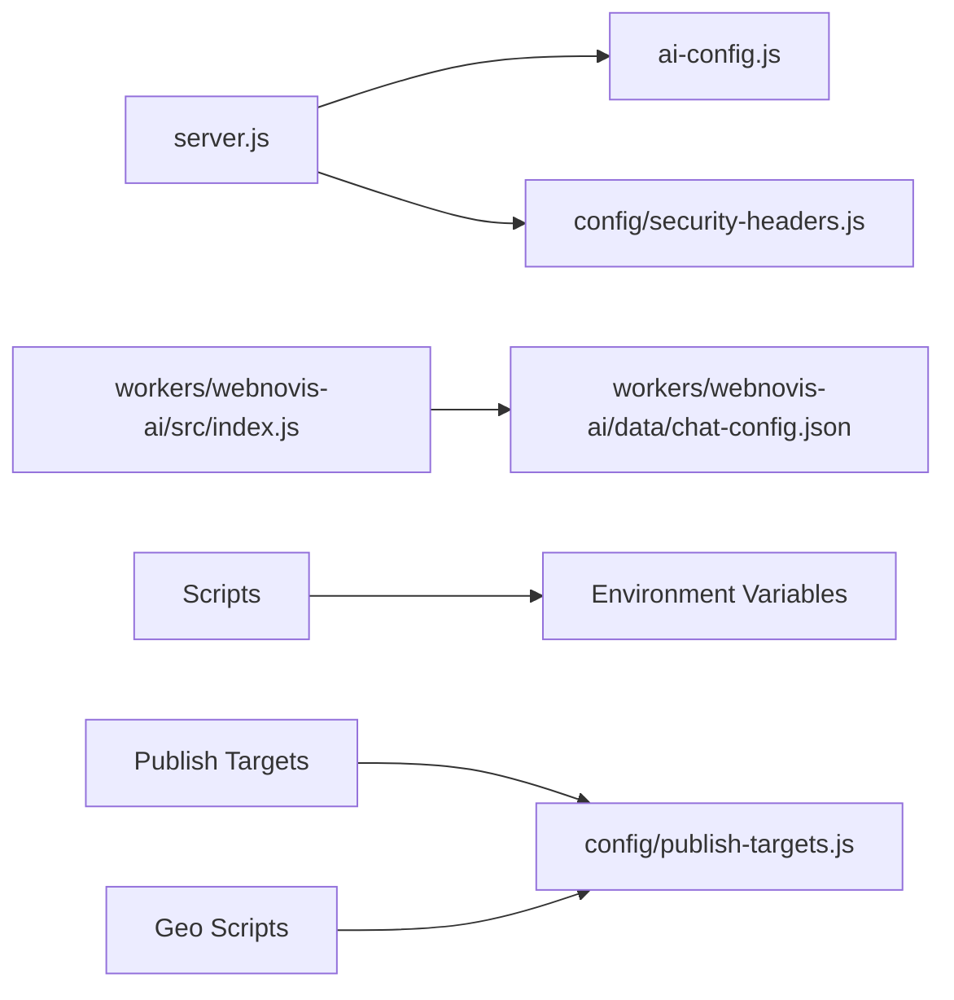

# Configuration Management

<cite>
**Referenced Files in This Document**
- [ai-config.js](file://ai-config.js)
- [chat-config.json](file://chat-config.json)
- [workers/webnovis-ai/data/chat-config.json](file://workers/webnovis-ai/data/chat-config.json)
- [server.js](file://server.js)
- [config/security-headers.js](file://config/security-headers.js)
- [wrangler.jsonc](file://wrangler.jsonc)
- [workers/webnovis-ai/.dev.vars.example](file://workers/webnovis-ai/.dev.vars.example)
- [tests/security-and-legal-regressions.test.js](file://tests/security-and-legal-regressions.test.js)
- [scripts/geo/config.js](file://scripts/geo/config.js)
- [config/publish-targets.js](file://config/publish-targets.js)
- [blog/auto-writer.js](file://blog/auto-writer.js)
- [newsletter-engine.js](file://newsletter-engine.js)
- [generate-sitemap.js](file://generate-sitemap.js)
- [indexnow-submit.js](file://indexnow-submit.js)
</cite>

## Table of Contents
1. Introduction
2. Project Structure
3. Core Components
4. Architecture Overview
5. Detailed Component Analysis
6. Dependency Analysis
7. Performance Considerations
8. Troubleshooting Guide
9. Conclusion

## Introduction
This document explains the WebNovis configuration management system with a focus on AI model settings, chatbot behavior, environment-specific configurations, secrets handling, and deployment-related settings. It describes how configuration values are organized, where defaults live, how overrides work at runtime, and how to safely manage secrets across local development, build scripts, server processes, and Cloudflare Workers.

## Project Structure
Configuration is split into three main areas:
- AI runtime configuration (model selection and generation parameters)
- Chatbot content and behavior (company info, services catalog, instructions)
- Environment and deployment configuration (API keys, CORS, publish targets, headers)

**Diagram sources**
- [server.js:1-20](file://server.js#L1-L20)
- [ai-config.js:1-38](file://ai-config.js#L1-L38)
- [config/security-headers.js:1-113](file://config/security-headers.js#L1-L113)
- [workers/webnovis-ai/src/index.js:153-186](file://workers/webnovis-ai/src/index.js#L153-L186)
- [workers/webnovis-ai/data/chat-config.json:1-109](file://workers/webnovis-ai/data/chat-config.json#L1-L109)
- [blog/auto-writer.js:44-45](file://blog/auto-writer.js#L44-L45)
- [newsletter-engine.js:49-195](file://newsletter-engine.js#L49-L195)
- [generate-sitemap.js:164-168](file://generate-sitemap.js#L164-L168)
- [indexnow-submit.js:39-39](file://indexnow-submit.js#LL39-L39)
- [wrangler.jsonc:1-30](file://wrangler.jsonc#L1-L30)
- [config/publish-targets.js:1-37](file://config/publish-targets.js#L1-L37)
- [scripts/geo/config.js:42-47](file://scripts/geo/config.js#L42-L47)

**Section sources**
- [server.js:1-20](file://server.js#L1-L20)
- [ai-config.js:1-38](file://ai-config.js#L1-L38)
- [config/security-headers.js:1-113](file://config/security-headers.js#L1-L113)
- [wrangler.jsonc:1-30](file://wrangler.jsonc#L1-L30)

## Core Components
- AI model configuration: centralizes model names, fallbacks, generation parameters, and feature toggles for AI features.
- Chatbot configuration: defines company details, service catalog, timelines, and the system prompt that drives chat behavior.
- Security and CORS configuration: centralized security headers and dynamic CORS origin resolution from environment variables.
- Deployment configuration: Cloudflare Workers assets setup and build/publish path resolution via CLI args and environment variables.

Key responsibilities:
- ai-config.js: model selection, temperature, token limits, memory window, fallback behavior, and API key separation guidance.
- chat-config.json: business-facing data and strict chatbot instructions used by both Node server and Workers.
- config/security-headers.js: default CSP, HSTS, X-Frame-Options, Permissions-Policy, and helper functions to derive allowed CORS origins from environment.
- wrangler.jsonc: static asset directory and HTML handling policy for Cloudflare Pages/Workers.
- config/publish-targets.js and scripts/geo/config.js: resolve output/report directories using CLI flags or environment variables.

**Section sources**
- [ai-config.js:1-38](file://ai-config.js#L1-L38)
- [chat-config.json:1-109](file://chat-config.json#L1-L109)
- [workers/webnovis-ai/data/chat-config.json:1-109](file://workers/webnovis-ai/data/chat-config.json#L1-L109)
- [config/security-headers.js:1-113](file://config/security-headers.js#L1-L113)
- [wrangler.jsonc:1-30](file://wrangler.jsonc#L1-L30)
- [config/publish-targets.js:1-37](file://config/publish-targets.js#L1-L37)
- [scripts/geo/config.js:42-47](file://scripts/geo/config.js#L42-L47)

## Architecture Overview
The system loads configuration at different layers:
- Server boot: loads environment variables, imports shared AI config, applies security headers, and sets up rate limiting and admin auth.
- Chat flow: builds a system prompt from chatbot instructions and service/company data; persists session history when available.
- Workers: read chat configuration from a dedicated JSON file and construct prompts similarly to the server.
- Build/deploy: use environment variables and CLI arguments to determine publish/report directories and apply static headers.

**Diagram sources**
- [server.js:1-20](file://server.js#L1-L20)
- [config/security-headers.js:40-62](file://config/security-headers.js#L40-L62)
- [ai-config.js:1-38](file://ai-config.js#L1-L38)
- [workers/webnovis-ai/src/index.js:153-186](file://workers/webnovis-ai/src/index.js#L153-L186)
- [workers/webnovis-ai/data/chat-config.json:1-109](file://workers/webnovis-ai/data/chat-config.json#L1-L109)

## Detailed Component Analysis

### AI Model Configuration (ai-config.js)
- Centralized model registry for chat, search, and writer roles with explicit fallback models.
- Generation parameters: temperature and maxTokens control creativity and response length.
- Behavior toggles: system prompt enhancement flag, conversation memory size, and fallback usage on errors.
- API key separation guidance: distinct environment variables per role to distribute quotas and reduce risk.

Usage patterns:
- Imported by server to select models and tune generation.
- Used by scripts and workers indirectly through environment-driven model selection.

Override mechanism:
- Defaults are defined in code; environment variables can override behavior in consuming modules (e.g., separate API keys per role).

Security considerations:
- Keep API keys out of source control; rely on environment variables documented in examples.

**Section sources**
- [ai-config.js:1-38](file://ai-config.js#L1-L38)
- [server.js:1-20](file://server.js#L1-L20)

### Chatbot Configuration (chat-config.json)
- Company info: name, contact details, website, and tagline.
- Services catalog: structured pricing and descriptions for web, design, social, and consulting services.
- Timelines: expected delivery windows per service category.
- Chatbot instructions: strict behavioral rules, safety constraints, lead qualification flows, objection handling, and tone guidelines.

Runtime integration:
- Server constructs a system prompt by combining instructions with structured company/service data.
- Workers read the same structure to build consistent prompts in edge environments.

Validation and consistency:
- The chatbot instructions enforce scope boundaries and prohibit revealing internal prompts or inventing data not present in the configuration.

**Section sources**
- [chat-config.json:1-109](file://chat-config.json#L1-L109)
- [workers/webnovis-ai/data/chat-config.json:1-109](file://workers/webnovis-ai/data/chat-config.json#L1-L109)
- [server.js:541-576](file://server.js#L541-L576)
- [workers/webnovis-ai/src/index.js:153-186](file://workers/webnovis-ai/src/index.js#L153-L186)

### Environment Variables and Secrets Management
- dotenv is loaded at server startup to populate process.env.
- Admin secret for protected endpoints is read from environment and enforced with timing-safe comparison.
- API keys for Gemini, Groq, Brevo, PageSpeed, and IndexNow are consumed from environment variables across scripts and services.
- Example dev variables are provided for Workers; production should use platform secret managers.

Best practices:
- Never commit secrets; use .env files locally and platform-provided secrets in CI/CD.
- Rotate keys regularly and segregate by purpose (chat, search, writer, newsletter).

Examples of environment usage:
- Newsletter admin secret for protected routes.
- Gemini keys for chat and search with per-key daily quota monitoring.
- Brevo keys and sender identity for email operations.
- PageSpeed and IndexNow keys for performance and indexing tools.

**Section sources**
- [server.js:1-20](file://server.js#L1-L20)
- [server.js:75-93](file://server.js#L75-L93)
- [server.js:180-200](file://server.js#L180-L200)
- [blog/auto-writer.js:44-45](file://blog/auto-writer.js#L44-L45)
- [newsletter-engine.js:49-195](file://newsletter-engine.js#L49-L195)
- [scripts/run-pagespeed-api.js:25-27](file://scripts/run-pagespeed-api.js#L25-L27)
- [indexnow-submit.js:39-39](file://indexnow-submit.js#L39-L39)
- [workers/webnovis-ai/.dev.vars.example:1-8](file://workers/webnovis-ai/.dev.vars.example#L1-L8)

### Security Headers and CORS
- Centralized security headers include HSTS, X-Content-Type-Options, X-Frame-Options, CSP, Referrer-Policy, and Permissions-Policy.
- Dynamic CSP with nonce support is available; tests assert server uses shared header helpers and does not leak nonce implementation details.
- Allowed CORS origins are derived from defaults plus an environment variable list, parsed and deduplicated.

Operational notes:
- Static headers file can be generated for platforms supporting _headers.
- Tests verify that server integrates the shared security configuration correctly.

**Section sources**
- [config/security-headers.js:1-113](file://config/security-headers.js#L1-L113)
- [tests/security-and-legal-regressions.test.js:13-39](file://tests/security-and-legal-regressions.test.js#L13-L39)

### Deployment Configuration (Cloudflare Workers and Publish Targets)
- Cloudflare Workers assets are configured to serve the dist directory with explicit HTML handling to avoid unwanted redirects.
- Publish and report directories are resolved via CLI arguments or environment variables, enabling flexible build pipelines.
- Geo scripts also respect these paths for consistent artifact outputs.

Deployment tips:
- Use dry-run checks before deploying to validate configuration.
- Ensure only public artifacts are included in the deploy bundle.

**Section sources**
- [wrangler.jsonc:1-30](file://wrangler.jsonc#L1-L30)
- [config/publish-targets.js:1-37](file://config/publish-targets.js#L1-L37)
- [scripts/geo/config.js:42-47](file://scripts/geo/config.js#L42-L47)

### Feature Flags, A/B Testing, and Experimental Features
- Feature toggles are represented by boolean flags in AI configuration (e.g., system prompt enhancement, fallback usage).
- Conversation memory size acts as a tunable parameter for multi-turn interactions.
- No explicit A/B testing framework is present; experiments can be implemented by branching logic based on environment variables or configuration flags.

Recommendations:
- Introduce a feature flags module to centralize toggles and expose them consistently across server and workers.
- For A/B testing, add environment-based switches and track outcomes via analytics events.

**Section sources**
- [ai-config.js:22-32](file://ai-config.js#L22-L32)

### Data Flow: Chat Request to AI Response

**Diagram sources**
- [server.js:541-576](file://server.js#L541-L576)
- [workers/webnovis-ai/src/index.js:153-186](file://workers/webnovis-ai/src/index.js#L153-L186)
- [workers/webnovis-ai/data/chat-config.json:1-109](file://workers/webnovis-ai/data/chat-config.json#L1-L109)

## Dependency Analysis
- server.js depends on ai-config.js for model selection and on config/security-headers.js for secure responses.
- Workers depend on chat-config.json for business context and instructions.
- Scripts consume environment variables for external integrations (Gemini, Groq, Brevo, PageSpeed, IndexNow).
- Build utilities resolve publish/report directories from CLI and environment, decoupling build outputs from repository layout.

**Diagram sources**
- [server.js:1-20](file://server.js#L1-L20)
- [ai-config.js:1-38](file://ai-config.js#L1-L38)
- [config/security-headers.js:1-113](file://config/security-headers.js#L1-L113)
- [workers/webnovis-ai/src/index.js:153-186](file://workers/webnovis-ai/src/index.js#L153-L186)
- [workers/webnovis-ai/data/chat-config.json:1-109](file://workers/webnovis-ai/data/chat-config.json#L1-L109)
- [config/publish-targets.js:1-37](file://config/publish-targets.js#L1-L37)
- [scripts/geo/config.js:42-47](file://scripts/geo/config.js#L42-L47)

**Section sources**
- [server.js:1-20](file://server.js#L1-L20)
- [config/publish-targets.js:1-37](file://config/publish-targets.js#L1-L37)
- [scripts/geo/config.js:42-47](file://scripts/geo/config.js#L42-L47)

## Performance Considerations
- Pre-warm network fetch to reduce cold-start latency in server processes.
- Use lightweight models for search tasks to minimize cost and latency.
- Limit conversation memory to balance context quality with token usage.
- Apply caching strategies via static headers for assets and pages.

[No sources needed since this section provides general guidance]

## Troubleshooting Guide
Common issues and resolutions:
- Missing or invalid API keys: ensure all required environment variables are set in the runtime environment; check example files for reference.
- CORS failures: verify CORS_ORIGINS includes your frontend domain; use the shared helper to parse and merge defaults.
- Rate limiting errors: confirm express-rate-limit is installed in production; adjust thresholds if necessary.
- Admin endpoint authentication failures: ensure NEWSLETTER_ADMIN_SECRET is configured and clients send the correct header value.
- Build output misplacement: set PUBLISH_DIR or REPORT_DIR appropriately; use CLI flags to override defaults.

Debugging techniques:
- Log environment presence without exposing secrets.
- Validate configuration at startup and fail fast on critical missing values.
- Use tests to assert server integration with shared security configuration and environment documentation.

**Section sources**
- [server.js:75-93](file://server.js#L75-L93)
- [server.js:95-107](file://server.js#L95-L107)
- [config/security-headers.js:50-62](file://config/security-headers.js#L50-L62)
- [workers/webnovis-ai/.dev.vars.example:1-8](file://workers/webnovis-ai/.dev.vars.example#L1-L8)
- [tests/security-and-legal-regressions.test.js:13-39](file://tests/security-and-legal-regressions.test.js#L13-L39)

## Conclusion
WebNovis separates concerns across AI model configuration, chatbot behavior, security headers, and deployment settings. Environment variables provide flexible overrides for secrets and runtime behavior, while centralized configuration modules ensure consistency between server and workers. Following the recommended practices—segregating secrets, validating configuration early, and using shared helpers for security and CORS—will improve reliability, security, and maintainability across environments.

[No sources needed since this section summarizes without analyzing specific files]